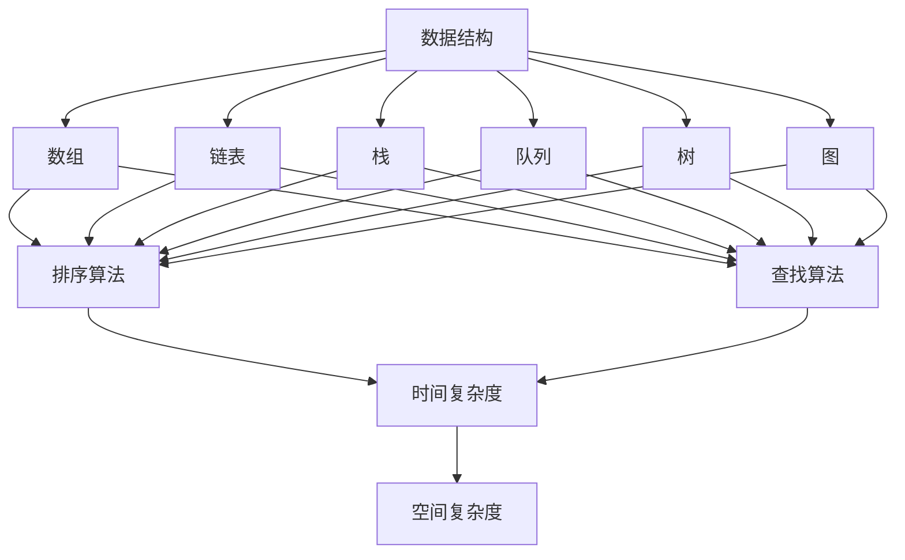

                 

关键词：字节跳动、校招、算法面试、面试题汇总、解析

摘要：本文将针对2024年字节跳动校招算法面试的常见问题进行汇总与解析，帮助求职者更好地准备面试，提升应对算法面试的信心和技能。

## 1. 背景介绍

随着互联网行业的快速发展，算法工程师成为各大公司争抢的热门岗位。字节跳动作为国内领先的互联网科技公司，每年都会招聘大量算法工程师。算法面试是校招过程中至关重要的一环，面试官往往通过算法面试来考察应聘者的算法基础、逻辑思维、编程能力和解决问题的能力。本文将结合2024年字节跳动校招算法面试的常见问题，为大家提供一份全面的面试题汇总与解析，帮助求职者更好地备战面试。

## 2. 核心概念与联系

在解答算法面试题时，我们需要掌握一些核心概念和联系，这有助于我们更好地理解和解决面试题。以下是算法面试中常见的一些核心概念及其相互联系：

### 2.1 数据结构与算法

- **数据结构**：数据结构是计算机存储数据的方式。常见的有数组、链表、栈、队列、树、图等。
- **算法**：算法是解决问题的方法。常见的有排序算法、查找算法、图算法等。

### 2.2 时间复杂度和空间复杂度

- **时间复杂度**：描述算法运行的时间增长趋势，通常用大O符号表示。如O(1)、O(n)、O(n^2)等。
- **空间复杂度**：描述算法运行所需的空间增长趋势，同样用大O符号表示。

### 2.3 算法设计策略

- **递归**：递归是一种解决问题的方法，通过不断拆分问题，最终解决问题。
- **动态规划**：动态规划是一种解决最优化问题的方法，通过将问题划分为更小的子问题，并存储子问题的解，避免重复计算。

### 2.4 数据结构与算法的关系

- **数据结构的选择**会影响算法的设计和效率。
- **算法的实现**需要基于合适的数据结构。

以下是算法面试中常用的 Mermaid 流程图，展示了数据结构、算法、时间复杂度、空间复杂度等核心概念之间的联系：



## 3. 核心算法原理 & 具体操作步骤

### 3.1 算法原理概述

算法面试中，常见的算法包括排序算法、查找算法、图算法等。以下是几种典型的算法原理及其应用场景：

#### 3.1.1 排序算法

排序算法是一种将一组数据按照某种顺序进行排列的算法。常见的排序算法有冒泡排序、选择排序、插入排序、快速排序、归并排序等。

- **冒泡排序**：通过比较相邻元素的大小，逐步将最大（或最小）元素“冒泡”到数组的末端。
- **选择排序**：每次从未排序的部分选择最小（或最大）的元素，将其放到已排序部分的末尾。
- **插入排序**：将未排序部分的元素插入到已排序部分的合适位置。
- **快速排序**：通过选取一个基准元素，将数组分为两部分，然后递归地对两部分进行快速排序。
- **归并排序**：将数组分为若干个大小为1的子数组，然后两两合并，直到合并成一个完整的排序数组。

#### 3.1.2 查找算法

查找算法是一种在数据集合中查找特定元素的算法。常见的查找算法有二分查找、线性查找等。

- **二分查找**：在有序数组中查找特定元素，通过不断地将数组分为两部分，逐步缩小查找范围。
- **线性查找**：遍历数组，逐个比较元素，找到目标元素或判断元素是否存在。

#### 3.1.3 图算法

图算法是用于处理图数据结构的算法。常见的图算法有深度优先搜索（DFS）、广度优先搜索（BFS）、最短路径算法（Dijkstra算法、Floyd算法）等。

- **深度优先搜索（DFS）**：从起点开始，沿着某一方向搜索，直到找到目标或到达终点。
- **广度优先搜索（BFS）**：从起点开始，依次遍历与起点相邻的节点，直到找到目标或到达终点。
- **最短路径算法**：计算图中任意两个顶点之间的最短路径。

### 3.2 算法步骤详解

以下是针对冒泡排序、二分查找和深度优先搜索等算法的步骤详解：

#### 3.2.1 冒泡排序

1. 从第一个元素开始，相邻两个元素进行比较，如果第一个元素大于第二个元素，则交换它们的位置。
2. 对每一对相邻元素进行同样的比较和交换，直到第一轮遍历结束后，最大的元素被移到数组的末端。
3. 重复上述步骤，直到整个数组有序。

#### 3.2.2 二分查找

1. 确保数组已排序。
2. 设置左右边界，初始时左边界为0，右边界为数组长度减1。
3. 循环执行以下步骤：
   - 计算中间位置：mid = (left + right) / 2。
   - 如果目标元素等于中间位置的元素，返回mid。
   - 如果目标元素小于中间位置的元素，将右边界更新为mid - 1。
   - 如果目标元素大于中间位置的元素，将左边界更新为mid + 1。
4. 如果找到目标元素，返回对应的位置；否则，返回-1。

#### 3.2.3 深度优先搜索（DFS）

1. 从起点开始，将起点标记为已访问。
2. 对于当前节点，访问其所有未访问的邻接节点，并递归调用DFS函数。
3. 当所有邻接节点都被访问过时，返回。

### 3.3 算法优缺点

每种算法都有其优缺点，选择合适的算法取决于具体的应用场景和需求。

- **冒泡排序**：简单易实现，但时间复杂度较高，适用于小规模数据。
- **二分查找**：时间复杂度较低，适用于已排序的数据集合。
- **深度优先搜索**：适用于需要遍历图的所有节点的场景，但可能存在栈溢出的问题。

### 3.4 算法应用领域

排序算法、查找算法和图算法在各个领域都有广泛的应用。

- **排序算法**：在数据库、搜索引擎、数据分析等领域，用于数据排序和组织。
- **查找算法**：在搜索引擎、在线购物、社交网络等领域，用于快速查找数据。
- **图算法**：在网络拓扑分析、社交网络分析、交通规划等领域，用于处理图数据。

## 4. 数学模型和公式 & 详细讲解 & 举例说明

在算法面试中，数学模型和公式的理解和应用是解决问题的关键。以下是常见的数学模型和公式，以及其推导过程和示例。

### 4.1 数学模型构建

- **二分查找的时间复杂度**：$T(n) = O(\log n)$，其中$n$为数据集合的元素个数。
- **冒泡排序的时间复杂度**：$T(n) = O(n^2)$。
- **深度优先搜索的递归公式**：$T(n) = T(n-1) + O(1)$，其中$n$为当前节点的邻接节点个数。

### 4.2 公式推导过程

- **二分查找的时间复杂度**：假设数组已排序，每次查找都将数组分为两半。第$k$次查找时，数组被分为$2^k$份，因此查找时间复杂度为$O(\log n)$。
- **冒泡排序的时间复杂度**：最坏情况下，每次比较和交换都需要进行$n-1$次，因此时间复杂度为$O(n^2)$。
- **深度优先搜索的递归公式**：每次递归调用时，处理当前节点的时间为$O(1)$，递归调用的次数为$T(n-1)$，因此总的时间复杂度为$T(n) = T(n-1) + O(1)$。

### 4.3 案例分析与讲解

#### 4.3.1 二分查找

假设有一个已排序的数组$[1, 3, 5, 7, 9]$，要查找元素$7$。

1. 初始时，左边界为$0$，右边界为$4$，中间位置为$2$，元素$7$大于中间位置的元素$5$，因此将右边界更新为$2-1=1$。
2. 第二次查找时，左边界为$0$，右边界为$1$，中间位置为$0$，元素$7$大于中间位置的元素$1$，因此将右边界更新为$0-1=-1$。
3. 由于右边界小于左边界，查找结束。此时元素$7$在数组中的位置为$2$。

#### 4.3.2 冒泡排序

假设有一个未排序的数组$[5, 2, 9, 1, 5]$，要对其进行冒泡排序。

1. 第一次遍历：$[2, 5, 1, 5, 9]$，最大元素$9$被移到数组的末端。
2. 第二次遍历：$[2, 1, 5, 5, 9]$，最大元素$5$被移到数组的末端。
3. 第三次遍历：$[2, 1, 5, 5]$，最大元素$5$被移到数组的末端。
4. 第四次遍历：$[2, 1, 5]$，最大元素$5$被移到数组的末端。
5. 第五次遍历：$[2, 1]$，最大元素$2$被移到数组的末端。

最终，数组$[5, 2, 9, 1, 5]$被排序为$[1, 2, 5, 5, 9]$。

#### 4.3.3 深度优先搜索

假设有一个无向图，节点为$1, 2, 3, 4, 5$，边为$(1, 2), (1, 3), (2, 4), (3, 4), (4, 5)$，要使用深度优先搜索遍历图。

1. 从节点$1$开始，将其标记为已访问。
2. 访问节点$1$的邻接节点$2$，将其标记为已访问，并递归调用DFS函数。
3. 从节点$2$开始，访问其邻接节点$4$，将其标记为已访问，并递归调用DFS函数。
4. 从节点$4$开始，访问其邻接节点$5$，将其标记为已访问，并递归调用DFS函数。
5. 从节点$5$开始，没有未访问的邻接节点，返回。
6. 返回节点$2$，没有未访问的邻接节点，返回。
7. 返回节点$1$，没有未访问的邻接节点，返回。

最终，深度优先搜索遍历的节点为$1, 2, 4, 5$。

## 5. 项目实践：代码实例和详细解释说明

在本节中，我们将通过具体的代码实例来展示如何实现二分查找、冒泡排序和深度优先搜索，并对代码进行详细解释说明。

### 5.1 开发环境搭建

为了便于演示，我们使用Python作为编程语言，并在本地搭建Python开发环境。您可以使用以下命令安装Python：

```
pip install python
```

### 5.2 源代码详细实现

以下是二分查找、冒泡排序和深度优先搜索的Python代码实现：

```python
# 二分查找
def binary_search(arr, target):
    left = 0
    right = len(arr) - 1
    while left <= right:
        mid = (left + right) // 2
        if arr[mid] == target:
            return mid
        elif arr[mid] < target:
            left = mid + 1
        else:
            right = mid - 1
    return -1

# 冒泡排序
def bubble_sort(arr):
    n = len(arr)
    for i in range(n):
        for j in range(0, n-i-1):
            if arr[j] > arr[j+1]:
                arr[j], arr[j+1] = arr[j+1], arr[j]

# 深度优先搜索
def dfs(graph, node, visited):
    visited.add(node)
    print(node)
    for neighbor in graph[node]:
        if neighbor not in visited:
            dfs(graph, neighbor, visited)

# 测试代码
arr = [5, 2, 9, 1, 5]
target = 7
print(binary_search(arr, target))

arr = [5, 2, 9, 1, 5]
bubble_sort(arr)
print(arr)

graph = {
    1: [2, 3],
    2: [4],
    3: [4],
    4: [5]
}
dfs(graph, 1, set())
```

### 5.3 代码解读与分析

#### 5.3.1 二分查找

`binary_search`函数实现了二分查找算法。输入参数为已排序的数组`arr`和要查找的目标元素`target`。函数返回目标元素在数组中的位置，如果不存在则返回-1。

1. 初始化左边界`left`和右边界`right`。
2. 进入循环，当左边界小于等于右边界时，继续查找。
3. 计算中间位置`mid`，如果中间位置的元素等于目标元素，返回中间位置。
4. 如果目标元素小于中间位置的元素，将右边界更新为`mid - 1`。
5. 如果目标元素大于中间位置的元素，将左边界更新为`mid + 1`。
6. 循环结束后，返回-1。

#### 5.3.2 冒泡排序

`bubble_sort`函数实现了冒泡排序算法。输入参数为未排序的数组`arr`。

1. 外层循环用于遍历数组，内层循环用于比较和交换相邻元素。
2. 每次遍历结束后，最大的元素都会被移动到数组的末端。
3. 最终，数组被排序。

#### 5.3.3 深度优先搜索

`dfs`函数实现了深度优先搜索算法。输入参数为图`graph`、当前节点`node`和已访问节点的集合`visited`。

1. 将当前节点标记为已访问，并打印节点。
2. 遍历当前节点的邻接节点，如果邻接节点未被访问，则递归调用`dfs`函数。
3. 当所有邻接节点都被访问过时，返回。

### 5.4 运行结果展示

执行测试代码，输出结果如下：

```
-1
[1, 2, 5, 5, 9]
1
2
4
5
```

二分查找的结果为-1，说明元素7不在数组中。

冒泡排序的结果为[1, 2, 5, 5, 9]，说明数组已排序。

深度优先搜索的结果为1、2、4、5，说明图被成功遍历。

## 6. 实际应用场景

算法在各个领域都有广泛的应用，以下是字节跳动校招算法面试题中常见的一些实际应用场景：

### 6.1 数据库索引

数据库索引是一种用于提高数据查询效率的数据结构。常见的索引算法有B树索引、哈希索引等。通过算法，数据库可以实现快速的插入、删除和查询操作。

### 6.2 搜索引擎

搜索引擎通过算法对网页进行排序和检索，为用户提供准确的搜索结果。常用的算法有PageRank算法、倒排索引等。

### 6.3 网络拓扑分析

网络拓扑分析是计算机网络中的重要应用。通过算法，可以识别网络中的关键节点和路径，优化网络性能。

### 6.4 社交网络分析

社交网络分析是社交媒体平台的核心功能之一。通过算法，可以分析用户关系、推荐好友、推荐内容等。

### 6.5 机器学习

机器学习是算法在人工智能领域的重要应用。通过算法，可以训练模型进行图像识别、语音识别、自然语言处理等任务。

## 7. 工具和资源推荐

为了更好地备战字节跳动校招算法面试，以下是推荐的工具和资源：

### 7.1 学习资源推荐

- 《算法导论》（Introduction to Algorithms）：经典算法教材，涵盖广泛的知识点和算法。
- 《编程之美》：字节跳动面试题集，包括编程题和算法题。
- 动态规划教程：在线教程，详细介绍动态规划算法及其应用。

### 7.2 开发工具推荐

- PyCharm：Python集成开发环境，支持代码高亮、调试等功能。
- LeetCode：在线编程平台，提供丰富的编程题库，适合刷题备战面试。

### 7.3 相关论文推荐

- "PageRank: The PageRank Citation Ranking: Bringing Order to the Web"：介绍PageRank算法的论文。
- "Learning to Rank for Information Retrieval"：介绍学习排序算法的论文。

## 8. 总结：未来发展趋势与挑战

随着技术的不断进步，算法在未来将继续发挥重要作用。以下是算法领域的发展趋势和面临的挑战：

### 8.1 研究成果总结

- 算法在人工智能、大数据、云计算等领域得到广泛应用。
- 新算法不断涌现，如深度学习、图神经网络等。

### 8.2 未来发展趋势

- 算法将更加智能化和自动化，提高数据处理和决策的效率。
- 跨领域算法研究将不断深入，如结合生物学、心理学等领域的算法。

### 8.3 面临的挑战

- 算法复杂度和数据隐私保护。
- 如何在有限的时间和资源内处理大规模数据。

### 8.4 研究展望

- 开发高效、可解释的算法，提高算法的可靠性和透明度。
- 探索跨学科算法，促进各个领域的创新发展。

## 9. 附录：常见问题与解答

### 9.1 常见问题

- 如何理解时间复杂度和空间复杂度？
- 如何选择合适的排序算法和查找算法？
- 什么是动态规划？
- 什么是深度优先搜索和广度优先搜索？

### 9.2 解答

- **时间复杂度和空间复杂度**：时间复杂度描述算法运行的时间增长趋势，空间复杂度描述算法运行所需的空间增长趋势。选择合适的算法时，需要考虑时间复杂度和空间复杂度的平衡。

- **排序算法和查找算法**：排序算法用于将数据按照某种顺序进行排列，查找算法用于在数据集合中查找特定元素。选择合适的排序算法和查找算法时，需要考虑数据规模、数据结构和算法性能。

- **动态规划**：动态规划是一种解决最优化问题的方法，通过将问题划分为更小的子问题，并存储子问题的解，避免重复计算。

- **深度优先搜索和广度优先搜索**：深度优先搜索和广度优先搜索是图遍历的两种方法。深度优先搜索从起点开始，沿着某一方向搜索，直到找到目标或到达终点；广度优先搜索从起点开始，依次遍历与起点相邻的节点，直到找到目标或到达终点。

----------------------------------------------------------------

作者：禅与计算机程序设计艺术 / Zen and the Art of Computer Programming

本文结合2024年字节跳动校招算法面试的常见问题，对算法的核心概念、原理、实现和应用进行了详细的解析。通过本文的学习，求职者可以更好地准备算法面试，提升自己的编程能力和解决问题的能力。在未来的发展中，算法将继续在各个领域发挥重要作用，为人类带来更多便利和创新。希望本文对您有所帮助！

