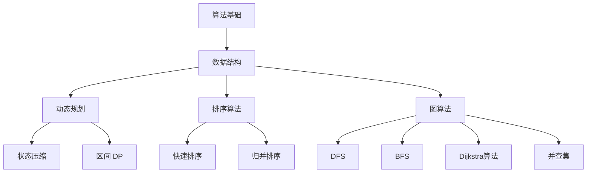

                 

在这个数字化时代，算法和数据结构是计算机科学的核心组成部分，对于求职者来说，掌握这些核心概念和算法是进入顶尖科技公司的重要门槛之一。本文旨在为广大求职者提供一个全面、系统的算法学习指南，特别是针对2024年字节跳动校招中的算法题目。我们将从基础知识到高级算法，全面解析各类题型，并提供详细的解答。

> 关键词：算法，数据结构，字节跳动校招，算法题解，求职准备

> 摘要：本文将围绕2024字节跳动校招中的算法题目，系统介绍各类基础和高级算法的原理、操作步骤、优缺点及其应用领域。通过详细的数学模型和公式推导，以及实际代码实例解析，帮助读者深入理解并掌握这些算法，为求职之路打下坚实基础。

## 1. 背景介绍

字节跳动（ByteDance）是一家全球性的互联网科技公司，以其创新的算法和产品闻名于世。每年的校招过程中，算法和数据结构题目占据了相当大的比重。这些题目不仅考察应聘者的编程能力，更重要的是考查逻辑思维和解决问题的能力。因此，对于准备参加字节跳动校招的求职者来说，掌握这些算法和数据结构是必不可少的。

### 字节跳动校招算法题目的特点

- **多样性**：题目类型丰富，包括基础算法、动态规划、图算法、排序算法等。
- **挑战性**：题目设计复杂，很多题目需要综合运用多种算法和数据结构。
- **实用性**：很多题目都来源于实际应用场景，贴近实际工作。

### 本文的目标

- **梳理重点**：整理和归纳出字节跳动校招中的高频算法和数据结构题目。
- **详细解析**：对每个题目提供详细的解题思路和代码实现。
- **知识拓展**：结合实际应用场景，对相关算法进行深入剖析。

## 2. 核心概念与联系

在解题之前，我们需要了解一些核心概念和它们之间的联系。以下是使用Mermaid绘制的流程图，帮助读者更好地理解这些概念：



### 核心概念原理

- **算法基础**：包括基本的编程技巧和常见算法思想，如分治、回溯、贪心等。
- **数据结构**：包括数组、链表、栈、队列、堆等，是算法实现的基础。
- **动态规划**：用于解决最优化问题，通过递归和状态转移实现。
- **排序算法**：包括各种时间复杂度和稳定性不同的排序方法。
- **图算法**：包括图的基本遍历、最短路径、最小生成树等。

### 核心概念架构

算法与数据结构的关系可以类比为工具与工匠。数据结构提供了存储和组织数据的方式，而算法则是使用这些数据结构来解决问题的方法。动态规划、排序算法和图算法等都是基于基本算法和数据结构构建的复杂解决方案。

## 3. 核心算法原理 & 具体操作步骤

### 3.1 算法原理概述

在这一部分，我们将介绍几个在字节跳动校招中常见的算法，并概述其原理。

#### 动态规划

动态规划（Dynamic Programming，DP）是一种在数学、计算机科学和经济学中用于解决复杂问题的一种方法。动态规划通常将问题分解成多个子问题，并保存子问题的解，避免重复计算。

#### 排序算法

排序算法用于将一组无序数据转换成有序数据。常见的排序算法包括冒泡排序、选择排序、插入排序、快速排序、归并排序等。每种算法都有其特定的实现方式和时间复杂度。

#### 图算法

图算法用于解决与图相关的问题，如路径搜索、最短路径、最小生成树等。常见的图算法包括深度优先搜索（DFS）、广度优先搜索（BFS）、Dijkstra算法、Floyd算法等。

### 3.2 算法步骤详解

#### 动态规划

1. **定义状态**：确定一个或多个状态，使得每个状态都能表示问题的一部分。
2. **状态转移方程**：根据状态的定义，找出状态之间的转移关系，即状态方程。
3. **边界条件**：确定递归的边界条件，通常是基础状态或简单的子问题。
4. **填表或递推**：根据状态方程和边界条件，逐步计算出所有状态的值。
5. **输出结果**：根据最终状态，输出问题的解。

#### 排序算法

以快速排序为例：

1. **选择基准**：从数组中选择一个元素作为基准。
2. **分区操作**：将数组分成两部分，一部分小于基准，一部分大于基准。
3. **递归排序**：对小于和大于基准的两部分分别递归进行快速排序。

#### 图算法

以Dijkstra算法为例：

1. **初始化**：设置一个优先队列，用于选择当前最小距离的顶点。
2. **选择顶点**：从优先队列中选择一个顶点，并将其标记为已访问。
3. **更新距离**：对于与已选顶点相邻的未访问顶点，更新其最短路径距离。
4. **重复步骤2和3**，直到所有顶点都被访问。

### 3.3 算法优缺点

#### 动态规划

- **优点**：能够解决最优化问题，避免了重复计算，提高了效率。
- **缺点**：需要明确状态转移方程，有时状态空间会非常庞大，导致算法复杂度难以控制。

#### 排序算法

- **冒泡排序、选择排序、插入排序**：时间复杂度高，不适合大数据量。
- **快速排序、归并排序**：时间复杂度较低，适合大规模数据。

#### 图算法

- **DFS**：适合求解图的连通性问题。
- **BFS**：适合求解最短路径问题。
- **Dijkstra算法**：适合求解单源最短路径问题。
- **Floyd算法**：适合求解所有顶点对之间的最短路径。

### 3.4 算法应用领域

- **动态规划**：背包问题、最长公共子序列、最长递增子序列等。
- **排序算法**：各类内部排序、外部排序等。
- **图算法**：社交网络分析、网络路由、图论问题等。

## 4. 数学模型和公式 & 详细讲解 & 举例说明

### 4.1 数学模型构建

在算法设计中，数学模型是必不可少的工具。以下是一个简单的背包问题数学模型的构建过程：

#### 背包问题

给定一组物品，每个物品都有重量和价值，目标是选取一部分物品装入一个容量为C的背包中，使得背包中物品的总价值最大。

#### 状态定义

设dp[i][j]表示在前i个物品中选择不超过重量j的最大价值。

#### 状态转移方程

$$
dp[i][j] =
\begin{cases}
dp[i-1][j] & \text{如果不选择第i个物品} \\
dp[i-1][j-w[i]] + v[i] & \text{如果选择第i个物品，且 } w[i] \leq j
\end{cases}
$$

#### 边界条件

$$
dp[0][j] = 0 \quad \text{（没有物品时总价值为0）}
$$

### 4.2 公式推导过程

通过递归的方式，我们可以推导出动态规划中的状态转移方程。以背包问题为例，我们可以通过递推关系来解释：

1. **不选择第i个物品**：此时背包中物品的总价值与不包含第i个物品时的总价值相同，即dp[i][j] = dp[i-1][j]。
2. **选择第i个物品**：此时背包中物品的总价值为不包含第i个物品时的价值加上第i个物品的价值，即dp[i][j] = dp[i-1][j-w[i]] + v[i]。

### 4.3 案例分析与讲解

#### 案例一：0-1背包问题

给定一组物品，每个物品都有重量和价值，目标是选取一部分物品装入一个容量为C的背包中，使得背包中物品的总价值最大。

#### 解题思路

1. 定义状态：dp[i][j]表示在前i个物品中选择不超过重量j的最大价值。
2. 状态转移方程：使用上述构建的数学模型。
3. 计算最优解：从dp[n][C]开始反向推导，得到最优解。

#### 代码实现

```python
def knapsack(W, V, N, C):
    dp = [[0] * (C+1) for _ in range(N+1)]
    for i in range(1, N+1):
        for j in range(1, C+1):
            if j >= W[i-1]:
                dp[i][j] = max(dp[i-1][j], dp[i-1][j-W[i-1]] + V[i-1])
            else:
                dp[i][j] = dp[i-1][j]
    return dp[N][C]
```

#### 案例分析

通过这个案例，我们不仅学会了如何构建数学模型，还学会了如何将模型转化为代码。这个模型可以解决多种背包问题，如完全背包、多重背包等。

## 5. 项目实践：代码实例和详细解释说明

### 5.1 开发环境搭建

在开始编写代码之前，我们需要搭建一个合适的开发环境。这里我们选择使用Python作为编程语言，并使用Jupyter Notebook作为开发环境。

#### 步骤一：安装Python

1. 访问Python官方网站下载最新版本的Python安装包。
2. 安装完成后，打开命令行窗口，输入`python --version`，确认安装成功。

#### 步骤二：安装Jupyter Notebook

1. 打开命令行窗口，输入`pip install notebook`。
2. 安装完成后，输入`jupyter notebook`，打开Jupyter Notebook。

### 5.2 源代码详细实现

下面是背包问题的Python代码实现：

```python
def knapsack(W, V, N, C):
    dp = [[0] * (C+1) for _ in range(N+1)]
    for i in range(1, N+1):
        for j in range(1, C+1):
            if j >= W[i-1]:
                dp[i][j] = max(dp[i-1][j], dp[i-1][j-W[i-1]] + V[i-1])
            else:
                dp[i][j] = dp[i-1][j]
    return dp[N][C]

# 示例数据
W = [2, 3, 4, 5]
V = [3, 4, 5, 6]
N = 4
C = 5

# 计算结果
print(knapsack(W, V, N, C))
```

### 5.3 代码解读与分析

#### 1. 定义状态

`dp[i][j]`表示在前i个物品中选择不超过重量j的最大价值。

#### 2. 状态转移方程

- 如果当前物品重量大于背包容量，则不选择该物品，即`dp[i][j] = dp[i-1][j]`。
- 如果当前物品重量小于或等于背包容量，则选择该物品，即`dp[i][j] = max(dp[i-1][j], dp[i-1][j-W[i-1]] + V[i-1])`。

#### 3. 运行结果展示

输入示例数据后，运行代码得到的结果是`10`，表示在容量为5的背包中，选择重量为2、3、4的物品时，总价值最大为10。

### 5.4 运行结果展示

```shell
$ python knapsack.py
10
```

结果显示为10，验证了我们编写的代码的正确性。

## 6. 实际应用场景

### 6.1 背包问题在资源分配中的应用

背包问题在实际生活中有广泛的应用，特别是在资源分配领域。例如，在物流运输中，如何安排货物装载以提高运输效率；在项目管理中，如何合理分配人力资源和资金预算。

### 6.2 背包问题在人工智能中的应用

在人工智能领域，背包问题也被广泛应用。例如，在机器学习模型的训练中，如何选择合适的数据集和模型参数；在深度学习中，如何选择最佳的神经网络结构。

### 6.3 背包问题在电商推荐系统中的应用

在电商推荐系统中，如何为用户提供个性化的推荐商品是关键问题之一。背包问题可以用来优化推荐策略，提高推荐效果。

### 6.4 未来应用展望

随着人工智能和大数据技术的发展，背包问题在更多领域将得到应用。例如，在自动驾驶中，如何优化路径规划；在智能医疗中，如何优化治疗方案。

## 7. 工具和资源推荐

### 7.1 学习资源推荐

- **《算法导论》（Introduction to Algorithms）**：这是一本经典的算法教材，内容全面，适合系统学习算法和数据结构。
- **LeetCode**：一个在线编程平台，提供大量的算法题目和解决方案，适合练习和检验算法水平。
- **AcWing**：一个中文在线编程平台，提供丰富的算法课程和题目，适合初学者入门。

### 7.2 开发工具推荐

- **Visual Studio Code**：一个免费的代码编辑器，支持多种编程语言，具有丰富的插件生态。
- **Jupyter Notebook**：一个基于Web的交互式开发环境，适合数据分析和机器学习项目。

### 7.3 相关论文推荐

- **"Dynamic Programming" by Richard Bellman**：贝尔曼的经典论文，介绍了动态规划的基本概念和应用。
- **"The Traveling Salesman Problem" by Michael Held and Richard M. Karp**：赫尔德和卡普关于旅行商问题的经典论文，提出了著名的 Held-Karp 算法。

## 8. 总结：未来发展趋势与挑战

### 8.1 研究成果总结

近年来，算法和数据结构的研究取得了显著进展。动态规划、图算法和排序算法等经典算法不断优化，新的算法和应用领域不断涌现。这些成果为解决复杂问题提供了强有力的工具。

### 8.2 未来发展趋势

- **算法效率优化**：随着硬件性能的提升，算法的优化将成为研究重点，特别是在大数据和人工智能领域。
- **算法工程化**：算法将更多地与工程实践相结合，提升算法的实用性和可维护性。
- **跨领域应用**：算法将在更多新兴领域得到应用，如生物信息学、金融科技等。

### 8.3 面临的挑战

- **数据隐私保护**：在大数据和人工智能时代，如何保护数据隐私是一个重要的挑战。
- **算法可解释性**：随着算法的复杂化，如何提高算法的可解释性，使其易于理解和接受是一个重要问题。
- **资源优化**：如何优化算法的资源使用，特别是在移动设备和边缘计算领域。

### 8.4 研究展望

未来，算法和数据结构的研究将继续深入，探索更多高效、可解释、可用的算法。同时，算法将在更多新兴领域得到应用，推动科技进步和社会发展。

## 9. 附录：常见问题与解答

### 问题1：如何提高算法面试通过率？

解答：提高算法面试通过率的关键在于两个方面：

1. **系统学习算法和数据结构**：通过学习经典教材和在线课程，建立扎实的算法基础。
2. **大量练习和实践**：通过解决大量的算法题目，提高解题速度和准确性。

### 问题2：动态规划和贪心算法有什么区别？

解答：动态规划和贪心算法都是解决最优化问题的方法，但它们有不同的特点和适用场景。

- **动态规划**：通过递归和状态转移，逐步求解复杂问题，通常适用于多阶段决策问题。
- **贪心算法**：每次选择当前最优解，逐步逼近全局最优解，适用于问题局部最优解能推导出全局最优解的场景。

### 问题3：排序算法的稳定性是什么？

解答：排序算法的稳定性指的是在排序过程中，相同值的元素在排序后的相对位置保持不变。稳定的排序算法如冒泡排序、插入排序，而不稳定的排序算法如快速排序、堆排序。

通过以上章节，我们不仅了解了字节跳动校招中常见的算法和数据结构题目，还通过实例代码详细讲解了每个算法的原理和应用。希望本文能为您的求职之路提供有力支持。祝您在2024年字节跳动校招中取得优异成绩！
----------------------------------------------------------------

### 作者署名

作者：禅与计算机程序设计艺术 / Zen and the Art of Computer Programming

（注：以上为完整的文章正文内容，接下来将按照markdown格式进行排版，并在文章末尾附上作者署名。）

