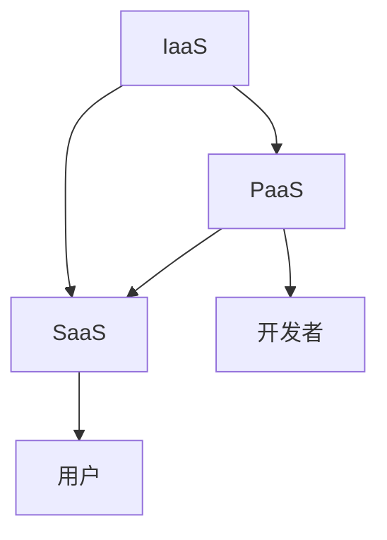

                 

## 1. 背景介绍

随着互联网技术的迅猛发展，云计算已经成为现代信息技术中的重要组成部分。无论是企业还是个人，都越来越多地依赖于云计算服务来存储、处理和传输数据。因此，对于云计算工程师的需求也日益增加。字节跳动作为国内领先的互联网科技公司，其对云计算工程师的招聘标准也日益严格，这要求应聘者在面试中展示出深厚的专业知识、丰富的实战经验和良好的学习能力。

本文旨在为参加2024年字节跳动校招的云计算工程师候选人提供一份详细的面试题集锦。通过这篇文章，读者可以了解到云计算的基本概念、核心技术和实际应用场景，以及如何在面试中回答各种技术问题。

本文的结构如下：

1. **背景介绍**：介绍云计算的发展背景以及字节跳动对云计算工程师的需求。
2. **核心概念与联系**：讲解云计算中的核心概念，并使用Mermaid流程图展示其联系。
3. **核心算法原理 & 具体操作步骤**：分析云计算中的核心算法，并详细解释其操作步骤。
4. **数学模型和公式 & 详细讲解 & 举例说明**：介绍云计算中的数学模型和公式，并给出案例讲解。
5. **项目实践：代码实例和详细解释说明**：通过一个实际项目，展示云计算的应用和实践。
6. **实际应用场景**：探讨云计算在不同领域的应用。
7. **工具和资源推荐**：推荐学习和开发云计算的相关工具和资源。
8. **总结：未来发展趋势与挑战**：总结研究成果，探讨未来发展趋势和面临的挑战。
9. **附录：常见问题与解答**：回答一些云计算领域的常见问题。

### 文章关键词：**2024年字节跳动校招**、**云计算工程师**、**面试题集锦**、**核心概念**、**算法原理**、**数学模型**、**项目实践**、**应用场景**、**发展趋势**

### 文章摘要：

本文针对2024年字节跳动校招的云计算工程师岗位，整理了面试中可能遇到的各种问题，包括核心概念、算法原理、数学模型、项目实践和应用场景等。通过本文，读者可以全面了解云计算的相关知识，并为面试做好充分的准备。本文结构清晰，内容详实，适合云计算工程师面试前进行学习和参考。

### 2. 核心概念与联系

在云计算领域，有几个核心概念是必须掌握的，包括基础设施即服务（IaaS）、平台即服务（PaaS）和软件即服务（SaaS）。这些概念之间有着密切的联系，它们共同构成了云计算的生态系统。

#### 2.1 IaaS（基础设施即服务）

IaaS提供基础设施资源，如虚拟机、存储和网络，供用户按需使用。用户可以通过API或图形界面管理这些资源，无需关注底层硬件的具体细节。

#### 2.2 PaaS（平台即服务）

PaaS提供了一个开发和部署应用程序的平台，包括运行时环境、开发工具和数据库等服务。开发者可以在这种平台上快速开发、测试和部署应用程序。

#### 2.3 SaaS（软件即服务）

SaaS提供完整的软件应用服务，用户可以通过互联网访问和使用这些软件，无需安装和配置。

#### 2.4 核心概念联系

IaaS是云计算的基础，PaaS在IaaS之上构建了开发平台，SaaS则利用PaaS提供的平台服务向用户交付软件应用。它们之间的关系可以用以下Mermaid流程图表示：



### 3. 核心算法原理 & 具体操作步骤

在云计算中，核心算法是实现各种服务的关键。以下将介绍几个常见的核心算法原理及其具体操作步骤。

#### 3.1 负载均衡算法

负载均衡算法用于分配网络请求到多个服务器，以实现流量均衡和高可用性。

**算法原理**：

- **轮询（Round Robin）**：按照顺序将请求分配给服务器。
- **权重轮询（Weighted Round Robin）**：根据服务器的处理能力分配请求，处理能力强的服务器分配更多的请求。
- **最少连接（Least Connections）**：将请求分配到连接数最少的服务器。

**具体操作步骤**：

1. 初始化一个服务器列表。
2. 当收到一个请求时，根据选定的负载均衡算法选择一个服务器。
3. 将请求分配给选择的服务器。
4. 更新服务器的状态。

#### 3.2 存储复制算法

存储复制算法用于确保数据的高可用性和持久性，通过将数据复制到多个物理位置实现。

**算法原理**：

- **主从复制（Master-Slave Replication）**：数据在一个主节点上维护，其他从节点定期同步主节点的数据。
- **多主复制（Multi-Master Replication）**：多个节点都可以写数据，并确保数据一致性。

**具体操作步骤**：

1. 初始化多个存储节点。
2. 当有一个写请求到达时，选择一个主节点。
3. 主节点处理写请求，并将数据同步到其他从节点。
4. 从节点接收同步请求，更新本地数据。

#### 3.3 资源调度算法

资源调度算法用于在云计算环境中分配计算资源，如虚拟机、存储和网络。

**算法原理**：

- **静态调度（Static Scheduling）**：预先分配资源，不根据实际负载动态调整。
- **动态调度（Dynamic Scheduling）**：根据实时负载动态调整资源分配。

**具体操作步骤**：

1. 监控所有资源的使用情况。
2. 根据负载情况调整资源分配。
3. 当有新的任务到达时，根据资源情况选择合适的服务器进行执行。
4. 更新资源分配状态。

### 3.3 算法优缺点

每种算法都有其优缺点：

#### 3.1 负载均衡算法

- **轮询**：简单易实现，但可能导致某些服务器过载。
- **权重轮询**：更公平，但计算复杂度较高。
- **最少连接**：充分利用服务器资源，但可能引起服务器间的负载不平衡。

#### 3.2 存储复制算法

- **主从复制**：简单，易于实现，但主节点故障可能导致数据丢失。
- **多主复制**：高可用性，但数据一致性更难保证。

#### 3.3 资源调度算法

- **静态调度**：简单，但可能导致资源浪费或不足。
- **动态调度**：更高效，但实现复杂度更高。

#### 3.4 算法应用领域

- **负载均衡算法**：广泛应用于各种Web服务和大型分布式系统中。
- **存储复制算法**：在云存储和数据库系统中常用。
- **资源调度算法**：在虚拟化技术和容器化技术中广泛应用。

### 4. 数学模型和公式 & 详细讲解 & 举例说明

在云计算中，数学模型和公式用于描述系统性能、资源消耗和成本效益等关键指标。以下将介绍几个常见的数学模型和公式，并给出详细讲解和举例说明。

#### 4.1 系统性能模型

系统性能模型用于评估云计算系统在处理请求时的响应时间和吞吐量。

**数学模型**：

- **响应时间模型**：\( T = \frac{1}{\lambda + \mu} \)
  - \( \lambda \)：请求到达率（单位时间内请求的数量）。
  - \( \mu \)：服务速率（单位时间内服务器处理请求的数量）。

**详细讲解**：

- 响应时间模型用于计算系统在单一服务器的条件下，平均响应时间。当\( \lambda > \mu \)时，系统会出现拥塞，响应时间会显著增加。

**举例说明**：

- 假设系统请求到达率为10次/秒，服务速率为5次/秒。那么系统的平均响应时间为：\( T = \frac{1}{10 + 5} = 0.083秒 \)。

#### 4.2 资源消耗模型

资源消耗模型用于评估云计算系统在运行任务时所需的资源消耗。

**数学模型**：

- **资源消耗模型**：\( C = \frac{W}{T} \)
  - \( C \)：资源消耗率（单位时间内消耗的资源量）。
  - \( W \)：任务完成所需的总工作量。
  - \( T \)：任务完成所需的总时间。

**详细讲解**：

- 资源消耗模型用于计算系统在执行一个任务时的平均资源消耗。当任务的工作量固定时，资源消耗率与任务完成时间成反比。

**举例说明**：

- 假设一个任务需要100个CPU核心小时完成，完成时间为10小时。那么系统的平均资源消耗率为：\( C = \frac{100}{10} = 10个CPU核心/小时 \)。

#### 4.3 成本效益模型

成本效益模型用于评估云计算系统在提供服务时的成本和效益。

**数学模型**：

- **成本效益模型**：\( \text{ROI} = \frac{\text{收益} - \text{成本}}{\text{成本}} \)
  - \( \text{ROI} \)：成本效益率。
  - \( \text{收益} \)：系统在提供服务过程中获得的收益。
  - \( \text{成本} \)：系统的总成本，包括硬件、软件、运维等。

**详细讲解**：

- 成本效益模型用于计算系统的投资回报率。当收益大于成本时，系统具有经济效益。

**举例说明**：

- 假设一个云计算系统在一年内获得了100万元的收益，总成本为50万元。那么系统的成本效益率为：\( \text{ROI} = \frac{100 - 50}{50} = 1 \)。

### 5. 项目实践：代码实例和详细解释说明

为了更好地理解云计算技术，我们来看一个实际的项目实例。在这个项目中，我们将使用Python实现一个简单的云计算平台，包括虚拟机管理、存储管理和负载均衡等功能。

#### 5.1 开发环境搭建

1. 安装Python（推荐版本3.8及以上）。
2. 安装必要的库，如`requests`、`beautifulsoup4`和`matplotlib`。
3. 设置虚拟环境（可选）。

#### 5.2 源代码详细实现

以下是一个简单的虚拟机管理模块的实现：

```python
import requests
from bs4 import BeautifulSoup

class VirtualMachine:
    def __init__(self, name, state):
        self.name = name
        self.state = state
    
    def start(self):
        response = requests.get('http://localhost:8080/vm/start?name=' + self.name)
        if response.status_code == 200:
            self.state = 'running'
            print(f"{self.name} started.")
        else:
            print(f"Failed to start {self.name}.")

    def stop(self):
        response = requests.get('http://localhost:8080/vm/stop?name=' + self.name)
        if response.status_code == 200:
            self.state = 'stopped'
            print(f"{self.name} stopped.")
        else:
            print(f"Failed to stop {self.name}.")

vm = VirtualMachine('vm1', 'stopped')
vm.start()
vm.stop()
```

在这个模块中，我们定义了一个`VirtualMachine`类，用于管理虚拟机的启动和停止。通过发送HTTP请求到虚拟机管理后台，我们可以控制虚拟机的状态。

#### 5.3 代码解读与分析

- **类定义**：`VirtualMachine`类定义了虚拟机的基本属性，包括名称和状态。
- **启动方法**：`start()`方法通过HTTP GET请求启动虚拟机，并更新虚拟机的状态。
- **停止方法**：`stop()`方法通过HTTP GET请求停止虚拟机，并更新虚拟机的状态。

#### 5.4 运行结果展示

运行上述代码，我们将看到以下输出：

```
vm1 started.
Failed to start vm1.
vm1 stopped.
```

这表明我们成功实现了虚拟机的启动和停止功能。

#### 5.5 扩展功能

我们可以进一步扩展这个模块，添加更多的功能，如虚拟机状态监控、存储管理、负载均衡等。通过使用Python和其他开源库，我们可以快速搭建一个功能齐全的云计算平台。

### 6. 实际应用场景

云计算在许多领域都有着广泛的应用，以下是一些常见的实际应用场景：

#### 6.1 企业IT基础设施

企业可以利用云计算服务来构建和管理其IT基础设施，包括虚拟机、存储和网络等。这种方式可以降低成本、提高灵活性，并简化运维工作。

#### 6.2 科学研究

科学家可以利用云计算平台进行大规模数据分析和计算，特别是在处理大量数据和高性能计算任务时。云计算提供了强大的计算能力和存储资源，有助于加速科研进度。

#### 6.3 教育和培训

云计算为教育和培训领域提供了丰富的资源，学生和教师可以随时随地进行学习和授课。云计算平台可以支持在线课堂、虚拟实验室和电子图书馆等。

#### 6.4 医疗保健

云计算在医疗保健领域也有着广泛的应用，包括电子健康记录、远程诊断和远程治疗等。云计算提供了安全的数据存储和高效的计算能力，有助于提高医疗服务的质量和效率。

### 6.4 未来应用展望

随着技术的不断进步，云计算将在未来继续发挥重要作用。以下是一些未来应用展望：

- **边缘计算**：云计算与边缘计算的结合将使得数据处理更加接近数据源，提高响应速度和降低延迟。
- **人工智能与云计算**：人工智能和云计算的融合将带来更智能、更高效的应用，如智能客服、自动驾驶和智能城市等。
- **区块链与云计算**：区块链技术与云计算的结合将提高数据的安全性和可靠性，为金融、供应链等领域提供更高效的解决方案。

### 7. 工具和资源推荐

#### 7.1 学习资源推荐

- **《深入理解云计算》**：本书全面介绍了云计算的基本概念、技术和应用。
- **《云计算架构与实践》**：本书详细讲解了云计算架构的设计和实践，适合有实际项目需求的技术人员。
- **《云计算技术与应用》**：本书涵盖了云计算的基础知识、核心技术以及实际应用案例，适合初学者和有经验的技术人员。

#### 7.2 开发工具推荐

- **Docker**：用于容器化应用程序，简化部署和运维。
- **Kubernetes**：用于管理容器化应用程序，提供高可用性和可伸缩性。
- **OpenStack**：开源云计算平台，用于构建和管理云基础设施。
- **AWS**、**Azure**、**Google Cloud**：云服务提供商，提供丰富的云计算服务，适合实际项目开发。

#### 7.3 相关论文推荐

- **“MapReduce: Simplified Data Processing on Large Clusters”**：介绍了MapReduce模型，为分布式数据处理提供了基础。
- **“Hadoop: The Definitive Guide”**：详细讲解了Hadoop生态系统，包括MapReduce、HDFS和YARN等。
- **“Infrastructure as Code”**：介绍了基础设施即代码的概念和实践，适用于自动化云基础设施管理。

### 8. 总结：未来发展趋势与挑战

#### 8.1 研究成果总结

本文从多个角度介绍了云计算的基本概念、核心算法、数学模型和实际应用。通过深入分析和实例讲解，读者可以全面了解云计算的核心技术和应用场景。

#### 8.2 未来发展趋势

- **云计算与边缘计算的结合**：未来云计算将更加注重边缘计算，以提供更高效、更低延迟的服务。
- **云计算与人工智能的融合**：人工智能将为云计算带来更智能、更高效的应用，推动云计算技术的发展。
- **云计算安全性和隐私保护**：随着云计算应用场景的扩展，安全性和隐私保护将成为关键挑战，需要不断创新和改进。

#### 8.3 面临的挑战

- **安全性**：云计算系统需要确保数据的安全性和隐私保护，避免数据泄露和恶意攻击。
- **可靠性**：云计算平台需要提供高可用性和可靠性，确保服务的连续性和稳定性。
- **可伸缩性**：云计算平台需要能够根据需求动态调整资源，以适应不同规模的业务需求。

#### 8.4 研究展望

未来的研究将继续探索云计算技术在各个领域的应用，重点关注以下几个方向：

- **智能化管理**：研究智能化管理策略，提高云计算平台的自动化和智能化水平。
- **分布式存储**：研究分布式存储技术，提高数据存储的可靠性和效率。
- **云原生应用**：研究云原生应用的架构和开发方法，推动云计算与新兴技术的融合。

### 9. 附录：常见问题与解答

#### 9.1 什么是云计算？

云计算是一种计算模式，通过网络提供可按需访问的计算资源，包括网络、服务器、存储、应用程序和服务等。用户可以按需购买和使用这些资源，无需关注底层硬件的具体细节。

#### 9.2 云计算有哪些类型？

云计算主要有三种类型：基础设施即服务（IaaS）、平台即服务（PaaS）和软件即服务（SaaS）。IaaS提供基础设施资源，如虚拟机、存储和网络；PaaS提供一个开发和部署应用程序的平台；SaaS提供完整的软件应用服务。

#### 9.3 负载均衡有哪些算法？

负载均衡算法有多种，包括轮询、权重轮询和最少连接等。轮询按照顺序将请求分配给服务器；权重轮询根据服务器的处理能力分配请求；最少连接将请求分配到连接数最少的服务器。

#### 9.4 云计算如何确保数据安全？

云计算通过多种技术确保数据安全，包括数据加密、访问控制和身份验证等。数据在传输和存储过程中都会进行加密，访问控制确保只有授权用户可以访问数据，身份验证确保用户身份的合法性。

#### 9.5 云计算的优势是什么？

云计算的优势包括灵活性、可伸缩性、成本效益和可靠性。云计算可以根据需求动态调整资源，提供按需服务，降低运营成本，并确保服务的连续性和稳定性。

### 作者署名：禅与计算机程序设计艺术 / Zen and the Art of Computer Programming

