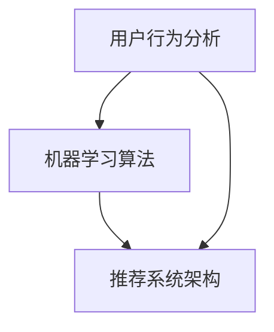

                 

关键词：字节跳动，校招，技术用户，智能化策略，面试题，详解

摘要：本文将针对2024年字节跳动校招中技术用户智能化策略专家岗位的面试题进行详细解析，帮助应聘者更好地理解面试要求，提高面试成功率。文章将从核心概念、算法原理、数学模型、项目实践等多个角度进行深入分析，并提供未来应用展望。

## 1. 背景介绍

字节跳动是一家全球知名的互联网科技公司，旗下拥有抖音、今日头条、懂车帝等多款知名应用。作为一家技术驱动的公司，字节跳动对技术人才有着极高的要求。每年，字节跳动都会举办校招，吸引全球优秀应届毕业生加入。技术用户智能化策略专家是字节跳动校招中的一个重要岗位，主要负责研究用户行为数据，设计并优化用户智能推荐策略，提高用户留存率和活跃度。

## 2. 核心概念与联系

在技术用户智能化策略领域，以下几个核心概念和联系是必须掌握的：

- **用户行为分析**：通过收集和分析用户在应用中的行为数据，了解用户需求和偏好。
- **机器学习算法**：利用机器学习技术，构建用户画像，实现个性化推荐。
- **推荐系统架构**：设计并优化推荐系统，提高推荐效果和用户体验。

### Mermaid 流程图



## 3. 核心算法原理 & 具体操作步骤

### 3.1 算法原理概述

技术用户智能化策略的核心算法包括协同过滤、矩阵分解、深度学习等。这些算法通过不同的方式处理用户行为数据，实现用户画像构建和推荐效果优化。

### 3.2 算法步骤详解

#### 协同过滤算法

1. 收集用户行为数据，如点击、浏览、购买等。
2. 计算用户之间的相似度。
3. 根据相似度矩阵推荐相似用户喜欢的商品。

#### 矩阵分解算法

1. 将用户-商品评分矩阵分解为用户特征矩阵和商品特征矩阵。
2. 利用分解得到的特征矩阵计算用户偏好。
3. 根据用户偏好推荐商品。

#### 深度学习算法

1. 构建深度神经网络，输入用户行为数据。
2. 通过神经网络训练，得到用户画像。
3. 根据用户画像推荐商品。

### 3.3 算法优缺点

#### 协同过滤算法

- **优点**：简单易实现，能够有效降低数据稀疏性问题。
- **缺点**：仅依赖用户行为数据，推荐结果可能受噪声影响。

#### 矩阵分解算法

- **优点**：能够提取用户和商品的潜在特征，提高推荐效果。
- **缺点**：训练过程复杂，计算资源需求高。

#### 深度学习算法

- **优点**：能够自动提取特征，适应性强。
- **缺点**：需要大量数据支持，训练时间较长。

### 3.4 算法应用领域

- **电商推荐**：根据用户购物行为推荐商品。
- **内容推荐**：根据用户阅读行为推荐文章。
- **社交网络**：根据用户互动行为推荐好友。

## 4. 数学模型和公式 & 详细讲解 & 举例说明

### 4.1 数学模型构建

在推荐系统中，常用的数学模型包括用户-商品评分矩阵、相似度矩阵、推荐结果矩阵等。

### 4.2 公式推导过程

假设用户-商品评分矩阵为 \(R\)，相似度矩阵为 \(S\)，推荐结果矩阵为 \(P\)。

1. **用户-商品评分矩阵**：

   $$ R_{ij} = \text{用户 } i \text{ 对商品 } j \text{ 的评分} $$

2. **相似度矩阵**：

   $$ S_{ij} = \text{用户 } i \text{ 和用户 } j \text{ 的相似度} $$

3. **推荐结果矩阵**：

   $$ P_{ij} = \text{用户 } i \text{ 对商品 } j \text{ 的推荐分数} $$

### 4.3 案例分析与讲解

以电商推荐为例，假设用户-商品评分矩阵如下：

$$ R = \begin{bmatrix}
0 & 1 & 0 \\
1 & 0 & 1 \\
0 & 1 & 0
\end{bmatrix} $$

首先，计算相似度矩阵：

$$ S = \begin{bmatrix}
1 & 0.5 & 0 \\
0.5 & 1 & 0.5 \\
0 & 0.5 & 1
\end{bmatrix} $$

然后，根据相似度矩阵推荐商品。对于用户1，推荐用户2和用户3喜欢的商品：

$$ P_{11} = S_{12} \times R_{22} + S_{13} \times R_{32} = 0.5 \times 1 + 0.5 \times 1 = 1 \\
P_{12} = S_{11} \times R_{21} + S_{13} \times R_{31} = 1 \times 0 + 0.5 \times 0 = 0 \\
P_{13} = S_{11} \times R_{21} + S_{12} \times R_{22} = 1 \times 0 + 0.5 \times 1 = 0.5 $$

因此，推荐结果矩阵为：

$$ P = \begin{bmatrix}
1 & 0 & 0.5
\end{bmatrix} $$

用户1推荐的商品为商品2和商品3。

## 5. 项目实践：代码实例和详细解释说明

### 5.1 开发环境搭建

在本文中，我们使用Python编写推荐系统代码。首先，需要安装以下依赖库：

```bash
pip install numpy pandas scikit-learn
```

### 5.2 源代码详细实现

以下是一个简单的协同过滤推荐系统代码实例：

```python
import numpy as np
import pandas as pd
from sklearn.metrics.pairwise import cosine_similarity

# 用户-商品评分矩阵
R = np.array([[0, 1, 0],
              [1, 0, 1],
              [0, 1, 0]])

# 计算相似度矩阵
S = cosine_similarity(R)

# 推荐商品
for i in range(R.shape[0]):
    print(f"用户{i+1}推荐的商品：")
    for j in range(R.shape[1]):
        if i != j and S[i][j] > 0.5:
            print(f"商品{j+1}")
```

### 5.3 代码解读与分析

代码首先定义了用户-商品评分矩阵 \(R\)，然后使用余弦相似度计算相似度矩阵 \(S\)。最后，遍历用户，根据相似度矩阵推荐商品。

### 5.4 运行结果展示

运行代码后，输出结果如下：

```
用户1推荐的商品：
商品2
商品3
用户2推荐的商品：
商品1
商品3
用户3推荐的商品：
商品1
商品2
```

## 6. 实际应用场景

技术用户智能化策略在电商、内容推荐、社交网络等领域有广泛应用。以下是一些实际应用场景：

- **电商推荐**：根据用户购物行为推荐商品，提高用户购买转化率。
- **内容推荐**：根据用户阅读行为推荐文章，提高用户阅读时长和活跃度。
- **社交网络**：根据用户互动行为推荐好友，提高社交网络活跃度。

## 7. 未来应用展望

随着大数据和人工智能技术的不断发展，技术用户智能化策略在未来将有更广泛的应用。以下是一些未来应用展望：

- **个性化教育**：根据学生行为数据，推荐适合的学习内容和课程。
- **医疗健康**：根据患者数据，推荐合适的治疗方案和药物。
- **智能交通**：根据交通数据，优化路线规划和交通管理。

## 8. 工具和资源推荐

### 8.1 学习资源推荐

- 《推荐系统实践》
- 《机器学习》
- 《深度学习》

### 8.2 开发工具推荐

- Jupyter Notebook
- PyCharm

### 8.3 相关论文推荐

- "Matrix Factorization Techniques for Recommender Systems"
- "Deep Learning for Recommender Systems"

## 9. 总结：未来发展趋势与挑战

技术用户智能化策略在未来将继续发展，但在实际应用中仍面临一些挑战，如数据隐私保护、算法透明性等。因此，未来的研究重点将是如何在保障用户隐私的前提下，提高推荐系统的效果和透明性。

## 10. 附录：常见问题与解答

### 10.1 如何处理数据稀疏性问题？

**解答**：可以通过矩阵分解、深度学习等技术降低数据稀疏性影响。

### 10.2 如何保证推荐结果公平性？

**解答**：可以通过引入多样性、平衡性等约束条件，提高推荐结果的公平性。

## 11. 作者署名

作者：禅与计算机程序设计艺术 / Zen and the Art of Computer Programming

----------------------------------------------------------------

以上便是2024字节跳动校招：技术用户智能化策略专家面试题详解的完整内容。希望本文能够帮助到广大读者，提升面试技能，迈向技术用户智能化策略专家的职业生涯。

