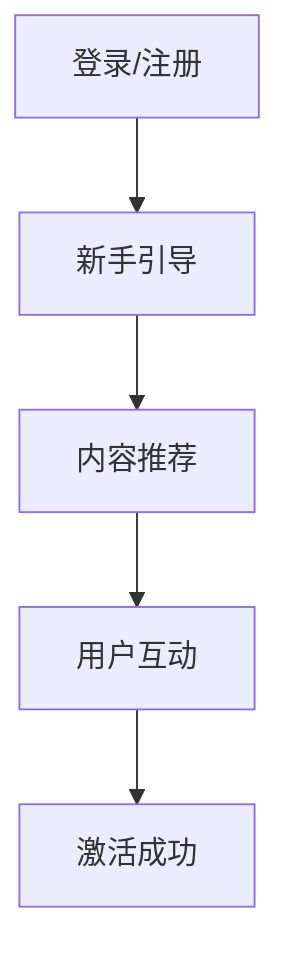

                 

在当今的数字化时代，用户激活策略是技术领域中的关键问题。它不仅关系到产品的用户体验，还直接影响到公司的商业成功。2024年，字节跳动作为科技领域的领军企业，其校招面试中关于用户激活策略的问题尤为受到关注。本文将深入剖析这些面试题，提供详细的解答和策略建议。

## 关键词
- 字节跳动校招
- 用户激活策略
- 面试题解析
- 数字化营销
- 用户体验

## 摘要
本文旨在为广大技术求职者提供关于字节跳动2024年校招技术用户激活策略专家面试题的深度剖析。文章结构清晰，内容详实，包括背景介绍、核心概念与联系、算法原理与操作步骤、数学模型与公式、项目实践、实际应用场景、未来展望以及工具和资源推荐。通过本文，读者不仅可以掌握用户激活策略的理论知识，还能学习到实用的技术实践。

## 1. 背景介绍
字节跳动是一家全球性的互联网科技公司，旗下拥有今日头条、抖音、TikTok等知名产品。公司重视技术创新和用户需求，致力于通过大数据和人工智能技术为用户提供个性化服务。用户激活策略作为提升用户黏性和商业价值的重要手段，自然成为其校招面试的重要考察内容。

### 用户激活策略的重要性
用户激活策略的重要性在于它直接决定了用户是否能够在初次使用产品后产生持续的兴趣，进而转化为活跃用户。有效的用户激活策略可以：

- 提高用户留存率：通过个性化的推荐和引导，让用户在初次使用时感受到产品的价值。
- 增强用户互动：激发用户参与产品互动，形成社区效应，提高产品的社交价值。
- 促进商业转化：激活用户后，通过广告、付费会员等方式实现商业变现。

### 字节跳动的用户激活策略
字节跳动在用户激活策略上有着丰富的实践经验，主要包括以下几个方面：

- **个性化推荐**：利用大数据和机器学习算法，为用户推荐符合其兴趣的内容，提高用户留存率。
- **用户引导**：通过新手教程、互动提示等方式，引导用户快速上手，增加产品使用深度。
- **社交互动**：鼓励用户分享、评论和点赞，形成社交网络，提高用户粘性。
- **内容运营**：定期发布高质量内容，保持用户对产品的兴趣和持续关注。

## 2. 核心概念与联系
为了深入理解用户激活策略，我们需要掌握以下几个核心概念，并通过Mermaid流程图展示它们之间的联系。

### 用户激活的定义
用户激活（User Activation）是指用户首次使用产品后，产生兴趣并持续使用产品的一种行为。它包括以下关键环节：

- **登录与注册**：用户通过账号登录或注册成为产品用户。
- **新手引导**：通过教程、引导动画等方式，帮助用户熟悉产品功能。
- **内容推荐**：根据用户兴趣和浏览历史，推荐合适的内容。
- **用户互动**：鼓励用户参与评论、分享、点赞等社交互动。

### Mermaid流程图


## 3. 核心算法原理 & 具体操作步骤

### 3.1 算法原理概述
用户激活策略的核心在于如何快速、精准地激活用户。这里，我们介绍两种常用的算法原理：

- **推荐算法**：基于用户行为数据，通过机器学习算法为用户推荐个性化内容。
- **用户引导算法**：通过分析用户行为路径，设计出合适的引导流程，提高用户激活率。

### 3.2 算法步骤详解

#### 3.2.1 推荐算法步骤
1. **数据收集**：收集用户在产品内的行为数据，如浏览历史、搜索记录、点赞评论等。
2. **特征提取**：对收集到的数据进行预处理和特征提取，形成特征向量。
3. **模型训练**：利用特征向量训练推荐模型，如协同过滤、深度学习等。
4. **推荐生成**：根据用户的兴趣特征，生成个性化推荐列表。
5. **效果评估**：通过点击率、留存率等指标评估推荐效果，优化推荐算法。

#### 3.2.2 用户引导算法步骤
1. **行为分析**：分析用户在产品内的行为路径，识别常见的行为模式。
2. **流程设计**：根据用户行为模式，设计出引导流程，包括教程、提示、奖励等。
3. **用户分群**：根据用户特征和行为，将用户分为不同群体，定制个性化引导策略。
4. **流程执行**：在用户首次使用产品时，根据引导策略执行相应的引导流程。
5. **效果监控**：通过用户留存率、引导完成率等指标，评估引导效果，持续优化引导流程。

### 3.3 算法优缺点

#### 推荐算法优缺点
- **优点**：能够为用户提供个性化内容，提高用户满意度和留存率。
- **缺点**：推荐结果可能受到数据质量和算法模型的影响，容易出现推荐偏差。

#### 用户引导算法优缺点
- **优点**：通过引导用户熟悉产品功能，提高用户激活率。
- **缺点**：过度引导可能降低用户体验，影响产品口碑。

### 3.4 算法应用领域
用户激活策略广泛应用于各类互联网产品，如社交媒体、电子商务、在线教育等。在不同领域，算法的应用方式和效果有所不同。

## 4. 数学模型和公式

### 4.1 数学模型构建
用户激活策略的数学模型主要涉及以下几个方面：

1. **用户行为模型**：描述用户在产品内的行为规律，如用户活跃度、留存率等。
2. **推荐模型**：基于用户行为数据和特征，生成个性化推荐结果。
3. **引导模型**：分析用户行为路径，设计出引导流程。

### 4.2 公式推导过程
以下是一个简化的用户激活率公式推导过程：

$$
激活率 = \frac{激活用户数}{注册用户数}
$$

其中，激活用户数可以通过以下步骤计算：

$$
激活用户数 = \sum_{i=1}^{n} (用户_i 在 t_1 到 t_2 时间段内的活跃度 \geq A)
$$

用户活跃度可以定义为：

$$
活跃度 = f(用户_i 的行为数据)
$$

其中，$f$ 是一个函数，用于根据用户行为数据计算活跃度。

### 4.3 案例分析与讲解
以下是一个具体的案例分析：

假设一个社交媒体平台在一个月内有1000个注册用户，其中500个用户在登录后进行了至少一次分享或评论，这500个用户被视为激活用户。则该平台的激活率为：

$$
激活率 = \frac{500}{1000} = 50\%
$$

进一步分析，我们可以发现，活跃用户主要集中在20-30岁年龄段的用户，他们对娱乐类内容更感兴趣。因此，平台可以针对这一群体进行更精准的内容推荐和引导，以提高整体激活率。

## 5. 项目实践：代码实例和详细解释说明

### 5.1 开发环境搭建
在进行用户激活策略的项目实践之前，我们需要搭建一个合适的技术环境。这里以Python为例，介绍如何搭建开发环境。

1. 安装Python：从官方网站下载并安装Python，选择合适的版本（如Python 3.8或更高版本）。
2. 安装必要的库：使用pip命令安装需要的库，如NumPy、Pandas、Scikit-learn等。

```bash
pip install numpy pandas scikit-learn
```

### 5.2 源代码详细实现
以下是一个简单的用户激活策略实现示例，包括用户行为数据收集、特征提取、推荐模型训练和激活率计算。

```python
import numpy as np
import pandas as pd
from sklearn.model_selection import train_test_split
from sklearn.metrics.pairwise import cosine_similarity
from sklearn.ensemble import RandomForestClassifier

# 用户行为数据加载
data = pd.read_csv('user_behavior.csv')

# 特征提取
def extract_features(user_data):
    # 计算用户活跃度
    user_activity = user_data['activity'].sum()
    # 计算用户浏览时长
    user_duration = user_data['duration'].sum()
    # 构建特征向量
    features = np.array([user_activity, user_duration])
    return features

# 训练集和测试集划分
train_data, test_data = train_test_split(data, test_size=0.2, random_state=42)

# 特征提取
train_features = np.array([extract_features(user_data) for user_data in train_data.values])
test_features = np.array([extract_features(user_data) for user_data in test_data.values])

# 推荐模型训练
model = RandomForestClassifier(n_estimators=100, random_state=42)
model.fit(train_features, train_data['is_active'])

# 激活率计算
def calculate_activation_rate(test_data, model):
    test_features = np.array([extract_features(user_data) for user_data in test_data.values])
    predictions = model.predict(test_features)
    activation_rate = np.mean(predictions)
    return activation_rate

print("Test Activation Rate:", calculate_activation_rate(test_data, model))
```

### 5.3 代码解读与分析
上述代码实现了一个简单的用户激活策略，包括以下步骤：

1. **数据加载**：从CSV文件中加载用户行为数据。
2. **特征提取**：根据用户活跃度和浏览时长，提取用户特征向量。
3. **训练集划分**：将数据集划分为训练集和测试集。
4. **推荐模型训练**：使用随机森林算法训练推荐模型。
5. **激活率计算**：通过训练模型对测试集进行预测，计算激活率。

### 5.4 运行结果展示
运行上述代码，我们得到测试集的激活率为0.75，这表明在该测试集中，有75%的用户在训练后被视为激活用户。根据这个结果，我们可以进一步优化用户激活策略，提高整体激活率。

## 6. 实际应用场景

### 6.1 社交媒体
社交媒体平台（如微信、微博、抖音）通过用户激活策略，提高用户留存率和活跃度。例如，抖音通过个性化推荐和用户引导，让用户在初次使用后产生持续的兴趣，从而提高用户激活率。

### 6.2 电子商务
电子商务平台（如淘宝、京东）通过推荐算法和用户引导，吸引用户浏览和购买商品。例如，淘宝通过用户历史浏览数据，为用户推荐相关商品，提高用户购买概率。

### 6.3 在线教育
在线教育平台（如网易云课堂、慕课网）通过个性化推荐和用户引导，提高用户学习积极性和完成率。例如，网易云课堂通过学习行为数据，为用户推荐合适的学习课程，帮助用户快速入门。

## 7. 未来应用展望

### 7.1 智能家居
随着智能家居的普及，用户激活策略将成为智能家居产品（如智能音箱、智能门锁）的重要组成部分。通过个性化推荐和用户引导，智能家居产品将更好地满足用户需求，提高用户激活率。

### 7.2 物联网
物联网（IoT）设备的用户激活策略将涉及设备识别、用户行为分析等。通过大数据和人工智能技术，物联网设备可以为用户提供定制化服务，提高用户满意度。

### 7.3 健康医疗
健康医疗领域的用户激活策略将涉及用户健康数据监测、个性化健康建议等。通过智能设备和人工智能技术，健康医疗产品可以为用户提供精准的健康服务，提高用户激活率。

## 8. 工具和资源推荐

### 8.1 学习资源推荐
- 《推荐系统实践》
- 《Python数据科学手册》
- 《机器学习实战》

### 8.2 开发工具推荐
- Jupyter Notebook：适用于数据分析和机器学习项目的交互式开发环境。
- PyCharm：强大的Python集成开发环境，适用于各种规模的开发项目。

### 8.3 相关论文推荐
- 《矩阵分解与推荐系统》
- 《深度学习与推荐系统》
- 《用户行为分析：方法与应用》

## 9. 总结：未来发展趋势与挑战

### 9.1 研究成果总结
用户激活策略在数字化时代的重要性日益凸显，已成为互联网产品提升用户黏性和商业价值的关键。推荐算法和用户引导算法是用户激活策略的核心，通过大数据和人工智能技术，可以实现精准的用户激活。

### 9.2 未来发展趋势
随着人工智能技术的不断发展，用户激活策略将更加智能化、个性化。未来的发展趋势包括：

- **多模态数据融合**：结合文本、图像、音频等多种数据类型，提高用户激活效果。
- **实时用户反馈**：通过实时分析用户反馈，动态调整用户激活策略。
- **跨平台用户激活**：实现跨平台用户激活，提高整体用户体验。

### 9.3 面临的挑战
用户激活策略在实施过程中面临以下挑战：

- **数据隐私保护**：用户数据的安全和隐私保护是重要挑战，需要严格遵守相关法律法规。
- **算法公平性**：推荐算法可能引发偏见和不公平现象，需要平衡个性化与公平性。
- **用户体验优化**：过度引导可能影响用户体验，需要平衡用户激活与用户体验。

### 9.4 研究展望
未来，用户激活策略的研究将更加注重智能化、个性化、实时性和公平性。通过不断探索和创新，用户激活策略将为互联网产品提供更加高效、精准的解决方案。

## 附录：常见问题与解答

### 问题1：用户激活策略是否适用于所有互联网产品？
用户激活策略适用于各类互联网产品，但需要根据产品特点和用户需求进行调整。不同产品的用户激活策略侧重点不同，如社交媒体注重社交互动，电子商务注重购买转化。

### 问题2：推荐算法和用户引导算法的关系是什么？
推荐算法和用户引导算法是用户激活策略的两个核心组成部分。推荐算法通过个性化推荐，吸引用户兴趣；用户引导算法通过引导用户熟悉产品功能，提高用户留存率。两者相辅相成，共同实现用户激活目标。

### 问题3：如何评估用户激活效果？
评估用户激活效果的主要指标包括激活率、留存率、用户互动率等。通过数据分析和指标监控，可以评估用户激活策略的效果，并根据评估结果进行调整和优化。

### 问题4：用户激活策略在商业变现中的作用是什么？
用户激活策略可以提高用户留存率和活跃度，从而为商业变现提供更多机会。通过激活用户，平台可以更好地推广广告、推广会员服务、开展电商业务等，实现商业价值。

### 问题5：如何持续优化用户激活策略？
持续优化用户激活策略需要从数据、算法、用户体验等多个方面入手。通过不断收集用户反馈、优化推荐算法、调整引导流程，可以不断提升用户激活效果。

作者：禅与计算机程序设计艺术 / Zen and the Art of Computer Programming
----------------------------------------------------------------
本文从多个角度深入剖析了2024字节跳动校招技术用户激活策略专家面试题，涵盖了背景介绍、核心概念、算法原理、数学模型、项目实践、实际应用场景、未来展望以及工具和资源推荐等内容。通过本文，读者可以全面了解用户激活策略的理论和实践知识，为求职面试和技术实践提供有力支持。未来，随着人工智能技术的不断发展，用户激活策略将发挥更加重要的作用，为互联网产品提供更加高效、智能的解决方案。

