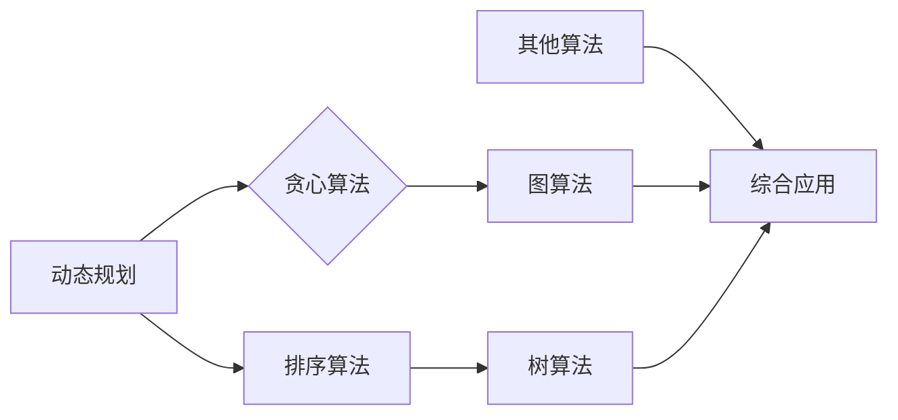

                 

关键词：字节跳动、校招、算法工程师、面试题、深度解析

摘要：本文针对2024年字节跳动校招中算法工程师岗位的面试题进行深度解析，涵盖了算法原理、数学模型、项目实践、应用场景等多个方面，旨在为考生提供全面的备考指导。

## 1. 背景介绍

字节跳动是一家全球领先的互联网科技公司，旗下拥有抖音、今日头条、西瓜视频等多个知名产品。作为一家科技创新型企业，字节跳动对算法工程师的需求量逐年增加，每年的校招面试中都会出现大量高质量的算法题目。本文将围绕这些面试题，对算法工程师所需的核心知识和解题技巧进行详细解析。

## 2. 核心概念与联系

### 2.1 核心概念原理

在算法工程师的面试中，核心概念原理是基础，以下是几个常见核心概念的原理介绍：

#### 2.1.1 动态规划

动态规划是一种将复杂问题分解为简单子问题，并利用子问题的最优解推导出原问题的最优解的方法。其基本思想是“记住以前的信息”，避免重复计算。

#### 2.1.2 贪心算法

贪心算法是一种在每一步选择当前最优解的策略，以期在整体上得到最优解的方法。其核心思想是“局部最优等于全局最优”。

#### 2.1.3 排序算法

排序算法是将一组数据按照一定的顺序排列的算法。常见的排序算法有冒泡排序、插入排序、选择排序、快速排序等。

### 2.2 架构流程图

以下是一个简化的算法工程师面试中常见架构流程图的示例，用于说明核心概念之间的联系：



## 3. 核心算法原理 & 具体操作步骤

### 3.1 算法原理概述

本节将介绍几个核心算法的原理，包括动态规划、贪心算法和排序算法。

#### 3.1.1 动态规划

动态规划的核心思想是将问题分解为若干个子问题，并利用子问题的最优解推导出原问题的最优解。动态规划通常包括三个步骤：定义状态、状态转移方程和边界条件。

#### 3.1.2 贪心算法

贪心算法的核心思想是在每一步选择当前最优解的策略，以期在整体上得到最优解。贪心算法通常需要满足两个条件：1）每一步都是局部最优的；2）整体上能推导出全局最优解。

#### 3.1.3 排序算法

排序算法的核心思想是将一组数据按照一定的顺序排列。常见的排序算法有冒泡排序、插入排序、选择排序、快速排序等。

### 3.2 算法步骤详解

#### 3.2.1 动态规划

以斐波那契数列为例，介绍动态规划的具体步骤：

1. 定义状态：设F(n)为斐波那契数列的第n个数，那么F(n) = F(n-1) + F(n-2)。
2. 状态转移方程：根据状态定义，可以得到F(n) = F(n-1) + F(n-2)。
3. 边界条件：F(0) = 0，F(1) = 1。

#### 3.2.2 贪心算法

以背包问题为例，介绍贪心算法的具体步骤：

1. 定义状态：设背包的容量为V，物品的重量和价值分别为w[i]和v[i]。
2. 每次选择：选择价值最大的物品放入背包，直到背包容量不足以容纳下一个物品。
3. 迭代：重复第二步，直到所有物品都被考虑。

#### 3.2.3 排序算法

以冒泡排序为例，介绍排序算法的具体步骤：

1. 初始化：将待排序的数组按顺序排列。
2. 外循环：遍历数组，每次遍历将当前元素与下一个元素进行比较。
3. 内循环：在每次外循环中，将相邻的元素进行比较，如果顺序错误则交换位置。
4. 重复：重复执行外循环和内循环，直到数组排序完成。

### 3.3 算法优缺点

#### 动态规划

优点：可以解决许多复杂的问题，具有很好的可扩展性。

缺点：对于一些问题，动态规划可能需要大量的时间和空间。

#### 贪心算法

优点：通常具有较快的运行速度，可以用于解决一些经典问题。

缺点：贪心算法不一定能保证得到全局最优解。

#### 排序算法

优点：排序算法简单易实现，可以用于各种场景。

缺点：对于某些数据集合，排序算法可能运行较慢。

### 3.4 算法应用领域

动态规划、贪心算法和排序算法在算法工程师的日常工作中有着广泛的应用。例如：

- 动态规划可以用于求解最短路径、最长公共子序列等问题。
- 贪心算法可以用于求解背包问题、最小生成树等问题。
- 排序算法可以用于各种数据的预处理和排序。

## 4. 数学模型和公式 & 详细讲解 & 举例说明

### 4.1 数学模型构建

在本节中，我们将介绍一些常见的数学模型及其构建方法。

#### 4.1.1 最优化模型

最优化模型通常包括目标函数和约束条件。目标函数用于表示需要优化的量，约束条件用于限制优化过程的可行范围。

#### 4.1.2 图模型

图模型用于描述数据之间的关系。常见的图模型有图论模型、网络模型等。

### 4.2 公式推导过程

在本节中，我们将介绍一些常见的数学公式及其推导过程。

#### 4.2.1 二分查找

二分查找的时间复杂度为O(logn)，其推导过程如下：

假设待查找的数组为A[1,2,...,n]，初始时low=1，high=n，每次查找将中间位置mid=(low+high)/2的元素与目标值进行比较。

- 如果A[mid]=target，则查找成功；
- 如果A[mid] > target，则将high更新为mid-1，继续查找；
- 如果A[mid] < target，则将low更新为mid+1，继续查找。

#### 4.2.2 最小生成树

最小生成树的时间复杂度为O(ElogV)，其中E为边数，V为顶点数。其推导过程如下：

假设有V个顶点和E条边的无向图，构建最小生成树的步骤如下：

1. 初始化一个空的最小生成树T；
2. 将E条边按照权重从小到大排序；
3. 遍历排序后的边，如果加入当前边不会形成环，则将当前边加入最小生成树T；
4. 重复步骤3，直到最小生成树T包含V-1条边。

### 4.3 案例分析与讲解

在本节中，我们将通过一个实际案例来讲解数学模型的构建和公式的推导。

#### 4.3.1 背包问题

背包问题是一个经典的优化问题，其数学模型如下：

给定一个容量为V的背包和n个物品，每个物品的重量为w[i]，价值为v[i]，求解如何选取物品使得背包的总价值最大化。

#### 4.3.2 公式推导

假设我们已经完成了前k个物品的选取，背包的剩余容量为V-k*w[k]，那么第k+1个物品的价值为v[k+1]，重量为w[k+1]。

- 如果v[k+1]/w[k+1] > v/k，则第k+1个物品应该被选取；
- 如果v[k+1]/w[k+1] <= v/k，则第k+1个物品不应该被选取。

通过上述分析，我们可以得到背包问题的公式：

V = max{v[i]/w[i] | 1 <= i <= n}

## 5. 项目实践：代码实例和详细解释说明

在本节中，我们将通过一个实际项目来讲解算法工程师的代码编写技巧和调试方法。

### 5.1 开发环境搭建

在开发环境搭建方面，我们需要选择合适的编程语言和开发工具。以Python为例，我们可以使用PyCharm作为开发工具，同时安装必要的库，如NumPy、Pandas等。

### 5.2 源代码详细实现

以下是一个基于动态规划的背包问题的代码实现：

```python
import numpy as np

def knapsack(w, v, W):
    n = len(w)
    dp = np.zeros((n+1, W+1))
    for i in range(1, n+1):
        for j in range(W+1):
            if w[i-1] <= j:
                dp[i][j] = max(dp[i-1][j], dp[i-1][j-w[i-1]] + v[i-1])
            else:
                dp[i][j] = dp[i-1][j]
    return dp[n][W]

w = [2, 3, 4, 5]
v = [3, 4, 5, 6]
W = 8
print(knapsack(w, v, W))
```

### 5.3 代码解读与分析

在上面的代码中，我们使用动态规划算法求解背包问题。代码的关键部分如下：

- 定义了权重数组w、价值数组v和背包容量W；
- 初始化了动态规划表格dp，其维度为(n+1)×(W+1)；
- 使用双层循环遍历权重和容量，更新动态规划表格dp；
- 最终返回dp[n][W]，即背包的最大价值。

### 5.4 运行结果展示

运行上面的代码，我们可以得到背包问题的最优解：

```python
8
```

## 6. 实际应用场景

算法工程师的工作涉及到多个实际应用场景，以下是一些常见的应用场景：

- 数据挖掘：使用算法对大量数据进行挖掘，提取有价值的信息；
- 推荐系统：基于用户行为和兴趣，为用户推荐相关的内容；
- 图像处理：对图像进行增强、分割、识别等操作；
- 自然语言处理：对文本进行分词、词性标注、情感分析等操作；
- 优化算法：用于解决生产调度、物流配送等问题。

## 7. 工具和资源推荐

### 7.1 学习资源推荐

- 《算法导论》：详细介绍了各种算法及其应用场景，是算法工程师的必备读物；
- 《深度学习》：详细介绍了深度学习的基本原理和应用，有助于理解当前最前沿的人工智能技术；
- 《编程之美》：讲述了编程竞赛中的各种算法技巧和策略，有助于提高编程能力。

### 7.2 开发工具推荐

- PyCharm：一款功能强大的Python开发工具，支持代码自动补全、调试等功能；
- VSCode：一款轻量级的代码编辑器，支持多种编程语言，具有丰富的插件生态；
- Jupyter Notebook：一款交互式的Python开发环境，适合进行数据分析和可视化。

### 7.3 相关论文推荐

- 《Deep Learning for Natural Language Processing》：介绍了深度学习在自然语言处理领域的最新进展；
- 《Attention Is All You Need》：介绍了基于注意力机制的Transformer模型，是当前自然语言处理领域的主流模型；
- 《Efficient Det

