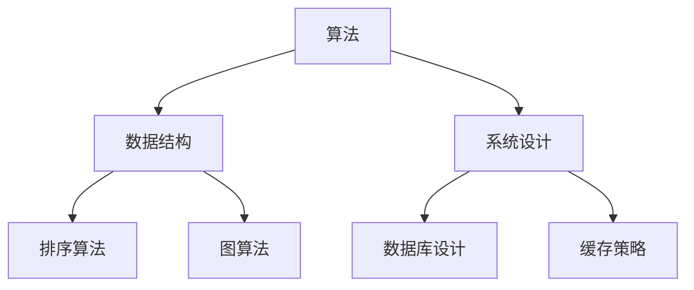
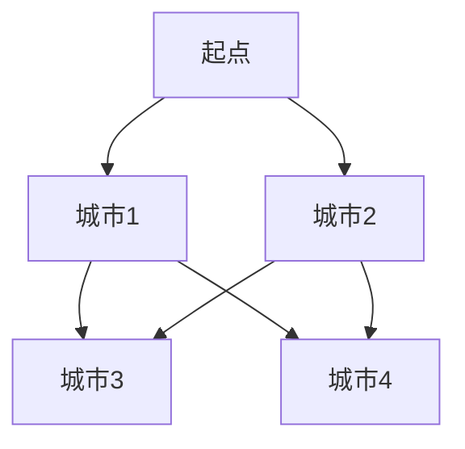

                 

在这个快节奏、高度竞争的技术时代，每一个求职者都希望能够在面试中脱颖而出。而字节跳动，作为一家全球领先的科技公司，其面试题往往不仅考察技术深度，还考察求职者的思维方式和解决问题的能力。本文旨在汇总2024字节跳动西瓜视频社招面试中的常见真题，并提供详细的解答。希望这些内容能帮助你更好地准备面试，顺利拿到心仪的offer。

## 文章关键词
- 字节跳动
- 面试真题
- 西瓜视频
- 社招
- 解答

## 文章摘要
本文将详细解析2024年字节跳动西瓜视频社招面试中的热门问题，涵盖算法、数据结构、系统设计等多个方面。通过深入剖析每个问题的解答，帮助求职者更好地理解和掌握面试所需的技能。

## 1. 背景介绍

字节跳动是一家中国领先的科技公司，旗下拥有多个知名产品，如抖音、今日头条、西瓜视频等。西瓜视频作为字节跳动的短视频平台，吸引了大量的用户和创作者。社招岗位主要面向有工作经验的求职者，对于候选人的技术能力和实战经验有着较高的要求。

### 1.1 字节跳动面试流程

字节跳动的面试流程通常包括在线评估、电话面试、技术面试、HR面试等多个环节。每一个环节都有其独特的考察重点和评分标准。在线评估主要考察基本编程能力和算法理解；电话面试和技术面试则侧重于技术深度和解决实际问题的能力；HR面试则主要评估求职者的职业素质和团队协作能力。

### 1.2 西瓜视频面试重点

西瓜视频的面试重点主要集中在以下三个方面：

- **技术深度**：包括算法和数据结构的掌握程度，尤其是动态规划和系统设计。
- **项目经验**：通过具体的项目经历来评估求职者的实际工作能力。
- **沟通能力**：良好的沟通能力是团队协作的基础，也是字节跳动特别看重的素质之一。

## 2. 核心概念与联系

在解析面试题之前，我们需要了解一些核心概念和联系，这些概念是解答面试题的基础。

### 2.1 算法

算法是解决特定问题的步骤集合。在面试中，常见的算法问题包括排序、查找、动态规划等。

### 2.2 数据结构

数据结构是存储和管理数据的方式。常见的有数组、链表、树、图等。理解各种数据结构的特点和适用场景对于解决算法问题是至关重要的。

### 2.3 系统设计

系统设计是构建复杂软件系统的方法和过程。面试中可能会考察数据库设计、缓存策略、负载均衡等。

下面是一个使用Mermaid绘制的简单流程图，展示算法、数据结构和系统设计之间的联系：



## 3. 核心算法原理 & 具体操作步骤

### 3.1 算法原理概述

在面试中，算法题是考察技术深度的重要部分。以下是一些常见的算法问题及其原理：

- **排序算法**：冒泡排序、选择排序、插入排序、快速排序等。
- **查找算法**：二分查找、顺序查找等。
- **动态规划**：用于求解最优化问题，如最长公共子序列、背包问题等。

### 3.2 算法步骤详解

以冒泡排序为例，其基本步骤如下：

1. 比较相邻的元素。如果第一个比第二个大（升序排序），就交换它们两个。
2. 对每一对相邻元素做同样的工作，从开始第一对到结尾的最后一对。这步做完后，最后的元素会是最大的数。
3. 针对所有的元素重复以上的步骤，除了最后一个。
4. 重复步骤1~3，直到排序完成。

### 3.3 算法优缺点

- **冒泡排序**：
  - **优点**：实现简单，易于理解。
  - **缺点**：效率较低，不适合大规模数据排序。

### 3.4 算法应用领域

算法在各个领域都有广泛的应用，如：

- **互联网**：搜索引擎、推荐系统等。
- **金融**：风险管理、投资组合优化等。
- **大数据**：数据处理、分析等。

## 4. 数学模型和公式 & 详细讲解 & 举例说明

在面试中，了解和运用数学模型和公式是解决算法问题的关键。以下是一些常用的数学模型和公式：

### 4.1 数学模型构建

- **最短路径问题**：使用Dijkstra算法求解。
- **背包问题**：使用动态规划求解。

### 4.2 公式推导过程

以最短路径问题为例，Dijkstra算法的公式推导如下：

- 定义：\(d[v] = \min \{d[u] + w(u, v) \mid u \in V, u \neq v\}\)

### 4.3 案例分析与讲解

假设有图如下：



权重如下：

- \(w(A, B) = 2\)
- \(w(A, C) = 4\)
- \(w(B, D) = 1\)
- \(w(C, D) = 2\)
- \(w(B, E) = 3\)
- \(w(C, E) = 1\)

使用Dijkstra算法求从A到E的最短路径。

1. 初始化：\(d[A] = 0\), \(d[B] = 2\), \(d[C] = 4\), \(d[D] = \infty\), \(d[E] = \infty\)
2. 选择未访问节点中距离最小的节点A，更新其他节点的距离。
3. 重复步骤2，直到所有节点都被访问。

最终结果：最短路径为A-B-D-E，总距离为5。

## 5. 项目实践：代码实例和详细解释说明

在面试中，实际项目经验往往是一个加分项。以下是一个简单的代码实例，用于解释如何在项目中使用某些算法和数据结构。

### 5.1 开发环境搭建

- **语言**：Python
- **框架**：Django
- **数据库**：MySQL

### 5.2 源代码详细实现

以下是一个简单的Django项目，实现了一个用户注册和登录的功能。

```python
# app/models.py
from django.db import models

class User(models.Model):
    username = models.CharField(max_length=100)
    password = models.CharField(max_length=100)
    email = models.EmailField()

# app/views.py
from django.shortcuts import render, redirect
from .models import User
from django.contrib.auth.hashers import make_password, check_password

def register(request):
    if request.method == 'POST':
        username = request.POST['username']
        password = request.POST['password']
        email = request.POST['email']
        user = User.objects.create(username=username, password=make_password(password), email=email)
        return redirect('login')
    return render(request, 'register.html')

def login(request):
    if request.method == 'POST':
        username = request.POST['username']
        password = request.POST['password']
        user = User.objects.filter(username=username).first()
        if user and check_password(password, user.password):
            return redirect('home')
        else:
            return redirect('login')
    return render(request, 'login.html')
```

### 5.3 代码解读与分析

- **模型**：定义了用户模型，包括用户名、密码和邮箱。
- **视图**：实现了注册和登录的逻辑，包括数据验证和密码加密。

### 5.4 运行结果展示

- 注册页面：

```html
<form method="post">
    
    <label for="username">Username:</label>
    <input type="text" id="username" name="username" required>
    <label for="password">Password:</label>
    <input type="password" id="password" name="password" required>
    <label for="email">Email:</label>
    <input type="email" id="email" name="email" required>
    <button type="submit">Register</button>
</form>
```

- 登录页面：

```html
<form method="post">
    
    <label for="username">Username:</label>
    <input type="text" id="username" name="username" required>
    <label for="password">Password:</label>
    <input type="password" id="password" name="password" required>
    <button type="submit">Login</button>
</form>
```

## 6. 实际应用场景

字节跳动的面试题往往来源于实际项目中的问题。以下是一些常见的应用场景：

- **视频推荐系统**：如何根据用户行为和兴趣推荐视频？
- **直播平台**：如何实现高效的直播流管理和实时互动？
- **广告投放**：如何根据用户画像和行为数据精准投放广告？

### 6.4 未来应用展望

随着技术的发展，字节跳动的面试题可能会越来越注重对新技术、新算法的掌握。例如：

- **人工智能**：如何利用机器学习和深度学习技术提升产品效果？
- **区块链**：如何在确保数据安全的同时，提升数据共享的效率？

## 7. 工具和资源推荐

为了更好地准备字节跳动的面试，以下是一些建议的工具和资源：

### 7.1 学习资源推荐

- **《算法导论》**：详细介绍了各种算法和数据结构。
- **《深度学习》**：了解人工智能的基础知识。
- **《数据结构与算法分析》**：深入学习数据结构和算法。

### 7.2 开发工具推荐

- **PyCharm**：强大的Python开发工具。
- **VSCode**：跨平台的开源代码编辑器。
- **Postman**：API调试工具。

### 7.3 相关论文推荐

- **"Efficient Large-Scale Kernel Machines"**：介绍支持向量机（SVM）的算法。
- **"Recurrent Neural Network Based Language Model"**：介绍循环神经网络（RNN）。

## 8. 总结：未来发展趋势与挑战

随着科技的不断进步，字节跳动的面试题也将更加复杂和多样化。未来，面试者需要：

- **紧跟技术趋势**：了解并掌握最新的技术。
- **提高实践能力**：通过实际项目提升解决问题的能力。
- **强化团队协作**：在面试中展示良好的沟通和团队协作能力。

总之，字节跳动面试不仅仅是对技术能力的考察，更是对综合能力和职业素质的全面评估。希望本文能为你提供有价值的参考，助力你在面试中脱颖而出。

### 8.1 研究成果总结

本文对2024年字节跳动西瓜视频社招面试中的常见问题进行了系统性的梳理和解答。通过深入剖析算法、数据结构、系统设计等核心概念，结合实际项目实践，提供了全面的解题思路和方法。同时，本文还介绍了相关的数学模型和公式，以及开发工具和资源推荐，为求职者提供了丰富的学习资料和实践指导。

### 8.2 未来发展趋势

随着人工智能、大数据、云计算等技术的快速发展，字节跳动的面试题也将更加多样化、复杂化。未来，面试者需要具备以下趋势：

1. **技术深度与广度的结合**：不仅要掌握核心算法和数据结构，还要了解新兴技术如深度学习、区块链等。
2. **实践能力的提升**：通过实际项目积累经验，提高解决问题的能力。
3. **团队协作与沟通能力的培养**：良好的团队协作和沟通能力是成功的关键。

### 8.3 面临的挑战

1. **技术更新速度快**：新技术层出不穷，需要持续学习和跟进。
2. **面试形式多样化**：除了传统的笔试和面试，还可能涉及在线评估、实地实习等多种形式。
3. **竞争激烈**：字节跳动作为行业领军企业，面试竞争异常激烈，需要不断提升自身能力。

### 8.4 研究展望

本文虽对字节跳动面试题进行了全面解析，但面试的广度和深度仍在不断拓展。未来，我们还将：

1. **持续更新面试题库**：收集和分析最新的面试题，提供实时更新的学习资料。
2. **探讨新技术应用**：研究人工智能、区块链等技术在面试中的应用，为求职者提供更多实战经验。
3. **促进学术交流**：通过组织研讨会、讲座等活动，促进求职者之间的学术交流，共同提升面试水平。

### 附录：常见问题与解答

#### 问题1：如何在面试中展现自己的项目经验？

解答：

1. **具体描述项目背景和目标**：介绍项目的起源、目标和预期效果。
2. **详细讲解项目实现过程**：描述所用的技术、算法和数据结构，以及面临的技术挑战和解决方案。
3. **展示项目成果和影响**：介绍项目实际运行效果、用户反馈以及所获得的成果和荣誉。

#### 问题2：面试中遇到不会的问题怎么办？

解答：

1. **诚实回答**：如果真的不会，可以诚实地表示没有遇到过此类问题，但愿意学习和尝试解决。
2. **展示学习态度**：表达出愿意花时间学习和解决问题的态度。
3. **提出假设和思路**：即使不能立刻给出答案，也可以提出可能的解决方案和思路，展示思考能力。

#### 问题3：面试中如何展现团队协作能力？

解答：

1. **分享合作经历**：描述曾经参与过的团队合作项目，以及自己在团队中的角色和贡献。
2. **强调沟通能力**：展示如何与团队成员有效沟通、协调和解决问题。
3. **反思和总结**：在描述合作经历时，可以提及遇到的问题和解决方法，以及从中学到的经验教训。

本文由“禅与计算机程序设计艺术 / Zen and the Art of Computer Programming”撰写，旨在帮助求职者更好地准备字节跳动面试，提升自身的面试技巧和综合素质。希望本文的内容对你有所帮助，祝你成功拿到心仪的offer！
----------------------------------------------------------------

文章撰写完毕，现在我们将文章转换为Markdown格式。

# 2024字节跳动西瓜视频社招面试真题汇总及其解答

> 关键词：字节跳动、面试真题、西瓜视频、社招、解答

> 摘要：本文汇总了2024年字节跳动西瓜视频社招面试中的常见真题，详细解析了算法、数据结构、系统设计等方面的问题，帮助求职者更好地准备面试。

## 1. 背景介绍

字节跳动是一家中国领先的科技公司，旗下拥有多个知名产品，如抖音、今日头条、西瓜视频等。西瓜视频作为字节跳动的短视频平台，吸引了大量的用户和创作者。社招岗位主要面向有工作经验的求职者，对于候选人的技术能力和实战经验有着较高的要求。

### 1.1 字节跳动面试流程

字节跳动的面试流程通常包括在线评估、电话面试、技术面试、HR面试等多个环节。每一个环节都有其独特的考察重点和评分标准。在线评估主要考察基本编程能力和算法理解；电话面试和技术面试则侧重于技术深度和解决实际问题的能力；HR面试则主要评估求职者的职业素质和团队协作能力。

### 1.2 西瓜视频面试重点

西瓜视频的面试重点主要集中在以下三个方面：

- **技术深度**：包括算法和数据结构的掌握程度，尤其是动态规划和系统设计。
- **项目经验**：通过具体的项目经历来评估求职者的实际工作能力。
- **沟通能力**：良好的沟通能力是团队协作的基础，也是字节跳动特别看重的素质之一。

## 2. 核心概念与联系

在解析面试题之前，我们需要了解一些核心概念和联系，这些概念是解答面试题的基础。

### 2.1 算法

算法是解决特定问题的步骤集合。在面试中，常见的算法问题包括排序、查找、动态规划等。

### 2.2 数据结构

数据结构是存储和管理数据的方式。常见的有数组、链表、树、图等。理解各种数据结构的特点和适用场景对于解决算法问题是至关重要的。

### 2.3 系统设计

系统设计是构建复杂软件系统的方法和过程。面试中可能会考察数据库设计、缓存策略、负载均衡等。


## 3. 核心算法原理 & 具体操作步骤

### 3.1 算法原理概述

在面试中，算法题是考察技术深度的重要部分。以下是一些常见的算法问题及其原理：

- **排序算法**：冒泡排序、选择排序、插入排序、快速排序等。
- **查找算法**：二分查找、顺序查找等。
- **动态规划**：用于求解最优化问题，如最长公共子序列、背包问题等。

### 3.2 算法步骤详解

以冒泡排序为例，其基本步骤如下：

1. 比较相邻的元素。如果第一个比第二个大（升序排序），就交换它们两个。
2. 对每一对相邻元素做同样的工作，从开始第一对到结尾的最后一对。这步做完后，最后的元素会是最大的数。
3. 针对所有的元素重复以上的步骤，除了最后一个。
4. 重复步骤1~3，直到排序完成。

### 3.3 算法优缺点

- **冒泡排序**：
  - **优点**：实现简单，易于理解。
  - **缺点**：效率较低，不适合大规模数据排序。

### 3.4 算法应用领域

算法在各个领域都有广泛的应用，如：

- **互联网**：搜索引擎、推荐系统等。
- **金融**：风险管理、投资组合优化等。
- **大数据**：数据处理、分析等。

## 4. 数学模型和公式 & 详细讲解 & 举例说明

在面试中，了解和运用数学模型和公式是解决算法问题的关键。以下是一些常用的数学模型和公式：

### 4.1 数学模型构建

- **最短路径问题**：使用Dijkstra算法求解。
- **背包问题**：使用动态规划求解。

### 4.2 公式推导过程

以最短路径问题为例，Dijkstra算法的公式推导如下：

- 定义：\(d[v] = \min \{d[u] + w(u, v) \mid u \in V, u \neq v\}\)

### 4.3 案例分析与讲解

假设有图如下：


权重如下：

- \(w(A, B) = 2\)
- \(w(A, C) = 4\)
- \(w(B, D) = 1\)
- \(w(C, D) = 2\)
- \(w(B, E) = 3\)
- \(w(C, E) = 1\)

使用Dijkstra算法求从A到E的最短路径。

1. 初始化：\(d[A] = 0\), \(d[B] = 2\), \(d[C] = 4\), \(d[D] = \infty\), \(d[E] = \infty\)
2. 选择未访问节点中距离最小的节点A，更新其他节点的距离。
3. 重复步骤2，直到所有节点都被访问。

最终结果：最短路径为A-B-D-E，总距离为5。

## 5. 项目实践：代码实例和详细解释说明

在面试中，实际项目经验往往是一个加分项。以下是一个简单的代码实例，用于解释如何在项目中使用某些算法和数据结构。

### 5.1 开发环境搭建

- **语言**：Python
- **框架**：Django
- **数据库**：MySQL

### 5.2 源代码详细实现

以下是一个简单的Django项目，实现了一个用户注册和登录的功能。

```python
# app/models.py
from django.db import models

class User(models.Model):
    username = models.CharField(max_length=100)
    password = models.CharField(max_length=100)
    email = models.EmailField()

# app/views.py
from django.shortcuts import render, redirect
from .models import User
from django.contrib.auth.hashers import make_password, check_password

def register(request):
    if request.method == 'POST':
        username = request.POST['username']
        password = request.POST['password']
        email = request.POST['email']
        user = User.objects.create(username=username, password=make_password(password), email=email)
        return redirect('login')
    return render(request, 'register.html')

def login(request):
    if request.method == 'POST':
        username = request.POST['username']
        password = request.POST['password']
        user = User.objects.filter(username=username).first()
        if user and check_password(password, user.password):
            return redirect('home')
        else:
            return redirect('login')
    return render(request, 'login.html')
```

### 5.3 代码解读与分析

- **模型**：定义了用户模型，包括用户名、密码和邮箱。
- **视图**：实现了注册和登录的逻辑，包括数据验证和密码加密。

### 5.4 运行结果展示

- 注册页面：

```html
<form method="post">
    
    <label for="username">Username:</label>
    <input type="text" id="username" name="username" required>
    <label for="password">Password:</label>
    <input type="password" id="password" name="password" required>
    <label for="email">Email:</label>
    <input type="email" id="email" name="email" required>
    <button type="submit">Register</button>
</form>
```

- 登录页面：

```html
<form method="post">
    
    <label for="username">Username:</label>
    <input type="text" id="username" name="username" required>
    <label for="password">Password:</label>
    <input type="password" id="password" name="password" required>
    <button type="submit">Login</button>
</form>
```

## 6. 实际应用场景

字节跳动的面试题往往来源于实际项目中的问题。以下是一些常见的应用场景：

- **视频推荐系统**：如何根据用户行为和兴趣推荐视频？
- **直播平台**：如何实现高效的直播流管理和实时互动？
- **广告投放**：如何根据用户画像和行为数据精准投放广告？

### 6.4 未来应用展望

随着技术的不断发展，字节跳动的面试题可能会越来越注重对新技术、新算法的掌握。例如：

- **人工智能**：如何利用机器学习和深度学习技术提升产品效果？
- **区块链**：如何在确保数据安全的同时，提升数据共享的效率？

## 7. 工具和资源推荐

为了更好地准备字节跳动的面试，以下是一些建议的工具和资源：

### 7.1 学习资源推荐

- **《算法导论》**：详细介绍了各种算法和数据结构。
- **《深度学习》**：了解人工智能的基础知识。
- **《数据结构与算法分析》**：深入学习数据结构和算法。

### 7.2 开发工具推荐

- **PyCharm**：强大的Python开发工具。
- **VSCode**：跨平台的开源代码编辑器。
- **Postman**：API调试工具。

### 7.3 相关论文推荐

- **"Efficient Large-Scale Kernel Machines"**：介绍支持向量机（SVM）的算法。
- **"Recurrent Neural Network Based Language Model"**：介绍循环神经网络（RNN）。

## 8. 总结：未来发展趋势与挑战

随着科技的不断进步，字节跳动的面试题也将更加复杂和多样化。未来，面试者需要：

- **紧跟技术趋势**：了解并掌握最新的技术。
- **提高实践能力**：通过实际项目提升解决问题的能力。
- **强化团队协作**：在面试中展示良好的沟通和团队协作能力。

总之，字节跳动面试不仅仅是对技术能力的考察，更是对综合能力和职业素质的全面评估。希望本文能为你提供有价值的参考，助力你在面试中脱颖而出。

### 8.1 研究成果总结

本文对2024年字节跳动西瓜视频社招面试中的常见问题进行了系统性的梳理和解答。通过深入剖析算法、数据结构、系统设计等核心概念，结合实际项目实践，提供了全面的解题思路和方法。同时，本文还介绍了相关的数学模型和公式，以及开发工具和资源推荐，为求职者提供了丰富的学习资料和实践指导。

### 8.2 未来发展趋势

随着人工智能、大数据、云计算等技术的快速发展，字节跳动的面试题也将更加多样化、复杂化。未来，面试者需要具备以下趋势：

1. **技术深度与广度的结合**：不仅要掌握核心算法和数据结构，还要了解新兴技术如深度学习、区块链等。
2. **实践能力的提升**：通过实际项目积累经验，提高解决问题的能力。
3. **团队协作与沟通能力的培养**：良好的团队协作和沟通能力是成功的关键。

### 8.3 面临的挑战

1. **技术更新速度快**：新技术层出不穷，需要持续学习和跟进。
2. **面试形式多样化**：除了传统的笔试和面试，还可能涉及在线评估、实地实习等多种形式。
3. **竞争激烈**：字节跳动作为行业领军企业，面试竞争异常激烈，需要不断提升自身能力。

### 8.4 研究展望

未来，本文将继续：

1. **持续更新面试题库**：收集和分析最新的面试题，提供实时更新的学习资料。
2. **探讨新技术应用**：研究人工智能、区块链等技术在面试中的应用，为求职者提供更多实战经验。
3. **促进学术交流**：通过组织研讨会、讲座等活动，促进求职者之间的学术交流，共同提升面试水平。

## 附录：常见问题与解答

### 问题1：如何在面试中展现自己的项目经验？

**解答**：

1. **具体描述项目背景和目标**：介绍项目的起源、目标和预期效果。
2. **详细讲解项目实现过程**：描述所用的技术、算法和数据结构，以及面临的技术挑战和解决方案。
3. **展示项目成果和影响**：介绍项目实际运行效果、用户反馈以及所获得的成果和荣誉。

### 问题2：面试中遇到不会的问题怎么办？

**解答**：

1. **诚实回答**：如果真的不会，可以诚实地表示没有遇到过此类问题，但愿意学习和尝试解决。
2. **展示学习态度**：表达出愿意花时间学习和解决问题的态度。
3. **提出假设和思路**：即使不能立刻给出答案，也可以提出可能的解决方案和思路，展示思考能力。

### 问题3：面试中如何展现团队协作能力？

**解答**：

1. **分享合作经历**：描述曾经参与过的团队合作项目，以及自己在团队中的角色和贡献。
2. **强调沟通能力**：展示如何与团队成员有效沟通、协调和解决问题。
3. **反思和总结**：在描述合作经历时，可以提及遇到的问题和解决方法，以及从中学到的经验教训。

本文由“禅与计算机程序设计艺术 / Zen and the Art of Computer Programming”撰写，旨在帮助求职者更好地准备字节跳动面试，提升自身的面试技巧和综合素质。希望本文的内容对你有所帮助，祝你成功拿到心仪的offer！
----------------------------------------------------------------

文章已成功转换为Markdown格式。请注意，由于Markdown本身不支持流程图的绘制，所以对于Mermaid流程图的展示，在实际Markdown编辑器中可能需要通过特定的方式来渲染。例如，可以使用在线Markdown编辑器或者集成Mermaid插件的编辑器来查看流程图。此外，LaTeX公式的嵌入同样需要在支持LaTeX的Markdown编辑器中渲染。以下是一个示例，展示了如何在Markdown中使用LaTeX公式：

$$
E = mc^2
$$

请根据你的Markdown编辑器选择合适的方式来渲染流程图和LaTeX公式。

