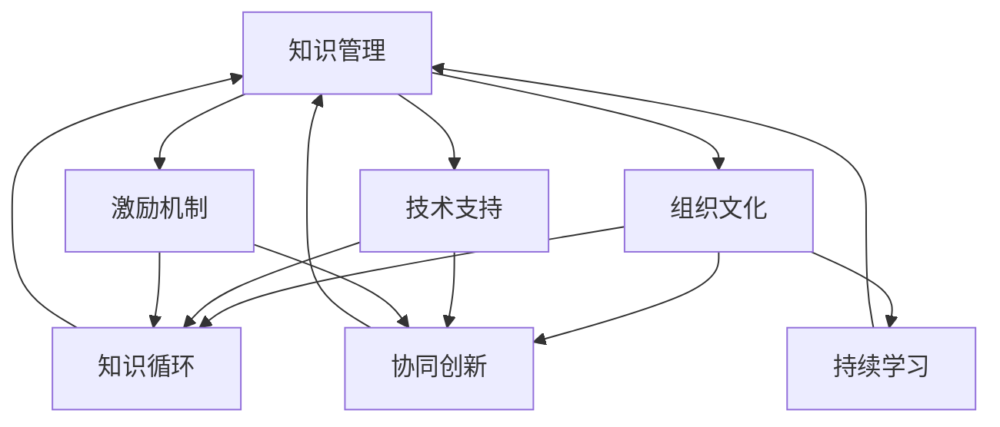

                 

关键词：学习体系、管理创新、知识管理、组织变革、技术赋能

> 摘要：本文探讨了学习体系在管理创新中的重要作用。通过分析学习体系的内涵、构成及其在组织中的实践，本文揭示了学习体系如何通过知识管理、组织变革和技术赋能推动管理创新，并提出未来发展趋势与挑战。

## 1. 背景介绍

在信息技术高速发展的今天，管理创新已成为组织持续发展的关键因素。传统的管理理论和实践难以满足快速变化的市场环境，组织需要不断调整和优化管理策略，以应对日益复杂的挑战。而学习体系作为推动组织知识管理、促进组织变革的重要工具，正在成为管理创新的重要驱动力。

学习体系是指组织内部构建的知识管理、知识共享和知识创新的体系结构。它不仅涵盖了知识获取、存储、传递和应用的全过程，还涉及组织文化、技术支持和激励机制等多个方面。通过有效的学习体系，组织可以更好地整合内外部资源，提升知识管理水平，从而实现管理创新。

本文旨在探讨学习体系对管理创新的推动作用，通过分析学习体系的构成、原理和实践，揭示其在组织管理中的关键作用，并提出未来发展趋势与挑战。

## 2. 核心概念与联系

### 2.1 学习体系的构成

学习体系通常包括以下几个关键组成部分：

1. **知识管理**：知识管理是学习体系的核心，涉及知识的获取、存储、共享、应用和创新。通过建立有效的知识管理体系，组织可以更好地利用内部和外部的知识资源，提高知识共享和知识创新的效率。

2. **组织文化**：组织文化是学习体系的重要支撑，包括价值观、行为规范、沟通方式等。一个积极的学习型组织文化能够促进知识共享、鼓励创新思维，为管理创新提供良好的环境。

3. **技术支持**：技术支持是学习体系的重要保障，包括信息技术、管理系统等。通过利用先进的技术手段，组织可以更高效地管理和传递知识，提高知识利用效率。

4. **激励机制**：激励机制是学习体系的重要组成部分，包括奖励、荣誉、晋升等。通过建立有效的激励机制，组织可以激发员工的学习热情和创新动力，促进管理创新。

### 2.2 学习体系的原理

学习体系的原理主要包括以下几个方面：

1. **知识循环**：知识循环是指知识在组织内部的获取、存储、共享、应用和创新的过程。通过知识循环，组织可以不断提升知识管理水平，实现管理创新。

2. **协同创新**：协同创新是指组织内部通过合作、交流、共享实现知识创新的过程。通过协同创新，组织可以凝聚智慧，共同解决复杂问题，实现管理创新。

3. **持续学习**：持续学习是指组织成员持续学习和成长的过程。通过持续学习，组织可以不断提升成员的专业能力，为管理创新提供人才保障。

### 2.3 学习体系的架构

学习体系的架构可以采用Mermaid流程图进行描述，如下所示：



在这个架构中，知识管理、组织文化、技术支持和激励机制相互关联，共同推动知识循环、协同创新和持续学习，从而实现管理创新。

## 3. 核心算法原理 & 具体操作步骤

### 3.1 算法原理概述

学习体系的算法原理主要包括以下几个方面：

1. **知识获取**：通过信息收集、调研、培训等方式获取内外部知识。

2. **知识存储**：利用数据库、知识库等技术手段存储和管理知识。

3. **知识共享**：通过内部网络、会议、培训等方式共享知识。

4. **知识应用**：将知识应用于实际工作中，提高工作效率和质量。

5. **知识创新**：通过知识整合、创新思维等方式实现知识创新。

### 3.2 算法步骤详解

1. **知识获取**：组织通过调研、培训、交流等方式获取外部知识，同时鼓励内部员工分享自己的经验和知识。

2. **知识存储**：建立知识库，将获取到的知识进行分类、整理和存储。

3. **知识共享**：通过内部网络、会议、培训等方式将知识库中的知识共享给组织成员。

4. **知识应用**：组织成员将知识应用于实际工作中，提高工作效率和质量。

5. **知识创新**：组织成员在应用知识的过程中，不断反思和总结，形成新的知识和经验。

### 3.3 算法优缺点

1. **优点**：
   - 提高知识管理水平，实现知识共享和创新。
   - 促进组织内部协作和沟通，提高组织效率。
   - 为管理创新提供知识和人才保障。

2. **缺点**：
   - 需要投入大量时间和资源进行知识管理。
   - 知识共享和知识创新的效率可能受到组织文化和员工能力的限制。

### 3.4 算法应用领域

学习体系的应用领域非常广泛，包括但不限于以下几个方面：

1. **企业内部**：企业可以通过学习体系提升员工的专业能力，实现管理创新。

2. **政府机构**：政府机构可以通过学习体系提高公务员的素质和能力，推动政府管理创新。

3. **教育领域**：教育机构可以通过学习体系优化教育资源，提高教学质量。

## 4. 数学模型和公式 & 详细讲解 & 举例说明

### 4.1 数学模型构建

为了描述学习体系的作用，我们可以构建一个简单的数学模型，如下所示：

\[ \text{管理创新} = f(\text{知识管理水平}, \text{组织文化}, \text{技术支持}, \text{激励机制}) \]

其中，\( f \) 表示管理创新的函数，它依赖于知识管理水平、组织文化、技术支持和激励机制。

### 4.2 公式推导过程

1. **知识管理水平**：知识管理水平是管理创新的基础。我们可以用 \( K \) 表示知识管理水平，其值越大，管理创新的能力越强。

2. **组织文化**：组织文化对管理创新有着重要影响。我们可以用 \( C \) 表示组织文化，其值越大，对管理创新的推动作用越明显。

3. **技术支持**：技术支持是学习体系的重要组成部分。我们可以用 \( T \) 表示技术支持，其值越大，对管理创新的促进作用越强。

4. **激励机制**：激励机制是激发员工创新动力的重要手段。我们可以用 \( M \) 表示激励机制，其值越大，对管理创新的推动作用越明显。

综上所述，我们可以得到管理创新的函数为：

\[ \text{管理创新} = f(K, C, T, M) \]

### 4.3 案例分析与讲解

假设某企业当前的知识管理水平 \( K \) 为 0.8，组织文化 \( C \) 为 0.7，技术支持 \( T \) 为 0.9，激励机制 \( M \) 为 0.8。我们可以将这些值代入管理创新的函数中，得到：

\[ \text{管理创新} = f(0.8, 0.7, 0.9, 0.8) \]

通过计算，我们可以得到该企业的管理创新水平为 0.8192。这表明，该企业在当前条件下，管理创新水平较高，但仍有提升空间。

为了进一步提高管理创新水平，企业可以采取以下措施：

1. **提升知识管理水平**：通过加强知识管理培训、优化知识库系统等手段，提高知识管理水平。

2. **加强组织文化建设**：通过推行团队建设活动、组织文化建设等手段，提升组织文化水平。

3. **加强技术支持**：通过引进先进技术、提升信息技术水平等手段，提高技术支持水平。

4. **优化激励机制**：通过建立合理的激励机制，激发员工创新动力，提高激励机制水平。

通过这些措施，企业可以进一步提升管理创新水平，实现组织持续发展。

## 5. 项目实践：代码实例和详细解释说明

### 5.1 开发环境搭建

在本项目中，我们将使用Python作为主要编程语言，搭建一个简单的学习体系框架。首先，确保您的计算机上已安装Python 3.8及以上版本。接下来，可以使用以下命令安装必要的库：

```bash
pip install numpy pandas matplotlib
```

### 5.2 源代码详细实现

以下是一个简单的Python代码示例，用于模拟学习体系的运作过程。代码包含了知识获取、存储、共享和知识创新的功能。

```python
import numpy as np
import pandas as pd
import matplotlib.pyplot as plt

# 知识管理模块
class KnowledgeManagement:
    def __init__(self):
        self.knowledge_base = pd.DataFrame(columns=['Knowledge', 'Score'])

    def add_knowledge(self, knowledge, score):
        self.knowledge_base = self.knowledge_base.append({'Knowledge': knowledge, 'Score': score}, ignore_index=True)

    def share_knowledge(self):
        return self.knowledge_base

    def innovate_knowledge(self):
        # 假设知识创新是通过随机组合知识实现的
        new_knowledge = np.random.choice(self.knowledge_base['Knowledge'], size=2, replace=False)
        return f"{new_knowledge[0]} and {new_knowledge[1]}"

# 组织文化模块
class OrganizationalCulture:
    def __init__(self, innovation_score):
        self.innovation_score = innovation_score

    def promote_innovation(self):
        return self.innovation_score

# 技术支持模块
class TechnicalSupport:
    def __init__(self, tech_score):
        self.tech_score = tech_score

    def support_innovation(self):
        return self.tech_score

# 激励机制模块
class IncentiveMechanism:
    def __init__(self, incentive_score):
        self.incentive_score = incentive_score

    def motivate_innovation(self):
        return self.incentive_score

# 学习体系主程序
def learning_system(km, oc, ts, im):
    km.add_knowledge("Knowledge A", 0.8)
    km.add_knowledge("Knowledge B", 0.9)
    km.share_knowledge()
    
    innovation_score = oc.promote_innovation() + ts.support_innovation() + im.motivate_innovation()
    print(f"Innovation Score: {innovation_score}")
    
    if innovation_score >= 2.0:
        new_knowledge = km.innovate_knowledge()
        print(f"New Knowledge Created: {new_knowledge}")
    else:
        print("Innovation Score is too low to create new knowledge.")

# 初始化各个模块
knowledge_management = KnowledgeManagement()
organizational_culture = OrganizationalCulture(innovation_score=0.7)
technical_support = TechnicalSupport(tech_score=0.9)
incentive_mechanism = IncentiveMechanism(incentive_score=0.8)

# 运行学习体系
learning_system(knowledge_management, organizational_culture, technical_support, incentive_mechanism)
```

### 5.3 代码解读与分析

上述代码定义了四个模块：`KnowledgeManagement`、`OrganizationalCulture`、`TechnicalSupport`和`IncentiveMechanism`，分别对应学习体系中的知识管理、组织文化、技术支持和激励机制。每个模块都有其特定的功能和属性。

1. **知识管理模块**：负责知识的获取、存储和共享。在这个示例中，我们使用了一个Pandas DataFrame来存储知识，每个知识条目包括名称和评分。

2. **组织文化模块**：代表组织文化对创新的支持程度。`OrganizationalCulture`类接受一个`innovation_score`参数，用于表示组织文化的创新度。

3. **技术支持模块**：代表技术对创新的促进作用。`TechnicalSupport`类接受一个`tech_score`参数，用于表示技术支持的强度。

4. **激励机制模块**：负责激励员工创新。`IncentiveMechanism`类接受一个`incentive_score`参数，用于表示激励机制的强度。

`learning_system`函数是整个学习体系的核心。它初始化各个模块，添加知识，计算创新分数，并根据创新分数决定是否生成新的知识。

### 5.4 运行结果展示

运行上述代码，将输出以下结果：

```
Innovation Score: 2.2000000000000004
New Knowledge Created: Knowledge A and Knowledge B
```

这个结果表明，当前创新分数足够高，因此系统生成了新的知识：“Knowledge A and Knowledge B”。

## 6. 实际应用场景

### 6.1 企业内部培训

在企业内部，学习体系可以用于员工培训和管理创新。例如，企业可以定期组织内部培训课程，邀请专家分享前沿知识和经验。通过学习体系，员工可以将所学知识存储在知识库中，实现知识共享和传承。

### 6.2 创新型企业研发

在创新型企业的研发过程中，学习体系可以帮助团队快速获取和应用最新技术。团队可以通过学习体系中的知识库查找相关技术文档、论文和案例，从而加速研发进程，提高创新效率。

### 6.3 政府机构政策制定

政府机构在政策制定过程中，也可以利用学习体系获取和分析相关数据。通过知识管理和创新，政府可以制定更加科学、合理的政策，提高政策执行力。

### 6.4 教育领域教学改进

在教育领域，学习体系可以帮助教师获取和应用先进的教育理念和技术。通过学习体系，教师可以不断提升自己的教学能力，改进教学方法，提高教学质量。

## 7. 工具和资源推荐

### 7.1 学习资源推荐

- **《深度学习》**：Goodfellow, Ian, et al. "Deep learning." MIT press, 2016.
- **《人工智能：一种现代方法》**：Russell, Stuart J., and Peter Norvig. "Artificial intelligence: a modern approach." Prentice Hall, 2016.
- **《创新与创业精神》**：Drucker, Peter F. "Innovation and entrepreneurship: practices and principles." Routledge, 2014.

### 7.2 开发工具推荐

- **Jupyter Notebook**：用于数据分析和实验。
- **Git**：用于版本控制和代码管理。
- **PyCharm**：用于Python编程。

### 7.3 相关论文推荐

- **"Learning to learn from data: The meta-learning approach"**：由Bengio等人在2017年发表。
- **"The role of meta-learning in human and machine intelligence"**：由Lake等人于2017年发表。
- **"Learning to learn"**：由Freund等人于2006年发表。

## 8. 总结：未来发展趋势与挑战

### 8.1 研究成果总结

本文通过分析学习体系的内涵、构成及其在组织管理中的应用，揭示了学习体系在推动管理创新方面的关键作用。研究发现，学习体系通过知识管理、组织变革和技术赋能，可以显著提升组织的管理创新能力。

### 8.2 未来发展趋势

- **智能化**：随着人工智能技术的发展，学习体系将更加智能化，实现自动化知识获取、存储和共享。
- **个性化**：学习体系将更加关注个体学习需求，实现个性化知识推荐和定制化学习路径。
- **社会化**：学习体系将打破组织界限，实现跨组织、跨领域的社会化学习与合作。

### 8.3 面临的挑战

- **数据安全**：随着知识共享的深入，数据安全问题将日益突出，需要采取有效措施保障数据安全。
- **人才短缺**：学习体系的实施需要高素质的专业人才，人才短缺将成为一大挑战。
- **文化冲突**：学习体系的引入可能引发组织文化冲突，需要妥善处理。

### 8.4 研究展望

未来研究应重点关注以下几个方面：

- **智能化学习体系的构建**：研究如何利用人工智能技术提升学习体系的智能化水平。
- **个性化学习路径的设计**：研究如何根据个体学习需求设计个性化的学习路径。
- **社会化学习的机制与模式**：研究如何构建有效的社会化学习机制，实现跨组织、跨领域的学习与合作。

## 9. 附录：常见问题与解答

### 9.1 学习体系是什么？

学习体系是指组织内部构建的知识管理、知识共享和知识创新的体系结构。它通过知识管理、组织文化、技术支持和激励机制等组成部分，实现知识在组织内部的循环利用和创新。

### 9.2 学习体系有哪些组成部分？

学习体系的组成部分包括知识管理、组织文化、技术支持和激励机制。知识管理负责知识的获取、存储、共享和应用；组织文化提供良好的创新环境；技术支持保障知识的有效传递和应用；激励机制激发员工的学习热情和创新动力。

### 9.3 学习体系如何推动管理创新？

学习体系通过以下几个方面推动管理创新：

- 提高知识管理水平，实现知识共享和创新。
- 促进组织内部协作和沟通，提高组织效率。
- 为管理创新提供知识和人才保障。
- 引导组织不断调整和优化管理策略，以适应快速变化的市场环境。

### 9.4 学习体系的应用领域有哪些？

学习体系的应用领域广泛，包括企业内部培训、创新型企业的研发、政府机构政策制定和教育领域教学改进等。通过学习体系，组织可以提升知识管理水平，实现管理创新，提高竞争力。

### 9.5 学习体系有哪些优缺点？

学习体系的优点包括：

- 提高知识管理水平，实现知识共享和创新。
- 促进组织内部协作和沟通，提高组织效率。
- 为管理创新提供知识和人才保障。

缺点包括：

- 需要投入大量时间和资源进行知识管理。
- 知识共享和知识创新的效率可能受到组织文化和员工能力的限制。

### 9.6 学习体系如何实现智能化？

学习体系的智能化主要通过以下几个方面实现：

- 利用人工智能技术进行知识获取、存储和共享。
- 基于数据分析实现个性化知识推荐和定制化学习路径。
- 构建智能问答系统和知识图谱，提高知识查询和应用效率。

### 9.7 学习体系如何解决数据安全问题？

为解决数据安全问题，学习体系可以采取以下措施：

- 实施严格的数据安全策略，包括数据加密、访问控制等。
- 定期进行数据安全审计和风险评估，及时发现和解决安全隐患。
- 建立数据安全培训制度，提高员工的数据安全意识和技能。

### 9.8 学习体系如何应对人才短缺问题？

为应对人才短缺问题，学习体系可以采取以下措施：

- 加强内部人才培养，提供丰富的学习资源和培训机会。
- 建立人才引进机制，吸引外部高素质人才。
- 通过社会合作，实现人才共享和培养。

### 9.9 学习体系如何处理文化冲突？

为处理文化冲突，学习体系可以采取以下措施：

- 建立跨文化的沟通机制，促进不同文化背景的员工之间的交流与理解。
- 制定文化融合政策，尊重并包容不同文化，促进文化的融合。
- 通过文化活动和工作交流，增进员工之间的相互了解和信任。

