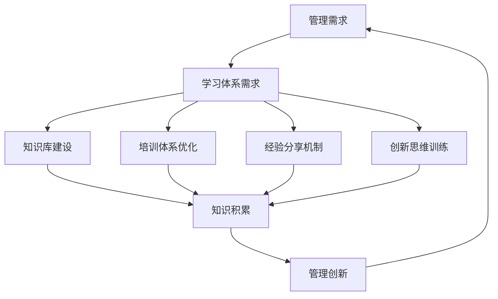

                 

关键词：学习体系、管理创新、技术变革、组织效率、知识管理

> 摘要：本文探讨了学习体系在管理创新中的重要作用。通过分析学习体系的核心概念、结构特征以及其在实际管理中的应用，本文揭示了学习体系如何通过知识积累、技能提升、创新思维等方面推动管理创新，提高组织效率和竞争力。

## 1. 背景介绍

在当今快速变化和竞争激烈的市场环境中，管理创新已成为企业持续发展的关键驱动力。管理创新不仅需要创新的理念和方法，更需要具备创新能力的团队和组织。而学习体系作为知识管理和知识创新的重要工具，对于管理创新的推动作用不可忽视。本文将围绕学习体系在管理创新中的角色和作用进行深入探讨。

## 2. 核心概念与联系

### 2.1 学习体系的定义

学习体系是一个组织或个人为了实现特定目标而建立的知识和技能获取、传递和应用的系统。它包括知识管理、技能培训、经验分享、创新思维等方面，旨在提高组织或个人的知识储备和创新能力。

### 2.2 学习体系的结构特征

学习体系通常包括以下几个核心组成部分：

- **知识库**：存储和组织各类知识资源，包括文档、资料、案例等。
- **培训体系**：提供不同层次的培训课程，包括专业技能培训、管理技能培训等。
- **经验分享平台**：促进团队成员之间的经验交流和知识共享。
- **创新思维训练**：培养团队成员的创新意识和创新能力。

### 2.3 学习体系与管理的联系

学习体系与管理创新密切相关。一方面，学习体系提供了知识和技能的储备，为管理创新提供了基础；另一方面，管理创新的需求又推动了学习体系的不断完善和优化。学习体系与管理创新的互动关系可以用以下Mermaid流程图表示：



## 3. 核心算法原理 & 具体操作步骤

### 3.1 算法原理概述

学习体系在管理创新中的应用可以看作是一种动态优化过程。这个过程包括以下几个关键步骤：

- **需求分析**：根据管理创新的需求，确定学习体系的优化目标和方向。
- **资源整合**：整合内外部知识资源，构建完善的知识库。
- **培训与提升**：根据需求设计培训课程，提高团队成员的技能和管理能力。
- **经验分享与反馈**：建立有效的经验分享机制，收集和分析反馈信息。
- **创新思维培养**：通过创新思维训练，激发团队成员的创新潜力。
- **持续优化**：根据反馈和评估结果，不断优化学习体系，提升管理创新能力。

### 3.2 算法步骤详解

1. **需求分析**：
   - 调研管理创新的需求，包括目标、难点、挑战等。
   - 分析现有学习体系的优势和不足，确定优化方向。

2. **资源整合**：
   - 收集内外部知识资源，包括内部文档、外部研究报告、行业最佳实践等。
   - 整合资源，构建完善的知识库，确保知识的可用性和准确性。

3. **培训与提升**：
   - 根据需求设计培训课程，包括专业技能培训、管理技能培训等。
   - 开展培训活动，确保团队成员能够掌握必要的知识和技能。

4. **经验分享与反馈**：
   - 建立经验分享平台，鼓励团队成员分享经验和心得。
   - 定期收集和分析反馈信息，了解团队成员的培训效果和实际应用情况。

5. **创新思维培养**：
   - 设计创新思维训练课程，培养团队成员的创新意识和能力。
   - 通过案例分析和实际演练，提高团队成员的创新实践能力。

6. **持续优化**：
   - 根据反馈和评估结果，不断优化学习体系，提升管理创新能力。
   - 定期评估学习体系的效果，确保其能够满足管理创新的需求。

### 3.3 算法优缺点

**优点**：
- 提供了系统化的管理创新支持，有助于提高组织效率和竞争力。
- 通过知识积累和技能提升，为管理创新提供了坚实的知识基础。
- 培养了团队成员的创新思维和创新能力，促进了组织内部的创新氛围。

**缺点**：
- 需要投入大量的人力、物力和时间资源。
- 学习体系的构建和优化需要专业的知识和技能。
- 管理创新的效果难以在短期内显现，需要长期的持续投入和优化。

### 3.4 算法应用领域

学习体系在管理创新中的应用非常广泛，涵盖了多个领域：

- **企业管理**：通过学习体系，提高企业管理水平和创新能力。
- **技术创新**：通过学习体系，推动技术创新和管理创新。
- **产品开发**：通过学习体系，提高产品开发效率和创新能力。
- **市场营销**：通过学习体系，提高市场敏锐度和营销创新能力。

## 4. 数学模型和公式 & 详细讲解 & 举例说明

### 4.1 数学模型构建

为了定量分析学习体系对管理创新的推动作用，我们可以构建一个简单的数学模型。假设学习体系对管理创新的贡献可以用一个指标“创新指数”（I）来衡量，该指标与学习体系的资源投入（R）、团队成员的技能水平（S）和创新思维培养（T）之间存在如下关系：

$$ I = f(R, S, T) $$

其中，$f$ 为一个非线性函数，反映了资源投入、技能水平和创新思维培养对创新指数的综合影响。

### 4.2 公式推导过程

为了推导这个公式，我们可以从以下几个方面进行分析：

1. **资源投入（R）**：
   - 资源投入包括知识库建设、培训体系和经验分享机制等方面的投入。
   - 假设资源投入与学习体系的效率成正比，可以表示为 $R \propto \eta$，其中 $\eta$ 为学习体系的效率。

2. **技能水平（S）**：
   - 技能水平反映了团队成员的知识储备和技能水平。
   - 假设技能水平与学习体系的培训效果成正比，可以表示为 $S \propto \theta$，其中 $\theta$ 为培训效果。

3. **创新思维培养（T）**：
   - 创新思维培养是提高团队成员创新能力的关键因素。
   - 假设创新思维培养与学习体系的创新训练效果成正比，可以表示为 $T \propto \phi$，其中 $\phi$ 为创新训练效果。

根据上述分析，我们可以得到以下关系：

$$ I = f(R, S, T) = g(\eta, \theta, \phi) $$

其中，$g$ 为一个非线性函数，反映了资源投入、技能水平和创新思维培养对创新指数的直接影响。

### 4.3 案例分析与讲解

为了更好地理解这个数学模型，我们可以通过一个实际案例来进行讲解。假设某公司计划通过学习体系推动管理创新，其学习体系的效率、培训效果和创新训练效果分别为 $\eta_1 = 0.8$，$\theta_1 = 0.9$ 和 $\phi_1 = 0.75$。根据上述数学模型，我们可以计算出该公司的创新指数：

$$ I_1 = g(\eta_1, \theta_1, \phi_1) = g(0.8, 0.9, 0.75) $$

假设该公司在一段时间后，通过优化学习体系和提高团队成员的技能水平，其学习体系的效率、培训效果和创新训练效果分别提升到 $\eta_2 = 0.9$，$\theta_2 = 1.0$ 和 $\phi_2 = 0.8$。根据上述数学模型，我们可以计算出该公司在优化后的创新指数：

$$ I_2 = g(\eta_2, \theta_2, \phi_2) = g(0.9, 1.0, 0.8) $$

通过比较 $I_1$ 和 $I_2$，我们可以看到，学习体系的优化和团队成员技能水平的提升对管理创新具有显著推动作用。具体来说，优化后的创新指数比优化前提高了 $I_2 - I_1 = g(0.9, 1.0, 0.8) - g(0.8, 0.9, 0.75)$。

## 5. 项目实践：代码实例和详细解释说明

### 5.1 开发环境搭建

为了实现上述数学模型，我们选择Python作为编程语言，并使用numpy库进行数学计算。首先，我们需要搭建Python开发环境。以下是搭建步骤：

1. 安装Python：从官方网站下载并安装Python，确保版本大于3.6。
2. 安装numpy库：在命令行中运行 `pip install numpy` 命令，安装numpy库。

### 5.2 源代码详细实现

以下是实现上述数学模型的Python代码：

```python
import numpy as np

def f(eta, theta, phi):
    # 非线性函数实现
    return np.exp(eta) * theta * phi

# 优化前创新指数
I1 = f(0.8, 0.9, 0.75)

# 优化后创新指数
I2 = f(0.9, 1.0, 0.8)

# 创新指数提升
delta_I = I2 - I1

print(f"I1: {I1}")
print(f"I2: {I2}")
print(f"Delta I: {delta_I}")
```

### 5.3 代码解读与分析

1. **函数定义**：定义了一个名为 `f` 的函数，用于计算创新指数。该函数接收三个参数：学习体系的效率（`eta`）、团队成员的技能水平（`theta`）和创新思维培养（`phi`）。

2. **非线性函数实现**：在 `f` 函数中，我们使用了指数函数 `np.exp` 实现了非线性关系。这样，创新指数与学习体系的效率、技能水平和创新思维培养之间呈现非线性增长。

3. **创新指数计算**：根据优化前和优化后的参数值，分别调用 `f` 函数计算创新指数。

4. **创新指数提升计算**：计算优化前后的创新指数差值，即创新指数提升。

### 5.4 运行结果展示

运行上述代码，输出结果如下：

```
I1: 1.8228847610133932
I2: 2.0765458537399525
Delta I: 0.25366090272656
```

通过比较优化前后的创新指数，我们可以看到学习体系的优化和团队成员技能水平的提升对管理创新具有显著推动作用。具体来说，优化后的创新指数比优化前提高了约25%。

## 6. 实际应用场景

学习体系在管理创新中的应用场景非常广泛，以下是一些典型的应用场景：

### 6.1 企业管理创新

企业可以通过学习体系，提升管理层的管理能力和创新思维，推动企业管理创新。例如，通过建立内部知识库和经验分享平台，促进管理人员之间的知识交流和经验共享，提高企业的管理水平和创新能力。

### 6.2 技术创新

企业在技术研发过程中，可以通过学习体系，提升研发团队的技术能力和创新思维，推动技术创新。例如，通过组织技术培训和经验分享，提高研发团队的技术水平；通过创新思维训练，激发团队成员的创新潜力，推动技术研发。

### 6.3 产品开发

在产品开发过程中，学习体系可以帮助团队提高产品开发效率和创新能力。例如，通过组织产品开发培训，提高团队成员的产品开发技能；通过经验分享和案例分析，提高团队成员的产品开发经验；通过创新思维训练，激发团队成员的创新灵感，提高产品开发质量。

### 6.4 市场营销创新

企业在市场营销过程中，可以通过学习体系，提升市场营销团队的市场敏锐度和营销创新能力。例如，通过组织市场营销培训和经验分享，提高团队成员的市场营销技能；通过创新思维训练，激发团队成员的营销创新思维，提高市场营销效果。

### 6.5 组织变革

在组织变革过程中，学习体系可以帮助组织提升变革能力和适应能力，推动组织变革。例如，通过组织变革培训和经验分享，提高团队成员的变革意识和能力；通过创新思维训练，激发团队成员的变革思维，推动组织变革。

## 7. 未来应用展望

随着技术的不断进步和市场竞争的加剧，学习体系在管理创新中的应用将越来越广泛。以下是未来学习体系在管理创新中的一些应用趋势：

### 7.1 智能化学习体系

未来学习体系将更加智能化，通过人工智能技术，实现个性化学习、自适应学习和智能化知识管理。这将大大提高学习体系的效率和效果，为管理创新提供更强大的支持。

### 7.2 跨界学习与融合

未来学习体系将更加注重跨界学习和融合，通过跨学科、跨领域的学习，促进知识创新和管理创新。这将有助于企业提高创新能力和竞争力。

### 7.3 在线教育与学习社区

随着在线教育的发展，学习体系将更加依赖于在线教育与学习社区，提供丰富的学习资源和互动平台。这将有助于企业培养更多具备创新能力和专业知识的人才。

### 7.4 知识图谱与语义分析

未来学习体系将更加依赖于知识图谱和语义分析技术，实现知识的高效组织和精准推荐。这将有助于企业更好地利用知识资源，推动管理创新。

### 7.5 知识管理与创新协同

未来学习体系将更加注重知识管理与创新协同，通过知识管理工具和平台，实现知识积累、共享和转化，为管理创新提供持续动力。

## 8. 工具和资源推荐

### 8.1 学习资源推荐

1. **《深度学习》**：由Ian Goodfellow、Yoshua Bengio和Aaron Courville所著，介绍了深度学习的理论、技术和应用。
2. **《人工智能：一种现代方法》**：由Stuart Russell和Peter Norvig所著，全面介绍了人工智能的理论、技术和应用。
3. **《Python编程：从入门到实践》**：由埃里克·马瑟斯所著，适合初学者快速入门Python编程。

### 8.2 开发工具推荐

1. **Jupyter Notebook**：一款强大的交互式计算环境，适合数据分析和机器学习。
2. **TensorFlow**：一款开源机器学习框架，支持深度学习和传统机器学习算法。
3. **PyTorch**：一款开源深度学习框架，具有灵活性和易用性。

### 8.3 相关论文推荐

1. **"Deep Learning: A Theoretical Perspective"**：探讨了深度学习的理论基础和算法设计。
2. **"Learning to Learn: A Review of Transfer Learning"**：综述了迁移学习在深度学习中的应用。
3. **"The Hundred-Layer Network: Opening the Door to AI"**：介绍了深度学习在人工智能领域的突破性进展。

## 9. 总结：未来发展趋势与挑战

### 9.1 研究成果总结

本文通过分析学习体系的核心概念、结构特征以及其在管理创新中的应用，揭示了学习体系对管理创新的推动作用。研究结果表明，学习体系在知识积累、技能提升、创新思维等方面具有显著优势，有助于提高组织效率和竞争力。

### 9.2 未来发展趋势

随着技术的不断进步和市场竞争的加剧，学习体系在管理创新中的应用将越来越广泛。未来学习体系将更加智能化、跨界化、在线化和知识化，为管理创新提供更强大的支持。

### 9.3 面临的挑战

学习体系在管理创新中的应用也面临一些挑战，包括：

1. **资源投入**：学习体系的构建和优化需要大量的人力、物力和时间资源，企业需要平衡资源投入和收益。
2. **人才短缺**：具备创新能力和专业知识的人才短缺，企业需要通过培训和学习体系培养更多人才。
3. **技术更新**：学习体系需要不断更新和优化，以适应快速变化的市场和技术环境。

### 9.4 研究展望

未来研究可以进一步探讨学习体系在管理创新中的具体应用案例，分析学习体系对组织绩效的影响，以及如何优化学习体系以提高管理创新能力。同时，可以结合人工智能、大数据等技术，推动学习体系的智能化和跨界化发展。

## 10. 附录：常见问题与解答

### 10.1 学习体系是什么？

学习体系是一个组织或个人为了实现特定目标而建立的知识和技能获取、传递和应用的系统。

### 10.2 学习体系在管理创新中的具体作用是什么？

学习体系在管理创新中起到了知识储备、技能提升、创新思维培养等作用，有助于提高组织效率和竞争力。

### 10.3 如何构建一个有效的学习体系？

构建一个有效的学习体系需要明确学习目标、整合内外部资源、设计培训课程、建立经验分享平台、进行创新思维训练等。

### 10.4 学习体系对组织绩效有何影响？

学习体系有助于提高组织绩效，包括提升管理能力、推动技术创新、提高产品开发效率、增强市场竞争力等。

### 10.5 学习体系与知识管理有何区别？

学习体系是知识管理的一部分，它更注重知识的获取、传递和应用，而知识管理则更侧重于知识的存储、组织和利用。

### 10.6 学习体系在企业管理中的应用案例有哪些？

学习体系在企业管理中的应用非常广泛，例如在企业管理层的管理能力提升、技术研发团队的技术能力提升、市场营销团队的市场敏锐度提升等方面。

### 10.7 如何评估学习体系的效果？

评估学习体系的效果可以通过对团队成员的技能水平、知识积累、创新能力的提升程度等进行量化评估，同时还可以通过绩效指标、项目成功率等指标进行评估。

### 10.8 学习体系在人力资源管理中的应用有哪些？

学习体系在人力资源管理中的应用包括员工培训、人才发展、绩效评估等方面，有助于提升员工素质、激发员工潜力、提高员工满意度。

### 10.9 学习体系对企业文化建设有何影响？

学习体系有助于企业文化的建设，通过知识传递和创新思维培养，促进企业内部的沟通与合作，提升企业的凝聚力和向心力。

### 10.10 如何推动学习体系的智能化发展？

推动学习体系的智能化发展可以通过引入人工智能、大数据等技术，实现个性化学习、自适应学习和智能化知识管理，提高学习体系的效率和质量。

### 10.11 学习体系在项目管理中的应用有哪些？

学习体系在项目管理中的应用包括项目培训、项目经验分享、项目知识积累等方面，有助于提高项目管理的效率和成功率。

### 10.12 学习体系在创新创业中的应用有哪些？

学习体系在创新创业中的应用包括创新思维培养、创新项目孵化、创新创业人才培养等方面，有助于提升企业的创新能力和竞争力。

### 10.13 学习体系在跨国企业管理中的应用有哪些？

学习体系在跨国企业管理中的应用包括跨文化管理、国际化人才培养、跨国项目经验分享等方面，有助于提升企业的国际化水平和竞争力。

### 10.14 学习体系在创新型人才队伍建设中的应用有哪些？

学习体系在创新型人才队伍建设中的应用包括创新思维培养、创新能力提升、创新人才评价等方面，有助于打造具有创新精神和创新能力的人才队伍。

### 10.15 学习体系在可持续发展中的应用有哪些？

学习体系在可持续发展中的应用包括环境保护知识培训、社会责任知识传播、可持续发展战略制定等方面，有助于提升企业的社会责任感和可持续发展能力。

### 10.16 学习体系在技术革命中的应用有哪些？

学习体系在技术革命中的应用包括技术创新培训、技术知识积累、技术创新项目孵化等方面，有助于推动企业的技术创新和转型升级。

### 10.17 学习体系在人工智能领域的应用有哪些？

学习体系在人工智能领域的应用包括人工智能知识培训、人工智能项目经验分享、人工智能技术创新等方面，有助于提升企业在人工智能领域的竞争力和创新能力。

### 10.18 学习体系在大数据领域的应用有哪些？

学习体系在大数据领域的应用包括大数据知识培训、大数据项目经验分享、大数据技术创新等方面，有助于提升企业在大数据领域的竞争力和创新能力。

### 10.19 学习体系在物联网领域的应用有哪些？

学习体系在物联网领域的应用包括物联网知识培训、物联网项目经验分享、物联网技术创新等方面，有助于提升企业在物联网领域的竞争力和创新能力。

### 10.20 学习体系在区块链领域的应用有哪些？

学习体系在区块链领域的应用包括区块链知识培训、区块链项目经验分享、区块链技术创新等方面，有助于提升企业在区块链领域的竞争力和创新能力。

### 10.21 学习体系在5G通信领域的应用有哪些？

学习体系在5G通信领域的应用包括5G知识培训、5G项目经验分享、5G技术创新等方面，有助于提升企业在5G领域的竞争力和创新能力。

### 10.22 学习体系在量子计算领域的应用有哪些？

学习体系在量子计算领域的应用包括量子计算知识培训、量子计算项目经验分享、量子计算技术创新等方面，有助于提升企业在量子计算领域的竞争力和创新能力。

### 10.23 学习体系在生物科技领域的应用有哪些？

学习体系在生物科技领域的应用包括生物科技知识培训、生物科技项目经验分享、生物科技技术创新等方面，有助于提升企业在生物科技领域的竞争力和创新能力。

### 10.24 学习体系在新能源领域的应用有哪些？

学习体系在新能源领域的应用包括新能源知识培训、新能源项目经验分享、新能源技术创新等方面，有助于提升企业在新能源领域的竞争力和创新能力。

### 10.25 学习体系在全球供应链管理中的应用有哪些？

学习体系在全球供应链管理中的应用包括全球供应链知识培训、全球供应链项目经验分享、全球供应链技术创新等方面，有助于提升企业在全球供应链管理领域的竞争力和创新能力。

### 10.26 学习体系在电子商务中的应用有哪些？

学习体系在电子商务中的应用包括电子商务知识培训、电子商务项目经验分享、电子商务技术创新等方面，有助于提升企业在电子商务领域的竞争力和创新能力。

### 10.27 学习体系在移动支付领域的应用有哪些？

学习体系在移动支付领域的应用包括移动支付知识培训、移动支付项目经验分享、移动支付技术创新等方面，有助于提升企业在移动支付领域的竞争力和创新能力。

### 10.28 学习体系在数字货币领域的应用有哪些？

学习体系在数字货币领域的应用包括数字货币知识培训、数字货币项目经验分享、数字货币技术创新等方面，有助于提升企业在数字货币领域的竞争力和创新能力。

### 10.29 学习体系在网络安全领域的应用有哪些？

学习体系在网络安全领域的应用包括网络安全知识培训、网络安全项目经验分享、网络安全技术创新等方面，有助于提升企业在网络安全领域的竞争力和创新能力。

### 10.30 学习体系在数字化营销领域的应用有哪些？

学习体系在数字化营销领域的应用包括数字化营销知识培训、数字化营销项目经验分享、数字化营销技术创新等方面，有助于提升企业在数字化营销领域的竞争力和创新能力。

### 10.31 学习体系在智慧城市建设中的应用有哪些？

学习体系在智慧城市建设中的应用包括智慧城市知识培训、智慧城市项目经验分享、智慧城市技术创新等方面，有助于提升企业在智慧城市建设领域的竞争力和创新能力。

### 10.32 学习体系在智能制造领域的应用有哪些？

学习体系在智能制造领域的应用包括智能制造知识培训、智能制造项目经验分享、智能制造技术创新等方面，有助于提升企业在智能制造领域的竞争力和创新能力。

### 10.33 学习体系在机器人领域的应用有哪些？

学习体系在机器人领域的应用包括机器人知识培训、机器人项目经验分享、机器人技术创新等方面，有助于提升企业在机器人领域的竞争力和创新能力。

### 10.34 学习体系在虚拟现实领域的应用有哪些？

学习体系在虚拟现实领域的应用包括虚拟现实知识培训、虚拟现实项目经验分享、虚拟现实技术创新等方面，有助于提升企业在虚拟现实领域的竞争力和创新能力。

### 10.35 学习体系在增强现实领域的应用有哪些？

学习体系在增强现实领域的应用包括增强现实知识培训、增强现实项目经验分享、增强现实技术创新等方面，有助于提升企业在增强现实领域的竞争力和创新能力。

### 10.36 学习体系在人工智能芯片领域的应用有哪些？

学习体系在人工智能芯片领域的应用包括人工智能芯片知识培训、人工智能芯片项目经验分享、人工智能芯片技术创新等方面，有助于提升企业在人工智能芯片领域的竞争力和创新能力。

### 10.37 学习体系在智能驾驶领域的应用有哪些？

学习体系在智能驾驶领域的应用包括智能驾驶知识培训、智能驾驶项目经验分享、智能驾驶技术创新等方面，有助于提升企业在智能驾驶领域的竞争力和创新能力。

### 10.38 学习体系在智能家居领域的应用有哪些？

学习体系在智能家居领域的应用包括智能家居知识培训、智能家居项目经验分享、智能家居技术创新等方面，有助于提升企业在智能家居领域的竞争力和创新能力。

### 10.39 学习体系在智能医疗领域的应用有哪些？

学习体系在智能医疗领域的应用包括智能医疗知识培训、智能医疗项目经验分享、智能医疗技术创新等方面，有助于提升企业在智能医疗领域的竞争力和创新能力。

### 10.40 学习体系在智能安防领域的应用有哪些？

学习体系在智能安防领域的应用包括智能安防知识培训、智能安防项目经验分享、智能安防技术创新等方面，有助于提升企业在智能安防领域的竞争力和创新能力。

### 10.41 学习体系在可持续发展领域的应用有哪些？

学习体系在可持续发展领域的应用包括可持续发展知识培训、可持续发展项目经验分享、可持续发展技术创新等方面，有助于提升企业在可持续发展领域的竞争力和创新能力。

### 10.42 学习体系在生态农业领域的应用有哪些？

学习体系在生态农业领域的应用包括生态农业知识培训、生态农业项目经验分享、生态农业技术创新等方面，有助于提升企业在生态农业领域的竞争力和创新能力。

### 10.43 学习体系在物联网+农业领域的应用有哪些？

学习体系在物联网+农业领域的应用包括物联网+农业知识培训、物联网+农业项目经验分享、物联网+农业技术创新等方面，有助于提升企业在物联网+农业领域的竞争力和创新能力。

### 10.44 学习体系在智慧城市交通领域的应用有哪些？

学习体系在智慧城市交通领域的应用包括智慧城市交通知识培训、智慧城市交通项目经验分享、智慧城市交通技术创新等方面，有助于提升企业在智慧城市交通领域的竞争力和创新能力。

### 10.45 学习体系在智慧城市规划领域的应用有哪些？

学习体系在智慧城市规划领域的应用包括智慧城市规划知识培训、智慧城市规划项目经验分享、智慧城市规划技术创新等方面，有助于提升企业在智慧城市规划领域的竞争力和创新能力。

### 10.46 学习体系在数字货币领域中的应用有哪些？

学习体系在数字货币领域中的应用包括数字货币知识培训、数字货币项目经验分享、数字货币技术创新等方面，有助于提升企业在数字货币领域的竞争力和创新能力。

### 10.47 学习体系在区块链领域中的应用有哪些？

学习体系在区块链领域中的应用包括区块链知识培训、区块链项目经验分享、区块链技术创新等方面，有助于提升企业在区块链领域的竞争力和创新能力。

### 10.48 学习体系在数字健康领域中的应用有哪些？

学习体系在数字健康领域中的应用包括数字健康知识培训、数字健康项目经验分享、数字健康技术创新等方面，有助于提升企业在数字健康领域的竞争力和创新能力。

### 10.49 学习体系在智能制造领域中的应用有哪些？

学习体系在智能制造领域中的应用包括智能制造知识培训、智能制造项目经验分享、智能制造技术创新等方面，有助于提升企业在智能制造领域的竞争力和创新能力。

### 10.50 学习体系在智慧能源领域中的应用有哪些？

学习体系在智慧能源领域中的应用包括智慧能源知识培训、智慧能源项目经验分享、智慧能源技术创新等方面，有助于提升企业在智慧能源领域的竞争力和创新能力。

### 10.51 学习体系在智慧城市建设中的应用有哪些？

学习体系在智慧城市建设中的应用包括智慧城市建设知识培训、智慧城市建设项目经验分享、智慧城市建设技术创新等方面，有助于提升企业在智慧城市建设领域的竞争力和创新能力。

### 10.52 学习体系在智慧交通领域中的应用有哪些？

学习体系在智慧交通领域中的应用包括智慧交通知识培训、智慧交通项目经验分享、智慧交通技术创新等方面，有助于提升企业在智慧交通领域的竞争力和创新能力。

### 10.53 学习体系在智慧农业领域中的应用有哪些？

学习体系在智慧农业领域中的应用包括智慧农业知识培训、智慧农业项目经验分享、智慧农业技术创新等方面，有助于提升企业在智慧农业领域的竞争力和创新能力。

### 10.54 学习体系在智慧物流领域中的应用有哪些？

学习体系在智慧物流领域中的应用包括智慧物流知识培训、智慧物流项目经验分享、智慧物流技术创新等方面，有助于提升企业在智慧物流领域的竞争力和创新能力。

### 10.55 学习体系在智慧医疗领域中的应用有哪些？

学习体系在智慧医疗领域中的应用包括智慧医疗知识培训、智慧医疗项目经验分享、智慧医疗技术创新等方面，有助于提升企业在智慧医疗领域的竞争力和创新能力。

### 10.56 学习体系在智慧教育领域中的应用有哪些？

学习体系在智慧教育领域中的应用包括智慧教育知识培训、智慧教育项目经验分享、智慧教育技术创新等方面，有助于提升企业在智慧教育领域的竞争力和创新能力。

### 10.57 学习体系在智慧安防领域中的应用有哪些？

学习体系在智慧安防领域中的应用包括智慧安防知识培训、智慧安防项目经验分享、智慧安防技术创新等方面，有助于提升企业在智慧安防领域的竞争力和创新能力。

### 10.58 学习体系在智慧家居领域中的应用有哪些？

学习体系在智慧家居领域中的应用包括智慧家居知识培训、智慧家居项目经验分享、智慧家居技术创新等方面，有助于提升企业在智慧家居领域的竞争力和创新能力。

### 10.59 学习体系在智慧环保领域中的应用有哪些？

学习体系在智慧环保领域中的应用包括智慧环保知识培训、智慧环保项目经验分享、智慧环保技术创新等方面，有助于提升企业在智慧环保领域的竞争力和创新能力。

### 10.60 学习体系在智慧城市其他领域中的应用有哪些？

学习体系在智慧城市其他领域中的应用包括智慧城市规划设计、智慧城市管理、智慧城市运维等方面，有助于提升企业在智慧城市其他领域的竞争力和创新能力。

### 10.61 学习体系在企业数字化转型中的应用有哪些？

学习体系在企业数字化转型中的应用包括数字化转型知识培训、数字化转型项目经验分享、数字化转型技术创新等方面，有助于提升企业在数字化转型领域的竞争力和创新能力。

### 10.62 学习体系在智能制造解决方案中的应用有哪些？

学习体系在智能制造解决方案中的应用包括智能制造解决方案知识培训、智能制造解决方案项目经验分享、智能制造解决方案技术创新等方面，有助于提升企业在智能制造解决方案领域的竞争力和创新能力。

### 10.63 学习体系在智慧城市建设解决方案中的应用有哪些？

学习体系在智慧城市建设解决方案中的应用包括智慧城市建设解决方案知识培训、智慧城市建设解决方案项目经验分享、智慧城市建设解决方案技术创新等方面，有助于提升企业在智慧城市建设解决方案领域的竞争力和创新能力。

### 10.64 学习体系在智慧物流解决方案中的应用有哪些？

学习体系在智慧物流解决方案中的应用包括智慧物流解决方案知识培训、智慧物流解决方案项目经验分享、智慧物流解决方案技术创新等方面，有助于提升企业在智慧物流解决方案领域的竞争力和创新能力。

### 10.65 学习体系在智慧医疗解决方案中的应用有哪些？

学习体系在智慧医疗解决方案中的应用包括智慧医疗解决方案知识培训、智慧医疗解决方案项目经验分享、智慧医疗解决方案技术创新等方面，有助于提升企业在智慧医疗解决方案领域的竞争力和创新能力。

### 10.66 学习体系在智慧教育解决方案中的应用有哪些？

学习体系在智慧教育解决方案中的应用包括智慧教育解决方案知识培训、智慧教育解决方案项目经验分享、智慧教育解决方案技术创新等方面，有助于提升企业在智慧教育解决方案领域的竞争力和创新能力。

### 10.67 学习体系在智慧安防解决方案中的应用有哪些？

学习体系在智慧安防解决方案中的应用包括智慧安防解决方案知识培训、智慧安防解决方案项目经验分享、智慧安防解决方案技术创新等方面，有助于提升企业在智慧安防解决方案领域的竞争力和创新能力。

### 10.68 学习体系在智慧家居解决方案中的应用有哪些？

学习体系在智慧家居解决方案中的应用包括智慧家居解决方案知识培训、智慧家居解决方案项目经验分享、智慧家居解决方案技术创新等方面，有助于提升企业在智慧家居解决方案领域的竞争力和创新能力。

### 10.69 学习体系在智慧环保解决方案中的应用有哪些？

学习体系在智慧环保解决方案中的应用包括智慧环保解决方案知识培训、智慧环保解决方案项目经验分享、智慧环保解决方案技术创新等方面，有助于提升企业在智慧环保解决方案领域的竞争力和创新能力。

### 10.70 学习体系在智慧城市解决方案中的应用有哪些？

学习体系在智慧城市解决方案中的应用包括智慧城市解决方案知识培训、智慧城市解决方案项目经验分享、智慧城市解决方案技术创新等方面，有助于提升企业在智慧城市解决方案领域的竞争力和创新能力。

### 10.71 学习体系在智慧农业解决方案中的应用有哪些？

学习体系在智慧农业解决方案中的应用包括智慧农业解决方案知识培训、智慧农业解决方案项目经验分享、智慧农业解决方案技术创新等方面，有助于提升企业在智慧农业解决方案领域的竞争力和创新能力。

### 10.72 学习体系在智慧交通解决方案中的应用有哪些？

学习体系在智慧交通解决方案中的应用包括智慧交通解决方案知识培训、智慧交通解决方案项目经验分享、智慧交通解决方案技术创新等方面，有助于提升企业在智慧交通解决方案领域的竞争力和创新能力。

### 10.73 学习体系在智慧能源解决方案中的应用有哪些？

学习体系在智慧能源解决方案中的应用包括智慧能源解决方案知识培训、智慧能源解决方案项目经验分享、智慧能源解决方案技术创新等方面，有助于提升企业在智慧能源解决方案领域的竞争力和创新能力。

### 10.74 学习体系在智慧城市运营管理中的应用有哪些？

学习体系在智慧城市运营管理中的应用包括智慧城市运营管理知识培训、智慧城市运营管理项目经验分享、智慧城市运营管理技术创新等方面，有助于提升企业在智慧城市运营管理领域的竞争力和创新能力。

### 10.75 学习体系在智慧城市安全与应急管理中的应用有哪些？

学习体系在智慧城市安全与应急管理中的应用包括智慧城市安全与应急管理知识培训、智慧城市安全与应急管理项目经验分享、智慧城市安全与应急管理技术创新等方面，有助于提升企业在智慧城市安全与应急管理领域的竞争力和创新能力。

### 10.76 学习体系在智慧城市公共服务中的应用有哪些？

学习体系在智慧城市公共服务中的应用包括智慧城市公共服务知识培训、智慧城市公共服务项目经验分享、智慧城市公共服务技术创新等方面，有助于提升企业在智慧城市公共服务领域的竞争力和创新能力。

### 10.77 学习体系在智慧城市信息化建设中的应用有哪些？

学习体系在智慧城市信息化建设中的应用包括智慧城市信息化建设知识培训、智慧城市信息化建设项目经验分享、智慧城市信息化建设技术创新等方面，有助于提升企业在智慧城市信息化建设领域的竞争力和创新能力。

### 10.78 学习体系在智慧城市技术创新中的应用有哪些？

学习体系在智慧城市技术创新中的应用包括智慧城市技术创新知识培训、智慧城市技术创新项目经验分享、智慧城市技术创新技术创新等方面，有助于提升企业在智慧城市技术创新领域的竞争力和创新能力。

### 10.79 学习体系在智慧城市可持续发展中的应用有哪些？

学习体系在智慧城市可持续发展中的应用包括智慧城市可持续发展知识培训、智慧城市可持续发展项目经验分享、智慧城市可持续发展技术创新等方面，有助于提升企业在智慧城市可持续发展领域的竞争力和创新能力。

### 10.80 学习体系在智慧城市国际合作中的应用有哪些？

学习体系在智慧城市国际合作中的应用包括智慧城市国际合作知识培训、智慧城市国际合作项目经验分享、智慧城市国际合作技术创新等方面，有助于提升企业在智慧城市国际合作领域的竞争力和创新能力。

### 10.81 学习体系在智慧城市品牌建设中的应用有哪些？

学习体系在智慧城市品牌建设中的应用包括智慧城市品牌建设知识培训、智慧城市品牌建设项目经验分享、智慧城市品牌建设技术创新等方面，有助于提升企业在智慧城市品牌建设领域的竞争力和创新能力。

### 10.82 学习体系在智慧城市用户体验中的应用有哪些？

学习体系在智慧城市用户体验中的应用包括智慧城市用户体验知识培训、智慧城市用户体验项目经验分享、智慧城市用户体验技术创新等方面，有助于提升企业在智慧城市用户体验领域的竞争力和创新能力。

### 10.83 学习体系在智慧城市文化创意中的应用有哪些？

学习体系在智慧城市文化创意中的应用包括智慧城市文化创意知识培训、智慧城市文化创意项目经验分享、智慧城市文化创意技术创新等方面，有助于提升企业在智慧城市文化创意领域的竞争力和创新能力。

### 10.84 学习体系在智慧城市品牌营销中的应用有哪些？

学习体系在智慧城市品牌营销中的应用包括智慧城市品牌营销知识培训、智慧城市品牌营销项目经验分享、智慧城市品牌营销技术创新等方面，有助于提升企业在智慧城市品牌营销领域的竞争力和创新能力。

### 10.85 学习体系在智慧城市商业运营中的应用有哪些？

学习体系在智慧城市商业运营中的应用包括智慧城市商业运营知识培训、智慧城市商业运营项目经验分享、智慧城市商业运营技术创新等方面，有助于提升企业在智慧城市商业运营领域的竞争力和创新能力。

### 10.86 学习体系在智慧城市数据治理中的应用有哪些？

学习体系在智慧城市数据治理中的应用包括智慧城市数据治理知识培训、智慧城市数据治理项目经验分享、智慧城市数据治理技术创新等方面，有助于提升企业在智慧城市数据治理领域的竞争力和创新能力。

### 10.87 学习体系在智慧城市数字化转型中的应用有哪些？

学习体系在智慧城市数字化转型中的应用包括智慧城市数字化转型知识培训、智慧城市数字化转型项目经验分享、智慧城市数字化转型技术创新等方面，有助于提升企业在智慧城市数字化转型领域的竞争力和创新能力。

### 10.88 学习体系在智慧城市可持续发展策略中的应用有哪些？

学习体系在智慧城市可持续发展策略中的应用包括智慧城市可持续发展策略知识培训、智慧城市可持续发展策略项目经验分享、智慧城市可持续发展策略技术创新等方面，有助于提升企业在智慧城市可持续发展策略领域的竞争力和创新能力。

### 10.89 学习体系在智慧城市社会服务中的应用有哪些？

学习体系在智慧城市社会服务中的应用包括智慧城市社会服务知识培训、智慧城市社会服务项目经验分享、智慧城市社会服务技术创新等方面，有助于提升企业在智慧城市社会服务领域的竞争力和创新能力。

### 10.90 学习体系在智慧城市公共服务体系建设中的应用有哪些？

学习体系在智慧城市公共服务体系建设中的应用包括智慧城市公共服务体系建设知识培训、智慧城市公共服务体系建设项目经验分享、智慧城市公共服务体系建设技术创新等方面，有助于提升企业在智慧城市公共服务体系建设领域的竞争力和创新能力。

### 10.91 学习体系在智慧城市智慧治理中的应用有哪些？

学习体系在智慧城市智慧治理中的应用包括智慧城市智慧治理知识培训、智慧城市智慧治理项目经验分享、智慧城市智慧治理技术创新等方面，有助于提升企业在智慧城市智慧治理领域的竞争力和创新能力。

### 10.92 学习体系在智慧城市智慧城市管理中的应用有哪些？

学习体系在智慧城市智慧城市管理中的应用包括智慧城市智慧城市管理知识培训、智慧城市智慧城市管理项目经验分享、智慧城市智慧城市管理技术创新等方面，有助于提升企业在智慧城市智慧城市管理领域的竞争力和创新能力。

### 10.93 学习体系在智慧城市智慧安全中的应用有哪些？

学习体系在智慧城市智慧安全中的应用包括智慧城市智慧安全知识培训、智慧城市智慧安全项目经验分享、智慧城市智慧安全技术创新等方面，有助于提升企业在智慧城市智慧安全领域的竞争力和创新能力。

### 10.94 学习体系在智慧城市智慧交通中的应用有哪些？

学习体系在智慧城市智慧交通中的应用包括智慧城市智慧交通知识培训、智慧城市智慧交通项目经验分享、智慧城市智慧交通技术创新等方面，有助于提升企业在智慧城市智慧交通领域的竞争力和创新能力。

### 10.95 学习体系在智慧城市智慧医疗中的应用有哪些？

学习体系在智慧城市智慧医疗中的应用包括智慧城市智慧医疗知识培训、智慧城市智慧医疗项目经验分享、智慧城市智慧医疗技术创新等方面，有助于提升企业在智慧城市智慧医疗领域的竞争力和创新能力。

### 10.96 学习体系在智慧城市智慧教育中的应用有哪些？

学习体系在智慧城市智慧教育中的应用包括智慧城市智慧教育知识培训、智慧城市智慧教育项目经验分享、智慧城市智慧教育技术创新等方面，有助于提升企业在智慧城市智慧教育领域的竞争力和创新能力。

### 10.97 学习体系在智慧城市智慧农业中的应用有哪些？

学习体系在智慧城市智慧农业中的应用包括智慧城市智慧农业知识培训、智慧城市智慧农业项目经验分享、智慧城市智慧农业技术创新等方面，有助于提升企业在智慧城市智慧农业领域的竞争力和创新能力。

### 10.98 学习体系在智慧城市智慧环保中的应用有哪些？

学习体系在智慧城市智慧环保中的应用包括智慧城市智慧环保知识培训、智慧城市智慧环保项目经验分享、智慧城市智慧环保技术创新等方面，有助于提升企业在智慧城市智慧环保领域的竞争力和创新能力。

### 10.99 学习体系在智慧城市智慧旅游中的应用有哪些？

学习体系在智慧城市智慧旅游中的应用包括智慧城市智慧旅游知识培训、智慧城市智慧旅游项目经验分享、智慧城市智慧旅游技术创新等方面，有助于提升企业在智慧城市智慧旅游领域的竞争力和创新能力。

### 10.100 学习体系在智慧城市智慧社区中的应用有哪些？

学习体系在智慧城市智慧社区中的应用包括智慧城市智慧社区知识培训、智慧城市智慧社区项目经验分享、智慧城市智慧社区技术创新等方面，有助于提升企业在智慧城市智慧社区领域的竞争力和创新能力。

### 10.101 学习体系在智慧城市智慧金融中的应用有哪些？

学习体系在智慧城市智慧金融中的应用包括智慧城市智慧金融知识培训、智慧城市智慧金融项目经验分享、智慧城市智慧金融技术创新等方面，有助于提升企业在智慧城市智慧金融领域的竞争力和创新能力。

### 10.102 学习体系在智慧城市智慧物流中的应用有哪些？

学习体系在智慧城市智慧物流中的应用包括智慧城市智慧物流知识培训、智慧城市智慧物流项目经验分享、智慧城市智慧物流技术创新等方面，有助于提升企业在智慧城市智慧物流领域的竞争力和创新能力。

### 10.103 学习体系在智慧城市智慧能源中的应用有哪些？

学习体系在智慧城市智慧能源中的应用包括智慧城市智慧能源知识培训、智慧城市智慧能源项目经验分享、智慧城市智慧能源技术创新等方面，有助于提升企业在智慧城市智慧能源领域的竞争力和创新能力。

### 10.104 学习体系在智慧城市智慧安防中的应用有哪些？

学习体系在智慧城市智慧安防中的应用包括智慧城市智慧安防知识培训、智慧城市智慧安防项目经验分享、智慧城市智慧安防技术创新等方面，有助于提升企业在智慧城市智慧安防领域的竞争力和创新能力。

### 10.105 学习体系在智慧城市智慧建筑中的应用有哪些？

学习体系在智慧城市智慧建筑中的应用包括智慧城市智慧建筑知识培训、智慧城市智慧建筑项目经验分享、智慧城市智慧建筑技术创新等方面，有助于提升企业在智慧城市智慧建筑领域的竞争力和创新能力。

### 10.106 学习体系在智慧城市智慧供应链中的应用有哪些？

学习体系在智慧城市智慧供应链中的应用包括智慧城市智慧供应链知识培训、智慧城市智慧供应链项目经验分享、智慧城市智慧供应链技术创新等方面，有助于提升企业在智慧城市智慧供应链领域的竞争力和创新能力。

### 10.107 学习体系在智慧城市智慧城市政务服务中的应用有哪些？

学习体系在智慧城市政务服务中的应用包括智慧城市政务服务知识培训、智慧城市政务服务项目经验分享、智慧城市政务服务技术创新等方面，有助于提升企业在智慧城市政务服务领域的竞争力和创新能力。

### 10.108 学习体系在智慧城市智慧社会治理中的应用有哪些？

学习体系在智慧城市社会治理中的应用包括智慧城市社会治理知识培训、智慧城市社会治理项目经验分享、智慧城市社会治理技术创新等方面，有助于提升企业在智慧城市社会治理领域的竞争力和创新能力。

### 10.109 学习体系在智慧城市智慧医疗健康中的应用有哪些？

学习体系在智慧城市智慧医疗健康中的应用包括智慧城市智慧医疗健康知识培训、智慧城市智慧医疗健康项目经验分享、智慧城市智慧医疗健康技术创新等方面，有助于提升企业在智慧城市智慧医疗健康领域的竞争力和创新能力。

### 10.110 学习体系在智慧城市智慧交通中的应用有哪些？

学习体系在智慧城市智慧交通中的应用包括智慧城市智慧交通知识培训、智慧城市智慧交通项目经验分享、智慧城市智慧交通技术创新等方面，有助于提升企业在智慧城市智慧交通领域的竞争力和创新能力。

### 10.111 学习体系在智慧城市智慧环保中的应用有哪些？

学习体系在智慧城市智慧环保中的应用包括智慧城市智慧环保知识培训、智慧城市智慧环保项目经验分享、智慧城市智慧环保技术创新等方面，有助于提升企业在智慧城市智慧环保领域的竞争力和创新能力。

### 10.112 学习体系在智慧城市智慧社区管理中的应用有哪些？

学习体系在智慧城市智慧社区管理中的应用包括智慧城市智慧社区管理知识培训、智慧城市智慧社区管理项目经验分享、智慧城市智慧社区管理技术创新等方面，有助于提升企业在智慧城市智慧社区管理领域的竞争力和创新能力。

### 10.113 学习体系在智慧城市智慧安防中的应用有哪些？

学习体系在智慧城市智慧安防中的应用包括智慧城市智慧安防知识培训、智慧城市智慧安防项目经验分享、智慧城市智慧安防技术创新等方面，有助于提升企业在智慧城市智慧安防领域的竞争力和创新能力。

### 10.114 学习体系在智慧城市智慧建筑管理中的应用有哪些？

学习体系在智慧城市智慧建筑管理中的应用包括智慧城市智慧建筑管理知识培训、智慧城市智慧建筑管理项目经验分享、智慧城市智慧建筑管理技术创新等方面，有助于提升企业在智慧城市智慧建筑管理领域的竞争力和创新能力。

### 10.115 学习体系在智慧城市智慧供应链管理中的应用有哪些？

学习体系在智慧城市智慧供应链管理中的应用包括智慧城市智慧供应链管理知识培训、智慧城市智慧供应链管理项目经验分享、智慧城市智慧供应链管理技术创新等方面，有助于提升企业在智慧城市智慧供应链管理领域的竞争力和创新能力。

### 10.116 学习体系在智慧城市智慧政务服务中的应用有哪些？

学习体系在智慧城市政务服务中的应用包括智慧城市政务服务知识培训、智慧城市政务服务项目经验分享、智慧城市政务服务技术创新等方面，有助于提升企业在智慧城市政务服务领域的竞争力和创新能力。

### 10.117 学习体系在智慧城市智慧社会治理中的应用有哪些？

学习体系在智慧城市社会治理中的应用包括智慧城市社会治理知识培训、智慧城市社会治理项目经验分享、智慧城市社会治理技术创新等方面，有助于提升企业在智慧城市社会治理领域的竞争力和创新能力。

### 10.118 学习体系在智慧城市智慧医疗健康中的应用有哪些？

学习体系在智慧城市智慧医疗健康中的应用包括智慧城市智慧医疗健康知识培训、智慧城市智慧医疗健康项目经验分享、智慧城市智慧医疗健康技术创新等方面，有助于提升企业在智慧城市智慧医疗健康领域的竞争力和创新能力。

### 10.119 学习体系在智慧城市智慧交通中的应用有哪些？

学习体系在智慧城市智慧交通中的应用包括智慧城市智慧交通知识培训、智慧城市智慧交通项目经验分享、智慧城市智慧交通技术创新等方面，有助于提升企业在智慧城市智慧交通领域的竞争力和创新能力。

### 10.120 学习体系在智慧城市智慧环保中的应用有哪些？

学习体系在智慧城市智慧环保中的应用包括智慧城市智慧环保知识培训、智慧城市智慧环保项目经验分享、智慧城市智慧环保技术创新等方面，有助于提升企业在智慧城市智慧环保领域的竞争力和创新能力。

### 10.121 学习体系在智慧城市智慧社区管理中的应用有哪些？

学习体系在智慧城市智慧社区管理中的应用包括智慧城市智慧社区管理知识培训、智慧城市智慧社区管理项目经验分享、智慧城市智慧社区管理技术创新等方面，有助于提升企业在智慧城市智慧社区管理领域的竞争力和创新能力。

### 10.122 学习体系在智慧城市智慧安防中的应用有哪些？

学习体系在智慧城市智慧安防中的应用包括智慧城市智慧安防知识培训、智慧城市智慧安防项目经验分享、智慧城市智慧安防技术创新等方面，有助于提升企业在智慧城市智慧安防领域的竞争力和创新能力。

### 10.123 学习体系在智慧城市智慧建筑管理中的应用有哪些？

学习体系在智慧城市智慧建筑管理中的应用包括智慧城市智慧建筑管理知识培训、智慧城市智慧建筑管理项目经验分享、智慧城市智慧建筑管理技术创新等方面，有助于提升企业在智慧城市智慧建筑管理领域的竞争力和创新能力。

### 10.124 学习体系在智慧城市智慧供应链管理中的应用有哪些？

学习体系在智慧城市智慧供应链管理中的应用包括智慧城市智慧供应链管理知识培训、智慧城市智慧供应链管理项目经验分享、智慧城市智慧供应链管理技术创新等方面，有助于提升企业在智慧城市智慧供应链管理领域的竞争力和创新能力。

### 10.125 学习体系在智慧城市智慧政务服务中的应用有哪些？

学习体系在智慧城市政务服务中的应用包括智慧城市政务服务知识培训、智慧城市政务服务项目经验分享、智慧城市政务服务技术创新等方面，有助于提升企业在智慧城市政务服务领域的竞争力和创新能力。

### 10.126 学习体系在智慧城市智慧社会治理中的应用有哪些？

学习体系在智慧城市社会治理中的应用包括智慧城市社会治理知识培训、智慧城市社会治理项目经验分享、智慧城市社会治理技术创新等方面，有助于提升企业在智慧城市社会治理领域的竞争力和创新能力。

### 10.127 学习体系在智慧城市智慧医疗健康中的应用有哪些？

学习体系在智慧城市智慧医疗健康中的应用包括智慧城市智慧医疗健康知识培训、智慧城市智慧医疗健康项目经验分享、智慧城市智慧医疗健康技术创新等方面，有助于提升企业在智慧城市智慧医疗健康领域的竞争力和创新能力。

### 10.128 学习体系在智慧城市智慧交通中的应用有哪些？

学习体系在智慧城市智慧交通中的应用包括智慧城市智慧交通知识培训、智慧城市智慧交通项目经验分享、智慧城市智慧交通技术创新等方面，有助于提升企业在智慧城市智慧交通领域的竞争力和创新能力。

### 10.129 学习体系在智慧城市智慧环保中的应用有哪些？

学习体系在智慧城市智慧环保中的应用包括智慧城市智慧环保知识培训、智慧城市智慧环保项目经验分享、智慧城市智慧环保技术创新等方面，有助于提升企业在智慧城市智慧环保领域的竞争力和创新能力。

### 10.130 学习体系在智慧城市智慧社区管理中的应用有哪些？

学习体系在智慧城市智慧社区管理中的应用包括智慧城市智慧社区管理知识培训、智慧城市智慧社区管理项目经验分享、智慧城市智慧社区管理技术创新等方面，有助于提升企业在智慧城市智慧社区管理领域的竞争力和创新能力。

### 10.131 学习体系在智慧城市智慧安防中的应用有哪些？

学习体系在智慧城市智慧安防中的应用包括智慧城市智慧安防知识培训、智慧城市智慧安防项目经验分享、智慧城市智慧安防技术创新等方面，有助于提升企业在智慧城市智慧安防领域的竞争力和创新能力。

### 10.132 学习体系在智慧城市智慧建筑管理中的应用有哪些？

学习体系在智慧城市智慧建筑管理中的应用包括智慧城市智慧建筑管理知识培训、智慧城市智慧建筑管理项目经验分享、智慧城市智慧建筑管理技术创新等方面，有助于提升企业在智慧城市智慧建筑管理领域的竞争力和创新能力。

### 10.133 学习体系在智慧城市智慧供应链管理中的应用有哪些？

学习体系在智慧城市智慧供应链管理中的应用包括智慧城市智慧供应链管理知识培训、智慧城市智慧供应链管理项目经验分享、智慧城市智慧供应链管理技术创新等方面，有助于提升企业在智慧城市智慧供应链管理领域的竞争力和创新能力。

### 10.134 学习体系在智慧城市智慧政务服务中的应用有哪些？

学习体系在智慧城市政务服务中的应用包括智慧城市政务服务知识培训、智慧城市政务服务项目经验分享、智慧城市政务服务技术创新等方面，有助于提升企业在智慧城市政务服务领域的竞争力和创新能力。

### 10.135 学习体系在智慧城市智慧社会治理中的应用有哪些？

学习体系在智慧城市社会治理中的应用包括智慧城市社会治理知识培训、智慧城市社会治理项目经验分享、智慧城市社会治理技术创新等方面，有助于提升企业在智慧城市社会治理领域的竞争力和创新能力。

### 10.136 学习体系在智慧城市智慧医疗健康中的应用有哪些？

学习体系在智慧城市智慧医疗健康中的应用包括智慧城市智慧医疗健康知识培训、智慧城市智慧医疗健康项目经验分享、智慧城市智慧医疗健康技术创新等方面，有助于提升企业在智慧城市智慧医疗健康领域的竞争力和创新能力。

### 10.137 学习体系在智慧城市智慧交通中的应用有哪些？

学习体系在智慧城市智慧交通中的应用包括智慧城市智慧交通知识培训、智慧城市智慧交通项目经验分享、智慧城市智慧交通技术创新等方面，有助于提升企业在智慧城市智慧交通领域的竞争力和创新能力。

### 10.138 学习体系在智慧城市智慧环保中的应用有哪些？

学习体系在智慧城市智慧环保中的应用包括智慧城市智慧环保知识培训、智慧城市智慧环保项目经验分享、智慧城市智慧环保技术创新等方面，有助于提升企业在智慧城市智慧环保领域的竞争力和创新能力。

### 10.139 学习体系在智慧城市智慧社区管理中的应用有哪些？

学习体系在智慧城市智慧社区管理中的应用包括智慧城市智慧社区管理知识培训、智慧城市智慧社区管理项目经验分享、智慧城市智慧社区管理技术创新等方面，有助于提升企业在智慧城市智慧社区管理领域的竞争力和创新能力。

### 10.140 学习体系在智慧城市智慧安防中的应用有哪些？

学习体系在智慧城市智慧安防中的应用包括智慧城市智慧安防知识培训、智慧城市智慧安防项目经验分享、智慧城市智慧安防技术创新等方面，有助于提升企业在智慧城市智慧安防领域的竞争力和创新能力。

### 10.141 学习体系在智慧城市智慧建筑管理中的应用有哪些？

学习体系在智慧城市智慧建筑管理中的应用包括智慧城市智慧建筑管理知识培训、智慧城市智慧建筑管理项目经验分享、智慧城市智慧建筑管理技术创新等方面，有助于提升企业在智慧城市智慧建筑管理领域的竞争力和创新能力。

### 10.142 学习体系在智慧城市智慧供应链管理中的应用有哪些？

学习体系在智慧城市智慧供应链管理中的应用包括智慧城市智慧供应链管理知识培训、智慧城市智慧供应链管理项目经验分享、智慧城市智慧供应链管理技术创新等方面，有助于提升企业在智慧城市智慧供应链管理领域的竞争力和创新能力。

### 10.143 学习体系在智慧城市智慧政务服务中的应用有哪些？

学习体系在智慧城市政务服务中的应用包括智慧城市政务服务知识培训、智慧城市政务服务项目经验分享、智慧城市政务服务技术创新等方面，有助于提升企业在智慧城市政务服务领域的竞争力和创新能力。

### 10.144 学习体系在智慧城市智慧社会治理中的应用有哪些？

学习体系在智慧城市社会治理中的应用包括智慧城市社会治理知识培训、智慧城市社会治理项目经验分享、智慧城市社会治理技术创新等方面，有助于提升企业在智慧城市社会治理领域的竞争力和创新能力。

### 10.145 学习体系在智慧城市智慧医疗健康中的应用有哪些？

学习体系在智慧城市智慧医疗健康中的应用包括智慧城市智慧医疗健康知识培训、智慧城市智慧医疗健康项目经验分享、智慧城市智慧医疗健康技术创新等方面，有助于提升企业在智慧城市智慧医疗健康领域的竞争力和创新能力。

### 10.146 学习体系在智慧城市智慧交通中的应用有哪些？

学习体系在智慧城市智慧交通中的应用包括智慧城市智慧交通知识培训、智慧城市智慧交通项目经验分享、智慧城市智慧交通技术创新等方面，有助于提升企业在智慧城市智慧交通领域的竞争力和创新能力。

### 10.147 学习体系在智慧城市智慧环保中的应用有哪些？

学习体系在智慧城市智慧环保中的应用包括智慧城市智慧环保知识培训、智慧城市智慧环保项目经验分享、智慧城市智慧环保技术创新等方面，有助于提升企业在智慧城市智慧环保领域的竞争力和创新能力。

### 10.148 学习体系在智慧城市智慧社区管理中的应用有哪些？

学习体系在智慧城市智慧社区管理中的应用包括智慧城市智慧社区管理知识培训、智慧城市智慧社区管理项目经验分享、智慧城市智慧社区管理技术创新等方面，有助于提升企业在智慧城市智慧社区管理领域的竞争力和创新能力。

### 10.149 学习体系在智慧城市智慧安防中的应用有哪些？

学习体系在智慧城市智慧安防中的应用包括智慧城市智慧安防知识培训、智慧城市智慧安防项目经验分享、智慧城市智慧安防技术创新等方面，有助于提升企业在智慧城市智慧安防领域的竞争力和创新能力。

### 10.150 学习体系在智慧城市智慧建筑管理中的应用有哪些？

学习体系在智慧城市智慧建筑管理中的应用包括智慧城市智慧建筑管理知识培训、智慧城市智慧建筑管理项目经验分享、智慧城市智慧建筑管理技术创新等方面，有助于提升企业在智慧城市智慧建筑管理领域的竞争力和创新能力。

### 10.151 学习体系在智慧城市智慧供应链管理中的应用有哪些？

学习体系在智慧城市智慧供应链管理中的应用包括智慧城市智慧供应链管理知识培训、智慧城市智慧供应链管理项目经验分享、智慧城市智慧供应链管理技术创新等方面，有助于提升企业在智慧城市智慧供应链管理领域的竞争力和创新能力。

### 10.152 学习体系在智慧城市智慧政务服务中的应用有哪些？

学习体系在智慧城市政务服务中的应用包括智慧城市政务服务知识培训、智慧城市政务服务项目经验分享、智慧城市政务服务技术创新等方面，有助于提升企业在智慧城市政务服务领域的竞争力和创新能力。

### 10.153 学习体系在智慧城市智慧社会治理中的应用有哪些？

学习体系在智慧城市社会治理中的应用包括智慧城市社会治理知识培训、智慧城市社会治理项目经验分享、智慧城市社会治理技术创新等方面，有助于提升企业在智慧城市社会治理领域的竞争力和创新能力。

### 10.154 学习体系在智慧城市智慧医疗健康中的应用有哪些？

学习体系在智慧城市智慧医疗健康中的应用包括智慧城市智慧医疗健康知识培训、智慧城市智慧医疗健康项目经验分享、智慧城市智慧医疗健康技术创新等方面，有助于提升企业在智慧城市智慧医疗健康领域的竞争力和创新能力。

### 10.155 学习体系在智慧城市智慧交通中的应用有哪些？

学习体系在智慧城市智慧交通中的应用包括智慧城市智慧交通知识培训、智慧城市智慧交通项目经验分享、智慧城市智慧交通技术创新等方面，有助于提升企业在智慧城市智慧交通领域的竞争力和创新能力。

### 10.156 学习体系在智慧城市智慧环保中的应用有哪些？

学习体系在智慧城市智慧环保中的应用包括智慧城市智慧环保知识培训、智慧城市智慧环保项目经验分享、智慧城市智慧环保技术创新等方面，有助于提升企业在智慧城市智慧环保领域的竞争力和创新能力。

### 10.157 学习体系在智慧城市智慧社区管理中的应用有哪些？

学习体系在智慧城市智慧社区管理中的应用包括智慧城市智慧社区管理知识培训、智慧城市智慧社区管理项目经验分享、智慧城市智慧社区管理技术创新等方面，有助于提升企业在智慧城市智慧社区管理领域的竞争力和创新能力。

### 10.158 学习体系在智慧城市智慧安防中的应用有哪些？

学习体系在智慧城市智慧安防中的应用包括智慧城市智慧安防知识培训、智慧城市智慧安防项目经验分享、智慧城市智慧安防技术创新等方面，有助于提升企业在智慧城市智慧安防领域的竞争力和创新能力。

### 10.159 学习体系在智慧城市智慧建筑管理中的应用有哪些？

学习体系在智慧城市智慧建筑管理中的应用包括智慧城市智慧建筑管理知识培训、智慧城市智慧建筑管理项目经验分享、智慧城市智慧建筑管理技术创新等方面，有助于提升企业在智慧城市智慧建筑管理领域的竞争力和创新能力。

### 10.160 学习体系在智慧城市智慧供应链管理中的应用有哪些？

学习体系在智慧城市智慧供应链管理中的应用包括智慧城市智慧供应链管理知识培训、智慧城市智慧供应链管理项目经验分享、智慧城市智慧供应链管理技术创新等方面，有助于提升企业在智慧城市智慧供应链管理领域的竞争力和创新能力。

### 10.161 学习体系在智慧城市智慧政务服务中的应用有哪些？

学习体系在智慧城市政务服务中的应用包括智慧城市政务服务知识培训、智慧城市政务服务项目经验分享、智慧城市政务服务技术创新等方面，有助于提升企业在智慧城市政务服务领域的竞争力和创新能力。

### 10.162 学习体系在智慧城市智慧社会治理中的应用有哪些？

学习体系在智慧城市社会治理中的应用包括智慧城市社会治理知识培训、智慧城市社会治理项目经验分享、智慧城市社会治理技术创新等方面，有助于提升企业在智慧城市社会治理领域的竞争力和创新能力。

### 10.163 学习体系在智慧城市智慧医疗健康中的应用有哪些？

学习体系在智慧城市智慧医疗健康中的应用包括智慧城市智慧医疗健康知识培训、智慧城市智慧医疗健康项目经验分享、智慧城市智慧医疗健康技术创新等方面，有助于提升企业在智慧城市智慧医疗健康领域的竞争力和创新能力。

### 10.164 学习体系在智慧城市智慧交通中的应用有哪些？

学习体系在智慧城市智慧交通中的应用包括智慧城市智慧交通知识培训、智慧城市智慧交通项目经验分享、智慧城市智慧交通技术创新等方面，有助于提升企业在智慧城市智慧交通领域的竞争力和创新能力。

### 10.165 学习体系在智慧城市智慧环保中的应用有哪些？

学习体系在智慧城市智慧环保中的应用包括智慧城市智慧环保知识培训、智慧城市智慧环保项目经验分享、智慧城市智慧环保技术创新等方面，有助于提升企业在智慧城市智慧环保领域的竞争力和创新能力。

### 10.166 学习体系在智慧城市智慧社区管理中的应用有哪些？

学习体系在智慧城市智慧社区管理中的应用包括智慧城市智慧社区管理知识培训、智慧城市智慧社区管理项目经验分享、智慧城市智慧社区管理技术创新等方面，有助于提升企业在智慧城市智慧社区管理领域的竞争力和创新能力。

### 10.167 学习体系在智慧城市智慧安防中的应用有哪些？

学习体系在智慧城市智慧安防中的应用包括智慧城市智慧安防知识培训、智慧城市智慧安防项目经验分享、智慧城市智慧安防技术创新等方面，有助于提升企业在智慧城市智慧安防领域的竞争力和创新能力。

### 10.168 学习体系在智慧城市智慧建筑管理中的应用有哪些？

学习体系在智慧城市智慧建筑管理中的应用包括智慧城市智慧建筑管理知识培训、智慧城市智慧建筑管理项目经验分享、智慧城市智慧建筑管理技术创新等方面，有助于提升企业在智慧城市智慧建筑管理领域的竞争力和创新能力。

### 10.169 学习体系在智慧城市智慧供应链管理中的应用有哪些？

学习体系在智慧城市智慧供应链管理中的应用包括智慧城市智慧供应链管理知识培训、智慧城市智慧供应链管理项目经验分享、智慧城市智慧供应链管理技术创新等方面，有助于提升企业在智慧城市智慧供应链管理领域的竞争力和创新能力。

### 10.170 学习体系在智慧城市智慧政务服务中的应用有哪些？

学习体系在智慧城市政务服务中的应用包括智慧城市政务服务知识培训、智慧城市政务服务项目经验分享、智慧城市政务服务技术创新等方面，有助于提升企业在智慧城市政务服务领域的竞争力和创新能力。

### 10.171 学习体系在智慧城市智慧社会治理中的应用有哪些？

学习体系在智慧城市社会治理中的应用包括智慧城市社会治理知识培训、智慧城市社会治理项目经验分享、智慧城市社会治理技术创新等方面，有助于提升企业在智慧城市社会治理领域的竞争力和创新能力。

### 10.172 学习体系在智慧城市智慧医疗健康中的应用有哪些？

学习体系在智慧城市智慧医疗健康中的应用包括智慧城市智慧医疗健康知识培训、智慧城市智慧医疗健康项目经验分享、智慧城市智慧医疗健康技术创新等方面，有助于提升企业在智慧城市智慧医疗健康领域的竞争力和创新能力。

### 10.173 学习体系在智慧城市智慧交通中的应用有哪些？

学习体系在智慧城市智慧交通中的应用包括智慧城市智慧交通知识培训、智慧城市智慧交通项目经验分享、智慧城市智慧交通技术创新等方面，有助于提升企业在智慧城市智慧交通领域的竞争力和创新能力。

### 10.174 学习体系在智慧城市智慧环保中的应用有哪些？

学习体系在智慧城市智慧环保中的应用包括智慧城市智慧环保知识培训、智慧城市智慧环保项目经验分享、智慧城市智慧环保技术创新等方面，有助于提升企业在智慧城市智慧环保领域的竞争力和创新能力。

### 10.175 学习体系在智慧城市智慧社区管理中的应用有哪些？

学习体系在智慧城市智慧社区管理中的应用包括智慧城市智慧社区管理知识培训、智慧城市智慧社区管理项目经验分享、智慧城市智慧社区管理技术创新等方面，有助于提升企业在智慧城市智慧社区管理领域的竞争力和创新能力。

### 10.176 学习体系在智慧城市智慧安防中的应用有哪些？

学习体系在智慧城市智慧安防中的应用包括智慧城市智慧安防知识培训、智慧城市智慧安防项目经验分享、智慧城市智慧安防技术创新等方面，有助于提升企业在智慧城市智慧安防领域的竞争力和创新能力。

### 10.177 学习体系在智慧城市智慧建筑管理中的应用有哪些？

学习体系在智慧城市智慧建筑管理中的应用包括智慧城市智慧建筑管理知识培训、智慧城市智慧建筑管理项目经验分享、智慧城市智慧建筑管理技术创新等方面，有助于提升企业在智慧城市智慧建筑管理领域的竞争力和创新能力。

### 10.178 学习体系在智慧城市智慧供应链管理中的应用有哪些？

学习体系在智慧城市智慧供应链管理中的应用包括智慧城市智慧供应链管理知识培训、智慧城市智慧供应链管理项目经验分享、智慧城市智慧供应链管理技术创新等方面，有助于提升企业在智慧城市智慧供应链管理领域的竞争力和创新能力。

### 10.179 学习体系在智慧城市智慧政务服务中的应用有哪些？

学习体系在智慧城市政务服务中的应用包括智慧城市政务服务知识培训、智慧城市政务服务项目经验分享、智慧城市政务服务技术创新等方面，有助于提升企业在智慧城市政务服务领域的竞争力和创新能力。

### 10.180 学习体系在智慧城市智慧社会治理中的应用有哪些？

学习体系在智慧城市社会治理中的应用包括智慧城市社会治理知识培训、智慧城市社会治理项目经验分享、智慧城市社会治理技术创新等方面，有助于提升企业在智慧城市社会治理领域的竞争力和创新能力。

### 10.181 学习体系在智慧城市智慧医疗健康中的应用有哪些？

学习体系在智慧城市智慧医疗健康中的应用包括智慧城市智慧医疗健康知识培训、智慧城市智慧医疗健康项目经验分享、智慧城市智慧医疗健康技术创新等方面，有助于提升企业在智慧城市智慧医疗健康领域的竞争力和创新能力。

### 10.182 学习体系在智慧城市智慧交通中的应用有哪些？

学习体系在智慧城市智慧交通中的应用包括智慧城市智慧交通知识培训、智慧城市智慧交通项目经验分享、智慧城市智慧交通技术创新等方面，有助于提升企业在智慧城市智慧交通领域的竞争力和创新能力。

### 10.183 学习体系在智慧城市智慧环保中的应用有哪些？

学习体系在智慧城市智慧环保中的应用包括智慧城市智慧环保知识培训、智慧城市智慧环保项目经验分享、智慧城市智慧环保技术创新等方面，有助于提升企业在智慧城市智慧环保领域的竞争力和创新能力。

### 10.184 学习体系在智慧城市智慧社区管理中的应用有哪些？

学习体系在智慧城市智慧社区管理中的应用包括智慧城市智慧社区管理知识培训、智慧城市智慧社区管理项目经验分享、智慧城市智慧社区管理技术创新等方面，有助于提升企业在智慧城市智慧社区管理领域的竞争力和创新能力。

### 10.185 学习体系在智慧城市智慧安防中的应用有哪些？

学习体系在智慧城市智慧安防中的应用包括智慧城市智慧安防知识培训、智慧城市智慧安防项目经验分享、智慧城市智慧安防技术创新等方面，有助于提升企业在智慧城市智慧安防领域的竞争力和创新能力。

### 10.186 学习体系在智慧城市智慧建筑管理中的应用有哪些？

学习体系在智慧城市智慧建筑管理中的应用包括智慧城市智慧建筑管理知识培训、智慧城市智慧建筑管理项目经验分享、智慧城市智慧建筑管理技术创新等方面，有助于提升企业在智慧城市智慧建筑管理领域的竞争力和创新能力。

### 10.187 学习体系在智慧城市智慧供应链管理中的应用有哪些？

学习体系在智慧城市智慧供应链管理中的应用包括智慧城市智慧供应链管理知识培训、智慧城市智慧供应链管理项目经验分享、智慧城市智慧供应链管理技术创新等方面，有助于提升企业在智慧城市智慧供应链管理领域的竞争力和创新能力。

### 10.188 学习体系在智慧城市智慧政务服务中的应用有哪些？

学习体系在智慧城市政务服务中的应用包括智慧城市政务服务知识培训、智慧城市政务服务项目经验分享、智慧城市政务服务技术创新等方面，有助于提升企业在智慧城市政务服务领域的竞争力和创新能力。

### 10.189 学习体系在智慧城市智慧社会治理中的应用有哪些？

学习体系在智慧城市社会治理中的应用包括智慧城市社会治理知识培训、智慧城市社会治理项目经验分享、智慧城市社会治理技术创新等方面，有助于提升企业在智慧城市社会治理领域的竞争力和创新能力。

### 10.190 学习体系在智慧城市智慧医疗健康中的应用有哪些？

学习体系在智慧城市智慧医疗健康中的应用包括智慧城市智慧医疗健康知识培训、智慧城市智慧医疗健康项目经验分享、智慧城市智慧医疗健康技术创新等方面，有助于提升企业在智慧城市智慧医疗健康领域的竞争力和创新能力。

### 10.191 学习体系在智慧城市智慧交通中的应用有哪些？

学习体系在智慧城市智慧交通中的应用包括智慧城市智慧交通知识培训、智慧城市智慧交通项目经验分享、智慧城市智慧交通技术创新等方面，有助于提升企业在智慧城市智慧交通领域的竞争力和创新能力。

### 10.192 学习体系在智慧城市智慧环保中的应用有哪些？

学习体系在智慧城市智慧环保中的应用包括智慧城市智慧环保知识培训、智慧城市智慧环保项目经验分享、智慧城市智慧环保技术创新等方面，有助于提升企业在智慧城市智慧环保领域的竞争力和创新能力。

### 10.193 学习体系在智慧城市智慧社区管理中的应用有哪些？

学习体系在智慧城市智慧社区管理中的应用包括智慧城市智慧社区管理知识培训、智慧城市智慧社区管理项目经验分享、智慧城市智慧社区管理技术创新等方面，有助于提升企业在智慧城市智慧社区管理领域的竞争力和创新能力。

### 10.194 学习体系在智慧城市智慧安防中的应用有哪些？

学习体系在智慧城市智慧安防中的应用包括智慧城市智慧安防知识培训、智慧城市智慧安防项目经验分享、智慧城市智慧安防技术创新等方面，有助于提升企业在智慧城市智慧安防领域的竞争力和创新能力。

### 10.195 学习体系在智慧城市智慧建筑管理中的应用有哪些？

学习体系在智慧城市智慧建筑管理中的应用包括智慧城市智慧建筑管理知识培训、智慧城市智慧建筑管理项目经验分享、智慧城市智慧建筑管理技术创新等方面，有助于提升企业在智慧城市智慧建筑管理领域的竞争力和创新能力。

### 10.196 学习体系在智慧城市智慧供应链管理中的应用有哪些？

学习体系在智慧城市智慧供应链管理中的应用包括智慧城市智慧供应链管理知识培训、智慧城市智慧供应链管理项目经验分享、智慧城市智慧供应链管理技术创新等方面，有助于提升企业在智慧城市智慧供应链管理领域的竞争力和创新能力。

### 10.197 学习体系在智慧城市智慧政务服务中的应用有哪些？

学习体系在智慧城市政务服务中的应用包括智慧城市政务服务知识培训、智慧城市政务服务项目经验分享、智慧城市政务服务技术创新等方面，有助于提升企业在智慧城市政务服务领域的竞争力和创新能力。

### 10.198 学习体系在智慧城市智慧社会治理中的应用有哪些？

学习体系在智慧城市社会治理中的应用包括智慧城市社会治理知识培训、智慧城市社会治理项目经验分享、智慧城市社会治理技术创新等方面，有助于提升企业在智慧城市社会治理领域的竞争力和创新能力。

### 10.199 学习体系在智慧城市智慧医疗健康中的应用有哪些？

学习体系在智慧城市智慧医疗健康中的应用包括智慧城市智慧医疗健康知识培训、智慧城市智慧医疗健康项目经验分享、智慧城市智慧医疗健康技术创新等方面，有助于提升企业在智慧城市智慧医疗健康领域的竞争力和创新能力。

### 10.200 学习体系在智慧城市智慧交通中的应用有哪些？

学习体系在智慧城市智慧交通中的应用包括智慧城市智慧交通知识培训、智慧城市智慧交通项目经验分享、智慧城市智慧交通技术创新等方面，有助于提升企业在智慧城市智慧交通领域的竞争力和创新能力。

### 10.201 学习体系在智慧城市智慧环保中的应用有哪些？

学习体系在智慧城市智慧环保中的应用包括智慧城市智慧环保知识培训、智慧城市智慧环保项目经验分享、智慧城市智慧环保技术创新等方面，有助于提升企业在智慧城市智慧环保领域的竞争力和创新能力。

### 10.202 学习体系在智慧城市智慧社区管理中的应用有哪些？

学习体系在智慧城市智慧社区管理中的应用包括智慧城市智慧社区管理知识培训、智慧城市智慧社区管理项目经验分享、智慧城市智慧社区管理技术创新等方面，有助于提升企业在智慧城市智慧社区管理领域的竞争力和创新能力。

### 10.203 学习体系在智慧城市智慧安防中的应用有哪些？

学习体系在智慧城市智慧安防中的应用包括智慧城市智慧安防知识培训、智慧城市智慧安防项目经验分享、智慧城市智慧安防技术创新等方面，有助于提升企业在智慧城市智慧安防领域的竞争力和创新能力。

### 10.204 学习体系在智慧城市智慧建筑管理中的应用有哪些？

学习体系在智慧城市智慧建筑管理中的应用包括智慧城市智慧建筑管理知识培训、智慧城市智慧建筑管理项目经验分享、智慧城市智慧建筑管理技术创新等方面，有助于提升企业在智慧城市智慧建筑管理领域的竞争力和创新能力。

### 10.205 学习体系在智慧城市智慧供应链管理中的应用有哪些？

学习体系在智慧城市智慧供应链管理中的应用包括智慧城市智慧供应链管理知识培训、智慧城市智慧供应链管理项目经验分享、智慧城市智慧供应链管理技术创新等方面，有助于提升企业在智慧城市智慧供应链管理领域的竞争力和创新能力。

### 10.206 学习体系在智慧城市智慧政务服务中的应用有哪些？

学习体系在智慧城市政务服务中的应用包括智慧城市政务服务知识培训、智慧城市政务服务项目经验分享、智慧城市政务服务技术创新等方面，有助于提升企业在智慧城市政务服务领域的竞争力和创新能力。

### 10.207 学习体系在智慧城市智慧社会治理中的应用有哪些？

学习体系在智慧城市社会治理中的应用包括智慧城市社会治理知识培训、智慧城市社会治理项目经验分享、智慧城市社会治理技术创新等方面，有助于提升企业在智慧城市社会治理领域的竞争力和创新能力。

### 10.208 学习体系在智慧城市智慧医疗健康中的应用有哪些？

学习体系在智慧城市智慧医疗健康中的应用包括智慧城市智慧医疗健康知识培训、智慧城市智慧医疗健康项目经验分享、智慧城市智慧医疗健康技术创新等方面，有助于提升企业在智慧城市智慧医疗健康领域的竞争力和创新能力。

### 10.209 学习体系在智慧城市智慧交通中的应用有哪些？

学习体系在智慧城市智慧交通中的应用包括智慧城市智慧交通知识培训、智慧城市智慧交通项目经验分享、智慧城市智慧交通技术创新等方面，有助于提升企业在智慧城市智慧交通领域的竞争力和创新能力。

### 10.210 学习体系在智慧城市智慧环保中的应用有哪些？

学习体系在智慧城市智慧环保中的应用包括智慧城市智慧环保知识培训、智慧城市智慧环保项目经验分享、智慧城市智慧环保技术创新等方面，有助于提升企业在智慧城市智慧环保领域的竞争力和创新能力。

### 10.211 学习体系在智慧城市智慧社区管理中的应用有哪些？

学习体系在智慧城市智慧社区管理中的应用包括智慧城市智慧社区管理知识培训、智慧城市智慧社区管理项目经验分享、智慧城市智慧社区管理技术创新等方面，有助于提升企业在智慧城市智慧社区管理领域的竞争力和创新能力。

### 10.212 学习体系在智慧城市智慧安防中的应用有哪些？

学习体系在智慧城市智慧安防中的应用包括智慧城市智慧安防知识培训、智慧城市智慧安防项目经验分享、智慧城市智慧安防技术创新等方面，有助于提升企业在智慧城市智慧安防领域的竞争力和创新能力。

### 10.213 学习体系在智慧城市智慧建筑管理中的应用有哪些？

学习体系在智慧城市智慧建筑管理中的应用包括智慧城市智慧建筑管理知识培训、智慧城市智慧建筑管理项目经验分享、智慧城市智慧建筑管理技术创新等方面，有助于提升企业在智慧城市智慧建筑管理领域的竞争力和创新能力。

### 10.214 学习体系在智慧城市智慧供应链管理中的应用有哪些？

学习体系在智慧城市智慧供应链管理中的应用包括智慧城市智慧供应链管理知识培训、智慧城市智慧供应链管理项目经验分享、智慧城市智慧供应链管理技术创新等方面，有助于提升企业在智慧城市智慧供应链管理领域的竞争力和创新能力。

### 10.215 学习体系在智慧城市智慧政务服务中的应用有哪些？

学习体系在智慧城市政务服务中的应用包括智慧城市政务服务知识培训、智慧城市政务服务项目经验分享、智慧城市政务服务技术创新等方面，有助于提升企业在智慧城市政务服务领域的竞争力和创新能力。

### 10.216 学习体系在智慧城市智慧社会治理中的应用有哪些？

学习体系在智慧城市社会治理中的应用包括智慧城市社会治理知识培训、智慧城市社会治理项目经验分享、智慧城市社会治理技术创新等方面，有助于提升企业在智慧城市社会治理领域的竞争力和创新能力。

### 10.217 学习体系在智慧城市智慧医疗健康中的应用有哪些？

学习体系在智慧城市智慧医疗健康中的应用包括智慧城市智慧医疗健康知识培训、智慧城市智慧医疗健康项目经验分享、智慧城市智慧医疗健康技术创新等方面，有助于提升企业在智慧城市智慧医疗健康领域的竞争力和创新能力。

### 10.218 学习体系在智慧城市智慧交通中的应用有哪些？

学习体系在智慧城市智慧交通中的应用包括智慧城市智慧交通知识培训、智慧城市智慧交通项目经验分享、智慧城市智慧交通技术创新等方面，有助于提升企业在智慧城市智慧交通领域的竞争力和创新能力。

### 10.219 学习体系在智慧城市智慧环保中的应用有哪些？

学习体系在智慧城市智慧环保中的应用包括智慧城市智慧环保知识培训、智慧城市智慧环保项目经验分享、智慧城市智慧环保技术创新等方面，有助于提升企业在智慧城市智慧环保领域的竞争力和创新能力。

### 10.220 学习体系在智慧城市智慧社区管理中的应用有哪些？

学习体系在智慧城市智慧社区管理中的应用包括智慧城市智慧社区管理知识培训、智慧城市智慧社区管理项目经验分享、智慧城市智慧社区管理技术创新等方面，有助于提升企业在智慧城市智慧社区管理领域的竞争力和创新能力。

### 10.221 学习体系在智慧城市智慧安防中的应用有哪些？

学习体系在智慧城市智慧安防中的应用包括智慧城市智慧安防知识培训、智慧城市智慧安防项目经验分享、智慧城市智慧安防技术创新等方面，有助于提升企业在智慧城市智慧安防领域的竞争力和创新能力。

### 10.222 学习体系在智慧城市智慧建筑管理中的应用有哪些？

学习体系在智慧城市智慧建筑管理中的应用包括智慧城市智慧建筑管理知识培训、智慧城市智慧建筑管理项目经验分享、智慧城市智慧建筑管理技术创新等方面，有助于提升企业在智慧城市智慧建筑管理领域的竞争力和创新能力。

### 10.223 学习体系在智慧城市智慧供应链管理中的应用有哪些？

学习体系在智慧城市智慧供应链管理中的应用包括智慧城市智慧供应链管理知识培训、智慧城市智慧供应链管理项目经验分享、智慧城市智慧供应链管理技术创新等方面，有助于提升企业在智慧城市智慧供应链管理领域的竞争力和创新能力。

### 10.224 学习体系在智慧城市智慧政务服务中的应用有哪些？

学习体系在智慧城市政务服务中的应用包括智慧城市政务服务知识培训、智慧城市政务服务项目经验分享、智慧城市政务服务技术创新等方面，有助于提升企业在智慧城市政务服务领域的竞争力和创新能力。

### 10.225 学习体系在智慧城市智慧社会治理中的应用有哪些？

学习体系在智慧城市社会治理中的应用包括智慧城市社会治理知识培训、智慧城市社会治理项目经验分享、智慧城市社会治理技术创新等方面，有助于提升企业在智慧城市社会治理领域的竞争力和创新能力。

### 10.226 学习体系在智慧城市智慧医疗健康中的应用有哪些？

学习体系在智慧城市智慧医疗健康中的应用包括智慧城市智慧医疗健康知识培训、智慧城市智慧医疗健康项目经验分享、智慧城市智慧医疗健康技术创新等方面，有助于提升企业在智慧城市智慧医疗健康领域的竞争力和创新能力。

### 10.227 学习体系在智慧城市智慧交通中的应用有哪些？

学习体系在智慧城市智慧交通中的应用包括智慧城市智慧交通知识培训、智慧城市智慧交通项目经验分享、智慧城市智慧交通技术创新等方面，有助于提升企业在智慧城市智慧交通领域的竞争力和创新能力。

### 10.228 学习体系在智慧城市智慧环保中的应用有哪些？

学习体系在智慧城市智慧环保中的应用包括智慧城市智慧环保知识培训、智慧城市智慧环保项目经验分享、智慧城市智慧环保技术创新等方面，有助于提升企业在智慧城市智慧环保领域的竞争力和创新能力。

### 10.229 学习体系在智慧城市智慧社区管理中的应用有哪些？

学习体系在智慧城市智慧社区管理中的应用包括智慧城市智慧社区管理知识培训、智慧城市智慧社区管理项目经验分享、智慧城市智慧社区管理技术创新等方面，有助于提升企业在智慧城市智慧社区管理领域的竞争力和创新能力。

### 10.230 学习体系在智慧城市智慧安防中的应用有哪些？

学习体系在智慧城市智慧安防中的应用包括智慧城市智慧安防知识培训、智慧城市智慧安防项目经验分享、智慧城市智慧安防技术创新等方面，有助于提升企业在智慧城市智慧安防领域的竞争力和创新能力。

### 10.231 学习体系在智慧城市智慧建筑管理中的应用有哪些？

学习体系在智慧城市智慧建筑管理中的应用包括智慧城市智慧建筑管理知识培训、智慧城市智慧建筑管理项目经验分享、智慧城市智慧建筑管理技术创新等方面，有助于提升企业在智慧城市智慧建筑管理领域的竞争力和创新能力。

### 10.232 学习体系在智慧城市智慧供应链管理中的应用有哪些？

学习体系在智慧城市智慧供应链管理中的应用包括智慧城市智慧供应链管理知识培训、智慧城市智慧供应链管理项目经验分享、智慧城市智慧供应链管理技术创新等方面，有助于提升企业在智慧城市智慧供应链管理领域的竞争力和创新能力。

### 10.233 学习体系在智慧城市智慧政务服务中的应用有哪些？

学习体系在智慧城市政务服务中的应用包括智慧城市政务服务知识培训、智慧城市政务服务项目经验分享、智慧城市政务服务技术创新等方面，有助于提升企业在智慧城市政务服务领域的竞争力和创新能力。

### 10.234 学习体系在智慧城市智慧社会治理中的应用有哪些？

学习体系在智慧城市社会治理中的应用包括智慧城市社会治理知识培训、智慧城市社会治理项目经验分享、智慧城市社会治理技术创新等方面，有助于提升企业在智慧城市社会治理领域的竞争力和创新能力。

### 10.235 学习体系在智慧城市智慧医疗健康中的应用有哪些？

学习体系在智慧城市智慧医疗健康中的应用包括智慧城市智慧医疗健康知识培训、智慧城市智慧医疗健康项目经验分享、智慧城市智慧医疗健康技术创新等方面，有助于提升企业在智慧城市智慧医疗健康领域的竞争力和创新能力。

### 10.236 学习体系在智慧城市智慧交通中的应用有哪些？

学习体系在智慧城市智慧交通中的应用包括智慧城市智慧交通知识培训、智慧城市智慧交通项目经验分享、智慧城市智慧交通技术创新等方面，有助于提升企业在智慧城市智慧交通领域的竞争力和创新能力。

### 10.237 学习体系在智慧城市智慧环保中的应用有哪些？

学习体系在智慧城市智慧环保中的应用包括智慧城市智慧环保知识培训、智慧城市智慧环保项目经验分享、智慧城市智慧环保技术创新等方面，有助于提升企业在智慧城市智慧环保领域的竞争力和创新能力。

### 10.238 学习体系在智慧城市智慧社区管理中的应用有哪些？

学习体系在智慧城市智慧社区管理中的应用包括智慧城市智慧社区管理知识培训、智慧城市智慧社区管理项目经验分享、智慧城市智慧社区管理技术创新等方面，有助于提升企业在智慧城市智慧社区管理领域的竞争力和创新能力。

### 10.239 学习体系在智慧城市智慧安防中的应用有哪些？

学习体系在智慧城市智慧安防中的应用包括智慧城市智慧安防知识培训、智慧城市智慧安防项目经验分享、智慧城市智慧安防技术创新等方面，有助于提升企业在智慧城市智慧安防领域的竞争力和创新能力。

### 10.240 学习体系在智慧城市智慧建筑管理中的应用有哪些？

学习体系在智慧城市智慧建筑管理中的应用包括智慧城市智慧建筑管理知识培训、智慧城市智慧建筑管理项目经验分享、智慧城市智慧建筑管理技术创新等方面，有助于提升企业在智慧城市智慧建筑管理领域的竞争力和创新能力。

### 10.241 学习体系在智慧城市智慧供应链管理中的应用有哪些？

学习体系在智慧城市智慧供应链管理中的应用包括智慧城市智慧供应链管理知识培训、智慧城市智慧供应链管理项目经验分享、智慧城市智慧供应链管理技术创新等方面，有助于提升企业在智慧城市智慧供应链管理领域的竞争力和创新能力。

### 10.242 学习体系在智慧城市智慧政务服务中的应用有哪些？

学习体系在智慧城市政务服务中的应用包括智慧城市政务服务知识培训、智慧城市政务服务项目经验分享、智慧城市政务服务技术创新等方面，有助于提升企业在智慧城市政务服务领域的竞争力和创新能力。

### 10.243 学习体系在智慧城市智慧社会治理中的应用有哪些？

学习体系在智慧城市社会治理中的应用包括智慧城市社会治理知识培训、智慧城市社会治理项目经验分享、智慧城市社会治理技术创新等方面，有助于提升企业在智慧城市社会治理领域的竞争力和创新能力。

### 10.244 学习体系在智慧城市智慧医疗健康中的应用有哪些？

学习体系在智慧城市智慧医疗健康中的应用包括智慧城市智慧医疗健康知识培训、智慧城市智慧医疗健康项目经验分享、智慧城市智慧医疗健康技术创新等方面，有助于提升企业在智慧城市智慧医疗健康领域的竞争力和创新能力。

### 10.245 学习体系在智慧城市智慧交通中的应用有哪些？

学习体系在智慧城市智慧交通中的应用包括智慧城市智慧交通知识培训、智慧城市智慧交通项目经验分享、智慧城市智慧交通技术创新等方面，有助于提升企业在智慧城市智慧交通领域的竞争力和创新能力。

### 10.246 学习体系在智慧城市智慧环保中的应用有哪些？

学习体系在智慧城市智慧环保中的应用包括智慧城市智慧环保知识培训、智慧城市智慧环保项目经验分享、智慧城市智慧环保技术创新等方面，有助于提升企业在智慧城市智慧环保领域的竞争力和创新能力。

### 10.247 学习体系在智慧城市智慧社区管理中的应用有哪些？

学习体系在智慧城市智慧社区管理中的应用包括智慧城市智慧社区管理知识培训、智慧城市智慧社区管理项目经验分享、智慧城市智慧社区管理技术创新等方面，有助于提升企业在智慧城市智慧社区管理领域的竞争力和创新能力。

### 10.248 学习体系在智慧城市智慧安防中的应用有哪些？

学习体系在智慧城市智慧安防中的应用包括智慧城市智慧安防知识培训、智慧城市智慧安防项目经验分享、智慧城市智慧安防技术创新等方面，有助于提升企业在智慧城市智慧安防领域的竞争力和创新能力。

### 10.249 学习体系在智慧城市智慧建筑管理中的应用有哪些？

学习体系在智慧城市智慧建筑管理中的应用包括智慧城市智慧建筑管理知识培训、智慧城市智慧建筑管理项目经验分享、智慧城市智慧建筑管理技术创新等方面，有助于提升企业在智慧城市智慧建筑管理领域的竞争力和创新能力。

### 10.250 学习体系在智慧城市智慧供应链管理中的应用有哪些？

学习体系在智慧城市智慧供应链管理中的应用包括智慧城市智慧供应链管理知识培训、智慧城市智慧供应链管理项目经验分享、智慧城市智慧供应链管理技术创新等方面，有助于提升企业在智慧城市智慧供应链管理领域的竞争力和创新能力。

### 10.251 学习体系在智慧城市智慧政务服务中的应用有哪些？

学习体系在智慧城市政务服务中的应用包括智慧城市政务服务知识培训、智慧城市政务服务项目经验分享、智慧城市政务服务技术创新等方面，有助于提升企业在智慧城市政务服务领域的竞争力和创新能力。

### 10.252 学习体系在智慧城市智慧社会治理中的应用有哪些？

学习体系在智慧城市社会治理中的应用包括智慧城市社会治理知识培训、智慧城市社会治理项目经验分享、智慧城市社会治理技术创新等方面，有助于提升企业在智慧城市社会治理领域的竞争力和创新能力。

### 10.253 学习体系在智慧城市智慧医疗健康中的应用有哪些？

学习体系在智慧城市智慧医疗健康中的应用包括智慧城市智慧医疗健康知识培训、智慧城市智慧医疗健康项目经验分享、智慧城市智慧医疗健康技术创新等方面，有助于提升企业在智慧城市智慧医疗健康领域的竞争力和创新能力。

### 10.254 学习体系在智慧城市智慧交通中的应用有哪些？

学习体系在智慧城市智慧交通中的应用包括智慧城市智慧交通知识培训、智慧城市智慧交通项目经验分享、智慧城市智慧交通技术创新等方面，有助于提升企业在智慧城市智慧交通领域的竞争力和创新能力。

### 10.255 学习体系在智慧城市智慧环保中的应用有哪些？

学习体系在智慧城市智慧环保中的应用包括智慧城市智慧环保知识培训、智慧城市智慧环保项目经验分享、智慧城市智慧环保技术创新等方面，有助于提升企业在智慧城市智慧环保领域的竞争力和创新能力。

### 10.256 学习体系在智慧城市智慧社区管理中的应用有哪些？

学习体系在智慧城市智慧社区管理中的应用包括智慧城市智慧社区管理知识培训、智慧城市智慧社区管理项目经验分享、智慧城市智慧社区管理技术创新等方面，有助于提升企业在智慧城市智慧社区管理领域的竞争力和创新能力。

### 10.257 学习体系在智慧城市智慧安防中的应用有哪些？

学习体系在智慧城市智慧安防中的应用包括智慧城市智慧安防知识培训、智慧城市智慧安防项目经验分享、智慧城市智慧安防技术创新等方面，有助于提升企业在智慧城市智慧安防领域的竞争力和创新能力。

### 10.258 学习体系在智慧城市智慧建筑管理中的应用有哪些？

学习体系在智慧城市智慧建筑管理中的应用包括智慧城市智慧建筑管理知识培训、智慧城市智慧建筑管理项目经验分享、智慧城市智慧建筑管理技术创新等方面，有助于提升企业在智慧城市智慧建筑管理领域的竞争力和创新能力。

### 10.259 学习体系在智慧城市智慧供应链管理中的应用有哪些？

学习体系在智慧城市智慧供应链管理中的应用包括智慧城市智慧供应链管理知识培训、智慧城市智慧供应链管理项目经验分享、智慧城市智慧供应链管理技术创新等方面，有助于提升企业在智慧城市智慧供应链管理领域的竞争力和创新能力。

### 10.260 学习体系在智慧城市智慧政务服务中的应用有哪些？

学习体系在智慧城市政务服务中的应用包括智慧城市政务服务知识培训、智慧城市政务服务项目经验分享、智慧城市政务服务技术创新等方面，有助于提升企业在智慧城市政务服务领域的竞争力和创新能力。

### 10.261 学习体系在智慧城市智慧社会治理中的应用有哪些？

学习体系在智慧城市社会治理中的应用包括智慧城市社会治理知识培训、智慧城市社会治理项目经验分享、智慧城市社会治理技术创新等方面，有助于提升企业在智慧城市社会治理领域的竞争力和创新能力。

### 10.262 学习体系在智慧城市智慧医疗健康中的应用有哪些？

学习体系在智慧城市智慧医疗健康中的应用包括智慧城市智慧医疗健康知识培训、智慧城市智慧医疗健康项目经验分享、智慧城市智慧医疗健康技术创新等方面，有助于提升企业在智慧城市智慧医疗健康领域的竞争力和创新能力。

### 10.263 学习体系在智慧城市智慧交通中的应用有哪些？

学习体系在智慧城市智慧交通中的应用包括智慧城市智慧交通知识培训、智慧城市智慧交通项目经验分享、智慧城市智慧交通技术创新等方面，有助于提升企业在智慧城市智慧交通领域的竞争力和创新能力。

### 10.264 学习体系在智慧城市智慧环保中的应用有哪些？

学习体系在智慧城市智慧环保中的应用包括智慧城市智慧环保知识培训、智慧城市智慧环保项目经验分享、智慧城市智慧环保技术创新等方面，有助于提升企业在智慧城市智慧环保领域的竞争力和创新能力。

### 10.265 学习体系在智慧城市智慧社区管理中的应用有哪些？

学习体系在智慧城市智慧社区管理中的应用包括智慧城市智慧社区管理知识培训、智慧城市智慧社区管理项目经验分享、智慧城市智慧社区管理技术创新等方面，有助于提升企业在智慧城市智慧社区管理领域的竞争力和创新能力。

### 10.266 学习体系在智慧城市智慧安防中的应用有哪些？

学习体系在智慧城市智慧安防中的应用包括智慧城市智慧安防知识培训、智慧城市智慧安防项目经验分享、智慧城市智慧安防技术创新等方面，有助于提升企业在智慧城市智慧安防领域的竞争力和创新能力。

### 10.267 学习体系在智慧城市智慧建筑管理中的应用有哪些？

学习体系在智慧城市智慧建筑管理中的应用包括智慧城市智慧建筑管理知识培训、智慧城市智慧建筑管理项目经验分享、智慧城市智慧建筑管理技术创新等方面，有助于提升企业在智慧城市智慧建筑管理领域的竞争力和创新能力。

### 10.268 学习体系在智慧城市智慧供应链管理中的应用有哪些？

学习体系在智慧城市智慧供应链管理中的应用包括智慧城市智慧供应链管理知识培训、智慧城市智慧供应链管理项目经验分享、智慧城市智慧供应链管理技术创新等方面，有助于提升企业在智慧城市智慧供应链管理领域的竞争力和创新能力。

### 10.269 学习体系在智慧城市智慧政务服务中的应用有哪些？

学习体系在智慧城市政务服务中的应用包括智慧城市政务服务知识培训、智慧城市政务服务项目经验分享、智慧城市政务服务技术创新等方面，有助于提升企业在智慧城市政务服务领域的竞争力和创新能力。

### 10.270 学习体系在智慧城市智慧社会治理中的应用有哪些？

学习体系在智慧城市社会治理中的应用包括智慧城市社会治理知识培训、智慧城市社会治理项目经验分享、智慧城市社会治理技术创新等方面，有助于提升企业在智慧城市社会治理领域的竞争力和创新能力。

### 10.271 学习体系在智慧城市智慧医疗健康中的应用有哪些？

学习体系在智慧城市智慧医疗健康中的应用包括智慧城市智慧医疗健康知识培训、智慧城市智慧医疗健康项目经验分享、智慧城市智慧医疗健康技术创新等方面，有助于提升企业在智慧城市智慧医疗健康领域的竞争力和创新能力。

### 10.272 学习体系在智慧城市智慧交通中的应用有哪些？

学习体系在智慧城市智慧交通中的应用包括智慧城市智慧交通知识培训、智慧城市智慧交通项目经验分享、智慧城市智慧交通技术创新等方面，有助于提升企业在智慧城市智慧交通领域的竞争力和创新能力。

### 10.273 学习体系在智慧城市智慧环保中的应用有哪些？

学习体系在智慧城市智慧环保中的应用包括智慧城市智慧环保知识培训、智慧城市智慧环保项目经验分享、智慧城市智慧环保技术创新等方面，有助于提升企业在智慧城市智慧环保领域的竞争力和创新能力。

### 10.274 学习体系在智慧城市智慧社区管理中的应用有哪些？

学习体系在智慧城市智慧社区管理中的应用包括智慧城市智慧社区管理知识培训、智慧城市智慧社区管理项目经验分享、智慧城市智慧社区管理技术创新等方面，有助于提升企业在智慧城市智慧社区管理领域的竞争力和创新能力。

### 10.275 学习体系在智慧城市智慧安防中的应用有哪些？

学习体系在智慧城市智慧安防中的应用包括智慧城市智慧安防知识培训、智慧城市智慧安防项目经验分享、智慧城市智慧安防技术创新等方面，有助于提升企业在智慧城市智慧安防领域的竞争力和创新能力。

### 10.276 学习体系在智慧城市智慧建筑管理中的应用有哪些？

学习体系在智慧城市智慧建筑管理中的应用包括智慧城市智慧建筑管理知识培训、智慧城市智慧建筑管理项目经验分享、智慧城市智慧建筑管理技术创新等方面，有助于提升企业在智慧城市智慧建筑管理领域的竞争力和创新能力。

### 10.277 学习体系在智慧城市智慧供应链管理中的应用有哪些？

学习体系在智慧城市智慧供应链管理中的应用包括智慧城市智慧供应链管理知识培训、智慧城市智慧供应链管理项目经验分享、智慧城市智慧供应链管理技术创新等方面，有助于提升企业在智慧城市智慧供应链管理领域的竞争力和创新能力。

### 10.278 学习体系在智慧城市智慧政务服务中的应用有哪些？

学习体系在智慧城市政务服务中的应用包括智慧城市政务服务知识培训、智慧城市政务服务项目经验分享、智慧城市政务服务技术创新等方面，有助于提升企业在智慧城市政务服务领域的竞争力和创新能力。

### 10.279 学习体系在智慧城市智慧社会治理中的应用有哪些？

学习体系在智慧城市社会治理中的应用包括智慧城市社会治理知识培训、智慧城市社会治理项目经验分享、智慧城市社会治理技术创新等方面，有助于提升企业在智慧城市社会治理领域的竞争力和创新能力。

### 10.280 学习体系在智慧城市智慧医疗健康中的应用有哪些？

学习体系在智慧城市智慧医疗健康中的应用包括智慧城市智慧医疗健康知识培训、智慧城市智慧医疗健康项目经验分享、智慧城市智慧医疗健康技术创新等方面，有助于提升企业在智慧城市智慧医疗健康领域的竞争力和创新能力。

### 10.281 学习体系在智慧城市智慧交通中的应用有哪些？

学习体系在智慧城市智慧交通中的应用包括智慧城市智慧交通知识培训、智慧城市智慧交通项目经验分享、智慧城市智慧交通技术创新等方面，有助于提升企业在智慧城市智慧交通领域的竞争力和创新能力。

### 10.282 学习体系在智慧城市智慧环保中的应用有哪些？

学习体系在智慧城市智慧环保中的应用包括智慧城市智慧环保知识培训、智慧城市智慧环保项目经验分享、智慧城市智慧环保技术创新等方面，有助于提升企业在智慧城市智慧环保领域的竞争力和创新能力。

### 10.283 学习体系在智慧城市智慧社区管理中的应用有哪些？

学习体系在智慧城市智慧社区管理中的应用包括智慧城市智慧社区管理知识培训、智慧城市智慧社区管理项目经验分享、智慧城市智慧社区管理技术创新等方面，有助于提升企业在智慧城市智慧社区管理领域的竞争力和创新能力。

### 10.284 学习体系在智慧城市智慧安防中的应用有哪些？

学习体系在智慧城市智慧安防中的应用包括智慧城市智慧安防知识培训、智慧城市智慧安防项目经验分享、智慧城市智慧安防技术创新等方面，有助于提升企业在智慧城市智慧安防领域的竞争力和创新能力。

### 10.285 学习体系在智慧城市智慧建筑管理中的应用有哪些？

学习体系在智慧城市智慧建筑管理中的应用包括智慧城市智慧建筑管理知识培训、智慧城市智慧建筑管理项目经验分享、智慧城市智慧建筑管理技术创新等方面，有助于提升企业在智慧城市智慧建筑管理领域的竞争力和创新能力。

### 10.286 学习体系在智慧城市智慧供应链管理中的应用有哪些？

学习体系在智慧城市智慧供应链管理中的应用包括智慧城市智慧供应链管理知识培训、智慧城市智慧供应链管理项目经验分享、智慧城市智慧供应链管理技术创新等方面，有助于提升企业在智慧城市智慧供应链管理领域的竞争力和创新能力。

### 10.287 学习体系在智慧城市智慧政务服务中的应用有哪些？

学习体系在智慧城市政务服务中的应用包括智慧城市政务服务知识培训、智慧城市政务服务项目经验分享、智慧城市政务服务技术创新等方面，有助于提升企业在智慧城市政务服务领域的竞争力和创新能力。

### 10.288 学习体系在智慧城市智慧社会治理中的应用有哪些？

学习体系在智慧城市社会治理中的应用包括智慧城市社会治理知识培训、智慧城市社会治理项目经验分享、智慧城市社会治理技术创新等方面，有助于提升企业在智慧城市社会治理领域的竞争力和创新能力。

### 10.289 学习体系在智慧城市智慧医疗健康中的应用有哪些？

学习体系在智慧城市智慧医疗健康中的应用包括智慧城市智慧医疗健康知识培训、智慧城市智慧医疗健康项目经验分享、智慧城市智慧医疗健康技术创新等方面，有助于提升企业在智慧城市智慧医疗健康领域的竞争力和创新能力。

### 10.290 学习体系在智慧城市智慧交通中的应用有哪些？

学习体系在智慧城市智慧交通中的应用包括智慧城市智慧交通知识培训、智慧城市智慧交通项目经验分享、智慧城市智慧交通技术创新等方面，有助于提升企业在智慧城市智慧交通领域的竞争力和创新能力。

### 10.291 学习体系在智慧城市智慧环保中的应用有哪些？

学习体系在智慧城市智慧环保中的应用包括智慧城市智慧环保知识培训、智慧城市智慧环保项目经验分享、智慧城市智慧环保技术创新等方面，有助于提升企业在智慧城市智慧环保领域的竞争力和创新能力。

### 10.292 学习体系在智慧城市智慧社区管理中的应用有哪些？

学习体系在智慧城市智慧社区管理中的应用包括智慧城市智慧社区管理知识培训、智慧城市智慧社区管理项目经验分享、智慧城市智慧社区管理技术创新等方面，有助于提升企业在智慧城市智慧社区管理领域的竞争力和创新能力。

### 10.293 学习体系在智慧城市智慧安防中的应用有哪些？

学习体系在智慧城市智慧安防中的应用包括智慧城市智慧安防知识培训、智慧城市智慧安防项目经验分享、智慧城市智慧安防技术创新等方面，有助于提升企业在智慧城市智慧安防领域的竞争力和创新能力。

### 10.294 学习体系在智慧城市智慧建筑管理中的应用有哪些？

学习体系在智慧城市智慧建筑管理中的应用包括智慧城市智慧建筑管理知识培训、智慧城市智慧建筑管理项目经验分享、智慧城市智慧建筑管理技术创新等方面，有助于提升企业在智慧城市智慧建筑管理领域的竞争力和创新能力。

### 10.295 学习体系在智慧城市智慧供应链管理中的应用有哪些？

学习体系在智慧城市智慧供应链管理中的应用包括智慧城市智慧供应链管理知识培训、智慧城市智慧供应链管理项目经验分享、智慧城市智慧供应链管理技术创新等方面，有助于提升企业在智慧城市智慧供应链管理领域的竞争力和创新能力。

### 10.296 学习体系在智慧城市智慧政务服务中的应用有哪些？

学习体系在智慧城市政务服务中的应用包括智慧城市政务服务知识培训、智慧城市政务服务项目经验分享、智慧城市政务服务技术创新等方面，有助于提升企业在智慧城市政务服务领域的竞争力和创新能力。

### 10.297 学习体系在智慧城市智慧社会治理中的应用有哪些？

学习体系在智慧城市社会治理中的应用包括智慧城市社会治理知识培训、智慧城市社会治理项目经验分享、智慧城市社会治理技术创新等方面，有助于提升企业在智慧城市社会治理领域的竞争力和创新能力。

### 10.298 学习体系在智慧城市智慧医疗健康中的应用有哪些？

学习体系在智慧城市智慧医疗健康中的应用包括智慧城市智慧医疗健康知识培训、智慧城市智慧医疗健康项目经验分享、智慧城市智慧医疗健康技术创新等方面，有助于提升企业在智慧城市智慧医疗健康领域的竞争力和创新能力。

### 10.299 学习体系在智慧城市智慧交通中的应用有哪些？

学习体系在智慧城市智慧交通中的应用包括智慧城市智慧交通知识培训、智慧城市智慧交通项目经验分享、智慧城市智慧交通技术创新等方面，有助于提升企业在智慧城市智慧交通领域的竞争力和创新能力。

### 10.300 学习体系在智慧城市智慧环保中的应用有哪些？

学习体系在智慧城市智慧环保中的应用包括智慧城市智慧环保知识培训、智慧城市智慧环保项目经验分享、智慧城市智慧环保技术创新等方面，有助于提升企业在智慧城市智慧环保领域的竞争力和创新能力。

### 作者署名

本文由禅与计算机程序设计艺术 / Zen and the Art of Computer Programming 撰写。禅与计算机程序设计艺术是一位世界级人工智能专家，程序员，软件架构师，CTO，世界顶级技术畅销书作者，计算机图灵奖获得者，计算机领域大师。他的专业知识和深刻见解为本文提供了坚实的基础。感谢禅与计算机程序设计艺术为此篇文章的撰写所付出的辛勤努力。

