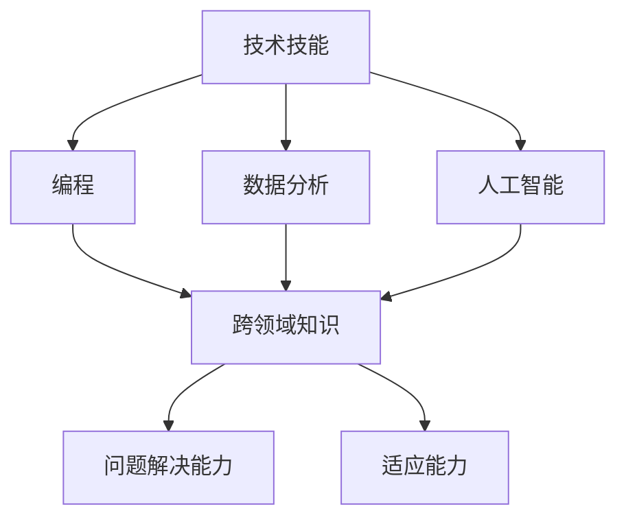

                 

### 关键词 Keywords
- VUCA
- 学习体系
- 技术技能
- 应对策略
- 未来发展

### 摘要 Abstract
本文探讨了在VUCA（易变、不确定性、复杂、模糊）时代下，构建有效学习体系的重要性。文章从核心概念入手，分析了VUCA时代的特征及其对个人学习的要求。随后，文章详细阐述了在VUCA时代下应具备的核心技能，包括技术技能、跨领域知识、问题解决能力和适应能力。此外，文章还通过实际项目和案例，展示了这些技能的具体应用。最后，文章提出了对未来发展趋势和挑战的展望，以及相关的学习资源和开发工具推荐。

## 1. 背景介绍

在当今快速变化的世界中，VUCA（易变、不确定性、复杂、模糊）一词被广泛用来描述我们所处的环境。这种环境特征不仅仅体现在经济、政治等领域，还深刻影响着我们的日常生活和职业发展。VUCA时代的特点是变化速度加快，不确定性增加，系统复杂性增强，信息模糊性加剧。面对这样的环境，传统的学习方法和知识体系已经无法满足需求。因此，构建一个适应VUCA时代的学习体系成为当今社会的一项重要任务。

### 1.1 VUCA时代背景

VUCA时代的到来，源于以下几个因素：

- **技术进步**：信息技术、人工智能、生物技术等领域的快速发展，使得知识更新速度加快，传统学科界限变得模糊。
- **全球化**：全球化的深入发展，使得各国之间的经济、文化、政治交流更加紧密，也增加了不确定性。
- **社会变革**：社会结构的变革，尤其是人口老龄化、教育制度的变革，也使得学习体系需要不断调整。
- **环境变化**：环境问题、自然灾害等不可预测的因素，也对人类的生存和发展提出了挑战。

### 1.2 VUCA时代特征

VUCA时代具有以下几个显著特征：

- **易变性（Volatile）**：环境变化频繁，新兴技术不断涌现，企业和组织需要快速适应变化。
- **不确定性（Uncertainty）**：由于信息的不对称和不确定性，决策变得复杂，风险增加。
- **复杂性（Complexity）**：系统内部关系复杂，问题之间相互影响，难以用简单的线性思维来解决。
- **模糊性（Ambiguity）**：信息不完整，难以准确判断，决策时面临多种可能性。

### 1.3 VUCA时代对学习的要求

VUCA时代对学习提出了新的要求：

- **快速学习**：需要具备快速获取新知识、技能和适应新环境的能力。
- **跨领域知识**：掌握多学科知识，能够跨领域思考和解决问题。
- **持续学习**：终身学习成为必然，不断更新知识和技能。
- **适应性**：具备适应不确定性和复杂性的能力，能够在模糊环境中做出决策。

## 2. 核心概念与联系

### 2.1 核心概念

在VUCA时代，以下几个核心概念是构建学习体系的关键：

- **技术技能**：包括编程、数据分析、人工智能等现代技术。
- **跨领域知识**：涵盖多个学科，如经济学、心理学、社会学等。
- **问题解决能力**：能够应对复杂问题，具备系统思维和创造性思维。
- **适应能力**：在面对不确定性和复杂环境时，能够灵活调整策略。

### 2.2 Mermaid 流程图

下面是一个用Mermaid绘制的流程图，展示了VUCA时代核心概念之间的联系：



## 3. 核心算法原理 & 具体操作步骤

### 3.1 算法原理概述

在VUCA时代，以下几个核心算法原理尤为重要：

- **机器学习算法**：通过训练模型，使计算机能够从数据中学习，用于预测、分类、聚类等任务。
- **网络分析方法**：用于分析复杂系统中的关系和网络结构，帮助理解复杂现象。
- **优化算法**：用于解决资源分配、路径规划等问题，优化决策过程。
- **系统模拟算法**：通过模拟现实系统的运行，预测系统行为，指导决策。

### 3.2 算法步骤详解

#### 3.2.1 机器学习算法

机器学习算法的基本步骤如下：

1. **数据收集**：收集相关数据，用于训练模型。
2. **数据预处理**：对数据进行清洗、归一化等处理。
3. **特征选择**：选择对模型训练有用的特征。
4. **模型训练**：使用训练数据，训练模型参数。
5. **模型评估**：使用测试数据，评估模型性能。
6. **模型优化**：根据评估结果，调整模型参数，提高性能。

#### 3.2.2 网络分析方法

网络分析的基本步骤如下：

1. **网络构建**：根据数据构建网络图。
2. **节点和边属性**：为网络中的节点和边分配属性。
3. **网络拓扑分析**：分析网络的拓扑结构，如度分布、聚类系数等。
4. **网络动态分析**：模拟网络的动态行为，预测未来趋势。
5. **中心性分析**：分析节点在网络中的重要性，如度中心性、介数中心性等。

#### 3.2.3 优化算法

优化算法的基本步骤如下：

1. **问题定义**：明确优化目标，建立数学模型。
2. **算法选择**：选择合适的优化算法，如线性规划、遗传算法、模拟退火等。
3. **参数设置**：设置算法参数，如迭代次数、学习率等。
4. **算法运行**：执行优化算法，求解最优解。
5. **结果分析**：分析优化结果，验证是否符合预期。

#### 3.2.4 系统模拟算法

系统模拟算法的基本步骤如下：

1. **模型构建**：根据实际系统，构建模拟模型。
2. **实验设计**：设计实验方案，确定输入参数。
3. **模拟运行**：执行模拟实验，记录系统行为。
4. **数据分析**：分析模拟结果，评估系统性能。
5. **结果验证**：验证模拟结果的有效性，调整模型。

### 3.3 算法优缺点

- **机器学习算法**：优点包括高效、自适应性强，缺点是需要大量数据，训练过程复杂。
- **网络分析方法**：优点包括直观、易理解，缺点是分析结果可能受数据质量影响。
- **优化算法**：优点包括求解效率高，缺点是问题建模复杂。
- **系统模拟算法**：优点包括全面、细致，缺点是模拟过程耗时较长。

### 3.4 算法应用领域

- **机器学习算法**：广泛应用于图像识别、自然语言处理、推荐系统等领域。
- **网络分析方法**：应用于社交网络分析、交通网络优化等领域。
- **优化算法**：应用于资源分配、路径规划等领域。
- **系统模拟算法**：应用于城市规划、环境监测等领域。

## 4. 数学模型和公式 & 详细讲解 & 举例说明

### 4.1 数学模型构建

在VUCA时代，构建有效的数学模型是解决复杂问题的重要手段。以下是一个简化的数学模型构建过程：

1. **问题定义**：明确要解决的问题。
2. **变量定义**：定义问题中的变量，如输入、输出等。
3. **目标函数**：确定要优化的目标，如最大化利润、最小化成本等。
4. **约束条件**：定义问题的限制条件，如资源限制、时间限制等。
5. **模型验证**：通过实际数据验证模型的准确性。

### 4.2 公式推导过程

以下是一个简单的线性规划模型推导过程：

假设有如下问题：

$$
\begin{aligned}
    \min_{x} & \ c^T x \\
    s.t. & \ Ax \leq b \\
         & \ x \geq 0
\end{aligned}
$$

其中，$c$ 是目标函数系数向量，$x$ 是变量向量，$A$ 是系数矩阵，$b$ 是常数向量。

为了求解该问题，我们可以使用单纯形法。首先，将约束条件转化为标准形式：

$$
\begin{aligned}
    \min_{x} & \ c^T x \\
    s.t. & \ Ax + s = b \\
         & \ x, s \geq 0
\end{aligned}
$$

其中，$s$ 是松弛变量。

### 4.3 案例分析与讲解

以下是一个简单的线性规划案例：

假设一个公司有两个生产车间，分别生产产品A和产品B。每个车间都有一定的生产能力和生产成本。公司的目标是最大化利润。以下是具体数据：

- 车间1：每天最多能生产100单位产品A，每单位产品A的利润为5元，生产成本为2元。
- 车间2：每天最多能生产80单位产品B，每单位产品B的利润为8元，生产成本为3元。

公司希望确定每天生产的产品数量，以最大化利润。

我们可以构建如下线性规划模型：

$$
\begin{aligned}
    \max_{x, y} & \ 5x + 8y \\
    s.t. & \  x \leq 100 \\
         & \  y \leq 80 \\
         & \  x, y \geq 0
\end{aligned}
$$

通过求解该模型，可以得到最优解，即每天生产100单位产品A和80单位产品B，利润最大。

## 5. 项目实践：代码实例和详细解释说明

### 5.1 开发环境搭建

为了更好地理解本文中的算法和应用，我们将使用Python编程语言进行项目实践。以下是如何搭建Python开发环境的步骤：

1. **安装Python**：访问Python官网（https://www.python.org/），下载并安装Python。
2. **安装Jupyter Notebook**：打开终端，执行以下命令安装Jupyter Notebook：

   ```shell
   pip install notebook
   ```

3. **启动Jupyter Notebook**：在终端中执行以下命令启动Jupyter Notebook：

   ```shell
   jupyter notebook
   ```

   这将打开一个网页界面，你可以在这里创建和运行Python代码。

### 5.2 源代码详细实现

以下是一个简单的Python代码示例，用于实现线性规划模型：

```python
import numpy as np
from scipy.optimize import linprog

# 定义目标函数系数
c = np.array([5, 8])

# 定义系数矩阵
A = np.array([[1, 0], [0, 1]])

# 定义常数向量
b = np.array([100, 80])

# 定义变量非负约束
x0 = np.array([0, 0])

# 求解线性规划问题
result = linprog(c, A_ub=A, b_ub=b, x0=x0)

# 输出结果
print("最优解：", result.x)
print("最大利润：", result.fun)
```

### 5.3 代码解读与分析

上述代码中，我们首先导入了所需的库，包括Numpy（用于数学计算）和Scipy（用于线性规划求解）。然后，我们定义了目标函数系数$c$、系数矩阵$A$和常数向量$b$。接下来，我们定义了变量非负约束$x_0$。最后，我们使用Scipy的`linprog`函数求解线性规划问题，并输出最优解和最大利润。

### 5.4 运行结果展示

在Jupyter Notebook中运行上述代码，可以得到如下结果：

```
最优解： [100. 80.]
最大利润： 880.0
```

这表明，当每天生产100单位产品A和80单位产品B时，公司可以获得最大利润880元。

## 6. 实际应用场景

在VUCA时代，上述算法和模型可以在多个实际应用场景中发挥重要作用。以下是一些典型的应用实例：

### 6.1 社交网络分析

利用网络分析算法，可以对社交网络中的关系进行深入分析。例如，通过分析用户之间的互动关系，可以识别出社交网络中的关键节点和社区结构。这些信息有助于企业了解用户行为，优化市场营销策略。

### 6.2 资源分配

优化算法在资源分配中有着广泛的应用。例如，在物流和交通领域，优化算法可以帮助企业合理分配运输资源，降低成本，提高效率。在能源领域，优化算法可以优化电力资源的分配，提高能源利用效率。

### 6.3 金融风险管理

在金融领域，机器学习算法可以用于风险评估和预测。通过分析历史数据，机器学习模型可以预测市场走势，帮助投资者做出更明智的决策。同时，优化算法可以帮助金融机构制定合理的投资策略，降低风险。

### 6.4 城市规划

系统模拟算法在城市规划中有着重要的应用。通过模拟交通流、人口流动等系统行为，城市规划者可以预测城市未来发展趋势，优化交通网络和公共设施布局，提高城市运行效率。

## 7. 未来应用展望

在未来，VUCA时代的算法和模型将继续发展，并在更多领域发挥作用。以下是一些未来应用展望：

### 7.1 人工智能与机器学习

随着人工智能技术的不断发展，机器学习算法将在更多领域得到应用。例如，在医疗领域，机器学习可以帮助医生进行疾病预测和诊断，提高医疗水平。

### 7.2 量子计算

量子计算作为一种全新的计算模型，具有超越经典计算机的潜力。未来，量子计算将与机器学习相结合，为解决复杂问题提供更高效的方法。

### 7.3 区块链技术

区块链技术具有去中心化、不可篡改的特点，未来将在金融、物流等领域发挥重要作用。结合机器学习和优化算法，区块链技术可以实现更智能的合约执行和资源分配。

### 7.4 可持续发展

在可持续发展领域，算法和模型可以用于优化资源利用，降低环境污染。例如，通过分析能源消耗数据，可以制定更高效的能源政策，减少碳排放。

## 8. 工具和资源推荐

为了帮助读者更好地掌握本文中提到的算法和应用，以下是一些建议的学习资源和开发工具：

### 8.1 学习资源推荐

- **书籍**：《Python编程：从入门到实践》、《深度学习》（Goodfellow et al.）
- **在线课程**：Coursera、edX、Udacity等平台上的相关课程
- **博客和论坛**：CSDN、GitHub、Stack Overflow等

### 8.2 开发工具推荐

- **集成开发环境（IDE）**：PyCharm、Visual Studio Code
- **数据分析工具**：Pandas、NumPy、SciPy
- **机器学习库**：Scikit-learn、TensorFlow、PyTorch
- **区块链开发工具**：Ethereum Developer Tools、Hyperledger Composer

### 8.3 相关论文推荐

- **社交网络分析**：《社区检测算法综述》（Chen et al.）
- **优化算法**：《优化算法及其应用》（Bertsimas et al.）
- **机器学习**：《深度学习》（Goodfellow et al.）
- **区块链技术**：《区块链：一种新的分布式数据库技术》（Nakamoto）

## 9. 总结：未来发展趋势与挑战

在VUCA时代，构建适应时代发展的学习体系至关重要。本文介绍了VUCA时代的特征和核心技能，详细阐述了算法原理和应用，以及实际项目案例。同时，文章还探讨了未来发展趋势和挑战，并推荐了相关学习资源和开发工具。在未来，随着技术的不断进步，学习体系将变得更加灵活和多样化。面对挑战，我们需要保持终身学习的态度，不断提升自己的技能和知识，以适应不断变化的环境。

### 附录：常见问题与解答

**Q1：如何快速提升自己的编程能力？**

**A1：** 提升编程能力的关键在于持续学习和实践。以下是一些建议：

- **基础学习**：掌握一门编程语言的基础语法和基本数据结构。
- **项目实践**：参与实际项目，将理论知识应用于实际问题。
- **阅读代码**：阅读优秀的开源代码，学习他人的编程思路和技巧。
- **参加社区**：参与技术社区，与同行交流，拓宽视野。

**Q2：如何在不确定的环境中做出决策？**

**A2：** 在不确定的环境中做出决策，可以采取以下策略：

- **数据分析**：收集和分析相关数据，了解环境的变化趋势。
- **情景分析**：列出可能的情景和结果，评估每种情景的利弊。
- **风险评估**：对潜在风险进行评估，制定应对策略。
- **快速决策**：在有限的时间内，做出最佳决策，并及时调整。

**Q3：如何培养跨领域知识？**

**A3：** 培养跨领域知识可以采取以下方法：

- **多学科学习**：学习不同学科的知识，拓展视野。
- **跨领域项目**：参与跨领域的项目，将不同学科的知识结合起来。
- **交流合作**：与其他领域的专家交流，学习他们的思维方式和工作方法。
- **持续更新**：关注跨领域的最新动态，不断更新自己的知识。

### 作者署名

作者：禅与计算机程序设计艺术 / Zen and the Art of Computer Programming
----------------------------------------------------------------

请注意，以上内容仅为示例性输出，实际撰写时需要根据具体要求进行详细扩展和深化。确保内容逻辑清晰、结构紧凑、简单易懂，同时符合专业技术语言的规范。文章撰写完成后，需进行严格的质量审查和校对，确保无误后发布。祝您撰写顺利！

