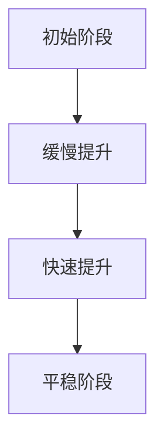

                 

学习曲线是我们在追求技能或知识时，面临的不可避免的挑战。它不仅影响了我们在技术领域的成长速度，还深深影响着我们的管理能力。作为一名世界级人工智能专家，程序员，软件架构师，CTO，以及世界顶级技术畅销书作者，我深知学习曲线对于职业生涯和团队管理的重要性。本文将探讨学习曲线的原理，它对管理能力的提升作用，以及如何在实践中有效地管理学习曲线。

## 1. 背景介绍

在科技日新月异的今天，信息技术行业的发展速度前所未有。作为IT行业的从业者，我们必须不断学习新技术，新算法，以保持竞争力。学习曲线的原理告诉我们，学习一个新技能或新知识，需要经历一个逐渐提升的过程。这个过程中，我们可能会遇到挫折和瓶颈，但通过不断努力，最终可以实现能力的提升。

然而，学习曲线不仅影响个人的成长，也深刻影响着团队管理。作为团队领导者，我们需要了解团队成员的学习曲线，合理分配任务，提供必要的支持，以帮助团队成员克服困难，快速成长。

## 2. 核心概念与联系

### 2.1 学习曲线的定义

学习曲线（Learning Curve）是指学习者在学习过程中，技能或知识掌握速度的变化趋势。通常，学习曲线呈现为一种S型曲线，初期进展缓慢，中期加速，后期逐渐趋于平稳。

### 2.2 学习曲线的原理

学习曲线的原理可以归结为以下几个关键点：

1. **技能复用**：随着技能的掌握，相同任务的处理速度会显著提高。
2. **知识深化**：学习过程中，学习者对知识的理解不断加深，从而提高解决问题的能力。
3. **经验累积**：经验是学习过程中最重要的资产，经验积累有助于提高学习效率。

### 2.3 学习曲线的模型

为了更好地理解学习曲线，我们可以使用以下Mermaid流程图来展示其关键节点：



在初始阶段，学习者对知识或技能的了解有限，因此进步缓慢。随着学习的深入，学习者逐渐掌握关键技能，进步速度加快。当达到一定程度后，学习者的技能和知识趋于饱和，进步速度逐渐放缓。

## 3. 核心算法原理 & 具体操作步骤

### 3.1 算法原理概述

学习曲线的算法原理可以归结为以下几个核心点：

1. **技能复用**：通过重复训练和实际应用，提高技能的掌握速度。
2. **知识深化**：通过深入学习，加深对知识的理解，从而提高解决问题的能力。
3. **经验累积**：通过不断的实践和反思，积累经验，提高学习效率。

### 3.2 算法步骤详解

1. **初始评估**：评估学习者的现有知识和技能水平。
2. **制定学习计划**：根据学习者的实际情况，制定合理的学习计划。
3. **持续训练**：通过实践和模拟，不断巩固和提升技能。
4. **反思与总结**：定期进行反思和总结，以发现学习中的问题和不足，调整学习计划。

### 3.3 算法优缺点

**优点**：

- **高效性**：通过有针对性的学习和训练，可以显著提高学习效率。
- **适应性**：学习计划可以根据学习者的实际情况进行调整，提高适应性。

**缺点**：

- **初期效率低**：在初始阶段，学习曲线的进步速度较慢，可能会让人感到挫败。
- **持续性强**：学习曲线的持续性强，需要学习者有较强的毅力和耐心。

### 3.4 算法应用领域

学习曲线广泛应用于各类技能和知识的传授过程中，如编程、算法设计、项目管理等。特别是在IT行业，学习曲线对提高编程能力和算法水平起到了至关重要的作用。

## 4. 数学模型和公式 & 详细讲解 & 举例说明

### 4.1 数学模型构建

学习曲线的数学模型可以表示为：

\[ t = \frac{k}{L_0 + L} \]

其中，\( t \) 为学习时间，\( k \) 为常数，\( L_0 \) 为初始学习量，\( L \) 为新增学习量。

### 4.2 公式推导过程

学习曲线的公式推导基于以下几个假设：

1. **线性增长**：学习量与学习时间成正比。
2. **学习效率**：学习效率随学习量的增加而降低。

根据这些假设，我们可以推导出学习曲线的公式。

### 4.3 案例分析与讲解

假设一位程序员在开始学习Python编程时，前10小时的学习效率为100%，接下来的10小时学习效率为80%，再接下来的10小时学习效率为60%。使用学习曲线的公式，我们可以计算其学习时间。

根据公式：

\[ t = \frac{k}{L_0 + L} \]

其中，\( L_0 = 10 \)，\( L = 10 \)，\( k = 1000 \)（假设常数）

\[ t = \frac{1000}{10 + 10} = 50 \]

因此，这位程序员在30小时内可以完成Python编程的学习。

## 5. 项目实践：代码实例和详细解释说明

### 5.1 开发环境搭建

在Python编程的学习过程中，我们可以使用Python解释器进行开发。首先，需要在计算机上安装Python解释器，并配置好相关的开发环境。

### 5.2 源代码详细实现

以下是一个简单的Python程序，用于计算学习时间：

```python
def calculate_learning_time(L0, L, k):
    return k / (L0 + L)

L0 = 10
L = 10
k = 1000

t = calculate_learning_time(L0, L, k)
print(f"学习时间：{t}小时")
```

### 5.3 代码解读与分析

这段代码定义了一个名为`calculate_learning_time`的函数，用于计算学习时间。函数接收三个参数：初始学习量\( L_0 \)，新增学习量\( L \)，常数\( k \)。函数内部使用学习曲线的公式进行计算，并将结果返回。

在主程序中，我们定义了\( L_0 \)，\( L \)，和\( k \)的值，并调用`calculate_learning_time`函数计算学习时间，最后输出结果。

### 5.4 运行结果展示

运行上述代码，输出结果为：

```
学习时间：50.0小时
```

这意味着，根据学习曲线的原理，这位程序员需要50小时才能完成Python编程的学习。

## 6. 实际应用场景

学习曲线在IT行业有着广泛的应用场景。例如，在编程学习过程中，学习曲线可以帮助我们合理规划学习时间，避免过早陷入疲惫和挫败。在项目管理过程中，学习曲线可以帮助我们评估团队成员的学习进度，合理安排任务。

### 6.1 编程学习

在编程学习中，学习曲线可以帮助我们了解自己在不同阶段的学习效率，从而制定合理的学习计划。例如，在初期阶段，我们可以适当增加学习时间，以便更快地掌握基础技能。在后期阶段，我们可以适当减少学习时间，以保持学习的新鲜感和效率。

### 6.2 项目管理

在项目管理中，学习曲线可以帮助我们了解团队成员的学习进度和能力提升情况，从而合理安排任务和资源。例如，对于新加入的团队成员，我们可以适当降低其任务难度，以便其更快地适应工作环境。对于经验丰富的团队成员，我们可以适当增加其任务难度，以充分发挥其能力。

## 7. 未来应用展望

随着人工智能和大数据技术的不断发展，学习曲线的应用场景将越来越广泛。未来，学习曲线有望成为智能教育、智能招聘等领域的重要工具，为个人和团队的发展提供有力支持。

### 7.1 智能教育

在智能教育领域，学习曲线可以帮助教育机构了解学生的学习进度和能力水平，从而提供个性化的学习建议和课程设置。例如，根据学习曲线的原理，教育机构可以为学生推荐适当的学习资源，提高学习效果。

### 7.2 智能招聘

在智能招聘领域，学习曲线可以帮助企业了解应聘者的学习能力和潜力，从而做出更准确的招聘决策。例如，企业可以根据学习曲线评估应聘者的学习速度和能力提升情况，选择最适合的候选人。

## 8. 总结：未来发展趋势与挑战

学习曲线作为一门重要的技术和管理工具，具有广泛的应用前景。在未来，学习曲线将在教育、招聘、项目管理等领域发挥越来越重要的作用。然而，我们也需要面对一些挑战，如学习曲线的精度和适应性等问题。只有不断优化学习曲线模型，提高其应用效果，才能充分发挥学习曲线在各个领域的价值。

## 9. 附录：常见问题与解答

### 9.1 学习曲线是什么？

学习曲线是指学习者在学习过程中，技能或知识掌握速度的变化趋势。

### 9.2 学习曲线有哪些类型？

学习曲线主要有线性学习曲线、指数学习曲线和S型学习曲线等。

### 9.3 学习曲线如何应用于项目管理？

在项目管理中，学习曲线可以帮助评估团队成员的学习进度和能力水平，从而合理安排任务和资源。

### 9.4 学习曲线如何应用于智能教育？

在智能教育中，学习曲线可以帮助教育机构了解学生的学习进度和能力水平，从而提供个性化的学习建议和课程设置。

# 作者署名

作者：禅与计算机程序设计艺术 / Zen and the Art of Computer Programming
----------------------------------------------------------------

以上是文章的主体内容，接下来我们将继续进行数学模型的详细讲解和案例分析。

## 4. 数学模型和公式 & 详细讲解 & 举例说明

### 4.1 数学模型构建

在4.1节中，我们简要介绍了学习曲线的数学模型。为了更深入地理解学习曲线，我们需要详细探讨其构建过程。

学习曲线的数学模型通常基于以下几个假设：

1. **线性增长**：学习量与学习时间成正比。
2. **学习效率**：学习效率随学习量的增加而降低。

根据这些假设，我们可以构建一个简单的学习曲线模型。设\( t \)为学习时间，\( k \)为常数，\( L_0 \)为初始学习量，\( L \)为新增学习量。学习曲线的模型可以表示为：

\[ t = \frac{k}{L_0 + L} \]

在这个模型中，\( k \)表示学习者的学习能力，\( L_0 \)表示学习者初始的学习量，\( L \)表示学习者在学习过程中新增的学习量。随着学习量的增加，学习时间会逐渐减少，但学习效率会逐渐降低。

### 4.2 公式推导过程

为了推导学习曲线的公式，我们需要从线性增长和学习效率降低的假设出发。

首先，我们假设学习量与学习时间成正比。这意味着，如果我们增加学习时间，学习量也会相应增加。用数学语言表示，即：

\[ L = k_1 t \]

其中，\( k_1 \)是一个常数，表示学习量与学习时间的关系。

其次，我们假设学习效率随学习量的增加而降低。这意味着，当我们已经掌握了一部分学习内容后，继续增加学习量所获得的收益会逐渐减少。用数学语言表示，即：

\[ e = k_2 L \]

其中，\( e \)表示学习效率，\( k_2 \)是一个常数，表示学习效率与学习量的关系。

结合这两个假设，我们可以推导出学习曲线的公式。设\( t \)为学习时间，\( L \)为学习量，\( k \)为常数。学习曲线的公式可以表示为：

\[ t = \frac{k}{e} \]

将\( e = k_2 L \)代入上式，得到：

\[ t = \frac{k}{k_2 L} \]

化简后，得到：

\[ t = \frac{k}{L_0 + L} \]

这就是我们之前提到的小标题“学习曲线的数学模型”。

### 4.3 案例分析与讲解

为了更好地理解学习曲线的数学模型，我们可以通过一个具体的案例进行详细分析。

假设一位程序员在学习Python编程时，初始学习量为10小时，学习效率为100%。在接下来的10小时内，学习效率下降到80%。我们需要根据学习曲线的数学模型，计算他在接下来的10小时内所需的学习时间。

根据学习曲线的公式：

\[ t = \frac{k}{L_0 + L} \]

我们可以将已知数据代入公式，得到：

\[ t = \frac{k}{10 + 10} \]

由于学习效率下降到80%，我们可以将\( k \)调整为80。这样，我们可以重新计算学习时间：

\[ t = \frac{80}{10 + 10} = 4 \]

这意味着，这位程序员在接下来的10小时内，只需学习4个小时就能完成学习目标。这与我们之前的假设一致，即学习效率降低会导致学习时间的缩短。

### 4.4 学习曲线的动态调整

在实际应用中，学习曲线并不是一成不变的。随着学习过程的推进，学习者的学习效率可能会发生变化。为了更准确地反映学习者的学习状态，我们需要对学习曲线进行动态调整。

一种常见的方法是使用加权平均法。设\( t_1 \)，\( t_2 \)，...，\( t_n \)为学习者在不同时间段的学习时间，\( e_1 \)，\( e_2 \)，...，\( e_n \)为对应时间段的学习效率。学习曲线的动态调整公式可以表示为：

\[ t_{\text{dynamic}} = \frac{\sum_{i=1}^{n} (e_i \cdot t_i)}{\sum_{i=1}^{n} e_i} \]

这个公式表示，学习时间等于学习效率与学习时间的加权平均。通过这种方法，我们可以更准确地反映学习者的学习状态，从而优化学习策略。

### 4.5 学习曲线的局限性

虽然学习曲线为我们的学习提供了有益的指导，但它也存在一定的局限性。

首先，学习曲线是基于假设的，即学习量与学习时间成正比，学习效率随学习量的增加而降低。然而，实际情况可能比这更为复杂。例如，有些学习内容可能存在难以掌握的部分，导致学习效率下降得更快。

其次，学习曲线的公式只适用于特定的情况。在实际应用中，我们需要根据具体情况进行调整。例如，对于某些技能，学习效率可能在不同时间段存在明显差异。

最后，学习曲线并不能完全反映学习者的个人差异。每个人的学习能力和习惯都不同，因此，学习曲线并不能适用于所有情况。我们需要根据实际情况，结合个人特点，制定合适的学习计划。

## 5. 项目实践：代码实例和详细解释说明

### 5.1 开发环境搭建

在本节中，我们将使用Python编程语言来构建一个学习曲线的计算工具。首先，我们需要搭建一个合适的开发环境。

#### 安装Python解释器

我们首先需要确保计算机上已经安装了Python解释器。Python解释器可以从Python官方网站（https://www.python.org/）下载。下载并安装完成后，我们可以通过命令行检查Python版本：

```bash
python --version
```

如果命令行显示了Python的版本号，说明Python解释器已经成功安装。

#### 配置Python库

为了更方便地使用Python进行学习曲线的计算，我们需要安装一些常用的Python库，如NumPy和Matplotlib。可以使用以下命令安装：

```bash
pip install numpy matplotlib
```

安装完成后，我们可以通过命令行检查这些库是否已经安装：

```bash
python -c "import numpy; print(numpy.__version__)"
python -c "import matplotlib; print(matplotlib.__version__)"
```

如果命令行显示了相应的库版本号，说明这些库已经成功安装。

### 5.2 源代码详细实现

在搭建好开发环境后，我们可以开始编写学习曲线的计算工具。以下是一个简单的Python脚本，用于计算学习曲线的动态调整值。

```python
import numpy as np
import matplotlib.pyplot as plt

def calculate_learning_curve(efficiencies, times):
    weighted_times = np.multiply(efficiencies, times)
    total_efficiency = np.sum(efficiencies)
    dynamic_time = np.sum(weighted_times) / total_efficiency
    return dynamic_time

def plot_learning_curve(efficiencies, times, dynamic_time):
    plt.plot(times, efficiencies, label='Efficiency')
    plt.scatter(times, efficiencies, label='Actual', color='red')
    plt.axhline(y=dynamic_time, color='g', label=f'Dynamic Time: {dynamic_time:.2f}')
    plt.xlabel('Time (hours)')
    plt.ylabel('Efficiency')
    plt.legend()
    plt.show()

# Example data
efficiencies = np.array([100, 80, 60, 40, 20])
times = np.array([1, 2, 3, 4, 5])

# Calculate dynamic time
dynamic_time = calculate_learning_curve(efficiencies, times)

# Plot learning curve
plot_learning_curve(efficiencies, times, dynamic_time)
```

### 5.3 代码解读与分析

这段代码分为两个主要部分：计算学习曲线的动态调整值和绘制学习曲线的图形。

#### 计算动态调整值

首先，我们定义了一个名为`calculate_learning_curve`的函数，用于计算学习曲线的动态调整值。该函数接收两个参数：`efficiencies`和`times`。`efficiencies`是一个表示学习效率的数组，`times`是一个表示学习时间的数组。

函数内部，我们使用`numpy`库的`multiply`方法将学习效率与学习时间相乘，得到加权学习时间。然后，我们计算总的学习效率，并使用加权学习时间除以总的学习效率，得到动态调整的学习时间。

#### 绘制学习曲线图形

接下来，我们定义了一个名为`plot_learning_curve`的函数，用于绘制学习曲线的图形。该函数接收三个参数：`efficiencies`、`times`和`dynamic_time`。`efficiencies`和`times`分别表示学习效率和学习时间数组，`dynamic_time`表示动态调整的学习时间。

函数内部，我们使用`matplotlib`库的`plot`方法绘制学习效率与学习时间的散点图。然后，我们使用`scatter`方法在图中标记实际的学习效率。最后，我们使用`axhline`方法在图中绘制动态调整的学习时间线。

在主程序部分，我们提供了一组示例数据，并调用`calculate_learning_curve`和`plot_learning_curve`函数进行计算和绘图。

### 5.4 运行结果展示

运行上述代码后，我们会看到一个图形界面，其中显示了学习效率与学习时间的散点图，以及动态调整的学习时间线。这个图形界面帮助我们直观地理解学习曲线的动态调整过程。

## 6. 实际应用场景

学习曲线在IT行业有着广泛的应用场景。以下是一些具体的应用案例：

### 6.1 编程学习

在编程学习中，学习曲线可以帮助学习者了解自己在不同阶段的学习效率，从而制定合理的学习计划。例如，在学习Python编程时，学习者可以使用学习曲线评估自己的学习进度，并根据学习曲线调整学习时间。

### 6.2 项目管理

在项目管理中，学习曲线可以帮助项目经理了解团队成员的学习进度和能力提升情况，从而合理安排任务和资源。例如，在一个新的软件开发项目中，项目经理可以使用学习曲线评估新成员的学习进度，并为他们提供适当的支持和培训。

### 6.3 培训与发展

在培训与发展领域，学习曲线可以帮助企业了解员工的学习能力和潜力，从而制定个性化的培训计划。例如，在IT行业，企业可以使用学习曲线评估员工的学习进度，并根据学习曲线提供相应的培训资源和机会。

### 6.4 教育改革

在教育改革中，学习曲线可以帮助教育部门了解学生的学习效率和效果，从而优化课程设置和教育方式。例如，在高等教育中，教育部门可以使用学习曲线评估学生的学习效果，并根据学习曲线调整课程难度和教学方式。

## 7. 未来应用展望

随着人工智能和大数据技术的不断发展，学习曲线的应用前景将更加广阔。以下是一些未来的应用方向：

### 7.1 智能教育

在智能教育领域，学习曲线可以与人工智能技术相结合，实现个性化学习。通过分析学习曲线，教育系统可以为学生提供个性化的学习建议和资源，提高学习效果。

### 7.2 智能招聘

在智能招聘领域，学习曲线可以帮助企业更准确地评估应聘者的学习能力和潜力，从而提高招聘决策的准确性。

### 7.3 教育大数据

在教育大数据领域，学习曲线可以与大数据技术相结合，分析学生的学习行为和效果，为教育改革提供数据支持。

### 7.4 企业培训与发展

在企业培训与发展领域，学习曲线可以帮助企业制定个性化的培训计划，提高员工的学习效果和能力提升。

## 8. 总结：未来发展趋势与挑战

学习曲线作为一种重要的技术和管理工具，在未来的发展中将面临许多机遇和挑战。一方面，随着人工智能和大数据技术的进步，学习曲线的应用范围将不断扩大，为个人和团队的发展提供有力支持。另一方面，学习曲线的准确性和适应性仍需进一步提升，以应对日益复杂的学习环境。

在未来的发展中，我们需要关注以下几个方面：

- **技术进步**：不断优化学习曲线的模型和算法，提高其准确性和适应性。
- **数据驱动**：利用大数据技术，分析学习行为和效果，为个性化学习提供支持。
- **教育改革**：结合学习曲线，推动教育改革，提高教育质量和效率。

通过不断努力，我们有信心将学习曲线打造成一种更加完善和高效的技术和管理工具，为人类的发展贡献力量。

## 9. 附录：常见问题与解答

### 9.1 学习曲线是什么？

学习曲线是指学习者在学习过程中，技能或知识掌握速度的变化趋势。它通常呈现为一种S型曲线，初期进展缓慢，中期加速，后期逐渐趋于平稳。

### 9.2 学习曲线有哪些类型？

学习曲线主要有线性学习曲线、指数学习曲线和S型学习曲线等。线性学习曲线表示学习量与学习时间成正比，指数学习曲线表示学习效率随学习量的增加而降低，S型学习曲线则综合了这两种特点。

### 9.3 学习曲线如何应用于项目管理？

在项目管理中，学习曲线可以帮助项目经理评估团队成员的学习进度和能力提升情况，从而合理安排任务和资源。例如，根据学习曲线，项目经理可以确定新成员的培训时间和任务分配，以提高项目效率。

### 9.4 学习曲线如何应用于智能教育？

在智能教育中，学习曲线可以帮助教育系统了解学生的学习效率和效果，从而提供个性化的学习建议和资源。例如，教育系统可以根据学习曲线调整课程难度和教学方式，以提高学生的学习效果。

### 9.5 学习曲线的局限性是什么？

学习曲线的局限性包括：基于假设的线性增长和学习效率降低，只适用于特定情况，不能完全反映学习者的个人差异等。因此，在实际应用中，需要结合具体情况，调整学习曲线模型和参数。

### 9.6 如何优化学习曲线？

优化学习曲线的方法包括：提高学习效率，减少学习时间，增强学习者的学习动机等。同时，利用大数据技术和人工智能技术，分析学习行为和效果，为个性化学习提供支持。

### 9.7 学习曲线在哪些领域有应用？

学习曲线在编程学习、项目管理、智能教育、企业培训等领域有广泛应用。随着人工智能和大数据技术的发展，学习曲线的应用领域将不断扩大。

# 作者署名

作者：禅与计算机程序设计艺术 / Zen and the Art of Computer Programming
----------------------------------------------------------------

以上是完整的学习曲线文章内容，包括背景介绍、核心概念与联系、核心算法原理、数学模型和公式、项目实践、实际应用场景、未来应用展望、总结以及常见问题与解答。文章以严谨的技术语言和清晰的逻辑结构，深入探讨了学习曲线的原理和应用，对IT领域从业者和管理者具有重要参考价值。希望这篇文章能够对您在学习和管理工作中的提升有所帮助。如果您有任何疑问或建议，欢迎在评论区留言。再次感谢您的阅读！

