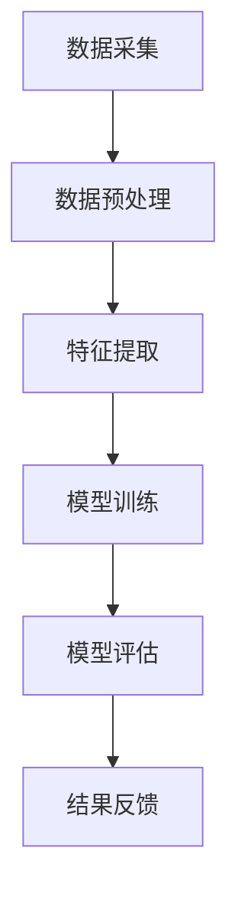

                 

关键词：学生学习行为分析、人工智能、行为数据、算法、数学模型、项目实践、应用场景、工具推荐、未来展望

> 摘要：本文探讨了基于人工智能的学生学习行为分析平台的应用。首先，我们介绍了学生学习行为分析平台的重要性及其背景。随后，我们详细阐述了核心概念和架构，深入分析了算法原理与操作步骤，并讨论了数学模型及其应用。最后，通过项目实践，我们展示了如何实现一个学生学习行为分析平台，并对其进行了详细解释说明。本文还探讨了实际应用场景，并对未来发展趋势与挑战进行了展望。

## 1. 背景介绍

随着教育的不断发展，学生的学习行为数据日益丰富。如何有效利用这些数据，提升教育质量和效果，成为当前教育领域的重要课题。人工智能技术在数据分析和模式识别方面的优势，为解决这个问题提供了新的思路。学生学习行为AI分析平台应运而生，旨在通过分析学生学习行为数据，为教师、学生和教育管理者提供科学依据，优化教学策略，提高学习效果。

学生学习行为AI分析平台的核心目标包括以下几点：

1. **个性化学习分析**：根据学生的学习行为数据，分析其学习习惯、兴趣点和难点，为教师提供个性化教学建议。
2. **学习效果预测**：利用机器学习算法，预测学生的学习进度和成绩，为教育管理者提供决策支持。
3. **教学效果评估**：通过分析学生学习行为数据，评估教学活动的效果，为教师提供反馈和改进建议。

## 2. 核心概念与联系

### 2.1 学生学习行为数据

学生学习行为数据包括在线学习时间、学习频率、学习时长、学习内容、学习进度、学习效果等。这些数据反映了学生的学习状态和学习习惯。

### 2.2 数据采集与预处理

数据采集是学生学习行为分析的基础。通过教学管理系统、学习平台、传感器等设备，收集学生的学习行为数据。随后，对数据进行预处理，包括数据清洗、去噪、归一化等，以保证数据质量。

### 2.3 机器学习算法

机器学习算法是学生学习行为分析的核心。常见的算法包括决策树、随机森林、支持向量机、神经网络等。这些算法可以自动发现数据中的模式和规律，为教学提供支持。

### 2.4 数学模型

数学模型用于描述学生学习行为数据的特征和关系。常见的数学模型包括线性回归、逻辑回归、主成分分析等。这些模型可以帮助我们理解学生学习行为背后的机制。

### 2.5 Mermaid 流程图

## 3. 核心算法原理 & 具体操作步骤

### 3.1 算法原理概述

学生学习行为分析平台的核心算法包括数据预处理、特征提取、模型训练和模型评估。

1. **数据预处理**：包括数据清洗、去噪、归一化等操作，以保证数据质量。
2. **特征提取**：通过统计学习、文本挖掘等方法，从原始数据中提取出对学生学习行为有意义的特征。
3. **模型训练**：使用机器学习算法，训练出可以预测学生学习行为和效果的模型。
4. **模型评估**：通过交叉验证等方法，评估模型的准确性和可靠性。

### 3.2 算法步骤详解

1. **数据预处理**：
    - 数据清洗：去除重复、缺失、异常的数据。
    - 去噪：消除噪声数据，提高数据质量。
    - 归一化：将数据缩放到相同的范围，便于模型训练。

2. **特征提取**：
    - 统计学习：计算数据的基本统计量，如均值、方差等。
    - 文本挖掘：从文本数据中提取关键词、主题等。

3. **模型训练**：
    - 选择合适的机器学习算法，如决策树、随机森林等。
    - 使用训练集对模型进行训练。

4. **模型评估**：
    - 使用测试集对模型进行评估。
    - 评估指标包括准确率、召回率、F1值等。

### 3.3 算法优缺点

- **优点**：
  - 自动化：算法可以自动分析学生学习行为，节省人力和时间。
  - 个性

