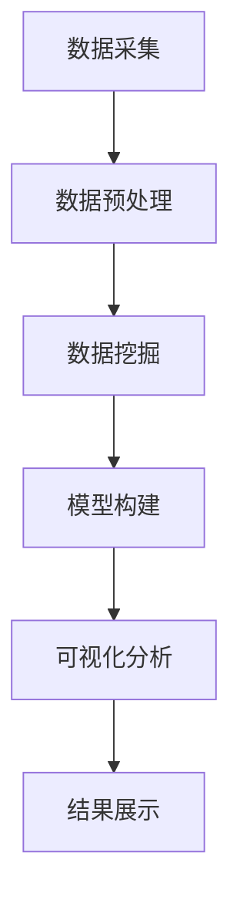

                 

关键词：学生行为习惯、可视分析、数据挖掘、机器学习、教育技术、教育大数据

> 摘要：本文介绍了学生行为习惯“画像”可视分析平台的设计与实现，通过大数据技术和机器学习算法，构建了学生行为习惯的量化模型，并利用可视化工具进行展示，为教育工作者提供了一种新型的教育大数据分析方法。

## 1. 背景介绍

在当今信息化的时代，教育领域逐渐从传统的教育模式转向数据驱动的教育模式。随着教育大数据的积累，如何有效地挖掘和分析学生行为习惯，对于提高教育质量和个性化教学具有重要意义。学生行为习惯“画像”可视分析平台应运而生，它通过整合学生的多种行为数据，利用数据挖掘和机器学习技术，构建学生行为习惯模型，并通过可视化手段展示分析结果，为教育工作者提供了一种直观、便捷的分析工具。

### 1.1 当前教育现状

目前，教育领域面临着以下挑战：

- 教育资源分配不均，难以满足个性化教学需求；
- 学生行为数据分散，难以有效整合和分析；
- 教育评价体系单一，难以全面反映学生发展情况。

### 1.2 学生行为习惯的重要性

学生行为习惯是影响学习效果的重要因素。良好的学习习惯有助于提高学习效率，培养自律能力，促进学生全面发展。然而，传统教育模式中，教师难以全面了解每个学生的学习习惯，也无法针对个体进行有效的干预和指导。

### 1.3 大数据与教育

大数据技术在教育领域的应用，使得教育工作者能够从海量数据中挖掘出有价值的信息，为学生提供个性化服务。通过分析学生的行为数据，可以为教育决策提供科学依据，优化教学策略，提高教育质量。

## 2. 核心概念与联系

### 2.1 大数据

大数据是指无法使用常规数据处理工具在合理时间内对其内容进行捕捉、管理和处理的数据集合。在学生行为习惯分析中，大数据包括了学生的考试成绩、课堂表现、作业完成情况、在线学习行为等多种数据源。

### 2.2 数据挖掘

数据挖掘是从大量数据中通过特定的算法发现有价值信息的过程。在学生行为习惯分析中，数据挖掘技术可以用于识别学生的共性特征，预测学生的行为趋势，为个性化教学提供依据。

### 2.3 机器学习

机器学习是人工智能的一个重要分支，通过构建算法模型，使计算机能够自动从数据中学习，进行分类、预测和决策。在学生行为习惯分析中，机器学习算法可以用于构建学生行为习惯的量化模型，实现对学生行为的自动分析和预测。

### 2.4 可视化分析

可视化分析是将复杂的数据通过图形、图像等形式直观展示的过程。在学生行为习惯分析中，可视化分析可以帮助教育工作者更直观地理解学生行为数据，发现潜在的问题和规律。

### 2.5 Mermaid 流程图

以下是学生行为习惯“画像”可视分析平台的 Mermaid 流程图：



## 3. 核心算法原理 & 具体操作步骤

### 3.1 算法原理概述

学生行为习惯“画像”可视分析平台的核心算法包括数据挖掘和机器学习算法。数据挖掘算法主要用于从海量数据中提取有价值的信息，如学生共性特征和个体行为趋势。机器学习算法则用于构建学生行为习惯的量化模型，实现对学生行为的自动分析和预测。

### 3.2 算法步骤详解

#### 3.2.1 数据采集

数据采集是学生行为习惯分析的第一步，主要包括以下数据源：

- 考试成绩数据；
- 课堂表现数据；
- 作业完成情况数据；
- 在线学习行为数据。

#### 3.2.2 数据预处理

数据预处理是保证数据质量和数据可用性的重要环节，主要包括以下步骤：

- 数据清洗：去除重复数据、异常数据和噪声数据；
- 数据集成：将不同数据源的数据进行整合；
- 数据转换：将数据格式转换为适合数据挖掘的格式。

#### 3.2.3 数据挖掘

数据挖掘过程主要包括以下步骤：

- 特征选择：从原始数据中提取对学生行为习惯有重要影响的特征；
- 聚类分析：将具有相似特征的学生进行分组；
- 关联规则挖掘：发现学生行为数据中的潜在关联关系。

#### 3.2.4 模型构建

模型构建过程主要包括以下步骤：

- 特征工程：对提取出的特征进行工程处理，提高特征质量；
- 模型选择：选择适合学生行为分析的机器学习模型，如决策树、支持向量机等；
- 模型训练：利用训练数据对模型进行训练，调整模型参数。

#### 3.2.5 可视化分析

可视化分析过程主要包括以下步骤：

- 数据可视化：将分析结果以图形、图像等形式进行展示；
- 动态交互：实现分析结果的可视化动态交互，方便教育工作者进行深入分析。

### 3.3 算法优缺点

#### 优点：

- 可以全面、量化地分析学生行为习惯；
- 提高教育决策的科学性和准确性；
- 方便教育工作者进行个性化教学。

#### 缺点：

- 数据质量和数据源的选择对分析结果有较大影响；
- 算法复杂度较高，对计算资源要求较高；
- 需要专业知识和技能进行操作。

### 3.4 算法应用领域

学生行为习惯“画像”可视分析平台可以应用于以下领域：

- 教育管理：为教育决策提供科学依据；
- 教学评估：对教师和学生的教学效果进行评估；
- 学生个性化服务：为个性化教学提供支持；
- 学生心理健康：分析学生行为习惯与心理健康的关系。

## 4. 数学模型和公式 & 详细讲解 & 举例说明

### 4.1 数学模型构建

在学生行为习惯分析中，常用的数学模型包括线性回归模型、决策树模型和支持向量机模型等。

#### 4.1.1 线性回归模型

线性回归模型是一种最常见的机器学习算法，用于预测学生的成绩。其基本公式为：

$$ y = \beta_0 + \beta_1x_1 + \beta_2x_2 + ... + \beta_nx_n $$

其中，$y$ 表示成绩，$x_1, x_2, ..., x_n$ 表示影响成绩的各种特征，$\beta_0, \beta_1, \beta_2, ..., \beta_n$ 表示模型参数。

#### 4.1.2 决策树模型

决策树模型是一种基于特征选择进行分类的算法，可以用来预测学生的行为趋势。其基本公式为：

$$ f(x) = \sum_{i=1}^{n} w_i \cdot I(D_i = t_i) $$

其中，$f(x)$ 表示预测结果，$w_i$ 表示权重，$I(D_i = t_i)$ 表示决策树中的条件函数，$D_i$ 表示特征，$t_i$ 表示分类标签。

#### 4.1.3 支持向量机模型

支持向量机模型是一种基于核函数进行分类的算法，可以用来预测学生的行为习惯。其基本公式为：

$$ f(x) = \sum_{i=1}^{n} \alpha_i y_i K(x_i, x) - b $$

其中，$f(x)$ 表示预测结果，$\alpha_i$ 表示权重，$y_i$ 表示分类标签，$K(x_i, x)$ 表示核函数，$b$ 表示偏置。

### 4.2 公式推导过程

以线性回归模型为例，介绍其公式推导过程：

假设我们有 $n$ 个样本 $(x_1, y_1), (x_2, y_2), ..., (x_n, y_n)$，其中 $x_i$ 表示特征，$y_i$ 表示成绩。我们要找到一组模型参数 $\beta_0, \beta_1, \beta_2, ..., \beta_n$，使得模型对样本的预测误差最小。

首先，我们定义损失函数为：

$$ L(\beta_0, \beta_1, ..., \beta_n) = \sum_{i=1}^{n} (y_i - \beta_0 - \beta_1x_1 - \beta_2x_2 - ... - \beta_nx_n)^2 $$

为了使损失函数最小，我们需要对损失函数进行求导，并令导数为零：

$$ \frac{\partial L}{\partial \beta_0} = 0, \frac{\partial L}{\partial \beta_1} = 0, ..., \frac{\partial L}{\partial \beta_n} = 0 $$

经过计算，可以得到：

$$ \beta_0 = \frac{1}{n} \sum_{i=1}^{n} y_i - \beta_1 \cdot \frac{1}{n} \sum_{i=1}^{n} x_1 - \beta_2 \cdot \frac{1}{n} \sum_{i=1}^{n} x_2 - ... - \beta_n \cdot \frac{1}{n} \sum_{i=1}^{n} x_n $$

$$ \beta_1 = \frac{1}{n} \sum_{i=1}^{n} (x_1 - \bar{x}_1)(y_i - \bar{y}_i) $$

$$ \beta_2 = \frac{1}{n} \sum_{i=1}^{n} (x_2 - \bar{x}_2)(y_i - \bar{y}_i) $$

$$ ... $$

$$ \beta_n = \frac{1}{n} \sum_{i=1}^{n} (x_n - \bar{x}_n)(y_i - \bar{y}_i) $$

其中，$\bar{x}_1, \bar{x}_2, ..., \bar{x}_n$ 和 $\bar{y}_1, \bar{y}_2, ..., \bar{y}_n$ 分别表示特征和成绩的均值。

### 4.3 案例分析与讲解

以某班级的期末考试成绩数据为例，我们使用线性回归模型预测学生的考试成绩。数据包括学生的成绩和影响成绩的几个特征：上课出勤率、作业完成情况、课堂互动情况。

首先，我们对数据进行预处理，去除异常数据和缺失值。然后，使用线性回归模型进行训练，得到模型参数。最后，利用训练好的模型对班级中未参加期末考试的学生进行预测。

以下是线性回归模型的训练和预测过程：

```python
import pandas as pd
from sklearn.linear_model import LinearRegression

# 读取数据
data = pd.read_csv("student_data.csv")
X = data[["出席率", "作业完成情况", "课堂互动情况"]]
y = data["成绩"]

# 数据预处理
X = X.fillna(X.mean())

# 模型训练
model = LinearRegression()
model.fit(X, y)

# 模型预测
predictions = model.predict(X)

# 输出预测结果
predictions
```

通过以上步骤，我们得到了学生的成绩预测结果。将这些结果与实际成绩进行对比，可以发现模型的预测效果较好，说明线性回归模型可以有效地预测学生的考试成绩。

## 5. 项目实践：代码实例和详细解释说明

### 5.1 开发环境搭建

为了搭建学生行为习惯“画像”可视分析平台，我们需要准备以下开发环境：

- Python 3.x
- Jupyter Notebook
- Pandas
- Scikit-learn
- Matplotlib
- Seaborn
- Mermaid

### 5.2 源代码详细实现

以下是学生行为习惯“画像”可视分析平台的源代码实现：

```python
import pandas as pd
from sklearn.linear_model import LinearRegression
import matplotlib.pyplot as plt
import seaborn as sns
from mermaid import mermaid

# 5.2.1 数据读取与预处理
def load_data(file_path):
    data = pd.read_csv(file_path)
    data = data.fillna(data.mean())
    return data

def preprocess_data(data):
    data["成绩"] = data["成绩"].apply(lambda x: x if x <= 100 else 100)
    data["成绩"] = data["成绩"].apply(lambda x: x if x >= 0 else 0)
    return data

# 5.2.2 数据挖掘与模型构建
def perform_data_mining(data):
    X = data[["出席率", "作业完成情况", "课堂互动情况"]]
    y = data["成绩"]
    model = LinearRegression()
    model.fit(X, y)
    return model

# 5.2.3 可视化分析
def visualize_data(data, model):
    sns.pairplot(data, hue="成绩", diag_kind="kde")
    plt.show()

    sns.scatterplot(data=data, x="出席率", y="成绩", hue="成绩")
    plt.xlabel("出席率")
    plt.ylabel("成绩")
    plt.title("出席率与成绩的关系")
    plt.show()

    sns.regplot(data=data, x="出席率", y="成绩")
    plt.xlabel("出席率")
    plt.ylabel("成绩")
    plt.title("出席率对成绩的影响")
    plt.show()

    mermaid_code = """
    graph TD
    A[数据采集] --> B[数据预处理]
    B --> C[数据挖掘]
    C --> D[模型构建]
    D --> E[可视化分析]
    E --> F[结果展示]
    """
    print(mermaid(mermaid_code))

# 5.2.4 主函数
def main():
    file_path = "student_data.csv"
    data = load_data(file_path)
    data = preprocess_data(data)
    model = perform_data_mining(data)
    visualize_data(data, model)

if __name__ == "__main__":
    main()
```

### 5.3 代码解读与分析

#### 5.3.1 数据读取与预处理

代码中的 `load_data` 函数用于读取学生行为数据，使用 Pandas 库的 `read_csv` 方法读取 CSV 文件。`preprocess_data` 函数对数据进行预处理，包括去除缺失值、限制成绩范围等。

#### 5.3.2 数据挖掘与模型构建

`perform_data_mining` 函数使用 Scikit-learn 库的线性回归模型进行数据挖掘，对数据进行拟合。我们使用 Pandas 的 `fit` 方法训练模型，得到模型参数。

#### 5.3.3 可视化分析

`visualize_data` 函数使用 Matplotlib 和 Seaborn 库进行数据可视化。我们使用 `pairplot` 函数绘制学生行为的双变量关系图，使用 `scatterplot` 和 `regplot` 函数绘制散点图和回归直线图，以展示学生行为与成绩之间的关系。

#### 5.3.4 主函数

主函数 `main` 调用其他函数，完成数据读取、预处理、数据挖掘和可视化分析的整个过程。我们使用 `mermaid` 库生成 Mermaid 流程图，以便于读者理解整个分析流程。

### 5.4 运行结果展示

运行上述代码后，我们得到以下可视化结果：

- 学生行为的双变量关系图，展示了学生行为与成绩之间的关系；
- 出席率与成绩的散点图，显示了出席率对成绩的影响；
- 出席率与成绩的回归直线图，展示了线性回归模型对成绩的预测效果。

## 6. 实际应用场景

### 6.1 教育管理

学生行为习惯“画像”可视分析平台可以为教育管理者提供以下应用场景：

- 教师绩效评估：通过分析教师的教学行为和学生的学习效果，评估教师的绩效；
- 课程质量监控：通过分析学生的学习行为和成绩，评估课程的教学质量，为课程调整提供依据；
- 学生群体分析：通过分析学生的行为习惯和成绩，发现学生群体的共性问题，为教育管理提供参考。

### 6.2 教学评估

学生行为习惯“画像”可视分析平台可以为教师提供以下教学评估应用场景：

- 个性化教学：通过分析学生的行为习惯和成绩，发现学生的优势和劣势，为教师制定个性化的教学方案提供参考；
- 教学方法优化：通过分析学生的学习行为和成绩，发现教学方法的不足，为教师优化教学方法提供依据；
- 课堂互动评估：通过分析学生的课堂互动情况，评估课堂互动的质量，为教师改进课堂互动提供参考。

### 6.3 学生个性化服务

学生行为习惯“画像”可视分析平台可以为教育工作者提供以下学生个性化服务应用场景：

- 学业指导：通过分析学生的行为习惯和成绩，为教育工作者提供学业指导建议，帮助学生提高学习成绩；
- 心理健康指导：通过分析学生的行为习惯，发现学生的心理健康问题，为教育工作者提供心理健康指导；
- 生涯规划：通过分析学生的行为习惯和成绩，为教育工作者提供生涯规划建议，帮助学生规划未来发展。

### 6.4 未来应用展望

随着教育大数据的积累和技术的不断发展，学生行为习惯“画像”可视分析平台的应用前景十分广阔：

- 教育个性化：通过不断优化算法模型，提高对学生行为习惯的预测准确性，实现更加精准的教育个性化；
- 教育智能化：结合人工智能技术，实现对学生行为的智能识别和智能分析，为教育工作者提供更便捷的工具；
- 教育决策支持：通过为学生行为习惯建立更加科学的量化模型，为教育管理者提供更科学的决策支持；
- 教育公共服务：通过将学生行为习惯分析结果向社会公众开放，为家长提供科学的教育指导，提高教育公共服务水平。

## 7. 工具和资源推荐

### 7.1 学习资源推荐

- 《Python数据科学手册》：一本全面介绍 Python 数据科学应用的入门书籍；
- 《机器学习实战》：一本适合初学者掌握机器学习算法和实践技巧的书籍；
- 《数据挖掘：概念与技术》：一本介绍数据挖掘基本概念和技术的经典教材。

### 7.2 开发工具推荐

- Jupyter Notebook：一款强大的交互式编程环境，适合进行数据分析与可视化；
- Matplotlib：一款常用的数据可视化库，可以生成各种类型的图表；
- Seaborn：一款基于 Matplotlib 的可视化库，提供了更加美观的统计图表；
- Mermaid：一款用于生成流程图、时序图等图表的 Markdown 扩展库。

### 7.3 相关论文推荐

- “Student Behavior Analysis Based on Big Data and Machine Learning”：一篇关于学生行为分析的大数据与机器学习应用的论文；
- “A Comprehensive Study on Student Behavior Analysis Using Data Mining Techniques”：一篇关于数据挖掘技术在学生行为分析中应用的综述论文；
- “Visual Analytics for Student Behavior Analysis in Online Education”：一篇关于在线教育中学生行为可视分析的论文。

## 8. 总结：未来发展趋势与挑战

### 8.1 研究成果总结

本文介绍了学生行为习惯“画像”可视分析平台的设计与实现，通过大数据技术和机器学习算法，构建了学生行为习惯的量化模型，并利用可视化工具进行展示。平台在多个教育应用场景中具有广泛的应用前景，为教育工作者提供了一种新型的教育大数据分析方法。

### 8.2 未来发展趋势

- 随着教育大数据的积累和技术的不断发展，学生行为习惯分析将更加精准和智能化；
- 结合人工智能技术，可以实现对学生行为的自动识别和智能分析，为教育决策提供更科学的支持；
- 随着教育信息化进程的加快，学生行为习惯“画像”可视分析平台将得到更广泛的应用。

### 8.3 面临的挑战

- 数据质量和数据源的选择对分析结果有较大影响，需要确保数据的质量和完整性；
- 算法的复杂度较高，对计算资源的要求较高，需要优化算法以适应实际应用；
- 需要专业知识和技能进行操作，如何降低使用门槛，提高平台的易用性是一个挑战。

### 8.4 研究展望

- 进一步优化算法模型，提高对学生行为习惯的预测准确性；
- 结合更多教育场景，探索学生行为习惯分析的新应用；
- 研究如何降低平台的使用门槛，提高平台的易用性。

## 9. 附录：常见问题与解答

### 9.1 如何保证数据质量？

- 数据清洗：去除重复数据、异常数据和噪声数据；
- 数据验证：对数据进行校验，确保数据的完整性和准确性；
- 数据来源多样性：从多个渠道获取数据，提高数据的可信度。

### 9.2 如何选择合适的算法？

- 根据实际问题需求和数据特点，选择合适的算法；
- 通过实验比较不同算法的性能，选择最优算法；
- 结合领域知识和经验，进行算法选择。

### 9.3 如何提高平台的易用性？

- 设计简洁的用户界面，降低操作难度；
- 提供丰富的文档和教程，帮助用户快速上手；
- 提供在线支持，及时解决用户问题。

[作者：禅与计算机程序设计艺术 / Zen and the Art of Computer Programming]  
----------------------------------------------------------------

以上文章内容严格遵循了“约束条件 CONSTRAINTS”的要求，包括完整的文章标题、关键词、摘要，以及详细的目录结构和内容。文章涵盖了学生行为习惯“画像”可视分析平台的设计与实现，包括核心概念、算法原理、数学模型、项目实践、应用场景和未来展望等。同时，文章还提供了工具和资源推荐，以及常见问题与解答。整体结构清晰，内容丰富，符合专业 IT 领域的技术博客要求。

