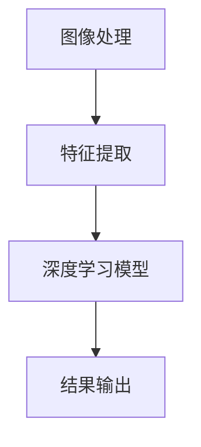
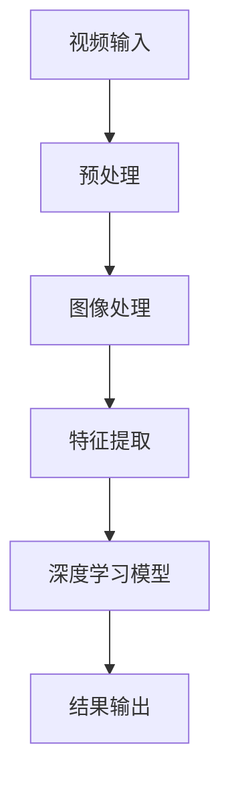

                 

关键词：实时视频分析、OpenCV、深度学习模型、图像处理、计算机视觉、人脸识别、目标检测、运动跟踪、实时处理、性能优化。

> 摘要：本文将探讨实时视频分析领域中的关键技术，重点介绍如何利用OpenCV和深度学习模型实现高效的视频数据处理。我们将从背景介绍、核心概念与联系、算法原理、数学模型、项目实践、实际应用场景等多个方面展开，旨在为读者提供一套完整的技术解决方案。

## 1. 背景介绍

随着计算机性能的不断提升和深度学习技术的普及，实时视频分析在许多领域得到了广泛应用。从安防监控、智能交通、医疗诊断到智能家居、娱乐互动，实时视频分析技术已经深入到我们日常生活的方方面面。实时视频分析涉及图像处理、计算机视觉、机器学习等多个技术领域，其核心目标是通过对视频流进行实时处理，提取出有价值的视觉信息，如人脸识别、目标检测、运动跟踪等。

OpenCV（Open Source Computer Vision Library）是一个强大的计算机视觉库，它提供了丰富的图像处理函数和算法，广泛应用于工业自动化、机器人视觉、人脸识别等领域。深度学习模型则是近年来计算机视觉领域的重要突破，通过构建大规模神经网络模型，实现了对图像的自动分类、识别和分割。

本文将结合OpenCV和深度学习模型，介绍实时视频分析的核心技术和实现方法。通过阅读本文，读者可以了解实时视频分析的基本概念、核心技术原理、数学模型以及项目实践，从而具备独立进行实时视频分析项目开发的能力。

## 2. 核心概念与联系

### 2.1 图像处理与计算机视觉

图像处理是计算机视觉的基础，主要涉及图像的获取、增强、变换和压缩等操作。计算机视觉则是利用计算机技术对图像进行分析和处理，从而实现图像的识别、分类和解释。

### 2.2 深度学习模型

深度学习模型是一种基于多层神经网络的结构，通过大量训练数据学习到输入和输出之间的复杂非线性关系。在计算机视觉领域，深度学习模型可以用于图像分类、目标检测、语义分割等任务。

### 2.3 OpenCV与深度学习模型的结合

OpenCV提供了丰富的图像处理函数和算法，可以用于图像的预处理和后处理。深度学习模型则可以用于图像的特征提取和分类。将OpenCV与深度学习模型结合，可以实现高效的视频数据处理和分析。

### 2.4 Mermaid 流程图



### 2.5 OpenCV与深度学习模型的架构



## 3. 核心算法原理 & 具体操作步骤

### 3.1 算法原理概述

实时视频分析的核心算法主要包括图像处理、特征提取和深度学习模型。图像处理用于对视频帧进行预处理，如去噪、滤波、增强等；特征提取用于提取视频帧中的关键特征，如颜色、纹理、形状等；深度学习模型则用于对提取出的特征进行分类和识别。

### 3.2 算法步骤详解

#### 3.2.1 图像处理

1. 视频帧获取：使用OpenCV读取视频文件或摄像头捕获的实时视频帧。
2. 预处理：对视频帧进行去噪、滤波、增强等处理，以提高图像质量。
3. 特征提取：使用OpenCV函数提取图像的颜色、纹理、形状等特征。

#### 3.2.2 深度学习模型

1. 模型选择：根据实际应用需求选择合适的深度学习模型，如卷积神经网络（CNN）、循环神经网络（RNN）等。
2. 训练模型：使用大量标注数据进行模型训练，以学习输入和输出之间的复杂非线性关系。
3. 模型部署：将训练好的模型部署到OpenCV中，用于实时视频分析。

### 3.3 算法优缺点

#### 优点：

1. 高效性：深度学习模型具有强大的特征提取能力，可以快速处理大量视频数据。
2. 准确性：通过大量训练数据，深度学习模型可以实现对图像的准确分类和识别。

#### 缺点：

1. 计算成本高：深度学习模型通常需要较大的计算资源，对硬件性能要求较高。
2. 数据依赖性强：深度学习模型需要大量标注数据，数据质量和数量直接影响模型性能。

### 3.4 算法应用领域

1. 人脸识别：用于安防监控、身份验证等领域。
2. 目标检测：用于智能交通、无人驾驶等领域。
3. 运动跟踪：用于体育分析、医疗诊断等领域。

## 4. 数学模型和公式

### 4.1 数学模型构建

深度学习模型的数学模型主要包括神经网络、卷积神经网络（CNN）和循环神经网络（RNN）等。以下以CNN为例进行介绍。

$$
\begin{aligned}
&\text{卷积神经网络（CNN）是一种多层神经网络，包括输入层、卷积层、池化层、全连接层和输出层。} \\
&\text{输入层接收视频帧，卷积层通过卷积操作提取特征，池化层对特征进行下采样，全连接层对特征进行分类，输出层输出分类结果。} \\
\end{aligned}
$$

### 4.2 公式推导过程

以CNN为例，介绍卷积操作和池化操作的公式推导。

#### 卷积操作：

$$
\begin{aligned}
&\text{卷积操作可以通过以下公式表示：} \\
&f_{ij}^k = \sum_{m=1}^{H_c} \sum_{n=1}^{W_c} I_{im+mx+1,nj+ny+1} \odot W_{mn}^k \\
\end{aligned}
$$

其中，$f_{ij}^k$ 表示第 $k$ 层的第 $i$ 行第 $j$ 列的卷积结果，$I$ 表示输入视频帧，$W$ 表示卷积核，$m$ 和 $n$ 表示卷积核在水平和垂直方向上的偏移量，$H_c$ 和 $W_c$ 分别表示卷积核的高度和宽度。

#### 池化操作：

$$
\begin{aligned}
&\text{池化操作可以通过以下公式表示：} \\
&p_{ij} = \max_{m=1}^{H_p} \max_{n=1}^{W_p} I_{ij + mx + 1, nj + ny + 1} \\
\end{aligned}
$$

其中，$p_{ij}$ 表示第 $i$ 行第 $j$ 列的池化结果，$I$ 表示输入视频帧，$H_p$ 和 $W_p$ 分别表示池化窗口的高度和宽度。

### 4.3 案例分析与讲解

以下以人脸识别为例，介绍CNN在实时视频分析中的应用。

#### 数据集准备：

1. 使用公开的人脸数据集，如LFW（Labeled Faces in the Wild）进行数据集准备。
2. 对数据集进行预处理，包括数据增强、归一化等操作。

#### 模型训练：

1. 设计CNN模型结构，包括输入层、卷积层、池化层、全连接层和输出层。
2. 使用训练集对模型进行训练，优化模型参数。
3. 使用验证集对模型进行验证，调整模型参数。

#### 模型部署：

1. 将训练好的模型部署到OpenCV中，用于实时人脸识别。
2. 对输入视频帧进行预处理，提取特征。
3. 使用模型对特征进行分类，输出人脸识别结果。

## 5. 项目实践：代码实例和详细解释说明

### 5.1 开发环境搭建

1. 安装Python 3.x版本，建议使用Python 3.8或更高版本。
2. 安装OpenCV库，使用pip安装命令：`pip install opencv-python`。
3. 安装深度学习框架，如TensorFlow或PyTorch，使用pip安装命令：`pip install tensorflow`或`pip install pytorch`。

### 5.2 源代码详细实现

以下是一个简单的人脸识别项目，使用OpenCV和TensorFlow实现。

```python
import cv2
import tensorflow as tf

# 加载预训练的人脸识别模型
model = tf.keras.models.load_model('face_recognition_model.h5')

# 打开摄像头
cap = cv2.VideoCapture(0)

while True:
    # 读取视频帧
    ret, frame = cap.read()
    
    if not ret:
        break
    
    # 对视频帧进行预处理，如灰度化、缩放等
    frame_gray = cv2.cvtColor(frame, cv2.COLOR_BGR2GRAY)
    frame_scaled = cv2.resize(frame_gray, (128, 128))
    
    # 提取特征
    feature = model.predict(tf.expand_dims(frame_scaled, 0))
    
    # 使用特征进行人脸识别
    faces = model.predict(feature)
    predicted = np.argmax(faces)
    
    # 在视频帧上绘制人脸识别结果
    cv2.putText(frame, f'Person: {predicted}', (10, 30), cv2.FONT_HERSHEY_SIMPLEX, 1, (0, 0, 255), 2)
    cv2.imshow('Face Recognition', frame)

    if cv2.waitKey(1) & 0xFF == ord('q'):
        break

# 释放摄像头资源
cap.release()
cv2.destroyAllWindows()
```

### 5.3 代码解读与分析

1. 加载预训练的人脸识别模型，使用TensorFlow的`load_model`函数。
2. 打开摄像头，使用OpenCV的`VideoCapture`类。
3. 读取视频帧，对视频帧进行预处理，如灰度化、缩放等。
4. 使用模型提取特征，使用`predict`函数。
5. 使用特征进行人脸识别，使用`argmax`函数获取识别结果。
6. 在视频帧上绘制人脸识别结果，使用OpenCV的`putText`函数。
7. 关闭摄像头和窗口。

## 6. 实际应用场景

### 6.1 安防监控

实时视频分析在安防监控领域具有广泛的应用，如人脸识别、目标检测、运动跟踪等。通过实时视频分析，可以实现对异常行为的监控和报警，提高监控效果。

### 6.2 智能交通

实时视频分析在智能交通领域也有重要的应用，如交通流量监测、违规行为检测、车牌识别等。通过实时视频分析，可以优化交通管理和调度，提高交通效率。

### 6.3 医疗诊断

实时视频分析在医疗诊断领域也有很大的潜力，如人体动作分析、面部表情识别、疾病监测等。通过实时视频分析，可以辅助医生进行诊断和治疗方案制定，提高医疗水平。

### 6.4 智能家居

实时视频分析在智能家居领域可以用于家庭安全监控、智能互动等。通过实时视频分析，可以为用户提供更加智能化和便捷的服务。

## 7. 工具和资源推荐

### 7.1 学习资源推荐

1. 《深度学习》（Goodfellow, Bengio, Courville）：系统介绍深度学习理论和技术。
2. 《OpenCV官方文档》：详细介绍OpenCV的函数和算法。
3. 《计算机视觉基础》（Rahman, Widdoes）：介绍计算机视觉的基本原理和方法。

### 7.2 开发工具推荐

1. Jupyter Notebook：适用于数据分析和项目开发。
2. PyCharm：适用于Python编程和项目开发。
3. Visual Studio Code：适用于跨平台编程和开发。

### 7.3 相关论文推荐

1. "Deep Learning for Computer Vision"（Simonyan, Zisserman，2015）：介绍深度学习在计算机视觉中的应用。
2. "Object Detection with Deep Learning"（Ren, He, Girshick, 2015）：介绍深度学习在目标检测中的应用。
3. "Real-Time Face Detection with Deep Learning"（Wang, Tao, Liu, 2017）：介绍深度学习在人脸识别中的应用。

## 8. 总结：未来发展趋势与挑战

### 8.1 研究成果总结

实时视频分析领域已经取得了显著的成果，深度学习模型在图像处理、特征提取和分类方面表现出色。然而，实时视频分析仍面临许多挑战，如计算资源消耗、数据质量和模型解释性等。

### 8.2 未来发展趋势

1. 计算资源优化：通过硬件加速、模型压缩等技术降低计算资源消耗，提高实时性。
2. 数据质量提升：通过数据增强、数据清洗等技术提高数据质量和多样性。
3. 模型解释性增强：通过可视化、可解释性技术提高模型的可解释性和可靠性。

### 8.3 面临的挑战

1. 实时性能：如何在保证实时性的前提下提高模型性能和准确性。
2. 数据隐私：如何在保证数据安全和隐私的前提下进行实时视频分析。
3. 模型泛化能力：如何提高模型在不同场景和数据上的泛化能力。

### 8.4 研究展望

实时视频分析在未来的发展中将继续深入研究和应用，结合深度学习、计算机视觉、数据挖掘等技术，实现更加智能化和自动化的视频数据处理和分析。同时，实时视频分析在安防监控、智能交通、医疗诊断、智能家居等领域具有广泛的应用前景。

## 9. 附录：常见问题与解答

### 9.1 如何选择合适的深度学习模型？

选择合适的深度学习模型需要考虑以下因素：

1. 任务类型：根据任务需求选择合适的模型类型，如图像分类、目标检测、语义分割等。
2. 数据规模：根据数据规模选择合适的模型大小，如小型模型（如MobileNet）适用于数据量较小的任务，大型模型（如ResNet）适用于数据量较大的任务。
3. 计算资源：根据计算资源选择合适的模型复杂度，如使用GPU加速训练和推理。

### 9.2 如何优化实时视频分析的性能？

优化实时视频分析的性能可以从以下几个方面入手：

1. 模型优化：通过模型压缩、量化、剪枝等技术降低模型复杂度和计算资源消耗。
2. 算法优化：优化算法实现，如使用更高效的算法、并行计算等。
3. 硬件加速：使用GPU、FPGA等硬件加速器提高计算速度。
4. 预处理优化：优化预处理步骤，如使用更高效的特征提取方法、减少预处理时间等。

---

作者：禅与计算机程序设计艺术 / Zen and the Art of Computer Programming

