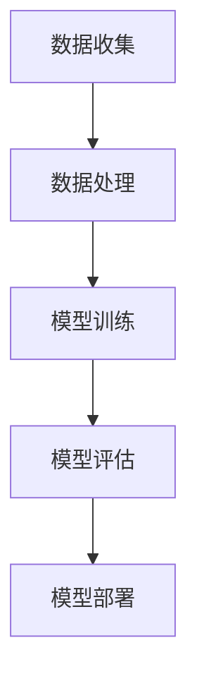

                 

关键词：人工智能，技术落地，产业应用，AI发展，算法原理，数学模型，项目实践，未来展望

> 摘要：本文从实验室到产业界的视角，深入探讨了人工智能技术落地的关键因素。通过详细分析核心算法原理、数学模型及实际应用案例，探讨了AI在产业界中的应用现状及未来发展趋势，旨在为AI技术的普及和发展提供有益的参考。

## 1. 背景介绍

人工智能（AI）作为计算机科学的一个分支，以其强大的学习和推理能力，在众多领域展现出了巨大的潜力。然而，从实验室的研究成果到产业界的实际应用，这一转化过程并非一帆风顺。技术落地不仅需要创新的理论支持，更依赖于实际的工程实践和产业需求。

近年来，随着深度学习、大数据和云计算等技术的快速发展，AI的应用场景不断扩大，从传统的工业制造、医疗诊断到新兴的自动驾驶、智能语音助手等，AI技术正在逐渐融入各个行业，推动产业变革。然而，AI技术的发展和应用也面临着诸多挑战，如算法的可解释性、数据隐私保护、安全性等。

本文旨在分析AI技术从实验室到产业界落地的关键因素，探讨核心算法原理、数学模型及其在实际应用中的具体实现，以期对AI技术的推广和应用提供指导。

## 2. 核心概念与联系

### 2.1 AI技术的基本概念

人工智能是指通过计算机程序实现智能行为的技术。它包括机器学习、深度学习、自然语言处理、计算机视觉等多个子领域。在这些子领域中，机器学习和深度学习是AI技术发展的核心。

- **机器学习**：机器学习是一种通过算法从数据中学习规律和模式的方法，其核心思想是让计算机通过训练数据集自动改进性能。
- **深度学习**：深度学习是机器学习的一个分支，通过构建多层神经网络来模拟人类大脑的学习过程，能够处理大规模数据并提取复杂特征。

### 2.2 AI架构

一个典型的AI系统通常包括数据收集、数据处理、模型训练、模型评估和模型部署等环节。

- **数据收集**：收集用于训练和测试的数据集，数据质量直接影响模型的性能。
- **数据处理**：对数据进行清洗、归一化和预处理，使其适合用于模型训练。
- **模型训练**：利用训练数据集训练模型，模型训练的过程实际上是寻找最优参数的过程。
- **模型评估**：通过测试数据集评估模型的性能，常见的评估指标包括准确率、召回率、F1值等。
- **模型部署**：将训练好的模型部署到实际应用环境中，实现自动化或半自动化的智能行为。

### 2.3 Mermaid 流程图

下面是一个简化的AI模型训练和部署的Mermaid流程图：



在上述流程中，数据收集和处理是模型训练的基础，模型训练和评估是模型优化的关键，而模型部署则是实现AI技术落地的最终目标。

## 3. 核心算法原理 & 具体操作步骤

### 3.1 算法原理概述

AI技术涉及多种核心算法，其中深度学习算法尤为关键。深度学习算法基于多层神经网络结构，通过前向传播和反向传播算法进行训练。

- **前向传播**：输入数据通过网络的每一层，逐层计算输出，直至最后输出结果。
- **反向传播**：根据输出结果和预期目标之间的差异，反向调整网络中各层的权重，以减小误差。

### 3.2 算法步骤详解

#### 3.2.1 数据收集与预处理

1. **数据收集**：从各种来源收集大量数据，如图像、文本、声音等。
2. **数据预处理**：包括数据清洗、归一化、缩放等操作，以确保数据质量。

#### 3.2.2 模型设计

1. **确定网络结构**：选择合适的神经网络结构，如卷积神经网络（CNN）、循环神经网络（RNN）等。
2. **定义损失函数**：选择合适的损失函数，如均方误差（MSE）、交叉熵（Cross Entropy）等。

#### 3.2.3 模型训练

1. **初始化权重**：随机初始化网络权重。
2. **前向传播**：输入数据通过网络计算输出。
3. **计算损失**：比较输出结果和预期目标，计算损失值。
4. **反向传播**：根据损失值调整网络权重。
5. **迭代优化**：重复前向传播和反向传播过程，直至模型收敛。

#### 3.2.4 模型评估与部署

1. **模型评估**：使用测试数据集评估模型性能。
2. **模型部署**：将训练好的模型部署到实际应用环境中，如工业生产、医疗诊断等。

### 3.3 算法优缺点

#### 优点

- **强大的学习能力**：深度学习算法能够自动提取数据中的复杂特征，无需人工干预。
- **广泛的适用性**：可以应用于图像识别、自然语言处理、语音识别等多个领域。

#### 缺点

- **计算资源需求高**：深度学习算法需要大量的计算资源，特别是对于大规模数据集和复杂模型。
- **数据依赖性强**：模型的性能很大程度上取决于数据质量，数据不足或质量差可能导致模型效果不佳。

### 3.4 算法应用领域

深度学习算法在多个领域都有广泛应用，包括：

- **计算机视觉**：图像分类、目标检测、人脸识别等。
- **自然语言处理**：文本分类、机器翻译、语音识别等。
- **医疗诊断**：疾病检测、医学影像分析等。
- **自动驾驶**：环境感知、路径规划等。

## 4. 数学模型和公式 & 详细讲解 & 举例说明

### 4.1 数学模型构建

在深度学习算法中，常用的数学模型包括多层感知机（MLP）、卷积神经网络（CNN）和循环神经网络（RNN）等。

#### 4.1.1 多层感知机（MLP）

多层感知机是一个前向传播的多层神经网络，其基本结构包括输入层、隐藏层和输出层。

$$
Z = \sigma(W_1 \cdot X + b_1)
$$

$$
Y = \sigma(W_2 \cdot Z + b_2)
$$

其中，$W_1$ 和 $W_2$ 分别是输入层到隐藏层、隐藏层到输出层的权重矩阵，$b_1$ 和 $b_2$ 分别是两个层的偏置项，$\sigma$ 是激活函数，常用的激活函数有Sigmoid、ReLU等。

#### 4.1.2 卷积神经网络（CNN）

卷积神经网络是一种特殊的多层感知机，主要应用于图像处理领域。其基本结构包括卷积层、池化层和全连接层。

$$
h_i = \sum_j w_{ij} * g_j + b_i
$$

其中，$h_i$ 是第$i$个卷积核的结果，$g_j$ 是输入图像的像素值，$w_{ij}$ 是卷积核的权重，$b_i$ 是偏置项。

#### 4.1.3 循环神经网络（RNN）

循环神经网络是一种用于处理序列数据的神经网络，其基本结构包括输入层、隐藏层和输出层。

$$
h_t = \sigma(W_h \cdot [h_{t-1}, x_t] + b_h)
$$

$$
y_t = \sigma(W_o \cdot h_t + b_o)
$$

其中，$h_t$ 是第$t$个隐藏层状态，$x_t$ 是第$t$个输入序列，$W_h$ 和 $W_o$ 分别是隐藏层到隐藏层、隐藏层到输出层的权重矩阵，$b_h$ 和 $b_o$ 分别是两个层的偏置项，$\sigma$ 是激活函数。

### 4.2 公式推导过程

以多层感知机为例，其前向传播的推导过程如下：

1. **输入层到隐藏层**：

   $$Z = W_1 \cdot X + b_1$$

   其中，$Z$ 是隐藏层输出，$W_1$ 是输入层到隐藏层的权重矩阵，$X$ 是输入层输出，$b_1$ 是隐藏层的偏置项。

2. **激活函数**：

   $$a = \sigma(Z)$$

   其中，$\sigma$ 是激活函数，常用的激活函数有Sigmoid、ReLU等。

3. **隐藏层到输出层**：

   $$Y = W_2 \cdot A + b_2$$

   其中，$Y$ 是输出层输出，$W_2$ 是隐藏层到输出层的权重矩阵，$A$ 是隐藏层输出，$b_2$ 是输出层的偏置项。

4. **输出层激活函数**：

   $$y = \sigma(Y)$$

   其中，$\sigma$ 是输出层的激活函数。

### 4.3 案例分析与讲解

#### 4.3.1 图像分类

假设我们有一个图像分类问题，输入图像是28x28的像素矩阵，输出是10个类别中的一个。

1. **数据预处理**：

   将图像数据归一化到0-1之间。

2. **模型设计**：

   选择一个简单的卷积神经网络，包括一个卷积层、一个池化层和一个全连接层。

3. **模型训练**：

   使用训练数据集进行模型训练，调整权重和偏置项，使模型在测试数据集上的分类准确率最高。

4. **模型评估**：

   使用测试数据集评估模型性能，计算分类准确率。

#### 4.3.2 自然语言处理

假设我们有一个自然语言处理问题，输入是句子，输出是句子类别。

1. **数据预处理**：

   将句子转换为词向量。

2. **模型设计**：

   选择一个循环神经网络，包括一个嵌入层、一个循环层和一个全连接层。

3. **模型训练**：

   使用训练数据集进行模型训练，调整权重和偏置项，使模型在测试数据集上的分类准确率最高。

4. **模型评估**：

   使用测试数据集评估模型性能，计算分类准确率。

## 5. 项目实践：代码实例和详细解释说明

### 5.1 开发环境搭建

1. 安装Python环境，推荐使用Python 3.7或更高版本。
2. 安装深度学习框架，如TensorFlow或PyTorch。
3. 安装必要的库，如NumPy、Pandas等。

### 5.2 源代码详细实现

下面是一个简单的图像分类模型的Python代码实现，使用TensorFlow框架。

```python
import tensorflow as tf
from tensorflow.keras import layers

# 定义模型结构
model = tf.keras.Sequential([
    layers.Conv2D(32, (3, 3), activation='relu', input_shape=(28, 28, 1)),
    layers.MaxPooling2D((2, 2)),
    layers.Conv2D(64, (3, 3), activation='relu'),
    layers.MaxPooling2D((2, 2)),
    layers.Flatten(),
    layers.Dense(64, activation='relu'),
    layers.Dense(10, activation='softmax')
])

# 编译模型
model.compile(optimizer='adam',
              loss='sparse_categorical_crossentropy',
              metrics=['accuracy'])

# 加载数据集
(x_train, y_train), (x_test, y_test) = tf.keras.datasets.mnist.load_data()

# 数据预处理
x_train = x_train.reshape((-1, 28, 28, 1)).astype(tf.float32) / 255
x_test = x_test.reshape((-1, 28, 28, 1)).astype(tf.float32) / 255

# 训练模型
model.fit(x_train, y_train, epochs=5)

# 评估模型
model.evaluate(x_test, y_test)
```

### 5.3 代码解读与分析

1. **模型结构**：

   模型结构定义为一个序列模型（Sequential），包括一个卷积层（Conv2D）、两个最大池化层（MaxPooling2D）、一个展平层（Flatten）、两个全连接层（Dense）。

2. **编译模型**：

   使用`compile`方法编译模型，指定优化器（optimizer）、损失函数（loss）和评估指标（metrics）。

3. **加载数据集**：

   使用`mnist.load_data`方法加载数据集，包括训练集和测试集。

4. **数据预处理**：

   将图像数据展平为一个28x28的像素矩阵，并将像素值归一化到0-1之间。

5. **训练模型**：

   使用`fit`方法训练模型，指定训练集和训练轮数（epochs）。

6. **评估模型**：

   使用`evaluate`方法评估模型在测试集上的性能，包括损失值和准确率。

## 6. 实际应用场景

### 6.1 自动驾驶

自动驾驶技术是AI在产业界的一个重要应用场景。通过计算机视觉和深度学习算法，自动驾驶系统能够实时感知周围环境，进行路径规划和决策。例如，特斯拉的自动驾驶系统Autopilot就使用了大量的深度学习和计算机视觉技术。

### 6.2 医疗诊断

AI在医疗诊断中的应用也非常广泛，如癌症检测、心脏病诊断等。通过深度学习算法，AI系统能够从医学影像中自动识别病变区域，辅助医生进行诊断。例如，谷歌的DeepMind就开发了一种能够自动诊断糖尿病视网膜病变的系统。

### 6.3 金融风控

AI技术在金融风控中的应用也越来越广泛，如欺诈检测、信用评估等。通过机器学习和深度学习算法，AI系统能够分析大量的金融数据，识别潜在风险，为金融机构提供决策支持。

## 6.4 未来应用展望

随着AI技术的不断发展和成熟，未来AI将在更多领域得到应用，如智能城市、智能家居、智能制造等。同时，AI技术也将面临更多的挑战，如算法的可解释性、数据隐私保护、安全性等。未来，AI技术的发展将更加注重与人类社会的深度融合，实现真正的智能助理和合作伙伴。

## 7. 工具和资源推荐

### 7.1 学习资源推荐

- 《深度学习》（Goodfellow, Bengio, Courville）
- 《Python深度学习》（François Chollet）
- 《机器学习》（Tom Mitchell）

### 7.2 开发工具推荐

- TensorFlow
- PyTorch
- Keras

### 7.3 相关论文推荐

- “Deep Learning for Computer Vision” (2015)
- “Generative Adversarial Nets” (2014)
- “Recurrent Neural Networks for Language Modeling” (1997)

## 8. 总结：未来发展趋势与挑战

### 8.1 研究成果总结

本文从实验室到产业界的视角，探讨了人工智能技术的发展和应用。通过分析核心算法原理、数学模型和实际应用案例，总结了AI技术在不同领域的应用现状和挑战。

### 8.2 未来发展趋势

未来，AI技术将继续快速发展，深度学习、强化学习等算法将在更多领域得到应用。同时，AI技术的普及将更加注重与人类社会的深度融合，实现更加智能化的应用场景。

### 8.3 面临的挑战

AI技术在发展过程中也面临着诸多挑战，如算法的可解释性、数据隐私保护、安全性等。未来，AI技术的发展需要更加关注这些挑战，以实现可持续和负责任的应用。

### 8.4 研究展望

随着AI技术的不断进步，未来将出现更多创新性的应用，如智能机器人、虚拟现实等。同时，AI技术的发展也将推动更多跨学科的研究，为人类社会带来更多智慧和便利。

## 9. 附录：常见问题与解答

### 9.1 Q：深度学习算法如何工作？

A：深度学习算法是基于多层神经网络结构的机器学习算法，通过前向传播和反向传播算法进行训练。前向传播用于计算网络的输出，反向传播用于根据输出和预期目标之间的差异调整网络的权重。

### 9.2 Q：什么是卷积神经网络（CNN）？

A：卷积神经网络是一种专门用于处理图像数据的神经网络结构，通过卷积操作提取图像中的局部特征。CNN包括卷积层、池化层和全连接层，可以自动学习图像中的复杂特征。

### 9.3 Q：什么是强化学习？

A：强化学习是一种通过与环境交互来学习最优策略的机器学习算法。在强化学习中，智能体通过接收环境反馈来调整自己的行为，以实现最大化奖励。

### 9.4 Q：什么是自然语言处理（NLP）？

A：自然语言处理是一种人工智能领域，致力于使计算机能够理解和处理人类语言。NLP技术包括文本分类、情感分析、机器翻译等。

### 9.5 Q：如何提高深度学习模型的性能？

A：提高深度学习模型性能的方法包括调整网络结构、优化训练过程、增加训练数据等。此外，还可以使用正则化技术、数据增强方法等来提高模型性能。

### 9.6 Q：什么是深度学习框架？

A：深度学习框架是一种用于构建和训练深度学习模型的软件库。常见的深度学习框架包括TensorFlow、PyTorch、Keras等，这些框架提供了丰富的工具和接口，方便研究人员和开发者进行深度学习研究和应用。

------------------------------------------------------------------
作者：禅与计算机程序设计艺术 / Zen and the Art of Computer Programming


