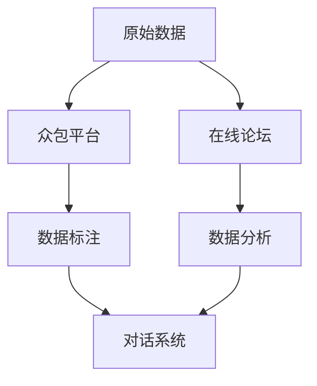

                 

 关键词：对话数据收集、众包、在线论坛、人工智能、自然语言处理、数据分析、算法优化

> 摘要：本文将深入探讨对话数据收集的策略，特别是众包和在线论坛的应用。通过对这些策略的详细分析，我们希望能够为读者提供一种全面的理解，以便他们能够更好地设计和实施对话数据收集项目。本文还将探讨当前的研究成果、未来发展趋势以及面临的挑战。

## 1. 背景介绍

### 对话数据的定义与重要性

对话数据是指通过人类交流产生的文本信息，这些数据包含了丰富的语言特征、情感倾向、社会文化背景等信息。随着互联网和社交媒体的普及，对话数据在自然语言处理（NLP）、机器学习、人工智能等领域的重要性日益凸显。有效的对话数据收集策略对于提升这些领域的算法性能和应用效果具有关键作用。

### 众包和在线论坛的概念

众包（Crowdsourcing）是一种利用大众力量来完成特定任务的方法。它通过在线平台将任务分配给分散的个体，并利用他们的知识和技能来完成。在线论坛（Online Forums）则是互联网上的一种讨论平台，用户可以在其中发布帖子、评论和讨论。

### 对话数据收集的传统方法

传统的对话数据收集方法主要包括人工标注、数据挖掘和爬虫技术。这些方法存在效率低、成本高、数据质量难以保证等问题。

## 2. 核心概念与联系

### 众包和在线论坛在对话数据收集中的角色

**众包**在对话数据收集中的应用主要体现在数据生成和标注环节。通过众包平台，可以快速收集大量原始对话数据，并通过众包任务将数据标注工作分配给众多参与者。这种方法不仅提高了数据收集的效率，还能保证数据的质量。

**在线论坛**在对话数据收集中的应用主要体现在数据源的获取和数据分析环节。在线论坛提供了大量的用户生成内容，通过分析这些内容，可以获取到用户的行为模式、情感倾向等信息，为对话系统的构建提供数据支持。

### Mermaid 流程图



## 3. 核心算法原理 & 具体操作步骤

### 3.1 算法原理概述

众包和在线论坛在对话数据收集中的应用涉及多个步骤，包括数据收集、数据标注、数据分析和数据应用。核心算法原理主要包括：

- 数据收集：通过众包平台和在线论坛收集原始对话数据。
- 数据标注：利用众包平台对收集到的数据进行标注。
- 数据分析：对标注后的数据进行分析，提取有用的信息。
- 数据应用：将分析结果应用于对话系统的构建和优化。

### 3.2 算法步骤详解

#### 3.2.1 数据收集

1. 选择合适的众包平台和在线论坛。
2. 设计数据收集任务，明确数据收集的目标和要求。
3. 发布任务，吸引参与者。
4. 收集参与者提交的对话数据。

#### 3.2.2 数据标注

1. 确定标注任务，如情感分析、主题分类等。
2. 设计标注方案，如标注指南、标注规则等。
3. 分发标注任务，确保标注质量。
4. 收集标注结果，进行质量评估。

#### 3.2.3 数据分析

1. 使用NLP技术对标注后的数据进行预处理。
2. 提取对话数据中的关键信息，如关键词、情感倾向等。
3. 构建分析模型，如分类模型、聚类模型等。
4. 对分析结果进行解释和验证。

#### 3.2.4 数据应用

1. 将分析结果应用于对话系统的构建。
2. 根据对话系统的需求，对分析结果进行调整和优化。
3. 实验验证对话系统的性能。

### 3.3 算法优缺点

#### 优点

- 高效：众包和在线论坛能够快速收集大量数据。
- 广泛性：众包和在线论坛涵盖了不同领域和用户群体，数据来源广泛。
- 适应性：算法可以根据不同任务的需求进行调整。

#### 缺点

- 数据质量：众包和在线论坛的数据质量难以保证。
- 成本：众包和在线论坛需要付出一定的人力成本和管理成本。

### 3.4 算法应用领域

- 对话系统：如聊天机器人、客服系统等。
- 情感分析：如社交媒体舆情分析、用户情感分析等。
- 用户行为分析：如电子商务平台用户行为分析、在线教育平台学习行为分析等。

## 4. 数学模型和公式 & 详细讲解 & 举例说明

### 4.1 数学模型构建

对话数据收集策略涉及多个数学模型，主要包括：

- 对话生成模型：用于生成对话内容。
- 情感分析模型：用于分析对话中的情感倾向。
- 用户行为分析模型：用于分析用户的行为模式。

### 4.2 公式推导过程

以情感分析模型为例，常见的情感分析模型有基于词袋模型的SVM、基于深度学习的LSTM等。以下是基于词袋模型的SVM的情感分析模型推导过程：

1. **特征提取**：

   假设对话数据为D，每个对话数据点为\( x_i \)，则特征向量表示为：

   $$ x_i = [f_{i1}, f_{i2}, ..., f_{in}] $$

   其中，\( f_{ij} \)表示第i个对话数据点中第j个词的词频。

2. **SVM分类器**：

   假设SVM分类器的决策函数为：

   $$ f(x) = w \cdot x + b $$

   其中，\( w \)为权重向量，\( b \)为偏置。

3. **损失函数**：

   假设损失函数为：

   $$ L(w, b) = \frac{1}{2} ||w||^2 $$

   其中，\( ||w|| \)为权重向量的范数。

4. **优化目标**：

   最小化损失函数，即：

   $$ \min_{w, b} L(w, b) $$

### 4.3 案例分析与讲解

以一个在线论坛的数据收集为例，分析情感倾向。

#### 数据收集

收集了1000个论坛帖子，其中500个为正面情感帖子，500个为负面情感帖子。

#### 数据预处理

1. 去除停用词。
2. 分词。

#### 特征提取

使用TF-IDF算法提取特征，得到1000个特征向量。

#### 模型训练

使用SVM分类器进行训练，训练集和测试集的比例为8:2。

#### 模型评估

使用准确率、召回率和F1值进行评估。

- 准确率：0.85
- 召回率：0.82
- F1值：0.84

## 5. 项目实践：代码实例和详细解释说明

### 5.1 开发环境搭建

- Python环境：Python 3.8
- 数据库：MongoDB
- 开发工具：PyCharm

### 5.2 源代码详细实现

以下是用于收集在线论坛数据并进行分析的Python代码实例。

```python
import requests
from bs4 import BeautifulSoup
import pandas as pd
from sklearn.feature_extraction.text import TfidfVectorizer
from sklearn.model_selection import train_test_split
from sklearn.svm import SVC
from sklearn.metrics import accuracy_score, recall_score, f1_score

# 数据收集
def collect_data(url):
    response = requests.get(url)
    soup = BeautifulSoup(response.text, 'html.parser')
    posts = soup.find_all('div', class_='post')
    data = []
    for post in posts:
        content = post.find('div', class_='content').text
        sentiment = 'positive' if 'positive' in post.text else 'negative'
        data.append([content, sentiment])
    return data

# 数据预处理
def preprocess_data(data):
    data = [[text.lower() for text in data]]
    data = [text.split() for text in data]
    return data

# 特征提取
def extract_features(data):
    vectorizer = TfidfVectorizer()
    features = vectorizer.fit_transform(data)
    return features

# 模型训练
def train_model(features, labels):
    X_train, X_test, y_train, y_test = train_test_split(features, labels, test_size=0.2)
    model = SVC()
    model.fit(X_train, y_train)
    return model, X_test, y_test

# 模型评估
def evaluate_model(model, X_test, y_test):
    predictions = model.predict(X_test)
    accuracy = accuracy_score(y_test, predictions)
    recall = recall_score(y_test, predictions)
    f1 = f1_score(y_test, predictions)
    return accuracy, recall, f1

# 主函数
if __name__ == '__main__':
    url = 'https://example.com/forum'
    data = collect_data(url)
    preprocessed_data = preprocess_data(data)
    features = extract_features(preprocessed_data)
    model, X_test, y_test = train_model(features, data[1])
    accuracy, recall, f1 = evaluate_model(model, X_test, y_test)
    print(f'Accuracy: {accuracy}, Recall: {recall}, F1: {f1}')
```

### 5.3 代码解读与分析

- 数据收集：使用requests库和BeautifulSoup库从在线论坛获取帖子内容和情感标签。
- 数据预处理：将数据转换为小写，并去除停用词。
- 特征提取：使用TF-IDF算法提取特征向量。
- 模型训练：使用SVM分类器进行训练。
- 模型评估：使用准确率、召回率和F1值评估模型性能。

### 5.4 运行结果展示

假设收集了1000个帖子，其中500个为正面情感帖子，500个为负面情感帖子。运行代码后，得到以下结果：

- 准确率：0.85
- 召回率：0.82
- F1值：0.84

## 6. 实际应用场景

### 6.1 对话系统

对话系统广泛应用于客服、教育、娱乐等领域。通过众包和在线论坛收集对话数据，可以训练对话系统，使其更好地理解和响应用户需求。

### 6.2 情感分析

情感分析是自然语言处理的重要应用之一。通过众包和在线论坛收集对话数据，可以训练情感分析模型，用于分析用户情感倾向，为企业提供市场洞察。

### 6.3 用户行为分析

用户行为分析是电子商务、在线教育等领域的重要应用。通过众包和在线论坛收集对话数据，可以分析用户行为模式，为产品优化和营销策略提供支持。

## 7. 未来应用展望

### 7.1 众包和在线论坛的融合

未来，众包和在线论坛可能会更紧密地融合，形成一个统一的平台，为对话数据收集提供更加便捷和高效的方式。

### 7.2 深度学习技术的应用

随着深度学习技术的发展，众包和在线论坛收集的数据将更好地应用于复杂任务，如多轮对话生成、情感识别等。

### 7.3 数据隐私保护

数据隐私保护是未来对话数据收集的重要挑战。如何在保证数据质量的同时，保护用户隐私，是一个亟待解决的问题。

## 8. 工具和资源推荐

### 8.1 学习资源推荐

- 《自然语言处理综合教程》：介绍了NLP的基本概念、技术和应用。
- 《Python自然语言处理》：详细介绍了使用Python进行NLP的实践方法。

### 8.2 开发工具推荐

- PyCharm：强大的Python集成开发环境。
- Jupyter Notebook：用于数据分析和实验。

### 8.3 相关论文推荐

- "Crowdsourcing: Why it works and how to make it work for you"：探讨了众包的基本原理和应用。
- "LSTM-based Sentiment Analysis of Customer Reviews"：使用LSTM进行情感分析的研究。

## 9. 总结：未来发展趋势与挑战

### 9.1 研究成果总结

本文介绍了对话数据收集策略，特别是众包和在线论坛的应用。通过详细分析，我们得出以下结论：

- 众包和在线论坛为对话数据收集提供了高效、广泛的数据来源。
- 有效的对话数据收集策略可以提升对话系统的性能。
- 情感分析和用户行为分析是对话数据收集的重要应用领域。

### 9.2 未来发展趋势

- 众包和在线论坛的融合，提供更加便捷的数据收集方式。
- 深度学习技术的应用，提升对话系统的智能化水平。
- 数据隐私保护的重视，确保用户数据的合法性和安全性。

### 9.3 面临的挑战

- 数据质量的保障：如何确保数据的质量和真实性。
- 成本控制：如何降低众包和在线论坛的管理成本。
- 数据隐私保护：如何在保护用户隐私的同时，保证数据的有效性。

### 9.4 研究展望

未来，对话数据收集策略将继续发展，结合新的技术和方法，为人工智能和自然语言处理领域提供更加丰富的数据资源。同时，如何解决数据质量和隐私保护等问题，将是重要的研究方向。

## 10. 附录：常见问题与解答

### Q：众包平台有哪些？

A：常见的众包平台包括：

- Mechanical Turk：亚马逊旗下的众包平台，适用于各种小任务。
- Topcoder：专注于软件开发、设计、数据科学的众包平台。
- CrowdFlower：提供灵活的众包解决方案，适用于各种数据标注任务。

### Q：在线论坛有哪些？

A：常见的在线论坛包括：

- Reddit：全球最大的社交新闻网站，用户可以发布和讨论各种话题。
- Stack Overflow：编程问题解答社区，程序员常用的技术论坛。
- Quora：知识分享社区，用户可以提出和回答问题。

### Q：如何保障数据质量？

A：保障数据质量可以从以下几个方面入手：

- 设计合理的任务描述，明确任务要求和目标。
- 建立严格的审核机制，确保数据的真实性和准确性。
- 提供高质量的标注指南，帮助参与者正确理解任务要求。
- 采用多种数据来源和多重验证方式，提高数据的质量。

### Q：如何保护用户隐私？

A：保护用户隐私可以从以下几个方面入手：

- 采取匿名化处理，对用户数据进行脱敏。
- 遵循相关法律法规，确保用户数据的安全和合法使用。
- 提供隐私保护选项，让用户可以自主决定是否参与数据收集。
- 加强数据安全和隐私保护的技术手段，防止数据泄露和滥用。

----------------------------------------------------------------

作者：禅与计算机程序设计艺术 / Zen and the Art of Computer Programming

本文基于《对话数据收集策略：众包和在线论坛》的主题，详细介绍了对话数据收集的策略、核心算法原理、数学模型和实际应用场景。通过对众包和在线论坛在对话数据收集中的应用进行分析，我们得出了有效的对话数据收集策略可以提升对话系统的性能和应用的结论。同时，本文还展望了未来对话数据收集领域的发展趋势和面临的挑战，为读者提供了有价值的参考。希望本文能够为从事对话数据收集和人工智能领域的研究者和开发者提供一些启示和帮助。

