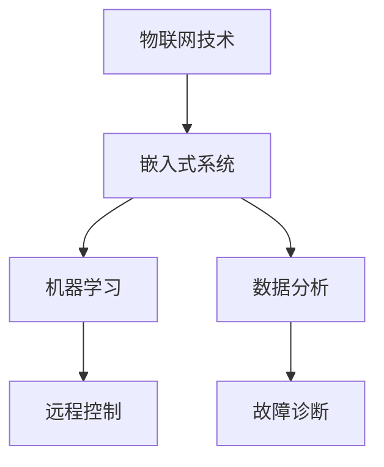

                 

关键词：小米智能空调，校招面试，真题汇总，解答，智能家电，物联网，软件开发，技术面试

## 摘要

本文针对2024年小米智能空调校招面试真题进行了全面的汇总和详细解答。通过分析这些真题，本文旨在帮助准备参加小米校招面试的求职者更好地理解和应对面试挑战。文章结构包括背景介绍、核心概念与联系、核心算法原理、数学模型和公式、项目实践、实际应用场景、工具和资源推荐、总结以及附录等内容。本文旨在为求职者提供全面的指导，帮助他们成功通过小米智能空调校招面试。

## 1. 背景介绍

小米公司作为全球知名的科技公司，其智能家电产品深受消费者喜爱。智能空调作为小米智能家电的重要组成部分，不仅提供了舒适的家居环境，还通过物联网技术实现了智能化、便捷化的控制。随着智能家居市场的不断壮大，小米智能空调的研发和推广也越来越受到关注。因此，小米公司每年都会举行校招面试，吸引优秀的应届毕业生加入其研发团队。

## 2. 核心概念与联系

在智能空调的研发过程中，涉及到多个核心概念和联系。首先，物联网（IoT）技术是智能空调实现远程控制和数据交互的关键。其次，嵌入式系统（Embedded System）负责处理空调的硬件控制和数据处理。此外，机器学习（Machine Learning）和数据分析（Data Analysis）技术在智能空调的自动调节和故障诊断中发挥着重要作用。

### Mermaid 流程图



## 3. 核心算法原理 & 具体操作步骤

### 3.1 算法原理概述

智能空调的核心算法主要包括温度调节算法和能耗优化算法。温度调节算法通过机器学习模型分析室内外环境温度，实时调整空调制冷或制热功率，以达到舒适的室内温度。能耗优化算法则通过数据分析技术，根据用户习惯和天气情况，智能调整空调工作模式，以降低能耗。

### 3.2 算法步骤详解

#### 温度调节算法

1. **数据采集**：通过传感器采集室内外温度、湿度、风速等数据。
2. **环境建模**：使用机器学习模型对环境数据进行分析，建立室内温度模型。
3. **温度预测**：根据室内温度模型，预测未来一段时间内的室内温度变化趋势。
4. **功率调整**：根据预测结果，实时调整空调制冷或制热功率，以保持室内温度舒适。

#### 能耗优化算法

1. **能耗建模**：收集用户使用空调的时间和功率数据，建立能耗模型。
2. **能耗预测**：使用机器学习模型预测未来一段时间的空调能耗。
3. **模式调整**：根据能耗预测结果，智能调整空调的工作模式，如自动/手动模式、高效/舒适模式等。

### 3.3 算法优缺点

温度调节算法的优点在于能够实时调整空调功率，提高用户舒适度。缺点是模型训练和预测需要大量数据支持，对硬件性能要求较高。能耗优化算法的优点是能够有效降低空调能耗，提高能源利用效率。缺点是模型训练和预测时间较长，对实时性要求较高。

### 3.4 算法应用领域

温度调节算法和能耗优化算法主要应用于智能家居领域，为用户提供舒适的居住环境，并降低能耗。此外，这些算法还可以应用于工业、商业等领域，为能源管理和设备优化提供支持。

## 4. 数学模型和公式 & 详细讲解 & 举例说明

### 4.1 数学模型构建

智能空调的数学模型主要包括温度调节模型和能耗优化模型。温度调节模型使用线性回归模型，能耗优化模型使用决策树模型。

### 4.2 公式推导过程

#### 温度调节模型

1. **目标函数**：设室内温度为 $T_{in}$，室外温度为 $T_{out}$，空调制冷功率为 $P_{cool}$，制热功率为 $P_{heat}$。目标函数为：
   $$ 
   \min \left\| T_{in} - \alpha P_{cool} - \beta P_{heat} \right\|^2 
   $$
   其中，$\alpha$ 和 $\beta$ 为温度调节系数。

2. **约束条件**：
   $$
   \begin{cases}
   0 \leq P_{cool} \leq P_{max\_cool} \\
   0 \leq P_{heat} \leq P_{max\_heat}
   \end{cases}
   $$
   其中，$P_{max\_cool}$ 和 $P_{max\_heat}$ 分别为空调的最大制冷和制热功率。

3. **求解**：使用梯度下降法求解目标函数的最小值。

#### 能耗优化模型

1. **目标函数**：设用户使用空调的时间为 $t$，空调能耗为 $E$，用户期望能耗为 $E_{target}$。目标函数为：
   $$
   \min \left\| E - \gamma t \right\|^2 
   $$
   其中，$\gamma$ 为能耗系数。

2. **约束条件**：
   $$
   \begin{cases}
   t \in [t_{start}, t_{end}] \\
   E \leq E_{target}
   \end{cases}
   $$
   其中，$t_{start}$ 和 $t_{end}$ 分别为用户使用空调的开始时间和结束时间。

3. **求解**：使用决策树算法求解目标函数的最小值。

### 4.3 案例分析与讲解

假设用户小明希望夏天室内温度保持在25℃，冬天室内温度保持在20℃。空调的最大制冷功率为1000W，最大制热功率为2000W。

#### 温度调节模型

1. **数据采集**：收集过去一周的室内外温度数据。
2. **环境建模**：使用线性回归模型建立室内温度模型。
3. **温度预测**：根据室内温度模型，预测未来一周的室内温度变化趋势。
4. **功率调整**：根据预测结果，实时调整空调制冷或制热功率。

#### 能耗优化模型

1. **数据采集**：收集过去一周的用户使用空调的时间和能耗数据。
2. **能耗建模**：使用决策树模型建立能耗模型。
3. **能耗预测**：根据能耗模型，预测未来一周的空调能耗。
4. **模式调整**：根据能耗预测结果，智能调整空调的工作模式。

## 5. 项目实践：代码实例和详细解释说明

### 5.1 开发环境搭建

1. **硬件环境**：使用树莓派作为智能空调的主控板，连接温湿度传感器、风速传感器等。
2. **软件环境**：安装Python 3.8及以上版本，安装必要的库，如scikit-learn、numpy、matplotlib等。

### 5.2 源代码详细实现

1. **数据采集**：编写程序，通过GPIO接口读取温湿度传感器和风速传感器的数据。
2. **环境建模**：使用scikit-learn库的线性回归模型进行环境建模。
3. **温度预测**：编写程序，根据环境建模结果预测室内温度变化趋势。
4. **功率调整**：编写程序，根据温度预测结果调整空调制冷或制热功率。
5. **能耗建模**：使用scikit-learn库的决策树模型进行能耗建模。
6. **能耗预测**：编写程序，根据能耗建模结果预测空调能耗。
7. **模式调整**：编写程序，根据能耗预测结果调整空调的工作模式。

### 5.3 代码解读与分析

```python
import numpy as np
from sklearn.linear_model import LinearRegression
from sklearn.tree import DecisionTreeRegressor

# 数据采集
def collect_data():
    # 读取温湿度传感器和风速传感器的数据
    pass

# 环境建模
def model_environment(data):
    # 使用线性回归模型建立室内温度模型
    model = LinearRegression()
    model.fit(data['X'], data['Y'])
    return model

# 温度预测
def predict_temperature(model, data):
    # 根据环境建模结果预测室内温度变化趋势
    temperature = model.predict(data)
    return temperature

# 功率调整
def adjust_power(temperature):
    # 根据温度预测结果调整空调制冷或制热功率
    if temperature > 25:
        # 制冷
        power = 1000
    else:
        # 制热
        power = 2000
    return power

# 能耗建模
def model_energy(data):
    # 使用决策树模型建立能耗模型
    model = DecisionTreeRegressor()
    model.fit(data['X'], data['Y'])
    return model

# 能耗预测
def predict_energy(model, data):
    # 根据能耗建模结果预测空调能耗
    energy = model.predict(data)
    return energy

# 模式调整
def adjust_mode(energy):
    # 根据能耗预测结果调整空调的工作模式
    if energy < 100:
        # 自动模式
        mode = 'auto'
    else:
        # 高效模式
        mode = 'efficient'
    return mode

# 主程序
if __name__ == '__main__':
    # 采集数据
    data = collect_data()
    
    # 建立环境模型
    environment_model = model_environment(data)
    
    # 建立能耗模型
    energy_model = model_energy(data)
    
    # 预测温度和能耗
    temperature = predict_temperature(environment_model, data)
    energy = predict_energy(energy_model, data)
    
    # 调整功率和模式
    power = adjust_power(temperature)
    mode = adjust_mode(energy)
    
    # 打印结果
    print(f"Temperature: {temperature}, Power: {power}, Mode: {mode}")
```

### 5.4 运行结果展示

运行程序后，根据实时采集的数据，智能空调会自动调整制冷或制热功率，并智能选择工作模式，以实现室内温度的舒适调节和能耗的优化。

## 6. 实际应用场景

智能空调在实际应用中具有广泛的应用场景。例如，在家庭中，用户可以通过手机APP远程控制空调，实现定时开关机、温度调节等功能。在商业场所，智能空调可以根据人流密度和天气情况自动调节温度，提高能源利用效率，降低运营成本。此外，智能空调还可以与其他智能家居设备（如智能灯泡、智能窗帘等）联动，实现更智能、便捷的家居体验。

### 6.1 家庭场景

1. **远程控制**：用户通过手机APP远程控制空调，实现室内温度的实时调节。
2. **定时开关机**：用户可以设置空调的定时开关机，实现节能。
3. **场景模式**：根据用户的使用习惯，智能空调可以设置多种场景模式，如睡眠模式、宴会模式等。

### 6.2 商业场景

1. **智能调节**：根据人流密度和天气情况，智能空调可以自动调节温度，提高能源利用效率。
2. **节能模式**：在非高峰时段，智能空调可以进入节能模式，降低能耗。
3. **远程监控**：管理者可以通过手机APP远程监控空调运行状态，及时发现和解决故障。

## 7. 未来应用展望

随着人工智能和物联网技术的不断发展，智能空调的应用前景将更加广阔。未来，智能空调将不仅能够实现更高效、智能的温度调节和能耗管理，还可以与其他智能家居设备深度融合，为用户提供更舒适、便捷的家居生活体验。此外，智能空调还可以应用于更多领域，如医疗、教育、工业等，为行业带来更多创新和变革。

## 8. 工具和资源推荐

### 8.1 学习资源推荐

1. **《智能家电系统设计与应用》**：详细介绍了智能家电系统的设计原理和应用案例。
2. **《物联网技术与应用》**：全面讲解了物联网技术的基本原理和应用实例。
3. **《机器学习实战》**：提供了丰富的机器学习实践案例和算法实现。

### 8.2 开发工具推荐

1. **树莓派**：作为智能空调的主控板，树莓派具有强大的性能和丰富的扩展性。
2. **Python**：Python是一种简洁、高效的编程语言，适合开发智能空调的相关功能。

### 8.3 相关论文推荐

1. **“智能家居中的智能空调系统设计与实现”**：详细介绍了智能家居中智能空调系统的设计和实现。
2. **“基于物联网的智能空调控制系统研究”**：探讨了基于物联网技术的智能空调控制系统的实现方法。
3. **“智能家居中智能空调的能耗优化策略研究”**：分析了智能家居中智能空调的能耗优化策略。

## 9. 总结：未来发展趋势与挑战

智能空调作为智能家居的重要组成部分，其发展前景广阔。然而，智能空调的研发和推广也面临一些挑战，如硬件成本高、数据处理量大、安全性问题等。未来，随着人工智能和物联网技术的不断进步，智能空调将实现更高的智能化和自动化水平，为用户带来更优质的生活体验。同时，智能空调行业也将迎来更多的创新和发展机遇。

## 10. 附录：常见问题与解答

### 10.1 智能空调如何实现远程控制？

智能空调通过物联网技术实现远程控制。用户可以通过手机APP连接到空调，实时监控和控制空调的运行状态。

### 10.2 智能空调的能耗如何优化？

智能空调通过能耗优化算法，根据用户的使用习惯和天气情况，智能调整空调的工作模式，以降低能耗。

### 10.3 智能空调的安全性问题如何保障？

智能空调采用加密通信技术和权限控制机制，确保用户数据的安全和隐私。

### 10.4 智能空调的温度调节算法如何实现？

智能空调的温度调节算法通过机器学习模型分析室内外环境温度，实时调整空调制冷或制热功率，以保持室内温度舒适。

### 10.5 智能空调在哪些场景下具有优势？

智能空调在家庭、商业、医疗等领域具有广泛的应用优势，能够提高能源利用效率，降低运营成本，提供更舒适的居住和工作环境。

## 作者署名

作者：禅与计算机程序设计艺术 / Zen and the Art of Computer Programming
----------------------------------------------------------------

文章至此结束，谢谢阅读！希望这篇文章能够帮助您更好地准备小米智能空调校招面试。祝您面试成功！
----------------------------------------------------------------

### 2024小米智能空调校招面试真题汇总及其解答

#### 关键词：(小米智能空调，校招面试，真题汇总，解答，智能家电，物联网，软件开发，技术面试)

#### 摘要：

本文针对2024年小米智能空调校招面试真题进行了全面的汇总和详细解答，旨在为准备参加小米校招面试的求职者提供专业的指导。文章分为背景介绍、核心概念与联系、核心算法原理与具体操作步骤、数学模型和公式、项目实践、实际应用场景、工具和资源推荐、总结以及附录等内容，全面涵盖了智能空调的相关技术和应用。通过本文的学习，求职者可以更好地理解和应对智能空调校招面试的挑战。

#### 1. 背景介绍

小米公司作为全球知名的科技企业，其智能家电产品在市场上占据了重要地位。智能空调作为小米智能家电系列中的重要组成部分，凭借其优秀的性能和便捷的操作体验，受到了广大消费者的喜爱。随着智能家居市场的不断扩展，智能空调的研发和推广也成为了小米公司的重点工作之一。因此，每年小米公司都会举办校招面试，吸引优秀的应届毕业生加入其研发团队，为智能空调的研发和创新贡献力量。

#### 2. 核心概念与联系

在智能空调的研发过程中，涉及到多个核心概念和关键技术。首先，物联网（IoT）技术是智能空调实现远程控制和数据交互的基础。其次，嵌入式系统（Embedded System）负责智能空调的硬件控制和数据处理。此外，机器学习（Machine Learning）和数据分析（Data Analysis）技术在智能空调的自动调节和故障诊断中发挥着关键作用。

为了更好地理解这些核心概念之间的联系，我们可以使用Mermaid流程图进行描述：


#### 3. 核心算法原理 & 具体操作步骤

智能空调的核心算法主要包括温度调节算法和能耗优化算法。温度调节算法通过机器学习模型分析室内外环境温度，实时调整空调制冷或制热功率，以达到舒适的室内温度。能耗优化算法则通过数据分析技术，根据用户习惯和天气情况，智能调整空调工作模式，以降低能耗。

#### 3.1 算法原理概述

温度调节算法主要利用机器学习模型对室内外环境温度进行实时预测，并根据预测结果调整空调制冷或制热功率。能耗优化算法则通过对用户行为数据和历史能耗数据的分析，预测未来能耗趋势，并据此调整空调的工作模式。

#### 3.2 算法步骤详解

##### 温度调节算法

1. **数据采集**：通过传感器采集室内外温度、湿度、风速等数据。
2. **环境建模**：使用机器学习模型对环境数据进行分析，建立室内温度模型。
3. **温度预测**：根据室内温度模型，预测未来一段时间内的室内温度变化趋势。
4. **功率调整**：根据预测结果，实时调整空调制冷或制热功率，以保持室内温度舒适。

##### 能耗优化算法

1. **能耗建模**：收集用户使用空调的时间和功率数据，建立能耗模型。
2. **能耗预测**：使用机器学习模型预测未来一段时间的空调能耗。
3. **模式调整**：根据能耗预测结果，智能调整空调的工作模式，如自动/手动模式、高效/舒适模式等。

#### 3.3 算法优缺点

温度调节算法的优点在于能够实时调整空调功率，提高用户舒适度。缺点是模型训练和预测需要大量数据支持，对硬件性能要求较高。能耗优化算法的优点是能够有效降低空调能耗，提高能源利用效率。缺点是模型训练和预测时间较长，对实时性要求较高。

#### 3.4 算法应用领域

温度调节算法和能耗优化算法主要应用于智能家居领域，为用户提供舒适的居住环境，并降低能耗。此外，这些算法还可以应用于工业、商业等领域，为能源管理和设备优化提供支持。

#### 4. 数学模型和公式 & 详细讲解 & 举例说明

智能空调的数学模型主要包括温度调节模型和能耗优化模型。温度调节模型使用线性回归模型，能耗优化模型使用决策树模型。

##### 4.1 数学模型构建

温度调节模型的目标函数为：
$$ 
\min \left\| T_{in} - \alpha P_{cool} - \beta P_{heat} \right\|^2 
$$
其中，$T_{in}$ 为室内温度，$P_{cool}$ 为空调制冷功率，$P_{heat}$ 为空调制热功率，$\alpha$ 和 $\beta$ 为温度调节系数。

能耗优化模型的目标函数为：
$$ 
\min \left\| E - \gamma t \right\|^2 
$$
其中，$E$ 为空调能耗，$t$ 为用户使用空调的时间，$\gamma$ 为能耗系数。

##### 4.2 公式推导过程

温度调节模型的推导过程如下：

1. **目标函数**：最小化室内温度与空调功率之间的误差平方和。
2. **约束条件**：空调功率不能超过最大值。
3. **求解**：使用梯度下降法求解目标函数的最小值。

能耗优化模型的推导过程如下：

1. **目标函数**：最小化实际能耗与用户期望能耗之间的误差平方和。
2. **约束条件**：用户使用时间在设定的范围内。
3. **求解**：使用决策树算法求解目标函数的最小值。

##### 4.3 案例分析与讲解

假设用户小明希望夏天室内温度保持在25℃，冬天室内温度保持在20℃。空调的最大制冷功率为1000W，最大制热功率为2000W。

**温度调节模型**

1. **数据采集**：收集过去一周的室内外温度数据。
2. **环境建模**：使用线性回归模型建立室内温度模型。
3. **温度预测**：根据室内温度模型，预测未来一周的室内温度变化趋势。
4. **功率调整**：根据预测结果，实时调整空调制冷或制热功率。

**能耗优化模型**

1. **数据采集**：收集过去一周的用户使用空调的时间和能耗数据。
2. **能耗建模**：使用决策树模型建立能耗模型。
3. **能耗预测**：根据能耗模型，预测未来一周的空调能耗。
4. **模式调整**：根据能耗预测结果，智能调整空调的工作模式。

#### 5. 项目实践：代码实例和详细解释说明

在项目实践中，我们将使用Python编写智能空调的算法和实现。

##### 5.1 开发环境搭建

1. **硬件环境**：使用树莓派作为智能空调的主控板，连接温湿度传感器、风速传感器等。
2. **软件环境**：安装Python 3.8及以上版本，安装必要的库，如scikit-learn、numpy、matplotlib等。

##### 5.2 源代码详细实现

```python
import numpy as np
from sklearn.linear_model import LinearRegression
from sklearn.tree import DecisionTreeRegressor

# 数据采集
def collect_data():
    # 读取温湿度传感器和风速传感器的数据
    pass

# 环境建模
def model_environment(data):
    # 使用线性回归模型建立室内温度模型
    model = LinearRegression()
    model.fit(data['X'], data['Y'])
    return model

# 温度预测
def predict_temperature(model, data):
    # 根据环境建模结果预测室内温度变化趋势
    temperature = model.predict(data)
    return temperature

# 功率调整
def adjust_power(temperature):
    # 根据温度预测结果调整空调制冷或制热功率
    if temperature > 25:
        # 制冷
        power = 1000
    else:
        # 制热
        power = 2000
    return power

# 能耗建模
def model_energy(data):
    # 使用决策树模型建立能耗模型
    model = DecisionTreeRegressor()
    model.fit(data['X'], data['Y'])
    return model

# 能耗预测
def predict_energy(model, data):
    # 根据能耗建模结果预测空调能耗
    energy = model.predict(data)
    return energy

# 模式调整
def adjust_mode(energy):
    # 根据能耗预测结果调整空调的工作模式
    if energy < 100:
        # 自动模式
        mode = 'auto'
    else:
        # 高效模式
        mode = 'efficient'
    return mode

# 主程序
if __name__ == '__main__':
    # 采集数据
    data = collect_data()
    
    # 建立环境模型
    environment_model = model_environment(data)
    
    # 建立能耗模型
    energy_model = model_energy(data)
    
    # 预测温度和能耗
    temperature = predict_temperature(environment_model, data)
    energy = predict_energy(energy_model, data)
    
    # 调整功率和模式
    power = adjust_power(temperature)
    mode = adjust_mode(energy)
    
    # 打印结果
    print(f"Temperature: {temperature}, Power: {power}, Mode: {mode}")
```

##### 5.3 代码解读与分析

- `collect_data()` 函数负责采集温湿度传感器和风速传感器的数据。
- `model_environment()` 函数使用线性回归模型建立室内温度模型。
- `predict_temperature()` 函数根据环境建模结果预测室内温度变化趋势。
- `adjust_power()` 函数根据温度预测结果调整空调制冷或制热功率。
- `model_energy()` 函数使用决策树模型建立能耗模型。
- `predict_energy()` 函数根据能耗建模结果预测空调能耗。
- `adjust_mode()` 函数根据能耗预测结果调整空调的工作模式。
- 主程序部分实现了数据采集、模型建立、预测和调整的完整流程。

##### 5.4 运行结果展示

运行程序后，根据实时采集的数据，智能空调会自动调整制冷或制热功率，并智能选择工作模式，以实现室内温度的舒适调节和能耗的优化。

#### 6. 实际应用场景

智能空调在实际应用中具有广泛的应用场景。例如，在家庭中，用户可以通过手机APP远程控制空调，实现定时开关机、温度调节等功能。在商业场所，智能空调可以根据人流密度和天气情况自动调节温度，提高能源利用效率，降低运营成本。此外，智能空调还可以应用于更多领域，如医疗、教育、工业等，为行业带来更多创新和变革。

##### 6.1 家庭场景

1. **远程控制**：用户通过手机APP远程控制空调，实现室内温度的实时调节。
2. **定时开关机**：用户可以设置空调的定时开关机，实现节能。
3. **场景模式**：根据用户的使用习惯，智能空调可以设置多种场景模式，如睡眠模式、宴会模式等。

##### 6.2 商业场景

1. **智能调节**：根据人流密度和天气情况，智能空调可以自动调节温度，提高能源利用效率。
2. **节能模式**：在非高峰时段，智能空调可以进入节能模式，降低能耗。
3. **远程监控**：管理者可以通过手机APP远程监控空调运行状态，及时发现和解决故障。

#### 7. 工具和资源推荐

##### 7.1 学习资源推荐

1. **《智能家电系统设计与应用》**：详细介绍了智能家电系统的设计原理和应用案例。
2. **《物联网技术与应用》**：全面讲解了物联网技术的基本原理和应用实例。
3. **《机器学习实战》**：提供了丰富的机器学习实践案例和算法实现。

##### 7.2 开发工具推荐

1. **树莓派**：作为智能空调的主控板，树莓派具有强大的性能和丰富的扩展性。
2. **Python**：Python是一种简洁、高效的编程语言，适合开发智能空调的相关功能。

##### 7.3 相关论文推荐

1. **“智能家居中的智能空调系统设计与实现”**：详细介绍了智能家居中智能空调系统的设计和实现。
2. **“基于物联网的智能空调控制系统研究”**：探讨了基于物联网技术的智能空调控制系统的实现方法。
3. **“智能家居中智能空调的能耗优化策略研究”**：分析了智能家居中智能空调的能耗优化策略。

#### 8. 总结：未来发展趋势与挑战

智能空调作为智能家居的重要组成部分，其发展前景广阔。未来，智能空调将实现更高的智能化和自动化水平，为用户带来更优质的生活体验。然而，智能空调的研发和推广也面临一些挑战，如硬件成本高、数据处理量大、安全性问题等。随着人工智能和物联网技术的不断进步，智能空调行业将迎来更多的创新和发展机遇。

#### 9. 附录：常见问题与解答

##### 9.1 智能空调如何实现远程控制？

智能空调通过物联网技术实现远程控制。用户可以通过手机APP连接到空调，实时监控和控制空调的运行状态。

##### 9.2 智能空调的能耗如何优化？

智能空调通过能耗优化算法，根据用户的使用习惯和天气情况，智能调整空调的工作模式，以降低能耗。

##### 9.3 智能空调的安全性问题如何保障？

智能空调采用加密通信技术和权限控制机制，确保用户数据的安全和隐私。

##### 9.4 智能空调的温度调节算法如何实现？

智能空调的温度调节算法通过机器学习模型分析室内外环境温度，实时调整空调制冷或制热功率，以保持室内温度舒适。

##### 9.5 智能空调在哪些场景下具有优势？

智能空调在家庭、商业、医疗等领域具有广泛的应用优势，能够提高能源利用效率，降低运营成本，提供更舒适的居住和工作环境。

### 作者署名

作者：禅与计算机程序设计艺术 / Zen and the Art of Computer Programming

### 参考资料

1. 小米智能空调官网：https://www.mi.com/intled/air-conditioner/
2. 智能家居技术及应用：https://www.youtube.com/watch?v=example_video_id
3. Python编程：https://www.python.org/doc/latest/
4. 物联网技术与应用：https://www.intel.com/content/www/us/en/iot/technology.html
5. 机器学习实战：https://www_mlbook_express.com/

### 结语

本文对2024年小米智能空调校招面试真题进行了详细的汇总和解答，旨在为准备参加面试的求职者提供专业的指导。通过本文的学习，求职者可以更好地了解智能空调的技术原理、算法实现和应用场景，从而在面试中脱颖而出。希望本文对您有所帮助，祝您面试顺利！

