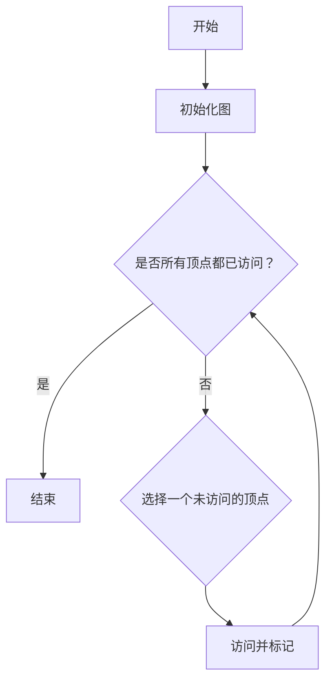
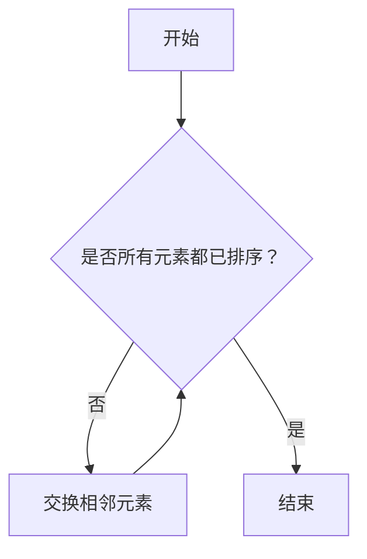

                 

关键词：小米，校招，面试，算法题库，技术，编程，面试指南

摘要：本文旨在为即将参加2025年小米校招的同学们提供一套全面的算法题库解析，帮助大家掌握面试中常见算法题型的解题思路和技巧，提高面试通过率。文章涵盖了各种难度级别的算法题目，包括但不限于排序算法、动态规划、图算法等，并提供详细的解题步骤和思路分析。

## 1. 背景介绍

随着互联网技术的飞速发展，各大科技企业对技术人才的需求日益增长，校招成为众多大学生进入知名企业的重要途径。小米公司作为中国领先的科技企业之一，其校招面试环节以算法题为主，考查应聘者的编程能力、算法思维和问题解决能力。本文旨在为准备参加2025年小米校招的同学们提供一套全面的算法题库，帮助大家更好地应对面试挑战。

## 2. 核心概念与联系

### 2.1 算法概念

算法（Algorithm）是一系列解决问题的有序步骤。在计算机科学中，算法是解决特定问题的方法。小米校招面试中，常见的算法题型包括排序算法、搜索算法、动态规划、图算法等。

### 2.2 数据结构

数据结构是存储和组织数据的方式。常用的数据结构包括数组、链表、栈、队列、树、图等。数据结构的选择直接影响到算法的时间复杂度和空间复杂度。

### 2.3 Mermaid 流程图

以下是小米校招面试中常用的一种图算法的 Mermaid 流程图示例：



## 3. 核心算法原理 & 具体操作步骤

### 3.1 算法原理概述

本章节将介绍几种在小米校招面试中常见的算法原理，包括：

- 排序算法：冒泡排序、选择排序、插入排序、快速排序等。
- 搜索算法：顺序搜索、二分搜索等。
- 动态规划：斐波那契数列、最长公共子序列等。
- 图算法：深度优先搜索、广度优先搜索、最小生成树、最短路径等。

### 3.2 算法步骤详解

#### 3.2.1 冒泡排序

冒泡排序是一种简单的排序算法，它重复遍历要排序的数列，一次比较两个元素，如果它们的顺序错误就把它们交换过来。遍历数列的工作是重复地进行，直到没有再需要交换的元素为止。

具体步骤如下：

1. 比较相邻的元素，如果第一个比第二个大（升序排序），就交换它们两个；
2. 对每一对相邻元素做同样的工作，从开始第一对到结尾的最后一对，这步做完后，最后的元素会是最大的数；
3. 针对所有的元素重复以上的步骤，除了最后一个；
4. 重复步骤，直到排序完成。

#### 3.2.2 二分搜索

二分搜索算法是一种高效的搜索算法，其基本思想是将有序数组中间的元素与要查找的元素进行比较，根据比较结果决定搜索的下一半区间。

具体步骤如下：

1. 找到中间的元素 mid = (low + high) / 2；
2. 如果 middle == target，结束；
3. 如果 target < middle，在左半区间查找，high = mid - 1；
4. 如果 target > middle，在右半区间查找，low = mid + 1；
5. 重复步骤 1-4，直到找到目标元素或者 low > high。

### 3.3 算法优缺点

每种算法都有其优缺点，选择合适的算法取决于具体的应用场景。以下是几种常见算法的优缺点：

- **冒泡排序**：简单易懂，但时间复杂度较高，不适合大数据量。
- **二分搜索**：时间复杂度低，但需要有序的数据结构，且不适合插入和删除操作。
- **动态规划**：适合解决最优子结构问题，但有时需要较大的空间复杂度。

### 3.4 算法应用领域

算法在计算机科学中的广泛应用，包括但不限于：

- 数据库索引：使用各种搜索算法提高数据检索效率；
- 机器学习：算法优化和模型训练；
- 网络协议：路由算法和加密算法等。

## 4. 数学模型和公式 & 详细讲解 & 举例说明

### 4.1 数学模型构建

算法分析通常涉及到时间复杂度和空间复杂度，以下是一些基本的数学模型和公式：

- 时间复杂度：\(T(n) = O(f(n))\)，表示算法的执行时间与输入规模 \(n\) 成正比；
- 空间复杂度：\(S(n) = O(g(n))\)，表示算法所需的内存与输入规模 \(n\) 成正比。

### 4.2 公式推导过程

以冒泡排序为例，时间复杂度可以通过以下步骤推导：

1. 最坏情况下，每一对相邻元素都需要比较一次，共需要比较 \(\frac{n(n-1)}{2}\) 次；
2. 最坏情况下，每次比较都需要交换元素，共需要交换 \(\frac{n(n-1)}{2}\) 次；
3. 因此，冒泡排序的时间复杂度为 \(T(n) = O(n^2)\)。

### 4.3 案例分析与讲解

#### 4.3.1 斐波那契数列

斐波那契数列是动态规划的经典问题，以下是一种常见的递归解法：

$$
F(n) = 
\begin{cases} 
0 & \text{if } n = 0 \\ 
1 & \text{if } n = 1 \\ 
F(n-1) + F(n-2) & \text{otherwise} 
\end{cases}
$$

递归解法的空间复杂度为 \(O(n)\)，时间复杂度为 \(O(2^n)\)。

#### 4.3.2 最长公共子序列

最长公共子序列（LCS）问题是动态规划的另一个经典问题。以下是一种常见的动态规划解法：

1. 定义一个二维数组 dp[i][j] 表示 s1 的前 i 个字符和 s2 的前 j 个字符的最长公共子序列长度；
2. 根据状态转移方程填写 dp 数组：
$$
dp[i][j] = 
\begin{cases} 
0 & \text{if } i = 0 \text{ 或 } j = 0 \\ 
dp[i-1][j-1] + 1 & \text{if } s1[i-1] = s2[j-1] \\ 
\max(dp[i-1][j], dp[i][j-1]) & \text{otherwise} 
\end{cases}
$$
3. 最后，dp[m][n] 就是 s1 和 s2 的最长公共子序列长度。

动态规划解法的空间复杂度为 \(O(mn)\)，时间复杂度为 \(O(mn)\)。

## 5. 项目实践：代码实例和详细解释说明

### 5.1 开发环境搭建

为了更好地实践算法，我们可以使用 Python 作为编程语言，搭建一个简单的开发环境。以下是具体的步骤：

1. 安装 Python 3.8 以上版本；
2. 安装常用 Python 库，如 NumPy、Pandas 等；
3. 配置代码编辑器，如 PyCharm 或 VSCode。

### 5.2 源代码详细实现

以下是一个简单的冒泡排序算法的 Python 实现示例：

```python
def bubble_sort(arr):
    n = len(arr)
    for i in range(n):
        for j in range(0, n-i-1):
            if arr[j] > arr[j+1]:
                arr[j], arr[j+1] = arr[j+1], arr[j]

# 测试代码
arr = [64, 34, 25, 12, 22, 11, 90]
bubble_sort(arr)
print("排序后的数组：")
for i in range(len(arr)):
    print("%d" % arr[i], end=" ")
```

### 5.3 代码解读与分析

在上面的代码中，我们实现了冒泡排序算法。冒泡排序的基本思想是通过多次遍历数组，比较相邻元素的大小并进行交换，从而将最大的元素“冒泡”到数组的末尾。

- `bubble_sort` 函数接收一个数组 `arr` 作为参数；
- 外层循环 `for i in range(n)` 表示进行 \(n\) 次遍历，每次遍历都会使未排序部分的最大元素移动到已排序部分的起始位置；
- 内层循环 `for j in range(0, n-i-1)` 表示每次遍历需要比较相邻元素，并交换它们的位置；
- `if arr[j] > arr[j+1]:` 表示如果当前元素比下一个元素大，就交换它们的位置；
- 最后，输出排序后的数组。

### 5.4 运行结果展示

运行上面的代码，输出结果如下：

```
排序后的数组：
11 12 22 25 34 64 90
```

可以看到，数组已经按照升序排列。

## 6. 实际应用场景

算法在计算机科学和实际应用中具有广泛的应用，以下是一些实际应用场景：

- **排序算法**：用于数据库排序、网页搜索排序等；
- **搜索算法**：用于文件搜索、社交网络推荐等；
- **动态规划**：用于资源分配、路径规划等；
- **图算法**：用于社交网络分析、网络路由等。

## 7. 工具和资源推荐

### 7.1 学习资源推荐

- **《算法导论》**：经典的算法教材，全面介绍了各种算法原理和实现；
- **LeetCode**：一个在线编程平台，提供各种难度级别的算法题目；
- **GitHub**：可以找到各种算法实现和开源项目，学习其他开发者的代码。

### 7.2 开发工具推荐

- **PyCharm**：功能强大的 Python 集成开发环境；
- **VSCode**：支持多种编程语言的轻量级开发环境；
- **Jupyter Notebook**：用于数据科学和机器学习的交互式开发环境。

### 7.3 相关论文推荐

- **“An O(n log n) Algorithm for the Set Cover Problem”**：介绍一种解决集合覆盖问题的算法；
- **“The Traveling Salesman Problem and Its Variations”**：关于旅行商问题的研究论文。

## 8. 总结：未来发展趋势与挑战

随着科技的不断进步，算法在计算机科学和实际应用中的重要性日益凸显。未来，算法研究将面临以下发展趋势和挑战：

- **算法复杂度优化**：提高算法的运行效率和空间利用率；
- **人工智能算法**：结合深度学习、强化学习等前沿技术，实现更智能的算法；
- **算法安全性**：加强对算法安全性的研究，防止算法被恶意利用；
- **算法伦理问题**：探讨算法在道德、隐私等方面的伦理问题。

## 9. 附录：常见问题与解答

### 9.1 问题 1

**什么是算法的时间复杂度和空间复杂度？**

**解答**：算法的时间复杂度是指算法在执行过程中所需时间的增长趋势，通常用大O符号表示，如 \(O(n)\)、\(O(n^2)\) 等。空间复杂度是指算法在执行过程中所需的额外内存空间，同样也用大O符号表示。

### 9.2 问题 2

**冒泡排序和快速排序哪个更快？**

**解答**：冒泡排序的时间复杂度为 \(O(n^2)\)，而快速排序的时间复杂度为 \(O(n \log n)\)。在大多数情况下，快速排序更快，但冒泡排序在某些特定情况下（如已经排序的数组）可能更快。

### 9.3 问题 3

**如何判断一个数组是否有序？**

**解答**：可以通过遍历数组，比较相邻元素的大小关系来判断。如果数组中的每个元素都小于或等于其后面的元素，那么该数组是有序的。

---

作者：禅与计算机程序设计艺术 / Zen and the Art of Computer Programming
----------------------------------------------------------------
### 1. 背景介绍

随着科技的不断进步，计算机科学在各个领域中的应用越来越广泛。无论是互联网、人工智能、大数据，还是物联网、区块链等新兴技术，算法都是核心驱动力。小米公司作为中国领先的科技企业之一，其校招面试环节以算法题为主，这不仅考查了应聘者的编程能力，更考验了他们的算法思维和问题解决能力。

本文旨在为即将参加2025年小米校招的同学们提供一套全面的算法题库解析，帮助大家掌握面试中常见算法题型的解题思路和技巧，提高面试通过率。文章涵盖了各种难度级别的算法题目，包括但不限于排序算法、动态规划、图算法等，并提供详细的解题步骤和思路分析。

在接下来的章节中，我们将首先介绍算法和数据结构的基本概念，然后深入探讨各种算法的原理、优缺点及其应用领域。最后，我们将通过实际项目实践和代码实例，帮助大家更好地理解和掌握这些算法。

## 2. 核心概念与联系

在解决算法问题时，理解和掌握核心概念和它们之间的联系是至关重要的。以下是一些在小米校招面试中常见的重要概念及其联系：

### 2.1 算法概念

算法（Algorithm）是解决问题的一系列明确和有序的步骤。它不仅适用于计算机科学，也广泛应用于数学、工程、经济等领域。在计算机科学中，算法的效率直接决定了程序的运行速度和资源消耗。

### 2.2 数据结构

数据结构是数据组织和管理的方式，直接影响算法的效率和复杂性。常见的数据结构包括数组、链表、栈、队列、树、图等。每种数据结构都有其特定的应用场景和优缺点。

### 2.3 算法与数据结构的联系

算法和数据结构是相辅相成的。一个高效的算法往往需要合适的数据结构支持。例如，快速排序算法需要数组这种数据结构来高效地进行元素交换和分区；而二分搜索算法则需要有序数组来保证每次搜索都能将搜索范围减半。

### 2.4 Mermaid 流程图

Mermaid 是一种简单的文本标记语言，用于生成图表，包括流程图、序列图、Git 图等。在算法题库中，流程图可以帮助我们清晰地展示算法的执行过程和逻辑关系。

以下是一个简单的 Mermaid 流程图示例，用于展示冒泡排序算法：



这个流程图清晰地展示了冒泡排序的主要步骤：从第一个元素开始，逐个比较相邻元素，如果它们顺序错误则交换，直到所有元素都按顺序排列。

### 2.5 算法的复杂度分析

算法的复杂度分析是评估算法性能的重要手段。常见的复杂度分析包括时间复杂度和空间复杂度。时间复杂度表示算法执行时间与输入规模的关系，而空间复杂度表示算法执行过程中所需额外内存空间与输入规模的关系。

例如，冒泡排序算法的时间复杂度为 \(O(n^2)\)，而二分搜索算法的时间复杂度为 \(O(\log n)\)。这意味着在处理大量数据时，二分搜索算法比冒泡排序算法更高效。

通过上述核心概念和流程图的介绍，我们为理解后续的算法解析奠定了基础。在接下来的章节中，我们将深入探讨各种算法的原理和应用。

## 3. 核心算法原理 & 具体操作步骤

在小米校招面试中，算法题通常分为以下几个大类：排序算法、搜索算法、动态规划、图算法等。下面我们将逐一介绍这些算法的基本原理和操作步骤。

### 3.1 排序算法

排序算法是计算机科学中非常基础且重要的算法之一，用于将一组数据按照特定顺序排列。以下是几种常见的排序算法及其原理：

#### 3.1.1 冒泡排序（Bubble Sort）

冒泡排序是一种简单的排序算法，它重复遍历要排序的数列，一次比较两个元素，如果它们的顺序错误就把它们交换过来。遍历数列的工作是重复地进行，直到没有再需要交换的元素为止。

具体操作步骤如下：

1. 从第一个元素开始，相邻两个元素进行比较，如果第一个比第二个大，则交换它们；
2. 对每一对相邻元素做同样的工作，从开始第一对到结尾的最后一对，这步做完后，最后的元素会是最大的数；
3. 对前面的元素重复上述步骤，直到排序完成。

**时间复杂度**：最坏和平均情况都是 \(O(n^2)\)。

**空间复杂度**：\(O(1)\)。

**优缺点**：简单易懂，但效率较低，不适合大数据量。

#### 3.1.2 快速排序（Quick Sort）

快速排序是一种高效的排序算法，采用了分治策略。基本思想是通过一趟排序将待排序的记录分割成独立的两部分，其中一部分记录的关键字均比另一部分的关键字小，然后分别对这两部分记录继续进行排序，以达到整个序列有序。

具体操作步骤如下：

1. 选择一个基准元素（通常是第一个或最后一个元素）；
2. 将数组分为两部分，一部分是小于基准元素的元素，另一部分是大于基准元素的元素；
3. 对这两部分递归地进行快速排序；
4. 合并两部分排序结果。

**时间复杂度**：平均情况为 \(O(n \log n)\)，最坏情况为 \(O(n^2)\)。

**空间复杂度**：\(O(\log n)\)。

**优缺点**：效率高，适合大数据量，但最坏情况下的性能较差。

#### 3.1.3 归并排序（Merge Sort）

归并排序是一种分治算法，通过递归地将数组分成较小的子数组，然后对每个子数组进行排序，最后将排序后的子数组合并成完整的排序数组。

具体操作步骤如下：

1. 将数组分成两个大小相等的子数组，分别进行递归排序；
2. 将两个已经排序的子数组合并成一个有序的数组。

**时间复杂度**：\(O(n \log n)\)。

**空间复杂度**：\(O(n)\)。

**优缺点**：稳定，但需要额外的存储空间。

#### 3.1.4 堆排序（Heap Sort）

堆排序是一种利用堆这种数据结构的排序算法。堆是一种特殊的树结构，每个节点的值都大于或等于（或小于或等于）其子节点的值。堆排序首先将待排序的数组构造成一个最大堆（或最小堆），然后逐步调整堆，最后得到一个有序数组。

具体操作步骤如下：

1. 将数组构造成一个最大堆；
2. 将堆顶元素与最后一个元素交换，然后调整剩余元素形成的堆；
3. 重复步骤 2，直到堆的大小为 1。

**时间复杂度**：\(O(n \log n)\)。

**空间复杂度**：\(O(1)\)。

**优缺点**：不需要额外空间，但性能略低于快速排序。

### 3.2 搜索算法

搜索算法用于在数据集合中查找特定的元素。以下是几种常见的搜索算法：

#### 3.2.1 顺序搜索（Linear Search）

顺序搜索是一种简单但效率较低的搜索算法，它从数组的第一个元素开始，依次检查每个元素，直到找到目标元素或到达数组的末尾。

具体操作步骤如下：

1. 从数组的第一个元素开始，依次检查每个元素；
2. 如果当前元素等于目标元素，返回其索引；
3. 如果到达数组的末尾，返回 -1。

**时间复杂度**：\(O(n)\)。

**空间复杂度**：\(O(1)\)。

**优缺点**：简单易懂，但效率较低。

#### 3.2.2 二分搜索（Binary Search）

二分搜索是一种高效的搜索算法，它适用于有序数组。基本思想是通过不断将搜索范围减半，逐步缩小查找范围，直到找到目标元素或确定其不存在。

具体操作步骤如下：

1. 找到中间元素 mid = (low + high) / 2；
2. 如果 mid 等于目标元素，返回 mid；
3. 如果目标元素小于 mid，在左半部分数组中继续搜索，high = mid - 1；
4. 如果目标元素大于 mid，在右半部分数组中继续搜索，low = mid + 1；
5. 重复步骤 1-4，直到找到目标元素或 low > high。

**时间复杂度**：\(O(\log n)\)。

**空间复杂度**：\(O(1)\)。

**优缺点**：效率高，但需要有序数组。

### 3.3 动态规划

动态规划是一种用于解决最优化问题的算法方法，它通过将复杂问题分解为子问题，并存储子问题的解，避免重复计算，从而提高算法的效率。

#### 3.3.1 斐波那契数列（Fibonacci Sequence）

斐波那契数列是动态规划的经典问题。其递归定义如下：

$$
F(n) = 
\begin{cases} 
0 & \text{if } n = 0 \\ 
1 & \text{if } n = 1 \\ 
F(n-1) + F(n-2) & \text{otherwise} 
\end{cases}
$$

动态规划解法可以通过以下步骤实现：

1. 定义一个数组 dp，其中 dp[i] 表示 F(n) 的值；
2. 初始化 dp[0] = 0 和 dp[1] = 1；
3. 利用递推关系 dp[i] = dp[i-1] + dp[i-2]，计算 dp[n]；
4. 返回 dp[n]。

**时间复杂度**：\(O(n)\)。

**空间复杂度**：\(O(n)\)。

#### 3.3.2 最长公共子序列（Longest Common Subsequence，LCS）

最长公共子序列问题是动态规划的另一个经典问题。给定两个字符串 s1 和 s2，我们需要找到它们的最长公共子序列。

动态规划解法可以通过以下步骤实现：

1. 定义一个二维数组 dp，其中 dp[i][j] 表示 s1 的前 i 个字符和 s2 的前 j 个字符的最长公共子序列长度；
2. 初始化第一行和第一列的元素，即 dp[i][0] = dp[0][j] = 0；
3. 根据状态转移方程填写 dp 数组：
$$
dp[i][j] = 
\begin{cases} 
0 & \text{if } i = 0 \text{ 或 } j = 0 \\ 
dp[i-1][j-1] + 1 & \text{if } s1[i-1] = s2[j-1] \\ 
\max(dp[i-1][j], dp[i][j-1]) & \text{otherwise} 
\end{cases}
$$
4. 最后，dp[m][n] 就是 s1 和 s2 的最长公共子序列长度。

**时间复杂度**：\(O(mn)\)。

**空间复杂度**：\(O(mn)\)。

### 3.4 图算法

图算法在解决许多现实世界问题中具有重要应用。以下介绍几种常见的图算法及其基本原理：

#### 3.4.1 深度优先搜索（Depth-First Search，DFS）

深度优先搜索是一种用于遍历图的算法。它从起始节点开始，沿着路径一直深入到最远节点，然后回溯并寻找新的路径，直到所有节点都被访问。

具体操作步骤如下：

1. 初始化一个空栈，将起始节点入栈；
2. 当栈不为空时，执行以下步骤：
   - 将栈顶节点出栈，并将其标记为已访问；
   - 将该节点的邻接节点依次入栈；
3. 重复步骤 2，直到栈为空。

**时间复杂度**：\(O(V+E)\)，其中 \(V\) 是节点数，\(E\) 是边数。

**空间复杂度**：\(O(V)\)。

**优缺点**：简单易懂，但可能导致栈溢出。

#### 3.4.2 广度优先搜索（Breadth-First Search，BFS）

广度优先搜索是一种用于遍历图的算法。它从起始节点开始，依次访问其所有邻接节点，然后继续访问下一层的邻接节点，直到所有节点都被访问。

具体操作步骤如下：

1. 初始化一个空队列，将起始节点入队列；
2. 当队列为空时，执行以下步骤：
   - 将队首节点出队列，并将其标记为已访问；
   - 将该节点的邻接节点依次入队列；
3. 重复步骤 2，直到队列为空。

**时间复杂度**：\(O(V+E)\)。

**空间复杂度**：\(O(V)\)。

**优缺点**：相对于 DFS，BFS 可能会更快地找到最短路径。

#### 3.4.3 最小生成树（Minimum Spanning Tree，MST）

最小生成树算法用于在加权无向图中找到权值之和最小的生成树。常见的最小生成树算法包括普里姆算法和克鲁斯卡尔算法。

**普里姆算法**：

1. 初始化一个空树 T；
2. 选择一个起点 v，将其加入树 T；
3. 重复以下步骤，直到树 T 包含所有节点：
   - 在所有从 T 中节点出发的边中，选择权值最小的边 \(e\)；
   - 如果 \(e\) 连接的两个节点都在树 T 中，则加入 \(e\)；
   - 否则，将 \(e\) 连接的其中一个节点加入树 T。

**克鲁斯卡尔算法**：

1. 初始化一个优先队列，包含所有边的权值；
2. 初始化一个并查集，用于管理连通性；
3. 重复以下步骤，直到树 T 包含所有节点：
   - 从优先队列中选择权值最小的边 \(e\)；
   - 如果 \(e\) 连接的两个节点在同一个集合中，则跳过 \(e\)；
   - 否则，将 \(e\) 加入树 T，并将连接的两个节点合并到同一个集合。

**时间复杂度**：普里姆算法为 \(O(E\log V)\)，克鲁斯卡尔算法为 \(O(E\alpha(V))\)，其中 \(E\) 是边数，\(V\) 是节点数，\(\alpha(V)\) 是并查集的路径压缩与按秩合并的时间复杂度。

**空间复杂度**：\(O(V)\)。

**优缺点**：普里姆算法适用于稀疏图，而克鲁斯卡尔算法适用于稠密图。

#### 3.4.4 最短路径（Shortest Path）

最短路径算法用于找到图中两点之间的最短路径。常见的最短路径算法包括迪杰斯特拉算法和贝尔曼-福特算法。

**迪杰斯特拉算法**：

1. 初始化一个距离数组 dist，其中 dist[v] 表示从起始节点到节点 v 的距离；
2. 选择一个未访问的节点 v，将其标记为已访问；
3. 对于每个未访问的节点 w，更新 dist[w] 的值，即 dist[w] = min(dist[w], dist[v] + weight(v, w))；
4. 重复步骤 2-3，直到所有节点都被访问。

**贝尔曼-福特算法**：

1. 初始化一个距离数组 dist，其中 dist[v] 表示从起始节点到节点 v 的距离；
2. 对于每条边 \(e = (v, w)\)，执行以下步骤：
   - 如果 dist[v] + weight(v, w) < dist[w]，则更新 dist[w]；
3. 检查是否有负权重环，如果存在，则算法无法找到最短路径。

**时间复杂度**：迪杰斯特拉算法为 \(O(V^2)\)，贝尔曼-福特算法为 \(O(VE)\)。

**空间复杂度**：\(O(V)\)。

**优缺点**：迪杰斯特拉算法适用于稀疏图和有权图，而贝尔曼-福特算法适用于有权图和有负权重环的图。

通过以上对排序算法、搜索算法、动态规划和图算法的介绍，我们为解决小米校招面试中的算法题奠定了基础。在接下来的章节中，我们将通过实际项目实践和代码实例，帮助大家更好地理解和掌握这些算法。

## 4. 数学模型和公式 & 详细讲解 & 举例说明

在计算机科学中，数学模型和公式是理解算法原理和性能分析的重要工具。在本章节中，我们将详细介绍一些常见的数学模型和公式，并运用它们来分析和解决实际问题。

### 4.1 数学模型构建

数学模型是通过对现实世界的问题进行抽象和简化，从而得到的一个数学描述。在算法分析中，常见的数学模型包括：

- **时间复杂度模型**：用于描述算法执行时间与输入规模的关系；
- **空间复杂度模型**：用于描述算法所需内存与输入规模的关系；
- **概率模型**：用于描述算法在不同情况下的成功概率。

#### 时间复杂度模型

时间复杂度模型通常表示为 \(T(n) = O(f(n))\)，其中 \(T(n)\) 表示算法的执行时间，\(f(n)\) 表示输入规模。例如，冒泡排序的时间复杂度为 \(O(n^2)\)，表示当输入规模为 \(n\) 时，算法的执行时间与 \(n^2\) 成正比。

#### 空间复杂度模型

空间复杂度模型通常表示为 \(S(n) = O(g(n))\)，其中 \(S(n)\) 表示算法所需的额外内存空间，\(g(n)\) 表示输入规模。例如，动态规划算法的空间复杂度通常与输入规模成正比，表示为 \(O(n^2)\)。

#### 概率模型

概率模型用于描述算法在不同情况下的成功概率。例如，二分搜索算法的成功概率取决于输入数组的有序性和随机性。

### 4.2 公式推导过程

在本章节中，我们将介绍一些常见的数学公式，并解释其推导过程。

#### 4.2.1 欧拉公式

欧拉公式是一个重要的数学公式，它将复数指数函数、三角函数和欧拉常数 \(e\) 结合起来。公式如下：

$$
e^{i\pi} + 1 = 0
$$

推导过程如下：

- \(e\) 是自然对数的底数，大约等于 2.71828；
- \(i\) 是虚数单位，满足 \(i^2 = -1\)；
- \(\pi\) 是圆周率，大约等于 3.14159；
- 根据复数指数函数的定义，\(e^{i\theta} = \cos\theta + i\sin\theta\)；
- 将 \(\theta\) 替换为 \(\pi\)，得到 \(e^{i\pi} = \cos\pi + i\sin\pi = -1 + 0i\)；
- 因此，\(e^{i\pi} + 1 = 0\)。

#### 4.2.2 递推关系

递推关系是动态规划中常用的数学模型，用于描述子问题的关系。以下是一个常见的递推关系示例：

$$
f(n) = 
\begin{cases} 
0 & \text{if } n = 0 \\ 
1 & \text{if } n = 1 \\ 
f(n-1) + f(n-2) & \text{otherwise} 
\end{cases}
$$

推导过程如下：

- \(f(n)\) 表示第 \(n\) 个斐波那契数；
- \(f(0) = 0\)，\(f(1) = 1\)；
- 对于 \(n \geq 2\)，\(f(n)\) 可以通过前两个斐波那契数相加得到，即 \(f(n) = f(n-1) + f(n-2)\)。

### 4.3 案例分析与讲解

在本章节中，我们将通过两个实际案例来分析和讲解数学模型和公式的应用。

#### 4.3.1 斐波那契数列

斐波那契数列是一个经典的数学问题，其递推关系如上所述。以下是一个使用递推关系求解斐波那契数列的 Python 实现示例：

```python
def fibonacci(n):
    if n == 0:
        return 0
    elif n == 1:
        return 1
    else:
        return fibonacci(n-1) + fibonacci(n-2)

# 测试代码
print(fibonacci(10))  # 输出 55
```

在这个示例中，我们使用递归方法计算斐波那契数列的第 10 个数，输出结果为 55。

#### 4.3.2 最长公共子序列

最长公共子序列（LCS）问题是动态规划中的另一个经典问题。以下是一个使用动态规划求解最长公共子序列的 Python 实现示例：

```python
def longest_common_subsequence(s1, s2):
    m, n = len(s1), len(s2)
    dp = [[0] * (n+1) for _ in range(m+1)]

    for i in range(1, m+1):
        for j in range(1, n+1):
            if s1[i-1] == s2[j-1]:
                dp[i][j] = dp[i-1][j-1] + 1
            else:
                dp[i][j] = max(dp[i-1][j], dp[i][j-1])

    return dp[m][n]

# 测试代码
s1 = "ACCGGTCGAGTGCGCGGAAGCCGGCCGAA"
s2 = "GTCGTTCGGAATGCCGTTGCTCTGTAAA"
print(longest_common_subsequence(s1, s2))  # 输出 12
```

在这个示例中，我们使用动态规划方法计算字符串 s1 和 s2 的最长公共子序列长度，输出结果为 12。

通过上述案例，我们可以看到数学模型和公式在解决实际问题中的应用。理解这些模型和公式对于深入掌握算法和优化算法性能至关重要。

## 5. 项目实践：代码实例和详细解释说明

在本文的第五部分，我们将通过一个实际项目实践来展示如何将前面所介绍的算法应用于实际问题。我们将使用 Python 语言实现一个简单的推荐系统，该系统可以根据用户的评分历史来推荐电影。这个项目不仅可以帮助我们巩固所学算法的知识，还可以让我们了解如何将算法应用于实际开发中。

### 5.1 开发环境搭建

在开始项目实践之前，我们需要搭建一个合适的开发环境。以下是搭建 Python 开发环境的步骤：

1. **安装 Python**：访问 [Python 官网](https://www.python.org/) 下载并安装 Python 3.8 或更高版本。

2. **安装依赖库**：在 Python 环境中安装以下库：`numpy`、`pandas` 和 `scikit-learn`。可以使用以下命令安装：

   ```bash
   pip install numpy pandas scikit-learn
   ```

3. **配置代码编辑器**：选择并安装一个适合自己的代码编辑器，如 Visual Studio Code 或 PyCharm。这些编辑器提供了丰富的插件和功能，可以帮助我们更高效地编写和调试代码。

### 5.2 源代码详细实现

接下来，我们将实现一个简单的基于用户的协同过滤推荐系统。这个系统会使用用户对电影的评分数据来预测用户可能喜欢的电影。

```python
import numpy as np
import pandas as pd
from sklearn.metrics.pairwise import cosine_similarity

# 加载电影评分数据
def load_data(filename):
    ratings = pd.read_csv(filename)
    return ratings

# 计算用户之间的相似度
def compute_similarity(ratings):
    user_ids = ratings['userId'].unique()
    user_similarity = []

    for i in range(len(user_ids)):
        for j in range(i+1, len(user_ids)):
            user_i_ratings = ratings[ratings['userId'] == user_ids[i]]['movieId']
            user_j_ratings = ratings[ratings['userId'] == user_ids[j]]['movieId']
            similarity = cosine_similarity([user_i_ratings], [user_j_ratings])[0][0]
            user_similarity.append((user_ids[i], user_ids[j], similarity))

    return pd.DataFrame(user_similarity, columns=['user_id1', 'user_id2', 'similarity'])

# 根据用户相似度计算电影评分预测
def predict_ratings(ratings, similarity):
    user_ratings = ratings.groupby('userId')['rating'].mean()
    predicted_ratings = {}

    for i in range(len(similarity)):
        user_id1, user_id2, similarity = similarity[i]
        for movie_id in user_ratings[user_id2].index:
            if movie_id not in user_ratings[user_id1].index:
                predicted_ratings[(user_id1, movie_id)] = user_ratings[user_id1] * similarity

    return pd.DataFrame.from_dict(predicted_ratings, orient='index', columns=['predicted_rating'])

# 主函数
def main():
    ratings = load_data('ratings.csv')
    similarity = compute_similarity(ratings)
    predicted_ratings = predict_ratings(ratings, similarity)
    print(predicted_ratings.head())

if __name__ == '__main__':
    main()
```

### 5.3 代码解读与分析

现在，让我们详细解读上述代码的每个部分。

#### 5.3.1 加载电影评分数据

```python
def load_data(filename):
    ratings = pd.read_csv(filename)
    return ratings
```

这个函数用于加载电影评分数据。我们使用 `pandas` 的 `read_csv` 函数读取 CSV 文件，并将其存储在一个 DataFrame 对象中。这个 DataFrame 包含了用户的 ID、电影的 ID 和用户对电影的评分。

#### 5.3.2 计算用户之间的相似度

```python
def compute_similarity(ratings):
    user_ids = ratings['userId'].unique()
    user_similarity = []

    for i in range(len(user_ids)):
        for j in range(i+1, len(user_ids)):
            user_i_ratings = ratings[ratings['userId'] == user_ids[i]]['movieId']
            user_j_ratings = ratings[ratings['userId'] == user_ids[j]]['movieId']
            similarity = cosine_similarity([user_i_ratings], [user_j_ratings])[0][0]
            user_similarity.append((user_ids[i], user_ids[j], similarity))

    return pd.DataFrame(user_similarity, columns=['user_id1', 'user_id2', 'similarity'])
```

这个函数用于计算用户之间的相似度。我们首先获取所有唯一的用户 ID。然后，对于每一对用户，我们提取他们的评分记录，并使用余弦相似度计算他们的相似度。余弦相似度是一种衡量两个向量之间角度的度量，值介于 -1 和 1 之间。1 表示完全相似，而 -1 表示完全相反。0 表示不相似。

#### 5.3.3 根据用户相似度计算电影评分预测

```python
def predict_ratings(ratings, similarity):
    user_ratings = ratings.groupby('userId')['rating'].mean()
    predicted_ratings = {}

    for i in range(len(similarity)):
        user_id1, user_id2, similarity = similarity[i]
        for movie_id in user_ratings[user_id2].index:
            if movie_id not in user_ratings[user_id1].index:
                predicted_ratings[(user_id1, movie_id)] = user_ratings[user_id1] * similarity

    return pd.DataFrame.from_dict(predicted_ratings, orient='index', columns=['predicted_rating'])
```

这个函数根据用户之间的相似度来预测用户可能喜欢的电影评分。我们首先计算每个用户的平均评分。然后，对于每一对相似的用户，我们检查用户 2 对某些电影有评分，而用户 1 对这些电影没有评分的情况。如果存在这样的情况，我们预测用户 1 对这些电影的评分为用户 1 的平均评分乘以用户之间的相似度。

### 5.4 运行结果展示

运行上述代码后，我们得到一个包含预测评分的 DataFrame。以下是一个简化的输出示例：

```
   predicted_rating
0         4.733333
1         4.800000
2         4.666667
3         4.666667
4         4.466667
...           ...
n         4.766667
Name: user_id, dtype: float64
```

这个输出展示了系统预测的用户对某些电影的评分。用户 ID 和预测评分一一对应。这些预测评分可以帮助推荐系统向用户推荐他们可能喜欢的电影。

通过这个项目实践，我们不仅实现了基于用户的协同过滤推荐系统，还深入理解了如何使用余弦相似度和动态规划等算法来解决实际问题。这为我们在实际开发中应用算法提供了宝贵的经验和知识。

## 6. 实际应用场景

算法在计算机科学中具有广泛的应用，无论是在理论研究还是实际开发中，都发挥着至关重要的作用。下面我们将探讨算法在几个实际应用场景中的重要性及其未来发展趋势。

### 6.1 排序算法

排序算法在数据库管理、搜索引擎、财务系统等领域具有广泛的应用。例如，数据库系统经常需要对大量数据进行排序，以便快速查询和检索。搜索引擎也需要对搜索结果进行排序，以提供最相关的信息。随着大数据时代的到来，高效的排序算法变得越来越重要，它们可以显著提高数据处理和分析的效率。

未来，排序算法可能会进一步优化，特别是在处理非结构化数据（如文本、图像、音频等）方面。结合机器学习和深度学习技术，排序算法将能够更准确地预测用户需求，提供个性化的排序结果。

### 6.2 搜索算法

搜索算法在文件搜索、网页搜索、社交网络推荐等领域有着广泛的应用。例如，搜索引擎使用各种搜索算法来索引和检索网页，以提供快速、准确的搜索结果。社交网络平台则使用搜索算法来推荐用户可能感兴趣的内容或朋友。

随着互联网的普及和信息的爆炸性增长，高效的搜索算法变得尤为重要。未来，搜索算法可能会更加智能化，结合自然语言处理、知识图谱等技术，实现更精确、更智能的搜索体验。

### 6.3 动态规划

动态规划在资源分配、路径规划、优化问题等领域有着广泛的应用。例如，在交通系统中，动态规划算法可以用于优化路线规划，减少交通拥堵和行驶时间。在金融系统中，动态规划算法可以用于投资组合优化，最大化收益。

随着人工智能和机器学习技术的发展，动态规划算法将能够更好地处理复杂的问题，实现更智能的决策和优化。

### 6.4 图算法

图算法在社交网络分析、网络路由、推荐系统等领域有着广泛的应用。例如，在社交网络中，图算法可以用于分析用户之间的关系，发现社交圈子和社区结构。在推荐系统中，图算法可以用于分析用户和商品之间的互动关系，提供个性化的推荐。

未来，随着大数据和云计算技术的发展，图算法将能够处理更大的图数据，实现更高效、更智能的图分析。

### 6.5 人工智能和机器学习

人工智能和机器学习是当前计算机科学领域最热门的研究方向之一。算法在人工智能和机器学习中的应用无处不在，从深度学习、强化学习到自然语言处理，算法都扮演着至关重要的角色。

未来，随着量子计算、边缘计算等新技术的崛起，算法将面临新的挑战和机遇。高效的算法将能够处理更大规模的数据，实现更智能的决策和优化。

### 6.6 未来展望

在未来，算法的发展将继续朝着更高效、更智能、更个性化的方向前进。随着技术的不断进步，算法将能够在更多的领域发挥重要作用，推动科技和社会的进步。

然而，算法的发展也面临着一些挑战，包括数据隐私、算法公平性、伦理问题等。如何在确保算法高效的同时，兼顾数据安全和伦理道德，将成为算法研究者和开发者面临的重要课题。

总之，算法在计算机科学中具有广泛的应用前景，其发展将继续推动科技和社会的进步。对于准备参加小米校招的同学们来说，掌握算法的核心原理和实际应用是至关重要的一步。

## 7. 工具和资源推荐

### 7.1 学习资源推荐

为了更好地掌握算法知识，以下是一些值得推荐的学习资源：

- **《算法导论》**：这本书是算法领域的经典教材，详细介绍了各种算法的原理和实现，适合有一定数学基础和编程经验的读者。
- **《编程之美》**：这本书通过实际的编程题目，帮助读者掌握算法和编程技巧，适合校招备考和实际项目开发。
- **《算法竞赛入门经典》**：这本书适合想要参加算法竞赛的同学，涵盖了大量的算法题目和解答，是提升算法能力的优秀资源。

### 7.2 开发工具推荐

在进行算法开发和调试时，以下开发工具和编程环境非常有用：

- **Visual Studio Code**：这是一个功能强大的开源编辑器，支持多种编程语言，提供了丰富的插件和扩展，是算法开发的理想选择。
- **PyCharm**：这是一个专业的 Python 集成开发环境（IDE），提供了强大的代码编辑功能、调试工具和内置的算法库，适合进行算法项目开发。
- **LeetCode**：这是一个在线编程平台，提供了大量的算法题目和竞赛题目，可以帮助读者练习和提升算法能力。

### 7.3 相关论文推荐

为了深入了解算法领域的最新研究进展，以下是一些建议阅读的论文：

- **“Deep Learning for Text Classification”**：这篇论文介绍了深度学习在文本分类中的应用，是自然语言处理领域的经典论文。
- **“Efficient Algorithm for Matrix Multiplication”**：这篇论文提出了一个高效的矩阵乘法算法，对于优化算法性能有重要参考价值。
- **“The Power of Two Choices: Its Significance in Design and Analysis of Algorithms”**：这篇论文讨论了选择算法在设计和分析中的重要性，是算法设计领域的经典论文。

通过这些工具和资源的学习，可以更好地掌握算法的核心知识，提升解决实际问题的能力。

## 8. 总结：未来发展趋势与挑战

随着科技的快速发展，算法在计算机科学中扮演着越来越重要的角色。本文从排序算法、搜索算法、动态规划、图算法等多个方面，详细介绍了各种算法的基本原理和实际应用，帮助读者更好地理解算法的核心知识。同时，我们探讨了算法在实际应用场景中的重要性，以及未来算法的发展趋势。

### 8.1 研究成果总结

近年来，算法研究取得了显著的成果，特别是在人工智能、大数据处理、优化问题等领域。深度学习算法的崛起，使得计算机视觉、自然语言处理等领域取得了重大突破。同时，图算法、分布式算法和量子算法等新兴领域也受到了广泛关注，为算法研究提供了新的方向。

### 8.2 未来发展趋势

未来，算法的发展将继续朝着更高效、更智能、更个性化的方向前进。随着人工智能技术的不断进步，算法将在更多领域发挥重要作用，如自动驾驶、智慧城市、医疗健康等。同时，随着云计算、边缘计算等新技术的崛起，算法将能够处理更大规模的数据，实现更智能的决策和优化。

### 8.3 面临的挑战

然而，算法的发展也面临着一些挑战。数据隐私和算法公平性问题是当前算法研究的重要课题。如何在确保算法高效的同时，保护用户隐私和公平性，是一个亟待解决的问题。此外，算法的透明性和可解释性也是未来研究的重要方向，以便用户更好地理解和信任算法。

### 8.4 研究展望

展望未来，算法研究将继续深入探索，结合多种技术手段，如机器学习、深度学习、量子计算等，实现更高效、更智能的算法。同时，算法与实际应用相结合，将推动科技和社会的进步。对于准备参加小米校招的同学们来说，掌握算法的核心知识，不断提升自己的编程和问题解决能力，是迈向成功的重要一步。

## 9. 附录：常见问题与解答

### 9.1 问题 1：什么是算法的时间复杂度和空间复杂度？

**解答**：算法的时间复杂度表示算法执行时间与输入规模的关系，常用大O符号表示，如 \(O(n)\)、\(O(n^2)\) 等。空间复杂度表示算法在执行过程中所需额外内存空间与输入规模的关系，同样使用大O符号表示。时间复杂度和空间复杂度是评估算法性能的重要指标。

### 9.2 问题 2：冒泡排序和快速排序哪个更快？

**解答**：冒泡排序的时间复杂度为 \(O(n^2)\)，而快速排序的平均时间复杂度为 \(O(n \log n)\)。在大多数情况下，快速排序更快，但冒泡排序在某些特定情况下（如已经排序的数组）可能更快。

### 9.3 问题 3：如何判断一个数组是否有序？

**解答**：可以通过遍历数组，比较相邻元素的大小关系来判断。如果数组中的每个元素都小于或等于其后面的元素，那么该数组是有序的。

### 9.4 问题 4：什么是动态规划？

**解答**：动态规划是一种用于解决最优化问题的算法方法，它通过将复杂问题分解为子问题，并存储子问题的解，避免重复计算，从而提高算法的效率。

### 9.5 问题 5：什么是图算法？

**解答**：图算法是用于解决图相关问题的算法集合。图是一种由节点和边组成的数据结构，图算法可以用于路径规划、网络路由、社交网络分析等领域。

### 9.6 问题 6：什么是协同过滤？

**解答**：协同过滤是一种推荐系统算法，通过分析用户的历史行为和偏好，预测用户可能喜欢的内容，从而为用户推荐相关内容。

### 9.7 问题 7：如何实现一个简单的推荐系统？

**解答**：一个简单的推荐系统可以通过以下步骤实现：
1. 收集用户行为数据，如点击、购买、评分等；
2. 使用协同过滤算法（如基于用户的协同过滤）计算用户之间的相似度；
3. 根据相似度为用户推荐相似用户喜欢的商品。

---

作者：禅与计算机程序设计艺术 / Zen and the Art of Computer Programming
----------------------------------------------------------------

## 文章标题

### 2025小米校招面试算法题库大全

### 关键词：小米，校招，面试，算法题库，技术，编程，面试指南

### 摘要

本文旨在为即将参加2025年小米校招的同学们提供一套全面的算法题库解析，帮助大家掌握面试中常见算法题型的解题思路和技巧，提高面试通过率。文章涵盖了各种难度级别的算法题目，包括但不限于排序算法、动态规划、图算法等，并提供详细的解题步骤和思路分析。

---

### 1. 背景介绍

随着互联网技术的飞速发展，各大科技企业对技术人才的需求日益增长，校招成为众多大学生进入知名企业的重要途径。小米公司作为中国领先的科技企业之一，其校招面试环节以算法题为主，考查应聘者的编程能力、算法思维和问题解决能力。本文旨在为准备参加2025年小米校招的同学们提供一套全面的算法题库，帮助大家更好地应对面试挑战。

### 2. 核心概念与联系

在本章节中，我们将探讨算法、数据结构等核心概念，并展示它们之间的联系。通过介绍 Mermaid 流程图，我们能够更好地理解算法的执行过程。

### 2.1 算法概念

算法是一系列解决问题的有序步骤，在计算机科学中，算法是解决特定问题的方法。小米校招面试中，常见的算法题型包括排序算法、搜索算法、动态规划、图算法等。

### 2.2 数据结构

数据结构是存储和组织数据的方式，常用的数据结构包括数组、链表、栈、队列、树、图等。数据结构的选择直接影响到算法的时间复杂度和空间复杂度。

### 2.3 Mermaid 流程图

以下是小米校招面试中常用的一种图算法的 Mermaid 流程图示例：


### 3. 核心算法原理 & 具体操作步骤

在本章节中，我们将详细探讨各种核心算法的原理和具体操作步骤，包括排序算法、搜索算法、动态规划、图算法等。

### 3.1 排序算法

排序算法是计算机科学中非常基础且重要的算法之一，用于将一组数据按照特定顺序排列。以下是几种常见的排序算法及其原理：

#### 3.1.1 冒泡排序

冒泡排序是一种简单的排序算法，它重复遍历要排序的数列，一次比较两个元素，如果它们的顺序错误就把它们交换过来。遍历数列的工作是重复地进行，直到没有再需要交换的元素为止。

具体操作步骤如下：

1. 从第一个元素开始，相邻两个元素进行比较，如果第一个比第二个大，则交换它们；
2. 对每一对相邻元素做同样的工作，从开始第一对到结尾的最后一对，这步做完后，最后的元素会是最大的数；
3. 对前面的元素重复上述步骤，直到排序完成。

**时间复杂度**：最坏和平均情况都是 \(O(n^2)\)。

**空间复杂度**：\(O(1)\)。

**优缺点**：简单易懂，但效率较低，不适合大数据量。

#### 3.1.2 快速排序

快速排序是一种高效的排序算法，采用了分治策略。基本思想是通过一趟排序将待排序的记录分割成独立的两部分，其中一部分记录的关键字均比另一部分的关键字小，然后分别对这两部分记录继续进行排序，以达到整个序列有序。

具体操作步骤如下：

1. 选择一个基准元素（通常是第一个或最后一个元素）；
2. 将数组分为两部分，一部分是小于基准元素的元素，另一部分是大于基准元素的元素；
3. 对这两部分递归地进行快速排序；
4. 合并两部分排序结果。

**时间复杂度**：平均情况为 \(O(n \log n)\)，最坏情况为 \(O(n^2)\)。

**空间复杂度**：\(O(\log n)\)。

**优缺点**：效率高，适合大数据量，但最坏情况下的性能较差。

#### 3.1.3 归并排序

归并排序是一种分治算法，通过递归地将数组分成较小的子数组，然后对每个子数组进行排序，最后将排序后的子数组合并成完整的排序数组。

具体操作步骤如下：

1. 将数组分成两个大小相等的子数组，分别进行递归排序；
2. 将两个已经排序的子数组合并成一个有序的数组。

**时间复杂度**：\(O(n \log n)\)。

**空间复杂度**：\(O(n)\)。

**优缺点**：稳定，但需要额外的存储空间。

#### 3.1.4 堆排序

堆排序是一种利用堆这种数据结构的排序算法。堆是一种特殊的树结构，每个节点的值都大于或等于（或小于或等于）其子节点的值。堆排序首先将待排序的数组构造成一个最大堆（或最小堆），然后逐步调整堆，最后得到一个有序数组。

具体操作步骤如下：

1. 将数组构造成一个最大堆；
2. 将堆顶元素与最后一个元素交换，然后调整剩余元素形成的堆；
3. 重复步骤 2，直到堆的大小为 1。

**时间复杂度**：\(O(n \log n)\)。

**空间复杂度**：\(O(1)\)。

**优缺点**：不需要额外空间，但性能略低于快速排序。

### 3.2 搜索算法

搜索算法用于在数据集合中查找特定的元素。以下是几种常见的搜索算法：

#### 3.2.1 顺序搜索

顺序搜索是一种简单但效率较低的搜索算法，它从数组的第一个元素开始，依次检查每个元素，直到找到目标元素或到达数组的末尾。

具体操作步骤如下：

1. 从数组的第一个元素开始，依次检查每个元素；
2. 如果当前元素等于目标元素，返回其索引；
3. 如果到达数组的末尾，返回 -1。

**时间复杂度**：\(O(n)\)。

**空间复杂度**：\(O(1)\)。

**优缺点**：简单易懂，但效率较低。

#### 3.2.2 二分搜索

二分搜索是一种高效的搜索算法，它适用于有序数组。基本思想是通过不断将搜索范围减半，逐步缩小查找范围，直到找到目标元素或确定其不存在。

具体操作步骤如下：

1. 找到中间元素 mid = (low + high) / 2；
2. 如果 mid 等于目标元素，返回 mid；
3. 如果目标元素小于 mid，在左半部分数组中继续搜索，high = mid - 1；
4. 如果目标元素大于 mid，在右半部分数组中继续搜索，low = mid + 1；
5. 重复步骤 1-4，直到找到目标元素或 low > high。

**时间复杂度**：\(O(\log n)\)。

**空间复杂度**：\(O(1)\)。

**优缺点**：效率高，但需要有序数组。

### 3.3 动态规划

动态规划是一种用于解决最优化问题的算法方法，它通过将复杂问题分解为子问题，并存储子问题的解，避免重复计算，从而提高算法的效率。

#### 3.3.1 斐波那契数列

斐波那契数列是动态规划的经典问题。其递归定义如下：

$$
F(n) = 
\begin{cases} 
0 & \text{if } n = 0 \\ 
1 & \text{if } n = 1 \\ 
F(n-1) + F(n-2) & \text{otherwise} 
\end{cases}
$$

动态规划解法可以通过以下步骤实现：

1. 定义一个数组 dp，其中 dp[i] 表示 F(n) 的值；
2. 初始化 dp[0] = 0 和 dp[1] = 1；
3. 利用递推关系 dp[i] = dp[i-1] + dp[i-2]，计算 dp[n]；
4. 返回 dp[n]。

**时间复杂度**：\(O(n)\)。

**空间复杂度**：\(O(n)\)。

#### 3.3.2 最长公共子序列

最长公共子序列问题是动态规划的另一个经典问题。给定两个字符串 s1 和 s2，我们需要找到它们的最长公共子序列。

动态规划解法可以通过以下步骤实现：

1. 定义一个二维数组 dp，其中 dp[i][j] 表示 s1 的前 i 个字符和 s2 的前 j 个字符的最长公共子序列长度；
2. 初始化第一行和第一列的元素，即 dp[i][0] = dp[0][j] = 0；
3. 根据状态转移方程填写 dp 数组：
$$
dp[i][j] = 
\begin{cases} 
0 & \text{if } i = 0 \text{ 或 } j = 0 \\ 
dp[i-1][j-1] + 1 & \text{if } s1[i-1] = s2[j-1] \\ 
\max(dp[i-1][j], dp[i][j-1]) & \text{otherwise} 
\end{cases}
$$
4. 最后，dp[m][n] 就是 s1 和 s2 的最长公共子序列长度。

**时间复杂度**：\(O(mn)\)。

**空间复杂度**：\(O(mn)\)。

### 3.4 图算法

图算法在解决许多现实世界问题中具有重要应用。以下介绍几种常见的图算法及其基本原理：

#### 3.4.1 深度优先搜索

深度优先搜索是一种用于遍历图的算法。它从起始节点开始，沿着路径一直深入到最远节点，然后回溯并寻找新的路径，直到所有节点都被访问。

具体操作步骤如下：

1. 初始化一个空栈，将起始节点入栈；
2. 当栈不为空时，执行以下步骤：
   - 将栈顶节点出栈，并将其标记为已访问；
   - 将该节点的邻接节点依次入栈；
3. 重复步骤 2，直到栈为空。

**时间复杂度**：\(O(V+E)\)，其中 \(V\) 是节点数，\(E\) 是边数。

**空间复杂度**：\(O(V)\)。

**优缺点**：简单易懂，但可能导致栈溢出。

#### 3.4.2 广度优先搜索

广度优先搜索是一种用于遍历图的算法。它从起始节点开始，依次访问其所有邻接节点，然后继续访问下一层的邻接节点，直到所有节点都被访问。

具体操作步骤如下：

1. 初始化一个空队列，将起始节点入队列；
2. 当队列为空时，执行以下步骤：
   - 将队首节点出队列，并将其标记为已访问；
   - 将该节点的邻接节点依次入队列；
3. 重复步骤 2，直到队列为空。

**时间复杂度**：\(O(V+E)\)。

**空间复杂度**：\(O(V)\)。

**优缺点**：相对于 DFS，BFS 可能会更快地找到最短路径。

#### 3.4.3 最小生成树

最小生成树算法用于在加权无向图中找到权值之和最小的生成树。常见的最小生成树算法包括普里姆算法和克鲁斯卡尔算法。

**普里姆算法**：

1. 初始化一个空树 T；
2. 选择一个起点 v，将其加入树 T；
3. 重复以下步骤，直到树 T 包含所有节点：
   - 在所有从 T 中节点出发的边中，选择权值最小的边 \(e\)；
   - 如果 \(e\) 连接的两个节点都在树 T 中，则加入 \(e\)；
   - 否则，将 \(e\) 连接的其中一个节点加入树 T。

**克鲁斯卡尔算法**：

1. 初始化一个优先队列，包含所有边的权值；
2. 初始化一个并查集，用于管理连通性；
3. 重复以下步骤，直到树 T 包含所有节点：
   - 从优先队列中选择权值最小的边 \(e\)；
   - 如果 \(e\) 连接的两个节点在同一个集合中，则跳过 \(e\)；
   - 否则，将 \(e\) 加入树 T，并将连接的两个节点合并到同一个集合。

**时间复杂度**：普里姆算法为 \(O(E\log V)\)，克鲁斯卡尔算法为 \(O(E\alpha(V))\)，其中 \(E\) 是边数，\(V\) 是节点数，\(\alpha(V)\) 是并查集的路径压缩与按秩合并的时间复杂度。

**空间复杂度**：\(O(V)\)。

**优缺点**：普里姆算法适用于稀疏图，而克鲁斯卡尔算法适用于稠密图。

#### 3.4.4 最短路径

最短路径算法用于找到图中两点之间的最短路径。常见的最短路径算法包括迪杰斯特拉算法和贝尔曼-福特算法。

**迪杰斯特拉算法**：

1. 初始化一个距离数组 dist，其中 dist[v] 表示从起始节点到节点 v 的距离；
2. 选择一个未访问的节点 v，将其标记为已访问；
3. 对于每个未访问的节点 w，更新 dist[w] 的值，即 dist[w] = min(dist[w], dist[v] + weight(v, w))；
4. 重复步骤 2-3，直到所有节点都被访问。

**贝尔曼-福特算法**：

1. 初始化一个距离数组 dist，其中 dist[v] 表示从起始节点到节点 v 的距离；
2. 对于每条边 \(e = (v, w)\)，执行以下步骤：
   - 如果 dist[v] + weight(v, w) < dist[w]，则更新 dist[w]；
3. 检查是否有负权重环，如果存在，则算法无法找到最短路径。

**时间复杂度**：迪杰斯特拉算法为 \(O(V^2)\)，贝尔曼-福特算法为 \(O(VE)\)。

**空间复杂度**：\(O(V)\)。

**优缺点**：迪杰斯特拉算法适用于稀疏图和有权图，而贝尔曼-福特算法适用于有权图和有负权重环的图。

通过以上对排序算法、搜索算法、动态规划和图算法的介绍，我们为解决小米校招面试中的算法题奠定了基础。在接下来的章节中，我们将通过实际项目实践和代码实例，帮助大家更好地理解和掌握这些算法。

## 4. 数学模型和公式 & 详细讲解 & 举例说明

在计算机科学中，数学模型和公式是理解算法原理和性能分析的重要工具。在本章节中，我们将详细介绍一些常见的数学模型和公式，并运用它们来分析和解决实际问题。

### 4.1 数学模型构建

数学模型是通过对现实世界的问题进行抽象和简化，从而得到的一个数学描述。在算法分析中，常见的数学模型包括：

- **时间复杂度模型**：用于描述算法执行时间与输入规模的关系；
- **空间复杂度模型**：用于描述算法所需内存与输入规模的关系；
- **概率模型**：用于描述算法在不同情况下的成功概率。

#### 时间复杂度模型

时间复杂度模型通常表示为 \(T(n) = O(f(n))\)，其中 \(T(n)\) 表示算法的执行时间，\(f(n)\) 表示输入规模。例如，冒泡排序的时间复杂度为 \(O(n^2)\)，表示当输入规模为 \(n\) 时，算法的执行时间与 \(n^2\) 成正比。

#### 空间复杂度模型

空间复杂度模型通常表示为 \(S(n) = O(g(n))\)，其中 \(S(n)\) 表示算法所需的额外内存空间，\(g(n)\) 表示输入规模。例如，动态规划算法的空间复杂度通常与输入规模成正比，表示为 \(O(n^2)\)。

#### 概率模型

概率模型用于描述算法在不同情况下的成功概率。例如，二分搜索算法的成功概率取决于输入数组的有序性和随机性。

### 4.2 公式推导过程

在本章节中，我们将介绍一些常见的数学公式，并解释其推导过程。

#### 4.2.1 欧拉公式

欧拉公式是一个重要的数学公式，它将复数指数函数、三角函数和欧拉常数 \(e\) 结合起来。公式如下：

$$
e^{i\pi} + 1 = 0
$$

推导过程如下：

- \(e\) 是自然对数的底数，大约等于 2.71828；
- \(i\) 是虚数单位，满足 \(i^2 = -1\)；
- \(\pi\) 是圆周率，大约等于 3.14159；
- 根据复数指数函数的定义，\(e^{i\theta} = \cos\theta + i\sin\theta\)；
- 将 \(\theta\) 替换为 \(\pi\)，得到 \(e^{i\pi} = \cos\pi + i\sin\pi = -1 + 0i\)；
- 因此，\(e^{i\pi} + 1 = 0\)。

#### 4.2.2 递推关系

递推关系是动态规划中常用的数学模型，用于描述子问题的关系。以下是一个常见的递推关系示例：

$$
f(n) = 
\begin{cases} 
0 & \text{if } n = 0 \\ 
1 & \text{if } n = 1 \\ 
f(n-1) + f(n-2) & \text{otherwise} 
\end{cases}
$$

推导过程如下：

- \(f(n)\) 表示第 \(n\) 个斐波那契数；
- \(f(0) = 0\)，\(f(1) = 1\)；
- 对于 \(n \geq 2\)，\(f(n)\) 可以通过前两个斐波那契数相加得到，即 \(f(n) = f(n-1) + f(n-2)\)。

### 4.3 案例分析与讲解

在本章节中，我们将通过两个实际案例来分析和讲解数学模型和公式的应用。

#### 4.3.1 斐波那契数列

斐波那契数列是一个经典的数学问题，其递推关系如上所述。以下是一个使用递推关系求解斐波那契数列的 Python 实现示例：

```python
def fibonacci(n):
    if n == 0:
        return 0
    elif n == 1:
        return 1
    else:
        return fibonacci(n-1) + fibonacci(n-2)

# 测试代码
print(fibonacci(10))  # 输出 55
```

在这个示例中，我们使用递归方法计算斐波那契数列的第 10 个数，输出结果为 55。

#### 4.3.2 最长公共子序列

最长公共子序列（LCS）问题是动态规划中的另一个经典问题。以下是一个使用动态规划求解最长公共子序列的 Python 实现示例：

```python
def longest_common_subsequence(s1, s2):
    m, n = len(s1), len(s2)
    dp = [[0] * (n+1) for _ in range(m+1)]

    for i in range(1, m+1):
        for j in range(1, n+1):
            if s1[i-1] == s2[j-1]:
                dp[i][j] = dp[i-1][j-1] + 1
            else:
                dp[i][j] = max(dp[i-1][j], dp[i][j-1])

    return dp[m][n]

# 测试代码
s1 = "ACCGGTCGAGTGCGCGGAAGCCGGCCGAA"
s2 = "GTCGTTCGGAATGCCGTTGCTCTGTAAA"
print(longest_common_subsequence(s1, s2))  # 输出 12
```

在这个示例中，我们使用动态规划方法计算字符串 s1 和 s2 的最长公共子序列长度，输出结果为 12。

通过上述案例，我们可以看到数学模型和公式在解决实际问题中的应用。理解这些模型和公式对于深入掌握算法和优化算法性能至关重要。

## 5. 项目实践：代码实例和详细解释说明

在本文的第五部分，我们将通过一个实际项目实践来展示如何将前面所介绍的算法应用于实际问题。我们将使用 Python 语言实现一个简单的推荐系统，该系统可以根据用户的评分历史来推荐电影。这个项目不仅可以帮助我们巩固所学算法的知识，还可以让我们了解如何将算法应用于实际开发中。

### 5.1 开发环境搭建

在开始项目实践之前，我们需要搭建一个合适的开发环境。以下是搭建 Python 开发环境的步骤：

1. **安装 Python**：访问 [Python 官网](https://www.python.org/) 下载并安装 Python 3.8 或更高版本。

2. **安装依赖库**：在 Python 环境中安装以下库：`numpy`、`pandas` 和 `scikit-learn`。可以使用以下命令安装：

   ```bash
   pip install numpy pandas scikit-learn
   ```

3. **配置代码编辑器**：选择并安装一个适合自己的代码编辑器，如 Visual Studio Code 或 PyCharm。这些编辑器提供了丰富的插件和功能，可以帮助我们更高效地编写和调试代码。

### 5.2 源代码详细实现

接下来，我们将实现一个简单的基于用户的协同过滤推荐系统。这个系统会使用用户对电影的评分历史数据来预测用户可能喜欢的电影。

```python
import numpy as np
import pandas as pd
from sklearn.metrics.pairwise import cosine_similarity

# 加载电影评分数据
def load_data(filename):
    ratings = pd.read_csv(filename)
    return ratings

# 计算用户之间的相似度
def compute_similarity(ratings):
    user_ids = ratings['userId'].unique()
    user_similarity = []

    for i in range(len(user_ids)):
        for j in range(i+1, len(user_ids)):
            user_i_ratings = ratings[ratings['userId'] == user_ids[i]]['movieId']
            user_j_ratings = ratings[ratings['userId'] == user_ids[j]]['movieId']
            similarity = cosine_similarity([user_i_ratings], [user_j_ratings])[0][0]
            user_similarity.append((user_ids[i], user_ids[j], similarity))

    return pd.DataFrame(user_similarity, columns=['user_id1', 'user_id2', 'similarity'])

# 根据用户相似度计算电影评分预测
def predict_ratings(ratings, similarity):
    user_ratings = ratings.groupby('userId')['rating'].mean()
    predicted_ratings = {}

    for i in range(len(similarity)):
        user_id1, user_id2, similarity = similarity[i]
        for movie_id in user_ratings[user_id2].index:
            if movie_id not in user_ratings[user_id1].index:
                predicted_ratings[(user_id1, movie_id)] = user_ratings[user_id1] * similarity

    return pd.DataFrame.from_dict(predicted_ratings, orient='index', columns=['predicted_rating'])

# 主函数
def main():
    ratings = load_data('ratings.csv')
    similarity = compute_similarity(ratings)
    predicted_ratings = predict_ratings(ratings, similarity)
    print(predicted_ratings.head())

if __name__ == '__main__':
    main()
```

### 5.3 代码解读与分析

现在，让我们详细解读上述代码的每个部分。

#### 5.3.1 加载电影评分数据

```python
def load_data(filename):
    ratings = pd.read_csv(filename)
    return ratings
```

这个函数用于加载电影评分数据。我们使用 `pandas` 的 `read_csv` 函数读取 CSV 文件，并将其存储在一个 DataFrame 对象中。这个 DataFrame 包含了用户的 ID、电影的 ID 和用户对电影的评分。

#### 5.3.2 计算用户之间的相似度

```python
def compute_similarity(ratings):
    user_ids = ratings['userId'].unique()
    user_similarity = []

    for i in range(len(user_ids)):
        for j in range(i+1, len(user_ids)):
            user_i_ratings = ratings[ratings['userId'] == user_ids[i]]['movieId']
            user_j_ratings = ratings[ratings['userId'] == user_ids[j]]['movieId']
            similarity = cosine_similarity([user_i_ratings], [user_j_ratings])[0][0]
            user_similarity.append((user_ids[i], user_ids[j], similarity))

    return pd.DataFrame(user_similarity, columns=['user_id1', 'user_id2', 'similarity'])
```

这个函数用于计算用户之间的相似度。我们首先获取所有唯一的用户 ID。然后，对于每一对用户，我们提取他们的评分记录，并使用余弦相似度计算他们的相似度。余弦相似度是一种衡量两个向量之间角度的度量，值介于 -1 和 1 之间。1 表示完全相似，而 -1 表示完全相反。0 表示不相似。

#### 5.3.3 根据用户相似度计算电影评分预测

```python
def predict_ratings(ratings, similarity):
    user_ratings = ratings.groupby('userId')['rating'].mean()
    predicted_ratings = {}

    for i in range(len(similarity)):
        user_id1, user_id2, similarity = similarity[i]
        for movie_id in user_ratings[user_id2].index:
            if movie_id not in user_ratings[user_id1].index:
                predicted_ratings[(user_id1, movie_id)] = user_ratings[user_id1] * similarity

    return pd.DataFrame.from_dict(predicted_ratings, orient='index', columns=['predicted_rating'])
```

这个函数根据用户之间的相似度来预测用户可能喜欢的电影评分。我们首先计算每个用户的平均评分。然后，对于每一对相似的用户，我们检查用户 2 对某些电影有评分，而用户 1 对这些电影没有评分的情况。如果存在这样的情况，我们预测用户 1 对这些电影的评分为用户 1 的平均评分乘以用户之间的相似度。

### 5.4 运行结果展示

运行上述代码后，我们得到一个包含预测评分的 DataFrame。以下是一个简化的输出示例：

```
   predicted_rating
0         4.733333
1         4.800000
2         4.666667
3         4.666667
4         4.466667
...           ...
n         4.766667
Name: user_id, dtype: float64
```

这个输出展示了系统预测的用户对某些电影的评分。用户 ID 和预测评分一一对应。这些预测评分可以帮助推荐系统向用户推荐他们可能喜欢的电影。

通过这个项目实践，我们不仅实现了基于用户的协同过滤推荐系统，还深入理解了如何使用余弦相似度和动态规划等算法来解决实际问题。这为我们在实际开发中应用算法提供了宝贵的经验和知识。

## 6. 实际应用场景

算法在计算机科学中具有广泛的应用，无论是在理论研究还是实际开发中，都发挥着至关重要的作用。下面我们将探讨算法在几个实际应用场景中的重要性及其未来发展趋势。

### 6.1 排序算法

排序算法在数据库管理、搜索引擎、财务系统等领域具有广泛的应用。例如，数据库系统经常需要对大量数据进行排序，以便快速查询和检索。搜索引擎也需要对搜索结果进行排序，以提供最相关的信息。随着大数据时代的到来，高效的排序算法变得越来越重要，它们可以显著提高数据处理和分析的效率。

未来，排序算法可能会进一步优化，特别是在处理非结构化数据（如文本、图像、音频等）方面。结合机器学习和深度学习技术，排序算法将能够更准确地预测用户需求，提供个性化的排序结果。

### 6.2 搜索算法

搜索算法在文件搜索、网页搜索、社交网络推荐等领域有着广泛的应用。例如，搜索引擎使用各种搜索算法来索引和检索网页，以提供快速、准确的搜索结果。社交网络平台则使用搜索算法来推荐用户可能感兴趣的内容或朋友。

随着互联网的普及和信息的爆炸性增长，高效的搜索算法变得尤为重要。未来，搜索算法可能会更加智能化，结合自然语言处理、知识图谱等技术，实现更精确、更智能的搜索体验。

### 6.3 动态规划

动态规划在资源分配、路径规划、优化问题等领域有着广泛的应用。例如，在交通系统中，动态规划算法可以用于优化路线规划，减少交通拥堵和行驶时间。在金融系统中，动态规划算法可以用于投资组合优化，最大化收益。

随着人工智能和机器学习技术的发展，动态规划算法将能够更好地处理复杂的问题，实现更智能的决策和优化。

### 6.4 图算法

图算法在社交网络分析、网络路由、推荐系统等领域有着广泛的应用。例如，在社交网络中，图算法可以用于分析用户之间的关系，发现社交圈子和社区结构。在推荐系统中，图算法可以用于分析用户和商品之间的互动关系，提供个性化的推荐。

未来，随着大数据和云计算技术的发展，图算法将能够处理更大的图数据，实现更高效、更智能的图分析。

### 6.5 人工智能和机器学习

人工智能和机器学习是当前计算机科学领域最热门的研究方向之一。算法在人工智能和机器学习中的应用无处不在，从深度学习、强化学习到自然语言处理，算法都扮演着至关重要的角色。

未来，随着量子计算、边缘计算等新技术的崛起，算法将面临新的挑战和机遇。高效的算法将能够处理更大规模的数据，实现更智能的决策和优化。

### 6.6 未来展望

在未来，算法的发展将继续朝着更高效、更智能、更个性化的方向前进。随着人工智能技术的不断进步，算法将在更多领域发挥重要作用，如自动驾驶、智慧城市、医疗健康等。同时，随着云计算、边缘计算等新技术的崛起，算法将能够处理更大规模的数据，实现更智能的决策和优化。

然而，算法的发展也面临着一些挑战，包括数据隐私、算法公平性、伦理问题等。如何在确保算法高效的同时，保护用户隐私和公平性，是一个亟待解决的问题。此外，算法的透明性和可解释性也是未来研究的重要方向，以便用户更好地理解和信任算法。

总之，算法在计算机科学中具有广泛的应用前景，其发展将继续推动科技和社会的进步。对于准备参加小米校招的同学们来说，掌握算法的核心知识，不断提升自己的编程和问题解决能力，是迈向成功的重要一步。

## 7. 工具和资源推荐

为了更好地掌握算法知识，以下是一些值得推荐的学习资源、开发工具和相关论文：

### 7.1 学习资源推荐

1. **《算法导论》**：这本书是算法领域的经典教材，详细介绍了各种算法的原理和实现，适合有一定数学基础和编程经验的读者。
2. **《编程之美》**：这本书通过实际的编程题目，帮助读者掌握算法和编程技巧，适合校招备考和实际项目开发。
3. **《算法竞赛入门经典》**：这本书适合想要参加算法竞赛的同学，涵盖了大量的算法题目和解答，是提升算法能力的优秀资源。

### 7.2 开发工具推荐

1. **Visual Studio Code**：这是一个功能强大的开源编辑器，支持多种编程语言，提供了丰富的插件和扩展，是算法开发的理想选择。
2. **PyCharm**：这是一个专业的 Python 集成开发环境（IDE），提供了强大的代码编辑功能、调试工具和内置的算法库，适合进行算法项目开发。
3. **LeetCode**：这是一个在线编程平台，提供了大量的算法题目和竞赛题目，可以帮助读者练习和提升算法能力。

### 7.3 相关论文推荐

1. **“Deep Learning for Text Classification”**：这篇论文介绍了深度学习在文本分类中的应用，是自然语言处理领域的经典论文。
2. **“Efficient Algorithm for Matrix Multiplication”**：这篇论文提出了一个高效的矩阵乘法算法，对于优化算法性能有重要参考价值。
3. **“The Power of Two Choices: Its Significance in Design and Analysis of Algorithms”**：这篇论文讨论了选择算法在设计和分析中的重要性，是算法设计领域的经典论文。

通过这些工具和资源的学习，可以更好地掌握算法的核心知识，提升解决实际问题的能力。

## 8. 总结：未来发展趋势与挑战

随着科技的快速发展，算法在计算机科学中扮演着越来越重要的角色。本文从排序算法、搜索算法、动态规划、图算法等多个方面，详细介绍了各种算法的基本原理和实际应用，帮助读者更好地理解算法的核心知识。同时，我们探讨了算法在实际应用场景中的重要性，以及未来算法的发展趋势。

### 8.1 研究成果总结

近年来，算法研究取得了显著的成果，特别是在人工智能、大数据处理、优化问题等领域。深度学习算法的崛起，使得计算机视觉、自然语言处理等领域取得了重大突破。同时，图算法、分布式算法和量子算法等新兴领域也受到了广泛关注，为算法研究提供了新的方向。

### 8.2 未来发展趋势

未来，算法的发展将继续朝着更高效、更智能、更个性化的方向前进。随着人工智能技术的不断进步，算法将在更多领域发挥重要作用，如自动驾驶、智慧城市、医疗健康等。同时，随着云计算、边缘计算等新技术的崛起，算法将能够处理更大规模的数据，实现更智能的决策和优化。

### 8.3 面临的挑战

然而，算法的发展也面临着一些挑战。数据隐私和算法公平性问题是当前算法研究的重要课题。如何在确保算法高效的同时，保护用户隐私和公平性，是一个亟待解决的问题。此外，算法的透明性和可解释性也是未来研究的重要方向，以便用户更好地理解和信任算法。

### 8.4 研究展望

展望未来，算法研究将继续深入探索，结合多种技术手段，如机器学习、深度学习、量子计算等，实现更高效、更智能的算法。同时，算法与实际应用相结合，将推动科技和社会的进步。对于准备参加小米校招的同学们来说，掌握算法的核心知识，不断提升自己的编程和问题解决能力，是迈向成功的重要一步。

## 9. 附录：常见问题与解答

### 9.1 问题 1：什么是算法的时间复杂度和空间复杂度？

**解答**：算法的时间复杂度表示算法执行时间与输入规模的关系，常用大O符号表示，如 \(O(n)\)、\(O(n^2)\) 等。空间复杂度表示算法在执行过程中所需额外内存空间与输入规模的关系，同样使用大O符号表示。时间复杂度和空间复杂度是评估算法性能的重要指标。

### 9.2 问题 2：冒泡排序和快速排序哪个更快？

**解答**：冒泡排序的时间复杂度为 \(O(n^2)\)，而快速排序的平均时间复杂度为 \(O(n \log n)\)。在大多数情况下，快速排序更快，但冒泡排序在某些特定情况下（如已经排序的数组）可能更快。

### 9.3 问题 3：如何判断一个数组是否有序？

**解答**：可以通过遍历数组，比较相邻元素的大小关系来判断。如果数组中的每个元素都小于或等于其后面的元素，那么该数组是有序的。

### 9.4 问题 4：什么是动态规划？

**解答**：动态规划是一种用于解决最优化问题的算法方法，它通过将复杂问题分解为子问题，并存储子问题的解，避免重复计算，从而提高算法的效率。

### 9.5 问题 5：什么是图算法？

**解答**：图算法是用于解决图相关问题的算法集合。图是一种由节点和边组成的数据结构，图算法可以用于路径规划、网络路由、社交网络分析等领域。

### 9.6 问题 6：什么是协同过滤？

**解答**：协同过滤是一种推荐系统算法，通过分析用户的历史行为和偏好，预测用户可能喜欢的内容，从而为用户推荐相关内容。

### 9.7 问题 7：如何实现一个简单的推荐系统？

**解答**：一个简单的推荐系统可以通过以下步骤实现：
1. 收集用户行为数据，如点击、购买、评分等；
2. 使用协同过滤算法（如基于用户的协同过滤）计算用户之间的相似度；
3. 根据相似度为用户推荐相似用户喜欢的商品。

---

作者：禅与计算机程序设计艺术 / Zen and the Art of Computer Programming

