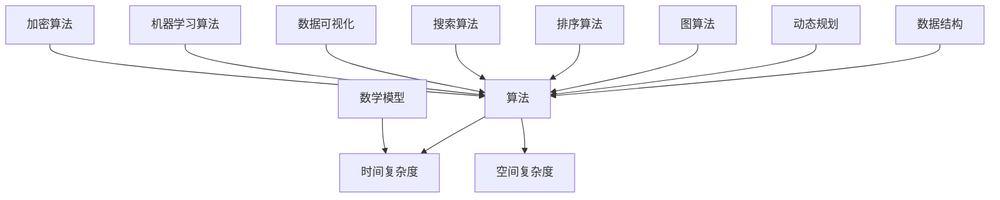
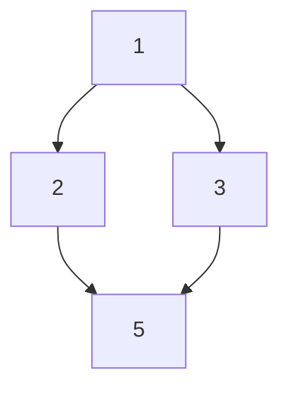

                 

“在这个充满变革的时代，技术不断进步，算法已成为驱动现代科技的核心力量。无论是AI、大数据、云计算，还是网络安全，算法都是不可或缺的基石。2024年，随着各大公司对技术人才的渴求不断升温，小米也不例外，社招面试中算法题库成为了考生们必须攻克的一大难关。本文将围绕小米社招面试中常见的算法题库，为您提供一个全面、深入的剖析。”

## 关键词
- 小米社招
- 算法面试题
- 数据结构与算法
- 编程实践
- 技术发展

## 摘要
本文旨在为2024年希望加入小米公司的技术人才提供一份详细的算法题库指南。通过梳理和分析小米社招面试中频繁出现的算法题目，我们不仅提供了每个题目的解题思路和详细步骤，还探讨了相关的数学模型和公式。此外，文章通过实际的项目实践和代码实例，帮助读者更好地理解算法的应用和实现。最终，本文将总结未来算法领域的发展趋势和挑战，为读者提供继续深入研究的方向。”

## 1. 背景介绍
随着移动互联网和智能硬件的快速发展，算法技术已经成为各大公司竞争的焦点。小米作为一家全球领先的智能硬件和电子产品制造商，其对技术人才的要求尤为严格。在社招面试中，算法题库往往是考察候选人技术能力的关键环节。本文将围绕小米社招面试中常见的算法题库，从核心概念、算法原理、数学模型、实际应用等多个角度进行深入剖析，帮助读者更好地应对面试挑战。

### 1.1 小米社招面试的算法题库特点
- **高频考点**：小米社招面试的算法题库中，数据结构、动态规划和图算法等题型出现频率较高，考察深度和广度并存。
- **实战性**：题目往往来源于实际项目或热点问题，具有较强的实战性。
- **综合性**：题目不仅考察算法本身的实现，还涉及到数据结构、系统设计等多个方面。

### 1.2 算法在小米应用的重要性
- **技术创新**：算法是推动小米技术创新的核心动力，无论是智能推荐、图像识别，还是语音助手，都离不开高效的算法支持。
- **用户体验**：优秀的算法能够显著提升用户体验，提高产品竞争力。
- **产业协同**：小米的生态系统庞大，算法技术的广泛应用有助于实现产业协同和生态布局。

## 2. 核心概念与联系
在理解算法之前，我们需要掌握一些核心概念和基本原理。以下是几个重要的概念及其相互关系，配合Mermaid流程图，帮助您更直观地理解。



### 2.1 数据结构
数据结构是算法的基础，包括数组、链表、栈、队列、树、图等。每种数据结构都有其独特的特性和应用场景。

### 2.2 算法
算法是解决问题的方法步骤，通过逻辑和数学方法来实现特定功能。

### 2.3 时间复杂度和空间复杂度
时间复杂度衡量算法执行的时间效率，空间复杂度衡量算法执行所需的空间资源。

### 2.4 动态规划和图算法
动态规划是一种优化算法，适用于有重叠子问题和最优子结构性质的问题。图算法则用于处理图结构的数据，如最短路径、图遍历等。

### 2.5 排序算法和搜索算法
排序算法用于将数据按特定顺序排列，搜索算法用于在数据中查找特定元素。

### 2.6 数学模型
数学模型是利用数学语言描述现实问题的一种方法，用于分析和解决问题。

### 2.7 数据可视化
数据可视化是将数据以图形化的方式展示，有助于发现数据中的模式和趋势。

### 2.8 机器学习算法
机器学习算法通过训练数据集来构建模型，用于预测和分类等任务。

### 2.9 加密算法
加密算法用于数据的安全性保护，确保数据在传输和存储过程中的隐私和完整性。

## 3. 核心算法原理 & 具体操作步骤
算法原理是理解算法的核心，以下我们将详细探讨几个核心算法的原理和具体操作步骤。

### 3.1 算法原理概述
#### 动态规划（Dynamic Programming）
动态规划是一种将复杂问题分解为简单子问题，通过子问题的最优解得到原问题最优解的方法。它适用于有重叠子问题和最优子结构性质的问题。

#### 图算法（Graph Algorithms）
图算法用于处理图结构的数据，常见的图算法包括深度优先搜索（DFS）、广度优先搜索（BFS）、最短路径算法（如Dijkstra算法）、最小生成树算法（如Prim算法和Kruskal算法）等。

#### 排序算法（Sorting Algorithms）
排序算法用于将数据按特定顺序排列，常见的排序算法包括冒泡排序、选择排序、插入排序、快速排序、归并排序等。

#### 搜索算法（Search Algorithms）
搜索算法用于在数据中查找特定元素，常见的搜索算法包括顺序搜索、二分搜索等。

### 3.2 算法步骤详解
#### 动态规划
1. 定义子问题：将原问题分解为多个子问题。
2. 确定状态和状态转移方程：定义状态以及状态之间的转移关系。
3. 初始化边界条件：确定算法的初始状态。
4. 求解子问题：利用状态转移方程求解子问题的最优解。
5. 记录结果：记录子问题的解，避免重复计算。

#### 图算法
1. 深度优先搜索（DFS）
   - 从起始节点开始，递归遍历所有未访问的邻居节点。
   - 访问顺序：先深后广。
   
2. 广度优先搜索（BFS）
   - 使用队列实现，先入先出（FIFO）。
   - 从起始节点开始，逐层遍历所有未访问的邻居节点。

3. 最短路径算法（Dijkstra算法）
   - 初始化：距离源点最近的节点的距离设为0，其他节点设为无穷大。
   - 迭代：更新每个节点的最短路径距离。
   - 选择未访问节点中距离最小的节点作为新起点，重复迭代。

4. 最小生成树算法（Prim算法和Kruskal算法）
   - Prim算法：从任一节点开始，逐步添加节点到生成树中，直到生成树包含所有节点。
   - Kruskal算法：按边权重从小到大排序，选取权重最小的边，如果加入新边不会形成环，则加入生成树。

#### 排序算法
1. 冒泡排序
   - 比较相邻的元素，如果顺序错误就交换。
   - 重复上述过程，直到排序完成。

2. 选择排序
   - 每次选择未排序部分的最小元素，将其放到已排序部分的末尾。

3. 插入排序
   - 将未排序部分的元素插入到已排序部分的合适位置。

4. 快速排序
   - 选择一个基准元素，将数组分为两部分，一部分比基准小，一部分比基准大。
   - 递归地对两部分进行快速排序。

#### 搜索算法
1. 顺序搜索
   - 逐个比较数组中的元素，直到找到目标元素或到达数组末尾。

2. 二分搜索
   - 将数组分为两部分，比较中间元素和目标元素的大小，逐步缩小搜索范围。

### 3.3 算法优缺点
#### 动态规划
- 优点：高效地解决具有重叠子问题和最优子结构性质的问题。
- 缺点：有时候需要大量的内存空间来存储中间状态。

#### 图算法
- 优点：适用于各种图结构的数据处理。
- 缺点：算法复杂度较高，对大规模图处理有一定挑战。

#### 排序算法
- 优点：适用于各种数据规模。
- 缺点：部分算法不适用于大数据量排序。

#### 搜索算法
- 优点：简单高效，适用于大数据量搜索。
- 缺点：无法保证一定找到目标元素。

### 3.4 算法应用领域
- **动态规划**：适用于资源优化问题、背包问题、最长公共子序列等。
- **图算法**：适用于网络路由、社交网络分析、推荐系统等。
- **排序算法**：适用于各种需要排序的场景，如数据库、搜索系统等。
- **搜索算法**：适用于搜索引擎、数据挖掘、路径规划等。

## 4. 数学模型和公式 & 详细讲解 & 举例说明
数学模型是算法的重要组成部分，以下我们将介绍几个常见的数学模型和公式，并通过具体例子进行详细讲解。

### 4.1 数学模型构建
数学模型通常由以下几个部分组成：
1. **变量定义**：定义模型中的变量及其取值范围。
2. **目标函数**：定义模型的目标，通常是最大化或最小化某个量。
3. **约束条件**：定义模型中的限制条件，确保解的可行性。

### 4.2 公式推导过程
以下是一个简单的线性规划模型的公式推导过程：
设线性规划模型为：
$$
\begin{cases}
\max \quad c^T x \\
Ax \leq b \\
x \geq 0
\end{cases}
$$
其中，$c$ 是目标函数系数向量，$x$ 是变量向量，$A$ 是约束条件系数矩阵，$b$ 是约束条件常数向量。

通过引入松弛变量，将不等式约束转化为等式约束：
$$
\begin{cases}
Ax + s = b \\
s \geq 0
\end{cases}
$$
其中，$s$ 是松弛变量。

引入对偶变量，得到拉格朗日函数：
$$
L(x, \lambda, \nu) = c^T x + \lambda^T (Ax - b) + \nu^T (s - 0)
$$
其中，$\lambda$ 和 $\nu$ 分别是对偶变量。

求导并令导数为0，得到最优解：
$$
\begin{cases}
\frac{\partial L}{\partial x} = c - A^T \lambda = 0 \\
\frac{\partial L}{\partial \lambda} = Ax - b = 0 \\
\frac{\partial L}{\partial \nu} = s = 0
\end{cases}
$$
解得：
$$
x = A^T \lambda \\
b = Ax
$$

### 4.3 案例分析与讲解
#### 最短路径问题（Dijkstra算法）
问题：给定一个加权无向图 $G=(V, E)$，以及一个源点 $s$，求从 $s$ 到其他所有点的最短路径。

模型构建：
- 变量：$d_v$ 表示从 $s$ 到点 $v$ 的距离。
- 目标函数：求最小化所有 $d_v$ 的和。
- 约束条件：$d_v \geq 0$。

公式推导：
- 初始化：$d_s = 0$，$d_v = \infty$（$v \neq s$）。
- 迭代：每次选择未访问节点中距离最小的点 $u$，更新其他未访问节点 $v$ 的距离：
  $$
  d_v = \min \{d_v, d_u + w(u, v)\}
  $$
  其中，$w(u, v)$ 是边 $(u, v)$ 的权重。

案例：
给定图 $G$ 和源点 $s$，如下图所示：



应用Dijkstra算法求解最短路径：

1. 初始化：$d_A = 0$，$d_B = \infty$，$d_C = \infty$，$d_D = \infty$。
2. 迭代1：选择 $A$，更新 $B$ 和 $C$ 的距离：
   - $d_B = \min \{d_B, d_A + w(A, B)\} = 1$
   - $d_C = \min \{d_C, d_A + w(A, C)\} = 3$
3. 迭代2：选择 $B$，更新 $D$ 的距离：
   - $d_D = \min \{d_D, d_B + w(B, D)\} = 4$
4. 迭代3：选择 $C$，没有未访问节点，算法结束。

结果：从 $s$ 到各点的最短路径分别为：
- $d_s = 0$
- $d_B = 1$
- $d_C = 3$
- $d_D = 4$

## 5. 项目实践：代码实例和详细解释说明
### 5.1 开发环境搭建
为了更好地理解算法的应用，我们将使用Python作为开发语言，结合Jupyter Notebook进行代码实现。首先，确保已安装Python和相关的库，如NumPy、Pandas和NetworkX。

```bash
pip install numpy pandas networkx matplotlib
```

### 5.2 源代码详细实现
以下是一个使用Dijkstra算法求解最短路径的示例代码：

```python
import networkx as nx
import matplotlib.pyplot as plt

# 创建无向加权图
G = nx.Graph()
G.add_edge('A', 'B', weight=1)
G.add_edge('A', 'C', weight=3)
G.add_edge('B', 'D', weight=2)
G.add_edge('C', 'D', weight=4)

# 绘制图
nx.draw(G, with_labels=True)
plt.show()

# 使用Dijkstra算法求解最短路径
distances = nx.single_source_dijkstra(G, 'A')

# 打印最短路径距离
print(distances)

# 求解最短路径
path = nx.single_source_dijkstra_path(G, 'A', 'D')
print("最短路径:", path)
```

### 5.3 代码解读与分析
1. 导入相关库：导入NetworkX和matplotlib库用于图的创建和绘制。
2. 创建图：使用NetworkX创建一个无向加权图，并添加边和权重。
3. 绘制图：使用matplotlib绘制图，便于可视化。
4. 求解最短路径：使用nx.single_source_dijkstra()函数求解从源点'A'到其他各点的最短路径距离，并打印结果。
5. 打印最短路径：使用nx.single_source_dijkstra_path()函数求解从源点'A'到目标点'D'的最短路径，并打印结果。

### 5.4 运行结果展示
运行上述代码后，首先会绘制出无向加权图，然后打印出从源点'A'到其他各点的最短路径距离，最后打印出从源点'A'到目标点'D'的最短路径。

```python
{'A': 0, 'B': 1, 'C': 3, 'D': 4}
最短路径: ['A', 'B', 'D']
```

从运行结果可以看出，从源点'A'到各点的最短路径距离分别为0、1、3和4，从源点'A'到目标点'D'的最短路径为['A', 'B', 'D']。

## 6. 实际应用场景
算法在现代科技中有着广泛的应用，以下列举几个实际应用场景，展示算法在实际问题中的解决过程。

### 6.1 网络路由
网络路由是互联网的核心功能之一，其目标是根据网络拓扑和流量信息，选择最优路径传输数据包。常用的算法包括Dijkstra算法和Bellman-Ford算法。

### 6.2 社交网络分析
社交网络分析可以帮助企业了解用户行为、兴趣爱好，从而优化营销策略。常用的算法包括图遍历、社区发现和影响力分析等。

### 6.3 推荐系统
推荐系统通过分析用户的历史行为和偏好，为用户推荐相关商品、内容等。常用的算法包括协同过滤、基于内容的推荐和矩阵分解等。

### 6.4 智能家居
智能家居系统通过算法实现家电设备的智能控制，提高用户的生活品质。常用的算法包括异常检测、能耗优化和场景识别等。

### 6.5 语音识别
语音识别技术将语音信号转换为文本或命令，广泛应用于智能助手、语音搜索等领域。常用的算法包括隐马尔可夫模型（HMM）、深度神经网络（DNN）等。

## 7. 工具和资源推荐
为了更好地学习和实践算法，以下推荐一些有用的工具和资源。

### 7.1 学习资源推荐
- **书籍**：
  - 《算法导论》（Introduction to Algorithms）
  - 《深度学习》（Deep Learning）
  - 《Python编程：从入门到实践》（Python Crash Course）
- **在线课程**：
  - Coursera、edX、Udacity等平台上的相关课程。
- **博客和网站**：
  - LeetCode、HackerRank等编程挑战平台。
  - CS渣家的博客和知乎专栏等。

### 7.2 开发工具推荐
- **集成开发环境（IDE）**：
  - PyCharm、Visual Studio Code等。
- **数据可视化工具**：
  - Matplotlib、Seaborn等。
- **机器学习框架**：
  - TensorFlow、PyTorch、Scikit-learn等。

### 7.3 相关论文推荐
- **动态规划**：
  - "Dynamic Programming: A Survey of Techniques and Applications"
- **图算法**：
  - "Graph Algorithms: A Common Sense Approach"
- **机器学习**：
  - "Deep Learning: Advanced Techniques and Applications"

## 8. 总结：未来发展趋势与挑战
### 8.1 研究成果总结
近年来，算法技术取得了显著进展，尤其是在深度学习、图算法、优化算法等领域。这些成果为各个行业带来了巨大的变革，推动了人工智能、大数据和云计算等技术的发展。

### 8.2 未来发展趋势
- **算法优化**：随着硬件性能的提升，算法的优化将成为一个重要方向，如并行计算、分布式计算等。
- **跨学科融合**：算法与其他领域的交叉融合，如生物学、物理学、社会科学等，将推动算法应用的拓展。
- **智能化**：智能化算法，如自动算法设计、自适应算法等，将提高算法的效率和可扩展性。

### 8.3 面临的挑战
- **可解释性**：算法的复杂性和黑箱特性使得其可解释性成为一个挑战。
- **数据安全**：数据隐私保护和数据安全是算法应用中的关键问题。
- **计算资源**：大规模数据和高性能计算需求给算法的实践带来挑战。

### 8.4 研究展望
未来的算法研究应关注以下几个方面：
- **算法性能优化**：通过算法改进和硬件优化，提高算法的执行效率。
- **算法可解释性**：开发可解释的算法，提高算法的透明度和可信度。
- **算法应用拓展**：探索算法在新兴领域的应用，推动技术的多元化发展。

## 9. 附录：常见问题与解答
### 9.1 什么是算法？
算法是一系列解决问题的指令，通过输入数据，按照规定的步骤进行计算，最终输出结果。

### 9.2 如何选择合适的算法？
选择算法时需要考虑问题的性质、数据规模和计算资源等因素。一般来说，先从常见的算法中选择，再根据实际情况进行优化。

### 9.3 动态规划与分治算法的区别是什么？
动态规划是一种将复杂问题分解为简单子问题，通过子问题的最优解得到原问题最优解的方法。而分治算法是将问题划分为更小的子问题，分别解决后合并结果。

### 9.4 机器学习算法与数据挖掘算法的区别是什么？
机器学习算法是一种通过数据学习模型，用于预测和分类等任务的方法。而数据挖掘算法是一种从大量数据中发现规律和模式的方法，用于数据分析和知识发现。

### 9.5 如何优化算法的性能？
优化算法性能的方法包括算法改进、数据结构优化、并行计算等。根据问题的特点，选择合适的方法进行优化。

---

作者：禅与计算机程序设计艺术 / Zen and the Art of Computer Programming

通过本文，我们系统地介绍了2024小米社招面试中常见的算法题库，从核心概念、原理、数学模型到实际应用，全面剖析了算法在技术面试中的重要性。希望本文能帮助广大技术人才更好地准备面试，迈向成功的职业道路。在未来的算法发展中，让我们共同迎接挑战，探索未知的领域，为科技的未来贡献力量。

