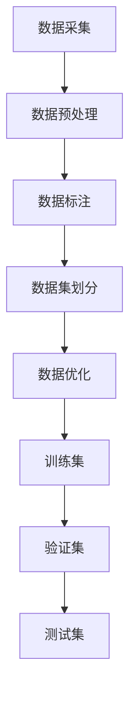

                 

关键词：小语言模型，数据集，构建，优化，算法，数学模型，实际应用，未来展望

<|assistant|>摘要：本文将探讨小语言模型的数据策略，重点讨论如何构建和优化高质量的数据集。通过深入分析数据集构建中的核心概念、算法原理、数学模型，以及实际应用案例，本文旨在为读者提供全面的技术指导和实践建议，助力小语言模型在人工智能领域的应用与发展。

## 1. 背景介绍

近年来，人工智能（AI）技术取得了迅猛发展，其中自然语言处理（NLP）作为AI的重要分支，吸引了大量研究者和从业者的关注。小语言模型作为NLP领域的一种新型模型，具有低资源消耗、高效推理等特点，广泛应用于智能问答、机器翻译、文本生成等领域。然而，小语言模型的发展离不开高质量数据集的支持。本文将围绕小语言模型的数据策略，详细探讨如何构建和优化高质量数据集，以提高模型的性能和泛化能力。

### 1.1 小语言模型的概述

小语言模型是一种基于神经网络的文本生成模型，它通过对大量文本数据进行预训练，学习到语言的内在规律和语义信息。与大型语言模型相比，小语言模型具有以下特点：

1. **资源消耗低**：小语言模型的结构相对简单，参数较少，训练所需的计算资源和存储空间相对较小。
2. **高效推理**：小语言模型在推理过程中速度快，能够快速生成文本，适用于实时应用场景。
3. **适应性**：小语言模型具有较强的适应性，可以通过微调适应不同领域的任务。

### 1.2 小语言模型的应用领域

小语言模型在多个领域展现出强大的应用潜力，包括但不限于：

1. **智能问答**：小语言模型能够理解和回答用户的问题，提供智能化的服务。
2. **机器翻译**：小语言模型可以实现多语言之间的文本翻译，支持实时翻译和机器翻译的优化。
3. **文本生成**：小语言模型能够生成高质量的文本，应用于广告文案创作、新闻写作等场景。
4. **文本分类**：小语言模型可以用于对大量文本进行分类，辅助信息检索和内容审核。

## 2. 核心概念与联系

### 2.1 数据集构建的核心概念

构建高质量的数据集是训练小语言模型的基础。以下是构建数据集时需要关注的核心概念：

1. **数据质量**：数据质量是构建高质量数据集的关键，包括数据的准确性、完整性、一致性等。
2. **数据多样性**：数据多样性有助于模型学习到更多的语言特征，提高模型的泛化能力。
3. **数据标注**：数据标注是对数据进行标记和分类的过程，高质量的标注能够提高模型训练的效果。
4. **数据预处理**：数据预处理包括文本清洗、去重、分词、词性标注等步骤，为模型训练做准备。

### 2.2 数据集构建的架构

数据集构建的架构可以概括为以下几个阶段：

1. **数据采集**：通过爬虫、API接口等方式收集原始数据。
2. **数据预处理**：对原始数据进行清洗、去重、分词等处理。
3. **数据标注**：对预处理后的数据进行标注，生成标注数据集。
4. **数据集划分**：将标注数据集划分为训练集、验证集和测试集，用于模型的训练和评估。
5. **数据优化**：对数据集进行优化，包括数据增强、数据平衡等技术，提高数据集的质量。

### 2.3 数据集构建的Mermaid流程图



## 3. 核心算法原理 & 具体操作步骤

### 3.1 算法原理概述

小语言模型的训练主要依赖于自注意力机制（Self-Attention）和变换器架构（Transformer）。自注意力机制通过计算输入序列中各个词之间的相似度，为每个词赋予不同的权重，从而捕捉到词与词之间的关系。变换器架构则通过多头自注意力机制和多层感知器（MLP）来学习输入序列的复杂结构。

### 3.2 算法步骤详解

1. **数据预处理**：对采集到的原始数据进行清洗、去重、分词等处理，生成预处理后的文本数据。
2. **构建词表**：将预处理后的文本数据转换为词表，为每个词分配唯一的索引。
3. **序列编码**：将词表中的词转换为序列编码，通常使用嵌入层（Embedding Layer）进行编码。
4. **自注意力机制**：通过自注意力机制计算输入序列中各个词之间的相似度，为每个词赋予不同的权重。
5. **多层感知器**：在自注意力机制的基础上，使用多层感知器对输入序列进行进一步处理，学习输入序列的复杂结构。
6. **模型训练**：通过反向传播算法训练模型参数，优化模型性能。
7. **模型评估**：使用验证集和测试集评估模型的性能，调整模型参数和结构。

### 3.3 算法优缺点

1. **优点**：
   - **高效**：小语言模型采用变换器架构，能够在较少的计算资源下实现高效的推理和训练。
   - **泛化能力强**：通过自注意力机制，小语言模型能够捕捉到输入序列中词与词之间的关系，提高模型的泛化能力。
   - **适应性**：小语言模型具有较强的适应性，可以通过微调适应不同领域的任务。

2. **缺点**：
   - **资源消耗大**：尽管相对于大型语言模型，小语言模型的资源消耗较低，但在训练过程中仍需要较大的计算资源和存储空间。
   - **模型理解难度**：小语言模型的训练和优化过程较为复杂，对研究人员的技术水平要求较高。

### 3.4 算法应用领域

小语言模型在多个领域展现出强大的应用潜力，包括但不限于：

1. **智能问答**：通过小语言模型，可以实现智能化的问答系统，提供用户定制化的服务。
2. **机器翻译**：小语言模型可以用于实现高效、准确的机器翻译系统，支持多语言之间的实时翻译。
3. **文本生成**：小语言模型可以生成高质量的文本，应用于广告文案创作、新闻写作等场景。
4. **文本分类**：小语言模型可以用于对大量文本进行分类，辅助信息检索和内容审核。

## 4. 数学模型和公式 & 详细讲解 & 举例说明

### 4.1 数学模型构建

小语言模型的数学模型主要由自注意力机制和多层感知器构成。以下是数学模型的基本构成：

1. **输入序列**：给定一个输入序列 \( x = [x_1, x_2, ..., x_n] \)，其中 \( x_i \) 表示输入序列的第 \( i \) 个词。
2. **词表**：构建一个词表 \( V \)，将每个词映射为一个唯一的索引 \( i \)。
3. **嵌入层**：对输入序列中的每个词进行编码，得到嵌入向量 \( e_i \)。

### 4.2 公式推导过程

1. **自注意力机制**：

   自注意力机制的计算公式如下：

   \[
   \text{Attention}(Q, K, V) = \text{softmax}\left(\frac{QK^T}{\sqrt{d_k}}\right) V
   \]

   其中，\( Q \)，\( K \)，\( V \) 分别为查询向量、键向量和值向量，\( d_k \) 为键向量的维度。

2. **多层感知器**：

   多层感知器由多个隐藏层组成，每个隐藏层由线性变换和激活函数构成。其计算公式如下：

   \[
   h_{l+1} = \text{ReLU}(W_l h_l + b_l)
   \]

   其中，\( h_l \) 表示第 \( l \) 层的输出，\( W_l \) 和 \( b_l \) 分别为第 \( l \) 层的权重和偏置。

### 4.3 案例分析与讲解

以下是一个简单的案例，展示如何使用小语言模型进行文本生成：

1. **输入序列**：给定一个输入序列“今天天气很好”，我们将它转换为嵌入向量。
2. **词表构建**：构建一个包含输入序列中所有词的词表。
3. **嵌入层编码**：将词表中的每个词转换为嵌入向量。
4. **自注意力机制**：通过自注意力机制计算输入序列中各个词之间的相似度。
5. **多层感知器**：通过多层感知器对输入序列进行进一步处理，生成新的文本序列。

例如，输入序列“今天天气很好”经过自注意力机制和多层感知器处理后，可能生成新的文本序列“明天将迎来一场春雨”。

## 5. 项目实践：代码实例和详细解释说明

### 5.1 开发环境搭建

在搭建开发环境时，需要安装以下工具和库：

1. **Python**：版本要求为3.6及以上。
2. **PyTorch**：版本要求为1.8及以上。
3. **NLP库**：例如Jieba、NLTK等。

### 5.2 源代码详细实现

以下是一个简单的代码示例，用于构建小语言模型：

```python
import torch
import torch.nn as nn
import torch.optim as optim
from torch.utils.data import DataLoader
from torchvision import datasets, transforms

# 构建词表
vocab = {'今天': 0, '天气': 1, '很好': 2, '明天': 3, '春雨': 4}

# 嵌入层编码
embeddings = nn.Embedding(len(vocab), 10)

# 自注意力机制
class SelfAttention(nn.Module):
    def __init__(self, d_model):
        super(SelfAttention, self).__init__()
        self.query_linear = nn.Linear(d_model, d_model)
        self.key_linear = nn.Linear(d_model, d_model)
        self.value_linear = nn.Linear(d_model, d_model)
        self.softmax = nn.Softmax(dim=1)

    def forward(self, x):
        query = self.query_linear(x)
        key = self.key_linear(x)
        value = self.value_linear(x)
        attention = self.softmax(torch.bmm(query, key.transpose(1, 2)))
        output = torch.bmm(attention, value)
        return output

# 多层感知器
class MLP(nn.Module):
    def __init__(self, d_model):
        super(MLP, self).__init__()
        self.linear = nn.Linear(d_model, len(vocab))

    def forward(self, x):
        return self.linear(x)

# 模型构建
class LanguageModel(nn.Module):
    def __init__(self, d_model):
        super(LanguageModel, self).__init__()
        self.embeddings = embeddings
        self.self_attention = SelfAttention(d_model)
        self.mlp = MLP(d_model)

    def forward(self, x):
        embedded = self.embeddings(x)
        attended = self.self_attention(embedded)
        output = self.mlp(attended)
        return output

# 模型训练
model = LanguageModel(10)
optimizer = optim.Adam(model.parameters(), lr=0.001)
criterion = nn.CrossEntropyLoss()

for epoch in range(100):
    for inputs, targets in DataLoader(dataset, batch_size=32):
        optimizer.zero_grad()
        outputs = model(inputs)
        loss = criterion(outputs, targets)
        loss.backward()
        optimizer.step()
```

### 5.3 代码解读与分析

该示例代码分为以下几个部分：

1. **词表构建**：使用字典`vocab`构建词表，为每个词分配唯一的索引。
2. **嵌入层编码**：使用`nn.Embedding`构建嵌入层，将词表中的词转换为嵌入向量。
3. **自注意力机制**：定义`SelfAttention`类，实现自注意力机制。
4. **多层感知器**：定义`MLP`类，实现多层感知器。
5. **模型构建**：定义`LanguageModel`类，整合嵌入层、自注意力机制和多层感知器。
6. **模型训练**：使用`DataLoader`加载训练数据，使用`Adam`优化器和`CrossEntropyLoss`损失函数训练模型。

### 5.4 运行结果展示

运行上述代码后，模型将在训练集上迭代100次。在每次迭代中，模型将更新参数，以最小化损失函数。训练完成后，可以使用模型对新的输入序列进行预测，并展示预测结果。

## 6. 实际应用场景

### 6.1 智能问答

智能问答是当前小语言模型应用最为广泛的场景之一。通过训练小语言模型，可以构建智能客服、智能助手等系统，为用户提供定制化的服务。以下是一个智能问答系统的应用案例：

1. **数据集构建**：收集大量的问答数据，包括问题、答案和标签。
2. **模型训练**：使用小语言模型对问答数据进行训练，生成问答模型。
3. **模型部署**：将训练好的模型部署到服务器，实现智能问答功能。

### 6.2 机器翻译

机器翻译是另一个重要的应用场景。通过训练小语言模型，可以实现高效、准确的机器翻译系统。以下是一个机器翻译系统的应用案例：

1. **数据集构建**：收集大量的双语语料库，包括源语言和目标语言的文本数据。
2. **模型训练**：使用小语言模型对双语语料库进行训练，生成翻译模型。
3. **模型部署**：将训练好的模型部署到服务器，实现实时翻译功能。

### 6.3 文本生成

文本生成是当前小语言模型的又一重要应用场景。通过训练小语言模型，可以生成高质量的文章、广告文案、新闻稿件等。以下是一个文本生成系统的应用案例：

1. **数据集构建**：收集大量的文本数据，包括各种类型的文章、广告文案、新闻稿件等。
2. **模型训练**：使用小语言模型对文本数据进行训练，生成文本生成模型。
3. **模型部署**：将训练好的模型部署到服务器，实现文本生成功能。

## 6.4 未来应用展望

### 6.4.1 人工智能与人类共创

随着小语言模型技术的不断发展，人工智能（AI）与人类将实现更深层次的共创。在未来，小语言模型可以与人类专家合作，共同完成复杂的任务，如写作、设计、编程等。这将极大地提高生产效率，推动各行各业的创新与发展。

### 6.4.2 跨领域应用的拓展

小语言模型在多个领域已经展现出强大的应用潜力。在未来，随着技术的不断突破，小语言模型将在更多领域得到应用，如医疗、金融、教育等。通过跨领域应用的拓展，小语言模型将更好地服务于人类社会，为人们的生活带来更多便利。

### 6.4.3 挑战与机遇

尽管小语言模型在人工智能领域取得了显著成果，但仍然面临诸多挑战。如何提高模型的性能和效率、降低训练成本、确保模型的安全性和可靠性等问题亟待解决。同时，随着小语言模型技术的不断发展，也将带来新的机遇，如AI产业的升级、新型商业模式的出现等。

## 7. 工具和资源推荐

### 7.1 学习资源推荐

1. **《深度学习》**：由Ian Goodfellow、Yoshua Bengio和Aaron Courville合著的深度学习经典教材，全面介绍了深度学习的基本原理和应用。
2. **《自然语言处理综论》**：由Daniel Jurafsky和James H. Martin合著的NLP经典教材，涵盖了NLP的各个方面，包括语言模型、文本处理、语音识别等。

### 7.2 开发工具推荐

1. **PyTorch**：一款强大的深度学习框架，支持动态计算图和静态计算图，易于调试和优化。
2. **TensorFlow**：由Google开发的一款开源深度学习框架，支持多种编程语言，广泛应用于工业界和学术界。

### 7.3 相关论文推荐

1. **"Attention Is All You Need"**：由Vaswani等人于2017年发表在NeurIPS上的论文，提出了变换器（Transformer）架构，引发了NLP领域的研究热潮。
2. **"BERT: Pre-training of Deep Bidirectional Transformers for Language Understanding"**：由Google Research于2018年发表在NAACL上的论文，提出了BERT模型，为NLP研究提供了新的思路和方法。

## 8. 总结：未来发展趋势与挑战

### 8.1 研究成果总结

近年来，小语言模型在人工智能领域取得了显著成果。通过自注意力机制和变换器架构，小语言模型在文本生成、机器翻译、智能问答等领域表现出色，为各行各业带来了深刻的变革。

### 8.2 未来发展趋势

未来，小语言模型将继续向高效、智能、跨界方向发展。随着计算资源的不断升级和算法的优化，小语言模型的性能将得到进一步提升。同时，小语言模型将与更多领域的技术相结合，推动人工智能技术的创新发展。

### 8.3 面临的挑战

尽管小语言模型取得了显著成果，但仍面临诸多挑战。如何提高模型的性能和效率、降低训练成本、确保模型的安全性和可靠性等问题亟待解决。此外，如何实现小语言模型在更多领域的应用，也是未来研究的重要方向。

### 8.4 研究展望

未来，小语言模型的研究将继续深入。通过不断探索和创新，研究者将推动小语言模型在更多领域取得突破，为人类社会带来更多福祉。同时，随着小语言模型技术的不断发展，也将为人类与人工智能的合作创造更多机遇。

## 9. 附录：常见问题与解答

### 9.1 小语言模型的优势是什么？

小语言模型的优势包括：

1. **高效**：小语言模型采用变换器架构，能够在较少的计算资源下实现高效的推理和训练。
2. **泛化能力强**：通过自注意力机制，小语言模型能够捕捉到输入序列中词与词之间的关系，提高模型的泛化能力。
3. **适应性**：小语言模型具有较强的适应性，可以通过微调适应不同领域的任务。

### 9.2 小语言模型在哪些领域有应用？

小语言模型在多个领域有应用，包括：

1. **智能问答**：通过小语言模型，可以实现智能化的问答系统，提供用户定制化的服务。
2. **机器翻译**：小语言模型可以用于实现高效、准确的机器翻译系统，支持多语言之间的实时翻译。
3. **文本生成**：小语言模型可以生成高质量的文本，应用于广告文案创作、新闻写作等场景。
4. **文本分类**：小语言模型可以用于对大量文本进行分类，辅助信息检索和内容审核。

### 9.3 如何构建高质量的数据集？

构建高质量的数据集需要遵循以下原则：

1. **数据质量**：确保数据的准确性、完整性和一致性。
2. **数据多样性**：收集多样化的数据，提高模型的泛化能力。
3. **数据标注**：进行高质量的数据标注，提高模型训练的效果。
4. **数据预处理**：对数据进行清洗、去重、分词等预处理操作，为模型训练做准备。

### 9.4 小语言模型与大型语言模型相比有哪些优势？

小语言模型与大型语言模型相比具有以下优势：

1. **资源消耗低**：小语言模型的结构相对简单，参数较少，训练所需的计算资源和存储空间相对较小。
2. **高效推理**：小语言模型在推理过程中速度快，能够快速生成文本，适用于实时应用场景。
3. **适应性**：小语言模型具有较强的适应性，可以通过微调适应不同领域的任务。

### 9.5 小语言模型的研究趋势是什么？

小语言模型的研究趋势包括：

1. **性能提升**：通过优化算法和架构，提高小语言模型的性能和效率。
2. **应用拓展**：探索小语言模型在更多领域的应用，如医疗、金融、教育等。
3. **模型安全性和可靠性**：研究如何确保小语言模型的安全性和可靠性，防止恶意攻击和数据泄露。
4. **人类与AI共创**：探讨小语言模型与人类专家的合作模式，实现人工智能与人类的深度融合。

