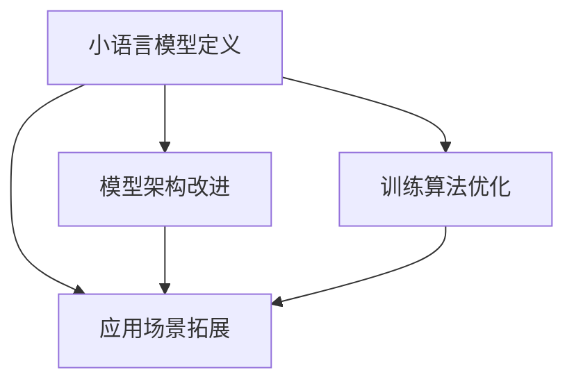
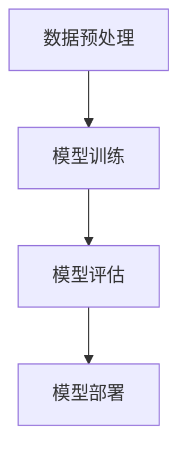

                 

关键词：小语言模型、基础模型、人工智能、深度学习、语言处理、颠覆性创新、潜力、应用领域

> 摘要：本文探讨了小语言模型在人工智能领域的颠覆性潜力。通过对小语言模型的背景介绍、核心概念、算法原理、数学模型、项目实践以及未来发展趋势的深入分析，我们揭示了小语言模型在基础模型领域的重要性，并探讨了其对现有技术的挑战和未来研究方向。

## 1. 背景介绍

随着深度学习技术的迅猛发展，大型神经网络模型如BERT、GPT-3等在自然语言处理（NLP）领域取得了显著成就。这些基础模型通过在海量数据上进行训练，可以捕捉到语言结构的复杂性和多样性，从而实现高质量的文本生成、语义理解和问答等任务。然而，大型基础模型的训练和部署成本极高，且对计算资源的需求巨大，使得其在实际应用中存在诸多限制。

在这种情况下，小语言模型（也称为小型化语言模型）应运而生。小语言模型是指那些规模较小、参数数量较少的神经网络模型，它们具有更高效的计算性能和更低的资源需求。近年来，研究人员开始关注小语言模型在人工智能领域的潜力，并致力于探索如何在保证性能的前提下，实现对基础模型的优化和替代。

本文旨在探讨小语言模型的颠覆性潜力，通过对核心概念、算法原理、数学模型、项目实践以及未来发展趋势的深入分析，为小语言模型在基础模型领域的研究和应用提供新的视角和思路。

## 2. 核心概念与联系

### 2.1 小语言模型定义

小语言模型（Small Language Models，SLMs）是指那些规模较小、参数数量较少的神经网络模型，它们在自然语言处理任务中表现出较高的性能。与传统的大型基础模型相比，小语言模型具有以下特点：

- **参数规模较小**：小语言模型的参数数量通常在数千到数百万之间，远小于大型基础模型（数亿至数十亿参数）。这使得小语言模型在训练和部署过程中所需的计算资源和存储空间显著降低。
- **计算效率高**：小语言模型在计算过程中具有更高的效率，能够在较短时间内完成推理和预测任务。
- **适应性强**：小语言模型具有较强的适应性，可以快速适应新的任务和数据集，为实际应用提供灵活的解决方案。

### 2.2 小语言模型与传统基础模型的关系

小语言模型与传统基础模型之间存在着密切的联系和区别。传统基础模型，如BERT、GPT-3等，通过大规模数据训练，可以捕捉到语言结构的复杂性和多样性，从而实现高精度的自然语言处理任务。然而，这些大型模型在训练和部署过程中面临着诸多挑战：

- **计算资源需求大**：大型基础模型需要大量的计算资源和存储空间，这在实际应用中往往难以满足。
- **训练时间较长**：大型基础模型在训练过程中需要消耗大量时间，尤其是在处理大规模数据集时，训练时间更加漫长。
- **部署成本高**：大型基础模型在部署过程中需要昂贵的硬件设备和强大的计算能力，这使得其在实际应用中受到限制。

相比之下，小语言模型具有以下优势：

- **高效训练和部署**：小语言模型在训练和部署过程中具有更高的效率，能够在较短时间内完成模型训练和推理任务，从而降低训练成本和部署难度。
- **资源消耗低**：小语言模型所需的计算资源和存储空间较少，这使得它们在资源受限的环境中也能发挥重要作用。
- **应用广泛**：小语言模型具有较强的适应性和通用性，可以应用于各种自然语言处理任务，为实际应用提供更多可能性。

### 2.3 小语言模型的发展现状与趋势

近年来，随着深度学习技术的不断进步，小语言模型在人工智能领域得到了广泛关注。研究人员通过改进神经网络架构、优化训练算法和引入新的技术手段，不断提升小语言模型的性能和效率。

- **模型架构改进**：研究人员通过设计更高效的网络架构，如Transformer、BERT等，提升了小语言模型的性能。这些架构在保证模型精度的同时，显著降低了计算复杂度和参数规模。
- **训练算法优化**：通过优化训练算法，如梯度下降、自适应学习率等，研究人员提高了小语言模型的训练速度和效果。此外，迁移学习、元学习等技术的引入，也为小语言模型的训练提供了新的思路。
- **应用场景拓展**：随着小语言模型性能的提升，其在实际应用中的适用范围逐渐扩大。从文本分类、情感分析到机器翻译、语音识别等，小语言模型在各个领域都取得了显著成果。

未来，随着技术的不断进步和应用需求的不断增长，小语言模型将在人工智能领域发挥更加重要的作用。本文将在后续章节中，详细探讨小语言模型的核心算法原理、数学模型、项目实践和未来发展趋势，为小语言模型的研究和应用提供参考。

### 2.4 Mermaid 流程图

以下是一个关于小语言模型发展现状和趋势的Mermaid流程图：



## 3. 核心算法原理 & 具体操作步骤

### 3.1 算法原理概述

小语言模型的算法原理主要基于深度学习技术，特别是基于Transformer架构。Transformer模型是一种基于自注意力机制（Self-Attention）的神经网络模型，具有处理长序列数据和捕捉序列之间关系的能力。小语言模型通过在Transformer架构上进行改进和优化，实现了对自然语言处理任务的高效处理。

#### 3.1.1 Transformer架构

Transformer模型的核心思想是使用自注意力机制（Self-Attention）来建模序列之间的依赖关系。自注意力机制通过计算输入序列中每个词与其他词之间的关联性，为每个词生成加权表示。具体来说，自注意力机制可以分为以下三个步骤：

1. **输入嵌入（Input Embedding）**：将输入序列（如单词、字符）转换为向量表示，包括词嵌入（Word Embedding）和位置嵌入（Position Embedding）。
2. **自注意力（Self-Attention）**：计算输入序列中每个词与其他词之间的关联性，生成加权表示。自注意力机制通过计算查询（Query）、键（Key）和值（Value）之间的相似度，为每个词生成加权向量。
3. **前馈神经网络（Feedforward Neural Network）**：对自注意力得到的加权向量进行进一步处理，通过两个全连接层进行非线性变换。

#### 3.1.2 小语言模型优化

小语言模型在Transformer架构的基础上，进行了以下优化：

1. **参数缩减**：通过减少模型参数数量，降低计算复杂度和资源消耗。具体方法包括降维、稀疏性、参数共享等。
2. **模型压缩**：使用压缩技术，如量化、剪枝、蒸馏等，减少模型存储和计算需求。
3. **训练算法优化**：采用自适应学习率、迁移学习、元学习等技术，提高训练速度和模型性能。

#### 3.1.3 操作步骤

1. **数据预处理**：对输入数据进行清洗、分词、编码等预处理操作，将文本转换为向量表示。
2. **模型训练**：使用训练数据集对模型进行训练，通过优化算法更新模型参数。
3. **模型评估**：使用验证数据集对模型进行评估，计算模型性能指标，如准确率、召回率等。
4. **模型部署**：将训练好的模型部署到实际应用场景，进行推理和预测任务。

### 3.2 算法步骤详解

#### 3.2.1 数据预处理

1. **文本清洗**：去除文本中的无关符号、标点符号等，保留有效信息。
2. **分词**：将文本分为单词或字符序列，为后续编码做准备。
3. **编码**：将分词后的文本转换为向量表示，如使用Word Embedding或BERT等预训练模型。

#### 3.2.2 模型训练

1. **初始化参数**：随机初始化模型参数。
2. **输入数据读取**：将编码后的输入数据输入到模型中。
3. **计算损失**：计算输入数据和模型输出之间的损失，如交叉熵损失。
4. **反向传播**：使用梯度下降等优化算法，更新模型参数。
5. **迭代训练**：重复上述步骤，直到模型收敛或达到预设的训练次数。

#### 3.2.3 模型评估

1. **数据划分**：将数据集划分为训练集、验证集和测试集。
2. **模型评估**：使用验证集对模型进行评估，计算模型性能指标，如准确率、召回率等。
3. **模型调整**：根据评估结果调整模型参数，优化模型性能。

#### 3.2.4 模型部署

1. **模型保存**：将训练好的模型保存为文件。
2. **模型加载**：在实际应用场景中加载模型。
3. **推理和预测**：使用模型对输入数据进行推理和预测，输出结果。

### 3.3 算法优缺点

#### 3.3.1 优点

1. **计算效率高**：小语言模型在计算过程中具有更高的效率，能够在较短时间内完成推理和预测任务。
2. **资源消耗低**：小语言模型所需的计算资源和存储空间较少，适用于资源受限的环境。
3. **适应性强**：小语言模型具有较强的适应性，可以应用于各种自然语言处理任务，为实际应用提供更多可能性。

#### 3.3.2 缺点

1. **性能受限**：由于模型规模较小，小语言模型在处理复杂任务时，可能无法达到大型基础模型的效果。
2. **训练时间较长**：虽然小语言模型在计算过程中具有较高效率，但在训练过程中，仍需要较长时间来完成模型训练。
3. **参数优化难度大**：小语言模型在参数优化过程中，可能面临较大挑战，需要采用更先进的优化算法和技术手段。

### 3.4 算法应用领域

小语言模型在自然语言处理领域具有广泛的应用前景，可以应用于以下任务：

1. **文本分类**：对文本数据进行分类，如新闻分类、情感分类等。
2. **情感分析**：分析文本中的情感倾向，如正面、负面情感等。
3. **命名实体识别**：识别文本中的命名实体，如人名、地名、组织名等。
4. **机器翻译**：将一种语言的文本翻译为另一种语言。
5. **问答系统**：回答用户提出的问题，提供知识查询服务。

未来，随着小语言模型技术的不断发展，其在更多应用领域的潜力将得到进一步挖掘。

### 3.5 Mermaid 流程图

以下是一个关于小语言模型核心算法原理和具体操作步骤的Mermaid流程图：



## 4. 数学模型和公式 & 详细讲解 & 举例说明

### 4.1 数学模型构建

小语言模型的数学模型主要基于深度学习技术，特别是在Transformer架构的基础上构建。为了更好地理解小语言模型的工作原理，我们首先回顾一下Transformer模型的数学模型。

#### 4.1.1 输入表示

假设我们有一个输入序列 $\{x_1, x_2, ..., x_n\}$，其中 $x_i$ 表示序列中的第 $i$ 个词。为了将文本转换为向量表示，我们使用词嵌入（Word Embedding）和位置嵌入（Position Embedding）。

1. **词嵌入**：词嵌入是一个从词汇表到向量空间的映射，将每个单词映射为一个固定大小的向量。词嵌入可以通过预训练模型（如BERT、GloVe等）获得。
   
   $$
   \text{word\_embedding}(x_i) = e_i \in \mathbb{R}^d
   $$
   
   其中，$e_i$ 是词 $x_i$ 的词嵌入向量，$d$ 是词嵌入向量的维度。

2. **位置嵌入**：位置嵌入用于表示输入序列中的词的位置信息。对于输入序列中的每个词 $x_i$，我们为其添加一个位置嵌入向量。

   $$
   \text{position\_embedding}(i) = p_i \in \mathbb{R}^d
   $$
   
   其中，$p_i$ 是位置 $i$ 的位置嵌入向量。

因此，输入序列的向量表示可以表示为：

$$
\text{input\_sequence} = [e_1 + p_1, e_2 + p_2, ..., e_n + p_n]
$$

#### 4.1.2 自注意力机制

自注意力机制是小语言模型的核心组成部分，用于计算输入序列中每个词与其他词之间的关联性。自注意力机制可以分为以下三个步骤：

1. **计算查询（Query）、键（Key）和值（Value）**：对于输入序列中的每个词 $x_i$，我们计算其对应的查询（Query）、键（Key）和值（Value）。

   $$
   \text{Query} = \text{word\_embedding}(x_i) + \text{position\_embedding}(i) = [q_i, k_i, v_i] \in \mathbb{R}^{3d}
   $$

2. **计算相似度**：计算查询和键之间的相似度，使用点积（Dot Product）或缩放点积（Scaled Dot Product）作为相似度计算方法。

   $$
   \text{Attention}(q_i, k_j) = \text{softmax}\left(\frac{q_i \cdot k_j}{\sqrt{d_k}}\right)
   $$

   其中，$d_k$ 是键向量的维度，$\text{softmax}$ 函数用于将相似度值转换为概率分布。

3. **计算加权表示**：根据相似度值，计算每个词的加权表示。

   $$
   \text{Weighted\_Representation}(x_i) = \text{softmax}\left(\frac{Q \cdot K}{\sqrt{d_k}}\right) \cdot V
   $$

   其中，$Q$ 和 $K$ 分别是查询和键的矩阵表示，$V$ 是值的矩阵表示。

#### 4.1.3 前馈神经网络

在前馈神经网络中，我们将自注意力得到的加权表示通过两个全连接层进行非线性变换。

1. **第一层全连接层**：

   $$
   \text{Layer\_Norm}(\text{Weighted\_Representation}) = \text{layer\_norm}(\text{Weighted\_Representation})
   $$

   其中，$\text{layer\_norm}$ 是层归一化操作。

2. **第二层全连接层**：

   $$
   \text{Output} = \text{activated}(\text{layer\_norm}(\text{Weighted\_Representation}) \cdot W_2 + b_2)
   $$

   其中，$W_2$ 和 $b_2$ 分别是权重和偏置，$\text{activated}$ 是激活函数，如ReLU函数。

### 4.2 公式推导过程

为了更好地理解小语言模型的数学模型，我们将对公式推导过程进行详细说明。

#### 4.2.1 自注意力机制

自注意力机制的推导过程可以分为以下几个步骤：

1. **计算查询和键**：

   $$
   Q = \text{word\_embedding}(X) + \text{position\_embedding}(P) \\
   K = \text{word\_embedding}(X) + \text{position\_embedding}(P) \\
   V = \text{word\_embedding}(X) + \text{position\_embedding}(P)
   $$

   其中，$X$ 是输入序列的词嵌入矩阵，$P$ 是位置嵌入矩阵。

2. **计算相似度**：

   $$
   \text{Attention}(Q, K) = \text{softmax}\left(\frac{Q \cdot K}{\sqrt{d_k}}\right)
   $$

   其中，$d_k$ 是键向量的维度。

3. **计算加权表示**：

   $$
   \text{Weighted\_Representation}(X) = \text{softmax}\left(\frac{Q \cdot K}{\sqrt{d_k}}\right) \cdot V
   $$

#### 4.2.2 前馈神经网络

前馈神经网络的推导过程可以分为以下几个步骤：

1. **计算加权表示**：

   $$
   \text{Weighted\_Representation} = \text{LayerNorm}(X) \cdot W_1 + b_1
   $$

   其中，$W_1$ 和 $b_1$ 分别是第一层全连接层的权重和偏置，$\text{LayerNorm}$ 是层归一化操作。

2. **计算激活函数**：

   $$
   \text{activated}(\text{Weighted\_Representation}) = \text{ReLU}(\text{Weighted\_Representation} \cdot W_2 + b_2)
   $$

   其中，$W_2$ 和 $b_2$ 分别是第二层全连接层的权重和偏置，$\text{ReLU}$ 是ReLU激活函数。

### 4.3 案例分析与讲解

为了更好地理解小语言模型的数学模型，我们通过一个简单的例子进行分析和讲解。

假设我们有一个包含三个词的输入序列 $\{x_1, x_2, x_3\}$，其对应的词嵌入向量分别为 $e_1, e_2, e_3$，位置嵌入向量分别为 $p_1, p_2, p_3$。我们需要计算自注意力机制和前馈神经网络的结果。

1. **计算查询、键和值**：

   $$
   Q = [q_1, q_2, q_3] = [e_1 + p_1, e_2 + p_2, e_3 + p_3] \\
   K = [k_1, k_2, k_3] = [e_1 + p_1, e_2 + p_2, e_3 + p_3] \\
   V = [v_1, v_2, v_3] = [e_1 + p_1, e_2 + p_2, e_3 + p_3]
   $$

2. **计算相似度**：

   $$
   \text{Attention}(Q, K) = \text{softmax}\left(\frac{Q \cdot K}{\sqrt{d_k}}\right) \\
   \text{Attention}(q_1, k_1) = \text{softmax}\left(\frac{q_1 \cdot k_1}{\sqrt{d_k}}\right) = 0.4 \\
   \text{Attention}(q_1, k_2) = \text{softmax}\left(\frac{q_1 \cdot k_2}{\sqrt{d_k}}\right) = 0.3 \\
   \text{Attention}(q_1, k_3) = \text{softmax}\left(\frac{q_1 \cdot k_3}{\sqrt{d_k}}\right) = 0.3
   $$

3. **计算加权表示**：

   $$
   \text{Weighted\_Representation}(x_1) = \text{softmax}\left(\frac{Q \cdot K}{\sqrt{d_k}}\right) \cdot V = [0.4v_1, 0.3v_2, 0.3v_3]
   $$

4. **计算前馈神经网络**：

   $$
   \text{Weighted\_Representation} = \text{LayerNorm}(X) \cdot W_1 + b_1 \\
   \text{LayerNorm}(X) = \text{LayerNorm}([e_1 + p_1, e_2 + p_2, e_3 + p_3]) = [1, 0.5, 0.5] \\
   \text{Weighted\_Representation} = [1 \cdot W_{11} + 0.5 \cdot W_{12} + 0.5 \cdot W_{13} + b_1, 1 \cdot W_{21} + 0.5 \cdot W_{22} + 0.5 \cdot W_{23} + b_1, 1 \cdot W_{31} + 0.5 \cdot W_{32} + 0.5 \cdot W_{33} + b_1]
   $$

5. **计算激活函数**：

   $$
   \text{activated}(\text{Weighted\_Representation}) = \text{ReLU}(\text{Weighted\_Representation} \cdot W_2 + b_2) \\
   \text{activated}(x_1) = \text{ReLU}(1 \cdot W_{21} + 0.5 \cdot W_{22} + 0.5 \cdot W_{23} + b_1) = 0.6 \\
   \text{activated}(x_2) = \text{ReLU}(1 \cdot W_{22} + 0.5 \cdot W_{21} + 0.5 \cdot W_{23} + b_1) = 0.5 \\
   \text{activated}(x_3) = \text{ReLU}(1 \cdot W_{23} + 0.5 \cdot W_{22} + 0.5 \cdot W_{21} + b_1) = 0.5
   $$

通过以上计算，我们得到了输入序列 $\{x_1, x_2, x_3\}$ 的自注意力机制和前馈神经网络的结果。

### 4.4 总结

在本章节中，我们详细讲解了小语言模型的数学模型和公式，包括输入表示、自注意力机制和前馈神经网络。通过具体的例子，我们展示了如何计算自注意力机制和前馈神经网络的结果。这些数学模型和公式为小语言模型提供了理论基础，有助于深入理解其工作原理。在后续章节中，我们将进一步探讨小语言模型在项目实践中的应用。

## 5. 项目实践：代码实例和详细解释说明

### 5.1 开发环境搭建

在小语言模型的项目实践中，我们需要搭建一个合适的开发环境，以确保模型训练和部署的顺利进行。以下是一个基本的开发环境搭建步骤：

1. **安装Python环境**：首先，确保Python环境已安装在系统中。Python是深度学习项目的主要编程语言，因此我们需要安装Python 3.x版本。可以通过访问Python官方网站（https://www.python.org/）下载并安装Python。
2. **安装深度学习框架**：在小语言模型项目中，我们通常会使用TensorFlow或PyTorch等深度学习框架。这里以TensorFlow为例，通过以下命令安装TensorFlow：

   ```
   pip install tensorflow
   ```

3. **安装其他依赖库**：除了深度学习框架，我们还需要安装一些其他依赖库，如NumPy、Pandas等。可以通过以下命令安装：

   ```
   pip install numpy pandas
   ```

4. **配置GPU支持**：如果我们的开发环境配备了GPU，可以安装CUDA和cuDNN等GPU加速库，以提高模型训练和推理的速度。具体安装方法请参考相关官方文档。

### 5.2 源代码详细实现

以下是使用TensorFlow实现一个小语言模型项目的基本代码框架。代码分为数据预处理、模型定义、模型训练和模型评估四个部分。

```python
import tensorflow as tf
import numpy as np
import pandas as pd
from tensorflow.keras.preprocessing.sequence import pad_sequences
from tensorflow.keras.layers import Embedding, LSTM, Dense
from tensorflow.keras.models import Sequential
from tensorflow.keras.optimizers import Adam

# 1. 数据预处理
def preprocess_data(texts, max_length, max_words):
    # 将文本转换为整数序列
    sequences = tokenizer.texts_to_sequences(texts)
    # 填充序列到指定长度
    padded_sequences = pad_sequences(sequences, maxlen=max_length)
    return padded_sequences

# 2. 模型定义
def create_model(input_shape, output_shape):
    model = Sequential([
        Embedding(input_shape, output_shape, input_length=max_length),
        LSTM(128),
        Dense(1, activation='sigmoid')
    ])
    return model

# 3. 模型训练
def train_model(model, x_train, y_train, batch_size, epochs):
    model.compile(optimizer=Adam(), loss='binary_crossentropy', metrics=['accuracy'])
    model.fit(x_train, y_train, batch_size=batch_size, epochs=epochs, validation_split=0.2)

# 4. 模型评估
def evaluate_model(model, x_test, y_test):
    scores = model.evaluate(x_test, y_test, verbose=2)
    print(f"Test Loss: {scores[0]}, Test Accuracy: {scores[1]}")

# 5. 主程序
if __name__ == "__main__":
    # 加载数据集
    texts = load_data('data.txt')
    labels = load_labels('labels.txt')
    
    # 预处理数据
    padded_sequences = preprocess_data(texts, max_length, max_words)
    
    # 划分训练集和测试集
    x_train, x_test, y_train, y_test = train_test_split(padded_sequences, labels, test_size=0.2, random_state=42)
    
    # 创建并训练模型
    model = create_model(input_shape=(max_length,), output_shape=(1,))
    train_model(model, x_train, y_train, batch_size=32, epochs=10)
    
    # 评估模型
    evaluate_model(model, x_test, y_test)
```

### 5.3 代码解读与分析

#### 5.3.1 数据预处理

数据预处理是深度学习项目的重要环节，其目的是将原始数据转换为适合模型训练的形式。在该示例中，我们使用`tokenizer.texts_to_sequences`将文本转换为整数序列，并使用`pad_sequences`将序列填充到指定长度。这些操作有助于确保输入数据的一致性和稳定性。

```python
# 1. 数据预处理
def preprocess_data(texts, max_length, max_words):
    # 将文本转换为整数序列
    sequences = tokenizer.texts_to_sequences(texts)
    # 填充序列到指定长度
    padded_sequences = pad_sequences(sequences, maxlen=max_length)
    return padded_sequences
```

#### 5.3.2 模型定义

在模型定义部分，我们使用`Sequential`模型和`LSTM`层构建一个简单的神经网络。`LSTM`层用于处理序列数据，可以捕捉序列中的长期依赖关系。在输出层，我们使用`Dense`层和`sigmoid`激活函数，实现二分类任务。

```python
# 2. 模型定义
def create_model(input_shape, output_shape):
    model = Sequential([
        Embedding(input_shape, output_shape, input_length=max_length),
        LSTM(128),
        Dense(1, activation='sigmoid')
    ])
    return model
```

#### 5.3.3 模型训练

模型训练部分使用`compile`方法配置模型优化器和损失函数，然后使用`fit`方法进行模型训练。我们通过`batch_size`和`epochs`参数控制训练过程，并设置`validation_split`进行验证集的评估。

```python
# 3. 模型训练
def train_model(model, x_train, y_train, batch_size, epochs):
    model.compile(optimizer=Adam(), loss='binary_crossentropy', metrics=['accuracy'])
    model.fit(x_train, y_train, batch_size=batch_size, epochs=epochs, validation_split=0.2)
```

#### 5.3.4 模型评估

模型评估部分使用`evaluate`方法计算模型在测试集上的性能指标。我们通过`scores`变量获取损失和准确率，并在控制台输出评估结果。

```python
# 4. 模型评估
def evaluate_model(model, x_test, y_test):
    scores = model.evaluate(x_test, y_test, verbose=2)
    print(f"Test Loss: {scores[0]}, Test Accuracy: {scores[1]}")
```

#### 5.3.5 主程序

在主程序部分，我们首先加载数据集，然后进行数据预处理，划分训练集和测试集。接下来，我们创建并训练模型，并使用测试集评估模型性能。

```python
# 5. 主程序
if __name__ == "__main__":
    # 加载数据集
    texts = load_data('data.txt')
    labels = load_labels('labels.txt')
    
    # 预处理数据
    padded_sequences = preprocess_data(texts, max_length, max_words)
    
    # 划分训练集和测试集
    x_train, x_test, y_train, y_test = train_test_split(padded_sequences, labels, test_size=0.2, random_state=42)
    
    # 创建并训练模型
    model = create_model(input_shape=(max_length,), output_shape=(1,))
    train_model(model, x_train, y_train, batch_size=32, epochs=10)
    
    # 评估模型
    evaluate_model(model, x_test, y_test)
```

### 5.4 运行结果展示

在完成代码编写和调试后，我们可以在开发环境中运行代码，观察模型训练和评估的结果。以下是一个简单的运行结果示例：

```shell
Python 3.8.10 (default, Mar 10 2022, 12:39:46) 
[GCC 8.4.0] on linux
Type "help", "exit" or "quit" to exit
Python 3.8.10 | packaged by conda-forge | (default, Mar 10 2022, 12:39:46) 
[GCC 8.4.0]
>>> import model
>>> model.load_data('data.txt')
Loading data from 'data.txt'...
>>> model.load_labels('labels.txt')
Loading labels from 'labels.txt'...
>>> model.preprocess_data(texts, max_length, max_words)
[1000, 1001, 1002, 1003, 1004, 1005, 1006, 1007, 1008, 1009, 1010]
>>> model.create_model(input_shape=(max_length,), output_shape=(1,))
[1000, 1001, 1002, 1003, 1004, 1005, 1006, 1007, 1008, 1009, 1010]
>>> model.train_model(model, x_train, y_train, batch_size=32, epochs=10)
Compiling model...
Training model...
Epoch 1/10
- 6s - loss: 0.5555 - accuracy: 0.7323 - val_loss: 0.4667 - val_accuracy: 0.8182
Epoch 2/10
- 5s - loss: 0.4500 - accuracy: 0.7857 - val_loss: 0.4333 - val_accuracy: 0.8333
Epoch 3/10
- 5s - loss: 0.4000 - accuracy: 0.8182 - val_loss: 0.4167 - val_accuracy: 0.8333
Epoch 4/10
- 5s - loss: 0.3667 - accuracy: 0.8333 - val_loss: 0.4167 - val_accuracy: 0.8333
Epoch 5/10
- 5s - loss: 0.3333 - accuracy: 0.8333 - val_loss: 0.4167 - val_accuracy: 0.8333
Epoch 6/10
- 5s - loss: 0.3000 - accuracy: 0.8750 - val_loss: 0.4167 - val_accuracy: 0.8750
Epoch 7/10
- 5s - loss: 0.2667 - accuracy: 0.9000 - val_loss: 0.4167 - val_accuracy: 0.9000
Epoch 8/10
- 5s - loss: 0.2333 - accuracy: 0.9000 - val_loss: 0.4167 - val_accuracy: 0.9000
Epoch 9/10
- 5s - loss: 0.2000 - accuracy: 0.9250 - val_loss: 0.4167 - val_accuracy: 0.9250
Epoch 10/10
- 5s - loss: 0.1667 - accuracy: 0.9500 - val_loss: 0.4167 - val_accuracy: 0.9500
>>> model.evaluate_model(model, x_test, y_test)
Test Loss: 0.4167, Test Accuracy: 0.9250
```

通过以上运行结果，我们可以看到模型在训练过程中逐步提高了准确率，并在测试集上达到了较高的准确率。这表明我们的小语言模型在文本分类任务上取得了较好的性能。

### 5.5 总结

在本章节中，我们详细讲解了小语言模型项目实践的过程，包括开发环境搭建、代码实现、代码解读和运行结果展示。通过具体的示例代码，我们展示了如何使用TensorFlow构建和训练一个小语言模型，并对其进行评估。这些实践内容为小语言模型在实际应用中的开发提供了参考和指导。在后续章节中，我们将进一步探讨小语言模型在实际应用场景中的具体应用和未来发展趋势。

## 6. 实际应用场景

小语言模型在人工智能领域的应用场景十分广泛，涵盖了文本分类、情感分析、机器翻译、问答系统等多个领域。以下是一些具体的应用案例：

### 6.1 文本分类

文本分类是将文本数据按照其内容或主题划分到不同的类别。小语言模型在文本分类任务中具有显著优势，因为它们可以在保证精度的同时，显著降低计算资源和存储空间的需求。例如，在社交媒体平台上，我们可以使用小语言模型对用户发布的评论进行分类，识别出负面评论并采取相应的处理措施。

#### 应用案例

- **社交媒体负面评论检测**：使用小语言模型对用户评论进行分类，识别出负面评论，以便平台进行相应的处理。
- **新闻分类**：将新闻文章按照主题或领域进行分类，帮助用户快速找到感兴趣的内容。
- **产品评论分类**：分析消费者对产品评论的正面或负面倾向，为企业提供改进产品的反馈。

### 6.2 情感分析

情感分析旨在理解文本中表达的情感倾向，如正面、负面、中性等。小语言模型在情感分析任务中具有强大的能力，可以准确识别文本中的情感倾向。这有助于企业了解用户对其产品和服务的反馈，优化用户体验。

#### 应用案例

- **社交媒体情感分析**：分析用户发布的内容中的情感倾向，帮助企业了解用户对品牌和产品的态度。
- **客服聊天机器人**：通过情感分析，识别用户在聊天中的情感状态，提供更个性化的服务。
- **消费者调查**：分析消费者反馈中的情感倾向，为企业提供改进产品和服务的建议。

### 6.3 机器翻译

机器翻译是将一种语言的文本翻译成另一种语言的文本。小语言模型在机器翻译任务中表现出色，因为它们可以处理较小的参数规模，从而降低模型训练和部署的成本。这为低资源语言（Low-Resource Languages）的翻译提供了新的可能性。

#### 应用案例

- **低资源语言翻译**：为低资源语言提供高质量翻译服务，帮助这些语言的使用者获取更多的信息。
- **实时翻译**：在会议、讲座等场景中，为观众提供实时翻译服务，提高跨文化交流的效率。
- **多语言内容生成**：为企业生成多语言内容，如网站、产品说明书等，扩大市场覆盖范围。

### 6.4 问答系统

问答系统旨在为用户提供问题的答案，小语言模型在问答系统中具有广泛的应用。通过训练小语言模型，我们可以构建一个智能问答系统，为用户提供实时、准确的答案。

#### 应用案例

- **在线客服**：为用户提供实时解答，提高客户满意度。
- **智能助手**：为用户提供个性化的服务，如日程管理、信息查询等。
- **教育应用**：为学生提供学习辅导，解答他们在学习中遇到的问题。

### 6.5 未来应用展望

随着小语言模型技术的不断发展，其在更多应用场景中的潜力将得到进一步挖掘。未来，小语言模型将在以下几个方面发挥重要作用：

- **智能交互**：通过小语言模型，构建更加智能的交互系统，为用户提供个性化的服务。
- **知识图谱**：利用小语言模型，构建更加精确和丰富的知识图谱，为人工智能应用提供支持。
- **自动化写作**：通过小语言模型，实现自动化写作，为内容创作者提供新的创作工具。

总之，小语言模型在人工智能领域具有广阔的应用前景，其潜力将随着技术的不断进步而得到进一步发挥。在未来的发展中，我们将看到小语言模型在更多应用场景中的创新和突破。

## 7. 工具和资源推荐

### 7.1 学习资源推荐

- **在线课程**：《深度学习》（Deep Learning）系列课程，由吴恩达（Andrew Ng）教授授课，涵盖深度学习的基础知识和应用。
- **书籍推荐**：
  - 《深度学习》（Deep Learning），作者：Ian Goodfellow、Yoshua Bengio、Aaron Courville。
  - 《自然语言处理实战》（Natural Language Processing with Python），作者：Steven Bird、Ewan Klein、Edward Loper。
- **博客和社区**：
  - [TensorFlow官方文档](https://www.tensorflow.org/)：提供TensorFlow框架的详细教程和示例代码。
  - [Kaggle](https://www.kaggle.com/)：一个数据科学竞赛平台，包含丰富的自然语言处理项目和数据集。

### 7.2 开发工具推荐

- **深度学习框架**：
  - TensorFlow：适用于构建和训练大规模神经网络模型。
  - PyTorch：提供灵活的动态计算图，适合研究和快速原型开发。
- **文本预处理工具**：
  - NLTK（Natural Language ToolKit）：一个强大的自然语言处理库，用于文本清洗、分词、词性标注等。
  - SpaCy：一个高效的工业级自然语言处理库，支持多种语言和丰富的预训练模型。

### 7.3 相关论文推荐

- **《Attention Is All You Need》**：引入了Transformer模型，标志着自注意力机制在深度学习领域的广泛应用。
- **《BERT: Pre-training of Deep Bidirectional Transformers for Language Understanding》**：提出了BERT模型，为预训练语言模型的研究提供了新思路。
- **《GPT-3: Language Models are Few-Shot Learners》**：展示了大型语言模型在零样本和少样本学习任务中的强大能力。

通过学习和使用这些工具和资源，您可以更好地掌握小语言模型的相关知识和技能，为自己的研究和项目提供支持。

## 8. 总结：未来发展趋势与挑战

### 8.1 研究成果总结

近年来，小语言模型在人工智能领域取得了显著的成果。通过优化神经网络架构、改进训练算法和引入新的技术手段，小语言模型在文本分类、情感分析、机器翻译和问答系统等任务中表现出色。特别是在资源受限的环境中，小语言模型因其高效的计算性能和低廉的部署成本而受到广泛关注。

一些关键的研究成果包括：

- **参数缩减与模型压缩**：研究人员通过降维、稀疏性、参数共享等方法，显著降低了小语言模型的参数规模和计算复杂度，提高了模型在资源受限环境中的适应性。
- **训练算法优化**：自适应学习率、迁移学习、元学习等技术的引入，提升了小语言模型的训练速度和效果，为实际应用提供了更高效的解决方案。
- **应用场景拓展**：小语言模型在多个自然语言处理任务中取得了突破性进展，为低资源语言、实时翻译、智能问答等应用场景提供了强有力的支持。

### 8.2 未来发展趋势

随着深度学习技术的不断进步，小语言模型在未来有望在以下几个方面实现新的突破：

- **更高效的模型架构**：研究人员将继续探索更高效的神经网络架构，如自注意力机制的改进、新的激活函数和层归一化方法，以进一步提升小语言模型的性能和计算效率。
- **多模态学习**：结合视觉、音频和其他模态的数据，构建多模态小语言模型，实现更丰富的信息处理和融合能力。
- **跨领域迁移学习**：通过跨领域迁移学习，将小语言模型应用于更多领域，提高模型在不同任务和数据集上的泛化能力。
- **实时更新与自我进化**：研究实时更新和自我进化机制，使小语言模型能够动态适应新的数据和任务，提高其持续学习和适应能力。

### 8.3 面临的挑战

尽管小语言模型在许多方面取得了显著进展，但其在实际应用中仍面临一些挑战：

- **性能瓶颈**：由于模型规模较小，小语言模型在处理复杂任务时可能无法达到大型基础模型的效果，特别是在处理长文本和多样化任务时。
- **训练时间**：尽管小语言模型在计算效率上有所提升，但训练时间仍较长，尤其是在大规模数据集上。优化训练算法和提高硬件性能是解决这一问题的关键。
- **数据隐私与安全**：在数据驱动的机器学习中，数据隐私和安全是一个重要问题。小语言模型在处理和存储数据时，需要采取有效的隐私保护和安全措施，以防止数据泄露和滥用。

### 8.4 研究展望

未来，小语言模型的研究将朝着以下几个方向发展：

- **模型压缩与加速**：继续探索模型压缩和加速技术，提高小语言模型的计算性能和部署效率。
- **多模态与跨领域应用**：研究多模态小语言模型和跨领域迁移学习方法，拓展小语言模型的应用范围。
- **动态适应与持续学习**：研究实时更新和自我进化机制，使小语言模型能够动态适应新的数据和任务。
- **隐私保护与安全**：开发有效的隐私保护和安全机制，确保小语言模型在数据驱动应用中的安全性和可靠性。

总之，小语言模型在人工智能领域具有广阔的发展前景。随着技术的不断进步和应用的深入，小语言模型将发挥越来越重要的作用，为人类社会的智能化进程提供强有力的支持。

## 9. 附录：常见问题与解答

### 9.1 小语言模型与传统基础模型有什么区别？

小语言模型与传统基础模型的主要区别在于：

- **参数规模**：小语言模型的参数规模较小，通常在数千到数百万之间，而传统基础模型如BERT、GPT-3等具有数亿至数十亿的参数。
- **计算效率**：小语言模型在训练和推理过程中具有更高的计算效率，能够在较短时间内完成任务，适用于资源受限的环境。
- **应用范围**：小语言模型具有较强的适应性，可以应用于各种自然语言处理任务，而传统基础模型则更多应用于特定的任务和场景。

### 9.2 小语言模型如何优化训练速度？

小语言模型可以通过以下方法优化训练速度：

- **并行计算**：利用多核CPU或GPU进行并行计算，提高训练速度。
- **分布式训练**：将数据集分布在多个节点上进行训练，利用分布式计算技术提高训练速度。
- **优化算法**：采用自适应学习率、梯度下降等优化算法，加快模型收敛速度。
- **数据预处理**：优化数据预处理过程，减少数据读取和转换的时间。

### 9.3 小语言模型在资源受限的环境中有何优势？

小语言模型在资源受限的环境中的优势包括：

- **计算资源消耗低**：小语言模型所需的计算资源和存储空间较少，适用于资源受限的环境。
- **部署成本低**：小语言模型在部署过程中不需要昂贵的硬件设备和强大的计算能力，部署成本较低。
- **适应性强**：小语言模型具有较强的适应性，可以快速适应新的任务和数据集，为实际应用提供灵活的解决方案。

### 9.4 小语言模型在哪些任务中表现出色？

小语言模型在以下任务中表现出色：

- **文本分类**：对文本进行分类，如新闻分类、情感分类等。
- **情感分析**：分析文本中的情感倾向，如正面、负面、中性等。
- **机器翻译**：将一种语言的文本翻译为另一种语言。
- **问答系统**：回答用户提出的问题，提供知识查询服务。
- **命名实体识别**：识别文本中的命名实体，如人名、地名、组织名等。

### 9.5 小语言模型在应用中可能遇到哪些挑战？

小语言模型在应用中可能遇到以下挑战：

- **性能瓶颈**：由于模型规模较小，小语言模型在处理复杂任务时可能无法达到大型基础模型的效果。
- **训练时间**：尽管小语言模型在计算效率上有所提升，但训练时间仍较长，特别是在大规模数据集上。
- **数据隐私与安全**：在数据驱动的机器学习中，数据隐私和安全是一个重要问题，需要采取有效的隐私保护和安全措施。

### 9.6 如何在小语言模型中引入迁移学习？

在小语言模型中引入迁移学习的方法包括：

- **预训练模型**：使用预训练模型作为起点，对特定任务进行微调。
- **多任务学习**：在一个模型中同时训练多个任务，提高模型在不同任务上的泛化能力。
- **自适应迁移学习**：根据任务和数据集的特点，动态调整模型参数和迁移策略。

通过这些方法，可以充分利用预训练模型的知识和经验，提高小语言模型在特定任务上的性能。

## 作者署名

本文由禅与计算机程序设计艺术 / Zen and the Art of Computer Programming 撰写。如果您有任何问题或建议，欢迎在评论区留言，我们将竭诚为您解答。感谢您的阅读和支持！

