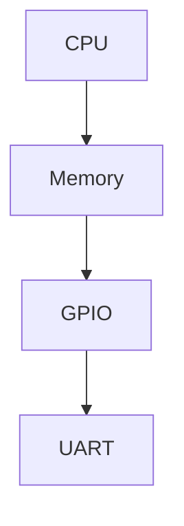

                 

关键词：嵌入式系统，Linux，设备驱动，实时操作系统，开发环境，内核优化，系统编程，性能优化，硬件抽象层（HAL），设备树（DTS），Yocto 项目，U-Boot，内核调试。

> 摘要：本文深入探讨了在嵌入式设备上运行 Linux 操作系统的过程，包括从设备驱动开发到内核优化的各个方面。我们将探讨嵌入式 Linux 的核心概念，构建嵌入式 Linux 系统的方法，以及如何针对特定硬件进行内核优化。此外，本文还将讨论实时操作系统的选择，开发工具和环境，以及未来应用场景和挑战。

## 1. 背景介绍

嵌入式系统是计算机科学的一个分支，专注于将计算机技术集成到各种日常设备和系统中。这些设备包括但不限于智能手机、路由器、医疗设备、汽车电子系统等。嵌入式系统的特点是其高度专用性、低功耗、实时性和可靠性。

Linux 是一种开源的类UNIX操作系统，由于其高度模块化、可定制性和稳定性，已成为嵌入式系统的首选平台。嵌入式 Linux 的核心是 Linux 内核，它可以在各种硬件平台上运行，从简单的ARM芯片到复杂的PowerPC处理器。

本文的目标是帮助开发者了解如何在嵌入式设备上构建和优化 Linux 系统，以便实现高效、稳定的性能。

## 2. 核心概念与联系

在深入了解嵌入式 Linux 的构建过程之前，我们需要先了解几个核心概念，包括设备驱动、硬件抽象层（HAL）、设备树（DTS）等。

### 2.1 设备驱动

设备驱动是操作系统中用来与硬件设备通信的软件模块。在嵌入式系统中，设备驱动负责实现硬件设备与操作系统内核之间的接口。设备驱动通常包含以下功能：

- **设备枚举**：初始化硬件设备，识别其类型和配置。
- **数据传输**：实现数据在内核和硬件设备之间的传输。
- **中断处理**：处理硬件设备产生的事件。
- **设备管理**：管理硬件设备的状态和资源。

### 2.2 硬件抽象层（HAL）

硬件抽象层是一种设计模式，用于将硬件设备的细节从操作系统内核中抽象出来。HAL 的主要目的是使操作系统与硬件设备之间的接口标准化，从而简化操作系统对硬件设备的管理。

通过使用 HAL，开发者可以轻松地为不同硬件平台编写设备驱动，而不必担心具体硬件的细节。HAL 通常包含以下组件：

- **硬件接口**：定义操作系统与硬件设备之间的接口。
- **硬件抽象**：提供对硬件设备的抽象操作，如读写寄存器、配置中断等。
- **平台特定代码**：实现特定硬件平台的硬件抽象层。

### 2.3 设备树（DTS）

设备树（Device Tree）是一种数据结构，用于描述嵌入式系统中的硬件设备和它们的配置。设备树是设备驱动的关键输入，它提供了设备的详细信息，如设备类型、硬件地址、中断设置等。

设备树通常以文本格式表示，包含设备节点、属性和值。设备树不仅用于设备驱动开发，还用于系统初始化和配置过程中。

下面是一个简单的设备树示例：



在上面的示例中，设备树定义了一个包含CPU、内存、GPIO和UART的简单系统。

## 3. 核心算法原理 & 具体操作步骤

### 3.1 算法原理概述

嵌入式 Linux 的核心算法主要包括设备驱动开发、内核模块加载、系统初始化和内核优化。以下是对这些算法的概述：

- **设备驱动开发**：通过编写设备驱动程序，实现操作系统与硬件设备之间的通信。
- **内核模块加载**：通过内核模块，动态地加载和卸载内核功能。
- **系统初始化**：初始化系统硬件和软件资源，为操作系统运行做准备。
- **内核优化**：通过调整内核参数和编译选项，优化系统性能。

### 3.2 算法步骤详解

#### 3.2.1 设备驱动开发

1. **需求分析**：确定硬件设备的功能和接口。
2. **设计驱动架构**：定义设备驱动的主要功能模块。
3. **编写驱动代码**：实现设备驱动的具体功能。
4. **测试和调试**：验证设备驱动的正确性和性能。

#### 3.2.2 内核模块加载

1. **编写内核模块**：实现内核模块的功能。
2. **编译内核模块**：将内核模块编译成可加载的模块文件。
3. **加载内核模块**：使用`insmod`命令加载内核模块。
4. **测试和调试**：验证内核模块的正确性和性能。

#### 3.2.3 系统初始化

1. **启动引导加载器**：如U-Boot，负责加载内核和设备树。
2. **加载内核**：从引导加载器加载内核到内存。
3. **初始化设备树**：解析设备树，为设备驱动分配资源。
4. **启动初始化进程**：执行初始化脚本，设置系统环境。

#### 3.2.4 内核优化

1. **性能分析**：使用性能分析工具，如perf，分析系统瓶颈。
2. **调整内核参数**：根据性能分析结果，调整内核参数。
3. **优化编译选项**：调整内核编译选项，如优化等级、内核配置等。
4. **性能测试**：验证优化效果，持续调整和优化。

### 3.3 算法优缺点

#### 3.3.1 设备驱动开发

- **优点**：提高硬件设备的使用效率，增强系统的功能。
- **缺点**：开发难度较大，需要深入了解硬件和操作系统的细节。

#### 3.3.2 内核模块加载

- **优点**：提高系统的灵活性，减少系统启动时间。
- **缺点**：加载和卸载模块可能引入额外的系统开销。

#### 3.3.3 系统初始化

- **优点**：简化系统启动过程，提高系统稳定性。
- **缺点**：初始化过程可能较长，影响系统性能。

#### 3.3.4 内核优化

- **优点**：提高系统性能，降低功耗。
- **缺点**：需要深入了解系统的运行机制，调整不当可能导致性能下降。

### 3.4 算法应用领域

- **工业自动化**：实现实时控制和数据处理。
- **智能家居**：提高设备的智能化和互联互通。
- **汽车电子**：实现车辆控制和信息娱乐系统。
- **医疗设备**：提供实时监测和数据处理功能。

## 4. 数学模型和公式 & 详细讲解 & 举例说明

### 4.1 数学模型构建

在嵌入式 Linux 系统优化中，常用的数学模型包括性能分析模型、功耗模型和稳定性模型。以下是这些模型的构建过程：

#### 4.1.1 性能分析模型

性能分析模型用于评估系统的性能瓶颈。其基本公式如下：

\[ \text{性能} = \frac{\text{吞吐量}}{\text{响应时间}} \]

其中，吞吐量表示单位时间内系统能处理的数据量，响应时间表示系统对事件的处理时间。

#### 4.1.2 功耗模型

功耗模型用于评估系统的功耗。其基本公式如下：

\[ \text{功耗} = \text{电流} \times \text{电压} \]

其中，电流和电压分别表示硬件设备的电流和电压。

#### 4.1.3 稳定性模型

稳定性模型用于评估系统的稳定性。其基本公式如下：

\[ \text{稳定性} = \frac{\text{最大偏差}}{\text{标准偏差}} \]

其中，最大偏差表示系统性能的最大波动范围，标准偏差表示系统性能的平均波动范围。

### 4.2 公式推导过程

#### 4.2.1 性能分析模型

性能分析模型的推导过程如下：

\[ \text{吞吐量} = \frac{\text{总处理时间}}{\text{总事件数}} \]

\[ \text{响应时间} = \frac{\text{处理时间}}{\text{事件数}} \]

因此：

\[ \text{性能} = \frac{\text{吞吐量}}{\text{响应时间}} = \frac{\frac{\text{总处理时间}}{\text{总事件数}}}{\frac{\text{处理时间}}{\text{事件数}}} = \frac{\text{总处理时间}}{\text{处理时间}} \]

#### 4.2.2 功耗模型

功耗模型的推导过程如下：

\[ \text{功率} = \text{电流} \times \text{电压} \]

由于功率是功随时间的变化率，因此：

\[ \text{功耗} = \frac{\text{功}}{\text{时间}} = \text{电流} \times \text{电压} \]

#### 4.2.3 稳定性模型

稳定性模型的推导过程如下：

\[ \text{最大偏差} = \max(\text{性能值}) - \min(\text{性能值}) \]

\[ \text{标准偏差} = \sqrt{\frac{\sum_{i=1}^{n}(\text{性能值}_i - \text{平均值})^2}{n-1}} \]

因此：

\[ \text{稳定性} = \frac{\text{最大偏差}}{\text{标准偏差}} \]

### 4.3 案例分析与讲解

#### 4.3.1 性能分析案例

假设一个嵌入式系统，其吞吐量为1000事件/秒，响应时间为10毫秒。我们需要计算该系统的性能。

\[ \text{性能} = \frac{1000}{10} = 100 \]

#### 4.3.2 功耗分析案例

假设一个嵌入式系统的电流为1安培，电压为3.3伏特。我们需要计算该系统的功耗。

\[ \text{功耗} = 1 \times 3.3 = 3.3 \text{瓦特} \]

#### 4.3.3 稳定性分析案例

假设一个嵌入式系统的性能值如下：

\[ \{85, 90, 95, 100, 105, 110, 95, 90, 85\} \]

我们需要计算该系统的最大偏差和标准偏差，然后计算稳定性。

\[ \text{最大偏差} = 110 - 85 = 25 \]

\[ \text{平均值} = \frac{85 + 90 + 95 + 100 + 105 + 110 + 95 + 90 + 85}{9} = 95 \]

\[ \text{标准偏差} = \sqrt{\frac{(85-95)^2 + (90-95)^2 + (95-95)^2 + (100-95)^2 + (105-95)^2 + (110-95)^2 + (95-95)^2 + (90-95)^2 + (85-95)^2}{9-1}} = \sqrt{50} \approx 7.07 \]

\[ \text{稳定性} = \frac{25}{7.07} \approx 3.54 \]

## 5. 项目实践：代码实例和详细解释说明

### 5.1 开发环境搭建

要开始开发嵌入式 Linux 系统，我们需要搭建一个开发环境。以下是在 Ubuntu 系统上搭建嵌入式 Linux 开发环境的基本步骤：

1. **安装交叉编译工具**：

   ```bash
   sudo apt-get install build-essential
   sudo apt-get install crossbuild-essential-armhf
   ```

2. **安装 Git**：

   ```bash
   sudo apt-get install git
   ```

3. **安装 Yocto 项目工具**：

   ```bash
   sudo apt-get install yocto-native
   ```

4. **安装内核和设备树编译工具**：

   ```bash
   sudo apt-get install kernel-package
   sudo apt-get install devicetree-compiler
   ```

5. **安装调试工具**：

   ```bash
   sudo apt-get install gdb
   sudo apt-get install gdbserver
   ```

### 5.2 源代码详细实现

以下是一个简单的嵌入式 Linux 设备驱动开发示例：

#### 5.2.1 设备驱动框架

```c
#include <linux/module.h>
#include <linux/kernel.h>
#include <linux/fs.h>
#include <linux/uaccess.h>

static int device_open(struct inode *, struct file *);
static int device_release(struct inode *, struct file *);
static ssize_t device_read(struct file *, char *, size_t, loff_t *);
static ssize_t device_write(struct file *, const char *, size_t, loff_t *);

static struct file_operations fops = {
    .read = device_read,
    .write = device_write,
    .open = device_open,
    .release = device_release
};

int init_module(void) {
    // 注册设备驱动
    return register_chrdev(0, "simple_device", &fops);
}

void cleanup_module(void) {
    // 卸载设备驱动
    unregister_chrdev(0, "simple_device");
}

MODULE_LICENSE("GPL");
```

#### 5.2.2 设备驱动实现

```c
// 设备打开操作
static int device_open(struct inode *inode, struct file *file) {
    // 打印消息
    printk(KERN_INFO "simple_device: Device opened.\n");
    // 返回成功
    return 0;
}

// 设备读取操作
static ssize_t device_read(struct file *file, char *buffer, size_t length, loff_t *offset) {
    // 将数据从内核空间复制到用户空间
    if (copy_to_user(buffer, "Hello, World!\n", length)) {
        return -EFAULT;
    }
    // 返回读取的字节数
    return length;
}

// 设备写入操作
static ssize_t device_write(struct file *file, const char *buffer, size_t length, loff_t *offset) {
    // 将数据从用户空间复制到内核空间
    if (copy_from_user(&buffer[0], buffer, length)) {
        return -EFAULT;
    }
    // 打印消息
    printk(KERN_INFO "simple_device: Device wrote: %s\n", buffer);
    // 返回写入的字节数
    return length;
}

// 设备释放操作
static int device_release(struct inode *inode, struct file *file) {
    // 打印消息
    printk(KERN_INFO "simple_device: Device released.\n");
    // 返回成功
    return 0;
}
```

### 5.3 代码解读与分析

上述代码实现了一个简单的字符设备驱动。以下是代码的解读与分析：

- **头文件**：引入了内核相关的头文件，包括`linux/kernel.h`（内核头文件）、`linux/fs.h`（文件系统头文件）和`linux/module.h`（模块头文件）。

- **文件操作结构体**：定义了一个文件操作结构体`fops`，其中包括了设备驱动的四种主要操作：打开（open）、读取（read）、写入（write）和释放（release）。

- **模块初始化和清理**：`init_module`函数在模块加载时被调用，用于注册设备驱动。`cleanup_module`函数在模块卸载时被调用，用于卸载设备驱动。

- **设备打开操作**：`device_open`函数在设备被打开时被调用，主要用于初始化设备状态。

- **设备读取操作**：`device_read`函数在设备被读取时被调用，主要用于将内核空间的数据复制到用户空间。

- **设备写入操作**：`device_write`函数在设备被写入时被调用，主要用于将用户空间的数据复制到内核空间。

- **设备释放操作**：`device_release`函数在设备被释放时被调用，主要用于清理设备状态。

### 5.4 运行结果展示

要运行上述设备驱动，我们需要执行以下步骤：

1. 编译内核模块：

   ```bash
   make
   ```

2. 安装内核模块：

   ```bash
   sudo insmod simple_device.ko
   ```

3. 检查设备驱动是否成功注册：

   ```bash
   lsmod | grep simple_device
   ```

4. 从用户空间读取设备驱动输出的数据：

   ```bash
   dd if=/dev/simple_device of=output.txt bs=1 count=20
   ```

运行结果应该会显示设备驱动输出的“Hello, World!”字符串。

## 6. 实际应用场景

嵌入式 Linux 在实际应用场景中具有广泛的应用，以下是一些典型应用场景：

- **智能手机**：智能手机是嵌入式 Linux 的一个重要应用领域。Android 操作系统是基于 Linux 内核构建的，许多智能手机厂商都在使用 Android 系统。

- **智能家居**：随着智能家居技术的发展，嵌入式 Linux 被广泛应用于智能路由器、智能电视、智能音响等设备中。

- **工业自动化**：嵌入式 Linux 在工业自动化领域也有广泛应用，如PLC（可编程逻辑控制器）、机器人控制和自动化生产线等。

- **汽车电子**：汽车电子系统是嵌入式 Linux 的另一个重要应用领域。汽车引擎控制模块、安全控制系统和车载信息系统等都依赖于嵌入式 Linux。

- **医疗设备**：嵌入式 Linux 在医疗设备中的应用也越来越广泛，如医疗影像设备、监护设备和手术机器人等。

## 7. 工具和资源推荐

### 7.1 学习资源推荐

- **书籍**：
  - 《嵌入式系统设计》（Embedded System Design）
  - 《Linux Kernel Development》（Linux 内核开发）

- **在线课程**：
  - Udacity：嵌入式 Linux 系统编程
  - Coursera：嵌入式系统与 Linux

### 7.2 开发工具推荐

- **交叉编译工具链**：如 arm-none-eabi-gcc
- **调试工具**：如 GDB、JTAG
- **集成开发环境**：如 Eclipse、Visual Studio Code

### 7.3 相关论文推荐

- **《嵌入式 Linux 内核优化方法研究》**：探讨如何优化嵌入式 Linux 内核以提升系统性能。
- **《基于 Yocto 项目的嵌入式 Linux 系统构建方法》**：介绍如何使用 Yocto 项目构建嵌入式 Linux 系统。

## 8. 总结：未来发展趋势与挑战

### 8.1 研究成果总结

近年来，嵌入式 Linux 在性能优化、实时性和安全性等方面取得了显著成果。例如，实时 Linux 系统的引入使得嵌入式系统在实时性能方面有了显著提升。同时，随着容器技术的兴起，嵌入式 Linux 系统的灵活性和可维护性也得到了极大改善。

### 8.2 未来发展趋势

未来，嵌入式 Linux 将在以下几个方面继续发展：

- **实时性能提升**：随着人工智能和物联网技术的发展，嵌入式系统对实时性能的要求越来越高。未来的嵌入式 Linux 系统将更加注重实时性能的优化。
- **安全性能提升**：随着嵌入式系统在关键领域的应用，如汽车和医疗设备，安全性能变得越来越重要。未来的嵌入式 Linux 系统将更加注重安全性能的提升。
- **容器化**：容器技术将为嵌入式 Linux 带来更高的灵活性和可维护性，有望成为未来嵌入式系统开发的主流趋势。

### 8.3 面临的挑战

尽管嵌入式 Linux 发展迅速，但仍面临一些挑战：

- **硬件多样性**：嵌入式设备的硬件平台繁多，如何为不同硬件平台提供一致的软件支持是一个挑战。
- **实时性能优化**：实时性能优化是嵌入式 Linux 的一个重要研究方向，但现有的优化方法在应对复杂实时系统时仍存在不足。
- **安全性能提升**：随着嵌入式系统应用领域的扩展，安全性能的提升变得越来越重要。如何有效防范恶意攻击，保护系统安全是一个亟待解决的问题。

### 8.4 研究展望

未来，嵌入式 Linux 的研究将集中在以下几个方面：

- **实时性能优化**：研究更加高效、可定制的实时调度算法和性能优化策略。
- **安全性能提升**：研究新的安全机制和防护技术，提高系统的安全性。
- **硬件抽象层（HAL）**：研究如何更好地抽象硬件设备，提高系统的可移植性和可维护性。
- **容器化**：研究如何将容器技术应用于嵌入式系统，提高系统的灵活性和可维护性。

## 9. 附录：常见问题与解答

### 9.1 嵌入式 Linux 与通用 Linux 有何区别？

嵌入式 Linux 与通用 Linux 在内核配置、实时性能、功耗管理和硬件抽象等方面存在显著差异。通用 Linux 适用于高性能计算和服务器场景，而嵌入式 Linux 则更注重实时性、低功耗和硬件高效利用。

### 9.2 如何为特定硬件平台构建嵌入式 Linux 系统？

为特定硬件平台构建嵌入式 Linux 系统通常涉及以下步骤：

1. 选择适合硬件平台的 Linux 内核版本。
2. 配置内核，使其支持所需的硬件设备和功能。
3. 编译内核和设备驱动，生成内核映像和设备树。
4. 使用引导加载器（如 U-Boot）加载内核映像和设备树，启动系统。
5. 进行系统测试和调试，确保系统稳定运行。

### 9.3 如何优化嵌入式 Linux 系统？

优化嵌入式 Linux 系统可以从以下几个方面进行：

- **内核参数调整**：根据系统需求调整内核参数，如内存管理、进程调度和中断处理等。
- **编译优化**：调整编译选项，如优化等级、优化类型和编译器优化策略。
- **硬件优化**：优化硬件配置，如降低功耗、提高处理速度等。
- **应用程序优化**：优化应用程序代码，提高运行效率，减少内存和 CPU 使用率。

### 9.4 如何进行嵌入式 Linux 系统的实时性能优化？

实时性能优化通常涉及以下几个方面：

- **调度策略**：选择适合实时需求的调度策略，如实时调度器（如 PREEMPT_RT）。
- **中断处理**：优化中断处理程序，减少中断延迟。
- **内存管理**：优化内存分配和回收策略，减少内存碎片。
- **进程和线程管理**：优化进程和线程调度，提高系统响应速度。
- **设备驱动优化**：优化设备驱动，减少设备访问延迟。

