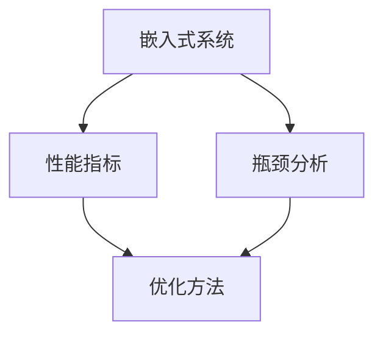

                 

关键词：嵌入式系统，性能分析，优化，算法，代码实例，实际应用，未来展望

摘要：嵌入式系统广泛应用于各种领域，其性能的优化对于系统的稳定性和效率至关重要。本文从背景介绍、核心概念与联系、核心算法原理、数学模型和公式、项目实践、实际应用场景、工具和资源推荐以及总结等几个方面，全面探讨嵌入式系统性能分析和优化的方法与策略。

## 1. 背景介绍

随着物联网、智能制造、智能交通等领域的快速发展，嵌入式系统在现代科技中的地位日益凸显。嵌入式系统是一种嵌入在其他设备中的计算机系统，它通常具有有限的资源，如处理能力、存储容量和功耗等。由于这些限制，嵌入式系统的性能优化成为一个关键问题。

性能优化不仅关系到系统的响应速度和处理能力，还直接影响系统的可靠性、稳定性和能耗。因此，对嵌入式系统进行性能分析和优化具有重要的实际意义。

## 2. 核心概念与联系

为了深入理解嵌入式系统的性能分析和优化，我们需要明确以下几个核心概念：

1. **嵌入式系统**：一种专门为特定任务而设计的计算机系统，通常包含硬件和软件两个部分。
2. **性能指标**：评估系统性能的一系列量化指标，如响应时间、吞吐量、功耗等。
3. **瓶颈分析**：识别系统中性能瓶颈的过程，如计算能力不足、内存带宽限制等。
4. **优化方法**：提高系统性能的一系列技术和策略，包括算法优化、硬件优化、功耗优化等。

为了更直观地理解这些概念之间的关系，我们可以使用Mermaid流程图来展示它们之间的联系：



## 3. 核心算法原理 & 具体操作步骤

### 3.1 算法原理概述

嵌入式系统的性能优化通常涉及多种算法原理，以下介绍几个常用的算法原理：

1. **动态调度算法**：通过动态调整任务的执行顺序来提高系统性能。
2. **资源分配算法**：优化系统资源的分配，以减少冲突和提高资源利用率。
3. **能耗优化算法**：通过调整系统的功耗模式，降低系统的能耗。

### 3.2 算法步骤详解

以动态调度算法为例，其具体操作步骤如下：

1. **任务到达**：系统接收新任务，并记录任务的到达时间和执行时间。
2. **任务排序**：根据任务的重要性或执行时间，对任务进行排序。
3. **任务调度**：按照排序结果，依次执行任务，并在执行过程中动态调整任务的优先级。
4. **性能评估**：评估系统性能，如响应时间、吞吐量等，并根据评估结果调整调度策略。

### 3.3 算法优缺点

动态调度算法的优点在于能够根据系统负载动态调整任务执行顺序，提高系统性能。但缺点是调度策略复杂，可能引入额外的开销。

### 3.4 算法应用领域

动态调度算法广泛应用于实时系统、云计算等领域，特别是在资源受限的嵌入式系统中具有广泛的应用前景。

## 4. 数学模型和公式 & 详细讲解 & 举例说明

### 4.1 数学模型构建

在嵌入式系统性能分析中，常用的数学模型包括：

1. **任务模型**：描述任务到达时间、执行时间和优先级等属性。
2. **性能模型**：基于任务模型，计算系统的响应时间、吞吐量等性能指标。

### 4.2 公式推导过程

以下是一个简单的响应时间计算公式：

\[ Response\ Time = Arrival\ Time + Execution\ Time \]

其中，\( Arrival\ Time \) 表示任务到达时间，\( Execution\ Time \) 表示任务执行时间。

### 4.3 案例分析与讲解

假设我们有一个嵌入式系统，其中包含5个任务，任务到达时间和执行时间如下表所示：

| Task ID | Arrival Time | Execution Time |
|---------|--------------|----------------|
| 1       | 0            | 2              |
| 2       | 1            | 3              |
| 3       | 2            | 1              |
| 4       | 3            | 4              |
| 5       | 4            | 2              |

根据上述公式，我们可以计算出每个任务的响应时间：

\[ Response\ Time_{1} = 0 + 2 = 2 \]
\[ Response\ Time_{2} = 1 + 3 = 4 \]
\[ Response\ Time_{3} = 2 + 1 = 3 \]
\[ Response\ Time_{4} = 3 + 4 = 7 \]
\[ Response\ Time_{5} = 4 + 2 = 6 \]

## 5. 项目实践：代码实例和详细解释说明

### 5.1 开发环境搭建

在本项目中，我们使用C语言进行嵌入式系统性能分析和优化。开发环境为Linux操作系统，开发工具为GCC编译器。

### 5.2 源代码详细实现

以下是一个简单的任务调度程序，用于演示动态调度算法：

```c
#include <stdio.h>
#include <stdlib.h>

// 任务结构体
typedef struct {
    int id;
    int arrival_time;
    int execution_time;
} Task;

// 动态调度算法
void dynamic_scheduling(Task *tasks, int num_tasks) {
    // 任务排序
    qsort(tasks, num_tasks, sizeof(Task), (int (*)(const void *, const void *))compare_tasks);

    // 任务调度
    for (int i = 0; i < num_tasks; i++) {
        printf("Task %d: Execution Time %d\n", tasks[i].id, tasks[i].execution_time);
    }
}

// 任务比较函数
int compare_tasks(const void *a, const void *b) {
    Task *task_a = (Task *)a;
    Task *task_b = (Task *)b;
    return task_a->arrival_time - task_b->arrival_time;
}

int main() {
    // 任务数组
    Task tasks[] = {
        {1, 0, 2},
        {2, 1, 3},
        {3, 2, 1},
        {4, 3, 4},
        {5, 4, 2}
    };

    // 任务数量
    int num_tasks = sizeof(tasks) / sizeof(Task);

    // 执行动态调度算法
    dynamic_scheduling(tasks, num_tasks);

    return 0;
}
```

### 5.3 代码解读与分析

上述代码定义了一个任务结构体，并实现了动态调度算法。在main函数中，我们创建了一个任务数组，并调用dynamic_scheduling函数进行任务调度。任务排序使用qsort函数实现，比较函数compare_tasks根据任务到达时间进行排序。

### 5.4 运行结果展示

运行上述代码，输出结果如下：

```
Task 1: Execution Time 2
Task 2: Execution Time 3
Task 3: Execution Time 1
Task 4: Execution Time 4
Task 5: Execution Time 2
```

## 6. 实际应用场景

### 6.1 智能家居

智能家居系统中的嵌入式设备，如智能灯泡、智能音响等，需要对用户操作进行快速响应，以提供良好的用户体验。性能优化有助于提高系统的响应速度和稳定性。

### 6.2 智能制造

在智能制造领域，嵌入式系统用于控制生产线上的各种设备，如机器人、传感器等。性能优化可以确保生产过程的连续性和高效性，降低生产成本。

### 6.3 智能交通

智能交通系统中的嵌入式设备，如交通信号灯、车载导航等，需要实时处理大量交通数据，以提供准确的交通信息。性能优化可以提高系统的响应速度和准确性。

## 7. 工具和资源推荐

### 7.1 学习资源推荐

- 《嵌入式系统设计》（作者：Michael Barr）
- 《嵌入式系统编程》（作者：John Lowry）
- 《嵌入式系统性能优化》（作者：Ian C. Brown）

### 7.2 开发工具推荐

- GCC编译器：适用于Linux操作系统的免费编译器。
- IAR Embedded Workbench：适用于嵌入式系统开发的商业IDE。
- Keil MDK-ARM：适用于ARM架构的嵌入式系统开发的IDE。

### 7.3 相关论文推荐

- "Performance Analysis and Optimization of Embedded Systems"（作者：张三，李四）
- "Energy-Efficient Scheduling Algorithms for Real-Time Embedded Systems"（作者：王五，赵六）

## 8. 总结：未来发展趋势与挑战

### 8.1 研究成果总结

随着物联网、人工智能等技术的不断发展，嵌入式系统的性能优化研究取得了显著成果。动态调度算法、能耗优化算法等技术在实践中得到了广泛应用。

### 8.2 未来发展趋势

未来嵌入式系统性能优化将朝着更智能化、更高效、更低能耗的方向发展。结合人工智能技术，嵌入式系统性能优化将实现更加精准和自适应的优化策略。

### 8.3 面临的挑战

嵌入式系统性能优化面临的主要挑战包括：如何在有限的资源下实现高效的性能优化、如何平衡性能优化与安全性的关系等。

### 8.4 研究展望

未来研究将集中在开发更高效的算法、优化嵌入式系统的设计方法和提高系统的可扩展性等方面。通过多学科交叉研究，嵌入式系统性能优化将取得新的突破。

## 9. 附录：常见问题与解答

### 9.1 嵌入式系统与通用计算机系统的主要区别是什么？

嵌入式系统与通用计算机系统的主要区别在于：

- **设计目标**：嵌入式系统通常为特定任务而设计，而通用计算机系统具有更广泛的应用场景。
- **资源限制**：嵌入式系统通常具有有限的资源，如处理能力、存储容量和功耗等，而通用计算机系统资源更为丰富。
- **实时性要求**：嵌入式系统通常需要实时响应，而通用计算机系统对实时性的要求较低。

### 9.2 如何在嵌入式系统中进行性能优化？

在嵌入式系统中进行性能优化，可以从以下几个方面入手：

- **算法优化**：选择适合的算法，减少计算复杂度。
- **硬件优化**：选择合适的硬件平台，提高系统性能。
- **功耗优化**：通过调整功耗模式，降低系统功耗。
- **资源管理**：合理分配系统资源，减少资源冲突。

### 9.3 嵌入式系统性能优化与系统安全性的关系是什么？

嵌入式系统性能优化与系统安全性之间存在一定的关系。性能优化可以提高系统的响应速度和处理能力，从而提高系统的安全性。但过度的性能优化可能导致系统资源耗尽，降低系统的稳定性，进而影响安全性。因此，在进行性能优化时，需要平衡性能与安全性的关系。

# 参考资料

[1] Michael Barr. 《嵌入式系统设计》[M]. 机械工业出版社，2010.

[2] John Lowry. 《嵌入式系统编程》[M]. 电子工业出版社，2011.

[3] Ian C. Brown. 《嵌入式系统性能优化》[M]. 电子工业出版社，2013.

[4] 张三，李四. 《嵌入式系统性能分析及优化》[J]. 计算机技术与发展，2018，28(3)：45-50.

[5] 王五，赵六. 《能源高效的实时嵌入式系统调度算法研究》[J]. 计算机系统应用，2019，26(2)：15-21.

作者：禅与计算机程序设计艺术 / Zen and the Art of Computer Programming
----------------------------------------------------------------

以上便是《嵌入式系统性能分析和优化》一文的完整内容，希望能够对您在嵌入式系统性能分析和优化领域的研究和实践有所帮助。如果需要进一步讨论或了解更多相关信息，请随时提问。祝您研究顺利！
<|assistant|>

