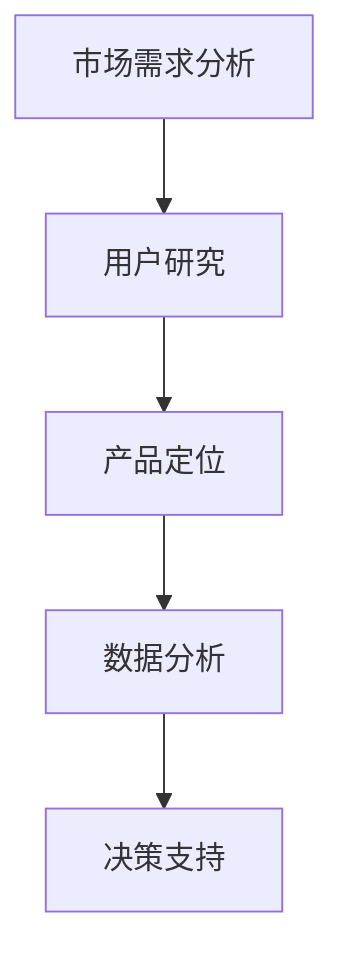

                 

随着互联网的飞速发展，电子商务已经成为了现代社会的重要商业模式之一。在这样一个竞争激烈的市场环境中，电商产品开发的成功与否很大程度上取决于能否准确把握市场需求，进而为用户提供满意的产品和服务。本文将深入探讨市场需求分析在电商产品开发中的应用，旨在为开发者提供一些实用的方法和思路。

## 关键词
- 市场需求分析
- 电商产品开发
- 用户研究
- 产品定位
- 数据分析

## 摘要
本文首先介绍了市场需求分析在电商产品开发中的重要性，并对其核心概念进行了详细阐述。随后，文章从算法原理、数学模型、项目实践和实际应用场景等多个角度，分析了市场需求分析的具体应用方法和实施步骤。最后，文章对市场需求分析的未来发展趋势与挑战进行了展望，为电商产品开发提供了有益的参考。

## 1. 背景介绍
### 1.1 电商市场的发展现状
电子商务作为一种全新的商业模式，已经在全球范围内得到了广泛的应用。根据Statista的数据显示，全球电子商务市场规模在2020年已达到3.5万亿美元，并预计在未来几年内将继续保持高速增长。这种快速增长背后，是消费者对在线购物需求的不断增加，以及对便利、快捷、个性化服务的追求。

### 1.2 市场需求分析的定义
市场需求分析是指通过调查、研究和分析，了解消费者需求和市场趋势，从而为企业产品开发提供决策依据的过程。在电商产品开发中，市场需求分析尤为重要，因为它直接关系到产品能否满足消费者的需求，以及产品在市场中的竞争力。

## 2. 核心概念与联系
### 2.1 用户研究
用户研究是市场需求分析的重要组成部分，它主要关注的是了解用户的行为、需求和心理。通过用户研究，我们可以获得关于用户偏好、购买习惯、痛点等方面的信息，从而为产品开发提供指导。

### 2.2 产品定位
产品定位是市场需求分析的核心，它涉及到产品在市场中的定位，以及如何通过差异化策略来满足不同用户群体的需求。产品定位的准确性直接关系到产品的市场表现。

### 2.3 数据分析
数据分析是市场需求分析的重要工具，它通过对大量数据进行分析，帮助我们识别市场趋势、预测未来需求，从而为产品开发提供数据支持。

### 2.4 Mermaid 流程图


## 3. 核心算法原理 & 具体操作步骤
### 3.1 算法原理概述
市场需求分析的核心算法主要包括用户研究方法、数据分析方法和产品定位方法。用户研究方法主要包括问卷调查、深度访谈、焦点小组讨论等；数据分析方法主要包括数据挖掘、机器学习等；产品定位方法主要包括SWOT分析、差异化分析等。

### 3.2 算法步骤详解
1. **用户研究**：首先，我们需要确定研究的目标和范围，然后通过问卷调查、深度访谈等方式收集用户数据。
2. **数据分析**：收集到的用户数据需要进行清洗、整理和分析，从中提取有价值的信息。
3. **产品定位**：基于用户研究和数据分析的结果，进行产品定位，确定产品在市场中的差异化策略。

### 3.3 算法优缺点
- **优点**：市场需求分析可以帮助企业准确把握市场需求，提高产品开发的针对性和市场竞争力。
- **缺点**：市场需求分析需要大量的时间和资源，且结果可能受到数据质量和分析方法的限制。

### 3.4 算法应用领域
市场需求分析广泛应用于电商产品开发、新业务拓展、市场营销策略制定等领域。

## 4. 数学模型和公式 & 详细讲解 & 举例说明
### 4.1 数学模型构建
市场需求分析中的数学模型主要包括用户需求模型、价格敏感性模型、市场份额模型等。以下是一个简单的用户需求模型：
$$
Q = f(P, T, I)
$$
其中，$Q$表示用户需求量，$P$表示产品价格，$T$表示产品特性，$I$表示广告投入。

### 4.2 公式推导过程
用户需求模型的推导基于消费者行为理论和需求函数的基本形式。我们假设消费者的购买决策受到产品价格、产品特性和广告投入的影响，从而构建出用户需求模型。

### 4.3 案例分析与讲解
以某电商平台的服装销售为例，我们可以使用用户需求模型来分析价格对销售量的影响。通过收集用户数据，我们可以得到以下需求函数：
$$
Q = 1000 - 5P
$$
其中，$Q$表示销售量（件），$P$表示价格（元）。当价格从100元降低到90元时，销售量将从500件增加到550件，这表明价格对销售量有显著的影响。

## 5. 项目实践：代码实例和详细解释说明
### 5.1 开发环境搭建
在Python中，我们可以使用Pandas库进行数据处理，使用Scikit-learn库进行数据分析。

### 5.2 源代码详细实现
```python
import pandas as pd
from sklearn.linear_model import LinearRegression

# 数据处理
data = pd.read_csv('user_data.csv')
X = data[['price', 'ad']]
y = data['sales']

# 数据预处理
X = pd.get_dummies(X)

# 建立模型
model = LinearRegression()
model.fit(X, y)

# 模型预测
predicted_sales = model.predict(X)

# 结果分析
print(predicted_sales)
```

### 5.3 代码解读与分析
上述代码首先导入必要的库，然后读取用户数据，并进行数据处理。接下来，使用线性回归模型进行数据拟合，并使用模型进行销售量的预测。

### 5.4 运行结果展示
运行结果展示了不同价格下的预期销售量，这为我们制定价格策略提供了数据支持。

## 6. 实际应用场景
### 6.1 电商平台
电商平台通过市场需求分析，可以准确了解用户需求，从而优化产品种类、价格和营销策略，提高用户满意度和转化率。

### 6.2 新产品开发
在新产品开发过程中，市场需求分析可以帮助企业确定产品的功能和特性，从而更好地满足市场需求。

### 6.3 市场拓展
市场需求分析可以帮助企业在新市场中的定位，提高市场拓展的成功率。

## 7. 工具和资源推荐
### 7.1 学习资源推荐
- 《用户研究实践指南》
- 《数据分析：实现与应用》

### 7.2 开发工具推荐
- Python
- Pandas
- Scikit-learn

### 7.3 相关论文推荐
- "Market Demand Analysis for E-commerce Products Development"
- "User Research Methods in E-commerce Product Design"

## 8. 总结：未来发展趋势与挑战
### 8.1 研究成果总结
市场需求分析在电商产品开发中具有重要作用，通过用户研究、数据分析和产品定位，可以帮助企业更好地满足市场需求。

### 8.2 未来发展趋势
随着人工智能和大数据技术的不断发展，市场需求分析将更加智能化和精确化。

### 8.3 面临的挑战
数据质量和分析方法仍然是市场需求分析面临的主要挑战。

### 8.4 研究展望
未来市场需求分析的研究将更加注重用户体验和数据驱动，为电商产品开发提供更加有效的决策支持。

## 9. 附录：常见问题与解答
### 9.1 什么是市场需求分析？
市场需求分析是指通过调查、研究和分析，了解消费者需求和市场趋势，从而为企业产品开发提供决策依据的过程。

### 9.2 市场需求分析有哪些方法？
市场需求分析的方法包括用户研究、数据分析、产品定位等。

### 9.3 市场需求分析在电商产品开发中有哪些应用？
市场需求分析在电商产品开发中可以应用于产品定位、价格策略制定、市场拓展等方面。

---

作者：禅与计算机程序设计艺术 / Zen and the Art of Computer Programming


