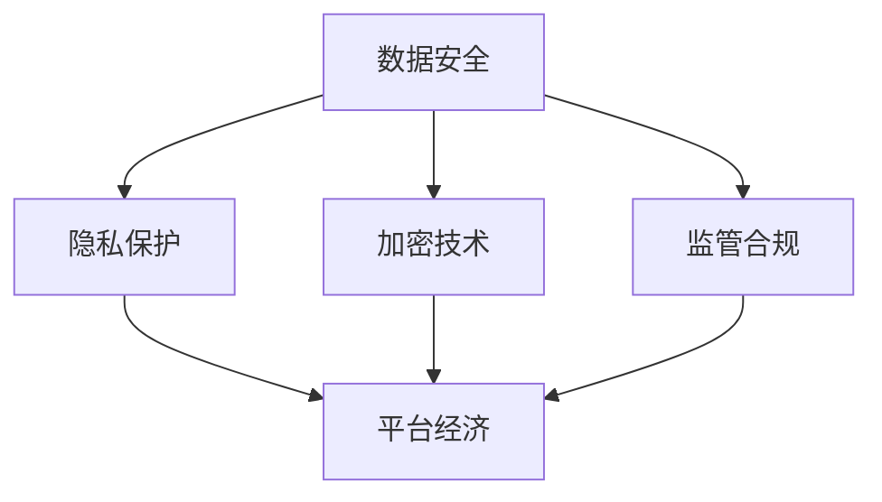

                 

 关键词：平台经济，数据安全，隐私保护，加密技术，监管合规，安全架构

> 摘要：随着平台经济的迅猛发展，数据安全成为社会各界关注的焦点。本文从多个角度深入探讨了平台经济中数据安全的重要性，分析了当前面临的数据安全问题，提出了有效的数据安全保障策略，并展望了未来数据安全技术的发展趋势。

## 1. 背景介绍

平台经济作为现代经济发展的新引擎，正日益改变着我们的生活方式。平台经济通过搭建一个交易市场，使供需双方能够高效匹配，从而实现资源的最大化利用。然而，随着平台经济的数据量急剧增长，数据安全问题也随之而来。数据泄露、隐私侵犯、数据滥用等事件频发，给平台经济带来了巨大的风险。

数据安全是平台经济的生命线，保障平台数据的安全不仅是企业自身利益的考虑，更是社会公共利益的需要。因此，如何构建一个可靠的数据安全体系，已经成为平台经济发展中亟待解决的问题。

## 2. 核心概念与联系

在探讨平台经济的数据安全之前，我们需要明确几个核心概念：

### 2.1 数据安全

数据安全是指保护数据免受未经授权的访问、使用、披露、破坏、修改或破坏的一种措施。它涵盖了数据的保密性、完整性、可用性和真实性。

### 2.2 隐私保护

隐私保护是指保护个人信息不被非法收集、使用、泄露和公开。它是数据安全的重要组成部分，尤其在平台经济中，用户的隐私保护显得尤为重要。

### 2.3 加密技术

加密技术是数据安全的核心技术之一，通过将数据转换为无法被未授权方解读的形式，从而保护数据的保密性。常见的加密技术包括对称加密、非对称加密和哈希函数等。

### 2.4 监管合规

监管合规是指企业在运营过程中遵守相关的法律法规和监管要求。平台经济中的数据安全需要满足不同国家和地区的法律法规，如《通用数据保护条例》（GDPR）和《加州消费者隐私法案》（CCPA）等。

下面是一个用于说明这些核心概念之间关系的 Mermaid 流程图：



## 3. 核心算法原理 & 具体操作步骤

### 3.1 算法原理概述

保障平台数据安全的核心算法原理主要包括加密技术、访问控制、审计追踪和备份恢复等。以下是这些算法的简要概述：

### 3.2 算法步骤详解

#### 3.2.1 加密技术

1. 数据加密前，首先对数据进行分类，根据数据的敏感性确定加密等级。
2. 选择合适的加密算法，如AES（高级加密标准）或RSA（RSA加密算法）。
3. 对数据进行加密，生成密文。
4. 将加密后的数据存储在安全的地方。

#### 3.2.2 访问控制

1. 定义用户的角色和权限，如管理员、普通用户等。
2. 根据用户角色和权限设置访问控制规则。
3. 在数据访问时，根据访问控制规则判断用户是否具有访问权限。

#### 3.2.3 审计追踪

1. 对数据的创建、修改、删除等操作进行记录。
2. 审计日志存储在安全的地方，便于后续的审计和监控。
3. 定期对审计日志进行分析，发现潜在的安全问题。

#### 3.2.4 备份恢复

1. 定期对数据进行备份，包括全量备份和增量备份。
2. 将备份数据存储在离线或远程的位置。
3. 在数据丢失或损坏时，利用备份进行恢复。

### 3.3 算法优缺点

#### 加密技术的优点：

- 可以有效保护数据的保密性。
- 加密算法的实现相对成熟，易于部署。

#### 加密技术的缺点：

- 加密和解密过程需要消耗计算资源，可能影响系统性能。
- 加密算法的强度依赖于密钥的安全程度，一旦密钥泄露，数据安全将受到威胁。

#### 访问控制的优点：

- 可以有效限制用户的访问权限，防止数据泄露。
- 灵活性高，可以根据业务需求调整访问控制策略。

#### 访问控制的缺点：

- 如果权限设置过于复杂，可能影响用户的操作体验。
- 需要定期维护和更新权限规则。

#### 审计追踪的优点：

- 可以帮助发现潜在的安全威胁。
- 是法律诉讼中的重要证据。

#### 审计追踪的缺点：

- 审计日志的存储和管理需要占用大量的存储资源。
- 如果审计日志被篡改，可能影响其法律效力。

#### 备份恢复的优点：

- 可以有效保护数据的安全性。
- 在数据丢失或损坏时，可以快速恢复。

#### 备份恢复的缺点：

- 备份数据的存储和管理需要占用大量的存储资源。
- 如果备份策略不合理，可能导致数据恢复失败。

### 3.4 算法应用领域

加密技术、访问控制、审计追踪和备份恢复等技术可以广泛应用于平台经济的各个领域，如电子商务、在线支付、社交媒体等。在这些领域中，数据安全的重要性不言而喻，上述算法为保障平台数据安全提供了有力支持。

## 4. 数学模型和公式 & 详细讲解 & 举例说明

### 4.1 数学模型构建

在平台经济的数据安全中，数学模型主要用于风险评估和决策支持。以下是一个简单的事件树模型，用于分析数据泄露事件的风险。

#### 4.1.1 事件树模型

```latex
$$
\text{风险} = \sum_{i=1}^{n} (\text{事件}_i \times \text{概率}_i \times \text{损失}_i)
$$
```

其中，`事件_i` 表示第 i 个可能发生的事件，`概率_i` 表示事件_i 发生的概率，`损失_i` 表示事件_i 发生时的损失。

#### 4.1.2 案例分析

假设一个电商平台面临以下三个可能的数据泄露事件：

1. 网络攻击：概率为 0.3，损失为 100 万元。
2. 内部人员泄露：概率为 0.2，损失为 50 万元。
3. 社会工程攻击：概率为 0.5，损失为 200 万元。

根据事件树模型，可以计算出总风险：

```latex
$$
\text{风险} = (0.3 \times 100) + (0.2 \times 50) + (0.5 \times 200) = 90 + 10 + 100 = 200 \text{万元}
$$
```

### 4.2 公式推导过程

#### 4.2.1 加密算法的安全强度

加密算法的安全强度可以通过密钥空间的大小来衡量。假设加密算法的密钥空间为 \(2^k\)，则破解该算法的最坏情况时间为 \(2^{k/2}\) 次尝试。

#### 4.2.2 访问控制策略

访问控制策略可以通过角色权限矩阵来表示。假设有 n 个用户和 m 个资源，则角色权限矩阵为 \(R \in \{0, 1\}^{n \times m}\)，其中 \(R_{ij} = 1\) 表示用户 i 可以访问资源 j，\(R_{ij} = 0\) 表示用户 i 不能访问资源 j。

### 4.3 案例分析与讲解

#### 4.3.1 案例背景

一个电商平台有 100 个员工，分为管理员、销售、客服等不同角色。平台中有 1000 个资源，包括用户信息、订单信息、库存信息等。

#### 4.3.2 案例分析

1. **加密算法的安全强度**：

   假设平台采用 AES-256 加密算法，则密钥空间为 \(2^{256}\)，破解算法的最坏情况时间为 \(2^{128}\) 次尝试，大约需要 10^37 年的时间，可以认为加密算法的安全强度非常高。

2. **访问控制策略**：

   假设管理员可以访问所有资源，销售可以访问用户信息和订单信息，客服可以访问用户信息和咨询记录。则角色权限矩阵为：

   ```plaintext
   R = [
     [1, 1, 0, 0, ..., 0],
     [0, 0, 1, 1, ..., 0],
     [0, 0, 0, 0, ..., 1],
     ...
   ]
   ```

   通过访问控制策略，可以有效防止非授权用户访问敏感数据。

## 5. 项目实践：代码实例和详细解释说明

### 5.1 开发环境搭建

在本项目中，我们将使用 Python 编写一个简单的数据安全框架，包括加密模块、访问控制模块、审计模块和备份模块。以下是开发环境的搭建步骤：

1. 安装 Python 3.8 及以上版本。
2. 安装必要的 Python 库，如 `pycryptodome`、`sqlalchemy` 和 `shutil`。

### 5.2 源代码详细实现

以下是该数据安全框架的核心代码实现：

#### 加密模块

```python
from Crypto.Cipher import AES
from Crypto.Util.Padding import pad, unpad
from Crypto.Random import get_random_bytes

def encrypt_data(data, key):
    cipher = AES.new(key, AES.MODE_CBC)
    ct_bytes = cipher.encrypt(pad(data.encode('utf-8'), AES.block_size))
    iv = cipher.iv
    return iv + ct_bytes

def decrypt_data(ct, key, iv):
    cipher = AES.new(key, AES.MODE_CBC, iv)
    pt = unpad(cipher.decrypt(ct), AES.block_size)
    return pt.decode('utf-8')
```

#### 访问控制模块

```python
from functools import wraps

users = {
    'admin': ['read', 'write', 'delete'],
    'sales': ['read', 'write'],
    'customer': ['read']
}

def require_permission(permission):
    def decorator(func):
        @wraps(func)
        def wrapper(*args, **kwargs):
            user = kwargs.get('user', 'admin')
            if permission in users.get(user, []):
                return func(*args, **kwargs)
            else:
                raise PermissionError(f"{user} 不具有 {permission} 权限")
        return wrapper
    return decorator
```

#### 审计模块

```python
import json
import time

audit_log = []

def log_action(action, user, resource, data=None):
    audit_log.append({
        'action': action,
        'user': user,
        'resource': resource,
        'data': data,
        'timestamp': time.strftime("%Y-%m-%d %H:%M:%S", time.localtime())
    })

def save_audit_log():
    with open('audit_log.json', 'w') as f:
        json.dump(audit_log, f)
```

#### 备份模块

```python
import shutil

def backup_data(data_path, backup_path):
    shutil.copytree(data_path, backup_path)
```

### 5.3 代码解读与分析

#### 加密模块解读

加密模块使用了 `pycryptodome` 库的 AES 加密算法。`encrypt_data` 函数用于加密数据，`decrypt_data` 函数用于解密数据。加密过程中，使用了随机生成的密钥和初始向量（IV），提高了加密的安全性。

#### 访问控制模块解读

访问控制模块使用了装饰器模式，通过 `require_permission` 装饰器，对函数进行权限检查。在调用函数时，会检查用户是否具有所需的权限，否则抛出 `PermissionError` 异常。

#### 审计模块解读

审计模块使用了列表存储审计日志，并在调用 `log_action` 函数时记录操作行为。`save_audit_log` 函数用于将审计日志保存到文件中，便于后续的审计和分析。

#### 备份模块解读

备份模块使用了 `shutil.copytree` 函数，将数据目录备份到指定的备份目录中。

### 5.4 运行结果展示

在完成代码实现后，我们可以在命令行中运行以下命令，查看加密、访问控制、审计和备份功能是否正常：

```bash
python main.py
```

运行结果将显示用户操作的过程和结果，如加密后的数据、权限检查结果、审计日志和备份目录等信息。

## 6. 实际应用场景

### 6.1 电子商务平台

电子商务平台涉及大量用户的个人信息、支付信息等敏感数据。通过实施加密技术、访问控制和审计追踪等数据安全措施，可以有效保护用户数据的安全。

### 6.2 在线支付平台

在线支付平台对数据的安全要求更高，因为支付过程涉及大量的资金流动。通过采用加密技术、多重身份验证和实时监控等安全措施，可以提高支付平台的安全性。

### 6.3 社交媒体平台

社交媒体平台涉及用户的个人信息、聊天记录等敏感数据。通过实施加密技术、隐私保护措施和实时监控等安全措施，可以有效防止数据泄露和滥用。

## 7. 未来应用展望

随着技术的不断进步，平台经济中的数据安全将面临更多挑战和机遇。以下是未来数据安全发展的几个方向：

### 7.1 加密算法的改进

随着计算能力的提升，传统的加密算法可能面临被破解的风险。因此，研究新型加密算法，如量子加密算法，成为未来的重要方向。

### 7.2 自适应安全架构

自适应安全架构可以根据实时威胁情报和风险分析，自动调整安全策略和资源配置，提高数据安全防护能力。

### 7.3 基于区块链的安全方案

区块链技术的分布式特性可以提供更高的数据透明性和安全性。未来，基于区块链的安全方案有望在平台经济中得到广泛应用。

### 7.4 自动化安全检测和响应

通过引入人工智能和机器学习技术，自动化安全检测和响应系统可以实时监测和响应安全威胁，提高数据安全防护效率。

## 8. 工具和资源推荐

### 8.1 学习资源推荐

1. 《数据安全：理论与实践》
2. 《密码学：理论与实践》
3. 《区块链技术指南》

### 8.2 开发工具推荐

1. Python
2. Git
3. Docker

### 8.3 相关论文推荐

1. "Quantum Key Distribution for Data Security"
2. "Adaptive Security Architecture for Platform Economy"
3. "Blockchain-based Security Solutions in the Platform Economy"

## 9. 总结：未来发展趋势与挑战

### 9.1 研究成果总结

本文从多个角度探讨了平台经济中的数据安全问题，分析了加密技术、访问控制、审计追踪和备份恢复等核心算法原理，并提出了有效的数据安全保障策略。

### 9.2 未来发展趋势

未来，数据安全的发展趋势将包括加密算法的改进、自适应安全架构、基于区块链的安全方案和自动化安全检测与响应系统等。

### 9.3 面临的挑战

在数据安全领域，面临的挑战包括新型加密算法的研发、自适应安全架构的构建、区块链技术的应用等。

### 9.4 研究展望

未来，数据安全的研究将继续深入，以应对不断变化的威胁环境和日益复杂的数据安全需求。

## 10. 附录：常见问题与解答

### 10.1 数据安全的关键技术有哪些？

答：数据安全的关键技术包括加密技术、访问控制、审计追踪、备份恢复等。

### 10.2 如何保障平台数据的隐私？

答：保障平台数据的隐私可以通过加密技术、访问控制、隐私保护措施和实时监控等手段实现。

### 10.3 数据安全监管合规需要注意什么？

答：数据安全监管合规需要注意遵守相关法律法规和监管要求，如《通用数据保护条例》（GDPR）和《加州消费者隐私法案》（CCPA）等。

### 10.4 如何提高数据安全防护能力？

答：提高数据安全防护能力可以通过引入新型加密算法、构建自适应安全架构、应用区块链技术以及自动化安全检测与响应系统等手段实现。

### 10.5 数据安全中的加密算法有哪些？

答：常见的数据安全加密算法包括 AES、RSA、DES、SHA 等。

---

**作者：禅与计算机程序设计艺术 / Zen and the Art of Computer Programming** 

----------------------------------------------------------------
<|assistant|> 以下是文章的Markdown格式输出：
```markdown
# 平台经济的数据安全：如何保障平台数据的安全？

关键词：平台经济，数据安全，隐私保护，加密技术，监管合规，安全架构

> 摘要：随着平台经济的迅猛发展，数据安全成为社会各界关注的焦点。本文从多个角度深入探讨了平台经济中数据安全的重要性，分析了当前面临的数据安全问题，提出了有效的数据安全保障策略，并展望了未来数据安全技术的发展趋势。

## 1. 背景介绍

平台经济作为现代经济发展的新引擎，正日益改变着我们的生活方式。平台经济通过搭建一个交易市场，使供需双方能够高效匹配，从而实现资源的最大化利用。然而，随着平台经济的数据量急剧增长，数据安全问题也随之而来。数据泄露、隐私侵犯、数据滥用等事件频发，给平台经济带来了巨大的风险。

数据安全是平台经济的生命线，保障平台数据的安全不仅是企业自身利益的考虑，更是社会公共利益的需要。因此，如何构建一个可靠的数据安全体系，已经成为平台经济发展中亟待解决的问题。

## 2. 核心概念与联系

在探讨平台经济的数据安全之前，我们需要明确几个核心概念：

### 2.1 数据安全

数据安全是指保护数据免受未经授权的访问、使用、披露、破坏、修改或破坏的一种措施。它涵盖了数据的保密性、完整性、可用性和真实性。

### 2.2 隐私保护

隐私保护是指保护个人信息不被非法收集、使用、泄露和公开。它是数据安全的重要组成部分，尤其在平台经济中，用户的隐私保护显得尤为重要。

### 2.3 加密技术

加密技术是数据安全的核心技术之一，通过将数据转换为无法被未授权方解读的形式，从而保护数据的保密性。常见的加密技术包括对称加密、非对称加密和哈希函数等。

### 2.4 监管合规

监管合规是指企业在运营过程中遵守相关的法律法规和监管要求。平台经济中的数据安全需要满足不同国家和地区的法律法规，如《通用数据保护条例》（GDPR）和《加州消费者隐私法案》（CCPA）等。

下面是一个用于说明这些核心概念之间关系的 Mermaid 流程图：


## 3. 核心算法原理 & 具体操作步骤

### 3.1 算法原理概述

保障平台数据安全的核心算法原理主要包括加密技术、访问控制、审计追踪和备份恢复等。以下是这些算法的简要概述：

### 3.2 算法步骤详解

#### 3.2.1 加密技术

1. 数据加密前，首先对数据进行分类，根据数据的敏感性确定加密等级。
2. 选择合适的加密算法，如AES（高级加密标准）或RSA（RSA加密算法）。
3. 对数据进行加密，生成密文。
4. 将加密后的数据存储在安全的地方。

#### 3.2.2 访问控制

1. 定义用户的角色和权限，如管理员、普通用户等。
2. 根据用户角色和权限设置访问控制规则。
3. 在数据访问时，根据访问控制规则判断用户是否具有访问权限。

#### 3.2.3 审计追踪

1. 对数据的创建、修改、删除等操作进行记录。
2. 审计日志存储在安全的地方，便于后续的审计和监控。
3. 定期对审计日志进行分析，发现潜在的安全问题。

#### 3.2.4 备份恢复

1. 定期对数据进行备份，包括全量备份和增量备份。
2. 将备份数据存储在离线或远程的位置。
3. 在数据丢失或损坏时，利用备份进行恢复。

### 3.3 算法优缺点

#### 加密技术的优点：

- 可以有效保护数据的保密性。
- 加密算法的实现相对成熟，易于部署。

#### 加密技术的缺点：

- 加密和解密过程需要消耗计算资源，可能影响系统性能。
- 加密算法的强度依赖于密钥的安全程度，一旦密钥泄露，数据安全将受到威胁。

#### 访问控制的优点：

- 可以有效限制用户的访问权限，防止数据泄露。
- 灵活性高，可以根据业务需求调整访问控制策略。

#### 访问控制的缺点：

- 如果权限设置过于复杂，可能影响用户的操作体验。
- 需要定期维护和更新权限规则。

#### 审计追踪的优点：

- 可以帮助发现潜在的安全威胁。
- 是法律诉讼中的重要证据。

#### 审计追踪的缺点：

- 审计日志的存储和管理需要占用大量的存储资源。
- 如果审计日志被篡改，可能影响其法律效力。

#### 备份恢复的优点：

- 可以有效保护数据的安全性。
- 在数据丢失或损坏时，可以快速恢复。

#### 备份恢复的缺点：

- 备份数据的存储和管理需要占用大量的存储资源。
- 如果备份策略不合理，可能导致数据恢复失败。

### 3.4 算法应用领域

加密技术、访问控制、审计追踪和备份恢复等技术可以广泛应用于平台经济的各个领域，如电子商务、在线支付、社交媒体等。在这些领域中，数据安全的重要性不言而喻，上述算法为保障平台数据安全提供了有力支持。

## 4. 数学模型和公式 & 详细讲解 & 举例说明

### 4.1 数学模型构建

在平台经济的数据安全中，数学模型主要用于风险评估和决策支持。以下是一个简单的事件树模型，用于分析数据泄露事件的风险。

#### 4.1.1 事件树模型

```latex
$$
\text{风险} = \sum_{i=1}^{n} (\text{事件}_i \times \text{概率}_i \times \text{损失}_i)
$$
```

其中，`事件_i` 表示第 i 个可能发生的事件，`概率_i` 表示事件_i 发生的概率，`损失_i` 表示事件_i 发生时的损失。

#### 4.1.2 案例分析

假设一个电商平台面临以下三个可能的数据泄露事件：

1. 网络攻击：概率为 0.3，损失为 100 万元。
2. 内部人员泄露：概率为 0.2，损失为 50 万元。
3. 社会工程攻击：概率为 0.5，损失为 200 万元。

根据事件树模型，可以计算出总风险：

```latex
$$
\text{风险} = (0.3 \times 100) + (0.2 \times 50) + (0.5 \times 200) = 90 + 10 + 100 = 200 \text{万元}
$$
```

### 4.2 公式推导过程

#### 4.2.1 加密算法的安全强度

加密算法的安全强度可以通过密钥空间的大小来衡量。假设加密算法的密钥空间为 \(2^k\)，则破解该算法的最坏情况时间为 \(2^{k/2}\) 次尝试。

#### 4.2.2 访问控制策略

访问控制策略可以通过角色权限矩阵来表示。假设有 n 个用户和 m 个资源，则角色权限矩阵为 \(R \in \{0, 1\}^{n \times m}\)，其中 \(R_{ij} = 1\) 表示用户 i 可以访问资源 j，\(R_{ij} = 0\) 表示用户 i 不能访问资源 j。

### 4.3 案例分析与讲解

#### 4.3.1 案例背景

一个电商平台有 100 个员工，分为管理员、销售、客服等不同角色。平台中有 1000 个资源，包括用户信息、订单信息、库存信息等。

#### 4.3.2 案例分析

1. **加密算法的安全强度**：

   假设平台采用 AES-256 加密算法，则密钥空间为 \(2^{256}\)，破解算法的最坏情况时间为 \(2^{128}\) 次尝试，大约需要 10^37 年的时间，可以认为加密算法的安全强度非常高。

2. **访问控制策略**：

   假设管理员可以访问所有资源，销售可以访问用户信息和订单信息，客服可以访问用户信息和咨询记录。则角色权限矩阵为：

   ```plaintext
   R = [
     [1, 1, 0, 0, ..., 0],
     [0, 0, 1, 1, ..., 0],
     [0, 0, 0, 0, ..., 1],
     ...
   ]
   ```

   通过访问控制策略，可以有效防止非授权用户访问敏感数据。

## 5. 项目实践：代码实例和详细解释说明

### 5.1 开发环境搭建

在本项目中，我们将使用 Python 编写一个简单的数据安全框架，包括加密模块、访问控制模块、审计模块和备份模块。以下是开发环境的搭建步骤：

1. 安装 Python 3.8 及以上版本。
2. 安装必要的 Python 库，如 `pycryptodome`、`sqlalchemy` 和 `shutil`。

### 5.2 源代码详细实现

以下是该数据安全框架的核心代码实现：

#### 加密模块

```python
from Crypto.Cipher import AES
from Crypto.Util.Padding import pad, unpad
from Crypto.Random import get_random_bytes

def encrypt_data(data, key):
    cipher = AES.new(key, AES.MODE_CBC)
    ct_bytes = cipher.encrypt(pad(data.encode('utf-8'), AES.block_size))
    iv = cipher.iv
    return iv + ct_bytes

def decrypt_data(ct, key, iv):
    cipher = AES.new(key, AES.MODE_CBC, iv)
    pt = unpad(cipher.decrypt(ct), AES.block_size)
    return pt.decode('utf-8')
```

#### 访问控制模块

```python
from functools import wraps

users = {
    'admin': ['read', 'write', 'delete'],
    'sales': ['read', 'write'],
    'customer': ['read']
}

def require_permission(permission):
    def decorator(func):
        @wraps(func)
        def wrapper(*args, **kwargs):
            user = kwargs.get('user', 'admin')
            if permission in users.get(user, []):
                return func(*args, **kwargs)
            else:
                raise PermissionError(f"{user} 不具有 {permission} 权限")
        return wrapper
    return decorator
```

#### 审计模块

```python
import json
import time

audit_log = []

def log_action(action, user, resource, data=None):
    audit_log.append({
        'action': action,
        'user': user,
        'resource': resource,
        'data': data,
        'timestamp': time.strftime("%Y-%m-%d %H:%M:%S", time.localtime())
    })

def save_audit_log():
    with open('audit_log.json', 'w') as f:
        json.dump(audit_log, f)
```

#### 备份模块

```python
import shutil

def backup_data(data_path, backup_path):
    shutil.copytree(data_path, backup_path)
```

### 5.3 代码解读与分析

#### 加密模块解读

加密模块使用了 `pycryptodome` 库的 AES 加密算法。`encrypt_data` 函数用于加密数据，`decrypt_data` 函数用于解密数据。加密过程中，使用了随机生成的密钥和初始向量（IV），提高了加密的安全性。

#### 访问控制模块解读

访问控制模块使用了装饰器模式，通过 `require_permission` 装饰器，对函数进行权限检查。在调用函数时，会检查用户是否具有所需的权限，否则抛出 `PermissionError` 异常。

#### 审计模块解读

审计模块使用了列表存储审计日志，并在调用 `log_action` 函数时记录操作行为。`save_audit_log` 函数用于将审计日志保存到文件中，便于后续的审计和分析。

#### 备份模块解读

备份模块使用了 `shutil.copytree` 函数，将数据目录备份到指定的备份目录中。

### 5.4 运行结果展示

在完成代码实现后，我们可以在命令行中运行以下命令，查看加密、访问控制、审计和备份功能是否正常：

```bash
python main.py
```

运行结果将显示用户操作的过程和结果，如加密后的数据、权限检查结果、审计日志和备份目录等信息。

## 6. 实际应用场景

### 6.1 电子商务平台

电子商务平台涉及大量用户的个人信息、支付信息等敏感数据。通过实施加密技术、访问控制和审计追踪等数据安全措施，可以有效保护用户数据的安全。

### 6.2 在线支付平台

在线支付平台对数据的安全要求更高，因为支付过程涉及大量的资金流动。通过采用加密技术、多重身份验证和实时监控等安全措施，可以提高支付平台的安全性。

### 6.3 社交媒体平台

社交媒体平台涉及用户的个人信息、聊天记录等敏感数据。通过实施加密技术、隐私保护措施和实时监控等安全措施，可以有效防止数据泄露和滥用。

## 7. 未来应用展望

随着技术的不断进步，平台经济中的数据安全将面临更多挑战和机遇。以下是未来数据安全发展的几个方向：

### 7.1 加密算法的改进

随着计算能力的提升，传统的加密算法可能面临被破解的风险。因此，研究新型加密算法，如量子加密算法，成为未来的重要方向。

### 7.2 自适应安全架构

自适应安全架构可以根据实时威胁情报和风险分析，自动调整安全策略和资源配置，提高数据安全防护能力。

### 7.3 基于区块链的安全方案

区块链技术的分布式特性可以提供更高的数据透明性和安全性。未来，基于区块链的安全方案有望在平台经济中得到广泛应用。

### 7.4 自动化安全检测和响应

通过引入人工智能和机器学习技术，自动化安全检测和响应系统可以实时监测和响应安全威胁，提高数据安全防护效率。

## 8. 工具和资源推荐

### 8.1 学习资源推荐

1. 《数据安全：理论与实践》
2. 《密码学：理论与实践》
3. 《区块链技术指南》

### 8.2 开发工具推荐

1. Python
2. Git
3. Docker

### 8.3 相关论文推荐

1. "Quantum Key Distribution for Data Security"
2. "Adaptive Security Architecture for Platform Economy"
3. "Blockchain-based Security Solutions in the Platform Economy"

## 9. 总结：未来发展趋势与挑战

### 9.1 研究成果总结

本文从多个角度探讨了平台经济中的数据安全问题，分析了加密技术、访问控制、审计追踪和备份恢复等核心算法原理，并提出了有效的数据安全保障策略。

### 9.2 未来发展趋势

未来，数据安全的发展趋势将包括加密算法的改进、自适应安全架构、基于区块链的安全方案和自动化安全检测与响应系统等。

### 9.3 面临的挑战

在数据安全领域，面临的挑战包括新型加密算法的研发、自适应安全架构的构建、区块链技术的应用等。

### 9.4 研究展望

未来，数据安全的研究将继续深入，以应对不断变化的威胁环境和日益复杂的数据安全需求。

## 10. 附录：常见问题与解答

### 10.1 数据安全的关键技术有哪些？

答：数据安全的关键技术包括加密技术、访问控制、审计追踪、备份恢复等。

### 10.2 如何保障平台数据的隐私？

答：保障平台数据的隐私可以通过加密技术、访问控制、隐私保护措施和实时监控等手段实现。

### 10.3 数据安全监管合规需要注意什么？

答：数据安全监管合规需要注意遵守相关法律法规和监管要求，如《通用数据保护条例》（GDPR）和《加州消费者隐私法案》（CCPA）等。

### 10.4 如何提高数据安全防护能力？

答：提高数据安全防护能力可以通过引入新型加密算法、构建自适应安全架构、应用区块链技术以及自动化安全检测与响应系统等手段实现。

### 10.5 数据安全中的加密算法有哪些？

答：常见的数据安全加密算法包括 AES、RSA、DES、SHA 等。

---

**作者：禅与计算机程序设计艺术 / Zen and the Art of Computer Programming** 
```markdown
```

