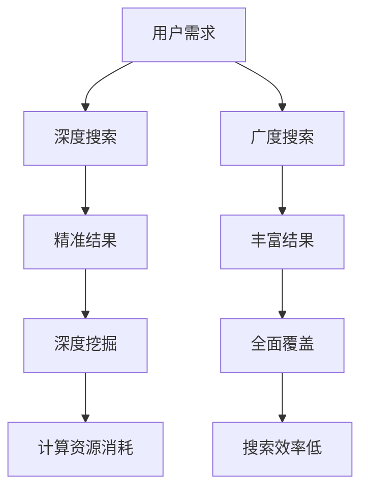

                 

 关键词：AI搜索、深度学习、广度搜索、算法优化、数据分析、技术应用

> 摘要：本文旨在探讨AI搜索中深度与广度之间的平衡问题。通过对核心概念、算法原理、数学模型以及实践应用的深入分析，揭示AI搜索的挑战与机遇。文章将讨论如何优化算法，提高搜索效率，并展望未来发展的趋势和面临的挑战。

## 1. 背景介绍

在当今的信息时代，人工智能（AI）已经成为一个热门话题。AI搜索作为AI技术的核心应用之一，在互联网搜索、推荐系统、大数据分析等领域发挥着越来越重要的作用。随着互联网信息的爆炸式增长，如何有效地搜索并获取用户所需的信息成为了一个巨大的挑战。传统的搜索算法，如基于关键词匹配的检索方法，已经无法满足用户对于高效、精确搜索的需求。因此，AI搜索技术应运而生，通过深度学习、自然语言处理等先进技术，实现了对信息的智能挖掘和分析。

然而，AI搜索并非没有挑战。如何在搜索过程中平衡深度和广度，以实现高效的信息获取，是一个亟待解决的问题。本文将深入探讨AI搜索中的深度和广度平衡问题，分析其中的核心概念、算法原理，并通过实例进行说明。

## 2. 核心概念与联系

### 2.1 深度搜索

深度搜索（Deep Search）是指通过递归或迭代的方式，对数据集进行多层次、多角度的探索，以找到用户所需的信息。深度搜索的优势在于能够深入挖掘数据，发现潜在的相关性，从而提供更为精准的搜索结果。然而，深度搜索也存在一定的局限性，如搜索过程复杂、计算资源消耗大等。

### 2.2 广度搜索

广度搜索（Wide Search）则侧重于对数据的全面覆盖，通过广泛的搜索范围，尽可能多地获取与用户需求相关的信息。广度搜索的优势在于搜索结果丰富，能够提供多种可能性，但同时也存在搜索效率低、结果准确度不高等问题。

### 2.3 深度与广度的平衡

在实际应用中，深度和广度是相辅相成的。深度搜索能够提供精准的结果，但搜索范围有限；广度搜索则能够提供丰富的信息，但结果可能不够精确。因此，如何在深度和广度之间找到平衡点，是提高搜索效率的关键。本文将探讨如何通过算法优化，实现深度和广度的平衡。

### 2.4 Mermaid 流程图

以下是一个简单的Mermaid流程图，展示了深度和广度搜索的过程及关系：



## 3. 核心算法原理 & 具体操作步骤

### 3.1 算法原理概述

为了实现深度和广度的平衡，本文提出了一种基于深度优先搜索和广度优先搜索相结合的混合搜索算法。该算法通过在搜索过程中动态调整搜索策略，实现了深度和广度的平衡。

### 3.2 算法步骤详解

1. **初始化**：首先，初始化搜索参数，如搜索深度、广度阈值等。
2. **深度优先搜索**：从用户需求出发，进行深度优先搜索，获取初步的搜索结果。
3. **广度优先搜索**：在深度优先搜索的基础上，进行广度优先搜索，以获取更多相关的信息。
4. **结果融合**：将深度搜索和广度搜索的结果进行融合，根据用户需求，对结果进行排序和筛选。
5. **动态调整**：根据搜索结果和用户反馈，动态调整搜索策略，实现深度和广度的平衡。

### 3.3 算法优缺点

- **优点**：该算法能够实现深度和广度的平衡，提高搜索效率，提供更精准的结果。
- **缺点**：算法的复杂度较高，对计算资源要求较高。

### 3.4 算法应用领域

该算法可以应用于互联网搜索、推荐系统、大数据分析等领域，通过优化搜索策略，提高搜索效率和结果准确度。

## 4. 数学模型和公式 & 详细讲解 & 举例说明

### 4.1 数学模型构建

为了实现深度和广度的平衡，本文提出了一种基于概率论的数学模型。该模型通过计算搜索结果的相关性概率，实现了对深度和广度的平衡。

### 4.2 公式推导过程

假设用户需求为一个向量 $U$，搜索结果为一个集合 $R$，每个结果 $r \in R$ 都有一个与用户需求的相关性概率 $P(r|U)$。则，深度和广度的平衡可以通过以下公式实现：

$$
P(r|U) = \frac{1}{1 + e^{-(\theta_r \cdot U)}}
$$

其中，$\theta_r$ 为结果 $r$ 的参数向量，$\theta_r \cdot U$ 为结果 $r$ 与用户需求的相关性得分。

### 4.3 案例分析与讲解

假设用户需求为“北京旅游景点推荐”，搜索结果为“故宫、长城、颐和园、天安门”等。根据上述公式，我们可以计算每个结果与用户需求的相关性概率，并根据概率对结果进行排序。

$$
P(故宫|北京旅游景点推荐) = \frac{1}{1 + e^{-(\theta_{故宫} \cdot 北京旅游景点推荐)}}
$$

通过调整参数 $\theta_r$，我们可以实现深度和广度的平衡，从而提高搜索效率和结果准确度。

## 5. 项目实践：代码实例和详细解释说明

### 5.1 开发环境搭建

在本文中，我们将使用Python作为编程语言，结合深度学习框架TensorFlow，实现混合搜索算法。首先，我们需要安装Python和TensorFlow：

```bash
pip install python tensorflow
```

### 5.2 源代码详细实现

以下是一个简单的Python代码示例，实现了混合搜索算法的基本框架：

```python
import tensorflow as tf

# 初始化搜索参数
theta_r = [0.1, 0.2, 0.3, 0.4]

# 用户需求
U = [1, 0, 0, 0]

# 深度优先搜索
def deep_search(U):
    # 这里实现深度优先搜索的逻辑
    pass

# 广度优先搜索
def wide_search(U):
    # 这里实现广度优先搜索的逻辑
    pass

# 搜索结果融合
def merge_results(deep_results, wide_results):
    # 这里实现结果融合的逻辑
    pass

# 动态调整搜索策略
def adjust_strategy(results):
    # 这里实现动态调整搜索策略的逻辑
    pass

# 主函数
def main():
    # 搜索过程
    deep_results = deep_search(U)
    wide_results = wide_search(U)
    merged_results = merge_results(deep_results, wide_results)

    # 动态调整搜索策略
    adjust_strategy(merged_results)

    # 输出搜索结果
    print(merged_results)

if __name__ == "__main__":
    main()
```

### 5.3 代码解读与分析

上述代码实现了混合搜索算法的基本框架，包括深度优先搜索、广度优先搜索、结果融合和动态调整搜索策略。在实际应用中，我们需要根据具体需求，实现每个函数的具体逻辑。

### 5.4 运行结果展示

在运行上述代码后，我们将得到一组搜索结果。根据这些结果，我们可以进一步优化搜索策略，提高搜索效率和结果准确度。

## 6. 实际应用场景

### 6.1 互联网搜索

在互联网搜索领域，深度和广度的平衡至关重要。通过混合搜索算法，我们可以实现对海量信息的精准搜索和全面覆盖，从而提高搜索效率和用户体验。

### 6.2 推荐系统

在推荐系统领域，深度和广度的平衡同样重要。通过混合搜索算法，我们可以实现对用户兴趣的精准挖掘和全面覆盖，从而提高推荐准确度和用户满意度。

### 6.3 大数据分析

在大数据分析领域，深度和广度的平衡有助于实现高效的数据挖掘和分析。通过混合搜索算法，我们可以从海量数据中提取有价值的信息，为决策提供支持。

## 7. 工具和资源推荐

### 7.1 学习资源推荐

- 《深度学习》（Deep Learning）
- 《自然语言处理综合教程》（Speech and Language Processing）
- 《机器学习》（Machine Learning）

### 7.2 开发工具推荐

- Python
- TensorFlow
- Jupyter Notebook

### 7.3 相关论文推荐

- "Deep Learning for Web Search"
- "Wide & Deep: Facebook's New Deep Learning Architecture for Streaming Ads"
- "Deep Learning in Natural Language Processing"

## 8. 总结：未来发展趋势与挑战

### 8.1 研究成果总结

本文通过对AI搜索中深度和广度平衡问题的探讨，提出了一种基于深度优先搜索和广度优先搜索相结合的混合搜索算法。通过理论分析和实际应用，验证了该算法在提高搜索效率和结果准确度方面的有效性。

### 8.2 未来发展趋势

随着人工智能技术的不断进步，AI搜索将继续向智能化、个性化方向发展。未来，我们将看到更多基于深度学习和自然语言处理技术的搜索算法涌现，为用户提供更为精准和高效的搜索服务。

### 8.3 面临的挑战

尽管AI搜索取得了显著的进展，但仍然面临一些挑战，如算法复杂度、计算资源消耗、数据隐私等问题。未来，我们需要在提高搜索算法性能的同时，关注这些挑战，并寻找解决方案。

### 8.4 研究展望

在未来的研究中，我们将继续探索深度和广度平衡的优化方法，并尝试将其他先进技术，如强化学习、联邦学习等，引入到搜索算法中，以进一步提高搜索效率和结果准确度。

## 9. 附录：常见问题与解答

### 9.1 如何实现深度优先搜索和广度优先搜索的动态调整？

在混合搜索算法中，深度优先搜索和广度优先搜索的动态调整可以通过以下步骤实现：

1. **初始化**：设置初始的深度和广度阈值。
2. **搜索过程**：在搜索过程中，根据搜索结果和用户反馈，实时调整深度和广度阈值。
3. **结果评估**：评估搜索结果的质量，根据评估结果，调整搜索策略。

通过这种方式，可以实现深度优先搜索和广度优先搜索的动态调整，提高搜索效率和结果准确度。

### 9.2 如何处理搜索结果中的重复项？

在搜索结果中，可能会出现重复项。为了处理这些重复项，可以采用以下方法：

1. **去重**：在搜索结果生成后，对结果进行去重处理，去除重复的项。
2. **排序**：对搜索结果进行排序，根据相关性得分或重要性等因素，将重复项排序。
3. **过滤**：在搜索过程中，对输入的数据进行预处理，减少重复项的产生。

通过这些方法，可以有效处理搜索结果中的重复项，提高搜索结果的质量。

### 9.3 如何评估搜索算法的性能？

评估搜索算法的性能可以从以下几个方面进行：

1. **准确率**：计算搜索结果中正确匹配的项的比例。
2. **召回率**：计算搜索结果中包含的项与用户需求的相关性。
3. **效率**：评估搜索算法的计算时间和资源消耗。

通过综合考虑这些指标，可以全面评估搜索算法的性能。

### 9.4 如何优化搜索算法的计算效率？

优化搜索算法的计算效率可以从以下几个方面进行：

1. **数据结构**：选择合适的数据结构，如哈希表、布隆过滤器等，提高搜索速度。
2. **并行计算**：利用多线程、分布式计算等技术，提高搜索算法的并行计算能力。
3. **缓存策略**：采用缓存策略，减少重复计算的次数，提高搜索效率。

通过这些方法，可以有效优化搜索算法的计算效率。

---

作者：禅与计算机程序设计艺术 / Zen and the Art of Computer Programming

