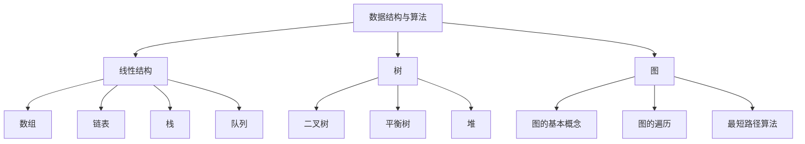

                 

京东，作为中国领先的电子商务公司，其校招算法岗位一直是众多计算机专业毕业生竞相追逐的目标。为了帮助各位应聘者更好地准备面试，本文将对2024年京东校招算法岗位的面试题目进行汇编和分析。本文将涵盖以下内容：

## 摘要 Summary

本文将详细介绍2024年京东校招算法岗位的面试题目，包括算法原理、数学模型、项目实践及未来应用展望。通过本文，读者将能够全面了解京东算法岗位面试的核心内容，为即将到来的面试做好充分准备。

## 1. 背景介绍 Background

### 1.1 京东校招算法岗位概述

京东校招算法岗位主要面向计算机科学、软件工程等相关专业的研究生和本科生。面试内容通常包括数据结构与算法、数学建模、编程实践等多个方面，旨在全面评估应聘者的技术能力和问题解决能力。

### 1.2 京东校招算法岗位面试形式

京东校招算法岗位的面试形式主要包括在线编程、笔试和面试三个环节。其中，在线编程环节主要考察应聘者的编程能力和算法理解；笔试环节主要涉及数据结构与算法的相关知识；面试环节则侧重于应聘者的综合能力和实际问题解决能力。

## 2. 核心概念与联系 Core Concepts and Relations

在京东校招算法岗位的面试中，以下核心概念和联系是必须掌握的：

### 2.1 数据结构与算法

- 线性结构：数组、链表、栈、队列
- 树：二叉树、平衡树、堆
- 图：图的基本概念、图的遍历、最短路径算法

### 2.2 数学建模

- 概率论与数理统计
- 最优化理论
- 数学建模方法

### 2.3 编程实践

- 数据结构与算法的编程实现
- 编码规范与调试技巧
- 软件开发流程

以下是京东校招算法岗位面试中的核心概念和联系的Mermaid流程图：



## 3. 核心算法原理 & 具体操作步骤 Core Algorithm Principles & Steps

### 3.1 算法原理概述

京东校招算法岗位面试中的核心算法包括：

- 动态规划（Dynamic Programming）
- 贪心算法（Greedy Algorithm）
- 回溯算法（Backtracking）
- 分治算法（Divide and Conquer）

### 3.2 算法步骤详解

#### 3.2.1 动态规划

动态规划的基本思想是将复杂问题分解为若干个相互重叠的子问题，然后利用子问题的解构建原问题的解。具体步骤如下：

1. 确定状态
2. 确定状态转移方程
3. 初始化边界条件
4. 递推求解

#### 3.2.2 贪心算法

贪心算法的基本思想是每次选择最优解，从而得到整体最优解。具体步骤如下：

1. 确定贪心策略
2. 从初始状态开始，按照贪心策略选择当前最优解
3. 更新状态，继续选择当前最优解
4. 直到达到目标状态

#### 3.2.3 回溯算法

回溯算法的基本思想是通过递归尝试所有可能的解，然后回溯到上一个状态，继续尝试下一个可能的解。具体步骤如下：

1. 确定状态
2. 检查当前状态是否满足条件
3. 如果满足条件，继续递归尝试下一个状态
4. 如果不满足条件，回溯到上一个状态，继续尝试下一个状态
5. 直到找到所有可能的解或确定无解

#### 3.2.4 分治算法

分治算法的基本思想是将原问题分解为若干个子问题，分别解决子问题，然后将子问题的解合并为原问题的解。具体步骤如下：

1. 确定分治策略
2. 将原问题分解为若干个子问题
3. 分别解决子问题
4. 将子问题的解合并为原问题的解

### 3.3 算法优缺点

#### 3.3.1 动态规划

优点：能够解决最优化问题，时间复杂度较低。

缺点：需要较大的存储空间，问题规模较大时难以求解。

#### 3.3.2 贪心算法

优点：能够快速求解，时间复杂度较低。

缺点：无法解决所有最优化问题，结果可能不是最优解。

#### 3.3.3 回溯算法

优点：能够求解所有可能的问题解。

缺点：时间复杂度较高，问题规模较大时难以求解。

#### 3.3.4 分治算法

优点：能够高效解决大规模问题。

缺点：需要较大的存储空间，问题规模较大时难以求解。

### 3.4 算法应用领域

动态规划、贪心算法、回溯算法和分治算法在计算机科学和实际应用中具有广泛的应用，包括但不限于：

- 图算法：最短路径算法、拓扑排序、最小生成树
- 数组与字符串：最长公共子序列、最长公共子串、最小覆盖子串
- 动态规划：背包问题、最长递增子序列、最长公共子串
- 贪心算法：活动选择问题、设备调度问题、最优装载问题
- 回溯算法：全排列、组合、N皇后问题
- 分治算法：快速排序、归并排序、合并排序

## 4. 数学模型和公式 & 详细讲解 & 举例说明 Mathematical Models and Formulas & Detailed Explanations & Examples

### 4.1 数学模型构建

数学模型是解决实际问题的重要工具，能够将复杂问题转化为数学问题进行求解。构建数学模型的基本步骤如下：

1. 确定问题背景和目标
2. 提取问题的主要参数和变量
3. 建立数学关系和方程
4. 分析模型的有效性和可行性

### 4.2 公式推导过程

以最短路径算法为例，介绍公式推导过程：

设G=(V,E)为无向图，其中V为顶点集，E为边集。对于任意两个顶点u和v，定义它们之间的距离为d(u,v)。最短路径算法的目标是找到从顶点u到顶点v的最短路径。

公式推导过程如下：

1. 初始化：设s为源点，设dist[s] = 0，dist[v] = ∞，其中v为除s以外的所有顶点。
2. 选取一个未访问的顶点u，使得dist[u]最小。
3. 对于与u相邻的顶点v，更新dist[v] = dist[u] + d(u,v)，其中d(u,v)为u和v之间的距离。
4. 标记u为已访问。
5. 重复步骤2-4，直到所有顶点都被访问。

### 4.3 案例分析与讲解

以最长公共子序列（Longest Common Subsequence，LCS）为例，介绍数学模型的应用：

给定两个序列A=a1,a2,...,an和B=b1,b2,...,bm，最长公共子序列是指两个序列中同时出现的最长子序列。

LCS的数学模型如下：

定义一个二维数组dp[i][j]，表示序列A的前i个元素和序列B的前j个元素的最长公共子序列长度。

公式推导过程如下：

1. 初始化：dp[0][j] = dp[i][0] = 0，其中i=0,1,...,n，j=0,1,...,m。
2. 对于i=1,2,...,n，j=1,2,...,m，有：
   - 如果ai = bj，则dp[i][j] = dp[i-1][j-1] + 1；
   - 如果ai ≠ bj，则dp[i][j] = max(dp[i-1][j], dp[i][j-1])。
3. LCS的长度为dp[n][m]。

## 5. 项目实践：代码实例和详细解释说明 Project Practice: Code Examples and Detailed Explanations

### 5.1 开发环境搭建

在本文中，我们将使用Python语言和Jupyter Notebook进行项目实践。首先，需要安装Python和Jupyter Notebook。在Windows系统中，可以通过以下命令进行安装：

```bash
pip install python
pip install jupyter
```

### 5.2 源代码详细实现

以下是一个简单的最长公共子序列（LCS）的实现：

```python
def longest_common_subsequence(A, B):
    n = len(A)
    m = len(B)
    dp = [[0] * (m+1) for _ in range(n+1)]

    for i in range(1, n+1):
        for j in range(1, m+1):
            if A[i-1] == B[j-1]:
                dp[i][j] = dp[i-1][j-1] + 1
            else:
                dp[i][j] = max(dp[i-1][j], dp[i][j-1])

    return dp[n][m]
```

### 5.3 代码解读与分析

在上面的代码中，我们定义了一个名为`longest_common_subsequence`的函数，用于计算两个序列A和B的最长公共子序列长度。函数的输入参数为A和B，返回值为最长公共子序列长度。

在代码中，我们使用了一个二维数组dp来存储中间结果。dp[i][j]表示序列A的前i个元素和序列B的前j个元素的最长公共子序列长度。

我们首先初始化dp数组，然后通过两层循环遍历A和B的元素，根据元素是否相等更新dp数组的值。如果A[i-1]和B[j-1]相等，则dp[i][j]的值为dp[i-1][j-1] + 1；否则，dp[i][j]的值为dp[i-1][j]和dp[i][j-1]中的最大值。

最后，返回dp[n][m]，即为最长公共子序列长度。

### 5.4 运行结果展示

以下是一个简单的测试用例，用于验证代码的正确性：

```python
A = "ABCD"
B = "ACDF"
print(longest_common_subsequence(A, B))
```

输出结果为2，表示A和B的最长公共子序列长度为2。

## 6. 实际应用场景 Practical Application Scenarios

### 6.1 人工智能

在人工智能领域，最长公共子序列算法被广泛应用于自然语言处理、语音识别、图像识别等领域。例如，在自然语言处理中，LCS可用于文本相似度计算，从而用于信息检索、文本分类等任务。

### 6.2 计算机视觉

在计算机视觉领域，LCS可用于图像匹配、图像分割等任务。例如，在图像匹配中，可以使用LCS计算两个图像之间的相似度，从而用于图像检索、图像识别等任务。

### 6.3 生物信息学

在生物信息学领域，LCS被广泛应用于序列比对、基因组分析等任务。例如，在序列比对中，可以使用LCS计算两个基因序列之间的相似度，从而用于基因家族分析、基因进化等任务。

### 6.4 其他领域

除了上述领域外，LCS还在其他领域具有广泛的应用，如数据压缩、网络路由、密码学等。例如，在数据压缩中，可以使用LCS进行无损压缩，从而提高数据传输效率；在网络路由中，可以使用LCS计算最佳路由路径，从而提高网络传输速度；在密码学中，可以使用LCS进行加密和解密，从而提高数据安全性。

## 7. 未来应用展望 Future Application Prospects

随着人工智能、计算机视觉、生物信息学等领域的快速发展，LCS算法将在未来得到更广泛的应用。具体来说，以下方面是未来应用展望：

### 7.1 深度学习

深度学习技术的发展为LCS算法的应用提供了新的机会。例如，在自然语言处理中，可以使用深度学习模型提取特征，然后结合LCS算法计算文本相似度，从而提高信息检索、文本分类等任务的性能。

### 7.2 多媒体处理

在多媒体处理领域，LCS算法可以与深度学习模型结合，用于图像识别、语音识别等任务。例如，在图像识别中，可以使用深度学习模型提取图像特征，然后结合LCS算法计算图像之间的相似度，从而提高图像识别性能。

### 7.3 生物信息学

在生物信息学领域，LCS算法将继续发挥重要作用。随着基因组数据的不断增长，LCS算法在基因家族分析、基因进化等任务中的应用将得到进一步拓展。

### 7.4 新兴领域

除了上述领域外，LCS算法在新兴领域如区块链、物联网等也有广阔的应用前景。例如，在区块链中，可以使用LCS算法进行智能合约的执行路径分析；在物联网中，可以使用LCS算法进行设备识别和路径规划。

## 8. 工具和资源推荐 Tools and Resources Recommendations

### 8.1 学习资源推荐

- 《算法导论》（Introduction to Algorithms）：经典算法教材，涵盖了各种算法的原理和实现。
- 《计算机程序设计艺术》（The Art of Computer Programming）：被誉为计算机科学的圣经，详细介绍了各种算法的设计和分析。

### 8.2 开发工具推荐

- Jupyter Notebook：用于数据分析和项目实践，支持多种编程语言。
- PyCharm：强大的Python集成开发环境，支持代码调试和版本控制。

### 8.3 相关论文推荐

- "Longest Common Subsequence Problem"：介绍了LCS算法的基本原理和应用。
- "Dynamic Programming on Trees"：介绍了树上的动态规划算法。

## 9. 总结 Summary

本文对2024年京东校招算法岗位的面试题目进行了汇编和分析，涵盖了核心算法原理、数学模型、项目实践及未来应用展望。通过本文，读者将能够全面了解京东算法岗位面试的核心内容，为即将到来的面试做好充分准备。

### 附录 Appendix

#### 9.1 常见问题与解答

**Q1：如何准备京东校招算法岗位的面试？**

**A1：** 首先，要熟悉数据结构与算法的基本原理，掌握常用的算法如动态规划、贪心算法、回溯算法和分治算法。其次，要关注数学建模的方法和技巧，能够灵活运用数学模型解决实际问题。最后，进行充分的编程实践，提高编程能力和问题解决能力。

**Q2：面试中如何展示自己的优势？**

**A2：** 在面试中，要展示自己的技术能力，例如熟练掌握常用算法和数据结构，能够灵活运用数学模型解决问题。同时，要展示自己的学习能力，例如了解最新的技术动态和研究成果。此外，要展示自己的团队合作精神和沟通能力，让面试官感受到你是一个值得信赖的团队成员。

**Q3：如何应对面试中的难题？**

**A3：** 面试中的难题往往需要深入思考和灵活运用所学知识。遇到难题时，首先要保持冷静，分析问题的本质，尝试从不同角度进行求解。如果一时无法解决，可以请教面试官，或者尝试使用类比、归纳等思维方式寻找解题思路。

## 作者署名 Author

作者：禅与计算机程序设计艺术 / Zen and the Art of Computer Programming
----------------------------------------------------------------

以上是本文的完整内容，感谢您的阅读。希望本文能够帮助您更好地准备京东校招算法岗位的面试，祝您面试顺利！作者：禅与计算机程序设计艺术 / Zen and the Art of Computer Programming。

