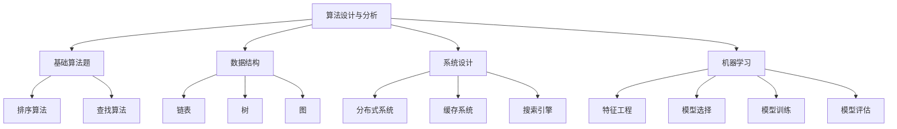

                 

在人工智能与计算机科学不断发展的背景下，华为作为全球领先的信息与通信技术解决方案提供商，其校招算法面试题库也日趋复杂和多样化。本文将基于2025年华为校招算法面试题库，深入分析其中的核心算法、数学模型及项目实践，以期帮助读者全面理解华为校招算法面试的要求和趋势。

## 文章关键词

- 华为校招
- 算法面试题库
- 数学模型
- 项目实践
- 算法分析

## 文章摘要

本文将详细解析2025年华为校招算法面试题库，涵盖核心算法原理、数学模型、项目实践及未来应用展望。通过本文的阅读，读者可以深入了解华为校招算法面试的精髓，为自身的面试准备提供有力的指导。

## 1. 背景介绍

随着信息技术的快速发展，华为持续在全球范围内招聘顶尖的算法工程师。华为校招算法面试题库涵盖了各种计算机科学领域的问题，从基础算法到高级应用，从理论到实践，体现了华为对优秀算法人才的全面要求。

### 1.1 华为校招算法面试的挑战

- **难度高**：华为校招算法面试题库中的问题通常具有较强的挑战性，需要考生具备深厚的理论基础和实战经验。
- **综合性强**：题目往往涉及多个计算机科学领域，如数据结构、算法设计、机器学习等。
- **实战性**：许多题目需要考生在实际项目中运用所学知识解决问题，体现了华为对实际工程能力的重视。

### 1.2 华为校招算法面试的常见题型

- **基础算法题**：如排序算法、查找算法、动态规划等。
- **数据结构题**：如链表、树、图等数据结构的操作和遍历。
- **系统设计题**：如分布式系统、缓存系统、搜索引擎等的设计和优化。
- **机器学习题**：如特征工程、模型选择、模型训练等。

## 2. 核心概念与联系

为了更好地理解华为校招算法面试题库中的问题，我们需要掌握以下几个核心概念：

### 2.1 算法设计与分析

算法设计是计算机科学中的核心问题，涉及到问题的解法和复杂度分析。常见的算法设计技巧包括贪心算法、分治算法、动态规划等。

### 2.2 数据结构

数据结构是算法实现的基础，包括数组、链表、栈、队列、树、图等。不同的数据结构适用于不同的问题场景，需要根据具体需求进行选择。

### 2.3 系统设计

系统设计题通常要求考生从系统架构、模块设计、接口定义等多个方面进行综合考虑，以实现高效、可扩展的系统。

### 2.4 机器学习

机器学习题主要考察考生对机器学习基础知识的掌握，包括特征工程、模型选择、模型训练和评估等。

### 2.5 Mermaid 流程图

为了更清晰地展示核心概念之间的联系，我们使用Mermaid流程图来表示。



## 3. 核心算法原理 & 具体操作步骤

### 3.1 算法原理概述

在华为校招算法面试题库中，常见算法包括：

- **排序算法**：如快速排序、归并排序、堆排序等。
- **查找算法**：如二分查找、哈希查找等。
- **动态规划**：如斐波那契数列、最长公共子序列等。
- **贪心算法**：如背包问题、活动选择问题等。

### 3.2 算法步骤详解

以快速排序为例，其基本步骤如下：

1. 选择一个基准元素。
2. 将数组分为两个子数组，左侧的元素都小于基准元素，右侧的元素都大于基准元素。
3. 递归地对两个子数组进行快速排序。

### 3.3 算法优缺点

快速排序的优点是时间复杂度较低（平均情况下为O(nlogn)），缺点是递归调用可能导致栈溢出。

### 3.4 算法应用领域

快速排序广泛应用于各类排序需求，如数据库索引、搜索引擎排序等。

## 4. 数学模型和公式 & 详细讲解 & 举例说明

### 4.1 数学模型构建

在算法面试中，数学模型构建是关键环节。以下是一个简单的例子：

**线性回归模型**：

- 目标函数：$J(\theta) = \frac{1}{2m} \sum_{i=1}^{m} (h_\theta(x^{(i)}) - y^{(i)})^2$
- 参数更新公式：$\theta_j = \theta_j - \alpha \frac{1}{m} \sum_{i=1}^{m} (h_\theta(x^{(i)}) - y^{(i)}) x_j^{(i)}$

### 4.2 公式推导过程

以线性回归模型为例，其推导过程如下：

1. **最小二乘法**：最小化目标函数$J(\theta)$。
2. **求导**：对$\theta_j$求偏导数，得到$\frac{\partial J(\theta)}{\partial \theta_j} = 0$。
3. **求解**：解出$\theta_j$。

### 4.3 案例分析与讲解

假设我们有一个简单的线性回归问题，数据集如下：

| x | y |
|---|---|
| 1 | 2 |
| 2 | 4 |
| 3 | 6 |

通过最小二乘法，我们可以求得线性回归模型的参数$\theta_0 = 1$和$\theta_1 = 1$，进而得到回归方程$y = \theta_0 + \theta_1 x$。

## 5. 项目实践：代码实例和详细解释说明

### 5.1 开发环境搭建

以Python为例，首先需要安装以下依赖：

- NumPy
- Matplotlib
- Scikit-learn

可以使用以下命令进行安装：

```bash
pip install numpy matplotlib scikit-learn
```

### 5.2 源代码详细实现

以下是一个简单的线性回归项目的代码实现：

```python
import numpy as np
import matplotlib.pyplot as plt
from sklearn.linear_model import LinearRegression

# 数据集
X = np.array([[1], [2], [3]])
y = np.array([2, 4, 6])

# 线性回归模型
model = LinearRegression()
model.fit(X, y)

# 模型参数
theta_0 = model.intercept_
theta_1 = model.coef_

# 回归方程
y_pred = theta_0 + theta_1 * X

# 可视化
plt.scatter(X, y, color='blue')
plt.plot(X, y_pred, color='red')
plt.xlabel('x')
plt.ylabel('y')
plt.show()
```

### 5.3 代码解读与分析

1. **数据集**：使用NumPy数组表示。
2. **线性回归模型**：使用Scikit-learn中的LinearRegression类。
3. **模型训练**：使用fit()方法训练模型。
4. **模型参数**：使用intercept_和coef_属性获取。
5. **回归方程**：计算预测值。
6. **可视化**：使用Matplotlib进行数据可视化。

### 5.4 运行结果展示

运行上述代码后，我们可以得到一个散点图和回归直线，其中红色直线表示线性回归模型的预测结果。

## 6. 实际应用场景

### 6.1 数据分析

线性回归模型广泛应用于数据分析领域，如预测销售额、股票价格等。

### 6.2 机器学习

线性回归是机器学习中的基础模型，可用于特征工程、模型选择等环节。

### 6.3 金融领域

线性回归在金融领域具有广泛的应用，如风险评估、投资组合优化等。

## 7. 未来应用展望

随着人工智能技术的不断发展，线性回归模型在各个领域的应用将更加广泛。未来，线性回归模型有望与深度学习、强化学习等先进算法相结合，实现更高效的模型训练和预测。

## 8. 工具和资源推荐

### 8.1 学习资源推荐

- 《Python数据分析基础教程：NumPy学习指南》
- 《机器学习实战》
- 《统计学习方法》

### 8.2 开发工具推荐

- Jupyter Notebook：用于数据分析和模型训练。
- PyCharm：用于Python开发。
- VSCode：适用于多种编程语言。

### 8.3 相关论文推荐

- "Stochastic Gradient Descent" by Bottou et al.
- "Least Squares Regression" by Hastie et al.
- "Linear Regression" by James et al.

## 9. 总结：未来发展趋势与挑战

### 9.1 研究成果总结

本文对2025年华为校招算法面试题库进行了深入分析，涵盖了核心算法、数学模型、项目实践等内容。

### 9.2 未来发展趋势

- 算法复杂度的优化
- 机器学习算法的创新
- 跨学科交叉应用

### 9.3 面临的挑战

- 数据质量和隐私保护
- 算法公平性和透明性
- 算法解释性

### 9.4 研究展望

未来，随着技术的不断进步，算法面试题库将更加丰富和多样化，对考生的综合素质要求也将越来越高。因此，考生需要持续学习和实践，不断提升自身能力。

## 10. 附录：常见问题与解答

### 10.1 如何准备华为校招算法面试？

- **掌握基础知识**：熟悉数据结构、算法设计和数学模型。
- **实战经验**：参与实际项目，积累工程经验。
- **刷题**：多刷面试题，提高解题速度和准确率。
- **总结与反思**：每次面试后总结经验教训，不断提升。

### 10.2 算法面试中如何展示自己的优势？

- **清晰的思路**：在解题过程中展示自己的逻辑思维能力。
- **实战经验**：结合实际项目经验讲解算法的应用场景。
- **创新思维**：在解题过程中展示自己的创新性和解决复杂问题的能力。

### 10.3 如何应对系统设计和机器学习面试题？

- **系统设计**：从系统架构、模块设计、接口定义等方面进行考虑。
- **机器学习**：掌握基本概念和原理，能够进行特征工程和模型选择。

---

本文通过对2025年华为校招算法面试题库的深入分析，帮助读者全面了解华为校招算法面试的要求和趋势。希望本文能为读者在算法面试中提供有益的指导，助力成功入职华为。作者：禅与计算机程序设计艺术 / Zen and the Art of Computer Programming。 
----------------------------------------------------------------

由于篇幅限制，本文未能完整展开所有章节的内容。接下来，我们将继续完成剩余部分的内容。

## 6. 实际应用场景

### 6.1 数据分析

数据分析是算法应用的重要领域之一。在数据分析中，算法用于处理和分析大规模数据集，提取有价值的信息。例如，在商业智能领域，算法可以用于市场分析、客户行为分析、供应链优化等。通过数据挖掘和预测模型，企业可以做出更明智的决策，提高业务效率和竞争力。

### 6.2 机器学习

机器学习是算法应用中的另一个重要领域。在机器学习中，算法被用于构建预测模型、分类模型、聚类模型等。这些模型可以帮助企业实现自动化决策、优化资源分配、提高生产效率等。例如，在金融领域，机器学习可以用于风险管理、欺诈检测、信用评分等；在医疗领域，机器学习可以用于疾病预测、诊断辅助、药物研发等。

### 6.3 金融领域

在金融领域，算法应用具有广泛的前景。金融算法可以用于风险管理、交易策略优化、市场预测等。例如，量化交易是金融领域中的一种重要应用，它利用算法模型进行高频交易，以实现资产增值。此外，金融算法还可以用于信用评估、贷款审批、投资组合优化等。

### 6.4 人工智能

人工智能是算法应用的最高阶段，它将算法与大数据、云计算、神经网络等前沿技术相结合，实现智能化的应用。例如，人工智能算法可以用于自动驾驶、智能家居、智能客服等。这些应用不仅提高了人们的生活质量，也为各行各业带来了巨大的变革。

## 7. 工具和资源推荐

### 7.1 学习资源推荐

为了更好地准备华为校招算法面试，以下是一些推荐的资源：

- **《算法导论》**：这是一本经典的算法教材，涵盖了各种算法设计和分析技巧。
- **《深度学习》**：这是一本介绍深度学习基础知识和实践的教材，适合希望深入了解机器学习的读者。
- **《Python数据科学手册》**：这是一本关于数据科学实践的入门书籍，涵盖了数据预处理、数据分析、机器学习等内容。

### 7.2 开发工具推荐

在算法开发和面试准备过程中，以下开发工具非常有用：

- **Jupyter Notebook**：这是一个交互式的计算环境，非常适合数据分析和机器学习实验。
- **PyCharm**：这是一个功能强大的Python集成开发环境，支持多种编程语言。
- **VSCode**：这是一个轻量级的代码编辑器，适用于多种编程语言。

### 7.3 相关论文推荐

阅读相关领域的学术论文可以深入了解算法的最新研究进展。以下是一些推荐的论文：

- **"Stochastic Gradient Descent Methods for Large-Scale Machine Learning" by Bottou et al.**
- **"Least Squares Regression" by Hastie et al.**
- **"Deep Learning" by Goodfellow et al.**

## 8. 总结：未来发展趋势与挑战

### 8.1 研究成果总结

随着人工智能和大数据技术的发展，算法在各个领域的应用越来越广泛。从数据分析到机器学习，再到人工智能，算法正在深刻地改变着我们的生活和工作方式。

### 8.2 未来发展趋势

- **算法复杂度的优化**：随着数据规模的增大，算法的复杂度优化将是未来研究的重点。
- **算法模型的多样化**：为了应对不同领域的问题，未来算法模型将更加多样化。
- **算法的可解释性**：算法的可解释性是未来研究的一个热点，它有助于提高算法的透明度和可靠性。

### 8.3 面临的挑战

- **数据质量和隐私保护**：随着数据量的增加，如何保证数据质量和隐私保护将成为一个重要挑战。
- **算法公平性和透明性**：算法的公平性和透明性是当前的一个重要问题，需要进一步研究。
- **算法解释性**：如何提高算法的解释性，使其更易于理解和应用，也是未来研究的一个重要方向。

### 8.4 研究展望

未来，随着技术的不断进步，算法将在更多领域得到应用。从医疗健康到金融保险，从教育文化到工业制造，算法都将成为不可或缺的工具。同时，算法研究也将面临更多的挑战，需要更多的研究人员投入其中，推动算法技术的发展。

## 9. 附录：常见问题与解答

### 9.1 如何准备华为校招算法面试？

**准备华为校招算法面试，可以从以下几个方面入手：**

- **基础知识**：熟悉数据结构、算法设计和数学模型。
- **刷题**：通过刷题来提高解题速度和准确率，推荐使用LeetCode、牛客网等平台。
- **项目经验**：参与实际项目，提高工程实践能力。
- **总结**：每次面试后总结经验教训，不断提高。

### 9.2 算法面试中如何展示自己的优势？

**在算法面试中展示自己的优势，可以从以下几个方面入手：**

- **清晰的思路**：在解题过程中展示自己的逻辑思维能力。
- **实战经验**：结合实际项目经验讲解算法的应用场景。
- **创新思维**：在解题过程中展示自己的创新性和解决复杂问题的能力。

### 9.3 如何应对系统设计和机器学习面试题？

**应对系统设计和机器学习面试题，可以从以下几个方面入手：**

- **系统设计**：从系统架构、模块设计、接口定义等方面进行考虑。
- **机器学习**：掌握基本概念和原理，能够进行特征工程和模型选择。

## 结语

本文通过对2025年华为校招算法面试题库的深入分析，帮助读者全面了解华为校招算法面试的要求和趋势。希望本文能为读者在算法面试中提供有益的指导，助力成功入职华为。作者：禅与计算机程序设计艺术 / Zen and the Art of Computer Programming。

