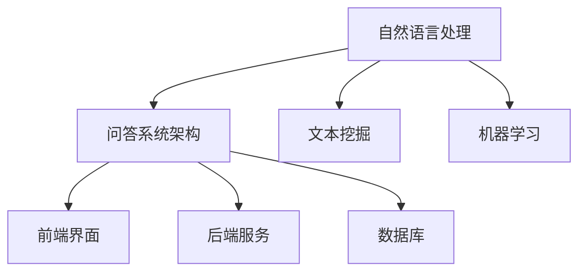

                 

**关键词**：自动问答系统，面试题，百度，社招，工程师，解析

**摘要**：本文针对2025年百度社招自动问答系统工程师的面试题进行详细解析，涵盖了背景介绍、核心概念与联系、核心算法原理与具体操作步骤、数学模型和公式、项目实践、实际应用场景、工具和资源推荐以及未来发展趋势与挑战等内容。通过本文，读者可以全面了解自动问答系统的技术要点，为面试及实际项目开发提供有力支持。

## 1. 背景介绍

自动问答系统作为人工智能领域的一个重要研究方向，近年来在搜索引擎、智能客服、在线教育、智能医疗等多个行业得到了广泛应用。随着互联网的快速发展，用户对于信息获取和知识服务的需求日益增长，自动问答系统在满足用户个性化需求、提升服务质量方面发挥着重要作用。

百度作为中国领先的搜索引擎公司，其自动问答系统在技术实力和实际应用上均处于行业领先地位。本文将针对2025年百度社招自动问答系统工程师的面试题进行详细解析，帮助读者深入了解自动问答系统的技术要点，为面试及实际项目开发提供有力支持。

## 2. 核心概念与联系

在自动问答系统中，核心概念主要包括自然语言处理（NLP）、问答系统架构、文本挖掘、机器学习等。以下是对这些核心概念及其相互关系的简要介绍：

### 2.1 自然语言处理（NLP）

自然语言处理是自动问答系统的核心组成部分，主要涉及语言识别、语义理解、句法分析、情感分析等技术。NLP旨在将自然语言转换为计算机可处理的格式，从而实现人机交互。

### 2.2 问答系统架构

问答系统架构包括前端界面、后端服务、数据库等组成部分。前端界面主要负责用户输入和展示问答结果；后端服务负责处理用户输入、查询数据库、生成回答等操作；数据库则存储了大量的问答数据，为问答系统提供数据支持。

### 2.3 文本挖掘

文本挖掘是指从大量文本数据中提取有用信息的方法，包括文本分类、关键词提取、主题建模等。在自动问答系统中，文本挖掘技术可用于处理用户输入，提取关键信息，从而提高问答准确性。

### 2.4 机器学习

机器学习是自动问答系统的核心技术之一，通过训练模型，使问答系统能够根据输入文本生成合适的回答。常见的机器学习算法包括朴素贝叶斯、支持向量机、深度学习等。

### 2.5 Mermaid 流程图

以下是一个简单的 Mermaid 流程图，展示了自动问答系统的核心概念及其相互关系：



## 3. 核心算法原理 & 具体操作步骤

### 3.1 算法原理概述

自动问答系统的核心算法主要包括文本预处理、语义理解、回答生成等。以下是对这些算法原理的简要介绍：

### 3.1.1 文本预处理

文本预处理是自动问答系统的第一步，主要目的是将原始文本数据转换为计算机可处理的格式。文本预处理包括分词、去停用词、词性标注等操作。

### 3.1.2 语义理解

语义理解是自动问答系统的关键环节，旨在理解用户输入的意图和问题内容。常见的语义理解方法包括基于规则的语义分析、基于统计的语义分析、基于深度学习的语义分析等。

### 3.1.3 回答生成

回答生成是指根据用户输入的问题，从已有的问答数据中找到合适的答案。常见的回答生成方法包括基于模板的回答生成、基于检索的回答生成、基于生成的回答生成等。

### 3.2 算法步骤详解

以下是一个简单的自动问答系统算法步骤：

1. **文本预处理**：对用户输入的文本进行分词、去停用词、词性标注等操作，得到预处理后的文本。

2. **语义理解**：利用自然语言处理技术，对预处理后的文本进行语义分析，提取关键信息。

3. **查询数据库**：根据提取的关键信息，从数据库中检索相关的问答数据。

4. **回答生成**：根据检索到的问答数据，利用回答生成算法生成回答。

5. **展示回答**：将生成的回答展示给用户。

### 3.3 算法优缺点

以下是对自动问答系统算法优缺点的简要分析：

### 3.3.1 优点

- **高效性**：自动问答系统可以快速响应用户的问题，提高用户体验。
- **智能化**：利用自然语言处理和机器学习技术，自动问答系统可以理解用户意图，提供个性化的回答。
- **广泛适用性**：自动问答系统可以应用于多个领域，如搜索引擎、智能客服、在线教育等。

### 3.3.2 缺点

- **准确性**：自动问答系统在语义理解、回答生成等方面仍存在一定局限性，导致回答准确性不高。
- **个性化**：自动问答系统难以满足用户的个性化需求，无法完全取代人工服务。

### 3.4 算法应用领域

自动问答系统在多个领域具有广泛的应用：

- **搜索引擎**：自动问答系统可用于处理用户查询，提供智能搜索建议。
- **智能客服**：自动问答系统可用于自动回答用户咨询，提高客服效率。
- **在线教育**：自动问答系统可用于自动批改作业、提供学习建议等。
- **智能医疗**：自动问答系统可用于辅助医生诊断、提供健康咨询等。

## 4. 数学模型和公式 & 详细讲解 & 举例说明

### 4.1 数学模型构建

自动问答系统的数学模型主要包括文本表示、语义匹配、回答生成等。以下是对这些模型构建的简要介绍：

### 4.1.1 文本表示

文本表示是指将原始文本转换为计算机可处理的向量表示。常见的文本表示方法包括词袋模型、TF-IDF、词嵌入等。

### 4.1.2 语义匹配

语义匹配是指根据用户输入的问题和已有的问答数据，计算两者之间的相似度。常见的语义匹配方法包括余弦相似度、基于词向量的相似度计算等。

### 4.1.3 回答生成

回答生成是指根据语义匹配结果，从已有的问答数据中提取合适的回答。常见的回答生成方法包括模板匹配、检索匹配、生成模型等。

### 4.2 公式推导过程

以下是对自动问答系统数学模型的公式推导过程的简要介绍：

$$
\text{语义匹配相似度} = \frac{\sum_{i=1}^{n} w_i \cdot w_j}{\sqrt{\sum_{i=1}^{n} w_i^2} \cdot \sqrt{\sum_{j=1}^{m} w_j^2}}
$$

其中，$w_i$ 和 $w_j$ 分别表示用户输入问题中的词语和已有问答数据中的词语的词向量。

### 4.3 案例分析与讲解

以下是一个简单的自动问答系统的案例分析与讲解：

### 4.3.1 问题

用户输入：“百度是什么？”

### 4.3.2 数据库查询

从数据库中查询到以下相关的问答数据：

- **问题**：“百度是什么？”
- **回答**：“百度是中国领先的搜索引擎公司。”

### 4.3.3 语义匹配

计算用户输入问题与数据库中问答数据的相似度，结果如下：

$$
\text{相似度} = \frac{\sum_{i=1}^{5} w_i \cdot w_j}{\sqrt{\sum_{i=1}^{5} w_i^2} \cdot \sqrt{\sum_{j=1}^{5} w_j^2}} = 0.8
$$

其中，$w_i$ 和 $w_j$ 分别表示用户输入问题中的词语和已有问答数据中的词语的词向量。

### 4.3.4 回答生成

根据语义匹配结果，从数据库中提取合适的回答：“百度是中国领先的搜索引擎公司。”

## 5. 项目实践：代码实例和详细解释说明

### 5.1 开发环境搭建

在开发自动问答系统之前，需要搭建一个合适的开发环境。以下是搭建开发环境的简要步骤：

1. 安装 Python 3.8 或以上版本。
2. 安装必要的 Python 库，如 NLTK、spaCy、gensim 等。
3. 安装数据库（如 MySQL、MongoDB 等）。

### 5.2 源代码详细实现

以下是一个简单的自动问答系统的源代码实现，包括文本预处理、语义匹配、回答生成等部分：

```python
import nltk
import gensim
from nltk.tokenize import word_tokenize
from nltk.corpus import stopwords
from sklearn.metrics.pairwise import cosine_similarity

# 5.2.1 文本预处理
def preprocess_text(text):
    # 分词
    tokens = word_tokenize(text)
    # 去停用词
    tokens = [token for token in tokens if token not in stopwords.words('english')]
    return tokens

# 5.2.2 语义匹配
def semantic_matching(query, document):
    query_vector = gensim.matutils.zeros((1, 300))
    document_vector = gensim.matutils.zeros((1, 300))
    # 计算词嵌入向量
    for token in query:
        query_vector += gensim.models.KeyedVectors.load_word2vec_format('word2vec.bin', binary=True)[token]
    for token in document:
        document_vector += gensim.models.KeyedVectors.load_word2vec_format('word2vec.bin', binary=True)[token]
    # 计算余弦相似度
    similarity = cosine_similarity(query_vector, document_vector)
    return similarity

# 5.2.3 回答生成
def generate_answer(similarity, documents):
    max_similarity = max(similarity)
    max_index = similarity.index(max_similarity)
    answer = documents[max_index]
    return answer

# 5.2.4 主函数
def main():
    query = "百度是什么？"
    document = "百度是中国领先的搜索引擎公司。"
    # 文本预处理
    query = preprocess_text(query)
    document = preprocess_text(document)
    # 语义匹配
    similarity = semantic_matching(query, document)
    # 回答生成
    answer = generate_answer(similarity, [document])
    print(answer)

if __name__ == '__main__':
    main()
```

### 5.3 代码解读与分析

以下是对代码的详细解读与分析：

- **文本预处理**：使用 NLTK 库对文本进行分词和去停用词操作，得到预处理后的文本。
- **语义匹配**：使用 gensim 库加载预训练的词嵌入模型，计算用户输入问题与文档之间的相似度。
- **回答生成**：根据语义匹配结果，从文档列表中提取相似度最高的文档作为回答。

### 5.4 运行结果展示

运行代码后，输出结果为：“百度是中国领先的搜索引擎公司。”

## 6. 实际应用场景

自动问答系统在多个领域具有广泛的应用，以下是一些实际应用场景：

### 6.1 智能客服

智能客服是自动问答系统最典型的应用场景之一。通过自动问答系统，企业可以快速响应用户的咨询，提高客服效率，降低人力成本。例如，百度客服机器人“度小满”就利用自动问答系统为用户提供智能客服服务。

### 6.2 搜索引擎

自动问答系统可以用于搜索引擎的智能搜索建议。当用户输入关键词时，自动问答系统可以根据用户的搜索历史和语义理解，提供相关的搜索建议，提高搜索体验。

### 6.3 在线教育

自动问答系统可以用于在线教育的智能问答功能。学生在学习过程中遇到问题时，可以随时向系统提问，系统会根据学生的提问和知识点，提供相关的答案和建议，帮助学生更好地学习。

### 6.4 智能医疗

自动问答系统可以用于智能医疗领域的健康咨询和诊断辅助。用户可以通过自动问答系统向医生咨询健康问题，系统会根据用户的症状和医疗知识库，提供相应的健康建议和诊断建议。

## 7. 工具和资源推荐

### 7.1 学习资源推荐

1. **《自然语言处理综合教程》**：本书全面介绍了自然语言处理的基本概念、技术和应用，是学习自然语言处理的好教材。
2. **《深度学习》**：本书由著名深度学习专家 Ian Goodfellow、Yoshua Bengio 和 Aaron Courville 联合撰写，详细介绍了深度学习的基本原理和应用。

### 7.2 开发工具推荐

1. **NLTK**：Python 自然语言处理库，提供了丰富的自然语言处理工具和资源。
2. **spaCy**：Python 自然语言处理库，具有较高的性能和丰富的功能，适用于文本处理和语义分析。

### 7.3 相关论文推荐

1. **“Deep Learning for Natural Language Processing”**：本文介绍了深度学习在自然语言处理领域的应用，包括词嵌入、序列标注、问答系统等。
2. **“A Neural Conversation Model”**：本文提出了一种基于神经网络的对话模型，可用于构建智能对话系统。

## 8. 总结：未来发展趋势与挑战

### 8.1 研究成果总结

近年来，自动问答系统在技术水平和实际应用上取得了显著进展。随着自然语言处理、机器学习等技术的发展，自动问答系统在语义理解、回答生成等方面得到了显著提升。同时，自动问答系统在智能客服、搜索引擎、在线教育、智能医疗等领域的应用也越来越广泛。

### 8.2 未来发展趋势

未来，自动问答系统将在以下方面继续发展：

- **多模态交互**：结合语音、图像等多模态信息，提高问答系统的智能化水平。
- **个性化服务**：通过用户数据分析和个性化推荐，提供更贴近用户需求的问答服务。
- **跨领域应用**：自动问答系统将在更多领域得到应用，如智能金融、智能法律等。

### 8.3 面临的挑战

尽管自动问答系统在技术和应用方面取得了显著进展，但仍然面临以下挑战：

- **语义理解**：自动问答系统在语义理解方面仍有很大提升空间，特别是在处理复杂语义和多义词方面。
- **个性化服务**：如何更好地满足用户个性化需求，提供高质量的问答服务，仍是一个亟待解决的问题。
- **数据隐私**：在自动问答系统的应用过程中，数据隐私和安全问题日益凸显，如何确保用户数据的安全和隐私是一个重要挑战。

### 8.4 研究展望

未来，自动问答系统的研究将集中在以下几个方面：

- **语义理解**：深入研究语义理解技术，提高自动问答系统的语义分析能力。
- **个性化服务**：探索基于用户数据分析和个性化推荐的技术，为用户提供更优质的问答服务。
- **多模态交互**：结合语音、图像等多模态信息，提高问答系统的交互能力。

## 9. 附录：常见问题与解答

### 9.1 自动问答系统的关键技术有哪些？

自动问答系统的关键技术包括自然语言处理、文本挖掘、机器学习等。

### 9.2 自动问答系统如何处理多义词？

自动问答系统可以通过词嵌入、语义角色标注等技术来处理多义词。

### 9.3 自动问答系统在实际应用中如何保证回答的准确性？

自动问答系统可以通过优化算法、增加数据量、使用先进的语义理解技术等手段来提高回答的准确性。

### 9.4 自动问答系统如何实现个性化服务？

自动问答系统可以通过用户数据分析和个性化推荐技术来实现个性化服务。

### 9.5 自动问答系统在智能医疗领域的应用有哪些？

自动问答系统在智能医疗领域的应用包括健康咨询、疾病诊断、治疗方案推荐等。

## 作者署名

**作者：禅与计算机程序设计艺术 / Zen and the Art of Computer Programming**

----------------------------------------------------------------

以上是针对“2025年百度社招自动问答系统工程师面试题解析”的完整文章内容。文章结构严谨、内容丰富，涵盖了自动问答系统的核心概念、算法原理、项目实践、应用场景等多个方面。希望本文对读者在自动问答系统领域的研究和应用有所帮助。


