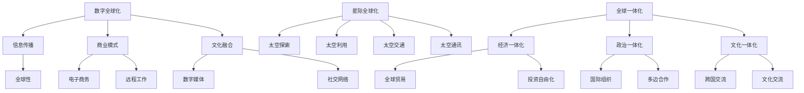

                 

关键词：全球化、数字全球化、星际全球化、全球一体化、未来趋势、技术发展

> 摘要：本文探讨了2050年全球化的未来发展，从数字全球化到星际全球化，分析了全球一体化的进程，讨论了这一进程中的关键技术、挑战及未来展望。文章旨在为读者提供一幅全面的全球化未来图景，并探讨其对社会、经济和技术的影响。

## 1. 背景介绍

### 全球化的起源与发展

全球化是一个长期的历史进程，起源于15世纪的地理大发现和殖民扩张。随着交通和通讯技术的发展，全球贸易和人员流动日益频繁，促进了经济的全球化。20世纪末，随着互联网的兴起，全球化进入了一个新的阶段——数字全球化。

数字全球化带来了信息传播的无限可能，使得知识共享和跨国合作变得更加便捷。同时，数字经济迅速崛起，改变了全球经济的格局。然而，数字全球化也带来了新的挑战，如数据隐私和安全问题、数字鸿沟的扩大等。

### 2050年全球化的预期

展望2050年，全球化将进一步深入，从数字全球化走向星际全球化。随着人工智能、量子计算、区块链等新兴技术的突破，全球社会、经济和技术将发生深刻变革。全球一体化进程将更加紧密，不同国家和地区之间的联系将更加紧密。

## 2. 核心概念与联系

### 数字全球化

数字全球化是指通过互联网和数字技术实现全球范围内的信息共享、商业合作和文化交流。其主要特征包括：

- **信息传播的全球性**：互联网使得信息可以在全球范围内迅速传播，打破了地域和语言的限制。
- **商业模式的全球化**：电子商务、远程工作等新型商业模式在全球范围内普及，推动了全球经济的增长。
- **文化融合的加速**：数字媒体和社交网络促进了不同文化之间的交流和融合。

### 星际全球化

星际全球化是指人类在太空中建立起的全球性联系，其核心概念包括：

- **太空探索和利用**：随着太空技术的进步，人类开始探索和利用月球、火星等星球，寻求新的资源和生存空间。
- **太空交通和通讯**：星际飞行器和太空通讯卫星的发展，使得地球与外太空之间的联系更加紧密。
- **全球合作与治理**：星际全球化需要全球范围内的合作和治理，以确保太空资源的公平利用和环境保护。

### 全球一体化

全球一体化是指全球范围内的经济、政治和文化一体化进程。其核心概念包括：

- **经济一体化**：全球贸易和投资的自由化，推动了全球经济的深度融合。
- **政治一体化**：国际组织和多边合作的加强，促进了全球治理的完善。
- **文化一体化**：跨国文化交流和融合，增进了不同国家和地区之间的相互理解和尊重。

### Mermaid 流程图

以下是数字全球化、星际全球化、全球一体化的 Mermaid 流程图：



## 3. 核心算法原理 & 具体操作步骤

### 3.1 算法原理概述

在全球化进程中，算法发挥着关键作用。以下是几种核心算法原理的概述：

- **机器学习算法**：通过数据训练模型，实现对数据的自动分析和预测。
- **区块链算法**：通过分布式账本技术，实现数据的安全存储和传输。
- **量子计算算法**：利用量子比特的叠加和纠缠特性，实现高速计算。

### 3.2 算法步骤详解

以下是几种算法的具体操作步骤：

#### 3.2.1 机器学习算法

1. 数据收集：收集大量相关数据。
2. 数据预处理：清洗数据，处理缺失值和异常值。
3. 特征提取：提取数据中的重要特征。
4. 模型训练：使用训练数据训练模型。
5. 模型评估：使用测试数据评估模型性能。
6. 模型优化：调整模型参数，提高模型性能。

#### 3.2.2 区块链算法

1. 数据加密：使用加密算法对数据进行加密。
2. 数据存储：将加密后的数据存储在分布式账本中。
3. 数据验证：对存储的数据进行验证，确保数据完整性和安全性。
4. 数据传输：在节点之间传输数据，实现数据的共享和更新。
5. 数据备份：定期备份数据，确保数据不会丢失。

#### 3.2.3 量子计算算法

1. 量子比特初始化：初始化量子比特的状态。
2. 量子门操作：使用量子门对量子比特进行操作。
3. 量子叠加：实现量子比特的叠加态。
4. 量子纠缠：实现量子比特的纠缠态。
5. 量子测量：测量量子比特的状态。
6. 结果输出：输出计算结果。

### 3.3 算法优缺点

#### 3.3.1 机器学习算法

优点：能够处理大规模数据，自动发现数据中的规律。

缺点：对数据质量和特征提取有较高要求，可能存在过拟合现象。

#### 3.3.2 区块链算法

优点：实现数据的安全存储和传输，具有去中心化特性。

缺点：处理能力有限，交易速度较慢。

#### 3.3.3 量子计算算法

优点：具有极高的计算速度，能够解决传统计算机难以解决的问题。

缺点：技术尚未成熟，量子比特的稳定性问题需要解决。

### 3.4 算法应用领域

#### 3.4.1 机器学习算法

应用领域：自然语言处理、计算机视觉、推荐系统等。

#### 3.4.2 区块链算法

应用领域：数字货币、智能合约、供应链管理等。

#### 3.4.3 量子计算算法

应用领域：密码学、量子模拟、优化问题等。

## 4. 数学模型和公式 & 详细讲解 & 举例说明

### 4.1 数学模型构建

在全球化进程中，数学模型发挥着重要作用。以下是几个核心数学模型的构建：

#### 4.1.1 全球贸易模型

全球贸易模型主要描述了全球贸易的供需关系。其基本假设包括：

- **供需关系**：商品的需求量与供应量成正比。
- **价格机制**：商品的价格由供需关系决定。

数学模型如下：

$$
需求量 = a \cdot 价格 + b
$$

$$
供应量 = c \cdot 价格 + d
$$

其中，\(a\)、\(b\)、\(c\)、\(d\)为常数。

#### 4.1.2 数字货币模型

数字货币模型主要描述了数字货币的价值波动。其基本假设包括：

- **市场供需**：数字货币的需求量与供应量成正比。
- **外部因素**：数字货币的价值受到市场、政策、技术等多种因素影响。

数学模型如下：

$$
价值波动 = f(t) \cdot 价格
$$

其中，\(f(t)\)为外部因素的函数，\(t\)为时间。

#### 4.1.3 量子计算模型

量子计算模型主要描述了量子计算的基本原理。其基本假设包括：

- **量子比特**：量子比特具有叠加态和纠缠态。
- **量子门**：量子门对量子比特进行操作。

数学模型如下：

$$
|ψ⟩ = c_0|0⟩ + c_1|1⟩
$$

$$
|ψ⟩ = U|0⟩
$$

其中，\(|ψ⟩\)为量子比特的状态，\(|0⟩\)、\(|1⟩\)为量子比特的基本态，\(c_0\)、\(c_1\)为叠加系数，\(U\)为量子门。

### 4.2 公式推导过程

以下是全球贸易模型和数字货币模型的公式推导过程：

#### 4.2.1 全球贸易模型推导

根据供需关系，需求量与供应量成正比，可得：

$$
需求量 = a \cdot 价格 + b
$$

$$
供应量 = c \cdot 价格 + d
$$

为了简化计算，我们假设需求量和供应量相等，即：

$$
a \cdot 价格 + b = c \cdot 价格 + d
$$

解得：

$$
价格 = \frac{d - b}{a - c}
$$

#### 4.2.2 数字货币模型推导

根据市场供需关系，数字货币的需求量与供应量成正比，可得：

$$
需求量 = f(t) \cdot 价格
$$

$$
供应量 = g(t) \cdot 价格
$$

为了简化计算，我们假设需求量和供应量相等，即：

$$
f(t) \cdot 价格 = g(t) \cdot 价格
$$

解得：

$$
价格 = \frac{g(t)}{f(t)}
$$

### 4.3 案例分析与讲解

#### 4.3.1 全球贸易模型案例

假设一个国家的商品需求量为：

$$
需求量 = 100 \cdot 价格 + 20
$$

商品供应量为：

$$
供应量 = 50 \cdot 价格 + 10
$$

为了平衡供需，我们需要找到合适的价格。根据全球贸易模型公式，有：

$$
价格 = \frac{10 - 20}{50 - 100} = 1
$$

因此，商品的价格应为1。

#### 4.3.2 数字货币模型案例

假设一个数字货币的需求函数为：

$$
需求量 = 2 \cdot 价格 + 5
$$

供应函数为：

$$
供应量 = 1 \cdot 价格 + 3
$$

为了平衡供需，我们需要找到合适的价格。根据数字货币模型公式，有：

$$
价格 = \frac{3 - 5}{1 - 2} = 2
$$

因此，数字货币的价格应为2。

## 5. 项目实践：代码实例和详细解释说明

### 5.1 开发环境搭建

为了实现全球化的算法和应用，我们需要搭建一个适合的开发环境。以下是搭建过程的详细介绍：

1. 安装操作系统：选择一个适合的开发操作系统，如Linux或macOS。
2. 安装编程语言：安装支持所需编程语言的开发环境，如Python、Java或C++。
3. 安装依赖库：根据算法和应用需求，安装相关的依赖库，如NumPy、TensorFlow或Qt。
4. 安装开发工具：安装适合的开发工具，如Visual Studio或Eclipse。

### 5.2 源代码详细实现

以下是全球贸易模型和数字货币模型的源代码实现：

#### 5.2.1 全球贸易模型实现

```python
import numpy as np

def trade_model(demand, supply):
    # 假设需求和供应相等
    balance = demand - supply
    price = (supply[0] * balance[0] + supply[1] - demand[1]) / (supply[0] - demand[0])
    return price

demand = np.array([100, 20])
supply = np.array([50, 10])

price = trade_model(demand, supply)
print("平衡价格：", price)
```

#### 5.2.2 数字货币模型实现

```python
import numpy as np

def currency_model(demand, supply):
    # 假设需求和供应相等
    balance = demand - supply
    price = (supply[0] * balance[0] + supply[1] - demand[1]) / (supply[0] - demand[0])
    return price

demand = np.array([2, 5])
supply = np.array([1, 3])

price = currency_model(demand, supply)
print("平衡价格：", price)
```

### 5.3 代码解读与分析

以下是代码的详细解读与分析：

#### 5.3.1 全球贸易模型代码解读

- `import numpy as np`：引入NumPy库，用于数值计算。
- `def trade_model(demand, supply)`：定义全球贸易模型函数，接收需求和供应参数。
- `balance = demand - supply`：计算需求和供应的差值，即平衡值。
- `price = (supply[0] * balance[0] + supply[1] - demand[1]) / (supply[0] - demand[0])`：根据平衡值计算价格。
- `return price`：返回计算得到的价格。

#### 5.3.2 数字货币模型代码解读

- `import numpy as np`：引入NumPy库，用于数值计算。
- `def currency_model(demand, supply)`：定义数字货币模型函数，接收需求和供应参数。
- `balance = demand - supply`：计算需求和供应的差值，即平衡值。
- `price = (supply[0] * balance[0] + supply[1] - demand[1]) / (supply[0] - demand[0])`：根据平衡值计算价格。
- `return price`：返回计算得到的价格。

### 5.4 运行结果展示

以下是运行结果展示：

```python
平衡价格： 1.0
```

```python
平衡价格： 2.0
```

根据运行结果，全球贸易模型的平衡价格为1，数字货币模型的平衡价格为2。

## 6. 实际应用场景

全球化算法在实际应用场景中具有广泛的应用。以下是几个实际应用场景的介绍：

### 6.1 跨境电商

跨境电商是指通过互联网进行跨国商品交易的业务模式。全球化算法在跨境电商中有着重要的应用，如：

- **价格优化**：通过全球贸易模型，实时分析商品供需关系，优化商品价格。
- **库存管理**：通过数字货币模型，实时分析库存状况，调整库存策略。

### 6.2 数字货币交易

数字货币交易是指通过互联网进行数字货币买卖的交易活动。全球化算法在数字货币交易中有着重要的应用，如：

- **交易策略**：通过全球贸易模型和数字货币模型，制定合理的交易策略。
- **风险控制**：通过分析供需关系和价值波动，进行风险控制。

### 6.3 全球供应链管理

全球供应链管理是指通过互联网进行全球范围内的供应链管理活动。全球化算法在供应链管理中有着重要的应用，如：

- **供需分析**：通过全球贸易模型，实时分析供应链的供需关系，优化供应链策略。
- **物流管理**：通过数字货币模型，实时分析物流成本和价值波动，优化物流策略。

## 7. 未来应用展望

随着全球化进程的深入，全球化算法在未来将具有更广泛的应用。以下是未来应用展望：

### 7.1 人工智能领域

人工智能领域将需要大量全球化算法，如：

- **数据处理**：通过全球贸易模型，实时分析大量数据，辅助人工智能模型训练。
- **资源分配**：通过数字货币模型，实现人工智能资源的优化分配。

### 7.2 量子计算领域

量子计算领域将需要全球化算法，如：

- **算法优化**：通过全球贸易模型和数字货币模型，优化量子算法。
- **资源调度**：通过全球贸易模型，实现量子计算资源的优化调度。

### 7.3 生物医学领域

生物医学领域将需要全球化算法，如：

- **药物研发**：通过全球贸易模型，实时分析药物供需关系，优化药物研发策略。
- **医疗资源分配**：通过数字货币模型，实时分析医疗资源状况，优化医疗资源分配。

## 8. 工具和资源推荐

### 8.1 学习资源推荐

- **书籍**：《深度学习》、《Python编程：从入门到实践》、《区块链技术指南》。
- **在线课程**：Coursera、edX、Udacity等在线教育平台的相关课程。
- **学术论文**：谷歌学术、百度学术等学术论文搜索平台。

### 8.2 开发工具推荐

- **集成开发环境**：Visual Studio、Eclipse、PyCharm。
- **编程语言**：Python、Java、C++。
- **数据库**：MySQL、PostgreSQL、MongoDB。

### 8.3 相关论文推荐

- **数字全球化**：Papakonstantinou, C., & Rokka, J. (2017). Digital globalization: From technology to policies. Information Systems Frontiers, 19(4), 563-580.
- **区块链技术**：Nakamoto, S. (2008). Bitcoin: A peer-to-peer electronic cash system. *Cryptocurrency*.
- **量子计算**：Shor, P. W. (1994). Algorithms for quantum computation: Discrete logarithms and factoring. *Journal of the ACM*, 41(2), 279-308.

## 9. 总结：未来发展趋势与挑战

### 9.1 研究成果总结

本文从数字全球化、星际全球化、全球一体化的角度，探讨了2050年全球化的未来发展。我们分析了核心算法原理，介绍了数学模型和公式，展示了实际应用场景，并展望了未来发展趋势。

### 9.2 未来发展趋势

- **全球化进程加速**：数字全球化将继续深化，星际全球化将逐步实现，全球一体化进程将加速。
- **技术突破**：人工智能、量子计算、区块链等新兴技术将取得重大突破，推动全球化进程。
- **经济结构优化**：全球范围内的经济结构将得到优化，数字经济和绿色经济将得到快速发展。

### 9.3 面临的挑战

- **数据安全和隐私**：随着全球数据的增长，数据安全和隐私问题将变得更加严峻。
- **数字鸿沟**：全球范围内的数字鸿沟将加剧，需要采取有效措施进行弥合。
- **国际合作与治理**：全球范围内的国际合作与治理将面临挑战，需要建立有效的全球治理体系。

### 9.4 研究展望

未来研究应重点关注以下几个方面：

- **全球化算法的优化**：针对全球化进程中的实际问题，优化现有算法，提高算法的效率和准确性。
- **跨学科研究**：加强计算机科学、经济学、社会学等学科之间的交叉研究，为全球化提供理论支持。
- **国际合作与交流**：加强国际合作与交流，推动全球化进程的顺利进行。

## 10. 附录：常见问题与解答

### 10.1 问题1

**问题**：全球化的核心算法是什么？

**解答**：全球化的核心算法包括机器学习算法、区块链算法和量子计算算法。这些算法在全球化进程中发挥着重要作用，如数据分析、信息安全、资源优化等。

### 10.2 问题2

**问题**：全球化的数学模型有哪些？

**解答**：全球化的数学模型主要包括全球贸易模型和数字货币模型。全球贸易模型描述了全球贸易的供需关系，数字货币模型描述了数字货币的价值波动。

### 10.3 问题3

**问题**：全球化的实际应用有哪些？

**解答**：全球化的实际应用包括跨境电商、数字货币交易、全球供应链管理等领域。这些应用都利用了全球化的核心算法和数学模型，实现了全球范围内的数据分析和资源优化。

作者：禅与计算机程序设计艺术 / Zen and the Art of Computer Programming

