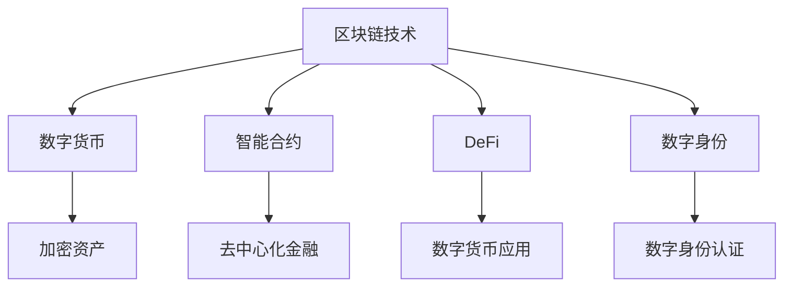

                 

关键词：数字货币、加密资产、货币演变、区块链、智能合约、未来趋势

> 摘要：本文探讨了2050年数字货币的发展前景，从纸币到加密资产的演变，分析了这一变革对经济和社会的深远影响，以及技术进步在其中的推动作用。

## 1. 背景介绍

在过去几十年中，金融技术（FinTech）迅猛发展，数字货币逐渐成为金融市场的重要参与者。然而，随着技术的不断进步，特别是在区块链和人工智能领域，未来的数字货币将迎来更为深刻和全面的变革。

### 1.1 纸币的现状

纸币作为传统的货币形式，已经存在了几千年。然而，随着电子支付、移动支付和在线交易的发展，纸币的使用频率逐渐降低。尽管如此，纸币在一些方面仍然具有不可替代的优势，如易用性、普及性和无需技术设备即可进行交易等。

### 1.2 数字货币的崛起

数字货币，如比特币、以太坊等，通过区块链技术实现去中心化的交易和存储。这种新型货币形式在安全性、透明度和去信任化方面表现出色，吸引了大量投资者和用户的关注。

### 1.3 加密资产的发展

加密资产，包括数字货币和基于区块链的其他资产，如代币、NFT等，逐渐成为金融市场的重要组成部分。这些资产不仅具有投资价值，还可以作为支付工具和数字身份的载体。

## 2. 核心概念与联系

为了更好地理解数字货币和加密资产的发展，我们需要从以下几个核心概念和联系入手：

### 2.1 区块链

区块链是数字货币和加密资产的基础技术。它通过分布式账本记录交易，确保数据的不可篡改性和透明性。

### 2.2 智能合约

智能合约是区块链上的可编程合同，自动执行满足特定条件的交易。它使得交易更加高效和安全。

### 2.3 去中心化金融（DeFi）

去中心化金融是一种基于区块链的金融体系，无需传统金融机构即可进行各种金融交易。DeFi的应用正在不断扩展，为数字货币和加密资产的发展提供了新的可能性。

### 2.4 数字身份

数字身份是基于区块链技术的身份验证和授权机制，确保用户隐私和安全性。数字身份在未来的数字货币和加密资产体系中将发挥重要作用。

## 3. 核心算法原理 & 具体操作步骤

### 3.1 算法原理概述

数字货币和加密资产的核心算法主要包括：

- **区块链共识算法**：确保分布式账本的一致性和安全性。
- **加密算法**：保护交易和用户隐私。
- **智能合约执行机制**：自动化和透明地执行合同条款。

### 3.2 算法步骤详解

- **区块链共识算法**：如PoW（工作量证明）、PoS（权益证明）等。
- **加密算法**：如SHA-256、RSA等。
- **智能合约执行**：编写智能合约代码，部署到区块链上，触发执行。

### 3.3 算法优缺点

- **区块链共识算法**：优点是安全、去中心化，缺点是能耗高、效率低。
- **加密算法**：优点是保护隐私、安全可靠，缺点是实现复杂、计算开销大。
- **智能合约**：优点是自动化、透明，缺点是存在智能合约漏洞的风险。

### 3.4 算法应用领域

- **金融领域**：数字货币和加密资产作为支付工具和投资标的。
- **供应链管理**：使用区块链记录和追踪商品信息。
- **身份验证**：使用数字身份进行安全认证。

## 4. 数学模型和公式 & 详细讲解 & 举例说明

### 4.1 数学模型构建

数字货币和加密资产的发展离不开数学模型的支撑。以下是几个关键的数学模型：

- **哈希函数**：用于确保数据的一致性和不可篡改性。
- **椭圆曲线加密**：用于保护交易和用户隐私。
- **博弈论**：用于分析区块链共识算法的稳定性。

### 4.2 公式推导过程

- **哈希函数**：$$H(x) = \text{SHA-256}(x)$$
- **椭圆曲线加密**：$$y^2 = x^3 + ax + b$$
- **博弈论**：$$\epsilon = \frac{1}{n} \sum_{i=1}^{n} \epsilon_i$$

### 4.3 案例分析与讲解

以比特币的区块链共识算法为例，分析其工作原理和优缺点。

- **工作原理**：矿工通过解决数学难题来验证交易，并记录在区块链上。
- **优点**：去中心化、安全性高。
- **缺点**：能耗高、交易速度慢。

## 5. 项目实践：代码实例和详细解释说明

### 5.1 开发环境搭建

搭建一个区块链开发环境，包括节点搭建、网络配置和开发工具安装。

### 5.2 源代码详细实现

实现一个简单的区块链节点，包括区块创建、交易处理和链维护等功能。

### 5.3 代码解读与分析

对实现的代码进行详细解读，分析其实现原理和性能表现。

### 5.4 运行结果展示

展示区块链节点的运行结果，包括区块创建、交易验证和链维护等过程。

## 6. 实际应用场景

数字货币和加密资产在未来的实际应用场景将更加广泛，包括：

- **金融领域**：数字货币作为支付工具和投资标的。
- **供应链管理**：区块链用于记录和追踪商品信息。
- **身份验证**：数字身份用于安全认证和授权。

## 7. 工具和资源推荐

### 7.1 学习资源推荐

- **区块链技术基础教程**
- **智能合约开发实战**
- **加密算法原理与应用**

### 7.2 开发工具推荐

- **Geth**
- **Truffle**
- **Web3.js**

### 7.3 相关论文推荐

- **区块链：一种分布式数据库技术**
- **智能合约：区块链上的自动化合同执行**
- **去中心化金融：未来金融体系的新范式**

## 8. 总结：未来发展趋势与挑战

### 8.1 研究成果总结

数字货币和加密资产在过去几十年中取得了显著的发展，成为金融市场的重要组成部分。未来，随着技术的进一步进步，数字货币和加密资产将迎来更为广泛和深入的应用。

### 8.2 未来发展趋势

- **数字货币普及**：越来越多的国家和机构将采用数字货币。
- **加密资产多样化**：除了数字货币，加密资产将涵盖更广泛的领域。
- **去中心化金融发展**：DeFi将逐步取代传统金融体系。

### 8.3 面临的挑战

- **安全性**：确保数字货币和加密资产的安全性。
- **监管**：建立有效的监管框架，平衡创新与风险。
- **用户教育**：提高用户对数字货币和加密资产的认识。

### 8.4 研究展望

未来，数字货币和加密资产的发展将更加注重技术创新和实际应用。研究者将致力于解决现有问题，推动数字货币和加密资产迈向更加成熟和稳定的阶段。

## 9. 附录：常见问题与解答

### 9.1 数字货币与加密资产的区别是什么？

数字货币是加密资产的一种，它是一种数字化的货币形式，可以用于支付和交易。而加密资产则是一个更广泛的概念，包括数字货币以及基于区块链的各类数字资产，如代币、NFT等。

### 9.2 数字货币的安全性能如何？

数字货币的安全性主要依赖于区块链技术和加密算法。区块链确保了交易记录的不可篡改性和透明性，而加密算法则保护了用户的交易隐私。然而，数字货币仍然面临潜在的安全风险，如恶意攻击和智能合约漏洞。

### 9.3 数字货币会取代纸币吗？

数字货币和纸币各有其优势和应用场景，因此不可能完全取代纸币。然而，随着数字货币的普及，纸币的使用频率可能会逐渐降低，特别是在一些发达国家和地区。

---

作者：禅与计算机程序设计艺术 / Zen and the Art of Computer Programming

本文通过深入分析数字货币和加密资产的发展历程、核心算法、数学模型以及实际应用场景，探讨了2050年数字货币的未来趋势。尽管面临诸多挑战，但数字货币和加密资产有望在未来成为金融体系的重要支柱，推动社会的数字化进程。随着技术的不断进步，我们有理由相信，数字货币将迎来一个更加光明和广阔的未来。

