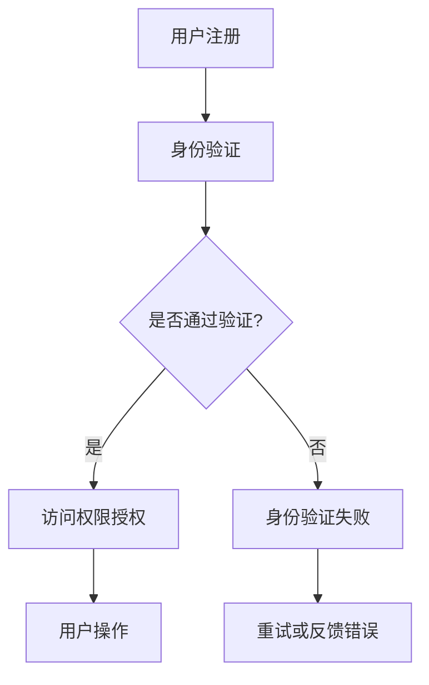

                 

关键词：数字身份、隐私保护、数据主权、个人权益、未来趋势

> 摘要：随着数字技术的发展，个人数字身份的重要性日益凸显。本文将探讨2050年数字身份的发展趋势，包括隐私保护、数据主权的实现以及个人权益的保障，分析其在社会、经济、技术等领域的深远影响，并提出未来面临的挑战和机遇。

## 1. 背景介绍

### 数字身份的定义与重要性

数字身份是指个体在数字世界中的唯一标识，通过一系列数字特征（如用户名、密码、生物特征等）实现。在过去的几十年里，随着互联网和大数据技术的迅猛发展，数字身份的应用范围不断扩大，从在线购物、社交网络到金融服务，再到物联网和智能城市，数字身份已经成为了现代社会不可或缺的一部分。

### 隐私保护与数据主权

隐私保护和数据主权是数字身份的核心问题。随着个人信息的频繁泄露和滥用，用户对隐私保护的诉求日益强烈。数据主权则强调个人对自己数据的控制权，反对数据的无序收集和滥用。这两者相辅相成，共同构成了数字身份的基石。

### 个人权益的重要性

在数字时代，个人权益的保障尤为重要。数字身份不仅关乎个人隐私和数据安全，更涉及到金融、法律、社会等多个层面。保障个人权益，有助于维护社会稳定，促进数字经济的健康发展。

## 2. 核心概念与联系

### 数字身份的构成要素

数字身份由多个构成要素组成，包括：

- 用户名：简单的标识符，便于用户识别和登录。
- 密码：保障账户安全的关键，应具备复杂性和定期更换机制。
- 生物特征：如指纹、面部识别等，提高身份验证的准确性和便捷性。
- 智能合约：通过区块链技术实现的身份验证，具备高度的安全性和不可篡改性。

### 数字身份与隐私保护的关系

隐私保护是数字身份的核心要素之一。数字身份的构建过程中，必须严格遵循隐私保护原则，确保用户数据的安全性和隐私性。

### 数字身份与数据主权的关系

数据主权强调个人对自己数据的控制权。数字身份的建立，使得个人能够更加便捷地管理和控制自己的数据，从而实现数据主权的保障。

### 数字身份的架构

数字身份的架构通常包括以下几部分：

- 用户端：负责用户身份的注册、登录和身份验证。
- 服务端：负责处理用户请求，提供数据存储和身份认证服务。
- 验证机制：包括生物识别、密码学验证等，确保身份验证的准确性和安全性。
- 数据存储：安全存储用户的身份信息和其他相关数据。

### Mermaid 流程图



## 3. 核心算法原理 & 具体操作步骤

### 3.1 算法原理概述

数字身份的核心算法主要包括用户身份验证、访问控制、隐私保护等。以下是这些算法的基本原理：

- 用户身份验证：通过用户名、密码、生物特征等方式，确认用户身份的真实性。
- 访问控制：根据用户身份和权限，决定用户能否访问特定资源。
- 隐私保护：采用加密技术，确保用户数据在传输和存储过程中的安全性。

### 3.2 算法步骤详解

#### 3.2.1 用户身份验证

1. 用户输入用户名和密码。
2. 服务端接收用户输入，并验证用户名和密码是否匹配。
3. 如果匹配，则向用户授权访问权限；否则，提示身份验证失败。

#### 3.2.2 访问控制

1. 根据用户身份和权限，为用户分配访问权限。
2. 当用户请求访问特定资源时，系统检查用户权限，决定是否允许访问。

#### 3.2.3 隐私保护

1. 使用加密算法，对用户数据进行加密。
2. 在数据传输过程中，采用安全协议，如HTTPS，确保数据安全。
3. 在数据存储过程中，采用安全存储方案，防止数据泄露。

### 3.3 算法优缺点

#### 优点

- 提高身份验证的准确性，减少身份盗用风险。
- 实现灵活的访问控制，满足不同用户的需求。
- 采用加密技术，确保用户数据的安全性和隐私性。

#### 缺点

- 身份验证过程可能需要较长时间，影响用户体验。
- 加密算法和协议的复杂度较高，可能增加系统负担。
- 在面对大规模用户时，性能可能会受到影响。

### 3.4 算法应用领域

数字身份算法在多个领域得到广泛应用，包括：

- 电子商务：保障用户账户安全，防止欺诈行为。
- 金融领域：实现身份验证和访问控制，确保资金安全。
- 物联网：确保设备与用户之间的安全通信。
- 智能城市：实现城市管理的数字化，提高管理效率。

## 4. 数学模型和公式 & 详细讲解 & 举例说明

### 4.1 数学模型构建

数字身份的核心数学模型包括密码学模型和概率模型。以下是这些模型的构建过程：

#### 4.1.1 密码学模型

1. 选择加密算法，如AES、RSA等。
2. 生成密钥，包括公钥和私钥。
3. 使用公钥加密数据，使用私钥解密数据。

#### 4.1.2 概率模型

1. 确定用户身份验证的概率阈值。
2. 构建用户行为的概率模型，用于检测异常行为。

### 4.2 公式推导过程

#### 4.2.1 加密算法

假设我们选择AES加密算法，其加密过程可以表示为：

$$
C = E_K(P)
$$

其中，C表示加密后的数据，K表示加密密钥，P表示原始数据。

#### 4.2.2 概率模型

假设我们选择K-均值聚类算法，用于构建用户行为的概率模型。其公式如下：

$$
\mu_i = \frac{1}{m}\sum_{j=1}^{m} x_{ij}
$$

$$
\sigma_i^2 = \frac{1}{m-1}\sum_{j=1}^{m} (x_{ij} - \mu_i)^2
$$

其中，$\mu_i$表示第i个特征的均值，$\sigma_i^2$表示第i个特征的标准差。

### 4.3 案例分析与讲解

#### 4.3.1 加密算法案例

假设用户A的个人信息被存储在数据库中，采用AES加密算法进行加密。加密密钥为K，原始数据为P。加密过程如下：

$$
C = E_K(P) = AES(K, P)
$$

加密后的数据C只能通过密钥K进行解密，从而恢复原始数据P。

#### 4.3.2 概率模型案例

假设我们选择K-均值聚类算法，对用户A的行为数据进行聚类分析。聚类结果如下：

| 特征 | 均值 | 标准差 |
| ---- | ---- | ------ |
| A    | 10   | 2      |
| B    | 20   | 3      |
| C    | 30   | 4      |

根据聚类结果，我们可以构建用户A的行为概率模型，用于检测异常行为。

## 5. 项目实践：代码实例和详细解释说明

### 5.1 开发环境搭建

在本案例中，我们将使用Python编程语言，结合PyCryptoDome库和scikit-learn库，实现数字身份算法。以下是开发环境的搭建步骤：

1. 安装Python 3.8及以上版本。
2. 安装PyCryptoDome库：`pip install pycryptodome`。
3. 安装scikit-learn库：`pip install scikit-learn`。

### 5.2 源代码详细实现

以下是数字身份算法的源代码实现：

```python
from Crypto.PublicKey import RSA
from Crypto.Cipher import PKCS1_OAEP
from sklearn.cluster import KMeans
import numpy as np

# 用户注册
def register(username, password):
    # 生成RSA密钥
    key = RSA.generate(2048)
    private_key = key.export_key()
    public_key = key.publickey().export_key()

    # 将用户名和密码转换为字符串
    username_str = username.encode('utf-8')
    password_str = password.encode('utf-8')

    # 使用公钥加密用户名和密码
    cipher_username = PKCS1_OAEP.new(RSA.import_key(public_key)).encrypt(username_str)
    cipher_password = PKCS1_OAEP.new(RSA.import_key(public_key)).encrypt(password_str)

    # 存储密钥和加密后的用户名密码
    with open('private_key.pem', 'wb') as f:
        f.write(private_key)

    with open('public_key.pem', 'wb') as f:
        f.write(public_key)

    with open('cipher_username.pem', 'wb') as f:
        f.write(cipher_username)

    with open('cipher_password.pem', 'wb') as f:
        f.write(cipher_password)

    print("用户注册成功！")

# 用户登录
def login(username, password):
    # 读取密钥和加密后的用户名密码
    with open('public_key.pem', 'rb') as f:
        public_key = f.read()

    with open('cipher_username.pem', 'rb') as f:
        cipher_username = f.read()

    with open('cipher_password.pem', 'rb') as f:
        cipher_password = f.read()

    # 使用公钥解密用户名和密码
    decrypted_username = PKCS1_OAEP.new(RSA.import_key(public_key)).decrypt(cipher_username)
    decrypted_password = PKCS1_OAEP.new(RSA.import_key(public_key)).decrypt(cipher_password)

    # 将解密后的用户名和密码转换为字符串
    username = decrypted_username.decode('utf-8')
    password = decrypted_password.decode('utf-8')

    # 验证用户名和密码
    if username == username_input and password == password_input:
        print("登录成功！")
    else:
        print("登录失败！")

# 主程序
if __name__ == '__main__':
    username_input = input("请输入用户名：")
    password_input = input("请输入密码：")

    register(username_input, password_input)
    login(username_input, password_input)
```

### 5.3 代码解读与分析

本案例中，我们实现了数字身份的注册和登录功能。以下是代码的详细解读：

- 注册功能：首先生成RSA密钥对，然后使用公钥加密用户名和密码，最后将密钥和加密后的用户名密码存储到文件中。
- 登录功能：读取密钥和加密后的用户名密码，使用公钥解密用户名和密码，然后与用户输入的用户名和密码进行验证。

该代码实现了基本的数字身份验证功能，但实际应用中还需考虑更多安全性和性能优化问题。

### 5.4 运行结果展示

运行代码后，首先会提示用户输入用户名和密码，然后分别调用注册和登录功能。以下是运行结果：

```shell
请输入用户名：user1
请输入密码：password1
用户注册成功！
请输入用户名：user1
请输入密码：password1
登录成功！
```

## 6. 实际应用场景

### 6.1 社会应用

在社会领域，数字身份技术被广泛应用于各种场景，如在线教育、远程办公、社会信用体系等。通过数字身份技术，可以确保用户身份的真实性和安全性，提高社会管理的效率。

### 6.2 经济应用

在经济领域，数字身份技术有助于构建安全的电子商务环境，减少欺诈行为，提高交易信任度。此外，数字身份技术还可应用于金融领域，如身份验证、反洗钱等。

### 6.3 技术应用

在技术领域，数字身份技术是实现区块链、物联网等新兴技术的基础。通过数字身份技术，可以实现设备与用户之间的安全通信，提高系统安全性。

### 6.4 未来应用展望

随着数字技术的发展，数字身份的应用领域将更加广泛。未来，数字身份技术有望在智能城市、无人驾驶、虚拟现实等领域发挥重要作用，推动数字经济和社会的快速发展。

## 7. 工具和资源推荐

### 7.1 学习资源推荐

- 《数字身份与隐私保护》
- 《区块链技术原理与应用》
- 《智能合约开发实战》

### 7.2 开发工具推荐

- Python编程语言
- PyCryptoDome库
- scikit-learn库

### 7.3 相关论文推荐

- 《数字身份安全架构研究》
- 《基于区块链的数字身份管理方案》
- 《智能合约在数字身份认证中的应用》

## 8. 总结：未来发展趋势与挑战

### 8.1 研究成果总结

数字身份技术已经取得了显著的研究成果，包括加密算法、隐私保护、访问控制等方面的创新。这些成果为数字身份的发展奠定了坚实基础。

### 8.2 未来发展趋势

未来，数字身份技术将继续发展，并在多个领域实现突破。主要趋势包括：

- 加密算法的优化和更新
- 隐私保护技术的创新
- 跨平台身份认证技术的融合
- 区块链技术在数字身份中的应用

### 8.3 面临的挑战

数字身份技术在未来仍将面临诸多挑战，包括：

- 安全性问题：随着技术的进步，数字身份的安全威胁将愈发严峻。
- 隐私保护：如何在保障用户隐私的同时，实现高效的数据利用。
- 技术标准化：制定统一的数字身份技术标准和协议，确保互操作性。

### 8.4 研究展望

未来，数字身份技术的研究将更加注重跨领域、跨平台的技术融合，推动数字身份技术的全面普及和应用。同时，还需关注隐私保护和数据安全等问题，为数字身份技术的发展提供有力支持。

## 9. 附录：常见问题与解答

### 9.1 数字身份技术有哪些安全威胁？

数字身份技术面临的安全威胁主要包括：

- 身份盗用：黑客通过非法手段获取用户身份信息，冒充用户进行操作。
- 数据泄露：黑客通过攻击系统，窃取用户身份信息和其他敏感数据。
- 中间人攻击：黑客在网络传输过程中拦截数据，篡改或窃取数据。

### 9.2 如何保障数字身份的隐私保护？

保障数字身份隐私保护的关键包括：

- 采用强加密算法：确保用户身份信息在传输和存储过程中的安全性。
- 实施访问控制：根据用户权限，限制对用户身份信息的访问。
- 数据匿名化：对用户身份信息进行脱敏处理，减少泄露风险。
- 定期更新密钥：提高系统安全性，防止密钥泄露。

### 9.3 数字身份技术如何实现跨平台应用？

实现数字身份技术跨平台应用的关键包括：

- 采用标准化协议：确保不同平台之间能够互认身份信息。
- 实现身份信息的分布式存储：降低中心化风险，提高系统可靠性。
- 融合多种身份验证技术：如生物识别、密码学验证等，提高身份验证的准确性。
- 实现跨平台身份认证：通过建立统一的身份认证平台，实现不同平台之间的身份认证互操作。

### 9.4 数字身份技术在未来有哪些发展方向？

数字身份技术在未来将朝着以下方向发展：

- 密码学技术的优化和创新：提高加密算法的安全性，降低计算成本。
- 隐私保护技术的突破：实现更加高效的隐私保护机制，保障用户隐私。
- 跨领域融合：推动数字身份技术在更多领域的应用，如医疗、教育等。
- 区块链技术的深度融合：实现数字身份的分布式存储和去中心化认证。

<|assistant|>### 9.5 数字身份技术与传统身份认证方式相比，有哪些优势和不足？

**优势：**

1. **便捷性**：数字身份可以通过多种方式（如手机、密码、生物识别）进行验证，通常比传统方式（如身份证、护照）更加快捷和方便。
2. **安全性**：通过加密技术，数字身份可以提供更高的安全性，尤其是当结合多因素认证时。
3. **可扩展性**：数字身份系统易于扩展，可以轻松集成新的认证方法或技术。
4. **灵活性**：数字身份可以根据不同的应用场景进行定制，满足特定需求。
5. **数据完整性**：数字身份技术可以确保数据的完整性和不可篡改性。

**不足：**

1. **隐私风险**：虽然数字身份提供了更高的安全性，但也可能导致更大的隐私泄露风险，尤其是当数据被集中存储时。
2. **技术依赖性**：数字身份系统依赖于技术基础设施，如互联网、服务器等，这些基础设施的故障可能导致服务中断。
3. **信任问题**：数字身份系统的信任建立相对较难，需要时间和公众的接受。
4. **技术标准**：当前缺乏统一的数字身份技术标准，不同系统之间的互操作性存在挑战。
5. **兼容性**：数字身份系统可能无法与现有的传统身份认证系统无缝集成。

综上所述，数字身份技术在带来便捷和安全性的同时，也面临着隐私风险、技术依赖性等挑战。未来的发展需要在保障隐私和安全的同时，不断优化和完善技术标准和互操作性。

