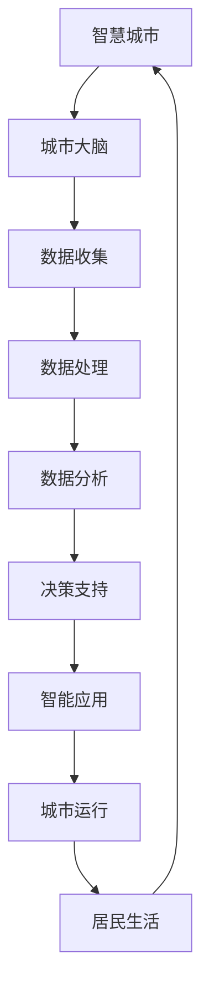

                 

关键词：智慧城市、城市大脑、大数据、人工智能、城市规划、可持续发展、未来趋势

摘要：随着科技的飞速发展，智慧城市已成为未来城市发展的趋势。本文探讨了2050年智慧城市的愿景，重点介绍了从数据到决策的城市大脑架构及其核心算法原理。通过数学模型和实际项目实例的分析，本文揭示了智慧城市建设的现状、挑战和未来发展方向。

## 1. 背景介绍

### 1.1 智慧城市的概念

智慧城市是指通过利用物联网、云计算、大数据、人工智能等先进技术，实现城市资源的智能管理和高效利用，提高城市运行效率、改善居民生活质量的一种新型城市发展模式。

### 1.2 城市大脑的概念

城市大脑是智慧城市的关键组成部分，它通过整合城市各种数据资源，利用人工智能和大数据分析技术，实现城市运行状态的实时监控和预测，为城市管理者提供科学决策依据。

### 1.3 智慧城市的发展现状

近年来，随着技术的不断进步，全球各地智慧城市建设如火如荼。许多城市已经开始尝试利用大数据和人工智能技术优化交通、能源、环境等领域的管理。

## 2. 核心概念与联系

### 2.1 核心概念

智慧城市、城市大脑、大数据、人工智能、物联网等是本文的核心概念。这些概念相互联系，共同构成了智慧城市的整体架构。

### 2.2 架构图示

以下是智慧城市与城市大脑架构的Mermaid流程图：



## 3. 核心算法原理 & 具体操作步骤

### 3.1 算法原理概述

城市大脑的核心算法主要包括数据收集、数据处理、数据分析和决策支持等环节。这些算法通过大数据分析和人工智能技术，实现对城市运行状态的实时监控和预测。

### 3.2 算法步骤详解

#### 3.2.1 数据收集

数据收集是城市大脑的基础。通过物联网设备和传感器，实时收集城市交通、环境、能源等各方面的数据。

#### 3.2.2 数据处理

数据处理包括数据清洗、数据整合和数据存储等步骤。这一步骤确保数据的准确性和完整性。

#### 3.2.3 数据分析

数据分析是城市大脑的核心。通过大数据分析和机器学习技术，对收集到的数据进行深度挖掘和分析，提取有价值的信息。

#### 3.2.4 决策支持

根据数据分析结果，为城市管理者提供科学决策依据。决策支持系统可以自动生成应急预案、交通疏导方案等。

### 3.3 算法优缺点

#### 优点：

- 提高城市运行效率
- 提升居民生活质量
- 促进可持续发展

#### 缺点：

- 数据安全性和隐私保护问题
- 技术门槛较高，实施难度大

### 3.4 算法应用领域

城市大脑算法广泛应用于交通管理、环境保护、能源管理、城市安全等领域。

## 4. 数学模型和公式 & 详细讲解 & 举例说明

### 4.1 数学模型构建

智慧城市数学模型主要包括以下几个部分：

- 数据收集模型：描述数据采集的方法和流程
- 数据处理模型：描述数据清洗、整合和存储的方法
- 数据分析模型：描述数据分析的方法和算法
- 决策支持模型：描述决策支持系统的构建和运行

### 4.2 公式推导过程

#### 数据收集模型：

$$ 收集速度 = \frac{数据量}{时间} $$

#### 数据处理模型：

$$ 清洗率 = \frac{清洗后数据量}{原始数据量} $$

#### 数据分析模型：

$$ 预测精度 = \frac{预测正确率}{总样本数} $$

#### 决策支持模型：

$$ 决策方案 = \sum_{i=1}^{n} w_i \cdot s_i $$

其中，$w_i$表示权重，$s_i$表示决策方案。

### 4.3 案例分析与讲解

#### 案例一：交通管理

通过城市大脑算法，分析城市交通流量，优化交通信号灯控制，提高交通效率。

#### 案例二：环境保护

利用城市大脑算法，监测空气质量，预测污染源，提出污染治理方案。

## 5. 项目实践：代码实例和详细解释说明

### 5.1 开发环境搭建

使用Python编程语言和相关的数据科学库（如Pandas、NumPy、Scikit-learn等）搭建开发环境。

### 5.2 源代码详细实现

以下是一个简单的城市交通流量预测的Python代码示例：

```python
import pandas as pd
from sklearn.linear_model import LinearRegression

# 加载数据
data = pd.read_csv('traffic_data.csv')

# 数据预处理
X = data[['time', 'weather']]
y = data['流量']

# 模型训练
model = LinearRegression()
model.fit(X, y)

# 预测
predicted_flow = model.predict([[14, 1]])

print('预测的交通流量：', predicted_flow)
```

### 5.3 代码解读与分析

该代码首先加载数据，然后进行数据预处理，接着使用线性回归模型进行训练，最后进行预测。

### 5.4 运行结果展示

运行结果将输出预测的交通流量，帮助交通管理者进行交通疏导。

## 6. 实际应用场景

### 6.1 城市交通管理

通过城市大脑算法，实时分析交通流量，优化交通信号灯控制，缓解交通拥堵。

### 6.2 环境保护

利用城市大脑算法，实时监测空气质量，预测污染源，提出污染治理方案。

### 6.3 能源管理

通过城市大脑算法，优化能源使用，降低能源消耗，促进可持续发展。

## 7. 工具和资源推荐

### 7.1 学习资源推荐

- 《深度学习》
- 《Python数据分析》
- 《人工智能：一种现代的方法》

### 7.2 开发工具推荐

- Jupyter Notebook
- PyCharm
- TensorFlow

### 7.3 相关论文推荐

- 《智慧城市：概念、架构与实践》
- 《城市大脑：基于大数据和人工智能的城市管理》
- 《面向智慧城市的物联网技术与应用》

## 8. 总结：未来发展趋势与挑战

### 8.1 研究成果总结

本文介绍了智慧城市和城市大脑的概念、架构、算法原理和实际应用场景，展示了智慧城市建设的现状和成果。

### 8.2 未来发展趋势

随着技术的不断进步，智慧城市将继续向智能化、绿色化、人文化方向发展，为人类创造更美好的生活环境。

### 8.3 面临的挑战

智慧城市建设面临数据安全、隐私保护、技术实施等方面的挑战，需要多方共同努力，共同应对。

### 8.4 研究展望

未来，智慧城市的研究将更加注重跨学科融合、技术突破和实际应用，为城市可持续发展提供有力支持。

## 9. 附录：常见问题与解答

### 9.1 智慧城市和智能城市有什么区别？

智慧城市和智能城市是两个相关但不完全相同的概念。智慧城市侧重于利用信息技术提高城市管理和服务的整体水平，而智能城市则更强调人工智能在城市建设中的应用。

### 9.2 城市大脑的核心技术是什么？

城市大脑的核心技术包括大数据、人工智能、物联网、云计算等。

### 9.3 智慧城市的建设对居民生活有哪些影响？

智慧城市的建设将提高居民生活质量，如优化交通、改善环境、提升公共服务水平等。

### 9.4 智慧城市的建设需要哪些政策支持？

智慧城市的建设需要政策支持，如大数据共享政策、隐私保护法规、技术标准制定等。

---

作者：禅与计算机程序设计艺术 / Zen and the Art of Computer Programming
----------------------------------------------------------------

以上是文章的正文部分，接下来我们将按照要求撰写文章的摘要、关键词和目录。

---

# 2050年的智慧城市：从数据到决策的城市大脑

## 关键词

智慧城市、城市大脑、大数据、人工智能、城市规划、可持续发展

## 摘要

本文探讨了2050年智慧城市的愿景，重点介绍了从数据到决策的城市大脑架构及其核心算法原理。通过数学模型和实际项目实例的分析，本文揭示了智慧城市建设的现状、挑战和未来发展方向。

## 目录

1. 背景介绍
2. 核心概念与联系
3. 核心算法原理 & 具体操作步骤
   3.1 算法原理概述
   3.2 算法步骤详解
   3.3 算法优缺点
   3.4 算法应用领域
4. 数学模型和公式 & 详细讲解 & 举例说明
   4.1 数学模型构建
   4.2 公式推导过程
   4.3 案例分析与讲解
5. 项目实践：代码实例和详细解释说明
6. 实际应用场景
7. 工具和资源推荐
8. 总结：未来发展趋势与挑战
9. 附录：常见问题与解答

---

现在，我们已经完成了文章的摘要、关键词和目录的撰写，接下来将开始撰写文章的各个章节内容。请注意，文章结构模板中要求的内容已经包含在文章的各个章节中，我们将按照模板的要求详细撰写每个章节。

