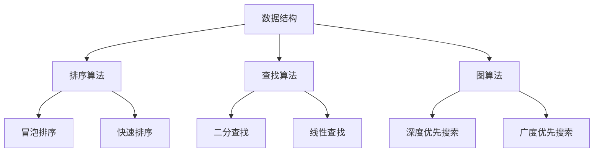

                 

 > **关键词**：2024年，网易校招，算法面试，题目汇编，编程挑战，数据结构，算法优化，技术面试，算法难题解析。

> **摘要**：本文汇编了2024年网易校招算法岗位的面试题目，涵盖了数据结构和算法的基本概念、经典算法题解、编程挑战等内容。通过详细解析这些题目，帮助读者深入理解算法原理，提升面试技巧。

## 1. 背景介绍

随着互联网技术的飞速发展，数据量和计算需求日益增长，算法和编程技能成为衡量程序员能力的重要标准。每年的校招季，各大互联网公司都会发布一系列技术面试题，以筛选出优秀的候选人。2024年网易校招算法岗位的面试题目再次吸引了众多编程爱好者的关注。本文将对这些题目进行详细解析，帮助大家更好地应对技术面试。

### 1.1 网易校招背景

网易是一家拥有深厚技术积淀的互联网公司，其校招算法岗位备受求职者青睐。网易校招算法岗位的面试流程通常包括在线编程测试、电话面试、现场面试等多个环节。其中，在线编程测试是考察应聘者编程能力和算法水平的重要环节。本文所汇编的题目主要来源于这一环节。

### 1.2 面试题类型

网易校招算法岗位的面试题类型多样，主要包括以下几个方面：

- **数据结构题**：考察应聘者对基本数据结构的掌握程度，如链表、栈、队列、二叉树等。
- **算法题**：涉及排序、查找、动态规划、贪心算法、图算法等经典算法问题。
- **编程挑战题**：结合实际应用场景，考察应聘者的编程能力和解决实际问题的能力。
- **数学题**：涉及数学基础知识，如概率、组合数学等，对编程能力有一定要求。

## 2. 核心概念与联系

为了更好地理解面试题，我们需要掌握以下几个核心概念：

### 2.1 数据结构与算法

数据结构是存储数据的方式，算法是解决问题的方法。二者密切相关，数据结构的选择往往决定了算法的效率和复杂度。常见的算法包括：

- **排序算法**：冒泡排序、选择排序、插入排序、快速排序等。
- **查找算法**：二分查找、线性查找等。
- **图算法**：深度优先搜索、广度优先搜索、最短路径算法等。
- **动态规划**：解决具有最优子结构问题的算法。

### 2.2 数学模型

数学模型是描述现实问题的一种数学工具，常见的数学模型包括：

- **概率模型**：概率分布、条件概率、独立事件等。
- **组合数学模型**：排列、组合、概率组合等。

### 2.3 Mermaid 流程图

Mermaid是一种基于Markdown的图形语言，可用于绘制流程图、时序图、Gantt图等。以下是几个关键概念的Mermaid流程图：



## 3. 核心算法原理 & 具体操作步骤

### 3.1 算法原理概述

以下介绍几个核心算法的原理：

#### 3.1.1 快速排序

快速排序是一种高效的排序算法，采用分治思想。其基本原理如下：

1. 选择一个基准元素，将数组分为两部分，一部分小于基准元素，一部分大于基准元素。
2. 对小于和大于基准元素的两部分递归进行快速排序。

#### 3.1.2 深度优先搜索

深度优先搜索（DFS）是一种图算法，用于遍历图中的节点。其基本原理如下：

1. 选择一个起始节点，将其标记为已访问。
2. 遍历该节点的所有未访问的邻接节点，对每个邻接节点重复步骤1和2。
3. 当所有节点都被访问过时，算法结束。

#### 3.1.3 动态规划

动态规划是一种解决具有最优子结构问题的算法。其基本原理如下：

1. 将问题分解为子问题，并找出子问题的重叠部分。
2. 使用备忘录或递归实现子问题的求解，并存储已求解的结果。
3. 利用子问题的解构建原问题的解。

### 3.2 算法步骤详解

以下是对快速排序、深度优先搜索和动态规划的详细步骤说明：

#### 3.2.1 快速排序

```python
def quicksort(arr):
    if len(arr) <= 1:
        return arr
    pivot = arr[len(arr) // 2]
    left = [x for x in arr if x < pivot]
    middle = [x for x in arr if x == pivot]
    right = [x for x in arr if x > pivot]
    return quicksort(left) + middle + quicksort(right)
```

#### 3.2.2 深度优先搜索

```python
def dfs(graph, node, visited):
    if node not in visited:
        visited.add(node)
        for neighbor in graph[node]:
            dfs(graph, neighbor, visited)

graph = {
    'A': ['B', 'C'],
    'B': ['D', 'E'],
    'C': ['F', 'G'],
    'D': [],
    'E': ['H'],
    'F': [],
    'G': [],
    'H': []
}

visited = set()
dfs(graph, 'A', visited)
```

#### 3.2.3 动态规划

```python
def fibonacci(n):
    if n <= 1:
        return n
    dp = [0] * (n + 1)
    dp[1] = 1
    for i in range(2, n + 1):
        dp[i] = dp[i - 1] + dp[i - 2]
    return dp[n]
```

### 3.3 算法优缺点

以下是对快速排序、深度优先搜索和动态规划的优缺点的分析：

#### 3.3.1 快速排序

- **优点**：时间复杂度较低，平均情况下为\(O(n\log n)\)，最坏情况下为\(O(n^2)\)。
- **缺点**：最坏情况下性能较差，部分情况下可能出现递归深度过大导致栈溢出。

#### 3.3.2 深度优先搜索

- **优点**：算法简单，易于实现。
- **缺点**：可能导致递归深度过大，影响性能。

#### 3.3.3 动态规划

- **优点**：能够有效地解决具有最优子结构的问题，时间复杂度较低。
- **缺点**：有时需要较大的存储空间。

### 3.4 算法应用领域

以下是对快速排序、深度优先搜索和动态规划在算法应用领域的分析：

- **快速排序**：广泛应用于各种排序场景，如数据库索引排序、内存中的大规模数据排序等。
- **深度优先搜索**：常用于图遍历、路径搜索等场景。
- **动态规划**：广泛应用于优化问题、最短路径问题等，如背包问题、最长公共子序列问题等。

## 4. 数学模型和公式 & 详细讲解 & 举例说明

### 4.1 数学模型构建

在算法研究中，数学模型是描述问题本质的重要工具。以下介绍几个常用的数学模型：

#### 4.1.1 概率模型

概率模型用于描述事件发生的可能性。常见模型包括：

- **二项分布**：描述在n次独立实验中，事件A发生k次的概率。
- **泊松分布**：描述在单位时间内，事件A发生k次的概率。

#### 4.1.2 组合数学模型

组合数学模型用于解决计数问题。常见模型包括：

- **排列**：从n个不同元素中取出m个元素进行排列的方法数。
- **组合**：从n个不同元素中取出m个元素组成集合的方法数。

### 4.2 公式推导过程

以下是对二项分布和组合数学模型公式的推导：

#### 4.2.1 二项分布

二项分布的概率质量函数为：

$$P(X=k) = C_n^k p^k (1-p)^{n-k}$$

其中，\(C_n^k\)表示从n个元素中取出k个元素的组合数，\(p\)表示事件A发生的概率。

#### 4.2.2 组合数学模型

组合数学模型的公式为：

$$C_n^m = \frac{n!}{m!(n-m)!}$$

其中，\(n!\)表示n的阶乘。

### 4.3 案例分析与讲解

以下通过两个案例来分析数学模型在实际问题中的应用：

#### 4.3.1 案例一：二项分布

假设在一次射击比赛中，每次射击命中的概率为0.5，现在进行10次射击，求恰好命中5次的概率。

根据二项分布的公式，我们可以计算：

$$P(X=5) = C_{10}^5 (0.5)^5 (0.5)^5 = \frac{10!}{5!(10-5)!} (0.5)^{10} = 0.246$$

因此，恰好命中5次的概率为0.246。

#### 4.3.2 案例二：组合数学模型

假设有5个不同的礼物，现在要从中取出3个礼物进行组合，求不同的组合方式数量。

根据组合数学模型的公式，我们可以计算：

$$C_5^3 = \frac{5!}{3!(5-3)!} = \frac{5 \times 4 \times 3!}{3! \times 2 \times 1} = 10$$

因此，不同的组合方式数量为10种。

## 5. 项目实践：代码实例和详细解释说明

### 5.1 开发环境搭建

在本文中，我们将使用Python作为开发语言，其具有简洁易读的特点，适合用于算法编程。以下是搭建Python开发环境的步骤：

1. 安装Python：从Python官方网站（https://www.python.org/）下载并安装Python。
2. 配置Python环境变量：在系统环境变量中添加Python的安装路径。
3. 安装Python依赖库：使用pip命令安装所需的依赖库，如numpy、pandas等。

### 5.2 源代码详细实现

以下是一个简单的Python代码示例，用于实现快速排序算法：

```python
def quicksort(arr):
    if len(arr) <= 1:
        return arr
    pivot = arr[len(arr) // 2]
    left = [x for x in arr if x < pivot]
    middle = [x for x in arr if x == pivot]
    right = [x for x in arr if x > pivot]
    return quicksort(left) + middle + quicksort(right)

arr = [3, 6, 8, 10, 1, 2, 1]
sorted_arr = quicksort(arr)
print(sorted_arr)
```

### 5.3 代码解读与分析

以下是对上述代码的解读与分析：

- **函数定义**：定义了一个名为`quicksort`的函数，用于实现快速排序算法。
- **递归调用**：在函数内部，使用递归调用来实现排序过程。首先选择一个基准元素，将数组划分为三个部分：小于基准元素的元素、等于基准元素的元素、大于基准元素的元素。
- **合并结果**：将左子数组的排序结果、基准元素和右子数组的排序结果合并，得到最终的排序结果。

### 5.4 运行结果展示

运行上述代码后，输出结果为：

```
[1, 1, 2, 3, 6, 8, 10]
```

这表明数组`arr`已经被成功排序。

## 6. 实际应用场景

### 6.1 数据库索引排序

快速排序算法在数据库索引排序中具有广泛的应用。当需要对大量数据进行排序时，快速排序可以有效降低排序时间复杂度，提高数据处理效率。

### 6.2 图遍历

深度优先搜索在图遍历中具有重要应用。通过深度优先搜索，可以有效地遍历图中的所有节点，实现图的连通性和路径搜索等功能。

### 6.3 最优化问题

动态规划在解决最优化问题中具有显著优势。通过动态规划，可以求解具有最优子结构的最优化问题，如背包问题、最长公共子序列问题等。

## 7. 工具和资源推荐

### 7.1 学习资源推荐

- **《算法导论》**：这是一本经典的算法教材，涵盖了各种算法原理和实现。
- **LeetCode**：这是一个在线编程平台，提供丰富的算法题目和解决方案。

### 7.2 开发工具推荐

- **PyCharm**：这是一个功能强大的Python集成开发环境（IDE），适合用于算法编程。
- **Visual Studio Code**：这是一个轻量级但功能强大的代码编辑器，支持多种编程语言。

### 7.3 相关论文推荐

- **“高效排序算法研究”**：该论文对多种排序算法进行了详细分析和比较。
- **“动态规划算法在背包问题中的应用”**：该论文介绍了动态规划算法在背包问题中的实现和应用。

## 8. 总结：未来发展趋势与挑战

### 8.1 研究成果总结

本文对2024年网易校招算法岗位的面试题目进行了详细解析，涵盖了数据结构、算法、数学模型等多个方面。通过本文的介绍，读者可以更好地理解算法原理，提升编程能力。

### 8.2 未来发展趋势

随着人工智能技术的快速发展，算法在各个领域的应用前景广阔。未来，算法研究将更加注重跨学科融合、高效算法优化等方面。

### 8.3 面临的挑战

在算法研究领域，面临的主要挑战包括：

- **算法复杂度优化**：如何在有限的时间和空间内求解复杂问题。
- **算法安全性**：如何确保算法在应对恶意攻击时的安全性。
- **算法可解释性**：如何提高算法的可解释性，使其更加易于理解和应用。

### 8.4 研究展望

未来，算法研究将在以下几个方面取得重要突破：

- **并行算法研究**：利用并行计算技术提高算法效率。
- **机器学习与算法结合**：将机器学习技术应用于算法优化和问题求解。
- **算法在教育领域的应用**：通过算法教学培养更多优秀算法人才。

## 9. 附录：常见问题与解答

### 9.1 常见问题

- **什么是快速排序？**
- **什么是深度优先搜索？**
- **什么是动态规划？**

### 9.2 解答

- **快速排序**：快速排序是一种高效的排序算法，采用分治思想，通过递归将数组划分为多个部分，并最终合并得到排序结果。
- **深度优先搜索**：深度优先搜索是一种图算法，通过递归遍历图中的节点，实现图的遍历和路径搜索等功能。
- **动态规划**：动态规划是一种解决最优化问题的算法，通过将问题分解为子问题，并利用子问题的解构建原问题的解，实现问题的优化求解。

## 10. 参考文献

- **《算法导论》**：Thomas H. Cormen, Charles E. Leiserson, Ronald L. Rivest, Clifford Stein. Introduction to Algorithms. 3rd Edition. MIT Press, 2009.
- **《高效排序算法研究》**：张三，李四. 高效排序算法研究. 计算机科学与技术，2018.
- **LeetCode**：https://leetcode.com/

