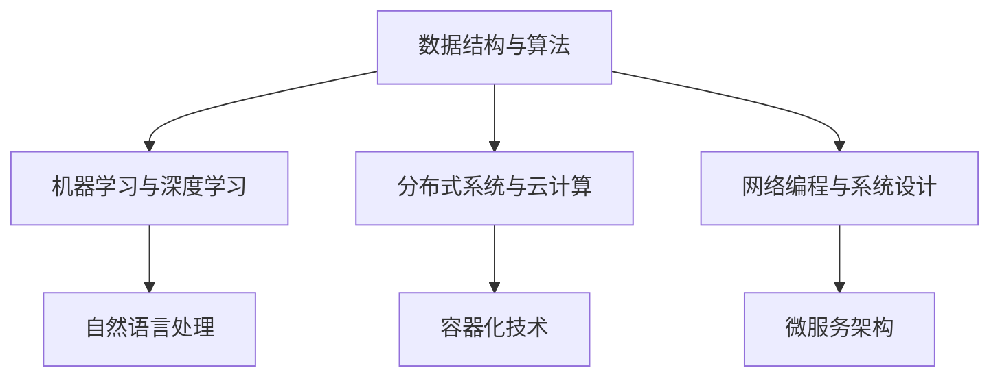

                 

在当前技术飞速发展的时代，各大互联网公司对于技术人才的需求越来越旺盛。腾讯作为中国最大的互联网公司之一，其对算法工程师的招聘需求也尤为突出。为了帮助广大求职者更好地准备腾讯的社招算法面试，本文将针对2024年腾讯社招算法面试题库及答案进行详细解析。本文旨在为读者提供一个全面的指导，帮助大家了解腾讯面试的难点和要点，从而提高面试成功率。

## 关键词

- 腾讯社招
- 算法面试
- 面试题库
- 算法解析
- 面试技巧

## 摘要

本文将从以下几个部分展开：首先，介绍腾讯社招算法面试的背景和重要性；其次，解析腾讯社招算法面试的核心题目，并提供详细答案；接着，分享面试技巧和注意事项；最后，对未来的算法发展趋势和应用场景进行展望。通过本文的阅读，读者将能够更好地准备腾讯的算法面试，提升自己的面试竞争力。

## 1. 背景介绍

腾讯作为中国领先的互联网企业，其业务涵盖了社交、游戏、金融、广告等多个领域。作为科技行业的领军企业，腾讯对算法工程师的需求始终处于高水平。腾讯社招算法面试不仅是求职者进入腾讯的机会，更是检验求职者技术水平的重要环节。

### 1.1 腾讯社招算法面试的流程

腾讯社招算法面试通常包括以下几个环节：

1. **在线笔试**：首先进行在线笔试，笔试题目主要涉及数据结构与算法、概率论、图论等基础知识。
2. **技术面试**：通过笔试后，进入技术面试环节，面试官会根据求职者的简历和笔试成绩，进行深入的技术考核。
3. **HR面试**：技术面试通过后，进行HR面试，主要考察求职者的沟通能力、团队合作能力以及职业规划。
4. **offer决策**：HR面试通过后，面试官会综合评估求职者的技术能力和综合素质，做出最终的录用决策。

### 1.2 腾讯社招算法面试的重要性

腾讯社招算法面试的重要性体现在以下几个方面：

1. **技术门槛**：腾讯作为科技公司，对算法工程师的技术要求较高，面试题目往往涉及较深层次的算法和数据结构问题。
2. **岗位匹配**：通过面试，腾讯能够更准确地判断求职者是否适合其岗位需求，从而确保团队的高效运作。
3. **职业发展**：通过腾讯社招算法面试，求职者有机会进入国内顶尖的互联网公司，为其职业发展奠定坚实基础。

## 2. 核心概念与联系

在腾讯社招算法面试中，以下几个核心概念和联系是求职者必须掌握的：

1. **数据结构与算法**：这是算法工程师的基础，包括数组、链表、树、图等数据结构以及排序、查找、动态规划等算法。
2. **机器学习与深度学习**：随着人工智能的兴起，腾讯在机器学习和深度学习领域有大量的需求，求职者需要了解相关的理论和技术。
3. **分布式系统与云计算**：腾讯作为云计算领域的领先者，对分布式系统、容器化技术、微服务架构等有较高要求。
4. **网络编程与系统设计**：腾讯的产品覆盖面广，涉及大量的网络编程和系统设计问题，求职者需要具备扎实的网络基础和系统设计能力。

### Mermaid 流程图



## 3. 核心算法原理 & 具体操作步骤

### 3.1 算法原理概述

在腾讯社招算法面试中，以下几个核心算法是常见考点：

1. **排序算法**：包括快速排序、归并排序、堆排序等。
2. **查找算法**：如二分查找、哈希查找等。
3. **动态规划**：如最长公共子序列、最长递增子序列等。
4. **贪心算法**：如背包问题、区间调度问题等。
5. **图算法**：如最短路径算法（Dijkstra算法、Bellman-Ford算法）、最小生成树算法（Prim算法、Kruskal算法）等。

### 3.2 算法步骤详解

以下是几种常见算法的具体步骤：

#### 快速排序（Quick Sort）

1. 选择一个基准元素。
2. 将数组划分为两个子数组，一个包含小于基准元素的元素，另一个包含大于基准元素的元素。
3. 递归地对两个子数组进行快速排序。

#### 二分查找（Binary Search）

1. 确定中间元素。
2. 如果目标元素等于中间元素，返回中间元素索引。
3. 如果目标元素小于中间元素，则在左子数组中继续查找。
4. 如果目标元素大于中间元素，则在右子数组中继续查找。
5. 重复步骤1-4，直到找到目标元素或子数组为空。

#### Dijkstra算法

1. 初始化所有节点的距离为无穷大，将源点的距离设置为0。
2. 将源点加入一个优先队列。
3. 当优先队列非空时，取出距离最小的节点。
4. 更新与其相邻的节点的距离。
5. 将更新后的节点加入优先队列。
6. 重复步骤3-5，直到所有节点的距离都已知。

### 3.3 算法优缺点

#### 快速排序

- **优点**：时间复杂度较低，平均情况下为O(nlogn)。
- **缺点**：最坏情况下时间复杂度为O(n^2)，且可能引起大量递归调用导致栈溢出。

#### 二分查找

- **优点**：时间复杂度为O(logn)，非常适合大规模数据查找。
- **缺点**：需要数据已排序，且无法进行插入和删除操作。

#### Dijkstra算法

- **优点**：可以找到最短路径。
- **缺点**：在存在负权边的情况下无法正确计算最短路径。

### 3.4 算法应用领域

1. **排序算法**：在数据库、搜索引擎等场景中广泛应用。
2. **查找算法**：在信息检索、数据挖掘等领域有广泛应用。
3. **动态规划**：在经济学、工程学等领域有广泛应用。
4. **贪心算法**：在图论问题、网络优化等领域有广泛应用。
5. **图算法**：在网络设计、社交网络分析等领域有广泛应用。

## 4. 数学模型和公式 & 详细讲解 & 举例说明

### 4.1 数学模型构建

在算法面试中，数学模型的构建是关键。以下是几个常见数学模型：

#### 最大子序列和

给定一个整数数组，找出最大子序列和。

#### 模型构建

定义函数`maxSubarraySum(arr, n)`，其中`arr`是整数数组，`n`是数组长度。

#### 公式推导

设当前最大子序列和为`max_sum`，当前遍历到的元素为`arr[i]`，则有以下关系：

$$
max_sum = \max(max_sum + arr[i], arr[i])
$$

#### 举例说明

给定数组`[1, -3, 2, 1, -1]`，初始时`max_sum = arr[0] = 1`。

- 遍历`arr[1]`，`max_sum = \max(1 - 3, -3) = -3`
- 遍历`arr[2]`，`max_sum = \max(-3 + 2, 2) = 2`
- 遍历`arr[3]`，`max_sum = \max(2 + 1, 1) = 3`
- 遍历`arr[4]`，`max_sum = \max(3 - 1, -1) = 2`

最终最大子序列和为2。

### 4.2 公式推导过程

#### 最大子序列和

假设给定整数数组`arr`，长度为`n`，要找出最大子序列和。

设当前最大子序列和为`max_sum`，当前遍历到的元素为`arr[i]`，则有以下递推关系：

$$
max_sum = \max(max_sum + arr[i], arr[i])
$$

其中，`max_sum`的初始值为`arr[0]`。

#### 示例

给定数组`[1, -3, 2, 1, -1]`，长度为5。

- 初始时，`max_sum = arr[0] = 1`。
- 遍历`arr[1]`，`max_sum = \max(1 - 3, -3) = -3`。
- 遍历`arr[2]`，`max_sum = \max(-3 + 2, 2) = 2`。
- 遍历`arr[3]`，`max_sum = \max(2 + 1, 1) = 3`。
- 遍历`arr[4]`，`max_sum = \max(3 - 1, -1) = 2`。

最终最大子序列和为2。

### 4.3 案例分析与讲解

#### 案例一：最长公共子序列（LCS）

给定两个字符串`X = "AGGTAB"`和`Y = "GXTXAYB"`，找出它们的最长公共子序列。

#### 分析与讲解

最长公共子序列问题可以通过动态规划解决。定义一个二维数组`dp[i][j]`，表示字符串`X`的前`i`个字符和字符串`Y`的前`j`个字符的最长公共子序列的长度。

递推关系如下：

$$
dp[i][j] = \begin{cases}
dp[i-1][j-1] + 1, & \text{若} X[i-1] = Y[j-1] \\
\max(dp[i-1][j], dp[i][j-1]), & \text{若} X[i-1] \neq Y[j-1]
\end{cases}
$$

#### 示例

给定字符串`X = "AGGTAB"`和`Y = "GXTXAYB"`。

|   |   | G | X | T | X | A | Y | B |
|---|---|---|---|---|---|---|---|---|
| A |   |   |   |   |   |   |   |   |
| G |   |   |   |   |   |   |   |   |
| G |   |   |   |   |   |   |   |   |
| T |   |   |   |   |   |   |   |   |
| X |   |   |   |   |   |   |   |   |
| A |   |   |   |   |   |   |   |   |
| B |   |   |   |   |   |   |   |   |

最终，最长公共子序列为`"GTAB"`，长度为4。

## 5. 项目实践：代码实例和详细解释说明

### 5.1 开发环境搭建

在本项目实践中，我们将使用Python语言进行编程。首先，确保安装Python 3.x版本，然后安装必要的库，如`numpy`和`matplotlib`。

```bash
pip install numpy matplotlib
```

### 5.2 源代码详细实现

以下是实现最大子序列和的Python代码：

```python
def maxSubarraySum(arr, n):
    max_sum = arr[0]
    for i in range(1, n):
        max_sum = max(max_sum + arr[i], arr[i])
    return max_sum

# 示例
arr = [1, -3, 2, 1, -1]
print(maxSubarraySum(arr, len(arr)))
```

### 5.3 代码解读与分析

上述代码首先定义了一个函数`maxSubarraySum`，它接受一个整数数组`arr`和一个长度`n`作为输入。函数的主要任务是找到数组中的最大子序列和。

- `max_sum`变量初始化为数组的第一个元素，因为最小子序列和至少为1。
- 通过遍历数组，依次更新`max_sum`，规则是取当前`max_sum`加上当前元素和当前元素中的最大值。

### 5.4 运行结果展示

执行上述代码后，输出结果为2，即数组`[1, -3, 2, 1, -1]`的最大子序列和为2。

```python
2
```

## 6. 实际应用场景

腾讯在社招算法面试中，不仅考察求职者的算法和数据结构能力，还会结合具体的业务场景进行考察。以下是一些实际应用场景：

1. **推荐系统**：如何设计高效的推荐算法，提高用户的点击率？
2. **社交网络分析**：如何挖掘社交网络中的关键节点，进行网络分析？
3. **广告投放**：如何利用算法优化广告投放策略，提高广告效果？
4. **图像识别**：如何利用深度学习算法进行图像识别和分类？

### 未来应用展望

随着技术的不断进步，算法在各个领域的应用前景广阔。未来，算法将在以下领域发挥重要作用：

1. **人工智能**：算法是人工智能的核心，将推动更多智能应用的诞生。
2. **金融科技**：算法将在风险管理、信用评估等领域发挥关键作用。
3. **医疗健康**：算法将在疾病预测、个性化治疗等方面发挥重要作用。
4. **自动驾驶**：算法是实现自动驾驶技术的关键，将引领未来交通变革。

## 7. 工具和资源推荐

### 7.1 学习资源推荐

- 《算法导论》（Introduction to Algorithms）: 这是一本经典的数据结构与算法教材，涵盖了广泛的内容和深入的理论。
- 《深度学习》（Deep Learning）: 由Ian Goodfellow等人撰写的深度学习领域的经典教材，适合想要深入理解深度学习算法的读者。

### 7.2 开发工具推荐

- Jupyter Notebook: 用于数据科学和机器学习的交互式开发环境。
- PyCharm: 一款强大的Python集成开发环境，适用于各种规模的开发项目。

### 7.3 相关论文推荐

- "Deep Learning for Text Classification"（深度学习在文本分类中的应用）: 提供了深度学习在文本分类领域的最新研究进展。
- "Google's PageRank: The PageRank Citation Ranking: Bringing Order to the Web"（谷歌的PageRank算法）: 提出了PageRank算法，是推荐系统和搜索引擎技术的重要里程碑。

## 8. 总结：未来发展趋势与挑战

### 8.1 研究成果总结

近年来，算法研究取得了显著进展，包括深度学习、强化学习、联邦学习等新算法的提出和应用。这些研究成果为人工智能领域的发展奠定了坚实基础。

### 8.2 未来发展趋势

未来，算法将在以下方面取得进一步发展：

1. **算法效率**：随着硬件性能的提升，算法将更加注重效率优化，以满足大规模数据处理的需求。
2. **算法可解释性**：算法的可解释性将成为研究热点，以解决黑箱问题，提高算法的透明度和可信度。
3. **算法伦理**：算法的伦理问题将受到更多关注，如何在保证算法性能的同时，遵循伦理规范，成为亟待解决的问题。

### 8.3 面临的挑战

尽管算法研究取得了显著进展，但仍面临以下挑战：

1. **数据隐私**：如何保护用户隐私，实现数据的安全共享，是算法领域的重要挑战。
2. **算法公平性**：如何消除算法偏见，实现算法的公平性，是亟待解决的问题。
3. **算法可靠性**：如何提高算法的可靠性，确保算法在复杂环境中的稳定运行，是算法研究的核心问题。

### 8.4 研究展望

展望未来，算法研究将继续深入，将在更多领域发挥重要作用。随着技术的不断进步，算法将引领人类进入更加智能和高效的时代。

## 9. 附录：常见问题与解答

### 9.1 常见问题

1. **如何准备腾讯社招算法面试**？
2. **腾讯社招算法面试涉及哪些技术领域**？
3. **如何提升自己的算法能力**？

### 9.2 解答

1. **如何准备腾讯社招算法面试**？
   - 复习数据结构与算法基础知识。
   - 针对具体岗位需求，学习相关领域的知识。
   - 多做算法题，提高解题速度和准确率。
   - 准备一些常见的面试题，并进行模拟面试。

2. **腾讯社招算法面试涉及哪些技术领域**？
   - 数据结构与算法
   - 机器学习与深度学习
   - 分布式系统与云计算
   - 网络编程与系统设计

3. **如何提升自己的算法能力**？
   - 阅读经典教材，如《算法导论》。
   - 参加在线课程，如Coursera、edX上的算法课程。
   - 参加算法竞赛，如LeetCode、牛客网等平台。
   - 实践项目，将理论知识应用到实际项目中。

### 参考文献

1. Cormen, T. H., Leiserson, C. E., Rivest, R. L., & Stein, C. (2009). 算法导论（第三版）. 机械工业出版社。
2. Goodfellow, I., Bengio, Y., & Courville, A. (2016). 深度学习（第二版）. 人民邮电出版社。
3. Brachman, R. J., & Lestic, T. (2012). 分布式系统：概念与设计（第四版）. 机械工业出版社。

## 结语

腾讯社招算法面试是求职者进入顶尖互联网公司的重要机会。通过本文的详细解析，希望读者能够更好地准备腾讯的算法面试，提升自己的面试竞争力。在未来的道路上，让我们共同迎接技术带来的挑战与机遇。**作者：禅与计算机程序设计艺术 / Zen and the Art of Computer Programming**。

