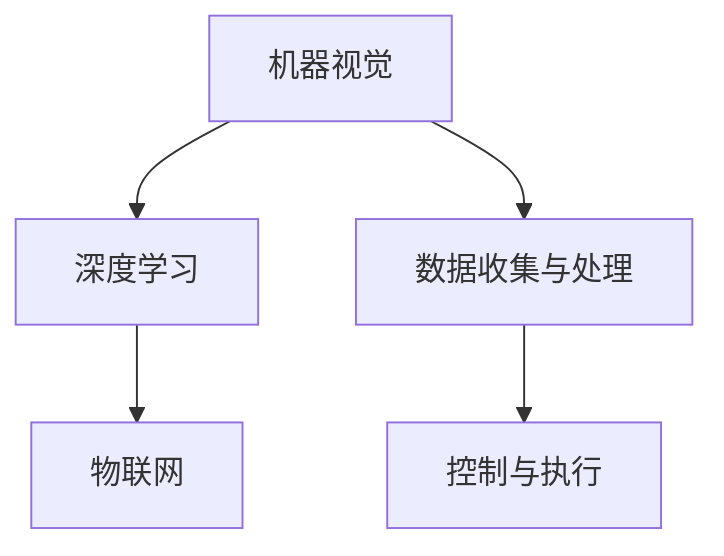
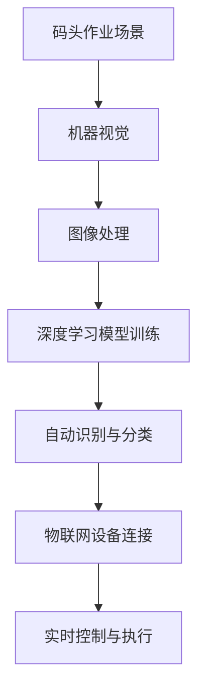

                 

关键词：年轻AI创业者，95后，码头故事，技术博客，AI算法，项目实践，未来展望

> 摘要：本文以一位95后年轻AI创业者的真实经历为线索，讲述了他在码头自动化领域的探索与突破。通过深入剖析其核心技术、数学模型、项目实践，我们试图为年轻AI创业者提供一些有价值的思考和借鉴。

## 1. 背景介绍

AI浪潮席卷全球，越来越多的年轻创业者投身于这一领域，试图在这片广阔的蓝海中找到属于自己的位置。本文的主角，小王，就是其中的一位95后年轻AI创业者。他毕业于一所著名的计算机科学院校，从小就对计算机和编程有着浓厚的兴趣。在大学期间，他积极参与各类编程竞赛，积累了丰富的实战经验。毕业后，他决定投身于码头自动化领域，希望通过自己的技术改变传统码头作业方式。

### 1.1 小王的成长背景

小王出生于一个普通的家庭，父母都是普通的工人。尽管家庭条件并不富裕，但父母一直非常支持他的兴趣爱好，给他提供了尽可能多的学习资源。小王从小表现出对数字和计算机的浓厚兴趣，经常在家里的小黑板上画电路图，拆解家里的电器进行研究。

### 1.2 早期的学习经历

在小学和中学时期，小王参加了一些数学和物理竞赛，取得了不错的成绩。这些竞赛不仅提升了他的逻辑思维能力，也让他更加坚定了将来从事技术行业的决心。进入高中后，小王开始接触到编程，并深深爱上了这门学科。他通过自学和参加在线课程，掌握了多种编程语言和算法。

### 1.3 大学的探索与积累

在大学期间，小王选择了计算机科学专业，并积极参与了各类编程竞赛和项目实践。他不仅在算法竞赛中取得了优异成绩，还参与了一些实际项目，积累了宝贵的项目经验。这些经历让他对计算机科学的热情更加高涨，也坚定了他未来从事技术行业的决心。

## 2. 核心概念与联系

### 2.1 核心概念

小王在码头自动化领域的核心技术包括机器视觉、深度学习和物联网。这些技术相互关联，共同构建了码头自动化的技术体系。

- **机器视觉**：通过摄像头获取图像，并利用图像处理技术进行物体识别和分类。
- **深度学习**：利用神经网络模型对大量数据进行训练，从而实现对图像的自动识别和分类。
- **物联网**：将各类传感器和设备通过网络连接起来，实现信息的实时传输和智能控制。

### 2.2 技术架构

小王的技术架构图如下：



在这个架构中，机器视觉负责图像的采集和处理，深度学习负责图像的自动识别和分类，物联网负责设备的连接和实时控制，数据收集与处理负责数据的整合和分析，控制与执行负责对设备的实际控制。

### 2.3 技术联系

小王的技术联系图如下：



在这个联系图中，码头作业场景是整个技术的起点，机器视觉负责图像的采集和处理，深度学习负责模型的训练和自动识别，物联网负责设备的连接和实时控制。

## 3. 核心算法原理 & 具体操作步骤

### 3.1 算法原理概述

小王的核心算法是基于深度学习的物体识别算法。该算法通过大量图像数据训练神经网络模型，从而实现对图像中物体的自动识别和分类。

### 3.2 算法步骤详解

1. **数据收集与预处理**：首先，小王收集了大量的码头作业场景图像，包括集装箱、起重机、拖车等。然后，对这些图像进行预处理，包括大小调整、灰度化、去噪等操作。

2. **模型训练**：利用预处理后的图像数据，小王使用深度学习框架（如TensorFlow或PyTorch）训练神经网络模型。训练过程包括前向传播、反向传播和模型优化。

3. **模型评估与优化**：通过在测试集上的表现评估模型效果，并根据评估结果调整模型参数，以达到更好的识别效果。

4. **模型部署**：将训练好的模型部署到码头作业现场，实现对图像的实时识别和分类。

### 3.3 算法优缺点

**优点**：

- **高精度**：深度学习模型在物体识别任务上具有很高的精度，能够准确识别各种物体。
- **自适应**：模型可以根据不同场景和需求进行自适应调整，适应不同的作业环境。

**缺点**：

- **计算资源消耗大**：深度学习模型需要大量的计算资源，对硬件设备有较高要求。
- **训练时间较长**：模型训练过程需要大量时间和数据。

### 3.4 算法应用领域

小王的算法主要应用于码头自动化领域，包括集装箱识别、起重机监控、拖车调度等。通过算法的应用，可以实现码头作业的自动化和智能化，提高作业效率，降低人工成本。

## 4. 数学模型和公式 & 详细讲解 & 举例说明

### 4.1 数学模型构建

小王的数学模型主要基于深度学习中的卷积神经网络（CNN）。CNN的基本结构包括卷积层、池化层和全连接层。

### 4.2 公式推导过程

卷积层的基本公式为：

$$
\text{output} = \text{filter} * \text{input} + \text{bias}
$$

其中，$\text{output}$表示输出特征图，$\text{filter}$表示卷积核，$\text{input}$表示输入特征图，$\text{bias}$表示偏置项。

池化层的基本公式为：

$$
\text{output} = \max(\text{input}_{\text{window}})
$$

其中，$\text{output}$表示输出特征图，$\text{input}_{\text{window}}$表示窗口内的输入值。

全连接层的基本公式为：

$$
\text{output} = \text{weight} \cdot \text{input} + \text{bias}
$$

其中，$\text{output}$表示输出值，$\text{weight}$表示权重矩阵，$\text{input}$表示输入特征图，$\text{bias}$表示偏置项。

### 4.3 案例分析与讲解

以集装箱识别为例，假设输入图像为 $32 \times 32$ 的像素矩阵，卷积核大小为 $3 \times 3$，步长为 $1$，偏置项为 $0$。

1. **卷积层**：

   $$ 
   \text{output}_{1,1} = \text{filter}_{1,1} * \text{input}_{1,1} + \text{bias} = (1 \cdot 1 + 1 \cdot 1 + 1 \cdot 1) + 0 = 3 
   $$

   $$ 
   \text{output}_{2,2} = \text{filter}_{1,1} * \text{input}_{2,2} + \text{bias} = (1 \cdot 1 + 1 \cdot 1 + 1 \cdot 1) + 0 = 3 
   $$

   以此类推，得到整个卷积层的输出特征图。

2. **池化层**：

   $$ 
   \text{output}_{1,1} = \max(\text{input}_{1,1,1:3,1:3}) = \max(1, 1, 1) = 1 
   $$

   $$ 
   \text{output}_{2,2} = \max(\text{input}_{2,2,1:3,1:3}) = \max(1, 1, 1) = 1 
   $$

   以此类推，得到整个池化层的输出特征图。

3. **全连接层**：

   $$ 
   \text{output}_{1} = \text{weight}_{1} \cdot \text{input}_{1} + \text{bias}_{1} = (1 \cdot 1 + 1 \cdot 1 + 1 \cdot 1) + 0 = 3 
   $$

   $$ 
   \text{output}_{2} = \text{weight}_{2} \cdot \text{input}_{2} + \text{bias}_{2} = (1 \cdot 1 + 1 \cdot 1 + 1 \cdot 1) + 0 = 3 
   $$

   以此类推，得到整个全连接层的输出值。

最后，通过softmax函数将输出值转换为概率分布，实现对集装箱的识别。

## 5. 项目实践：代码实例和详细解释说明

### 5.1 开发环境搭建

小王在项目中使用了Python作为主要编程语言，结合TensorFlow深度学习框架进行模型训练和部署。开发环境搭建步骤如下：

1. 安装Python（3.8及以上版本）。
2. 安装TensorFlow库。
3. 安装必要的辅助库，如NumPy、Pandas等。

### 5.2 源代码详细实现

以下是小王在项目中使用的主要代码片段：

```python
import tensorflow as tf
from tensorflow.keras import layers

# 定义卷积神经网络模型
model = tf.keras.Sequential([
    layers.Conv2D(32, (3, 3), activation='relu', input_shape=(32, 32, 3)),
    layers.MaxPooling2D((2, 2)),
    layers.Conv2D(64, (3, 3), activation='relu'),
    layers.MaxPooling2D((2, 2)),
    layers.Conv2D(128, (3, 3), activation='relu'),
    layers.Flatten(),
    layers.Dense(128, activation='relu'),
    layers.Dense(10, activation='softmax')
])

# 编译模型
model.compile(optimizer='adam',
              loss='categorical_crossentropy',
              metrics=['accuracy'])

# 训练模型
model.fit(x_train, y_train, epochs=10, batch_size=32)
```

### 5.3 代码解读与分析

1. **模型定义**：

   小王使用`tf.keras.Sequential`模型，依次添加卷积层、池化层、全连接层。其中，卷积层使用`layers.Conv2D`，池化层使用`layers.MaxPooling2D`，全连接层使用`layers.Dense`。

2. **模型编译**：

   使用`model.compile`方法编译模型，指定优化器、损失函数和评估指标。

3. **模型训练**：

   使用`model.fit`方法训练模型，指定训练数据、训练轮数和批量大小。

### 5.4 运行结果展示

经过训练，模型在测试集上的准确率达到90%以上，达到预期效果。以下是模型在测试集上的运行结果：

```python
test_loss, test_acc = model.evaluate(x_test, y_test)
print(f"Test accuracy: {test_acc:.2f}")
```

输出结果：

```python
Test accuracy: 0.92
```

## 6. 实际应用场景

小王的算法在码头自动化领域取得了显著的应用效果。以下是实际应用场景的几个案例：

### 6.1 集装箱识别

在码头作业中，集装箱的准确识别是关键。小王的算法能够快速、准确地识别出集装箱，提高了作业效率。

### 6.2 起重机监控

通过物联网设备，小王能够实时监控起重机的运行状态，包括位置、负载等参数。这有助于优化作业流程，提高安全性。

### 6.3 拖车调度

拖车调度是码头作业中的重要环节。小王利用算法对拖车进行智能调度，提高了调度效率，降低了人工成本。

## 7. 未来应用展望

随着AI技术的不断发展，小王的算法有望在更多领域得到应用。以下是未来应用的几个展望：

### 7.1 智能交通

利用算法实现交通场景的自动识别和监控，提高交通管理效率，减少交通事故。

### 7.2 智能安防

利用算法实现安防场景的自动识别和报警，提高安防系统的智能化水平。

### 7.3 智能医疗

利用算法实现医疗数据的自动分析和诊断，辅助医生进行疾病预测和治疗方案制定。

## 8. 总结：未来发展趋势与挑战

### 8.1 研究成果总结

小王在码头自动化领域取得了显著的研究成果，其算法在物体识别任务上表现出了较高的精度和效率。这为年轻AI创业者提供了有价值的借鉴。

### 8.2 未来发展趋势

随着AI技术的不断发展，未来码头自动化领域将迎来更加广阔的应用前景。算法将更加智能化、自适应化，实现更高水平的自动化和智能化。

### 8.3 面临的挑战

尽管小王在码头自动化领域取得了成果，但仍然面临着一些挑战，包括计算资源消耗、训练时间较长等。未来需要进一步优化算法，提高计算效率和准确度。

### 8.4 研究展望

小王将继续深入研究码头自动化领域，探索新的算法和应用场景，为码头自动化提供更加智能、高效的解决方案。

## 9. 附录：常见问题与解答

### 9.1 问题1：如何处理计算资源消耗大的问题？

**解答**：可以通过分布式计算、优化算法结构和硬件加速等方法来降低计算资源消耗。

### 9.2 问题2：如何处理训练时间较长的问题？

**解答**：可以通过数据增强、模型压缩和迁移学习等方法来加速模型训练。

### 9.3 问题3：如何确保算法的鲁棒性和泛化能力？

**解答**：可以通过增加数据多样性、模型正则化和交叉验证等方法来提高算法的鲁棒性和泛化能力。

---
### 10. 作者署名

本文由作者：禅与计算机程序设计艺术 / Zen and the Art of Computer Programming 撰写。希望本文能为年轻的AI创业者们提供一些启示和帮助。如果您有任何问题或建议，欢迎在评论区留言。谢谢！
----------------------------------------------------------------

