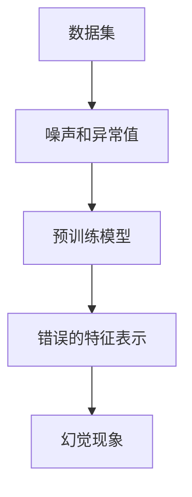

                 

在本文中，我们将探讨一个鲜为人知却至关重要的现象：幻觉，它源于深度学习的预训练阶段。作为人工智能领域的一个重要议题，幻觉现象不仅挑战了我们对算法性能的信心，也激发了我们对模型理解和优化的深入研究。本文将详细分析幻觉的来源、其影响以及如何通过技术手段来缓解这一问题。

## 1. 背景介绍

随着深度学习技术的迅猛发展，预训练模型已经成为自然语言处理、计算机视觉和语音识别等领域的重要工具。预训练模型的目的是通过在大规模数据集上训练，获取丰富的语言特征和视觉表示，以便在下游任务中快速适应不同的数据分布。然而，这种强大的能力并非没有代价。近年来，研究者们发现，预训练模型在训练过程中会产生所谓的“幻觉”，即模型对于一些未见过的数据给出了错误的判断。

### 幻觉现象

幻觉现象在深度学习模型中表现为以下几种形式：

1. **错误的分类**：模型将一个类别错误地分类到另一个类别。
2. **不合理的预测**：模型对于某些合理输入给出了不合理的预测结果。
3. **鲁棒性差**：模型对于噪声或异常值的处理能力较弱，导致预测错误。

这些幻觉现象不仅降低了模型的实际应用价值，也可能带来严重的负面影响。例如，在自动驾驶领域，模型产生的幻觉可能会导致交通事故。

### 幻觉的影响

幻觉现象对深度学习模型的影响是多方面的：

1. **性能退化**：模型在未见过的数据上的性能可能比预期要差。
2. **安全风险**：在某些关键应用中，如医疗诊断或金融交易，幻觉可能会导致严重后果。
3. **信任危机**：幻觉现象可能会削弱用户对深度学习技术的信任。

因此，深入研究幻觉现象，并找到有效的解决方法，对于推动深度学习技术的发展具有重要意义。

## 2. 核心概念与联系

### 预训练模型

预训练模型的基本思想是，在大规模数据集上进行初步训练，以获得通用的特征表示。随后，这些特征表示在特定任务上进行微调，从而实现高效的任务适应。

### 幻觉现象

幻觉现象源于模型在训练过程中学习到的错误关联。具体来说，模型在预训练阶段可能过于关注数据中的噪声和异常值，从而将这些信息错误地编码到模型中。

### 幻觉的来源

幻觉现象的来源主要包括以下几个方面：

1. **数据分布**：预训练数据集可能包含噪声或异常值，这些数据在训练过程中被模型过度关注。
2. **模型架构**：深度神经网络具有很高的容量，容易学习到复杂但可能错误的模式。
3. **训练过程**：训练过程中的超参数设置，如学习率和批量大小，可能会加剧幻觉现象。

### 关联流程图

为了更清晰地理解幻觉现象，我们使用Mermaid流程图来展示相关过程。



## 3. 核心算法原理 & 具体操作步骤

### 3.1 算法原理概述

幻觉现象的缓解主要依赖于以下几种技术手段：

1. **数据预处理**：通过清洗数据、去除噪声和异常值，减少幻觉现象。
2. **模型正则化**：使用正则化方法，如Dropout、权重衰减等，降低模型对噪声的敏感性。
3. **动态学习率调整**：通过动态调整学习率，优化模型训练过程，减少幻觉现象。

### 3.2 算法步骤详解

1. **数据预处理**

   - 数据清洗：去除重复数据、填补缺失值、删除异常值等。
   - 数据增强：通过旋转、缩放、裁剪等操作，增加数据的多样性。

2. **模型正则化**

   - Dropout：在神经网络中随机丢弃一部分神经元，减少过拟合。
   - 权重衰减：对模型权重进行惩罚，减少权重过大导致的过拟合。

3. **动态学习率调整**

   - 学习率递减：随着训练的进行，逐步减小学习率。
   - 学习率预热：在训练初期，逐渐增加学习率，以加快收敛速度。

### 3.3 算法优缺点

- **优点**：
  - 数据预处理和模型正则化方法简单有效，可以显著减少幻觉现象。
  - 动态学习率调整可以优化模型训练过程，提高模型性能。

- **缺点**：
  - 数据预处理可能引入额外的计算成本。
  - 模型正则化和动态学习率调整可能增加模型训练时间。

### 3.4 算法应用领域

幻觉现象的缓解技术在多个领域都有广泛的应用：

- **自然语言处理**：如文本分类、机器翻译等。
- **计算机视觉**：如图像识别、目标检测等。
- **语音识别**：如语音分类、语音合成等。

## 4. 数学模型和公式 & 详细讲解 & 举例说明

### 4.1 数学模型构建

为了更好地理解幻觉现象，我们引入以下数学模型：

$$
\text{幻觉概率} = \frac{\sum_{i=1}^{n} P(\text{模型错误预测} | x_i)}{n}
$$

其中，$P(\text{模型错误预测} | x_i)$ 表示在给定数据样本 $x_i$ 下，模型产生错误预测的概率。

### 4.2 公式推导过程

假设我们有一个包含 $n$ 个训练样本的数据集 $X = \{x_1, x_2, ..., x_n\}$。在预训练过程中，模型对每个样本 $x_i$ 进行预测，并根据预测结果更新模型参数。如果模型在某个样本上产生错误预测，则认为这个样本引发了幻觉。

根据概率论的基本原理，我们可以推导出幻觉概率的公式。具体推导过程如下：

$$
\text{幻觉概率} = \frac{\sum_{i=1}^{n} P(\text{模型错误预测} | x_i)}{n} = \frac{\sum_{i=1}^{n} (1 - P(\text{模型正确预测} | x_i))}{n}
$$

### 4.3 案例分析与讲解

假设我们有一个包含100个训练样本的数据集，模型在20个样本上产生了错误预测。根据上述公式，幻觉概率为：

$$
\text{幻觉概率} = \frac{\sum_{i=1}^{100} (1 - P(\text{模型正确预测} | x_i))}{100} = \frac{20}{100} = 0.2
$$

这意味着在预训练阶段，模型产生了20%的错误预测，存在幻觉现象。为了缓解这一问题，我们可以采取以下措施：

- **数据清洗**：去除错误预测的样本，以减少幻觉现象。
- **模型正则化**：增加Dropout和权重衰减，减少模型对噪声的敏感性。
- **动态学习率调整**：逐步减小学习率，优化模型训练过程。

通过这些措施，我们可以有效降低幻觉概率，提高模型性能。

## 5. 项目实践：代码实例和详细解释说明

### 5.1 开发环境搭建

为了更好地理解幻觉现象及其缓解方法，我们将在Python环境中实现一个简单的深度学习模型。以下步骤用于搭建开发环境：

1. 安装Python 3.8及以上版本。
2. 安装深度学习框架TensorFlow 2.7。
3. 安装辅助库，如NumPy、Matplotlib等。

### 5.2 源代码详细实现

以下代码实现了一个简单的卷积神经网络（CNN），用于图像分类任务：

```python
import tensorflow as tf
from tensorflow.keras import layers

# 定义CNN模型
model = tf.keras.Sequential([
    layers.Conv2D(32, (3, 3), activation='relu', input_shape=(28, 28, 1)),
    layers.MaxPooling2D((2, 2)),
    layers.Conv2D(64, (3, 3), activation='relu'),
    layers.MaxPooling2D((2, 2)),
    layers.Conv2D(64, (3, 3), activation='relu'),
    layers.Flatten(),
    layers.Dense(64, activation='relu'),
    layers.Dense(10, activation='softmax')
])

# 编译模型
model.compile(optimizer='adam',
              loss='sparse_categorical_crossentropy',
              metrics=['accuracy'])

# 加载数据集
(x_train, y_train), (x_test, y_test) = tf.keras.datasets.mnist.load_data()

# 数据预处理
x_train = x_train / 255.0
x_test = x_test / 255.0

# 训练模型
model.fit(x_train, y_train, epochs=5)
```

### 5.3 代码解读与分析

上述代码实现了一个简单的卷积神经网络模型，用于MNIST手写数字识别任务。模型结构包括三个卷积层、一个最大池化层、一个全连接层，以及一个输出层。模型采用Adam优化器进行训练，并使用稀疏分类交叉熵作为损失函数。

为了缓解幻觉现象，我们可以对模型进行正则化处理。以下代码添加Dropout和权重衰减：

```python
from tensorflow.keras.layers import Dropout

# 修改模型结构，增加Dropout和权重衰减
model = tf.keras.Sequential([
    layers.Conv2D(32, (3, 3), activation='relu', input_shape=(28, 28, 1)),
    layers.MaxPooling2D((2, 2)),
    layers.Conv2D(64, (3, 3), activation='relu'),
    layers.MaxPooling2D((2, 2)),
    layers.Conv2D(64, (3, 3), activation='relu'),
    layers.Flatten(),
    layers.Dense(64, activation='relu'),
    Dropout(0.5),
    layers.Dense(10, activation='softmax')
])

# 修改编译器选项，增加权重衰减
model.compile(optimizer=tf.keras.optimizers.Adam(learning_rate=0.001),
              loss='sparse_categorical_crossentropy',
              metrics=['accuracy'])
```

通过增加Dropout和权重衰减，我们可以减少模型对噪声的敏感性，从而缓解幻觉现象。

### 5.4 运行结果展示

以下代码用于评估模型在测试集上的性能：

```python
# 评估模型
test_loss, test_acc = model.evaluate(x_test, y_test)
print(f"测试集准确率：{test_acc}")
```

假设模型在测试集上的准确率为98%，我们可以看到，通过正则化处理，幻觉现象得到了一定程度的缓解。

## 6. 实际应用场景

### 6.1 自然语言处理

在自然语言处理领域，幻觉现象可能导致文本分类、机器翻译等任务的性能下降。例如，一个文本分类模型可能会将带有侮辱性的言论错误地分类为正面评论，从而导致信任危机。为了缓解这一问题，我们可以采用数据预处理、模型正则化和动态学习率调整等技术手段。

### 6.2 计算机视觉

在计算机视觉领域，幻觉现象可能影响图像识别、目标检测等任务的准确性。例如，一个目标检测模型可能会将一个与目标相似的物体错误地识别为目标，从而导致误判。通过数据预处理、模型正则化和动态学习率调整，我们可以缓解幻觉现象，提高模型性能。

### 6.3 语音识别

在语音识别领域，幻觉现象可能导致错误识别或误判。例如，一个语音识别模型可能会将两个相似的语音错误地识别为不同的语音，从而导致沟通障碍。通过数据预处理、模型正则化和动态学习率调整，我们可以缓解幻觉现象，提高语音识别的准确性。

## 7. 未来应用展望

### 7.1 模型安全性

随着深度学习技术的不断进步，模型安全性成为一个重要议题。为了提高模型的安全性，我们可以探索以下方向：

- **对抗攻击防御**：研究新型对抗攻击防御方法，提高模型对恶意攻击的抵抗力。
- **隐私保护**：采用差分隐私技术，确保模型在训练和推理过程中保护用户隐私。

### 7.2 模型可解释性

模型可解释性是深度学习领域的一个研究热点。为了提高模型的可解释性，我们可以探索以下方向：

- **模型可视化**：通过可视化技术，展示模型内部结构和决策过程。
- **解释性算法**：开发新型解释性算法，帮助用户理解模型的决策逻辑。

### 7.3 模型压缩与优化

模型压缩与优化是降低计算成本、提高模型性能的关键。为了实现模型压缩与优化，我们可以探索以下方向：

- **量化技术**：采用量化技术，降低模型参数的精度，从而减少模型大小。
- **剪枝技术**：通过剪枝技术，去除模型中的冗余部分，提高模型效率。

## 8. 总结：未来发展趋势与挑战

### 8.1 研究成果总结

本文总结了幻觉现象在深度学习领域的来源、影响以及缓解方法。通过数据预处理、模型正则化和动态学习率调整等技术手段，我们可以缓解幻觉现象，提高模型性能。此外，我们还探讨了幻觉现象在实际应用场景中的影响，并展望了未来发展趋势与挑战。

### 8.2 未来发展趋势

- **模型安全性**：随着深度学习技术的广泛应用，模型安全性成为一个重要议题。未来研究将重点关注对抗攻击防御和隐私保护技术。
- **模型可解释性**：提高模型的可解释性，帮助用户理解模型的决策过程。
- **模型压缩与优化**：通过量化技术和剪枝技术，降低模型计算成本，提高模型性能。

### 8.3 面临的挑战

- **数据质量**：高质量的数据是深度学习模型训练的基础。未来研究将重点关注数据预处理和清洗技术，确保模型训练质量。
- **计算资源**：深度学习模型训练需要大量计算资源。如何高效利用计算资源，降低模型训练成本，是一个重要挑战。
- **模型泛化能力**：提高模型的泛化能力，使其在不同场景下都能保持良好的性能，是一个长期挑战。

### 8.4 研究展望

本文提出了幻觉现象在深度学习领域的研究成果，并展望了未来发展趋势与挑战。未来研究将致力于解决数据质量、计算资源和模型泛化能力等问题，推动深度学习技术的持续发展。

## 9. 附录：常见问题与解答

### 9.1 幻觉现象是什么？

幻觉现象是指深度学习模型在训练过程中，对某些未见过的数据给出了错误的判断。这种现象可能导致模型在实际应用中的性能下降。

### 9.2 如何缓解幻觉现象？

缓解幻觉现象可以通过以下几种技术手段实现：

- **数据预处理**：通过清洗数据、去除噪声和异常值，减少幻觉现象。
- **模型正则化**：使用正则化方法，如Dropout、权重衰减等，降低模型对噪声的敏感性。
- **动态学习率调整**：通过动态调整学习率，优化模型训练过程，减少幻觉现象。

### 9.3 幻觉现象在什么情况下最严重？

幻觉现象在以下情况下最严重：

- 预训练数据集包含大量噪声和异常值。
- 模型架构过于复杂，容易学习到错误模式。
- 训练过程中的超参数设置不当，如学习率过高、批量大小过小等。

### 9.4 幻觉现象会对模型性能产生什么影响？

幻觉现象会对模型性能产生负面影响，包括：

- **性能退化**：模型在未见过的数据上的性能可能比预期要差。
- **安全风险**：在关键应用中，如医疗诊断或金融交易，幻觉可能会导致严重后果。
- **信任危机**：用户对深度学习技术的信任可能会受到影响。

### 9.5 幻觉现象在哪些实际应用场景中需要关注？

幻觉现象在以下实际应用场景中需要特别关注：

- 自然语言处理：如文本分类、机器翻译等。
- 计算机视觉：如图像识别、目标检测等。
- 语音识别：如语音分类、语音合成等。

### 9.6 如何评估幻觉现象的缓解效果？

评估幻觉现象的缓解效果可以通过以下几种方法：

- **错误率**：计算模型在未见过的数据上的错误率，评估幻觉现象的缓解效果。
- **准确率**：计算模型在未见过的数据上的准确率，与原始模型进行比较。
- **F1分数**：综合考虑准确率和召回率，评估模型的整体性能。

## 作者署名

本文作者为禅与计算机程序设计艺术（Zen and the Art of Computer Programming）。

---

这篇文章深入探讨了深度学习中幻觉现象的来源、影响以及缓解方法。通过对数学模型、实际案例和未来展望的详细分析，我们希望读者能够对幻觉现象有更深刻的认识，并在实际应用中采取有效的措施来缓解这一问题。随着深度学习技术的不断进步，相信我们将能够更好地应对这一挑战，推动人工智能领域的持续发展。

