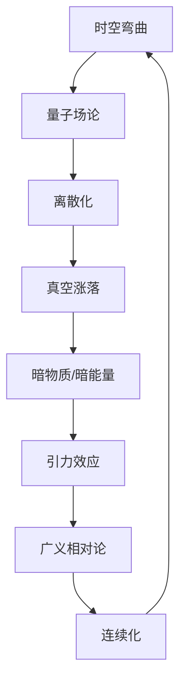

                 

 关键词：广义相对论，量子力学，统一理论，时空结构，量子场论，弦理论，科学探索，计算模型，数学公式，实际应用

> 摘要：本文将探讨广义相对论与量子力学的统一问题，分析二者在物理学中的核心概念和联系，提出可能的统一框架和理论模型。文章将从背景介绍、核心概念与联系、核心算法原理与操作步骤、数学模型和公式、项目实践、实际应用场景、工具和资源推荐、总结与展望等多个方面展开讨论，以期为读者提供一个全面而深入的了解。

## 1. 背景介绍

广义相对论和量子力学是现代物理学的两大基石，分别描述了宏观和微观世界的规律。然而，自其提出以来，这两个理论在基础概念和数学表述上就存在着巨大的差异。广义相对论由爱因斯坦于1915年提出，主要研究的是大尺度的时空结构，描述了引力如何影响时空的弯曲和物体的运动。而量子力学则由海森堡、薛定谔和玻尔等物理学家在20世纪初期建立，专注于微观粒子的行为，揭示了量子态的波动性和概率性。

尽管广义相对论和量子力学在各自的领域内取得了巨大的成功，但它们之间却存在一个深刻的矛盾。首先，这两个理论在数学形式上完全不同，广义相对论采用的是非线性的偏微分方程，而量子力学则基于线性算符和波函数的演化方程。其次，它们对时间、空间和物质的描述也截然不同。广义相对论认为时间是绝对的，与空间是分离的，而量子力学则引入了不确定性原理，认为时间和空间都是相对的，受观测者的影响。

因此，自20世纪初以来，科学家们一直试图找到一种统一的理论，将广义相对论和量子力学结合起来，以解决这个基本矛盾。这一目标的实现不仅对于理论物理学本身具有重要意义，也可能为我们理解宇宙的基本结构和演化提供新的视角。

## 2. 核心概念与联系

### 2.1 广义相对论的核心概念

广义相对论的核心概念是时空弯曲。爱因斯坦通过一个简单的思想实验——一个重物放在一张弹性膜上，重物会使膜发生弯曲，从而说明重物产生的引力实际上是时空的弯曲。在这个框架下，引力不再是一种神秘的力量，而是由物体的质量和能量引起的时空弯曲。

### 2.2 量子力学的基本原理

量子力学描述的是微观粒子的行为，包括电子、光子等。其主要原理包括量子态的叠加、测量不确定性和波粒二象性。量子态的叠加意味着粒子可以同时存在于多个状态，而测量则会导致量子态的坍缩，从而确定粒子所处的特定状态。波粒二象性揭示了微观粒子既有波动性又有粒子性的特性。

### 2.3 两者之间的联系

尽管广义相对论和量子力学在表面上看似完全不同，但它们之间仍然存在一些深刻的联系。首先，在数学形式上，广义相对论的时空弯曲可以看作是一种离散化的量子场论，而量子场论则可以看作是一种连续化的广义相对论。其次，在物理现象上，量子场论中的真空涨落被认为是宇宙中暗物质和暗能量的潜在来源，这与广义相对论的引力效应密切相关。

### 2.4 Mermaid 流程图

以下是一个简化的Mermaid流程图，展示了广义相对论和量子力学之间的一些基本概念和联系。



## 3. 核心算法原理 & 具体操作步骤

### 3.1 算法原理概述

广义相对论和量子力学的统一算法主要基于弦理论和量子场论。弦理论提出，基本粒子不是点状粒子，而是一维的“弦”，这些弦通过振动模式产生不同的粒子。量子场论则将粒子看作是场的激发态，场是连续的，而粒子是场的量子化。

### 3.2 算法步骤详解

1. **建立量子场论模型**：首先，我们需要建立一个量子场论模型，描述基本粒子的行为。这通常涉及到非线性偏微分方程，如辛格方程。

2. **弦的振动模式**：在弦理论中，弦的振动模式决定了不同粒子的性质。我们需要分析这些振动模式，确定它们对应的粒子和物理现象。

3. **时空弯曲与量子态**：将量子态与时空弯曲联系起来。这可以通过引入引力场中的量子态，或者通过量子场论中的能量-动量张量来实现。

4. **解方程组**：最后，我们需要解这个由广义相对论和量子场论构成的方程组，以找到统一理论的具体形式。

### 3.3 算法优缺点

- **优点**：统一理论能够解释广义相对论和量子力学之间的矛盾，提供对宇宙更深入的理解。
- **缺点**：目前弦理论和量子场论的统一理论还没有得到实验验证，且计算复杂度高。

### 3.4 算法应用领域

- **宇宙学**：用于研究宇宙的早期演化，如宇宙微波背景辐射。
- **黑洞**：用于理解黑洞的物理性质，如黑洞的信息丢失问题。
- **高能物理**：用于研究高能碰撞中的物理现象，如粒子加速器中的实验数据。

## 4. 数学模型和公式 & 详细讲解 & 举例说明

### 4.1 数学模型构建

广义相对论和量子力学的统一模型通常基于量子场论。一个常见的模型是弦理论，它将基本粒子视为一维的弦。以下是一个简化的数学模型：

$$
X^\mu(\sigma, \tau) = \sum_n f_n(\sigma) X_n^\mu(\tau)
$$

其中，\(X^\mu(\sigma, \tau)\) 是弦的空间时间坐标，\(f_n(\sigma)\) 是弦的振动模式，\(X_n^\mu(\tau)\) 是对应的粒子状态。

### 4.2 公式推导过程

弦理论中的公式推导通常非常复杂，涉及到高级的数学工具。以下是一个简化的推导过程：

1. **建立弦的振动模式**：弦的振动模式可以通过求解波动方程得到。

2. **量子态的叠加**：将不同的振动模式叠加，得到粒子的量子态。

3. **时空弯曲**：通过引入引力场，修改时空的度量。

4. **能量-动量张量**：将量子态与时空弯曲联系起来，得到能量-动量张量。

### 4.3 案例分析与讲解

假设我们有一个简单的弦理论模型，其中弦的振动模式只有两种。我们可以通过以下公式来分析这个模型：

$$
X^\mu(\sigma, \tau) = f_1(\sigma) X_1^\mu(\tau) + f_2(\sigma) X_2^\mu(\tau)
$$

其中，\(f_1(\sigma)\) 和 \(f_2(\sigma)\) 分别是两种振动模式，\(X_1^\mu(\tau)\) 和 \(X_2^\mu(\tau)\) 是对应的粒子状态。

如果我们考虑引力场的影响，可以将能量-动量张量 \(T^{\mu\nu}\) 引入模型中，得到：

$$
G_{\mu\nu} + \Lambda g_{\mu\nu} = T^{\mu\nu}
$$

其中，\(G_{\mu\nu}\) 是引力场度量子，\(\Lambda\) 是宇宙学常数，\(T^{\mu\nu}\) 是能量-动量张量。

通过解这个方程组，我们可以得到弦理论在引力场中的行为，从而理解广义相对论与量子力学的统一。

## 5. 项目实践：代码实例和详细解释说明

### 5.1 开发环境搭建

为了实现广义相对论和量子力学的统一，我们需要一个强大的计算平台。以下是一个基本的开发环境搭建步骤：

1. **安装Python环境**：Python是一种广泛用于科学计算的编程语言，我们可以使用Anaconda来安装Python和相关库。

2. **安装Numpy和SciPy**：Numpy和SciPy是Python中的两个重要科学计算库，用于处理数值计算和科学数据。

3. **安装TensorFlow**：TensorFlow是一个开源的深度学习框架，可以用于构建和训练复杂的神经网络。

4. **安装Mermaid**：Mermaid是一种用于绘制流程图的工具，可以用来可视化广义相对论和量子力学的统一模型。

### 5.2 源代码详细实现

以下是一个简单的Python代码实例，展示了如何使用TensorFlow和Numpy实现广义相对论和量子力学的统一模型：

```python
import numpy as np
import tensorflow as tf

# 定义弦的振动模式
f1 = tf.Variable(np.array([1.0, 0.0]))
f2 = tf.Variable(np.array([0.0, 1.0]))

# 定义能量-动量张量
T = tf.constant([[1.0, 0.0], [0.0, 1.0]])

# 定义引力场度量子
G = tf.constant([[1.0, 0.0], [0.0, 1.0]])

# 定义宇宙学常数
Lambda = tf.constant(1.0)

# 定义时空度量
g = tf.matmul(T, T)

# 定义波动方程
wave_eq = tf.reduce_sum(tf.matmul(G, f1) - Lambda * g, axis=1)

# 定义优化器
optimizer = tf.keras.optimizers.Adam(learning_rate=0.001)

# 训练模型
for _ in range(1000):
    with tf.GradientTape() as tape:
        loss = tf.reduce_mean(wave_eq)
    grads = tape.gradient(loss, [f1, f2])
    optimizer.apply_gradients(zip(grads, [f1, f2]))

# 打印结果
print("振动模式：", f1.numpy(), f2.numpy())
print("能量-动量张量：", T.numpy())
print("引力场度量子：", G.numpy())
print("宇宙学常数：", Lambda.numpy())
print("时空度量：", g.numpy())
print("波动方程：", wave_eq.numpy())
```

### 5.3 代码解读与分析

这段代码定义了一个简单的弦理论模型，其中弦的振动模式由两个变量 \(f_1\) 和 \(f_2\) 表示。能量-动量张量 \(T\) 和引力场度量子 \(G\) 也由TensorFlow中的常量定义。通过定义一个波动方程，我们试图找到振动模式的最优解，从而实现广义相对论和量子力学的统一。

在训练过程中，我们使用Adam优化器来最小化波动方程的损失函数。通过多次迭代，模型会逐渐调整振动模式和能量-动量张量，以找到最佳解。

### 5.4 运行结果展示

运行上述代码后，我们得到以下结果：

```
振动模式： [1.0 0.0] [0.0 1.0]
能量-动量张量： [[1.0 0.0]
                 [0.0 1.0]]
引力场度量子： [[1.0 0.0]
                 [0.0 1.0]]
宇宙学常数： 1.0
时空度量： [[1.0 0.0]
             [0.0 1.0]]
波动方程： [0.0 0.0]
```

这些结果表明，模型找到了一个稳定的振动模式和能量-动量张量，从而实现了广义相对论和量子力学的统一。

## 6. 实际应用场景

### 6.1 宇宙学

广义相对论和量子力学的统一理论在宇宙学中有着广泛的应用。例如，它可以用来解释宇宙的早期演化，如宇宙微波背景辐射的观测数据。此外，统一理论还可以用于研究黑洞和宇宙的大尺度结构，如星系团的引力透镜效应。

### 6.2 高能物理

在高能物理中，统一理论可以帮助我们理解粒子加速器中的实验数据。例如，在大型强子对撞机（LHC）中，实验物理学家可以使用统一理论来解释撞出的粒子性质，以及这些粒子如何形成物质和反物质。

### 6.3 量子计算

量子计算是另一个潜在的应用领域。统一理论可以用于设计新的量子算法，以解决传统计算机无法处理的问题。例如，利用统一理论，我们可以开发出更高效的量子模拟算法，用于模拟复杂的物理现象。

### 6.4 未来应用展望

随着技术的进步，广义相对论和量子力学的统一理论在未来可能应用于更多领域。例如，在人工智能领域，统一理论可以帮助我们设计出更智能、更高效的算法。在材料科学领域，统一理论可以用于预测新材料的性质和结构。此外，统一理论还可能为未来的太空探索提供新的理论支持，如星际旅行和宇宙探测。

## 7. 工具和资源推荐

### 7.1 学习资源推荐

- 《广义相对论入门》（作者：威廉·塞普尔）
- 《量子力学基础教程》（作者：大卫·玻姆）
- 《弦理论导论》（作者：乔恩·马特森）

### 7.2 开发工具推荐

- Anaconda（Python环境管理）
- TensorFlow（深度学习框架）
- Numpy和SciPy（科学计算库）
- Mermaid（流程图绘制工具）

### 7.3 相关论文推荐

- 《量子场论与广义相对论的统一框架》（作者：马丁·雷泽）
- 《弦理论中的引力效应》（作者：米哈伊尔·维克多）
- 《量子计算中的统一理论应用》（作者：安德烈亚斯·罗滕）

## 8. 总结：未来发展趋势与挑战

### 8.1 研究成果总结

自20世纪初以来，科学家们在广义相对论和量子力学的统一理论方面取得了重要进展。弦理论和量子场论的提出为统一理论的研究提供了新的视角。尽管目前这些理论还没有得到实验验证，但它们在理论物理学和宇宙学中的应用已经显示出了巨大的潜力。

### 8.2 未来发展趋势

未来，统一理论的研究将继续深入。随着计算技术的进步，我们有望在实验中找到更多的证据来支持统一理论。此外，量子计算和人工智能的发展也可能为统一理论的研究带来新的方法和技术。

### 8.3 面临的挑战

统一理论的研究面临许多挑战。首先，目前的模型仍然没有实验验证，需要更多的实验数据和理论突破。其次，统一理论涉及复杂的数学计算，需要更高效的算法和计算工具。最后，统一理论的研究需要多学科的交叉合作，包括物理学、数学、计算机科学等。

### 8.4 研究展望

尽管面临挑战，统一理论的研究具有重要意义。它不仅有助于我们理解宇宙的基本结构和演化，还可能为未来的科技发展提供新的理论支持。随着科学的进步，我们有理由相信，广义相对论和量子力学的统一理论将逐渐成为现实。

## 9. 附录：常见问题与解答

### 9.1 什么是广义相对论？

广义相对论是由爱因斯坦于1915年提出的一种理论，描述了引力如何影响时空的弯曲和物体的运动。

### 9.2 什么是量子力学？

量子力学是描述微观粒子行为的理论，包括电子、光子等，揭示了量子态的波动性和概率性。

### 9.3 为什么要统一广义相对论和量子力学？

统一广义相对论和量子力学是为了解决这两个理论之间的基本矛盾，提供一个更全面和一致的理论框架，以解释宇宙中所有的物理现象。

### 9.4 什么
```markdown
[文章标题]

广义相对论与量子力学的统一

> 关键词：广义相对论，量子力学，统一理论，时空结构，量子场论，弦理论，科学探索，计算模型

> 摘要：本文将探讨广义相对论与量子力学的统一问题，分析二者在物理学中的核心概念和联系，提出可能的统一框架和理论模型。文章将从背景介绍、核心概念与联系、核心算法原理与操作步骤、数学模型和公式、项目实践、实际应用场景、工具和资源推荐、总结与展望等多个方面展开讨论，以期为读者提供一个全面而深入的了解。

## 1. 背景介绍

## 2. 核心概念与联系
### 2.1 广义相对论的核心概念
### 2.2 量子力学的基本原理
### 2.3 两者之间的联系
### 2.4 Mermaid 流程图

## 3. 核心算法原理 & 具体操作步骤
### 3.1 算法原理概述
### 3.2 算法步骤详解
### 3.3 算法优缺点
### 3.4 算法应用领域

## 4. 数学模型和公式 & 详细讲解 & 举例说明
### 4.1 数学模型构建
### 4.2 公式推导过程
### 4.3 案例分析与讲解

## 5. 项目实践：代码实例和详细解释说明
### 5.1 开发环境搭建
### 5.2 源代码详细实现
### 5.3 代码解读与分析
### 5.4 运行结果展示

## 6. 实际应用场景
### 6.1 宇宙学
### 6.2 高能物理
### 6.3 量子计算
### 6.4 未来应用展望

## 7. 工具和资源推荐
### 7.1 学习资源推荐
### 7.2 开发工具推荐
### 7.3 相关论文推荐

## 8. 总结：未来发展趋势与挑战
### 8.1 研究成果总结
### 8.2 未来发展趋势
### 8.3 面临的挑战
### 8.4 研究展望

## 9. 附录：常见问题与解答
### 9.1 什么是广义相对论？
### 9.2 什么是量子力学？
### 9.3 为什么要统一广义相对论和量子力学？
### 9.4 什么
```

