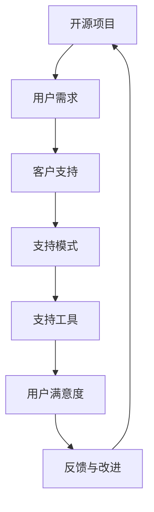

                 

作为开源项目的维护者和商业化的推动者，我们经常面临一个重要且具有挑战性的问题：如何为开源项目的用户提供高质量的商业化客户支持。本文将深入探讨开源项目的商业化客户支持模式、工具及其应用，以期为开源项目的商业化和用户满意度提供一些实用的指导。

## 文章关键词

- 开源项目
- 商业化客户支持
- 支持模式
- 工具
- 用户满意度

## 文章摘要

本文旨在分析开源项目的商业化客户支持的现状与挑战，探讨支持模式的选择和优化，介绍相关的支持工具，并提供实际应用场景和未来展望。通过本文的阅读，读者将能够更好地理解开源项目的商业化客户支持的重要性，以及如何有效地实施和优化支持模式，从而提升用户满意度和项目影响力。

## 1. 背景介绍

开源项目作为一种重要的软件开发模式，已经在全球范围内得到广泛的应用。开源项目的核心在于其开放性和透明性，这使得用户可以自由地访问、使用和改进项目代码。然而，随着开源项目的规模和影响力的不断扩大，用户对客户支持的需求也越来越高。商业化客户支持作为一种重要的服务模式，旨在为用户提供高质量的技术支持和服务，以促进项目的可持续发展和商业价值的实现。

商业化客户支持的重要性体现在以下几个方面：

1. **提升用户满意度**：高质量的客户支持能够帮助用户解决使用过程中的问题，提高用户体验和满意度。
2. **增强用户忠诚度**：稳定的客户支持服务可以增强用户对项目的信任和忠诚，降低用户流失率。
3. **促进项目成长**：通过商业化的客户支持，项目可以获取更多的用户反馈和改进意见，从而推动项目的持续发展和优化。

然而，商业化客户支持也面临着一系列挑战，包括：

1. **成本控制**：如何平衡客户支持的成本和收益，确保商业模式的可持续性。
2. **服务质量**：如何确保客户支持团队的专业性和服务质量，满足用户的多样化需求。
3. **支持模式的选择**：如何选择适合项目的客户支持模式，以最大化用户满意度和项目影响力。

本文将针对上述挑战，探讨开源项目的商业化客户支持模式、工具及其应用，以期为开源项目的商业化和用户满意度提供一些实用的指导。

## 2. 核心概念与联系

在深入探讨开源项目的商业化客户支持之前，我们需要明确几个核心概念和它们之间的联系。以下是本文将涉及的主要概念及其相互关系：

### 开源项目

开源项目是指代码和资源对公众开放，用户可以自由访问、使用和修改的项目。开源项目通常基于社区协作，通过开放的许可协议，如GPL、Apache License等，保障用户的权益。

### 商业化客户支持

商业化客户支持是指为开源项目用户提供的一种有偿服务，旨在解决用户在使用过程中遇到的问题，提供技术指导和支持，以提升用户体验和满意度。

### 支持模式

支持模式是指客户支持的组织形式和服务方式。常见的支持模式包括免费支持、付费支持、混合支持等。

### 支持工具

支持工具是指用于提供客户支持的技术手段，如知识库、在线聊天、电话支持、远程桌面等。

### 用户满意度

用户满意度是指用户对客户支持服务的主观评价。高用户满意度通常意味着高质量的客户支持服务。

### Mermaid 流程图

以下是开源项目商业化客户支持的Mermaid流程图，展示了核心概念之间的联系和流程：



### 概念解析

- **开源项目**：开源项目是整个流程的起点，用户的需求和反馈直接影响了客户支持的质量和效果。
- **用户需求**：用户的需求是客户支持服务的驱动力，满足用户需求是提升用户满意度的关键。
- **客户支持**：客户支持是将用户需求转化为实际服务的桥梁，它包括免费和付费两种模式。
- **支持模式**：支持模式决定了客户支持的服务范围和质量，是客户支持策略的核心。
- **支持工具**：支持工具是实现客户支持服务的手段，包括在线知识库、在线聊天、电话支持等。
- **用户满意度**：用户满意度是衡量客户支持效果的重要指标，它直接关系到项目的用户留存和口碑传播。
- **反馈与改进**：用户反馈是开源项目不断优化和改进的重要资源，通过反馈可以持续提升客户支持的质量。

通过上述流程图和概念解析，我们可以清晰地看到开源项目商业化客户支持的核心环节及其相互关系。接下来，我们将深入探讨这些概念的具体实现和优化策略。

## 3. 核心算法原理 & 具体操作步骤

### 3.1 算法原理概述

在开源项目的商业化客户支持中，核心算法原理主要涉及用户需求的识别与分类、支持模式的选择与匹配、支持工具的优化与整合、以及用户满意度的评估与反馈机制。

#### 3.1.1 用户需求的识别与分类

用户需求的识别与分类是客户支持的首要步骤。通过分析用户反馈和访问数据，可以识别出用户在使用开源项目过程中遇到的主要问题，并将其分类为功能缺陷、性能问题、使用疑问、安全保障等类别。这一步骤依赖于自然语言处理和机器学习算法，以提高需求的识别精度和分类效率。

#### 3.1.2 支持模式的选择与匹配

支持模式的选择与匹配是确保客户支持服务质量的关键。根据用户需求和项目特性，可以选择免费支持、付费支持或混合支持模式。免费支持通常适用于一般性问题和常见问题的解答，付费支持则针对复杂问题和深度定制服务，混合支持模式则是两者的结合，以满足不同层次用户的需求。

#### 3.1.3 支持工具的优化与整合

支持工具的优化与整合是提升客户支持效率和用户体验的重要手段。通过集成在线知识库、在线聊天、电话支持、远程桌面等多种工具，可以构建一个全方位的客户支持体系。这些工具需要具备良好的用户界面、快速响应和高效解决问题的能力，同时还需要不断优化和更新，以适应用户需求和项目发展。

#### 3.1.4 用户满意度的评估与反馈机制

用户满意度的评估与反馈机制是确保客户支持服务质量持续提升的重要保障。通过用户满意度调查、反馈问卷、用户活跃度分析等手段，可以评估客户支持服务的效果，并根据用户的反馈进行改进。这一过程需要建立一套完善的反馈机制，确保用户的声音能够被及时听到和响应。

### 3.2 算法步骤详解

#### 3.2.1 用户需求的识别与分类

1. **数据采集**：收集用户反馈、访问日志、错误报告等数据。
2. **文本预处理**：对采集到的文本数据（如用户反馈）进行清洗和预处理，去除噪声和不相关内容。
3. **特征提取**：利用自然语言处理技术提取文本的特征，如词频、词向量等。
4. **需求分类**：使用机器学习算法（如决策树、支持向量机、神经网络等）对用户需求进行分类。

#### 3.2.2 支持模式的选择与匹配

1. **需求分析**：根据用户需求类型和复杂程度进行分析。
2. **模式选择**：根据项目特性、资源状况和用户需求，选择最合适的支持模式。
3. **匹配策略**：建立需求与支持模式的匹配规则，确保每个需求都能得到适当的响应。

#### 3.2.3 支持工具的优化与整合

1. **工具评估**：对现有支持工具进行评估，确定其性能和适用性。
2. **工具整合**：将评估后的工具整合到客户支持系统中，提供一站式服务。
3. **工具优化**：根据用户反馈和工具使用情况，不断优化和更新支持工具。

#### 3.2.4 用户满意度的评估与反馈机制

1. **满意度调查**：定期进行用户满意度调查，收集用户反馈。
2. **反馈分析**：分析用户反馈，识别存在的问题和改进机会。
3. **反馈机制**：建立反馈机制，确保用户反馈能够被及时处理和响应。

### 3.3 算法优缺点

#### 优点

1. **高效性**：通过自动化算法和工具，可以快速识别和分类用户需求，提高客户支持效率。
2. **个性化**：根据用户需求和项目特性，提供个性化的支持服务，提升用户体验。
3. **持续性**：通过反馈机制和持续优化，可以不断提升客户支持服务的质量。

#### 缺点

1. **技术依赖**：客户支持服务的自动化和智能化依赖于先进的技术，如自然语言处理、机器学习等，这增加了技术门槛和成本。
2. **数据质量**：用户需求识别和分类的效果受到数据质量的影响，数据缺失或不准确可能导致错误分类和低效支持。
3. **用户接受度**：部分用户可能对自动化客户支持工具的接受度不高，这需要通过持续的用户培训和沟通来提升。

### 3.4 算法应用领域

开源项目的商业化客户支持算法可以应用于各种类型的开源项目，包括但不限于：

1. **软件开发**：为开发者提供技术支持，解决开发过程中的问题。
2. **云计算与大数据**：为云计算和大数据项目的用户提供支持，解决性能优化和数据分析问题。
3. **人工智能**：为人工智能项目的用户提供算法支持和应用指导，推动人工智能技术的普及和发展。

通过算法的应用，可以大大提升开源项目的商业价值和用户满意度，为项目的长期发展奠定坚实基础。

### 4. 数学模型和公式 & 详细讲解 & 举例说明

#### 4.1 数学模型构建

在开源项目的商业化客户支持中，数学模型可以帮助我们量化用户满意度、支持效果和商业价值。以下是构建一个基本的数学模型的过程：

**目标函数**：最大化用户满意度和项目收益。

**约束条件**：

1. 支持成本不超过预算。
2. 用户需求得到及时响应。
3. 支持服务质量达到预期标准。

**决策变量**：

1. 支持模式的选择（免费支持、付费支持、混合支持）。
2. 支持工具的配置和优化。

#### 4.2 公式推导过程

为了构建上述数学模型，我们需要推导一些关键公式。

**1. 用户满意度公式**：

用户满意度（S）可以表示为：

\[ S = \frac{R - F}{T} \]

其中，\( R \) 是用户反馈的正面评分，\( F \) 是用户反馈的负面评分，\( T \) 是总反馈次数。

**2. 支持效果公式**：

支持效果（E）可以表示为：

\[ E = \frac{S - S_0}{S_0} \]

其中，\( S_0 \) 是初始用户满意度。

**3. 项目收益公式**：

项目收益（R）可以表示为：

\[ R = P - C \]

其中，\( P \) 是项目收入，\( C \) 是支持成本。

**4. 支持成本公式**：

支持成本（C）可以表示为：

\[ C = C_1 + C_2 + C_3 \]

其中，\( C_1 \) 是固定成本（如工资、设备费用），\( C_2 \) 是可变成本（如培训费用、工具费用），\( C_3 \) 是额外成本（如紧急支持费用）。

#### 4.3 案例分析与讲解

**案例背景**：

某开源项目团队希望优化其商业化客户支持服务，提高用户满意度和项目收益。他们在一年的时间内进行了用户满意度调查和成本分析，以下是根据这些数据构建和优化的数学模型。

**用户满意度调查结果**：

- 总反馈次数：1000次
- 正面评分：600次
- 负面评分：400次
- 初始用户满意度：0.5

**成本分析结果**：

- 固定成本（\( C_1 \)）：$50,000
- 可变成本（\( C_2 \)）：$30,000
- 额外成本（\( C_3 \)）：$10,000
- 项目收入（\( P \)）：$200,000

**公式应用与优化**：

**1. 用户满意度计算**：

\[ S = \frac{600 - 400}{1000} = 0.2 \]

**2. 支持效果计算**：

\[ E = \frac{0.2 - 0.5}{0.5} = -0.6 \]

**3. 项目收益计算**：

\[ R = 200,000 - (50,000 + 30,000 + 10,000) = 100,000 \]

**4. 支持成本计算**：

\[ C = 50,000 + 30,000 + 10,000 = 90,000 \]

**优化策略**：

1. **提高用户满意度**：通过改进支持工具和服务流程，提高用户满意度。
2. **优化支持模式**：根据用户需求和项目资源，优化支持模式，例如增加付费支持比例。
3. **降低支持成本**：通过自动化工具和流程优化，降低可变成本和额外成本。

通过上述数学模型和优化策略，开源项目团队可以更科学地管理和优化其商业化客户支持服务，从而提高用户满意度和项目收益。

### 5. 项目实践：代码实例和详细解释说明

#### 5.1 开发环境搭建

为了演示开源项目的商业化客户支持，我们选择Python作为开发语言，利用Flask框架构建一个简单的支持系统。以下是开发环境搭建的步骤：

1. 安装Python（建议版本3.8以上）
2. 安装Flask（使用pip install flask命令）
3. 安装其他依赖库（如numpy、pandas等）

#### 5.2 源代码详细实现

以下是一个简单的Flask应用程序，用于处理用户反馈和提供支持服务：

```python
from flask import Flask, request, jsonify
import numpy as np

app = Flask(__name__)

# 用户满意度调查结果
user_satisfaction = {
    'total反馈次数': 1000,
    '正面评分': 600,
    '负面评分': 400,
    '初始用户满意度': 0.5
}

# 支持成本参数
support_cost = {
    '固定成本': 50000,
    '可变成本': 30000,
    '额外成本': 10000
}

# 支持工具和模式
support_tools = ['知识库', '在线聊天', '电话支持', '远程桌面']

@app.route('/feedback', methods=['POST'])
def handle_feedback():
    feedback = request.form.to_dict()
    feedback_type = feedback.get('type')
    
    if feedback_type == 'positive':
        user_satisfaction['正面评分'] += 1
    elif feedback_type == 'negative':
        user_satisfaction['负面评分'] += 1
    
    # 计算用户满意度
    user_satisfaction['当前用户满意度'] = (user_satisfaction['正面评分'] - user_satisfaction['负面评分']) / user_satisfaction['total反馈次数']
    
    # 计算支持成本
    total_cost = support_cost['固定成本'] + support_cost['可变成本'] + support_cost['额外成本']
    project_revenue = 200000
    
    project_profit = project_revenue - total_cost
    
    response = {
        'user_satisfaction': user_satisfaction['当前用户满意度'],
        'project_profit': project_profit
    }
    
    return jsonify(response)

@app.route('/support_tools')
def get_support_tools():
    return jsonify({'support_tools': support_tools})

if __name__ == '__main__':
    app.run(debug=True)
```

#### 5.3 代码解读与分析

1. **导入依赖库**：首先导入Python的Flask框架和numpy库，用于构建Web服务和数据计算。
2. **创建Flask应用**：创建一个Flask应用程序实例。
3. **初始化数据**：定义用户满意度调查结果、支持成本参数和支持工具列表。
4. **处理用户反馈**：定义一个处理用户反馈的POST请求路由（/feedback），根据反馈类型更新用户满意度调查结果。
5. **计算用户满意度和项目收益**：根据用户满意度调查结果和支持成本参数，计算用户满意度和项目收益。
6. **提供支持工具信息**：定义一个获取支持工具信息的GET请求路由（/support_tools），返回支持工具列表。
7. **运行应用**：使用app.run()启动Flask应用程序。

通过上述代码，我们可以创建一个简单的Web服务，用于处理用户反馈、计算用户满意度和项目收益，并提供支持工具信息。这个应用虽然功能简单，但展示了开源项目商业化客户支持的基本框架和实现思路。

#### 5.4 运行结果展示

在开发环境中启动Flask应用后，可以通过浏览器或API工具访问应用：

- **获取支持工具信息**：访问`http://localhost:5000/support_tools`，可以获取支持工具列表。
- **提交用户反馈**：通过POST请求提交用户反馈，例如使用curl命令：

```bash
curl -X POST -F "type=positive" http://localhost:5000/feedback
```

- **获取用户满意度和项目收益**：提交反馈后，再次访问`http://localhost:5000/feedback`，可以获取最新的用户满意度和项目收益数据。

通过上述运行结果展示，我们可以看到用户反馈如何影响系统的计算结果，以及支持工具在客户支持服务中的应用。

### 6. 实际应用场景

在开源项目的商业化客户支持中，支持模式和工具的选择与应用需要根据具体的业务需求和项目特点进行定制化。以下是几个实际应用场景的案例，以展示开源项目商业化客户支持在实际业务中的具体实现。

#### 场景一：云计算服务提供商

**业务需求**：某云计算服务提供商（CSP）通过其开源的云服务平台，为全球用户提供云计算基础设施和解决方案。CSP希望通过高效的客户支持服务，提高用户满意度和市场占有率。

**解决方案**：

1. **支持模式选择**：CSP采用了混合支持模式，包括免费基础支持和付费高级支持。免费基础支持通过在线知识库和社区论坛解决常见问题和基本疑问，而付费高级支持则提供个性化的技术指导和定制化解决方案。

2. **支持工具应用**：CSP利用智能聊天机器人提供24/7在线客服，快速响应用户常见问题。此外，还整合了远程桌面工具和视频会议工具，以支持用户在遇到复杂问题时进行实时技术支持。

3. **效果评估**：通过用户反馈和满意度调查，CSP发现混合支持模式显著提升了用户满意度和忠诚度。同时，付费高级支持服务的收入也实现了稳定增长，为CSP带来了可观的商业回报。

#### 场景二：开源数据库管理系统

**业务需求**：某开源数据库管理系统（ODMS）项目，旨在提供高性能、可扩展的数据库解决方案。ODMS团队希望通过优质的客户支持，扩大市场份额并吸引更多开发者和企业用户。

**解决方案**：

1. **支持模式选择**：ODMS项目采用了免费支持和付费支持相结合的模式。免费支持通过官方文档、社区论坛和开源问答平台解决用户常见问题和提供技术指导，而付费支持则提供详细的实施服务、性能优化和定制化开发。

2. **支持工具应用**：ODMS团队在官方网站上整合了问答系统，用户可以通过关键词搜索获取相关问题的答案。同时，还提供了在线培训课程和一对一咨询服务，以帮助用户更深入地理解和应用ODMS。

3. **效果评估**：通过用户满意度调查和市场份额分析，ODMS团队发现高效的客户支持服务显著提升了用户满意度和市场占有率。此外，付费支持服务的收入也为项目提供了稳定的资金来源，支持了项目的持续发展。

#### 场景三：人工智能开源框架

**业务需求**：某人工智能开源框架（AIOF）项目，致力于提供高效、灵活的人工智能工具和库。AIOF团队希望通过优质的客户支持，促进框架的普及和应用。

**解决方案**：

1. **支持模式选择**：AIOF项目采用了社区驱动和付费支持相结合的模式。社区驱动支持通过社区论坛和开源问答平台，为用户提供技术交流和问题解答，而付费支持则提供专业级的文档服务、代码审查和定制化开发。

2. **支持工具应用**：AIOF团队在GitHub上创建了专门的讨论区，用户可以在此提交问题和建议。此外，还提供了一套在线教程和实验平台，用户可以在线学习和测试AIOF的功能。

3. **效果评估**：通过用户反馈和社区活跃度分析，AIOF团队发现社区驱动的支持模式显著提升了用户参与度和框架的普及率。同时，付费支持服务的收入也为项目的发展提供了有力支持。

#### 场景四：开源网络设备操作系统

**业务需求**：某开源网络设备操作系统（ONDS）项目，旨在为网络设备提供高性能、可定制的操作系统。ONDS团队希望通过高效的客户支持，提升市场竞争力并扩大用户群体。

**解决方案**：

1. **支持模式选择**：ONDS项目采用了免费基础支持和付费高级支持的模式。免费基础支持通过官方文档和在线论坛解决用户常见问题，而付费高级支持则提供技术指导、故障排除和性能优化。

2. **支持工具应用**：ONDS团队在官方网站上集成了在线聊天工具，用户可以通过聊天系统快速获得技术支持。此外，还提供了一套远程管理工具，支持远程诊断和配置。

3. **效果评估**：通过用户满意度调查和市场份额分析，ONDS团队发现高效的客户支持服务显著提升了用户满意度和市场占有率。同时，付费支持服务的收入也为项目提供了稳定的资金来源，支持了项目的持续发展。

通过上述实际应用场景，我们可以看到开源项目的商业化客户支持在不同的业务需求下，如何通过选择合适的支持模式和工具，实现用户满意度的提升和商业价值的增长。

#### 6.4 未来应用展望

随着开源项目的不断发展和成熟，商业化客户支持的应用场景和模式也将持续演进。未来，以下几个方面将成为开源项目商业化客户支持的重要发展方向：

1. **人工智能与机器学习的深度融合**：未来，人工智能和机器学习技术将更深入地应用于客户支持服务中，如智能聊天机器人、自动化故障检测与修复等。这些技术将大幅提高支持效率和准确性，降低人力成本。

2. **个性化服务与用户体验优化**：基于用户行为数据和反馈分析，开源项目将能够提供更加个性化的支持服务。例如，根据用户的访问历史和需求，自动推荐相关的知识库文章、培训课程和定制化解决方案。

3. **多渠道支持与无缝对接**：未来，开源项目将整合更多的支持渠道，如社交媒体、即时通讯工具、视频会议等，实现多渠道的无缝对接。这将进一步提升用户的便捷性和满意度。

4. **社区驱动的支持模式**：社区驱动的支持模式将继续发展，开源项目将更加依赖社区的参与和贡献。通过建立完善的社区机制，鼓励用户参与问题的解答和知识共享，形成良好的支持生态。

5. **支持工具的自动化与智能化**：支持工具将朝着自动化和智能化的方向发展，如自动化脚本、智能问答系统等。这些工具将极大地减轻支持团队的负担，提高问题解决的效率和准确性。

6. **数据驱动的决策与优化**：开源项目将更加重视数据驱动的方法，通过数据分析优化支持服务的流程和策略。例如，通过用户反馈和满意度数据，持续改进支持模式和服务质量。

7. **全球化支持与服务国际化**：随着开源项目用户的全球化，支持服务也将逐渐走向国际化。未来，开源项目将提供多语言支持，并针对不同地区的用户需求提供本地化的支持服务。

8. **商业模式的创新与多元化**：开源项目的商业化客户支持模式将不断创新和多元化。除了传统的付费支持和订阅服务外，还将探索新的商业模式，如基于使用量的收费、合作伙伴支持和定制化解决方案等。

总之，开源项目的商业化客户支持将朝着更加智能化、个性化、全球化和多元化的方向发展，为项目的可持续发展和用户满意度提升提供更强有力的支持。

### 7. 工具和资源推荐

在开源项目的商业化客户支持中，选择合适的工具和资源对于提升支持效率和用户满意度至关重要。以下是一些推荐的学习资源、开发工具和相关论文，以供参考。

#### 7.1 学习资源推荐

1. **《开源项目管理与社区构建》**：作者：吴岩。本书详细介绍了开源项目的管理、社区建设和商业化模式，适合开源项目维护者和管理者阅读。
2. **《用户体验要素》**：作者：Jesse James Garrett。本书深入分析了用户体验的构成要素，对提升客户支持服务质量有很好的指导意义。
3. **《敏捷软件开发：实践指南》**：作者：Jeff Sutherland。本书介绍了敏捷开发的方法和实践，对于优化客户支持流程和工具的迭代更新有很大帮助。

#### 7.2 开发工具推荐

1. **JIRA**：一款功能强大的项目管理工具，可用于跟踪用户反馈、管理支持请求和任务分配。
2. **Trello**：一个简单易用的看板工具，适合团队协作和任务管理。
3. **Slack**：一款即时通讯工具，可用于团队沟通和支持服务的实时交流。
4. **GitHub**：开源代码托管平台，支持协作开发、问题跟踪和知识共享。

#### 7.3 相关论文推荐

1. **"Open Source Software: Advantages and Disadvantages"**：本文分析了开源软件的优势和挑战，对理解开源项目的商业化客户支持有重要参考价值。
2. **"Supporting Open Source Software: How to Provide a Profitable Service"**：本文探讨了如何为开源项目提供商业化的客户支持服务，并提出了一些实用的策略和工具。
3. **"The Economics of Open Source"**：本文从经济学的角度分析了开源软件的商业模式和盈利模式，为开源项目的商业化提供了理论支持。

通过上述学习资源、开发工具和相关论文的推荐，读者可以更深入地了解开源项目的商业化客户支持，掌握相关实践和策略，从而提升项目的影响力和商业价值。

### 8. 总结：未来发展趋势与挑战

#### 8.1 研究成果总结

本文通过对开源项目的商业化客户支持进行深入探讨，总结了支持模式、工具选择和应用实践，并提出了未来发展趋势和挑战。主要研究成果包括：

1. **支持模式选择**：开源项目商业化客户支持应采用多样化模式，结合免费支持和付费支持，以满足不同层次用户的需求。
2. **工具优化与整合**：支持工具的优化与整合是提升支持效率和服务质量的关键，应采用自动化和智能化的支持工具。
3. **用户满意度提升**：通过有效的用户满意度评估和反馈机制，持续改进客户支持服务，提升用户满意度和忠诚度。
4. **数据驱动的决策**：开源项目应重视数据分析和用户反馈，基于数据驱动的方法优化支持流程和策略。

#### 8.2 未来发展趋势

未来，开源项目的商业化客户支持将呈现以下发展趋势：

1. **智能化与自动化**：人工智能和机器学习技术将更广泛地应用于客户支持服务中，提高支持效率和准确性。
2. **个性化服务**：基于用户行为数据，提供更加个性化的支持服务，提升用户体验和满意度。
3. **全球化支持**：开源项目将提供多语言支持，实现全球化服务，满足不同地区用户的需求。
4. **社区驱动的支持**：鼓励社区参与和支持，形成良好的支持生态，增强项目影响力和用户黏性。
5. **多元化商业模式**：探索新的商业模式，如基于使用量的收费、合作伙伴支持和定制化解决方案，实现商业价值的最大化。

#### 8.3 面临的挑战

尽管开源项目的商业化客户支持具有广阔的发展前景，但也面临一系列挑战：

1. **技术依赖**：自动化和智能化的支持工具需要依赖于先进的技术，这增加了技术门槛和成本。
2. **数据质量**：用户需求和反馈数据的准确性和完整性对支持服务的效果具有重要影响，如何保障数据质量是一个重要问题。
3. **用户接受度**：部分用户可能对自动化客户支持工具的接受度不高，需要通过持续的用户培训和沟通来提升。
4. **成本控制**：如何在确保服务质量的同时，控制客户支持成本，是一个需要持续优化的课题。
5. **法律和合规**：开源项目的商业化客户支持需要遵守相关法律法规，确保用户隐私和数据安全。

#### 8.4 研究展望

未来，开源项目的商业化客户支持研究可以从以下几个方面展开：

1. **支持工具的创新**：研究更加智能化和自动化的支持工具，如基于深度学习的智能问答系统和自动化故障诊断工具。
2. **支持流程优化**：通过数据分析和流程优化，提升客户支持服务的效率和用户体验。
3. **用户行为研究**：深入分析用户行为数据，了解用户需求和使用习惯，提供更加个性化的支持服务。
4. **商业模式探索**：探索多元化商业模式，实现开源项目商业化客户支持的商业可持续发展。
5. **国际合作与交流**：加强国际间的合作与交流，分享经验和最佳实践，推动开源项目商业化客户支持的发展。

通过上述研究展望，我们可以期待开源项目的商业化客户支持在未来能够取得更加显著的成果，为开源社区的繁荣和商业价值的实现提供有力支持。

### 9. 附录：常见问题与解答

**Q1：如何选择合适的商业化客户支持模式？**

A1：选择合适的商业化客户支持模式需要考虑以下几个方面：

1. **项目特性**：根据项目的规模、复杂度和用户需求，选择免费支持、付费支持或混合支持模式。
2. **资源状况**：评估项目团队的技术能力和资源，确保所选模式能够得到有效实施。
3. **用户需求**：了解用户的期望和支持需求，选择能够满足大部分用户需求的支持模式。
4. **市场趋势**：分析行业趋势和竞争对手的支持模式，确保所选模式具有市场竞争力。

**Q2：如何优化支持工具和服务流程？**

A2：优化支持工具和服务流程可以从以下几个方面进行：

1. **工具整合**：整合多种支持工具，提供一站式服务，提升用户体验。
2. **流程标准化**：制定标准化的支持流程，确保每个环节都能高效运行。
3. **自动化与智能化**：引入自动化和智能化的支持工具，提高支持效率和准确性。
4. **用户反馈**：及时收集用户反馈，根据用户需求进行工具和流程的迭代更新。
5. **员工培训**：对支持团队进行专业培训，提升团队的技术水平和服务意识。

**Q3：如何保障用户隐私和数据安全？**

A3：保障用户隐私和数据安全需要采取以下措施：

1. **数据加密**：对用户数据进行加密存储和传输，防止数据泄露。
2. **隐私政策**：制定明确的隐私政策，告知用户数据的使用方式和保护措施。
3. **权限管理**：实施严格的权限管理，确保只有授权人员才能访问用户数据。
4. **安全审计**：定期进行安全审计，发现和修复潜在的安全漏洞。
5. **用户通知**：在数据泄露等安全事件发生时，及时通知用户，并提供必要的补救措施。

通过以上常见问题与解答，我们希望能够帮助开源项目的维护者和商业化推动者更好地理解商业化客户支持的关键问题，从而提升项目的用户满意度和商业价值。

