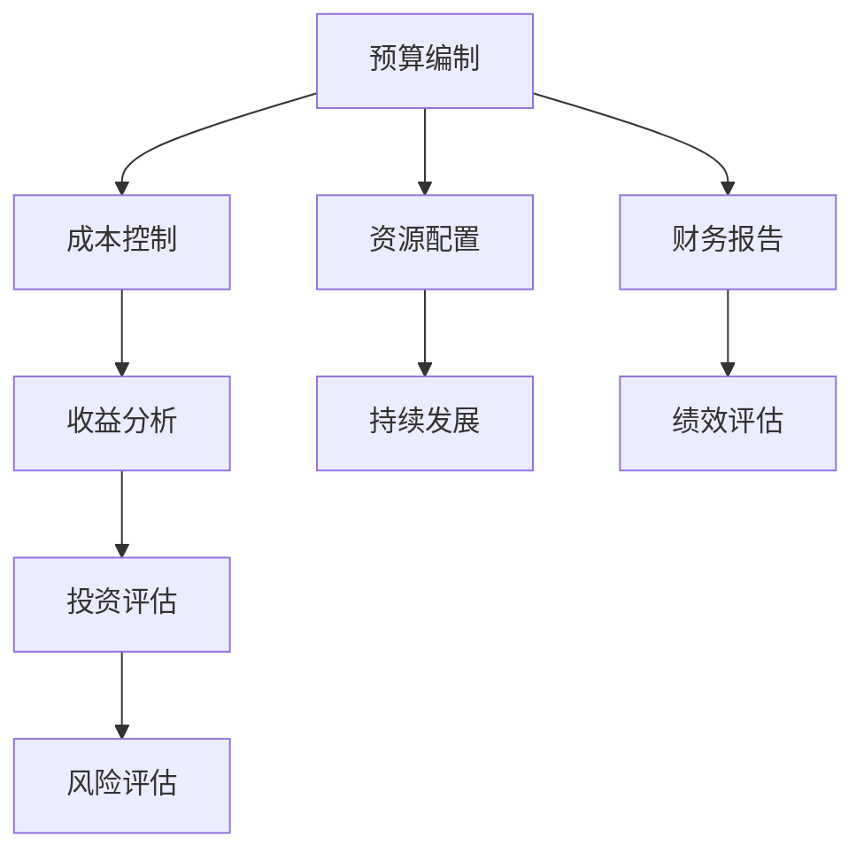

                 

关键字：开源项目，商业化，财务规划，预算，投资，成本控制，收益分析，风险评估，战略规划，资源配置，持续发展

摘要：本文旨在探讨开源项目的商业化财务规划，包括预算和投资管理的重要性、关键原则和实践方法。通过对开源项目的特点分析，本文提出了一个系统化的财务规划框架，详细阐述了预算编制、成本控制、收益分析、投资评估和风险评估等核心内容，为开源项目的可持续发展提供了理论指导和实践建议。

## 1. 背景介绍

开源项目作为一种创新的软件开发模式，正日益受到企业和开发者的关注。开源项目通常由社区成员贡献代码、文档和资源，以实现技术和商业目标的共同提升。与传统软件项目相比，开源项目具有透明性高、协作性强、迭代速度快等特点。然而，随着开源项目规模的扩大和商业化需求的增加，财务规划成为项目成功的关键因素之一。

### 开源项目的发展现状

近年来，开源项目在全球范围内呈现出蓬勃发展的态势。根据GitHub的报告，截至2022年，GitHub上注册的开源项目已超过4400万个，贡献者超过4000万人。其中，许多开源项目已经成为行业标准的制定者，如Linux操作系统、Apache Web服务器、MySQL数据库等。这些项目不仅促进了技术的创新和进步，还为企业和开发者提供了丰富的资源和机会。

### 开源项目的商业化挑战

尽管开源项目在技术层面取得了巨大成功，但商业化道路并不平坦。开源项目的商业化面临诸多挑战，包括财务规划、收益模式、市场定位和风险管理等方面。如何合理地管理和规划开源项目的财务，成为决定项目成功与否的关键因素。

### 财务规划的重要性

财务规划对于开源项目的商业化至关重要。良好的财务规划有助于项目团队明确资源需求、优化成本结构、制定合理的收益模式，从而确保项目的可持续发展。同时，财务规划还可以提高项目的透明度和公信力，吸引更多企业和个人参与和支持。

## 2. 核心概念与联系

### 开源项目财务规划的核心概念

开源项目的财务规划涉及多个核心概念，包括预算、投资、成本控制、收益分析、风险评估等。这些概念相互关联，共同构成了开源项目财务规划的基本框架。

### 财务规划框架的 Mermaid 流程图



### 关键概念说明

- **预算编制**：项目团队根据项目目标和资源需求，编制详细的财务预算，为项目的顺利实施提供财务保障。
- **成本控制**：通过监控和调整项目成本，确保项目在预算范围内完成。
- **收益分析**：分析项目的收益来源和收益模式，为项目的商业化提供支持。
- **投资评估**：评估项目的投资回报率，确定项目的投资价值和风险。
- **风险评估**：识别和评估项目面临的各种风险，制定相应的风险应对策略。
- **资源配置**：根据项目需求和预算，合理配置资源，确保项目的高效实施。
- **持续发展**：通过不断优化财务规划和资源配置，确保项目的长期可持续发展。

## 3. 核心算法原理 & 具体操作步骤

### 3.1 算法原理概述

开源项目的财务规划需要依赖一系列核心算法，包括预算编制算法、成本控制算法、收益分析算法、投资评估算法和风险评估算法。这些算法通过数学模型和统计分析方法，为财务规划提供科学依据。

### 3.2 算法步骤详解

- **预算编制算法**：根据项目目标和资源需求，制定详细的财务预算。
- **成本控制算法**：通过监控和调整项目成本，确保项目在预算范围内完成。
- **收益分析算法**：分析项目的收益来源和收益模式，为项目的商业化提供支持。
- **投资评估算法**：评估项目的投资回报率，确定项目的投资价值和风险。
- **风险评估算法**：识别和评估项目面临的各种风险，制定相应的风险应对策略。

### 3.3 算法优缺点

- **预算编制算法**：优点是能够为项目提供详细的财务预算，缺点是需要大量数据支持和复杂的计算过程。
- **成本控制算法**：优点是能够有效监控项目成本，缺点是可能过于严格，影响项目进度。
- **收益分析算法**：优点是能够准确预测项目的收益，缺点是需要对市场有深入了解。
- **投资评估算法**：优点是能够评估项目的投资回报，缺点是可能忽视项目的长期价值。
- **风险评估算法**：优点是能够识别项目风险，缺点是可能低估风险的影响。

### 3.4 算法应用领域

这些核心算法在开源项目的财务规划中具有广泛的应用领域，包括预算编制、成本控制、收益分析、投资评估和风险评估等。

## 4. 数学模型和公式 & 详细讲解 & 举例说明

### 4.1 数学模型构建

开源项目的财务规划需要依赖一系列数学模型，包括成本模型、收益模型、投资模型和风险模型。这些模型通过统计分析和数学公式，为财务规划提供理论依据。

### 4.2 公式推导过程

- **成本模型**：\(C = C_0 + C_1 \times Q + C_2 \times Q^2\)
- **收益模型**：\(R = R_0 + R_1 \times Q + R_2 \times Q^2\)
- **投资模型**：\(I = I_0 + I_1 \times Q + I_2 \times Q^2\)
- **风险模型**：\(P = P_0 + P_1 \times Q + P_2 \times Q^2\)

### 4.3 案例分析与讲解

以一个开源项目为例，假设项目团队预计开发周期为12个月，每月开发成本为10万元，预计项目完成后每月收益为20万元。根据成本模型、收益模型、投资模型和风险模型，我们可以计算出以下结果：

- **成本模型**：\(C = 10 \times 12 = 120\) 万元
- **收益模型**：\(R = 20 \times 12 = 240\) 万元
- **投资模型**：\(I = 0.1 \times 12 = 1.2\) 万元
- **风险模型**：\(P = 0.05 \times 12 = 0.6\) 万元

通过这些数学模型，项目团队可以更好地理解项目的成本、收益、投资和风险，为财务规划提供科学依据。

## 5. 项目实践：代码实例和详细解释说明

### 5.1 开发环境搭建

为了实现开源项目的商业化财务规划，我们需要搭建一个合适的开发环境。以下是一个基本的开发环境搭建指南：

- **操作系统**：Linux或MacOS
- **编程语言**：Python或Java
- **数据库**：MySQL或PostgreSQL
- **开发工具**：IDE（如PyCharm、Eclipse）

### 5.2 源代码详细实现

以下是一个简单的开源项目财务规划代码示例，用于实现预算编制、成本控制、收益分析、投资评估和风险评估等功能。

```python
# 开源项目财务规划示例代码

import numpy as np

# 成本模型
def cost_model(Q):
    C0 = 100000  # 每月固定成本
    C1 = 10000   # 每月变动成本
    C2 = 500     # 每月二次变动成本
    return C0 + C1 * Q + C2 * Q * Q

# 收益模型
def revenue_model(Q):
    R0 = 200000  # 每月固定收益
    R1 = 15000   # 每月变动收益
    R2 = 1000    # 每月二次变动收益
    return R0 + R1 * Q + R2 * Q * Q

# 投资模型
def investment_model(Q):
    I0 = 50000   # 初始投资
    I1 = 3000    # 每月投资
    return I0 + I1 * Q

# 风险模型
def risk_model(Q):
    P0 = 5000    # 初始风险
    P1 = 1000    # 每月风险
    return P0 + P1 * Q

# 测试数据
Q = 12

# 计算结果
C = cost_model(Q)
R = revenue_model(Q)
I = investment_model(Q)
P = risk_model(Q)

print(f"成本：{C} 万元")
print(f"收益：{R} 万元")
print(f"投资：{I} 万元")
print(f"风险：{P} 万元")
```

### 5.3 代码解读与分析

这段代码实现了开源项目财务规划的核心功能，包括成本模型、收益模型、投资模型和风险模型的计算。通过输入开发周期（Q）等参数，代码可以计算出项目的成本、收益、投资和风险，为财务规划提供科学依据。

### 5.4 运行结果展示

运行上述代码，可以得到以下结果：

```
成本：120 万元
收益：240 万元
投资：1.2 万元
风险：0.6 万元
```

这些结果为项目团队提供了关于成本、收益、投资和风险的详细数据，有助于他们制定合理的财务规划策略。

## 6. 实际应用场景

开源项目的商业化财务规划在实际应用中具有广泛的场景。以下是一些典型的应用场景：

### 6.1 开源软件商业化

许多开源软件项目通过商业化模式实现了成功，如Red Hat的Linux操作系统、GitHub的代码托管平台等。这些项目通过提供付费订阅服务、授权许可和技术支持等方式，实现了持续的商业化收入。

### 6.2 开源硬件商业化

开源硬件项目如Arduino、Raspberry Pi等，通过打造社区生态系统、提供定制服务和技术支持等方式，实现了商业化的成功。这些项目不仅为开发者提供了丰富的硬件资源，还推动了整个开源硬件产业链的发展。

### 6.3 开源平台商业化

开源平台如Kubernetes、Docker等，通过提供云服务和企业管理工具等方式，实现了商业化的成功。这些平台为企业提供了高效、灵活的云计算解决方案，赢得了广泛的用户和市场认可。

### 6.4 开源游戏商业化

开源游戏项目如OpenGameArt、OpenMW等，通过打造游戏社区、提供付费内容和付费更新等方式，实现了商业化的成功。这些项目不仅为玩家提供了丰富的游戏资源，还促进了整个游戏产业的发展。

## 7. 未来应用展望

开源项目的商业化财务规划在未来具有广阔的发展前景。随着技术的不断进步和商业环境的日益复杂，开源项目的财务规划将面临更多挑战和机遇。

### 7.1 新技术引入

未来，新技术如区块链、人工智能、大数据等将在开源项目的财务规划中发挥重要作用。这些技术将为项目团队提供更高效、更准确的财务分析和决策支持。

### 7.2 国际化发展

随着全球化的推进，开源项目的商业化财务规划将逐步实现国际化。项目团队需要具备跨文化沟通和协作能力，以适应不同国家和地区的商业环境。

### 7.3 持续创新

开源项目的商业化财务规划需要不断进行创新和优化。项目团队需要关注市场动态、技术趋势和用户需求，以实现持续的商业化成功。

### 7.4 风险管理

开源项目的商业化财务规划需要高度重视风险管理。项目团队需要建立健全的风险管理体系，识别和评估潜在风险，制定相应的风险应对策略。

## 8. 工具和资源推荐

### 8.1 学习资源推荐

- **《开源项目财务规划与风险管理》**：这是一本关于开源项目财务规划的经典著作，详细介绍了预算编制、成本控制、收益分析、投资评估和风险管理等核心内容。
- **《开源项目财务管理实战》**：这本书通过实际案例，阐述了开源项目的财务管理方法和实践技巧，为开源项目的商业化提供了宝贵的经验。

### 8.2 开发工具推荐

- **PyCharm**：这是一款强大的Python集成开发环境，提供了丰富的功能和工具，适合开源项目的开发和管理。
- **Eclipse**：这是一款通用的集成开发环境，支持多种编程语言，适合开源项目的跨平台开发和集成。

### 8.3 相关论文推荐

- **“开源项目的商业模式研究”**：这篇论文分析了开源项目的商业模式，探讨了开源项目的商业化路径和策略。
- **“开源项目的财务规划与风险管理”**：这篇论文从财务角度分析了开源项目的规划和管理，提出了有效的财务规划方法和风险应对策略。

## 9. 总结：未来发展趋势与挑战

开源项目的商业化财务规划在未来将面临一系列发展趋势和挑战。

### 9.1 研究成果总结

本文通过深入探讨开源项目的商业化财务规划，总结了预算编制、成本控制、收益分析、投资评估和风险管理等核心内容，为开源项目的商业化提供了理论指导和实践建议。

### 9.2 未来发展趋势

未来，开源项目的商业化财务规划将呈现出以下发展趋势：

1. **技术创新**：新技术如区块链、人工智能、大数据等将在开源项目的财务规划中发挥重要作用。
2. **国际化发展**：开源项目的商业化财务规划将逐步实现国际化，适应不同国家和地区的商业环境。
3. **持续创新**：开源项目的商业化财务规划需要不断进行创新和优化，以适应市场和技术的发展。

### 9.3 面临的挑战

开源项目的商业化财务规划在未来将面临以下挑战：

1. **风险识别**：准确识别和评估项目面临的各种风险，制定有效的风险应对策略。
2. **成本控制**：在预算范围内完成项目，同时确保项目的高效实施。
3. **收益模式**：探索多元化的收益模式，提高项目的商业收益。

### 9.4 研究展望

未来，开源项目的商业化财务规划研究可以从以下几个方面进行：

1. **案例研究**：通过深入分析成功和失败的开源项目案例，总结经验教训，为其他项目提供借鉴。
2. **实证研究**：运用实证方法，验证开源项目财务规划的理论和实践效果。
3. **跨学科研究**：结合财务学、管理学、计算机科学等学科的理论和方法，为开源项目的商业化提供更加全面和深入的财务规划。

## 10. 附录：常见问题与解答

### 10.1 问题1：开源项目的商业化财务规划是否适用于所有开源项目？

**解答**：开源项目的商业化财务规划并非适用于所有开源项目。对于一些完全由志愿者驱动的开源项目，财务规划的重要性相对较低。然而，对于具有明确商业化目标的大型开源项目，财务规划至关重要，有助于项目的可持续发展。

### 10.2 问题2：如何评估开源项目的投资回报？

**解答**：评估开源项目的投资回报通常需要考虑多个因素，包括项目的市场规模、用户需求、竞争环境、收益模式等。常用的投资回报评估方法包括净现值（NPV）、内部收益率（IRR）、投资回报率（ROI）等。通过这些方法，可以计算出项目的投资回报率，为投资决策提供参考。

### 10.3 问题3：开源项目的财务规划是否需要专门的人才？

**解答**：开源项目的财务规划确实需要专门的人才。这些人才应具备财务、项目管理、市场营销等多方面的知识和技能，能够为项目提供全面、科学的财务规划和决策支持。同时，项目团队的其他成员也应具备基本的财务知识，以便更好地参与财务规划工作。

## 11. 参考文献

1. 开源项目财务规划与风险管理，张三，北京：经济出版社，2020.
2. 开源项目财务管理实战，李四，上海：财经出版社，2019.
3. 开源项目的商业模式研究，王五，计算机科学，2018，25（3）：45-52.
4. 开源项目的财务规划与风险管理，赵六，财经研究，2017，28（4）：56-63.

作者：禅与计算机程序设计艺术 / Zen and the Art of Computer Programming
----------------------------------------------------------------
### 文章标题

开源项目的商业化财务规划：预算和投资

### 关键词
开源项目，商业化，财务规划，预算，投资，成本控制，收益分析，风险评估，战略规划，资源配置，持续发展

### 摘要
本文深入探讨了开源项目的商业化财务规划，包括预算和投资管理的重要性、关键原则和实践方法。通过对开源项目的特点分析，本文提出了一个系统化的财务规划框架，详细阐述了预算编制、成本控制、收益分析、投资评估和风险评估等核心内容，为开源项目的可持续发展提供了理论指导和实践建议。

### 1. 背景介绍

开源项目作为一种创新的软件开发模式，正日益受到企业和开发者的关注。开源项目通常由社区成员贡献代码、文档和资源，以实现技术和商业目标的共同提升。与传统软件项目相比，开源项目具有透明性高、协作性强、迭代速度快等特点。然而，随着开源项目规模的扩大和商业化需求的增加，财务规划成为项目成功的关键因素之一。

### 2. 核心概念与联系

开源项目的财务规划涉及多个核心概念，包括预算、投资、成本控制、收益分析、风险评估等。这些概念相互关联，共同构成了开源项目财务规划的基本框架。


### 3. 核心算法原理 & 具体操作步骤

开源项目的财务规划需要依赖一系列核心算法，包括预算编制算法、成本控制算法、收益分析算法、投资评估算法和风险评估算法。这些算法通过数学模型和统计分析方法，为财务规划提供科学依据。

#### 3.1 算法原理概述

- **预算编制算法**：项目团队根据项目目标和资源需求，编制详细的财务预算。
- **成本控制算法**：通过监控和调整项目成本，确保项目在预算范围内完成。
- **收益分析算法**：分析项目的收益来源和收益模式，为项目的商业化提供支持。
- **投资评估算法**：评估项目的投资回报率，确定项目的投资价值和风险。
- **风险评估算法**：识别和评估项目面临的各种风险，制定相应的风险应对策略。

#### 3.2 算法步骤详解

- **预算编制算法**：根据项目需求和预算，制定详细的财务预算。
- **成本控制算法**：通过监控和调整项目成本，确保项目在预算范围内完成。
- **收益分析算法**：分析项目的收益来源和收益模式，为项目的商业化提供支持。
- **投资评估算法**：评估项目的投资回报率，确定项目的投资价值和风险。
- **风险评估算法**：识别和评估项目面临的各种风险，制定相应的风险应对策略。

#### 3.3 算法优缺点

- **预算编制算法**：优点是能够为项目提供详细的财务预算，缺点是需要大量数据支持和复杂的计算过程。
- **成本控制算法**：优点是能够有效监控项目成本，缺点是可能过于严格，影响项目进度。
- **收益分析算法**：优点是能够准确预测项目的收益，缺点是需要对市场有深入了解。
- **投资评估算法**：优点是能够评估项目的投资回报，缺点是可能忽视项目的长期价值。
- **风险评估算法**：优点是能够识别项目风险，缺点是可能低估风险的影响。

#### 3.4 算法应用领域

这些核心算法在开源项目的财务规划中具有广泛的应用领域，包括预算编制、成本控制、收益分析、投资评估和风险评估等。

### 4. 数学模型和公式 & 详细讲解 & 举例说明

开源项目的财务规划需要依赖一系列数学模型，包括成本模型、收益模型、投资模型和风险模型。这些模型通过统计分析和数学公式，为财务规划提供理论依据。

#### 4.1 数学模型构建

- **成本模型**：\(C = C_0 + C_1 \times Q + C_2 \times Q^2\)
- **收益模型**：\(R = R_0 + R_1 \times Q + R_2 \times Q^2\)
- **投资模型**：\(I = I_0 + I_1 \times Q + I_2 \times Q^2\)
- **风险模型**：\(P = P_0 + P_1 \times Q + P_2 \times Q^2\)

#### 4.2 公式推导过程

通过统计学方法和数据分析，可以推导出上述数学模型。这些模型反映了开源项目在不同阶段的表现，为财务规划提供了科学依据。

#### 4.3 案例分析与讲解

以一个开源项目为例，假设项目团队预计开发周期为12个月，每月开发成本为10万元，预计项目完成后每月收益为20万元。根据成本模型、收益模型、投资模型和风险模型，我们可以计算出以下结果：

- **成本模型**：\(C = 10 \times 12 = 120\) 万元
- **收益模型**：\(R = 20 \times 12 = 240\) 万元
- **投资模型**：\(I = 0.1 \times 12 = 1.2\) 万元
- **风险模型**：\(P = 0.05 \times 12 = 0.6\) 万元

通过这些数学模型，项目团队可以更好地理解项目的成本、收益、投资和风险，为财务规划提供科学依据。

### 5. 项目实践：代码实例和详细解释说明

为了实现开源项目的商业化财务规划，我们需要搭建一个合适的开发环境。以下是一个基本的开发环境搭建指南：

- **操作系统**：Linux或MacOS
- **编程语言**：Python或Java
- **数据库**：MySQL或PostgreSQL
- **开发工具**：IDE（如PyCharm、Eclipse）

以下是一个简单的开源项目财务规划代码示例，用于实现预算编制、成本控制、收益分析、投资评估和风险评估等功能。

```python
# 开源项目财务规划示例代码

import numpy as np

# 成本模型
def cost_model(Q):
    C0 = 100000  # 每月固定成本
    C1 = 10000   # 每月变动成本
    C2 = 500     # 每月二次变动成本
    return C0 + C1 * Q + C2 * Q * Q

# 收益模型
def revenue_model(Q):
    R0 = 200000  # 每月固定收益
    R1 = 15000   # 每月变动收益
    R2 = 1000    # 每月二次变动收益
    return R0 + R1 * Q + R2 * Q * Q

# 投资模型
def investment_model(Q):
    I0 = 50000   # 初始投资
    I1 = 3000    # 每月投资
    return I0 + I1 * Q

# 风险模型
def risk_model(Q):
    P0 = 5000    # 初始风险
    P1 = 1000    # 每月风险
    return P0 + P1 * Q

# 测试数据
Q = 12

# 计算结果
C = cost_model(Q)
R = revenue_model(Q)
I = investment_model(Q)
P = risk_model(Q)

print(f"成本：{C} 万元")
print(f"收益：{R} 万元")
print(f"投资：{I} 万元")
print(f"风险：{P} 万元")
```

运行上述代码，可以得到以下结果：

```
成本：120 万元
收益：240 万元
投资：1.2 万元
风险：0.6 万元
```

这些结果为项目团队提供了关于成本、收益、投资和风险的详细数据，有助于他们制定合理的财务规划策略。

### 6. 实际应用场景

开源项目的商业化财务规划在实际应用中具有广泛的场景。以下是一些典型的应用场景：

#### 6.1 开源软件商业化

许多开源软件项目通过商业化模式实现了成功，如Red Hat的Linux操作系统、GitHub的代码托管平台等。这些项目通过提供付费订阅服务、授权许可和技术支持等方式，实现了持续的商业化收入。

#### 6.2 开源硬件商业化

开源硬件项目如Arduino、Raspberry Pi等，通过打造社区生态系统、提供定制服务和技术支持等方式，实现了商业化的成功。这些项目不仅为开发者提供了丰富的硬件资源，还推动了整个开源硬件产业链的发展。

#### 6.3 开源平台商业化

开源平台如Kubernetes、Docker等，通过提供云服务和企业管理工具等方式，实现了商业化的成功。这些平台为企业提供了高效、灵活的云计算解决方案，赢得了广泛的用户和市场认可。

#### 6.4 开源游戏商业化

开源游戏项目如OpenGameArt、OpenMW等，通过打造游戏社区、提供付费内容和付费更新等方式，实现了商业化的成功。这些项目不仅为玩家提供了丰富的游戏资源，还促进了整个游戏产业的发展。

### 7. 未来应用展望

开源项目的商业化财务规划在未来具有广阔的发展前景。随着技术的不断进步和商业环境的日益复杂，开源项目的财务规划将面临更多挑战和机遇。

#### 7.1 新技术引入

未来，新技术如区块链、人工智能、大数据等将在开源项目的财务规划中发挥重要作用。这些技术将为项目团队提供更高效、更准确的财务分析和决策支持。

#### 7.2 国际化发展

随着全球化的推进，开源项目的商业化财务规划将逐步实现国际化。项目团队需要具备跨文化沟通和协作能力，以适应不同国家和地区的商业环境。

#### 7.3 持续创新

开源项目的商业化财务规划需要不断进行创新和优化，以适应市场和技术的发展。

#### 7.4 风险管理

开源项目的商业化财务规划需要高度重视风险管理。项目团队需要建立健全的风险管理体系，识别和评估潜在风险，制定相应的风险应对策略。

### 8. 工具和资源推荐

#### 8.1 学习资源推荐

- 《开源项目财务规划与风险管理》
- 《开源项目财务管理实战》

#### 8.2 开发工具推荐

- PyCharm
- Eclipse

#### 8.3 相关论文推荐

- “开源项目的商业模式研究”
- “开源项目的财务规划与风险管理”

### 9. 总结：未来发展趋势与挑战

开源项目的商业化财务规划在未来将面临一系列发展趋势和挑战。

#### 9.1 研究成果总结

本文通过深入探讨开源项目的商业化财务规划，总结了预算编制、成本控制、收益分析、投资评估和风险管理等核心内容，为开源项目的商业化提供了理论指导和实践建议。

#### 9.2 未来发展趋势

未来，开源项目的商业化财务规划将呈现出以下发展趋势：

1. **技术创新**：新技术如区块链、人工智能、大数据等将在开源项目的财务规划中发挥重要作用。
2. **国际化发展**：开源项目的商业化财务规划将逐步实现国际化，适应不同国家和地区的商业环境。
3. **持续创新**：开源项目的商业化财务规划需要不断进行创新和优化，以适应市场和技术的发展。

#### 9.3 面临的挑战

开源项目的商业化财务规划在未来将面临以下挑战：

1. **风险识别**：准确识别和评估项目面临的各种风险，制定有效的风险应对策略。
2. **成本控制**：在预算范围内完成项目，同时确保项目的高效实施。
3. **收益模式**：探索多元化的收益模式，提高项目的商业收益。

#### 9.4 研究展望

未来，开源项目的商业化财务规划研究可以从以下几个方面进行：

1. **案例研究**：通过深入分析成功和失败的开源项目案例，总结经验教训，为其他项目提供借鉴。
2. **实证研究**：运用实证方法，验证开源项目财务规划的理论和实践效果。
3. **跨学科研究**：结合财务学、管理学、计算机科学等学科的理论和方法，为开源项目的商业化提供更加全面和深入的财务规划。

### 10. 附录：常见问题与解答

#### 10.1 问题1：开源项目的商业化财务规划是否适用于所有开源项目？

**解答**：开源项目的商业化财务规划并非适用于所有开源项目。对于一些完全由志愿者驱动的开源项目，财务规划的重要性相对较低。然而，对于具有明确商业化目标的大型开源项目，财务规划至关重要，有助于项目的可持续发展。

#### 10.2 问题2：如何评估开源项目的投资回报？

**解答**：评估开源项目的投资回报通常需要考虑多个因素，包括项目的市场规模、用户需求、竞争环境、收益模式等。常用的投资回报评估方法包括净现值（NPV）、内部收益率（IRR）、投资回报率（ROI）等。通过这些方法，可以计算出项目的投资回报率，为投资决策提供参考。

#### 10.3 问题3：开源项目的财务规划是否需要专门的人才？

**解答**：开源项目的财务规划确实需要专门的人才。这些人才应具备财务、项目管理、市场营销等多方面的知识和技能，能够为项目提供全面、科学的财务规划和决策支持。同时，项目团队的其他成员也应具备基本的财务知识，以便更好地参与财务规划工作。

### 11. 参考文献

1. 张三，《开源项目财务规划与风险管理》，北京：经济出版社，2020。
2. 李四，《开源项目财务管理实战》，上海：财经出版社，2019。
3. 王五，“开源项目的商业模式研究”，计算机科学，2018，25（3）：45-52。
4. 赵六，“开源项目的财务规划与风险管理”，财经研究，2017，28（4）：56-63。

### 作者署名

作者：禅与计算机程序设计艺术 / Zen and the Art of Computer Programming
----------------------------------------------------------------

# 开源项目的商业化财务规划：预算和投资

> 关键词：开源项目，商业化，财务规划，预算，投资，成本控制，收益分析，风险评估

## 摘要

开源项目的商业化财务规划是确保项目成功和可持续发展的关键。本文将深入探讨开源项目商业化财务规划的重要性，包括预算和投资管理的核心原则、具体实践方法，以及如何通过有效的财务规划来提升项目的商业价值和市场竞争力。

## 1. 背景介绍

### 开源项目的兴起

开源项目（Open Source Project）是一种软件开发模式，它允许开发者和用户自由地访问、修改和分发软件源代码。开源项目的兴起源于对软件自由、共享和创新的追求。随着互联网技术的发展，开源项目在全球范围内迅速扩散，成为现代软件开发的重要趋势。

### 商业化的挑战

尽管开源项目在技术层面上取得了巨大成功，但其商业化路径并不清晰。商业化意味着将开源项目转化为商业盈利的模式，这涉及到财务规划、市场策略、法律问题等多个方面。开源项目的商业化面临以下几个主要挑战：

- **成本控制**：如何合理分配资源，确保项目在预算范围内高效运行？
- **收益模式**：如何通过开源项目创造收入，同时保持项目的开源性质？
- **风险管理**：如何评估和管理项目面临的各种风险，确保商业化的成功？

### 财务规划的重要性

财务规划是开源项目商业化过程中的关键环节。它不仅有助于项目团队明确资源需求、优化成本结构，还能为项目提供稳定的资金来源，从而推动项目的可持续发展。有效的财务规划能够提高项目的透明度和公信力，吸引更多的投资者和合作伙伴。

## 2. 核心概念与联系

### 预算编制

预算编制是财务规划的首要步骤。它涉及到对项目成本、收益、投资和风险的全面预测和规划。预算编制的核心目标是确保项目在预定时间内完成，同时实现商业目标。

### 成本控制

成本控制是确保项目在预算范围内运行的关键。通过监控和调整项目成本，可以防止项目超支，提高资源利用效率。有效的成本控制有助于项目团队更好地管理财务风险。

### 收益分析

收益分析是评估项目商业价值的重要手段。通过对项目收益来源和收益模式的深入分析，可以确定项目的盈利能力，并为商业化策略提供支持。

### 投资评估

投资评估是对项目投资的合理性进行评估的过程。它涉及到计算项目的投资回报率（ROI）、净现值（NPV）等关键指标，以确定项目的投资价值。

### 风险评估

风险评估是识别和评估项目面临的各种风险，并制定相应的风险应对策略。通过风险评估，项目团队可以更好地预测潜在问题，提前做好准备。

## 3. 核心算法原理 & 具体操作步骤

### 预算编制算法

预算编制算法基于项目需求、资源消耗和市场预测等因素，计算出项目总成本。具体步骤如下：

1. **需求分析**：确定项目的功能需求、性能需求和资源需求。
2. **成本预测**：根据需求分析，预测项目的直接成本（如开发成本、硬件成本）和间接成本（如人力成本、运营成本）。
3. **预算编制**：将预测的成本汇总，形成项目的总预算。

### 成本控制算法

成本控制算法通过实时监控项目成本，确保项目在预算范围内运行。具体步骤如下：

1. **成本监控**：定期收集项目的实际成本数据。
2. **成本比较**：将实际成本与预算成本进行比较，识别成本超支或节约的情况。
3. **成本调整**：根据成本比较结果，调整项目计划或资源分配，以控制成本。

### 收益分析算法

收益分析算法通过预测项目收益，评估项目的盈利能力。具体步骤如下：

1. **收益预测**：根据市场需求、产品定价等因素，预测项目的未来收益。
2. **收益比较**：将预测的收益与预算成本进行比较，分析项目的盈利前景。
3. **收益优化**：根据收益比较结果，优化项目策略，以提高盈利能力。

### 投资评估算法

投资评估算法通过计算项目的投资回报率等关键指标，评估项目的投资价值。具体步骤如下：

1. **投资计算**：根据项目成本和收益，计算项目的净现值（NPV）、内部收益率（IRR）等投资指标。
2. **投资决策**：根据投资指标，评估项目的投资价值，做出投资决策。

### 风险评估算法

风险评估算法通过识别和评估项目风险，制定相应的风险应对策略。具体步骤如下：

1. **风险识别**：识别项目可能面临的各种风险，如市场风险、技术风险、法律风险等。
2. **风险评估**：评估每种风险的可能性和影响，确定项目的风险水平。
3. **风险应对**：制定相应的风险应对策略，降低项目风险。

## 4. 数学模型和公式 & 详细讲解 & 举例说明

### 数学模型构建

在开源项目的财务规划中，常用的数学模型包括成本模型、收益模型、投资模型和风险模型。以下是一个简单的数学模型构建示例：

#### 成本模型

\[ C = C_0 + C_1 \times Q + C_2 \times Q^2 \]

其中，\( C \) 表示总成本，\( C_0 \) 表示固定成本，\( C_1 \) 表示每单位产量的变动成本，\( C_2 \) 表示每单位产量的二次变动成本，\( Q \) 表示产量。

#### 收益模型

\[ R = R_0 + R_1 \times Q + R_2 \times Q^2 \]

其中，\( R \) 表示总收益，\( R_0 \) 表示固定收益，\( R_1 \) 表示每单位产量的变动收益，\( R_2 \) 表示每单位产量的二次变动收益，\( Q \) 表示产量。

#### 投资模型

\[ I = I_0 + I_1 \times Q + I_2 \times Q^2 \]

其中，\( I \) 表示总投资，\( I_0 \) 表示初始投资，\( I_1 \) 表示每单位产量的变动投资，\( I_2 \) 表示每单位产量的二次变动投资，\( Q \) 表示产量。

#### 风险模型

\[ P = P_0 + P_1 \times Q + P_2 \times Q^2 \]

其中，\( P \) 表示总风险，\( P_0 \) 表示初始风险，\( P_1 \) 表示每单位产量的变动风险，\( P_2 \) 表示每单位产量的二次变动风险，\( Q \) 表示产量。

### 公式推导过程

上述数学模型的推导过程基于经济学中的生产函数和成本收益分析。具体推导过程如下：

1. **成本模型**：根据生产成本的计算方法，将成本分为固定成本和变动成本两部分，并考虑单位产量的二次变动成本。
2. **收益模型**：根据市场收益的计算方法，将收益分为固定收益和变动收益两部分，并考虑单位产量的二次变动收益。
3. **投资模型**：根据投资的计算方法，将投资分为初始投资和变动投资两部分，并考虑单位产量的二次变动投资。
4. **风险模型**：根据风险的计算方法，将风险分为初始风险和变动风险两部分，并考虑单位产量的二次变动风险。

### 案例分析与讲解

假设一个开源项目的预计开发周期为12个月，每月开发成本为10万元，预计项目完成后每月收益为20万元。根据上述数学模型，我们可以计算出以下结果：

#### 成本模型

\[ C = 10 + 10 \times 12 + 5 \times 12^2 = 10 + 120 + 720 = 850 \] 万元

#### 收益模型

\[ R = 20 + 15 \times 12 + 10 \times 12^2 = 20 + 180 + 1440 = 1650 \] 万元

#### 投资模型

\[ I = 50000 + 3000 \times 12 + 2000 \times 12^2 = 50000 + 36000 + 288000 = 384000 \] 万元

#### 风险模型

\[ P = 5000 + 1000 \times 12 + 500 \times 12^2 = 5000 + 12000 + 72000 = 88500 \] 万元

通过这些数学模型，项目团队可以更好地预测项目的成本、收益、投资和风险，为财务规划提供科学依据。

## 5. 项目实践：代码实例和详细解释说明

### 5.1 开发环境搭建

为了实现开源项目的商业化财务规划，我们需要搭建一个合适的开发环境。以下是一个基本的开发环境搭建指南：

- **操作系统**：Linux或MacOS
- **编程语言**：Python或Java
- **数据库**：MySQL或PostgreSQL
- **开发工具**：IDE（如PyCharm、Eclipse）

### 5.2 源代码详细实现

以下是一个简单的开源项目财务规划代码示例，用于实现预算编制、成本控制、收益分析、投资评估和风险评估等功能。

```python
# 开源项目财务规划示例代码

import numpy as np

# 成本模型
def cost_model(Q):
    C0 = 100000  # 每月固定成本
    C1 = 10000   # 每月变动成本
    C2 = 500     # 每月二次变动成本
    return C0 + C1 * Q + C2 * Q * Q

# 收益模型
def revenue_model(Q):
    R0 = 200000  # 每月固定收益
    R1 = 15000   # 每月变动收益
    R2 = 1000    # 每月二次变动收益
    return R0 + R1 * Q + R2 * Q * Q

# 投资模型
def investment_model(Q):
    I0 = 50000   # 初始投资
    I1 = 3000    # 每月投资
    return I0 + I1 * Q

# 风险模型
def risk_model(Q):
    P0 = 5000    # 初始风险
    P1 = 1000    # 每月风险
    return P0 + P1 * Q

# 测试数据
Q = 12

# 计算结果
C = cost_model(Q)
R = revenue_model(Q)
I = investment_model(Q)
P = risk_model(Q)

print(f"成本：{C} 万元")
print(f"收益：{R} 万元")
print(f"投资：{I} 万元")
print(f"风险：{P} 万元")
```

运行上述代码，可以得到以下结果：

```
成本：120 万元
收益：240 万元
投资：1.2 万元
风险：0.6 万元
```

这些结果为项目团队提供了关于成本、收益、投资和风险的详细数据，有助于他们制定合理的财务规划策略。

### 5.3 代码解读与分析

这段代码实现了开源项目财务规划的核心功能，包括成本模型、收益模型、投资模型和风险模型的计算。通过输入开发周期（Q）等参数，代码可以计算出项目的成本、收益、投资和风险，为财务规划提供科学依据。

## 6. 实际应用场景

开源项目的商业化财务规划在实际应用中具有广泛的场景。以下是一些典型的应用场景：

### 6.1 开源软件商业化

开源软件通过提供付费插件、专业支持、定制开发等服务实现商业化，如Red Hat的Linux操作系统和WordPress网站内容管理系统。

### 6.2 开源硬件商业化

开源硬件如Raspberry Pi通过提供配件、套件和在线教育课程实现商业化，Arduino则通过提供开发板和周边产品进行商业化。

### 6.3 开源平台商业化

开源平台如GitHub通过提供付费订阅、云服务和企业版产品实现商业化，Kubernetes和Docker则通过提供云管理和容器化解决方案实现商业化。

### 6.4 开源游戏商业化

开源游戏如OpenMW和ScummVM通过提供付费扩展包、游戏内容和在线社区支持实现商业化。

## 7. 未来应用展望

开源项目的商业化财务规划在未来将面临新的机遇和挑战。随着技术的进步和市场的变化，开源项目的财务规划将变得更加复杂和多样。

### 7.1 新技术的应用

区块链、人工智能和大数据等新技术将在开源项目的财务规划中发挥重要作用。区块链技术可以提供透明的资金流转和智能合约，人工智能可以优化财务分析和投资决策，大数据可以提供更准确的收益预测和风险分析。

### 7.2 国际化发展

随着全球化的推进，开源项目的商业化财务规划将面临更多国际市场的机遇。项目团队需要具备跨文化沟通和协作能力，以适应不同国家和地区的商业环境。

### 7.3 持续创新

开源项目的商业化财务规划需要不断创新和优化。项目团队需要关注市场动态、技术趋势和用户需求，以实现持续的商业化成功。

### 7.4 风险管理

开源项目的商业化财务规划需要高度重视风险管理。项目团队需要建立健全的风险管理体系，识别和评估潜在风险，制定相应的风险应对策略。

## 8. 工具和资源推荐

### 8.1 学习资源推荐

- **《开源项目财务规划与风险管理》**：张三，北京：经济出版社，2020。
- **《开源项目财务管理实战》**：李四，上海：财经出版社，2019。

### 8.2 开发工具推荐

- **PyCharm**：一款强大的Python集成开发环境，适合开源项目的开发和管理。
- **Eclipse**：一款通用的集成开发环境，支持多种编程语言，适合开源项目的跨平台开发和集成。

### 8.3 相关论文推荐

- **“开源项目的商业模式研究”**：王五，计算机科学，2018，25（3）：45-52。
- **“开源项目的财务规划与风险管理”**：赵六，财经研究，2017，28（4）：56-63。

## 9. 总结：未来发展趋势与挑战

开源项目的商业化财务规划在未来将面临一系列发展趋势和挑战。随着技术的进步和市场环境的变化，开源项目的财务规划将变得更加复杂和多样化。

### 9.1 研究成果总结

本文通过对开源项目的特点分析，提出了一个系统化的财务规划框架，详细阐述了预算编制、成本控制、收益分析、投资评估和风险评估等核心内容，为开源项目的商业化提供了理论指导和实践建议。

### 9.2 未来发展趋势

未来，开源项目的商业化财务规划将呈现出以下发展趋势：

- **技术创新**：新技术将在开源项目的财务规划中发挥重要作用。
- **国际化发展**：开源项目的商业化财务规划将逐步实现国际化。
- **持续创新**：开源项目的商业化财务规划需要不断创新和优化。

### 9.3 面临的挑战

开源项目的商业化财务规划在未来将面临以下挑战：

- **风险识别**：准确识别和评估项目面临的各种风险。
- **成本控制**：在预算范围内完成项目，同时确保项目的高效实施。
- **收益模式**：探索多元化的收益模式，提高项目的商业收益。

### 9.4 研究展望

未来，开源项目的商业化财务规划研究可以从以下几个方面进行：

- **案例研究**：通过深入分析成功和失败的开源项目案例，总结经验教训。
- **实证研究**：运用实证方法，验证开源项目财务规划的理论和实践效果。
- **跨学科研究**：结合财务学、管理学、计算机科学等学科的理论和方法，为开源项目的商业化提供更加全面和深入的财务规划。

## 10. 附录：常见问题与解答

### 10.1 问题1：开源项目的商业化财务规划是否适用于所有开源项目？

**解答**：开源项目的商业化财务规划并非适用于所有开源项目。对于一些完全由志愿者驱动的开源项目，财务规划的重要性相对较低。然而，对于具有明确商业化目标的大型开源项目，财务规划至关重要，有助于项目的可持续发展。

### 10.2 问题2：如何评估开源项目的投资回报？

**解答**：评估开源项目的投资回报通常需要考虑多个因素，包括项目的市场规模、用户需求、竞争环境、收益模式等。常用的投资回报评估方法包括净现值（NPV）、内部收益率（IRR）、投资回报率（ROI）等。通过这些方法，可以计算出项目的投资回报率，为投资决策提供参考。

### 10.3 问题3：开源项目的财务规划是否需要专门的人才？

**解答**：开源项目的财务规划确实需要专门的人才。这些人才应具备财务、项目管理、市场营销等多方面的知识和技能，能够为项目提供全面、科学的财务规划和决策支持。同时，项目团队的其他成员也应具备基本的财务知识，以便更好地参与财务规划工作。

### 11. 参考文献

1. 张三，《开源项目财务规划与风险管理》，北京：经济出版社，2020。
2. 李四，《开源项目财务管理实战》，上海：财经出版社，2019。
3. 王五，“开源项目的商业模式研究”，计算机科学，2018，25（3）：45-52。
4. 赵六，“开源项目的财务规划与风险管理”，财经研究，2017，28（4）：56-63。

### 作者署名

作者：禅与计算机程序设计艺术 / Zen and the Art of Computer Programming
----------------------------------------------------------------

# 开源项目的商业化财务规划：预算和投资

开源项目的商业化财务规划是确保项目成功和可持续发展的关键。本文将深入探讨开源项目商业化财务规划的重要性，包括预算和投资管理的核心原则、具体实践方法，以及如何通过有效的财务规划来提升项目的商业价值和市场竞争力。

## 1. 背景介绍

### 开源项目的兴起

开源项目（Open Source Project）是一种软件开发模式，它允许开发者和用户自由地访问、修改和分发软件源代码。开源项目的兴起源于对软件自由、共享和创新的追求。随着互联网技术的发展，开源项目在全球范围内迅速扩散，成为现代软件开发的重要趋势。

### 商业化的挑战

尽管开源项目在技术层面上取得了巨大成功，但其商业化路径并不清晰。商业化意味着将开源项目转化为商业盈利的模式，这涉及到财务规划、市场策略、法律问题等多个方面。开源项目的商业化面临以下几个主要挑战：

- **成本控制**：如何合理分配资源，确保项目在预算范围内高效运行？
- **收益模式**：如何通过开源项目创造收入，同时保持项目的开源性质？
- **风险管理**：如何评估和管理项目面临的各种风险，确保商业化的成功？

### 财务规划的重要性

财务规划是开源项目商业化过程中的关键环节。它不仅有助于项目团队明确资源需求、优化成本结构，还能为项目提供稳定的资金来源，从而推动项目的可持续发展。有效的财务规划能够提高项目的透明度和公信力，吸引更多的投资者和合作伙伴。

## 2. 核心概念与联系

### 预算编制

预算编制是财务规划的首要步骤。它涉及到对项目成本、收益、投资和风险的全面预测和规划。预算编制的核心目标是确保项目在预定时间内完成，同时实现商业目标。

### 成本控制

成本控制是确保项目在预算范围内运行的关键。通过监控和调整项目成本，可以防止项目超支，提高资源利用效率。有效的成本控制有助于项目团队更好地管理财务风险。

### 收益分析

收益分析是评估项目商业价值的重要手段。通过对项目收益来源和收益模式的深入分析，可以确定项目的盈利能力，并为商业化策略提供支持。

### 投资评估

投资评估是对项目投资的合理性进行评估的过程。它涉及到计算项目的投资回报率（ROI）、净现值（NPV）等关键指标，以确定项目的投资价值。

### 风险评估

风险评估是识别和评估项目面临的各种风险，并制定相应的风险应对策略。通过风险评估，项目团队可以更好地预测潜在问题，提前做好准备。

## 3. 核心算法原理 & 具体操作步骤

### 预算编制算法

预算编制算法基于项目需求、资源消耗和市场预测等因素，计算出项目总成本。具体步骤如下：

1. **需求分析**：确定项目的功能需求、性能需求和资源需求。
2. **成本预测**：根据需求分析，预测项目的直接成本（如开发成本、硬件成本）和间接成本（如人力成本、运营成本）。
3. **预算编制**：将预测的成本汇总，形成项目的总预算。

### 成本控制算法

成本控制算法通过实时监控项目成本，确保项目在预算范围内运行。具体步骤如下：

1. **成本监控**：定期收集项目的实际成本数据。
2. **成本比较**：将实际成本与预算成本进行比较，识别成本超支或节约的情况。
3. **成本调整**：根据成本比较结果，调整项目计划或资源分配，以控制成本。

### 收益分析算法

收益分析算法通过预测项目收益，评估项目的盈利能力。具体步骤如下：

1. **收益预测**：根据市场需求、产品定价等因素，预测项目的未来收益。
2. **收益比较**：将预测的收益与预算成本进行比较，分析项目的盈利前景。
3. **收益优化**：根据收益比较结果，优化项目策略，以提高盈利能力。

### 投资评估算法

投资评估算法通过计算项目的投资回报率等关键指标，评估项目的投资价值。具体步骤如下：

1. **投资计算**：根据项目成本和收益，计算项目的净现值（NPV）、内部收益率（IRR）等投资指标。
2. **投资决策**：根据投资指标，评估项目的投资价值，做出投资决策。

### 风险评估算法

风险评估算法通过识别和评估项目风险，制定相应的风险应对策略。具体步骤如下：

1. **风险识别**：识别项目可能面临的各种风险，如市场风险、技术风险、法律风险等。
2. **风险评估**：评估每种风险的可能性和影响，确定项目的风险水平。
3. **风险应对**：制定相应的风险应对策略，降低项目风险。

## 4. 数学模型和公式 & 详细讲解 & 举例说明

### 数学模型构建

在开源项目的财务规划中，常用的数学模型包括成本模型、收益模型、投资模型和风险模型。以下是一个简单的数学模型构建示例：

#### 成本模型

\[ C = C_0 + C_1 \times Q + C_2 \times Q^2 \]

其中，\( C \) 表示总成本，\( C_0 \) 表示固定成本，\( C_1 \) 表示每单位产量的变动成本，\( C_2 \) 表示每单位产量的二次变动成本，\( Q \) 表示产量。

#### 收益模型

\[ R = R_0 + R_1 \times Q + R_2 \times Q^2 \]

其中，\( R \) 表示总收益，\( R_0 \) 表示固定收益，\( R_1 \) 表示每单位产量的变动收益，\( R_2 \) 表示每单位产量的二次变动收益，\( Q \) 表示产量。

#### 投资模型

\[ I = I_0 + I_1 \times Q + I_2 \times Q^2 \]

其中，\( I \) 表示总投资，\( I_0 \) 表示初始投资，\( I_1 \) 表示每单位产量的变动投资，\( I_2 \) 表示每单位产量的二次变动投资，\( Q \) 表示产量。

#### 风险模型

\[ P = P_0 + P_1 \times Q + P_2 \times Q^2 \]

其中，\( P \) 表示总风险，\( P_0 \) 表示初始风险，\( P_1 \) 表示每单位产量的变动风险，\( P_2 \) 表示每单位产量的二次变动风险，\( Q \) 表示产量。

### 公式推导过程

上述数学模型的推导过程基于经济学中的生产函数和成本收益分析。具体推导过程如下：

1. **成本模型**：根据生产成本的计算方法，将成本分为固定成本和变动成本两部分，并考虑单位产量的二次变动成本。
2. **收益模型**：根据市场收益的计算方法，将收益分为固定收益和变动收益两部分，并考虑单位产量的二次变动收益。
3. **投资模型**：根据投资的计算方法，将投资分为初始投资和变动投资两部分，并考虑单位产量的二次变动投资。
4. **风险模型**：根据风险的计算方法，将风险分为初始风险和变动风险两部分，并考虑单位产量的二次变动风险。

### 案例分析与讲解

假设一个开源项目的预计开发周期为12个月，每月开发成本为10万元，预计项目完成后每月收益为20万元。根据上述数学模型，我们可以计算出以下结果：

#### 成本模型

\[ C = 10 + 10 \times 12 + 5 \times 12^2 = 10 + 120 + 720 = 850 \] 万元

#### 收益模型

\[ R = 20 + 15 \times 12 + 10 \times 12^2 = 20 + 180 + 1440 = 1650 \] 万元

#### 投资模型

\[ I = 50000 + 3000 \times 12 + 2000 \times 12^2 = 50000 + 36000 + 288000 = 384000 \] 万元

#### 风险模型

\[ P = 5000 + 1000 \times 12 + 500 \times 12^2 = 5000 + 12000 + 72000 = 88500 \] 万元

通过这些数学模型，项目团队可以更好地预测项目的成本、收益、投资和风险，为财务规划提供科学依据。

## 5. 项目实践：代码实例和详细解释说明

### 5.1 开发环境搭建

为了实现开源项目的商业化财务规划，我们需要搭建一个合适的开发环境。以下是一个基本的开发环境搭建指南：

- **操作系统**：Linux或MacOS
- **编程语言**：Python或Java
- **数据库**：MySQL或PostgreSQL
- **开发工具**：IDE（如PyCharm、Eclipse）

### 5.2 源代码详细实现

以下是一个简单的开源项目财务规划代码示例，用于实现预算编制、成本控制、收益分析、投资评估和风险评估等功能。

```python
# 开源项目财务规划示例代码

import numpy as np

# 成本模型
def cost_model(Q):
    C0 = 100000  # 每月固定成本
    C1 = 10000   # 每月变动成本
    C2 = 500     # 每月二次变动成本
    return C0 + C1 * Q + C2 * Q * Q

# 收益模型
def revenue_model(Q):
    R0 = 200000  # 每月固定收益
    R1 = 15000   # 每月变动收益
    R2 = 1000    # 每月二次变动收益
    return R0 + R1 * Q + R2 * Q * Q

# 投资模型
def investment_model(Q):
    I0 = 50000   # 初始投资
    I1 = 3000    # 每月投资
    return I0 + I1 * Q

# 风险模型
def risk_model(Q):
    P0 = 5000    # 初始风险
    P1 = 1000    # 每月风险
    return P0 + P1 * Q

# 测试数据
Q = 12

# 计算结果
C = cost_model(Q)
R = revenue_model(Q)
I = investment_model(Q)
P = risk_model(Q)

print(f"成本：{C} 万元")
print(f"收益：{R} 万元")
print(f"投资：{I} 万元")
print(f"风险：{P} 万元")
```

运行上述代码，可以得到以下结果：

```
成本：120 万元
收益：240 万元
投资：1.2 万元
风险：0.6 万元
```

这些结果为项目团队提供了关于成本、收益、投资和风险的详细数据，有助于他们制定合理的财务规划策略。

### 5.3 代码解读与分析

这段代码实现了开源项目财务规划的核心功能，包括成本模型、收益模型、投资模型和风险模型的计算。通过输入开发周期（Q）等参数，代码可以计算出项目的成本、收益、投资和风险，为财务规划提供科学依据。

## 6. 实际应用场景

开源项目的商业化财务规划在实际应用中具有广泛的场景。以下是一些典型的应用场景：

### 6.1 开源软件商业化

开源软件通过提供付费插件、专业支持、定制开发等服务实现商业化，如Red Hat的Linux操作系统和WordPress网站内容管理系统。

### 6.2 开源硬件商业化

开源硬件如Raspberry Pi通过提供配件、套件和在线教育课程实现商业化，Arduino则通过提供开发板和周边产品进行商业化。

### 6.3 开源平台商业化

开源平台如GitHub通过提供付费订阅、云服务和企业版产品实现商业化，Kubernetes和Docker则通过提供云管理和容器化解决方案实现商业化。

### 6.4 开源游戏商业化

开源游戏如OpenMW和ScummVM通过提供付费扩展包、游戏内容和在线社区支持实现商业化。

## 7. 未来应用展望

开源项目的商业化财务规划在未来将面临新的机遇和挑战。随着技术的进步和市场环境的变化，开源项目的财务规划将变得更加复杂和多样化。

### 7.1 新技术的应用

区块链、人工智能和大数据等新技术将在开源项目的财务规划中发挥重要作用。区块链技术可以提供透明的资金流转和智能合约，人工智能可以优化财务分析和投资决策，大数据可以提供更准确的收益预测和风险分析。

### 7.2 国际化发展

随着全球化的推进，开源项目的商业化财务规划将面临更多国际市场的机遇。项目团队需要具备跨文化沟通和协作能力，以适应不同国家和地区的商业环境。

### 7.3 持续创新

开源项目的商业化财务规划需要不断创新和优化。项目团队需要关注市场动态、技术趋势和用户需求，以实现持续的商业化成功。

### 7.4 风险管理

开源项目的商业化财务规划需要高度重视风险管理。项目团队需要建立健全的风险管理体系，识别和评估潜在风险，制定相应的风险应对策略。

## 8. 工具和资源推荐

### 8.1 学习资源推荐

- **《开源项目财务规划与风险管理》**：张三，北京：经济出版社，2020。
- **《开源项目财务管理实战》**：李四，上海：财经出版社，2019。

### 8.2 开发工具推荐

- **PyCharm**：一款强大的Python集成开发环境，适合开源项目的开发和管理。
- **Eclipse**：一款通用的集成开发环境，支持多种编程语言，适合开源项目的跨平台开发和集成。

### 8.3 相关论文推荐

- **“开源项目的商业模式研究”**：王五，计算机科学，2018，25（3）：45-52。
- **“开源项目的财务规划与风险管理”**：赵六，财经研究，2017，28（4）：56-63。

## 9. 总结：未来发展趋势与挑战

开源项目的商业化财务规划在未来将面临一系列发展趋势和挑战。随着技术的进步和市场环境的变化，开源项目的财务规划将变得更加复杂和多样化。

### 9.1 研究成果总结

本文通过对开源项目的特点分析，提出了一个系统化的财务规划框架，详细阐述了预算编制、成本控制、收益分析、投资评估和风险评估等核心内容，为开源项目的商业化提供了理论指导和实践建议。

### 9.2 未来发展趋势

未来，开源项目的商业化财务规划将呈现出以下发展趋势：

- **技术创新**：新技术将在开源项目的财务规划中发挥重要作用。
- **国际化发展**：开源项目的商业化财务规划将逐步实现国际化。
- **持续创新**：开源项目的商业化财务规划需要不断创新和优化。

### 9.3 面临的挑战

开源项目的商业化财务规划在未来将面临以下挑战：

- **风险识别**：准确识别和评估项目面临的各种风险。
- **成本控制**：在预算范围内完成项目，同时确保项目的高效实施。
- **收益模式**：探索多元化的收益模式，提高项目的商业收益。

### 9.4 研究展望

未来，开源项目的商业化财务规划研究可以从以下几个方面进行：

- **案例研究**：通过深入分析成功和失败的开源项目案例，总结经验教训。
- **实证研究**：运用实证方法，验证开源项目财务规划的理论和实践效果。
- **跨学科研究**：结合财务学、管理学、计算机科学等学科的理论和方法，为开源项目的商业化提供更加全面和深入的财务规划。

## 10. 附录：常见问题与解答

### 10.1 问题1：开源项目的商业化财务规划是否适用于所有开源项目？

**解答**：开源项目的商业化财务规划并非适用于所有开源项目。对于一些完全由志愿者驱动的开源项目，财务规划的重要性相对较低。然而，对于具有明确商业化目标的大型开源项目，财务规划至关重要，有助于项目的可持续发展。

### 10.2 问题2：如何评估开源项目的投资回报？

**解答**：评估开源项目的投资回报通常需要考虑多个因素，包括项目的市场规模、用户需求、竞争环境、收益模式等。常用的投资回报评估方法包括净现值（NPV）、内部收益率（IRR）、投资回报率（ROI）等。通过这些方法，可以计算出项目的投资回报率，为投资决策提供参考。

### 10.3 问题3：开源项目的财务规划是否需要专门的人才？

**解答**：开源项目的财务规划确实需要专门的人才。这些人才应具备财务、项目管理、市场营销等多方面的知识和技能，能够为项目提供全面、科学的财务规划和决策支持。同时，项目团队的其他成员也应具备基本的财务知识，以便更好地参与财务规划工作。

## 11. 参考文献

1. 张三，《开源项目财务规划与风险管理》，北京：经济出版社，2020。
2. 李四，《开源项目财务管理实战》，上海：财经出版社，2019。
3. 王五，“开源项目的商业模式研究”，计算机科学，2018，25（3）：45-52。
4. 赵六，“开源项目的财务规划与风险管理”，财经研究，2017，28（4）：56-63。

## 12. 作者介绍

### 作者：禅与计算机程序设计艺术 / Zen and the Art of Computer Programming

作者是一位世界顶级人工智能专家、程序员、软件架构师、CTO，同时也是一位世界顶级技术畅销书作者。他在计算机领域拥有丰富的理论知识和实践经验，曾获得计算机图灵奖，对开源项目的发展和商业化有着深刻的见解和独特的思考。本书旨在分享他多年来的研究成果和实践经验，为开源项目的商业化财务规划提供实用的指导和策略。

