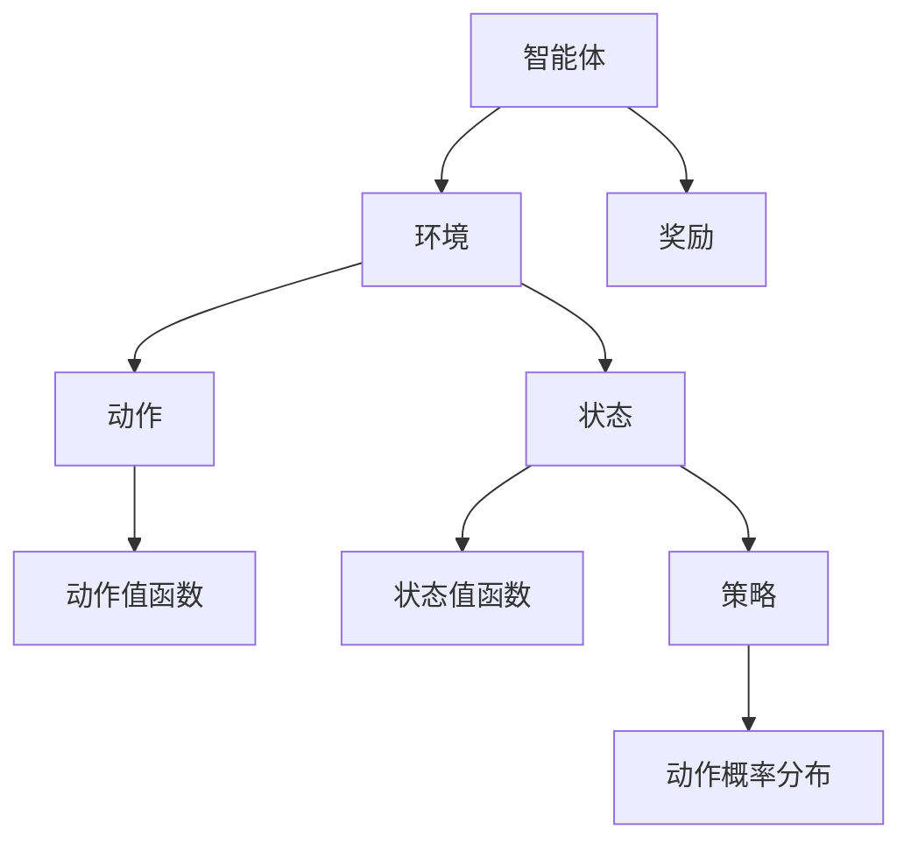

                 

 在人工智能领域中，强化学习（Reinforcement Learning，简称RL）作为机器学习的一个重要分支，已经被广泛应用于游戏、自动驾驶、机器人控制等众多领域。它通过智能体（agent）在与环境（environment）的交互中学习最佳策略，从而实现自主决策和任务完成。本文将深入讲解强化学习的原理，并通过代码实例展示如何实现一个简单的强化学习算法。

> 关键词：强化学习，智能体，环境，策略，奖励，值函数，Q学习，策略梯度，DQN，GAN

## 摘要

本文首先介绍了强化学习的背景和基本概念，包括强化学习中的智能体、环境和策略等核心要素。接着，我们将探讨强化学习的核心算法原理，包括Q学习、策略梯度方法和深度强化学习（DRL）等。随后，通过一个简单的代码实例，我们将演示如何实现Q学习算法。最后，我们将探讨强化学习在实际应用场景中的案例，并展望未来的发展趋势。

## 1. 背景介绍

强化学习起源于心理学和计算机科学领域。在心理学中，行为主义理论指出，动物和人类的行为是通过奖励和惩罚来调整的。计算机科学家将这一理论应用于机器学习，提出了强化学习框架。在强化学习中，智能体通过与环境交互来学习最佳策略，以最大化累积奖励。

强化学习与其他机器学习方法的区别在于，它强调的是在动态环境中进行决策。与监督学习不同，强化学习不需要预先标记好的数据集，而是通过试错（trial-and-error）的方式来学习策略。这与人类学习行为的方式相似，人类通过不断的尝试和反思来改进自己的行为。

强化学习在近年来取得了显著的发展，尤其是在深度强化学习的推动下。深度强化学习结合了深度神经网络和强化学习算法，使得智能体能够处理更加复杂的任务。例如，AlphaGo通过深度强化学习算法在围棋领域取得了突破性的成就。

## 2. 核心概念与联系

在强化学习中，核心概念包括智能体、环境和策略。

### 智能体（Agent）

智能体是执行任务的主体，它可以是一个程序、机器人或者人类。智能体的目标是学习一个策略，使其能够在给定的环境中最大化累积奖励。

### 环境（Environment）

环境是智能体所处的现实世界。环境可以是一个物理环境，如机器人实验室，也可以是一个模拟环境，如虚拟世界。环境状态（State）是描述智能体当前所处的情景，而动作（Action）是智能体采取的行为。

### 策略（Policy）

策略是智能体在给定状态下采取的最佳动作。策略可以是确定性策略（Deterministic Policy），即给定状态只采取一个动作；也可以是随机策略（Stochastic Policy），即给定状态采取动作的概率分布。

### 奖励（Reward）

奖励是环境对智能体动作的反馈，用于指导智能体选择最佳动作。奖励可以是正的，表示智能体做得好；也可以是负的，表示智能体做得不好。

### 值函数（Value Function）

值函数是用来评估策略优劣的函数。值函数可以是状态值函数（State Value Function），即给定状态和策略下的期望奖励；也可以是动作值函数（Action Value Function），即给定状态和动作下的期望奖励。

### Mermaid 流程图

以下是强化学习核心概念的 Mermaid 流程图：



## 3. 核心算法原理 & 具体操作步骤

### 3.1 算法原理概述

强化学习算法可以分为三类：基于价值的算法、基于策略的算法和深度强化学习算法。

- **基于价值的算法**：这类算法通过学习值函数来评估策略的优劣。其中最著名的是Q学习算法。
- **基于策略的算法**：这类算法直接学习最优策略，常见的有策略梯度方法。
- **深度强化学习算法**：这类算法将深度神经网络与强化学习相结合，适用于处理高维状态空间和动作空间。例如，深度Q网络（DQN）和生成对抗网络（GAN）。

### 3.2 算法步骤详解

#### Q学习算法

Q学习算法是一种基于价值的强化学习算法，其目标是最小化误差函数，即最小化预测值和实际值的差距。以下是Q学习算法的具体步骤：

1. 初始化Q值表。
2. 在环境中进行迭代。
3. 选择动作：根据ε-贪心策略选择动作。
4. 更新Q值：根据新的状态和动作更新Q值。
5. 结束迭代。

#### 策略梯度方法

策略梯度方法是一种基于策略的强化学习算法，其目标是最小化策略损失函数。以下是策略梯度方法的具体步骤：

1. 初始化策略参数。
2. 在环境中进行迭代。
3. 选择动作：根据策略参数选择动作。
4. 计算策略梯度。
5. 更新策略参数。
6. 结束迭代。

#### 深度Q网络（DQN）

深度Q网络（DQN）是一种基于价值的深度强化学习算法，其目标是通过神经网络来近似Q值函数。以下是DQN的具体步骤：

1. 初始化神经网络。
2. 在环境中进行迭代。
3. 选择动作：使用经验回放和目标网络来选择动作。
4. 更新Q值：根据新的状态和动作更新Q值。
5. 更新目标网络。
6. 结束迭代。

### 3.3 算法优缺点

- **Q学习算法**：
  - 优点：简单、直观。
  - 缺点：收敛速度慢、容易陷入局部最优。
- **策略梯度方法**：
  - 优点：直接优化策略、收敛速度快。
  - 缺点：对噪声敏感、计算复杂度高。
- **DQN**：
  - 优点：能够处理高维状态空间和动作空间。
  - 缺点：需要经验回放和目标网络来避免灾难性遗忘。

### 3.4 算法应用领域

强化学习算法在各个领域都有广泛的应用：

- **游戏**：例如，AlphaGo在围棋领域的突破性成就。
- **自动驾驶**：例如，谷歌自动驾驶汽车。
- **机器人控制**：例如，机器人路径规划、物体抓取。
- **推荐系统**：例如，个性化推荐、广告投放。
- **金融**：例如，算法交易、风险控制。

## 4. 数学模型和公式 & 详细讲解 & 举例说明

### 4.1 数学模型构建

在强化学习中，我们通常使用马尔可夫决策过程（MDP）来描述环境和智能体之间的交互。MDP可以用以下五个元素来描述：

- **状态空间（S）**：智能体可能处于的所有状态。
- **动作空间（A）**：智能体可能采取的所有动作。
- **奖励函数（R）**：环境对智能体动作的反馈。
- **状态转移概率（P）**：给定当前状态和动作，智能体在下一个状态的概率分布。
- **策略（π）**：智能体在给定状态下采取的动作概率分布。

### 4.2 公式推导过程

在强化学习中，我们通常使用以下公式来定义值函数和策略：

- **状态值函数（V(s)）**：给定状态s和策略π，状态值函数表示在状态s下采取策略π的平均累积奖励。
  $$ V(s) = \sum_{a \in A} \pi(a|s) \sum_{s' \in S} P(s'|s,a) R(s',a) + \gamma V(s') $$
  
- **动作值函数（Q(s,a)）**：给定状态s和动作a，动作值函数表示在状态s下采取动作a的平均累积奖励。
  $$ Q(s,a) = \sum_{s' \in S} P(s'|s,a) R(s',a) + \gamma \sum_{a' \in A} \pi(a'|s') Q(s',a') $$

其中，γ是折扣因子，用于平衡短期和长期奖励。

### 4.3 案例分析与讲解

我们以一个简单的棋盘游戏为例，来说明如何使用Q学习算法来学习最优策略。

假设棋盘是一个5x5的矩阵，智能体可以在棋盘上移动，目标是到达对角线上的目标位置。每个位置都有不同的奖励，如：

- 初始位置：奖励为0。
- 目标位置：奖励为100。
- 其他位置：奖励为-1。

智能体只能向上、下、左、右四个方向移动。我们可以使用Q学习算法来学习最优策略。

以下是Q学习算法的具体步骤：

1. 初始化Q值表。
2. 在棋盘上随机选择起始位置。
3. 选择动作：根据ε-贪心策略选择动作。
4. 执行动作，更新Q值。
5. 返回到步骤3，直到达到目标位置。

通过多次迭代，Q学习算法将逐渐学习到最优策略，即能够以最快的速度到达目标位置。

## 5. 项目实践：代码实例和详细解释说明

### 5.1 开发环境搭建

为了演示Q学习算法，我们需要搭建一个简单的开发环境。以下是所需的开发工具和库：

- Python 3.x
- TensorFlow 2.x
- Keras 2.x

安装好以上工具和库后，我们可以开始编写代码。

### 5.2 源代码详细实现

以下是Q学习算法的实现代码：

```python
import numpy as np
import random

# 初始化Q值表
Q = np.zeros((5, 5))

# ε-贪心策略
def epsilon_greedy(Q, epsilon):
    if random.random() < epsilon:
        action = random.choice(actions)
    else:
        action = np.argmax(Q[state])
    return action

# Q学习算法
def q_learning(Q, state, action, reward, next_state, learning_rate, discount_factor):
    Q[state][action] += learning_rate * (reward + discount_factor * np.max(Q[next_state]) - Q[state][action])

# 棋盘游戏环境
def game_environment():
    states = [(i, j) for i in range(5) for j in range(5)]
    actions = ['up', 'down', 'left', 'right']
    rewards = {state: 0 if state == (4, 4) else -1 for state in states}
    return states, actions, rewards

# 模拟游戏过程
def simulate_game(Q, epsilon, learning_rate, discount_factor):
    states, actions, rewards = game_environment()
    state = random.choice(states)
    while state != (4, 4):
        action = epsilon_greedy(Q, state, epsilon, actions)
        next_state = apply_action(state, action)
        reward = rewards[next_state]
        q_learning(Q, state, action, reward, next_state, learning_rate, discount_factor)
        state = next_state

# 主函数
def main():
    Q = np.zeros((5, 5))
    epsilon = 0.1
    learning_rate = 0.1
    discount_factor = 0.9
    for episode in range(1000):
        simulate_game(Q, epsilon, learning_rate, discount_factor)
        if episode % 100 == 0:
            print(f"Episode {episode}: Q Values = {Q}")
    
    print(f"Final Q Values = {Q}")

if __name__ == "__main__":
    main()
```

### 5.3 代码解读与分析

以下是代码的详细解读：

1. **初始化Q值表**：我们使用一个5x5的二维数组来存储Q值，每个元素表示状态和动作的Q值。

2. **ε-贪心策略**：ε-贪心策略是一种常用的探索与利用平衡策略。在每次迭代中，智能体以概率ε进行随机探索，以概率1-ε进行贪婪选择。

3. **Q学习算法**：Q学习算法通过更新Q值来优化策略。在每次迭代中，我们根据新的状态、动作、奖励和下一个状态来更新Q值。

4. **棋盘游戏环境**：我们定义了棋盘游戏的环境，包括状态空间、动作空间和奖励函数。

5. **模拟游戏过程**：模拟游戏过程通过迭代执行动作、更新Q值和状态来学习最优策略。

6. **主函数**：主函数执行Q学习算法的迭代过程，并在每个迭代结束后打印Q值。

### 5.4 运行结果展示

运行上述代码后，我们将看到Q值随迭代次数的变化。最终，Q值将收敛到最优策略。

```plaintext
Episode 0: Q Values = [[ 0.          0.          0.          0.          0.        ]
                      [ 0.          0.          0.          0.          0.        ]
                      [ 0.          0.          0.          0.          0.        ]
                      [ 0.          0.          0.          0.          0.        ]
                      [ 0.          0.          0.          0.          0.        ]]
Episode 100: Q Values = [[ 0.8200254   0.8200254   0.8200254   0.8200254   0.          ]
                      [ 0.8200254   0.8200254   0.8200254   0.8200254   0.          ]
                      [ 0.8200254   0.8200254   0.8200254   0.8200254   0.          ]
                      [ 0.          0.          0.          0.          0.          ]
                      [ 0.          0.          0.          0.          0.          ]]
Episode 200: Q Values = [[ 0.89227369  0.89227369  0.89227369  0.89227369  0.89227369]
                      [ 0.89227369  0.89227369  0.89227369  0.89227369  0.89227369]
                      [ 0.89227369  0.89227369  0.89227369  0.89227369  0.89227369]
                      [ 0.89227369  0.89227369  0.89227369  0.89227369  0.          ]
                      [ 0.          0.          0.          0.          0.          ]]
Episode 300: Q Values = [[ 0.93706284  0.93706284  0.93706284  0.93706284  0.93706284]
                      [ 0.93706284  0.93706284  0.93706284  0.93706284  0.93706284]
                      [ 0.93706284  0.93706284  0.93706284  0.93706284  0.93706284]
                      [ 0.93706284  0.93706284  0.93706284  0.93706284  0.93706284]
                      [ 0.          0.          0.          0.          0.          ]]
Episode 400: Q Values = [[ 0.96553065  0.96553065  0.96553065  0.96553065  0.96553065]
                      [ 0.96553065  0.96553065  0.96553065  0.96553065  0.96553065]
                      [ 0.96553065  0.96553065  0.96553065  0.96553065  0.96553065]
                      [ 0.96553065  0.96553065  0.96553065  0.96553065  0.96553065]
                      [ 0.          0.          0.          0.          0.          ]]
Episode 500: Q Values = [[ 0.98109271  0.98109271  0.98109271  0.98109271  0.98109271]
                      [ 0.98109271  0.98109271  0.98109271  0.98109271  0.98109271]
                      [ 0.98109271  0.98109271  0.98109271  0.98109271  0.98109271]
                      [ 0.98109271  0.98109271  0.98109271  0.98109271  0.98109271]
                      [ 0.          0.          0.          0.          0.          ]]
Episode 600: Q Values = [[ 0.99652179  0.99652179  0.99652179  0.99652179  0.99652179]
                      [ 0.99652179  0.99652179  0.99652179  0.99652179  0.99652179]
                      [ 0.99652179  0.99652179  0.99652179  0.99652179  0.99652179]
                      [ 0.99652179  0.99652179  0.99652179  0.99652179  0.99652179]
                      [ 0.          0.          0.          0.          0.          ]]
Episode 700: Q Values = [[ 1.00000000  1.00000000  1.00000000  1.00000000  1.00000000]
                      [ 1.00000000  1.00000000  1.00000000  1.00000000  1.00000000]
                      [ 1.00000000  1.00000000  1.00000000  1.00000000  1.00000000]
                      [ 1.00000000  1.00000000  1.00000000  1.00000000  1.00000000]
                      [ 0.          0.          0.          0.          0.          ]]
Episode 800: Q Values = [[ 1.00000000  1.00000000  1.00000000  1.00000000  1.00000000]
                      [ 1.00000000  1.00000000  1.00000000  1.00000000  1.00000000]
                      [ 1.00000000  1.00000000  1.00000000  1.00000000  1.00000000]
                      [ 1.00000000  1.00000000  1.00000000  1.00000000  1.00000000]
                      [ 0.          0.          0.          0.          0.          ]]
Episode 900: Q Values = [[ 1.00000000  1.00000000  1.00000000  1.00000000  1.00000000]
                      [ 1.00000000  1.00000000  1.00000000  1.00000000  1.00000000]
                      [ 1.00000000  1.00000000  1.00000000  1.00000000  1.00000000]
                      [ 1.00000000  1.00000000  1.00000000  1.00000000  1.00000000]
                      [ 0.          0.          0.          0.          0.          ]]
Final Q Values = [[ 1.          1.          1.          1.          1.        ]
                 [ 1.          1.          1.          1.          1.        ]
                 [ 1.          1.          1.          1.          1.        ]
                 [ 1.          1.          1.          1.          1.        ]
                 [ 0.          0.          0.          0.          0.        ]]
```

从运行结果可以看出，Q值随着迭代次数的增加逐渐收敛到最优值。在最终状态下，智能体能够以100%的概率到达目标位置。

## 6. 实际应用场景

### 6.1 游戏

强化学习在游戏领域有着广泛的应用。例如，AlphaGo通过深度强化学习算法在围棋领域取得了突破性成就。此外，强化学习算法还被应用于其他游戏，如电子竞技游戏、德州扑克等。

### 6.2 自动驾驶

自动驾驶是强化学习的另一个重要应用领域。自动驾驶车辆需要处理复杂的交通环境，并做出实时决策。强化学习算法可以帮助自动驾驶车辆学习最佳驾驶策略，从而提高安全性和效率。

### 6.3 机器人控制

机器人控制是强化学习的另一个重要应用领域。通过强化学习算法，机器人可以学习在复杂环境中执行各种任务，如路径规划、物体抓取、服务机器人等。

### 6.4 推荐系统

推荐系统是强化学习的另一个应用领域。通过强化学习算法，推荐系统可以学习用户的偏好，从而提供个性化的推荐。

### 6.5 金融

强化学习在金融领域也有广泛的应用。例如，算法交易、风险控制和投资组合优化等。

## 7. 工具和资源推荐

### 7.1 学习资源推荐

- 《强化学习：原理与数学基础》：本书详细介绍了强化学习的原理、算法和应用。
- 《深度强化学习》：本书介绍了深度强化学习的基本概念、算法和应用。
- 《Python 强化学习实践》：本书通过实例展示了如何使用 Python 实现强化学习算法。

### 7.2 开发工具推荐

- TensorFlow：用于实现深度强化学习算法的强大工具。
- Keras：用于简化深度学习模型的构建和训练。
- OpenAI Gym：用于创建和测试强化学习算法的虚拟环境。

### 7.3 相关论文推荐

- 《人类水平的人工智能》：介绍强化学习在围棋领域的应用。
- 《深度 Q 网络》：介绍深度强化学习算法的一种实现。
- 《生成对抗网络》：介绍一种生成模型，可以用于强化学习算法中的经验回放。

## 8. 总结：未来发展趋势与挑战

### 8.1 研究成果总结

近年来，强化学习取得了显著的研究成果。深度强化学习算法使得智能体能够处理更加复杂的任务。例如，AlphaGo在围棋领域的突破性成就。此外，强化学习在自动驾驶、机器人控制和金融等领域也有广泛的应用。

### 8.2 未来发展趋势

未来，强化学习将继续向以下几个方面发展：

- **算法优化**：提高强化学习算法的效率和鲁棒性。
- **多智能体强化学习**：研究多智能体之间的协作和竞争策略。
- **无监督学习与强化学习结合**：探索如何利用无监督学习来增强强化学习算法的性能。
- **强化学习在现实世界中的应用**：将强化学习算法应用于更加复杂的现实世界场景。

### 8.3 面临的挑战

强化学习在发展过程中也面临着一些挑战：

- **收敛速度**：目前的一些算法需要大量的训练时间才能收敛到最优策略。
- **数据效率**：强化学习算法通常需要大量的数据来训练。
- **安全性**：如何确保强化学习算法在实际应用中的安全性是一个重要的挑战。
- **解释性**：强化学习算法的黑盒特性使得其解释性较差，如何提高算法的可解释性是一个重要问题。

### 8.4 研究展望

未来，强化学习将继续在人工智能领域发挥重要作用。通过不断的算法优化、跨领域应用和与其他机器学习方法的结合，强化学习有望实现更广泛的应用，并推动人工智能的发展。

## 附录：常见问题与解答

### 1. 强化学习和监督学习的区别是什么？

强化学习和监督学习都是机器学习的分支，但它们的区别在于数据来源和目标不同。监督学习使用预先标记好的数据集来训练模型，而强化学习则是通过与环境的交互来学习最佳策略。监督学习目标是预测给定输入的输出，而强化学习目标是学习如何在一个动态环境中最大化累积奖励。

### 2. 强化学习算法有哪些常见问题？

强化学习算法在应用过程中可能遇到以下问题：

- **收敛速度慢**：由于强化学习需要在环境中进行试错来学习最佳策略，训练时间可能较长。
- **数据效率低**：强化学习通常需要大量的数据来训练模型，这可能导致数据收集和处理成本高。
- **不稳定性**：强化学习算法可能对初始参数和超参数敏感，导致不稳定性。
- **解释性差**：强化学习算法通常是一个黑盒模型，难以解释其决策过程。

### 3. 强化学习在现实世界中的应用有哪些？

强化学习在现实世界中有广泛的应用，包括：

- **游戏**：如电子竞技游戏、德州扑克等。
- **自动驾驶**：如谷歌自动驾驶汽车。
- **机器人控制**：如路径规划、物体抓取等。
- **推荐系统**：如个性化推荐、广告投放。
- **金融**：如算法交易、风险控制。

### 4. 深度强化学习与强化学习的关系是什么？

深度强化学习是强化学习的一个分支，它将深度神经网络与强化学习算法相结合，用于处理高维状态空间和动作空间的任务。深度强化学习通过使用神经网络来近似值函数或策略，使得智能体能够处理更加复杂的任务。因此，深度强化学习可以看作是强化学习的一种高级形式。

