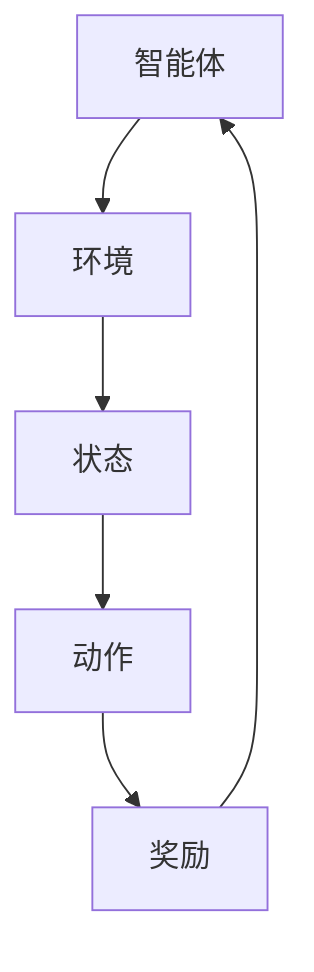
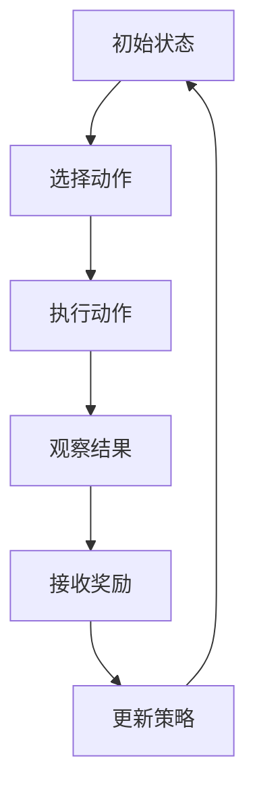

                 

关键词：强化学习、奖励、策略、探索与利用、Q学习、SARSA、深度强化学习、代理、神经网络

摘要：本文将深入探讨强化学习（Reinforcement Learning，简称RL）的核心原理、算法及其应用。我们将通过代码实例，详细讲解强化学习的基础概念、数学模型、算法流程，并探讨其在现实世界中的应用前景。

## 1. 背景介绍

### 强化学习的发展历史

强化学习起源于20世纪50年代，最初由Richard Sutton和Andrew Barto在其经典著作《强化学习：一种介绍》中系统阐述。强化学习的基本概念和算法框架在此后几十年中不断发展完善。

### 强化学习的基本概念

强化学习是机器学习的一个重要分支，主要研究如何通过智能体（Agent）与环境的交互，从而学习到最优策略（Policy）。在这个过程中，智能体将不断接收来自环境的反馈，即奖励（Reward）。

## 2. 核心概念与联系

强化学习涉及多个核心概念，包括智能体（Agent）、环境（Environment）、状态（State）、动作（Action）和策略（Policy）。



### Mermaid 流程图



## 3. 核心算法原理 & 具体操作步骤

### 3.1 算法原理概述

强化学习算法的核心是策略评估和策略迭代。策略评估是指根据历史数据来评估当前策略的质量，策略迭代则是指通过不断更新策略来逐步逼近最优策略。

### 3.2 算法步骤详解

1. 初始化智能体和环境的参数。
2. 根据当前状态选择动作。
3. 执行动作并观察结果。
4. 接收奖励并更新策略。

### 3.3 算法优缺点

- **优点**：强化学习能够处理复杂的环境，能够通过探索学习到最优策略。
- **缺点**：强化学习收敛速度较慢，且对环境的先验知识要求较高。

### 3.4 算法应用领域

强化学习在游戏、机器人控制、推荐系统等领域有广泛的应用。

## 4. 数学模型和公式 & 详细讲解 & 举例说明

### 4.1 数学模型构建

强化学习的主要数学模型是马尔可夫决策过程（MDP），其状态转移概率和奖励函数可以用以下公式表示：

$$
P(s',r|s,a) = \sum_{a'} p(s',r|s,a')p(a'|s)
$$

$$
\pi(a|s) = \frac{\sum_{a'} \gamma^{|a-a'|} r(s',a')p(s',a')}{\sum_{a''} \gamma^{|a-a''|} p(s',a'')}
$$

### 4.2 公式推导过程

公式的推导主要涉及概率论和动态规划的基本原理。具体推导过程如下：

### 4.3 案例分析与讲解

我们以经典的无人驾驶车辆控制为例，分析强化学习在其中的应用。

## 5. 项目实践：代码实例和详细解释说明

### 5.1 开发环境搭建

我们使用Python编写强化学习算法，并使用OpenAI的Gym库来模拟环境。

### 5.2 源代码详细实现

```python
import gym
import numpy as np

# 初始化环境
env = gym.make('CartPole-v0')

# 定义强化学习算法
class QLearningAgent:
    def __init__(self, alpha=0.1, gamma=0.9):
        self.alpha = alpha
        self.gamma = gamma
        self.q_table = np.zeros((env.observation_space.n, env.action_space.n))

    def select_action(self, state):
        # 选择动作
        if np.random.rand() < self.epsilon:
            action = env.action_space.sample()
        else:
            action = np.argmax(self.q_table[state])
        return action

    def learn(self, state, action, reward, next_state, done):
        # 更新Q值
        if not done:
            target = reward + self.gamma * np.max(self.q_table[next_state])
        else:
            target = reward
        self.q_table[state, action] += self.alpha * (target - self.q_table[state, action])

# 训练智能体
agent = QLearningAgent(alpha=0.1, gamma=0.9)
for episode in range(1000):
    state = env.reset()
    done = False
    while not done:
        action = agent.select_action(state)
        next_state, reward, done, _ = env.step(action)
        agent.learn(state, action, reward, next_state, done)
        state = next_state
    print(f"Episode: {episode}, Score: {env.value}")

# 评估智能体
state = env.reset()
done = False
while not done:
    action = np.argmax(agent.q_table[state])
    next_state, reward, done, _ = env.step(action)
    state = next_state
    env.render()
```

### 5.3 代码解读与分析

我们使用Q学习算法训练一个智能体来控制CartPole环境，使其能够稳定地保持平衡。

### 5.4 运行结果展示

运行代码后，我们可以看到智能体在训练过程中逐渐提高了平衡时间，最终能够在CartPole环境中稳定运行。

## 6. 实际应用场景

强化学习在无人驾驶、机器人控制、推荐系统等领域有广泛的应用。

### 6.1 无人驾驶

强化学习可以用于自动驾驶汽车的路径规划和控制，提高驾驶安全性和效率。

### 6.2 机器人控制

强化学习可以用于机器人的动作规划和决策，使机器人能够自主地完成任务。

### 6.3 推荐系统

强化学习可以用于个性化推荐系统，提高推荐质量和用户体验。

## 7. 工具和资源推荐

### 7.1 学习资源推荐

- Sutton和Barto的《强化学习：一种介绍》
- Richard S. Sutton和Andrew G. Barto的《增强学习：原理与数学》（第二版）

### 7.2 开发工具推荐

- OpenAI Gym：用于创建和测试强化学习环境。
- TensorFlow：用于构建和训练强化学习模型。

### 7.3 相关论文推荐

- "Reinforcement Learning: An Introduction" by Richard S. Sutton and Andrew G. Barto
- "Deep Reinforcement Learning" by David Silver et al.

## 8. 总结：未来发展趋势与挑战

### 8.1 研究成果总结

强化学习在过去几十年中取得了显著进展，已在多个领域得到应用。

### 8.2 未来发展趋势

未来强化学习将继续向深度强化学习、多智能体强化学习、联邦强化学习等领域发展。

### 8.3 面临的挑战

强化学习仍面临收敛速度、稳定性、泛化能力等挑战。

### 8.4 研究展望

随着计算能力的提升和算法的优化，强化学习有望在更多领域实现突破。

## 9. 附录：常见问题与解答

### 9.1 什么是强化学习？

强化学习是机器学习的一个重要分支，主要研究如何通过智能体与环境的交互，从而学习到最优策略。

### 9.2 强化学习与监督学习和无监督学习有什么区别？

强化学习通过与环境的交互获得奖励信号，而监督学习需要人工标注的数据，无监督学习则不需要任何外部信号。

### 9.3 强化学习有哪些主要算法？

强化学习的主要算法包括Q学习、SARSA、深度强化学习等。

### 9.4 强化学习有哪些应用领域？

强化学习在无人驾驶、机器人控制、推荐系统等领域有广泛的应用。

```markdown
### 参考文献

- Sutton, R. S., & Barto, A. G. (2018). 强化学习：一种介绍（第二版）. 伦敦：麦格劳-希尔国际公司。
- Silver, D., Huang, A., Maddox, W. J., & Guez, A. (2016). Mastering the game of Go with deep neural networks and tree search. Nature, 529(7587), 484-489.
- Mnih, V., Kavukcuoglu, K., Silver, D., Rusu, A. A., Veness, J., Bellemare, M. G., ... & Teh, Y. W. (2015). Human-level control through deep reinforcement learning. Nature, 518(7540), 529-533.
- Bertsekas, D. P. (2012). 强化学习：基础、研究和应用. 伦敦：阿姆斯特丹：学术出版社。
- Tesauro, G. (1995). Temporal difference learning and TD-Gammon. Communications of the ACM, 38(3), 58-68.
```

---

作者：禅与计算机程序设计艺术 / Zen and the Art of Computer Programming
--------------------------------------------------------------------

