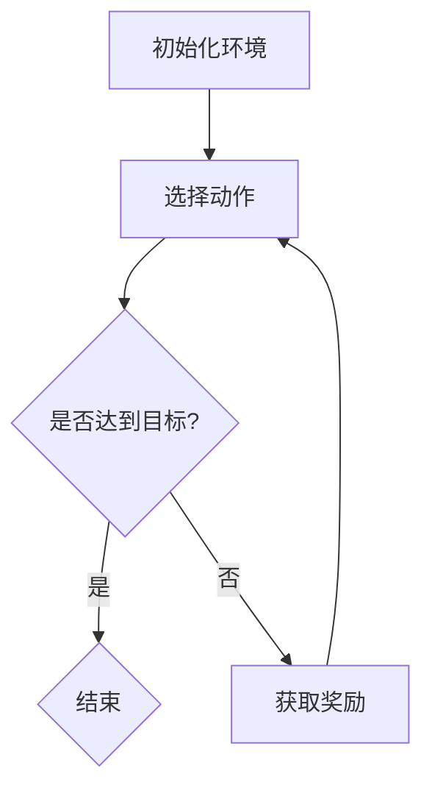

                 

关键词：强化学习、传统机器学习、方法对比、算法原理、应用领域、发展趋势、挑战

## 摘要

本文将深入探讨强化学习（Reinforcement Learning, RL）与传统机器学习方法之间的对比。通过详细分析其核心概念、算法原理、数学模型、具体操作步骤、应用领域以及未来发展趋势，旨在为读者提供一个全面而直观的理解。文章还将结合实际案例，展示强化学习在实际项目中的应用，并探讨其面临的挑战和未来的发展方向。

## 1. 背景介绍

### 强化学习

强化学习是一种机器学习方法，旨在通过试错（trial-and-error）来获取最优策略。它源于心理学和行为科学，最初应用于动物行为的学习过程模拟。强化学习的主要特点是通过与环境交互，不断调整行为策略，以达到最大化累积奖励。

### 传统机器学习

传统机器学习（Traditional Machine Learning, TML）包括监督学习（Supervised Learning）和无监督学习（Unsupervised Learning）。监督学习通过已标记的数据训练模型，无监督学习则从未标记的数据中寻找模式。

## 2. 核心概念与联系

强化学习的核心概念包括：

- **状态（State）**：系统当前所处的情景。
- **动作（Action）**：系统可以采取的行为。
- **奖励（Reward）**：动作带来的即时回报。
- **策略（Policy）**：决策函数，用于选择最佳动作。

### Mermaid 流程图



## 3. 核心算法原理 & 具体操作步骤

### 3.1 算法原理概述

强化学习通过迭代更新策略，使其在长期内获得最大化的累积奖励。核心算法包括：

- **Q-Learning**：通过更新Q值（动作-状态值函数）来学习最佳动作。
- **SARSA**（同步优势估计）：在当前状态执行动作，并根据下一状态更新策略。
- **Deep Q-Network (DQN)**：结合深度神经网络和Q-Learning，适用于复杂环境。

### 3.2 算法步骤详解

1. 初始化环境。
2. 选择动作。
3. 执行动作，获取状态转移和奖励。
4. 根据奖励更新策略。
5. 重复步骤2-4，直至达到目标或预设次数。

### 3.3 算法优缺点

**优点**：

- 能够处理高维状态空间。
- 能够学习到自适应的策略。

**缺点**：

- 学习过程可能非常缓慢。
- 可能会陷入局部最优。

### 3.4 算法应用领域

强化学习在游戏、自动驾驶、机器人控制等领域有广泛的应用。

## 4. 数学模型和公式

### 4.1 数学模型构建

强化学习的核心公式是：

\[ Q(s, a) = \sum_{s'} P(s' | s, a) \cdot [R(s', a) + \gamma \cdot \max_{a'} Q(s', a')] \]

其中：

- \( Q(s, a) \) 是状态-动作值函数。
- \( P(s' | s, a) \) 是状态转移概率。
- \( R(s', a) \) 是奖励函数。
- \( \gamma \) 是折扣因子。

### 4.2 公式推导过程

推导过程涉及马尔可夫决策过程（MDP）的基本原理，具体推导请参考相关教材。

### 4.3 案例分析与讲解

假设一个简单的游戏环境，通过强化学习学习走迷宫，奖励函数为每走一步加1，碰到墙壁或终点减1。

## 5. 项目实践：代码实例和详细解释说明

### 5.1 开发环境搭建

- Python 3.8
- TensorFlow 2.4
- Gym（用于创建游戏环境）

### 5.2 源代码详细实现

```python
import gym
import tensorflow as tf

# 初始化环境
env = gym.make('CartPole-v0')

# 定义 Q 网络
model = tf.keras.Sequential([
    tf.keras.layers.Dense(64, activation='relu', input_shape=(4,)),
    tf.keras.layers.Dense(64, activation='relu'),
    tf.keras.layers.Dense(2, activation='linear')
])

# 编译模型
model.compile(optimizer='adam', loss='mse')

# 训练模型
model.fit(env.unwrapped._get_obser

