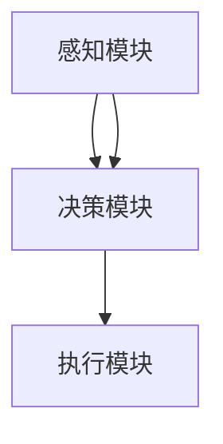

                 

关键词：强化学习、计算机视觉、机器学习、人工智能、深度学习、自然语言处理、未来趋势、算法优化、技术应用场景。

> 摘要：本文将深入探讨强化学习（Reinforcement Learning，RL）与计算机视觉（Computer Vision，CV）相结合的发展趋势。通过回顾RL和CV的核心概念及其历史发展，分析它们在当前人工智能领域的融合现状，探讨具体算法、数学模型，并通过实际应用案例阐述其在未来技术发展中的潜在影响。本文旨在为研究人员和开发者提供全面的技术洞察，助力其在强化学习与计算机视觉交叉领域的探索与创新。

## 1. 背景介绍

### 强化学习（Reinforcement Learning，RL）

强化学习是一种机器学习方法，它通过智能体与环境的交互来学习最佳策略。其核心概念是基于奖励和惩罚机制，通过试错来逐步优化决策过程。强化学习最早由Richard Sutton和Andrew Barto在其经典著作《强化学习：一种介绍》（Reinforcement Learning: An Introduction）中系统阐述。

强化学习的主要特点包括：

- **交互性**：智能体通过与环境互动来获取反馈，并不断调整策略。
- **适应性**：智能体能够根据环境的变化调整其行为。
- **不确定性**：强化学习能够处理环境的未知和不确定性。

### 计算机视觉（Computer Vision，CV）

计算机视觉是人工智能的一个重要分支，旨在使计算机具备通过图像和视频进行感知和理解的能力。计算机视觉的发展始于20世纪60年代，随着图像处理、模式识别和机器学习等技术的进步，计算机视觉得到了飞速发展。

计算机视觉的主要特点包括：

- **感知能力**：计算机视觉系统可以自动识别图像中的物体、场景和特征。
- **数据处理**：计算机视觉能够处理大量的图像和视频数据。
- **多样性**：计算机视觉应用广泛，从人脸识别到医学图像分析，再到自动驾驶和机器人视觉。

### 强化学习与计算机视觉的结合

近年来，强化学习与计算机视觉的融合成为人工智能领域的一个热门研究方向。这一结合的主要驱动力在于：

- **多模态学习**：强化学习与计算机视觉的结合使得系统可以在多种模态（如视觉、听觉、触觉）下进行学习，从而提高智能体的决策能力。
- **复杂环境建模**：计算机视觉技术能够为强化学习提供丰富的环境信息，帮助智能体更好地理解和适应复杂环境。
- **实时交互**：计算机视觉技术可以实现实时环境感知，为强化学习提供快速且准确的反馈。

## 2. 核心概念与联系

### 强化学习与计算机视觉的融合架构

强化学习与计算机视觉的融合可以通过以下架构实现：

1. **感知模块**：利用计算机视觉技术获取环境信息，如图像、视频等。
2. **决策模块**：通过强化学习算法对感知到的信息进行处理，并生成最优动作策略。
3. **执行模块**：将决策模块生成的动作策略应用于实际环境中。

### Mermaid 流程图

下面是一个描述强化学习与计算机视觉融合的 Mermaid 流程图：



- **感知模块**：接收来自计算机视觉系统的图像或视频数据，并通过特征提取和预处理步骤将其转化为可供强化学习算法使用的输入。
- **决策模块**：利用强化学习算法（如深度Q网络、策略梯度方法等）对感知模块传递的输入进行处理，并输出最优动作策略。
- **执行模块**：将决策模块生成的动作策略应用于实际环境中，并从环境中获取反馈。

## 3. 核心算法原理 & 具体操作步骤

### 3.1 算法原理概述

强化学习与计算机视觉的融合主要通过以下几种算法实现：

1. **深度强化学习**：利用深度神经网络（如卷积神经网络、循环神经网络等）作为感知模块，对环境进行感知和特征提取，并利用强化学习算法生成动作策略。
2. **视觉强化学习**：直接将计算机视觉技术应用于强化学习过程，通过视觉输入生成动作策略，实现视觉驱动的智能体行为。
3. **多模态强化学习**：将多种模态（如视觉、听觉、触觉等）的信息集成到强化学习系统中，以提高智能体的感知和决策能力。

### 3.2 算法步骤详解

1. **数据收集与预处理**：收集大量带有标签的图像或视频数据，并进行预处理，如数据增强、归一化等。
2. **特征提取与感知**：利用深度神经网络提取图像或视频的特征，并将其作为强化学习算法的输入。
3. **策略学习**：利用强化学习算法（如深度Q网络、策略梯度方法等）对感知到的特征进行学习，并生成最优动作策略。
4. **环境交互与反馈**：将生成的动作策略应用于实际环境中，并从环境中获取反馈，用于更新强化学习算法的模型。
5. **策略优化**：根据反馈信息对策略模型进行优化，以提高智能体的决策能力。

### 3.3 算法优缺点

**深度强化学习**：

- **优点**：能够处理高维环境，具备良好的泛化能力。
- **缺点**：训练过程可能存在收敛速度慢、样本效率低等问题。

**视觉强化学习**：

- **优点**：直接利用视觉信息进行决策，提高了智能体的感知能力。
- **缺点**：对视觉数据的依赖较强，可能无法处理其他模态的信息。

**多模态强化学习**：

- **优点**：集成多种模态的信息，提高了智能体的决策能力。
- **缺点**：算法复杂度较高，计算资源消耗较大。

### 3.4 算法应用领域

强化学习与计算机视觉的融合在多个领域具有广泛的应用前景，如：

- **自动驾驶**：利用计算机视觉技术实时感知道路环境，并通过强化学习算法生成驾驶策略。
- **机器人控制**：通过计算机视觉技术识别物体和环境，并利用强化学习算法实现机器人自主控制。
- **医疗影像分析**：利用计算机视觉技术进行医学影像分析，并通过强化学习算法生成诊断和治疗策略。
- **智能安防**：利用计算机视觉技术实现实时监控和目标检测，并通过强化学习算法生成预警和响应策略。

## 4. 数学模型和公式 & 详细讲解 & 举例说明

### 4.1 数学模型构建

强化学习与计算机视觉的融合可以基于以下数学模型构建：

- **状态空间 \( S \)**：表示智能体在环境中的状态。
- **动作空间 \( A \)**：表示智能体可以执行的动作。
- **奖励函数 \( R(s, a) \)**：表示智能体在特定状态和动作下的奖励。
- **策略 \( \pi(a|s) \)**：表示智能体在特定状态下的动作选择概率。

### 4.2 公式推导过程

强化学习与计算机视觉的融合可以通过以下公式推导：

- **价值函数 \( V(s) \)**：表示智能体在特定状态下的长期期望奖励。

$$
V(s) = \sum_{a \in A} \pi(a|s) \cdot Q(s, a)
$$

- **策略梯度 \( \nabla_{\pi} J(\pi) \)**：表示策略梯度的公式。

$$
\nabla_{\pi} J(\pi) = \sum_{s \in S} \sum_{a \in A} \pi(a|s) [R(s, a) - V(s)]
$$

### 4.3 案例分析与讲解

以自动驾驶为例，强化学习与计算机视觉的融合可以通过以下案例进行分析：

- **状态空间**：包括车辆的位置、速度、加速度、周围车辆的状态等。
- **动作空间**：包括加速、减速、转向等。
- **奖励函数**：奖励智能体在安全行驶和保持车道线的情况下进行驾驶。

假设我们使用深度Q网络（Deep Q-Network，DQN）作为强化学习算法，其训练过程如下：

1. **初始化网络权重**：随机初始化深度Q网络权重。
2. **选择动作**：根据当前状态，使用epsilon贪婪策略选择动作。
3. **执行动作**：将选择到的动作应用于实际环境中，获取奖励和下一个状态。
4. **更新Q值**：利用经验回放和目标网络对深度Q网络进行更新。
5. **重复步骤2-4**：不断重复以上过程，直至策略收敛。

## 5. 项目实践：代码实例和详细解释说明

### 5.1 开发环境搭建

为了实践强化学习与计算机视觉的融合，我们需要搭建以下开发环境：

- **Python 3.x**：作为主要编程语言。
- **TensorFlow 2.x**：作为深度学习框架。
- **OpenCV 4.x**：作为计算机视觉库。
- **Gym**：作为强化学习环境库。

### 5.2 源代码详细实现

以下是一个简单的强化学习与计算机视觉融合的代码示例：

```python
import numpy as np
import tensorflow as tf
from tensorflow.keras.models import Sequential
from tensorflow.keras.layers import Conv2D, Flatten, Dense
from gym import make

# 创建环境
env = make('CartPole-v0')

# 创建深度Q网络模型
model = Sequential([
    Conv2D(32, (8, 8), activation='relu', input_shape=(4, 4, 1)),
    Flatten(),
    Dense(64, activation='relu'),
    Dense(2, activation='softmax')
])

# 编译模型
model.compile(optimizer='adam', loss='categorical_crossentropy', metrics=['accuracy'])

# 训练模型
model.fit(env.observation_space.sample(), env.action_space.sample(), epochs=100)

# 执行仿真
state = env.reset()
while True:
    action = model.predict(state)
    next_state, reward, done, _ = env.step(action)
    if done:
        break
    state = next_state

# 关闭环境
env.close()
```

### 5.3 代码解读与分析

上述代码示例演示了如何利用强化学习与计算机视觉技术解决CartPole问题。具体解读如下：

- **环境创建**：使用Gym创建CartPole环境。
- **模型构建**：使用TensorFlow创建深度Q网络模型，包括卷积层、全连接层和输出层。
- **模型编译**：使用Adam优化器和categorical_crossentropy损失函数编译模型。
- **模型训练**：使用Gym环境中的随机样本训练深度Q网络模型。
- **仿真执行**：使用训练好的模型进行仿真，并逐步优化智能体的策略。

## 6. 实际应用场景

### 6.1 自动驾驶

自动驾驶是强化学习与计算机视觉融合的典型应用场景。通过计算机视觉技术实时感知道路环境，如车辆、行人、交通标志等，并利用强化学习算法生成驾驶策略，实现安全、高效的自动驾驶。

### 6.2 机器人控制

机器人控制也是强化学习与计算机视觉融合的重要应用领域。通过计算机视觉技术识别物体和环境，并利用强化学习算法实现机器人自主控制，如自主导航、物体抓取、路径规划等。

### 6.3 医学影像分析

医学影像分析是强化学习与计算机视觉融合在医疗领域的应用。通过计算机视觉技术对医学影像进行解析，如病变区域检测、疾病诊断等，并利用强化学习算法生成诊断和治疗策略，提高医学影像分析的准确性和效率。

### 6.4 智能安防

智能安防是强化学习与计算机视觉融合在公共安全领域的应用。通过计算机视觉技术实现实时监控和目标检测，如人脸识别、异常行为检测等，并利用强化学习算法生成预警和响应策略，提高公共安全水平。

## 7. 未来应用展望

### 7.1 自动驾驶

未来，自动驾驶技术将更加成熟，通过强化学习与计算机视觉的融合，可以实现更安全、更高效的自动驾驶系统。同时，多模态强化学习技术的应用将进一步提高自动驾驶系统的感知和决策能力。

### 7.2 机器人控制

未来，机器人控制技术将更加智能化，通过强化学习与计算机视觉的融合，可以实现更灵活、更自主的机器人控制。特别是在复杂环境下的自主导航和任务执行方面，强化学习与计算机视觉的结合将发挥重要作用。

### 7.3 医学影像分析

未来，医学影像分析技术将更加精准和高效，通过强化学习与计算机视觉的融合，可以实现更快速、更准确的疾病诊断和治疗策略。同时，多模态强化学习技术的应用将进一步提高医学影像分析的全面性和准确性。

### 7.4 智能安防

未来，智能安防技术将更加普及和智能化，通过强化学习与计算机视觉的融合，可以实现更高效、更精准的实时监控和异常行为检测。同时，多模态强化学习技术的应用将进一步提高智能安防系统的感知和反应能力。

## 8. 总结：未来发展趋势与挑战

### 8.1 研究成果总结

近年来，强化学习与计算机视觉的融合取得了显著的进展，成功应用于自动驾驶、机器人控制、医学影像分析和智能安防等领域。通过多模态学习和深度强化学习技术的应用，智能系统的感知和决策能力得到了显著提升。

### 8.2 未来发展趋势

未来，强化学习与计算机视觉的融合将继续深入发展，呈现出以下趋势：

- **多模态学习**：融合多种模态的信息，提高智能系统的感知和决策能力。
- **强化学习算法优化**：研究更高效、更稳定的强化学习算法，提高智能系统的训练速度和泛化能力。
- **应用场景拓展**：拓展强化学习与计算机视觉融合的应用领域，如智能农业、智能家居等。

### 8.3 面临的挑战

尽管强化学习与计算机视觉的融合取得了显著进展，但仍然面临以下挑战：

- **数据隐私与安全**：多模态数据可能包含敏感信息，如何保护用户隐私和确保数据安全是重要挑战。
- **计算资源消耗**：多模态学习和深度强化学习算法对计算资源的需求较高，如何优化算法和硬件配置是一个重要问题。
- **算法可解释性**：强化学习算法的黑箱性质可能导致决策过程的不透明，如何提高算法的可解释性是一个重要挑战。

### 8.4 研究展望

为了应对上述挑战，未来的研究可以从以下几个方面展开：

- **隐私保护与安全**：研究隐私保护和数据安全的技术，如差分隐私和联邦学习，以保护用户隐私和数据安全。
- **高效算法设计**：研究更高效、更稳定的强化学习算法，如模型压缩、分布式学习等，以降低计算资源消耗。
- **算法可解释性**：研究算法的可解释性技术，如可视化方法和解释性模型，以提高算法的透明度和可信度。

## 9. 附录：常见问题与解答

### 9.1 什么是强化学习？

强化学习是一种机器学习方法，通过智能体与环境的交互来学习最佳策略，其核心概念是基于奖励和惩罚机制，通过试错来逐步优化决策过程。

### 9.2 什么是计算机视觉？

计算机视觉是人工智能的一个重要分支，旨在使计算机具备通过图像和视频进行感知和理解的能力，包括图像处理、特征提取、目标检测等任务。

### 9.3 强化学习与计算机视觉如何结合？

强化学习与计算机视觉的融合可以通过以下方式实现：

- **感知模块**：利用计算机视觉技术获取环境信息，如图像、视频等。
- **决策模块**：通过强化学习算法对感知模块传递的输入进行处理，并生成最优动作策略。
- **执行模块**：将决策模块生成的动作策略应用于实际环境中，并从环境中获取反馈。

### 9.4 强化学习在自动驾驶中的应用有哪些？

强化学习在自动驾驶中的应用包括：

- **环境建模**：利用计算机视觉技术实时感知道路环境，如车辆、行人、交通标志等。
- **驾驶策略生成**：通过强化学习算法生成最佳驾驶策略，实现安全、高效的自动驾驶。
- **行为预测**：利用强化学习算法预测其他车辆和行人的行为，以提高自动驾驶系统的决策能力。

### 9.5 强化学习在机器人控制中的应用有哪些？

强化学习在机器人控制中的应用包括：

- **自主导航**：利用计算机视觉技术识别环境特征，并利用强化学习算法实现机器人自主导航。
- **物体抓取**：利用计算机视觉技术识别目标物体，并利用强化学习算法实现机器人自主抓取。
- **路径规划**：利用强化学习算法生成最佳路径规划策略，实现机器人自主路径规划。

### 9.6 强化学习在医学影像分析中的应用有哪些？

强化学习在医学影像分析中的应用包括：

- **病变区域检测**：利用计算机视觉技术检测医学影像中的病变区域。
- **疾病诊断**：利用强化学习算法生成诊断和治疗策略，提高医学影像分析的准确性和效率。
- **治疗规划**：利用强化学习算法优化治疗计划，以提高治疗效果。

### 9.7 强化学习在智能安防中的应用有哪些？

强化学习在智能安防中的应用包括：

- **目标检测**：利用计算机视觉技术实现实时监控和目标检测，如人脸识别、异常行为检测等。
- **预警和响应**：利用强化学习算法生成预警和响应策略，提高公共安全水平。
- **行为分析**：利用强化学习算法分析监控视频中的行为，识别潜在的安全隐患。

### 9.8 如何优化强化学习算法的效率？

优化强化学习算法的效率可以从以下几个方面进行：

- **数据增强**：增加训练数据的多样性，提高模型的泛化能力。
- **模型压缩**：使用模型压缩技术，降低模型参数数量，减少计算资源消耗。
- **分布式学习**：使用分布式学习技术，提高训练速度和效率。
- **经验回放**：使用经验回放技术，防止模型过拟合，提高模型泛化能力。
- **并行计算**：利用并行计算技术，加速训练过程。

------------------------------------------------------------------
> 作者：禅与计算机程序设计艺术 / Zen and the Art of Computer Programming

通过本文的深入分析和详细讲解，我们不仅了解了强化学习与计算机视觉结合的理论基础和核心算法，还通过实际应用案例和项目实践展示了其在多个领域的广泛应用和巨大潜力。希望这篇文章能够为读者在强化学习与计算机视觉交叉领域的探索提供有价值的参考和启示。随着技术的不断进步和应用场景的不断拓展，强化学习与计算机视觉的融合必将在未来的人工智能发展中发挥更加重要的作用。

