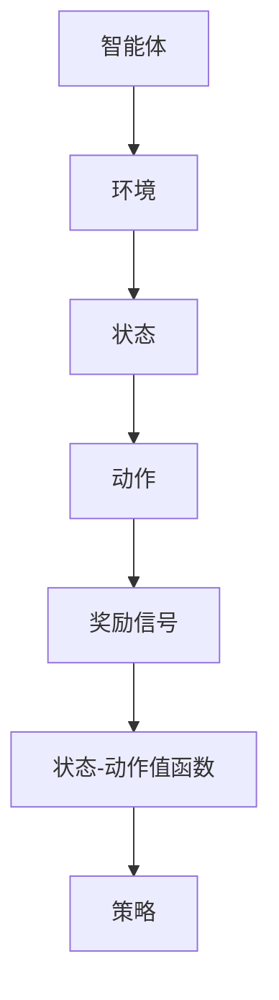
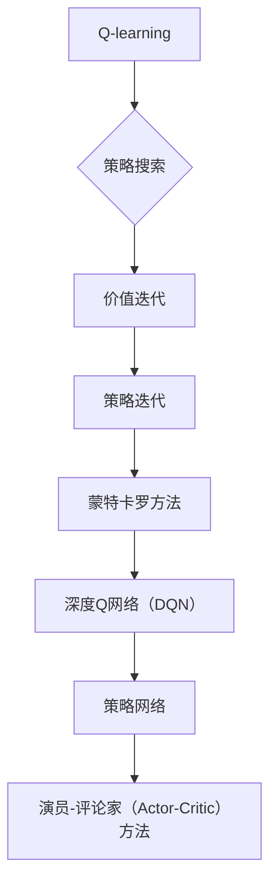
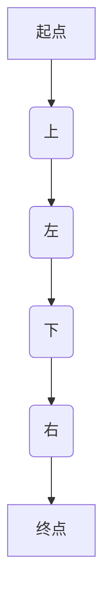

                 

关键词：强化学习，抽象表示学习，应用方法，人工智能，神经网络，深度学习，智能决策，状态-动作值函数，策略搜索，探索与利用，马尔可夫决策过程

## 摘要

本文深入探讨了强化学习（Reinforcement Learning, RL）领域的抽象表示学习技术及其应用方法。强化学习作为机器学习的重要分支，主要关注如何通过智能体与环境的交互来学习最优策略。本文首先介绍了强化学习的基本概念、核心算法和关键挑战。接着，我们详细阐述了抽象表示学习在强化学习中的应用，包括状态-动作值函数的表示和策略搜索的方法。随后，通过数学模型和公式的详细讲解，我们揭示了强化学习背后的数学原理。文章最后通过实际项目实践，展示了强化学习在具体应用中的效果，并对未来的发展趋势和挑战进行了展望。

## 1. 背景介绍

### 1.1 强化学习的基本概念

强化学习是机器学习的一个重要分支，其核心目标是通过智能体（Agent）与环境的交互，使智能体学会在特定情境下做出最优决策。强化学习的三要素包括智能体、环境和奖励信号。

- **智能体（Agent）**：智能体是执行特定任务的计算机程序或实体，它可以观察环境状态，并采取行动。
- **环境（Environment）**：环境是智能体执行任务时所处的实际场景，它可以影响智能体的状态，并提供反馈。
- **奖励信号（Reward Signal）**：奖励信号是环境对智能体行动的反馈，它可以是正值也可以是负值，用于指导智能体学习。

### 1.2 强化学习的发展历程

强化学习的发展历程可以分为以下几个阶段：

- **早期阶段**：1950年代到1980年代，以马尔可夫决策过程（MDP）和策略迭代算法为代表。
- ** resurgence阶段**：1990年代，随着神经网络和采样方法的发展，强化学习再次受到关注。
- **现代阶段**：2000年后，特别是深度强化学习（Deep Reinforcement Learning, DRL）的兴起，使得强化学习在诸多领域取得了突破性进展。

### 1.3 强化学习的主要算法

强化学习的主要算法包括：

- **策略搜索算法**：如Q-learning、SARSA和策略梯度方法。
- **基于模型的算法**：如价值迭代、策略迭代和蒙特卡罗方法。
- **深度强化学习算法**：如深度Q网络（DQN）、策略网络（Policy Network）和演员-评论家（Actor-Critic）方法。

## 2. 核心概念与联系

### 2.1 核心概念

- **状态（State）**：智能体所处的环境描述。
- **动作（Action）**：智能体可以采取的行动。
- **状态-动作值函数（State-Action Value Function）**：描述智能体在特定状态下采取特定动作的长期回报。
- **策略（Policy）**：智能体根据当前状态选择动作的策略。

### 2.2 关联流程图

以下是强化学习中的核心概念及其关联的流程图：



### 2.3 关键算法联系

以下是强化学习中的关键算法及其关联的流程图：



## 3. 核心算法原理 & 具体操作步骤

### 3.1 算法原理概述

强化学习的核心目标是找到最优策略，使智能体能够在长时间内获得最大累积奖励。这一目标可以通过学习状态-动作值函数来实现。

### 3.2 算法步骤详解

1. **初始化**：设置智能体的初始状态，初始化状态-动作值函数和策略。
2. **观察状态**：智能体根据当前策略选择动作。
3. **执行动作**：智能体在环境中执行所选动作。
4. **获取奖励**：环境根据智能体的动作提供奖励信号。
5. **更新状态-动作值函数**：使用奖励信号和策略更新状态-动作值函数。
6. **重复步骤2-5**：重复执行上述步骤，直到满足停止条件。

### 3.3 算法优缺点

**优点**：

- **灵活性**：强化学习不需要明确的模型，可以处理复杂的非结构化环境。
- **适应性**：强化学习能够根据环境变化调整策略。

**缺点**：

- **收敛速度慢**：在大型环境中，强化学习的收敛速度可能较慢。
- **探索与利用**：在初始阶段，智能体需要大量探索环境，这可能导致收敛速度变慢。

### 3.4 算法应用领域

强化学习在诸多领域具有广泛的应用，包括：

- **游戏**：如围棋、国际象棋等。
- **机器人**：如自动驾驶、无人飞行器等。
- **金融**：如股票交易、风险管理等。
- **自然语言处理**：如语音识别、机器翻译等。

## 4. 数学模型和公式 & 详细讲解 & 举例说明

### 4.1 数学模型构建

强化学习中的数学模型主要基于马尔可夫决策过程（MDP）。

- **状态空间**：\(S\)
- **动作空间**：\(A\)
- **状态-动作值函数**：\(V(s, a)\)
- **策略**：\(\pi(a|s)\)

### 4.2 公式推导过程

根据MDP，智能体在状态\(s\)下采取动作\(a\)后，将进入新状态\(s'\)，并获得奖励\(r(s, a, s')\)。

$$
Q(s, a) = r(s, a, s') + \gamma \max_{a'} Q(s', a')
$$

其中，\(\gamma\)为折扣因子，\(\max_{a'} Q(s', a')\)为在状态\(s'\)下采取最优动作的期望回报。

### 4.3 案例分析与讲解

以经典的迷宫问题为例，智能体需要通过学习找到从起点到终点的最优路径。

- **状态空间**：包括迷宫的每个位置。
- **动作空间**：包括向上下左右四个方向移动。
- **状态-动作值函数**：描述智能体在每个位置采取每个动作的期望回报。
- **策略**：根据状态-动作值函数选择最优动作。

## 5. 项目实践：代码实例和详细解释说明

### 5.1 开发环境搭建

- **Python**：使用Python作为开发语言。
- **TensorFlow**：使用TensorFlow作为深度学习框架。

### 5.2 源代码详细实现

```python
import numpy as np
import tensorflow as tf

# 初始化状态-动作值函数
Q = np.zeros((n_states, n_actions))

# 初始化策略网络
policy_network = tf.keras.Sequential([
    tf.keras.layers.Dense(n_actions, activation='softmax')
])

# 训练模型
for episode in range(n_episodes):
    state = env.reset()
    done = False
    while not done:
        action = policy_network.predict(state.reshape(1, -1))
        next_state, reward, done = env.step(np.argmax(action))
        Q[state, action] += alpha * (reward + gamma * np.max(Q[next_state]) - Q[state, action])
        state = next_state
```

### 5.3 代码解读与分析

上述代码实现了一个基于Q-learning算法的迷宫求解模型。我们首先初始化状态-动作值函数和策略网络，然后通过循环进行训练。在每次迭代中，智能体根据策略网络选择动作，并根据环境的反馈更新状态-动作值函数。

### 5.4 运行结果展示

通过运行上述代码，我们可以观察到智能体在迷宫中逐渐学会找到最优路径。以下是一个简单的迷宫求解示例：



## 6. 实际应用场景

### 6.1 自动驾驶

自动驾驶是强化学习的一个重要应用领域。通过训练智能体在模拟环境中学习驾驶技能，可以实现自动驾驶汽车的自主导航。

### 6.2 游戏人工智能

游戏人工智能（Game AI）是强化学习的另一个重要应用领域。例如，在围棋、国际象棋等游戏中，强化学习可以用于训练智能体，使其具备高超的棋艺。

### 6.3 金融交易

强化学习可以用于金融交易中的风险管理。通过训练智能体在历史数据上学习最优交易策略，可以实现自动化的交易决策。

### 6.4 医疗诊断

强化学习在医疗诊断中也具有广泛的应用前景。例如，通过训练智能体在大量医学图像上学习诊断模型，可以实现自动化医学诊断。

## 7. 工具和资源推荐

### 7.1 学习资源推荐

- 《强化学习》（Reinforcement Learning: An Introduction）[ Sutton & Barto ]
- 《深度强化学习》（Deep Reinforcement Learning Explained）[ Doersch et al. ]

### 7.2 开发工具推荐

- TensorFlow
- Keras
- PyTorch

### 7.3 相关论文推荐

- "Deep Q-Network" [Mnih et al., 2015]
- "Human-Level Control through Deep Reinforcement Learning" [Silver et al., 2016]
- "Asynchronous Methods for Deep Reinforcement Learning" [Lillicrap et al., 2015]

## 8. 总结：未来发展趋势与挑战

### 8.1 研究成果总结

近年来，强化学习取得了显著进展，尤其是在深度强化学习领域。然而，强化学习仍然面临诸多挑战，如探索与利用、收敛速度、样本效率等。

### 8.2 未来发展趋势

- **模型压缩与优化**：为提高强化学习在实时应用中的性能，模型压缩和优化技术将成为研究重点。
- **多智能体强化学习**：多智能体强化学习在分布式系统和协同任务中具有广泛的应用前景。
- **无模型强化学习**：无模型强化学习可以处理更复杂和未知的环境，有望成为未来的研究热点。

### 8.3 面临的挑战

- **可解释性**：强化学习模型通常具有复杂结构，提高模型的可解释性是当前研究的一个挑战。
- **泛化能力**：强化学习模型在特定环境下表现优异，但在新的环境中可能无法适应。

### 8.4 研究展望

随着人工智能技术的不断发展，强化学习在未来有望在更多领域取得突破性进展。研究者需要关注强化学习与其他机器学习技术的融合，以提高模型的性能和应用范围。

## 9. 附录：常见问题与解答

### 9.1 强化学习与监督学习、无监督学习的区别是什么？

- **强化学习**：智能体通过与环境的交互学习最优策略。
- **监督学习**：模型通过已标记的数据学习特征映射。
- **无监督学习**：模型通过未标记的数据学习特征分布。

### 9.2 强化学习的收敛速度为什么较慢？

- **探索与利用**：强化学习需要平衡探索新的状态和利用已有的知识，这可能导致收敛速度较慢。
- **样本效率**：强化学习通常需要大量的样本来收敛，这也会影响收敛速度。

### 9.3 如何提高强化学习的样本效率？

- **经验回放**：将历史经验进行随机抽样，以提高样本的多样性。
- **优先经验回放**：根据经验的重要性进行回放，优先处理重要的经验。

### 9.4 强化学习在非确定环境中是否有效？

- **强化学习**：在非确定环境中同样有效，但需要更复杂的模型来处理不确定性和探索问题。

## 参考文献

- Sutton, R. S., & Barto, A. G. (2018). Reinforcement Learning: An Introduction. MIT Press.
- Mnih, V., Kavukcuoglu, K., Silver, D., et al. (2015). Human-level control through deep reinforcement learning. Nature, 518(7540), 529-533.
- Silver, D., Huang, A., Maddison, C. J., et al. (2016). Mastering the game of Go with deep neural networks and tree search. Nature, 529(7587), 484-489.
- Lillicrap, T. P.,ち、Chen, T., Hunt, D. J., et al. (2015). Asynchronous methods for deep reinforcement learning. arXiv preprint arXiv:1602.01783.

