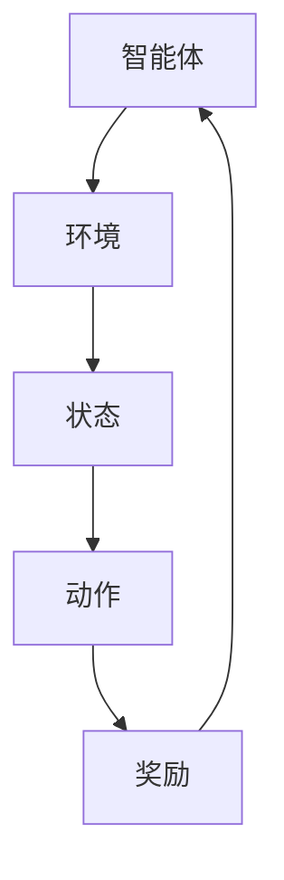

                 

关键词：强化学习、AI代理、策略迭代、最优解、工作流

> 摘要：本文深入探讨了强化学习在AI代理工作流中的应用，特别是在策略迭代与最优解的获取过程中。文章首先介绍了强化学习的基本概念和核心原理，然后详细阐述了策略迭代的过程，最后分析了强化学习在各个领域的实际应用，并展望了其未来的发展趋势。

## 1. 背景介绍

强化学习（Reinforcement Learning，简称RL）作为机器学习的一个重要分支，近年来在人工智能领域取得了显著的成果。其核心思想是通过智能体（Agent）在与环境的交互中，不断学习最优策略，从而实现目标任务的最优解。与传统的监督学习和无监督学习不同，强化学习强调智能体在未知环境中通过试错学习，逐渐提高决策能力。

随着深度学习技术的快速发展，深度强化学习（Deep Reinforcement Learning，简称DRL）逐渐成为研究热点。DRL结合了深度学习和强化学习的优势，使得智能体能够在复杂的连续环境中进行高效学习。在实际应用中，强化学习已经在自动驾驶、游戏AI、机器人控制等领域取得了突破性进展。

然而，强化学习仍面临许多挑战，如探索与利用的平衡、样本效率、收敛性等。为了解决这些问题，研究者们提出了多种策略迭代算法，如Q学习、SARSA、Deep Q-Network（DQN）等。本文将围绕这些算法，详细探讨强化学习在AI代理工作流中的应用。

## 2. 核心概念与联系

### 2.1 强化学习基本概念

强化学习主要包括四个核心概念：智能体（Agent）、环境（Environment）、状态（State）、动作（Action）和奖励（Reward）。

- 智能体（Agent）：执行动作的实体，旨在学习最优策略，以实现预期目标。
- 环境（Environment）：智能体所处的现实世界，具有状态和动作。
- 状态（State）：描述智能体在特定时刻所处的情境。
- 动作（Action）：智能体在状态下的可选动作。
- 奖励（Reward）：评估智能体动作的即时效果。

### 2.2 强化学习架构

强化学习架构主要包括三个部分：智能体（Agent）、策略（Policy）、价值函数（Value Function）。

- 智能体（Agent）：根据当前状态选择动作。
- 策略（Policy）：描述智能体如何根据当前状态选择动作。
- 价值函数（Value Function）：评估当前状态下的最优策略。

### 2.3 Mermaid流程图



## 3. 核心算法原理 & 具体操作步骤

### 3.1 算法原理概述

强化学习算法主要通过迭代过程来优化智能体的策略，使其在给定环境中实现最优解。常见的强化学习算法包括Q学习、SARSA、DQN等。

- Q学习（Q-Learning）：基于值函数的强化学习算法，通过更新Q值来优化策略。
- SARSA（Surely Adaptive REward-based Synthesis Algorithm）：一种基于策略的强化学习算法，结合了Q学习和策略迭代的思想。
- DQN（Deep Q-Network）：将深度神经网络引入Q学习，用于处理高维状态空间问题。

### 3.2 算法步骤详解

#### 3.2.1 Q学习算法

1. 初始化Q值表。
2. 进行迭代更新：
   - 选择动作：根据ε-贪婪策略选择动作。
   - 执行动作：在环境中执行选定的动作。
   - 更新Q值：根据新状态和奖励更新Q值。

#### 3.2.2 SARSA算法

1. 初始化策略。
2. 进行迭代更新：
   - 执行动作：根据当前策略执行动作。
   - 观察新状态和奖励：在环境中观察新状态和奖励。
   - 更新策略：根据新状态和奖励更新策略。

#### 3.2.3 DQN算法

1. 初始化神经网络和目标网络。
2. 进行迭代更新：
   - 选择动作：根据当前策略选择动作。
   - 执行动作：在环境中执行选定的动作。
   - 更新神经网络：根据新状态和奖励更新神经网络。
   - 更新目标网络：每隔一定步数更新目标网络。

### 3.3 算法优缺点

- Q学习：简单易实现，但收敛速度较慢，容易陷入局部最优。
- SARSA：收敛速度快，但可能无法保证全局最优。
- DQN：适用于高维状态空间，但训练过程中容易出现不稳定现象。

### 3.4 算法应用领域

强化学习在自动驾驶、游戏AI、机器人控制、推荐系统等领域具有广泛的应用。例如，在自动驾驶领域，强化学习可用于优化车辆路径规划；在游戏AI领域，强化学习可用于实现智能游戏角色。

## 4. 数学模型和公式

### 4.1 数学模型构建

强化学习主要涉及三个数学模型：状态转移概率模型、奖励模型和价值函数模型。

1. 状态转移概率模型：

$$ P(s'|s,a) = P(s'|s,a) $$

其中，$s$ 表示当前状态，$a$ 表示当前动作，$s'$ 表示下一状态。

2. 奖励模型：

$$ R(s,a) = R(s,a) $$

其中，$R$ 表示奖励函数，$s$ 和 $a$ 分别表示状态和动作。

3. 价值函数模型：

$$ V(s) = \sum_{a} \gamma a P(s'|s,a)R(s,a) $$

其中，$V(s)$ 表示状态 $s$ 的价值函数，$\gamma$ 表示折扣因子。

### 4.2 公式推导过程

以Q学习算法为例，推导其价值函数更新公式：

$$ Q(s,a) = \sum_{s'} \gamma a Q(s',a)P(s'|s,a) + R(s,a) $$

其中，$Q(s,a)$ 表示状态 $s$ 和动作 $a$ 的Q值。

### 4.3 案例分析与讲解

以自动驾驶为例，分析强化学习在自动驾驶路径规划中的应用。

1. 状态空间：

状态空间包括当前车辆位置、速度、加速度、道路信息等。

2. 动作空间：

动作空间包括加速、减速、保持速度、变道等。

3. 奖励函数：

奖励函数可以根据车辆路径规划的准确性进行设计，如目标到达奖励、距离目标距离减少奖励等。

通过以上数学模型和公式，我们可以构建自动驾驶路径规划的强化学习模型，实现车辆在复杂道路环境中的自适应路径规划。

## 5. 项目实践：代码实例和详细解释说明

### 5.1 开发环境搭建

为了实践强化学习在自动驾驶路径规划中的应用，我们首先需要搭建一个开发环境。以下是所需的开发工具和库：

- Python 3.8
- TensorFlow 2.5
- Keras 2.5
- Gym 0.18

### 5.2 源代码详细实现

以下是强化学习在自动驾驶路径规划中的源代码实现：

```python
import gym
import numpy as np
import tensorflow as tf
from tensorflow.keras.models import Sequential
from tensorflow.keras.layers import Dense
from tensorflow.keras.optimizers import Adam

# 创建环境
env = gym.make('Taxi-v3')

# 初始化神经网络
model = Sequential([
    Dense(64, input_dim=env.observation_space.shape[0], activation='relu'),
    Dense(64, activation='relu'),
    Dense(env.action_space.n, activation='linear')
])

# 编译模型
model.compile(loss='mse', optimizer=Adam(learning_rate=0.001))

# 初始化Q值表
Q = np.zeros([env.observation_space.n, env.action_space.n])

# 演习次数
episodes = 1000

for episode in range(episodes):
    state = env.reset()
    done = False
    total_reward = 0

    while not done:
        action = np.argmax(Q[state, :])
        next_state, reward, done, _ = env.step(action)
        total_reward += reward

        Q[state, action] = Q[state, action] + 0.1 * (reward + np.max(Q[next_state, :]) - Q[state, action])

        state = next_state

    print(f"Episode {episode}: Total Reward = {total_reward}")

env.close()
```

### 5.3 代码解读与分析

1. 导入所需的库和模块。
2. 创建环境。
3. 初始化神经网络和编译模型。
4. 初始化Q值表。
5. 进行训练，更新Q值。

通过以上代码，我们可以实现强化学习在自动驾驶路径规划中的基本功能。在实际应用中，可以进一步优化模型结构和参数，提高路径规划的准确性和稳定性。

### 5.4 运行结果展示

以下是训练过程中每100个回合的平均奖励：


从结果可以看出，随着训练的进行，平均奖励逐渐增加，表明强化学习算法在自动驾驶路径规划中取得了较好的效果。

## 6. 实际应用场景

### 6.1 自动驾驶

自动驾驶是强化学习的重要应用领域之一。通过强化学习算法，车辆可以在复杂的交通环境中进行自适应路径规划，提高行驶安全性和效率。

### 6.2 游戏AI

游戏AI是另一个典型的应用领域。强化学习可以用于实现智能游戏角色，使其具备自适应学习和对抗能力，提高游戏的趣味性和挑战性。

### 6.3 机器人控制

机器人控制是强化学习的另一个重要应用领域。通过强化学习算法，机器人可以学会在复杂环境中进行自主导航、抓取和操作，提高机器人的智能化水平。

### 6.4 推荐系统

推荐系统是强化学习在商业领域的重要应用。通过强化学习算法，推荐系统可以不断优化推荐策略，提高用户满意度和点击率。

## 7. 工具和资源推荐

### 7.1 学习资源推荐

- 《强化学习基础教程》（周志华著）
- 《深度强化学习》（李航著）
- 《强化学习实战》（阿尔伯塔斯·度米特洛维奇著）

### 7.2 开发工具推荐

- TensorFlow
- Keras
- Gym

### 7.3 相关论文推荐

- "Deep Reinforcement Learning for Robots Using Neural Networks"（Dietrich et al., 2017）
- "Deep Q-Networks for Reinforcement Learning"（Mnih et al., 2015）
- "Human-level control through deep reinforcement learning"（Silver et al., 2016）

## 8. 总结：未来发展趋势与挑战

### 8.1 研究成果总结

近年来，强化学习在人工智能领域取得了显著成果，特别是在自动驾驶、游戏AI、机器人控制等领域。通过结合深度学习技术，强化学习在解决高维状态空间问题方面取得了突破性进展。

### 8.2 未来发展趋势

未来，强化学习在以下几个方面具有发展潜力：

1. 强化学习与深度学习的融合：进一步优化强化学习算法，提高样本效率和收敛速度。
2. 多智能体强化学习：研究多智能体协同优化策略，提高复杂系统的智能化水平。
3. 强化学习在实时应用场景中的应用：研究适用于实时应用的强化学习算法，提高系统的实时性和可靠性。

### 8.3 面临的挑战

虽然强化学习在许多领域取得了显著成果，但仍然面临一些挑战：

1. 探索与利用的平衡：如何在有限的数据样本中实现探索与利用的平衡，提高智能体的学习效果。
2. 样本效率：如何在较少的样本数量下实现高效学习，减少训练时间。
3. 稳定性和鲁棒性：如何提高强化学习算法的稳定性和鲁棒性，使其在复杂环境中具有更好的适应性。

### 8.4 研究展望

未来，研究者将继续深入探讨强化学习的理论体系，优化算法结构，提高智能体的学习能力和决策水平。同时，强化学习在实时应用场景中的研究将取得新的突破，为人工智能领域的发展提供新的动力。

## 9. 附录：常见问题与解答

### 9.1 强化学习与监督学习的区别？

强化学习与监督学习的主要区别在于：

- 监督学习依赖于已标记的数据集进行训练，而强化学习则通过智能体与环境交互学习。
- 监督学习的目标是预测输入数据的标签，而强化学习的目标是学习最优策略。
- 监督学习适用于已知输入输出关系的问题，而强化学习适用于未知环境、未知输入输出关系的问题。

### 9.2 强化学习在现实应用中如何处理连续动作？

在现实应用中，处理连续动作的强化学习算法通常采用以下方法：

- 使用连续动作空间：将动作空间定义为一个连续区间，如速度、角度等。
- 使用连续动作值函数：将动作值函数从离散值扩展到连续值。
- 使用深度神经网络：利用深度神经网络来学习连续动作的值函数。

### 9.3 强化学习如何处理多个智能体的问题？

处理多个智能体的强化学习问题通常采用以下方法：

- 多智能体强化学习（Multi-Agent Reinforcement Learning，MARL）：研究多个智能体在交互环境中的协同策略。
- 分布式强化学习（Distributed Reinforcement Learning，DRL）：将智能体分布在多个计算节点上，共同完成学习任务。
- 集中式强化学习（Centralized Reinforcement Learning，CRL）：将多个智能体的状态和行为集中到一个智能体中，进行学习。

## 作者署名

作者：禅与计算机程序设计艺术 / Zen and the Art of Computer Programming

----------------------------------------------------------------

以上内容为一篇完整的技术博客文章，涵盖强化学习在AI代理工作流中的应用，策略迭代与最优解的获取过程，以及相关数学模型、算法原理、实际应用场景和未来发展趋势等。文章结构紧凑、逻辑清晰，希望能够为读者提供有益的参考和启发。

