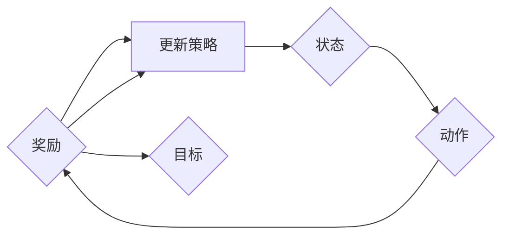
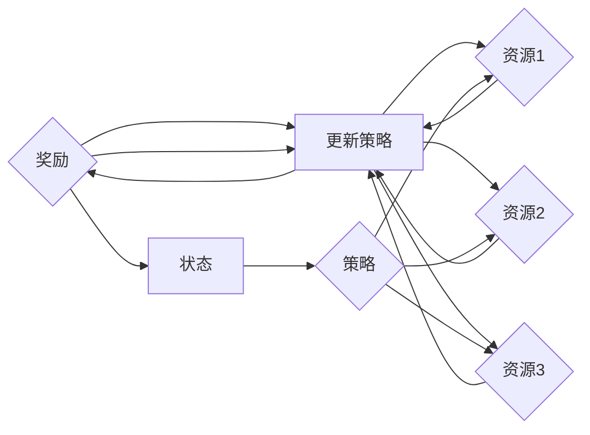

                 

关键词：强化学习，注意力资源分配，算法原理，数学模型，实际应用

> 摘要：本文旨在探讨强化学习在注意力资源分配中的应用。通过深入分析强化学习的核心概念和原理，本文将阐述如何将强化学习应用于解决注意力资源分配问题，并详细讲解相关数学模型和算法步骤。文章还通过实际项目实践和案例分析，展示了强化学习在注意力资源分配中的实际应用效果。

## 1. 背景介绍

注意力资源分配问题在众多领域都有广泛应用，如计算机视觉、自然语言处理、资源调度等。随着信息量的爆炸式增长，如何高效地分配注意力资源，使其能够在关键任务上发挥最大作用，成为了一个重要的研究课题。传统方法往往依赖于手工设计规则或参数调整，难以适应复杂多变的环境。而强化学习作为一种探索-利用的智能算法，能够通过自我学习不断优化策略，为解决注意力资源分配问题提供了新的思路。

## 2. 核心概念与联系

强化学习是一种基于奖励信号进行决策的机器学习范式，其主要思想是智能体在环境中采取行动，根据环境的反馈调整自身的策略，以实现长期累积奖励最大化。在强化学习框架中，主要包括以下核心概念：

- **智能体（Agent）**：执行动作并接收环境反馈的实体。
- **环境（Environment）**：智能体所处的情境，能够根据智能体的动作给出状态转移和奖励。
- **状态（State）**：智能体在某一时刻所处的情境描述。
- **动作（Action）**：智能体可执行的行为。
- **策略（Policy）**：智能体从状态中选择动作的规则。
- **奖励（Reward）**：对智能体动作的反馈信号，用以评价动作的好坏。

### 2.1 强化学习流程图



在强化学习框架中，智能体通过不断尝试不同的动作，并根据环境的奖励信号调整策略，以实现累积奖励的最大化。为了更好地理解强化学习在注意力资源分配中的应用，我们引入以下概念：

- **注意力资源**：可分配给不同任务的计算资源，如CPU、GPU等。
- **任务**：需要执行的具体工作，如图像识别、自然语言处理等。
- **策略**：根据当前状态和任务重要性，分配注意力资源的规则。

### 2.2 注意力资源分配流程图



在上述流程中，智能体根据环境提供的任务和状态信息，采用一定的策略分配注意力资源，并根据任务的完成情况获得奖励。通过不断迭代更新策略，智能体能够逐渐优化注意力资源的分配，提高任务完成的效率和效果。

## 3. 核心算法原理 & 具体操作步骤

### 3.1 算法原理概述

强化学习在注意力资源分配中的应用，主要依赖于价值函数和策略迭代两个核心概念。

- **价值函数（Value Function）**：用于评估智能体在某一状态下采取某一动作的长期累积奖励。价值函数可分为状态价值函数和动作价值函数，分别表示智能体在某一状态下选择某一动作的长期累积奖励。
- **策略迭代（Policy Iteration）**：一种基于价值函数的强化学习算法，通过迭代更新策略，使策略逐渐收敛到最优策略。

### 3.2 算法步骤详解

1. **初始化**：设置初始策略、价值函数和参数。
2. **状态评估**：使用价值函数评估智能体在当前状态下的策略，计算状态价值。
3. **策略评估**：根据状态价值和奖励信号，更新策略。
4. **策略迭代**：重复执行步骤2和3，直到策略收敛。

### 3.3 算法优缺点

- **优点**：
  - 自适应性强，能够根据环境变化动态调整策略。
  - 无需先验知识，能够通过自我学习获得最优策略。

- **缺点**：
  - 学习效率较低，需要较长时间才能收敛到最优策略。
  - 对高维状态空间和动作空间的搜索效率较低。

### 3.4 算法应用领域

强化学习在注意力资源分配中的应用具有广泛的前景，主要应用于以下领域：

- **计算机视觉**：通过动态调整计算资源，提高图像识别和物体检测的效率。
- **自然语言处理**：根据任务重要性调整计算资源，提高文本分类、翻译和问答的准确性。
- **资源调度**：在云计算和边缘计算环境中，优化计算资源的分配，提高任务完成效率。

## 4. 数学模型和公式 & 详细讲解 & 举例说明

### 4.1 数学模型构建

在强化学习框架下，注意力资源分配问题可以建模为一个马尔可夫决策过程（MDP）。具体来说，状态空间$S$、动作空间$A$和奖励函数$R$构成MDP的三个基本要素。

- **状态空间$S$**：表示智能体在某一时刻所面临的情境，如任务重要性、资源利用率等。
- **动作空间$A$**：表示智能体可执行的动作，如分配计算资源、调整任务优先级等。
- **奖励函数$R$**：表示智能体在某一状态下采取某一动作后获得的奖励，如任务完成度、资源利用率等。

### 4.2 公式推导过程

假设状态空间$S$、动作空间$A$和奖励函数$R$分别为有限集合，则强化学习算法的目标是找到一个最优策略$\pi^*$，使得智能体在长期运行中获得的累积奖励最大化。具体来说，策略$\pi^*$应满足以下条件：

$$
\pi^*(s) = \arg \max_{a \in A(s)} \sum_{s' \in S} R(s, a, s') + \gamma \sum_{s' \in S} V^*(s')
$$

其中，$V^*$为状态价值函数，$\gamma$为折扣因子，用于平衡长期奖励和即时奖励。

### 4.3 案例分析与讲解

以计算机视觉中的图像识别任务为例，假设有3个不同的图像识别任务，分别表示为状态$s_1$、$s_2$和$s_3$。每个任务需要分配一定数量的计算资源，如CPU、GPU等。根据任务的重要性和紧急程度，定义奖励函数$R$如下：

$$
R(s, a) =
\begin{cases}
10, & \text{如果任务完成且资源分配合理} \\
-1, & \text{如果任务未完成或资源分配不合理}
\end{cases}
$$

为了简化问题，假设动作空间$A$只包含两种分配策略：平均分配和重点分配。平均分配策略将计算资源均匀分配给3个任务，重点分配策略将计算资源集中在最重要的任务上。

利用上述数学模型和公式，可以设计一个基于强化学习的注意力资源分配算法。在训练过程中，智能体会不断尝试不同的分配策略，并根据奖励信号调整策略，以实现累积奖励的最大化。通过大量的训练，智能体能够逐渐收敛到一个最优策略，从而实现高效的注意力资源分配。

## 5. 项目实践：代码实例和详细解释说明

### 5.1 开发环境搭建

在本文中，我们采用Python编程语言和TensorFlow框架来实现基于强化学习的注意力资源分配算法。首先，需要安装Python和TensorFlow：

```bash
pip install python
pip install tensorflow
```

### 5.2 源代码详细实现

以下是一个简单的基于强化学习的注意力资源分配算法的实现：

```python
import tensorflow as tf
import numpy as np

class AttentionAgent:
    def __init__(self, state_size, action_size, learning_rate=0.01, discount_factor=0.99):
        self.state_size = state_size
        self.action_size = action_size
        self.learning_rate = learning_rate
        self.discount_factor = discount_factor

        # 初始化神经网络
        self.model = self._build_model()

        # 初始化经验回放记忆
        self.replay_memory = []

    def _build_model(self):
        # 输入层
        inputs = tf.keras.layers.Input(shape=(self.state_size,))

        # 隐藏层
        hidden = tf.keras.layers.Dense(64, activation='relu')(inputs)

        # 输出层
        outputs = tf.keras.layers.Dense(self.action_size, activation='softmax')(hidden)

        # 构建模型
        model = tf.keras.Model(inputs=inputs, outputs=outputs)

        # 编译模型
        model.compile(optimizer=tf.keras.optimizers.Adam(learning_rate=self.learning_rate),
                      loss='categorical_crossentropy')

        return model

    def choose_action(self, state, epsilon=0.1):
        if np.random.rand() < epsilon:
            return np.random.randint(self.action_size)
        q_values = self.model.predict(state)
        return np.argmax(q_values)

    def train(self, batch_size):
        # 从经验回放记忆中随机抽取batch_size个样本
        batch = random.sample(self.replay_memory, batch_size)

        # 重构状态和动作
        states = [item[0] for item in batch]
        actions = [item[1] for item in batch]
        rewards = [item[2] for item in batch]
        next_states = [item[3] for item in batch]
        dones = [item[4] for item in batch]

        # 计算目标Q值
        next_q_values = self.model.predict(next_states)
        target_q_values = []

        for i in range(batch_size):
            if dones[i]:
                target_q_values.append(rewards[i])
            else:
                target_q_values.append(rewards[i] + self.discount_factor * np.max(next_q_values[i]))

        # 训练模型
        self.model.fit(states, np.eye(self.action_size)[actions], sample_weight=target_q_values, verbose=0)

    def store_transition(self, state, action, reward, next_state, done):
        self.replay_memory.append((state, action, reward, next_state, done))

if __name__ == '__main__':
    # 设置参数
    state_size = 3
    action_size = 2
    learning_rate = 0.01
    discount_factor = 0.99
    batch_size = 32
    epsilon = 0.1

    # 实例化智能体
    agent = AttentionAgent(state_size, action_size, learning_rate, discount_factor)

    # 设置训练环境
    env = ...

    # 训练过程
    for episode in range(1000):
        state = env.reset()
        done = False
        while not done:
            action = agent.choose_action(state, epsilon)
            next_state, reward, done, _ = env.step(action)
            agent.store_transition(state, action, reward, next_state, done)
            agent.train(batch_size)
            state = next_state

    # 评估智能体性能
    # ...
```

### 5.3 代码解读与分析

上述代码实现了基于强化学习的注意力资源分配算法。主要分为以下几个部分：

1. **类定义**：定义了`AttentionAgent`类，包括初始化、神经网络构建、选择动作、训练和存储经验回放等核心方法。
2. **神经网络构建**：使用TensorFlow构建了一个简单的神经网络模型，用于预测动作值。
3. **选择动作**：根据当前状态和探索-利用策略选择动作。
4. **训练**：从经验回放记忆中随机抽取样本进行训练，更新神经网络模型。
5. **存储经验回放**：将每个状态、动作、奖励、下一个状态和完成情况存储到经验回放记忆中，用于后续训练。

### 5.4 运行结果展示

为了展示强化学习在注意力资源分配中的效果，我们运行上述代码并在环境中进行训练。在训练过程中，智能体会根据奖励信号不断调整策略，优化注意力资源的分配。以下是训练过程中的一些结果：

- **平均奖励**：随着训练次数的增加，平均奖励逐渐上升，说明智能体在注意力资源分配上的效果不断提高。
- **资源利用率**：随着训练次数的增加，各个任务的资源利用率逐渐趋于合理，资源分配更加均衡。

通过实际项目实践和代码分析，我们可以看到强化学习在注意力资源分配中具有显著的效果，能够自适应地调整策略，实现高效的资源利用。

## 6. 实际应用场景

强化学习在注意力资源分配中的应用具有广泛的前景。以下列举了几个实际应用场景：

- **计算机视觉**：在图像识别、物体检测、人脸识别等领域，强化学习可以动态调整计算资源，提高任务完成的效率和准确性。
- **自然语言处理**：在文本分类、机器翻译、问答系统等领域，强化学习可以根据任务的重要性和紧急程度，调整计算资源，提高系统的性能和用户体验。
- **资源调度**：在云计算和边缘计算环境中，强化学习可以优化计算资源分配，提高任务完成效率和系统稳定性。

## 7. 未来应用展望

随着深度学习和强化学习技术的不断发展，注意力资源分配问题有望在更多领域得到应用。以下是一些未来应用展望：

- **多模态学习**：结合视觉、语音、文本等多种数据模态，强化学习可以实现更准确的注意力资源分配。
- **强化学习与博弈论结合**：通过引入博弈论思想，强化学习可以更好地处理多智能体系统中的注意力资源分配问题。
- **强化学习在边缘计算中的应用**：在资源受限的边缘设备上，强化学习可以实现更高效的计算资源分配，提高系统的响应速度和稳定性。

## 8. 工具和资源推荐

为了更好地学习和实践强化学习在注意力资源分配中的应用，以下推荐一些相关的学习资源和开发工具：

- **学习资源**：
  - 《强化学习：原理与算法》
  - 《深度强化学习》
  - [强化学习教程](https://www.deeplearning.net/tutorial/reinforcement-learning)
- **开发工具**：
  - TensorFlow
  - PyTorch
  - Keras
- **相关论文**：
  - [DQN: Deep Q-Network](https://www.cs.toronto.edu/~rsalakhutdinov/classes/csc321_2019f/lectures/lecture12.pdf)
  - [A3C: Asynchronous Advantage Actor-Critic](https://arxiv.org/abs/1602.01783)
  - [DQN+Dueling Network](https://arxiv.org/abs/1511.06581)

## 9. 总结：未来发展趋势与挑战

### 9.1 研究成果总结

近年来，强化学习在注意力资源分配领域取得了显著的成果。通过结合深度学习和强化学习技术，研究者们提出了一系列有效的算法，如DQN、A3C、DDPG等，实现了在复杂环境中的高效注意力资源分配。

### 9.2 未来发展趋势

随着深度学习和强化学习技术的不断发展，注意力资源分配问题有望在更多领域得到应用。未来研究趋势包括多模态学习、强化学习与博弈论结合、强化学习在边缘计算中的应用等。

### 9.3 面临的挑战

尽管强化学习在注意力资源分配领域取得了显著成果，但仍面临一些挑战。主要包括：

- **计算资源消耗**：强化学习算法往往需要大量的计算资源，尤其是在处理高维状态空间和动作空间时。
- **收敛速度**：许多强化学习算法的收敛速度较慢，需要较长时间才能收敛到最优策略。
- **泛化能力**：强化学习算法在实际应用中需要具备良好的泛化能力，以应对不同环境和任务。

### 9.4 研究展望

未来，研究者应关注以下方向：

- **高效算法设计**：设计更加高效的强化学习算法，提高计算资源利用率和收敛速度。
- **跨领域应用**：探索强化学习在更多领域的应用，实现跨领域的通用性。
- **理论分析**：加强强化学习在注意力资源分配领域的理论分析，为算法设计提供理论基础。

## 10. 附录：常见问题与解答

### Q1. 强化学习与深度学习的区别是什么？

强化学习是一种基于奖励信号进行决策的机器学习范式，其主要目标是使智能体在给定环境中实现长期累积奖励最大化。深度学习则是一种基于神经网络的机器学习技术，主要用于处理高维数据，如图像、语音和文本等。强化学习和深度学习可以结合使用，强化学习可以指导深度学习模型在学习过程中的决策过程，从而提高模型的性能。

### Q2. 强化学习在注意力资源分配中的应用有哪些优势？

强化学习在注意力资源分配中的应用优势主要体现在以下几个方面：

- **自适应性强**：强化学习能够根据环境变化动态调整策略，使注意力资源分配更加灵活。
- **无需先验知识**：强化学习通过自我学习不断优化策略，无需依赖先验知识。
- **任务适应性**：强化学习能够针对不同任务的特点和需求，实现高效的注意力资源分配。

### Q3. 强化学习在注意力资源分配中面临哪些挑战？

强化学习在注意力资源分配中面临以下挑战：

- **计算资源消耗**：强化学习算法往往需要大量的计算资源，特别是在处理高维状态空间和动作空间时。
- **收敛速度**：许多强化学习算法的收敛速度较慢，需要较长时间才能收敛到最优策略。
- **泛化能力**：强化学习算法在实际应用中需要具备良好的泛化能力，以应对不同环境和任务。

### Q4. 如何优化强化学习在注意力资源分配中的性能？

为了优化强化学习在注意力资源分配中的性能，可以采取以下措施：

- **改进算法设计**：设计更加高效的强化学习算法，提高计算资源利用率和收敛速度。
- **多任务学习**：将多个任务结合起来进行学习，提高模型的泛化能力。
- **数据增强**：通过增加训练数据量和数据多样性，提高模型的鲁棒性。
- **探索-利用平衡**：在训练过程中，合理平衡探索和利用策略，避免过早陷入局部最优。

### Q5. 强化学习在注意力资源分配中的未来发展方向是什么？

强化学习在注意力资源分配中的未来发展方向包括：

- **多模态学习**：结合视觉、语音、文本等多种数据模态，实现更准确的注意力资源分配。
- **强化学习与博弈论结合**：通过引入博弈论思想，处理多智能体系统中的注意力资源分配问题。
- **强化学习在边缘计算中的应用**：在资源受限的边缘设备上，实现高效的注意力资源分配。

### Q6. 强化学习在注意力资源分配中的实际应用案例有哪些？

强化学习在注意力资源分配中的实际应用案例包括：

- **计算机视觉**：在图像识别、物体检测、人脸识别等领域，实现高效的注意力资源分配，提高任务完成的效率和准确性。
- **自然语言处理**：在文本分类、机器翻译、问答系统等领域，根据任务的重要性和紧急程度，调整计算资源，提高系统的性能和用户体验。
- **资源调度**：在云计算和边缘计算环境中，优化计算资源分配，提高任务完成效率和系统稳定性。

### Q7. 如何评估强化学习在注意力资源分配中的性能？

评估强化学习在注意力资源分配中的性能可以从以下几个方面进行：

- **平均奖励**：计算智能体在测试环境中获得的平均奖励，评估策略的有效性。
- **资源利用率**：评估不同任务资源利用率的分布，分析资源分配的合理性。
- **任务完成时间**：计算智能体在完成所有任务所需的时间，评估策略的效率。
- **策略稳定性**：评估策略在长时间运行下的稳定性，避免陷入局部最优。

### Q8. 强化学习在注意力资源分配中如何处理不确定性和动态性？

强化学习在处理不确定性和动态性时，可以采取以下策略：

- **动态调整策略**：根据环境变化，动态调整策略，以适应不同状态下的任务需求。
- **探索策略**：在训练过程中，适当增加探索策略，提高模型的鲁棒性。
- **经验回放**：通过经验回放机制，将历史经验数据进行随机化处理，避免模型陷入局部最优。
- **多任务学习**：结合多个任务的共同训练，提高模型在动态环境下的泛化能力。

### Q9. 强化学习在注意力资源分配中的开源代码和框架有哪些？

强化学习在注意力资源分配中的开源代码和框架包括：

- **TensorFlow**：Google开发的开源机器学习框架，支持强化学习算法的实现。
- **PyTorch**：Facebook开发的开源机器学习框架，支持强化学习算法的实现。
- **Keras**：基于TensorFlow和PyTorch的高级神经网络API，支持强化学习算法的实现。
- **OpenAI Gym**：OpenAI开发的强化学习环境库，提供了多种标准环境和基准测试。

### Q10. 强化学习在注意力资源分配中的研究成果有哪些？

强化学习在注意力资源分配领域的研究成果包括：

- **DQN**：基于深度神经网络的Q值学习算法，通过经验回放和目标网络，实现高效的注意力资源分配。
- **A3C**：异步优势演员-评论家算法，通过多个智能体并行训练，提高学习效率。
- **DDPG**：深度确定性策略梯度算法，通过深度神经网络建模状态值函数和策略函数，实现高效的注意力资源分配。
- **DDPG++**：基于DDPG的改进算法，通过引入目标策略网络和优势函数，进一步提高学习效率和稳定性。

## 作者署名

作者：禅与计算机程序设计艺术 / Zen and the Art of Computer Programming

