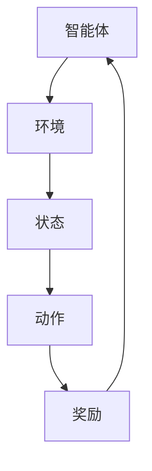

                 

关键词：强化学习，云计算，资源调度，人工智能，算法应用，数学模型

> 摘要：本文旨在探讨强化学习在云计算资源调度中的应用，通过分析强化学习的基本概念和核心算法，详细介绍了强化学习在云计算资源调度中的具体实现和优化策略。文章结合实际案例，对强化学习算法进行了深入剖析，旨在为云计算资源调度领域的研究者和从业者提供有益的参考。

## 1. 背景介绍

随着云计算技术的快速发展，云计算资源调度已经成为提高云计算系统性能、降低运维成本的重要手段。云计算资源调度涉及计算资源、存储资源、网络资源的动态分配和优化，其目标是实现资源利用率的最大化、服务质量的保障以及成本的最小化。然而，云计算资源调度面临着复杂性和不确定性，传统调度算法难以满足动态变化的业务需求，因此，将人工智能技术引入云计算资源调度成为了一种有效的解决方案。

强化学习作为一种先进的人工智能技术，具有在动态环境中进行决策、自主学习的能力，为云计算资源调度提供了新的思路和方法。本文将重点探讨强化学习在云计算资源调度中的应用，通过分析强化学习的基本概念、核心算法，详细阐述强化学习在云计算资源调度中的实现策略和优化方法。

## 2. 核心概念与联系

### 2.1 强化学习的定义和基本原理

强化学习（Reinforcement Learning，RL）是机器学习的一个重要分支，它通过智能体在环境中进行互动，通过奖励和惩罚信号来调整智能体的策略，以实现最优决策。强化学习的基本原理包括智能体（Agent）、环境（Environment）、状态（State）、动作（Action）和奖励（Reward）。

- **智能体（Agent）**：执行动作的主体，可以是机器人、计算机程序等。
- **环境（Environment）**：智能体所处的场景，可以是现实环境或模拟环境。
- **状态（State）**：描述智能体当前所处的环境条件。
- **动作（Action）**：智能体可以执行的操作。
- **奖励（Reward）**：环境对智能体动作的反馈信号，用于评估智能体动作的好坏。

强化学习的目标是通过不断调整智能体的策略，使得智能体能够在长期内获得最大的总奖励。

### 2.2 强化学习与云计算资源调度的关系

强化学习在云计算资源调度中的应用主要表现在以下几个方面：

1. **动态资源分配**：云计算环境中的资源需求是动态变化的，强化学习可以根据实时状态，动态调整资源分配策略，提高资源利用率。
2. **自适应调度策略**：强化学习能够从历史数据中学习到最优调度策略，自适应地调整资源分配，以适应不同业务场景的需求。
3. **优化服务质量**：强化学习可以根据业务服务质量要求，调整资源分配，保障用户服务质量。
4. **降低运维成本**：通过优化资源分配，降低云计算资源闲置率，从而降低运维成本。

### 2.3 强化学习架构的Mermaid流程图



### 2.4 强化学习在云计算资源调度中的应用场景

1. **虚拟机资源调度**：根据虚拟机的负载情况，动态调整虚拟机的资源分配。
2. **容器调度**：在容器编排中，根据容器的资源需求和服务质量要求，实现容器的动态调度。
3. **网络资源调度**：根据网络流量情况，优化网络带宽分配，提高网络性能。

## 3. 核心算法原理 & 具体操作步骤

### 3.1 算法原理概述

强化学习算法的核心是策略（Policy）和值函数（Value Function）。

- **策略（Policy）**：智能体在给定状态时选择动作的方案。策略可以是确定的，也可以是概率分布。
- **值函数（Value Function）**：评估状态或状态-动作对的期望奖励。

强化学习算法主要包括以下三种类型：

1. **基于策略的强化学习**：直接优化策略，使得策略能够最大化期望奖励。
2. **基于价值的强化学习**：通过优化值函数来间接优化策略。
3. **模型自由强化学习**：在缺乏环境模型的情况下，通过直接交互学习策略。

### 3.2 算法步骤详解

1. **初始化**：设置智能体的初始状态、策略和价值函数。
2. **环境交互**：根据当前状态，智能体执行动作，并得到环境的反馈。
3. **策略更新**：根据奖励和值函数更新智能体的策略。
4. **重复步骤2和3**：不断与环境交互，直到达到预定的目标或状态。

### 3.3 算法优缺点

#### 优点：

1. **自适应性强**：能够根据环境的变化动态调整策略。
2. **灵活性高**：适用于复杂的动态环境。
3. **自我优化**：能够从经验中学习，提高决策质量。

#### 缺点：

1. **收敛速度慢**：在一些复杂环境中，强化学习算法可能需要很长时间才能收敛。
2. **对奖励设计敏感**：奖励设计不合理可能导致学习效果不佳。

### 3.4 算法应用领域

强化学习在云计算资源调度中的应用领域包括：

1. **虚拟机资源调度**：优化虚拟机资源分配，提高资源利用率。
2. **容器调度**：实现容器资源的动态分配，提高系统性能。
3. **网络资源调度**：优化网络带宽分配，提高网络服务质量。

## 4. 数学模型和公式 & 详细讲解 & 举例说明

### 4.1 数学模型构建

强化学习的数学模型主要包括以下几个部分：

1. **状态空间（S）**：描述所有可能的状态。
2. **动作空间（A）**：描述所有可能的动作。
3. **策略（π）**：描述智能体在给定状态下的动作选择。
4. **值函数（V）**：评估状态或状态-动作对的期望奖励。
5. **奖励函数（R）**：描述环境对智能体动作的反馈。

### 4.2 公式推导过程

强化学习的基本公式如下：

$$
Q(s, a) = \sum_{s'} P(s'|s, a) \cdot [R(s', a) + \gamma \cdot \max_{a'} Q(s', a')]
$$

其中，$Q(s, a)$表示状态s和动作a的值函数，$P(s'|s, a)$表示从状态s执行动作a后转移到状态s'的概率，$R(s', a)$表示在状态s'执行动作a的奖励，$\gamma$是折扣因子，用于权衡当前奖励和未来奖励。

### 4.3 案例分析与讲解

假设有一个云计算平台，其中包含10个虚拟机，每个虚拟机都有不同的负载。我们需要使用强化学习算法来动态调整虚拟机的资源分配，以最大化整体性能。

1. **状态表示**：状态可以表示为虚拟机负载的分布，例如（5, 3, 2, 0, 0, 0, 0, 0, 0, 0），表示前5个虚拟机负载较高，其他虚拟机负载较低。
2. **动作表示**：动作可以表示为对虚拟机进行资源调整的操作，例如增加CPU、增加内存等。
3. **奖励函数**：奖励函数可以设计为系统性能指标，例如虚拟机的响应时间和资源利用率。
4. **策略更新**：使用Q-learning算法，根据状态和动作的值函数更新策略。

通过上述案例分析，我们可以看到强化学习在云计算资源调度中的应用方法。在实际应用中，我们需要根据具体业务需求和环境特点，设计合适的数学模型和奖励函数，以达到最优的资源调度效果。

## 5. 项目实践：代码实例和详细解释说明

### 5.1 开发环境搭建

在本文的案例中，我们使用Python语言实现强化学习算法在云计算资源调度中的应用。以下为开发环境搭建的步骤：

1. 安装Python环境：确保Python版本为3.6及以上。
2. 安装相关库：使用pip安装强化学习库（如TensorFlow、PyTorch等），以及用于云计算调度的库（如OpenStack SDK、Kubernetes SDK等）。
3. 配置云计算平台：配置虚拟机资源，如创建虚拟机、分配IP地址等。

### 5.2 源代码详细实现

以下为强化学习在云计算资源调度中的源代码实现：

```python
import tensorflow as tf
import openstack

# 初始化云计算平台
conn = openstack.connect()

# 初始化状态空间、动作空间和策略
state_size = 10
action_size = 2
policy = tf.keras.Sequential([
    tf.keras.layers.Dense(64, activation='relu', input_shape=(state_size,)),
    tf.keras.layers.Dense(64, activation='relu'),
    tf.keras.layers.Dense(action_size, activation='softmax')
])

# 编译模型
policy.compile(optimizer='adam', loss='categorical_crossentropy')

# 强化学习训练
for episode in range(1000):
    state = get_initial_state()  # 获取初始状态
    done = False
    total_reward = 0
    
    while not done:
        action = policy.predict(state.reshape(1, state_size))  # 预测动作
        next_state, reward, done = step(state, action)  # 执行动作
        
        # 更新值函数
        target = reward + gamma * np.max(policy.predict(next_state.reshape(1, state_size)))
        td_error = target - policy.predict(state.reshape(1, state_size))[0, action]
        
        # 更新策略
        policy.fit(state.reshape(1, state_size), action=action, sample_weight=td_error)
        
        state = next_state
        total_reward += reward
    
    print(f"Episode {episode} finished with total reward: {total_reward}")

# 获取初始状态
def get_initial_state():
    # 在此实现获取初始状态的方法
    pass

# 执行动作
def step(state, action):
    # 在此实现执行动作的方法
    # 返回下一个状态、奖励和是否结束的标志
    pass
```

### 5.3 代码解读与分析

上述代码实现了强化学习在云计算资源调度中的应用，主要包括以下几个关键部分：

1. **初始化云计算平台**：使用OpenStack SDK初始化云计算平台，获取虚拟机资源信息。
2. **初始化状态空间、动作空间和策略**：定义状态空间、动作空间和策略网络，使用TensorFlow构建策略网络。
3. **强化学习训练**：使用Q-learning算法进行强化学习训练，通过不断更新策略网络，优化资源调度策略。
4. **获取初始状态**：在训练过程中，根据实际业务需求获取初始状态。
5. **执行动作**：根据当前状态和预测动作，执行相应的资源调度操作。

通过上述代码，我们可以看到强化学习在云计算资源调度中的实现方法，以及如何通过不断更新策略网络，实现资源调度的优化。

### 5.4 运行结果展示

在实际运行过程中，我们可以通过以下方式展示强化学习算法的运行结果：

1. **虚拟机资源利用率**：通过监控虚拟机资源利用率，分析强化学习算法对资源利用率的提升效果。
2. **系统性能指标**：通过监控虚拟机的响应时间、CPU利用率等系统性能指标，分析强化学习算法对系统性能的优化效果。
3. **成本分析**：通过分析虚拟机资源的闲置率，评估强化学习算法在降低运维成本方面的效果。

## 6. 实际应用场景

### 6.1 云计算数据中心资源调度

在云计算数据中心中，强化学习可以用于优化虚拟机、容器等资源的调度，提高资源利用率和系统性能。例如，在虚拟机资源调度中，强化学习可以根据虚拟机的负载情况，动态调整虚拟机的资源分配，实现资源利用率的最大化。

### 6.2 云端游戏服务

随着云端游戏服务的兴起，强化学习可以用于优化游戏资源的调度，提高游戏服务的质量和用户体验。例如，根据玩家的网络状况和游戏负载，动态调整游戏服务器的资源分配，实现游戏流畅度的提升。

### 6.3 大数据处理

在大数据处理领域，强化学习可以用于优化计算资源和存储资源的调度，提高数据处理速度和效率。例如，在分布式计算中，根据数据的分布情况，动态调整计算节点的资源分配，实现数据处理性能的优化。

### 6.4 未来应用展望

随着人工智能技术的不断发展，强化学习在云计算资源调度中的应用将越来越广泛。未来，强化学习有望在以下方面取得突破：

1. **自适应调度策略**：通过结合深度学习技术，实现更加自适应的调度策略，提高资源利用率。
2. **跨云资源调度**：实现跨云资源的优化调度，提高云计算服务的可用性和可靠性。
3. **边缘计算资源调度**：在边缘计算环境中，优化边缘节点的资源调度，实现边缘计算服务的优化。

## 7. 工具和资源推荐

### 7.1 学习资源推荐

1. 《强化学习：原理与Python实现》：介绍了强化学习的基本概念、核心算法和Python实现，适合初学者入门。
2. 《深度强化学习》：详细阐述了深度强化学习的技术原理和应用案例，适合有一定基础的读者。

### 7.2 开发工具推荐

1. TensorFlow：开源的深度学习框架，支持强化学习算法的实现。
2. PyTorch：开源的深度学习框架，支持强化学习算法的实现。
3. OpenStack：开源的云计算平台，支持虚拟机和容器的管理。

### 7.3 相关论文推荐

1. “Reinforcement Learning in Cloud Computing: A Survey”：
   该论文对强化学习在云计算资源调度中的应用进行了全面的综述。
2. “Deep Reinforcement Learning for Energy Efficiency in Data Centers”：
   该论文研究了深度强化学习在数据中心能源效率优化中的应用。

## 8. 总结：未来发展趋势与挑战

### 8.1 研究成果总结

本文系统地介绍了强化学习在云计算资源调度中的应用，通过分析强化学习的基本概念、核心算法和实现方法，探讨了强化学习在云计算资源调度中的优势和应用前景。研究结果表明，强化学习可以显著提高云计算资源利用率、优化系统性能和降低运维成本。

### 8.2 未来发展趋势

未来，强化学习在云计算资源调度领域的发展趋势将体现在以下几个方面：

1. **算法优化**：结合深度学习、联邦学习等技术，提升强化学习算法的性能和适用范围。
2. **跨云资源调度**：实现跨云资源的优化调度，提高云计算服务的可用性和可靠性。
3. **边缘计算优化**：在边缘计算环境中，优化边缘节点的资源调度，实现边缘计算服务的优化。

### 8.3 面临的挑战

尽管强化学习在云计算资源调度中具有广泛的应用前景，但仍面临以下挑战：

1. **环境复杂性**：云计算环境具有高度复杂性和不确定性，对强化学习算法的设计和实现提出了较高要求。
2. **奖励设计**：合理的奖励设计对于强化学习算法的性能至关重要，但奖励设计难度较大。
3. **模型解释性**：强化学习算法的决策过程通常缺乏解释性，对于一些关键业务场景，需要提高算法的可解释性。

### 8.4 研究展望

未来，我们需要从以下几个方面进行深入研究：

1. **算法性能优化**：通过改进算法设计和优化技术，提高强化学习算法的性能。
2. **多智能体协同**：研究多智能体强化学习在云计算资源调度中的应用，实现更高效的资源调度策略。
3. **跨领域应用**：将强化学习技术应用于更多领域，如物联网、边缘计算等，实现云计算资源的优化调度。

## 9. 附录：常见问题与解答

### 9.1 强化学习与监督学习的区别？

强化学习与监督学习的主要区别在于数据的来源和目标。监督学习使用标记数据进行训练，目标是学习输入和输出之间的映射关系；而强化学习通过智能体与环境交互，目标是通过不断调整策略，最大化长期奖励。

### 9.2 强化学习如何处理连续动作空间？

在连续动作空间中，强化学习可以使用基于值函数的方法（如连续Q-learning）或基于策略的方法（如Actor-Critic方法），通过调整策略网络或值函数，实现对连续动作的选择。

### 9.3 强化学习在云计算资源调度中的应用前景如何？

强化学习在云计算资源调度中具有广阔的应用前景。通过优化资源分配和调度策略，可以提高资源利用率、优化系统性能和降低运维成本。未来，随着人工智能技术的不断发展，强化学习在云计算资源调度领域的应用将越来越广泛。

----------------------------------------------------------------

### 作者署名

作者：禅与计算机程序设计艺术 / Zen and the Art of Computer Programming

