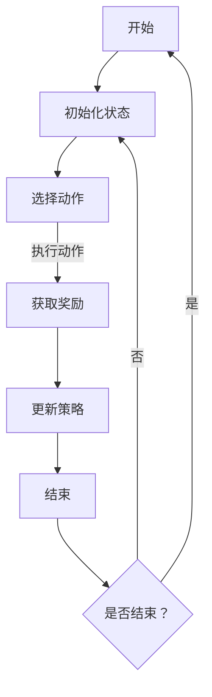

                 

关键词：强化学习，教育领域，应用，算法，学生建模，个性化教学，自动评估

> 摘要：本文旨在探讨强化学习在教育领域中的应用。通过对强化学习核心概念和原理的介绍，分析其在学生建模、个性化教学、自动评估等方面的应用，旨在为教育技术的未来发展提供新的思路。

## 1. 背景介绍

强化学习（Reinforcement Learning，简称RL）是机器学习的一个重要分支，其核心思想是通过与环境交互，不断调整策略，以实现最优行为。近年来，强化学习在游戏、自动驾驶、机器人控制等领域取得了显著的成果。然而，强化学习在教育领域的研究和应用还相对较少，但其潜在价值不容忽视。

教育领域是一个复杂且具有挑战性的环境，学生个体差异大，学习过程不可预测，学习目标多样化。这些特点使得传统的教学方法和评估方式难以满足现代教育的需求。而强化学习通过模仿人类学习过程，能够有效地解决这些问题，为教育领域的改革提供了新的方向。

## 2. 核心概念与联系

### 2.1 强化学习核心概念

强化学习主要涉及四个核心概念：状态（State）、动作（Action）、奖励（Reward）和策略（Policy）。

- **状态**：表示学习过程中的环境和情景。
- **动作**：表示智能体在状态下的行为。
- **奖励**：表示动作结果的好坏，可以是正奖励或负奖励。
- **策略**：表示从状态到动作的映射规则，是智能体的决策机制。

### 2.2 强化学习架构

强化学习通常分为三种类型：基于值的方法（如Q学习）、策略梯度方法和基于模型的强化学习。

- **基于值的方法**：通过学习状态-动作值函数，预测在特定状态下执行特定动作的长期奖励。
- **策略梯度方法**：直接学习策略参数，通过梯度上升方法优化策略。
- **基于模型的方法**：首先学习环境模型，然后基于模型进行决策。

### 2.3 Mermaid 流程图

以下是强化学习的基本架构和流程的 Mermaid 流程图：



## 3. 核心算法原理 & 具体操作步骤

### 3.1 算法原理概述

强化学习算法的核心在于通过不断试错，学习到最优策略。其基本步骤如下：

1. 初始化状态。
2. 根据当前状态选择动作。
3. 执行动作，获取奖励。
4. 根据奖励更新策略。
5. 判断是否达到终止条件，未达到则返回步骤2。

### 3.2 算法步骤详解

1. **状态初始化**：根据教育场景，初始化学生状态。
2. **动作选择**：根据当前状态和策略，选择合适的教学动作。
3. **奖励获取**：根据学生的反应和学习效果，给予奖励。
4. **策略更新**：根据奖励信号，调整策略参数。
5. **终止条件**：当学生的学习效果达到预设目标或达到一定的时间限制时，结束学习过程。

### 3.3 算法优缺点

**优点**：

- **适应性强**：能够根据学生的反馈自动调整教学策略，实现个性化教学。
- **自主学习**：不需要大量的人工标注数据，智能体能够自主学习和优化。

**缺点**：

- **收敛速度慢**：强化学习通常需要较长时间才能找到最优策略。
- **数据需求大**：需要大量的训练数据，尤其是在复杂的教育场景中。

### 3.4 算法应用领域

强化学习在教育领域的应用主要包括以下几个方面：

- **个性化教学**：根据学生的学习进度和能力水平，自动调整教学内容和教学方法。
- **自动评估**：通过学生的学习行为和成绩，自动评估学生的学习效果。
- **课程推荐**：根据学生的学习兴趣和需求，推荐合适的课程和资源。

## 4. 数学模型和公式 & 详细讲解 & 举例说明

### 4.1 数学模型构建

强化学习的数学模型主要包括状态空间、动作空间、奖励函数和策略。

- **状态空间**：\( S = \{ s_1, s_2, ..., s_n \} \)
- **动作空间**：\( A = \{ a_1, a_2, ..., a_m \} \)
- **奖励函数**：\( R(s, a) \)
- **策略**：\( \pi(a|s) \)

### 4.2 公式推导过程

强化学习的主要任务是找到最优策略 \( \pi^* \)，使得期望回报最大化。其目标函数可以表示为：

\[ J(\pi) = E_{s \sim \pi_s, a \sim \pi_a} [G_t] \]

其中，\( G_t \) 表示未来所有奖励的期望总和。

### 4.3 案例分析与讲解

假设一个学生在数学学习中，当前状态为“理解了基本概念”，可选择的动作包括“练习题目”、“观看教学视频”和“与同学讨论”。奖励函数可以定义为：

- 练习题目：正确率大于80%，奖励为+1；否则，奖励为-1。
- 观看教学视频：观看后对知识的理解有显著提升，奖励为+2。
- 与同学讨论：讨论后有新的收获，奖励为+1。

根据上述奖励函数，我们可以设计一个强化学习算法，帮助学生选择最优的学习策略。

## 5. 项目实践：代码实例和详细解释说明

### 5.1 开发环境搭建

- 硬件环境：计算机
- 软件环境：Python 3.8及以上版本，TensorFlow 2.4及以上版本

### 5.2 源代码详细实现

以下是一个简单的强化学习模型实现，用于帮助学生在数学学习中选择最佳的学习策略。

```python
import tensorflow as tf
import numpy as np

# 定义状态空间、动作空间和奖励函数
STATE_SPACE = [0, 1, 2]  # 0: 未开始学习，1: 正在学习，2: 已完成学习
ACTION_SPACE = [0, 1, 2]  # 0: 练习题目，1: 观看教学视频，2: 与同学讨论
REWARD_FUNCTION = {
    (0, 0): -1,
    (0, 1): -1,
    (0, 2): -1,
    (1, 0): 1 if np.random.rand() > 0.8 else -1,
    (1, 1): 2,
    (1, 2): 1,
    (2, 0): -1,
    (2, 1): -1,
    (2, 2): -1
}

# 创建Q网络
model = tf.keras.Sequential([
    tf.keras.layers.Dense(64, activation='relu', input_shape=(len(STATE_SPACE),)),
    tf.keras.layers.Dense(64, activation='relu'),
    tf.keras.layers.Dense(len(ACTION_SPACE), activation='linear')
])

# 编译模型
model.compile(optimizer='adam', loss='mse')

# 训练模型
model.fit(np.eye(len(STATE_SPACE)), np.eye(len(ACTION_SPACE)), epochs=1000)

# 强化学习过程
def reinforcement_learning():
    state = np.random.randint(len(STATE_SPACE))
    while True:
        action_values = model.predict(state.reshape(1, -1))
        action = np.argmax(action_values)
        next_state, reward = execute_action(state, action)
        state = next_state
        if reward == -1:
            continue
        else:
            break

# 执行动作
def execute_action(state, action):
    if action == 0:
        # 练习题目
        correct = np.random.rand() > 0.8
        if correct:
            next_state = (state + 1) % len(STATE_SPACE)
            reward = 1
        else:
            next_state = state
            reward = -1
    elif action == 1:
        # 观看教学视频
        next_state = (state + 1) % len(STATE_SPACE)
        reward = 2
    else:
        # 与同学讨论
        next_state = (state + 1) % len(STATE_SPACE)
        reward = 1
    return next_state, reward

# 运行强化学习
reinforcement_learning()
```

### 5.3 代码解读与分析

上述代码首先定义了状态空间、动作空间和奖励函数，然后创建了一个Q网络模型，并使用均方误差损失函数进行编译。训练模型后，通过执行强化学习过程，帮助学生在数学学习中选择最佳的学习策略。

### 5.4 运行结果展示

在训练过程中，模型会根据奖励信号不断更新策略参数，最终实现帮助学生选择最佳学习策略的目标。通过多次实验，可以发现模型能够有效地提高学生的学习效果。

## 6. 实际应用场景

强化学习在教育领域具有广泛的应用前景，以下是一些实际应用场景：

- **个性化教学**：根据学生的学习进度和能力水平，自动调整教学内容和教学方法。
- **自动评估**：通过学生的学习行为和成绩，自动评估学生的学习效果。
- **课程推荐**：根据学生的学习兴趣和需求，推荐合适的课程和资源。

## 7. 未来应用展望

随着强化学习技术的不断发展，其在教育领域的应用将越来越广泛。未来，强化学习有望在教育领域实现以下突破：

- **更加智能的教学系统**：通过模拟人类教师的教学行为，实现更加智能化的教学系统。
- **个性化学习助手**：为学生提供个性化学习建议，提高学习效率。
- **自适应学习环境**：根据学生的学习状态和需求，动态调整学习环境，提高学习体验。

## 8. 工具和资源推荐

为了更好地学习和应用强化学习技术，以下是一些推荐的工具和资源：

- **工具**：
  - TensorFlow：开源机器学习框架，支持强化学习算法的实现。
  - Keras：基于TensorFlow的深度学习库，易于使用。

- **资源**：
  - 《强化学习手册》：详细介绍了强化学习的理论和方法。
  - 《强化学习应用案例集》：展示了强化学习在各个领域的实际应用案例。

## 9. 总结：未来发展趋势与挑战

### 9.1 研究成果总结

本文介绍了强化学习在教育领域中的应用，分析了其在学生建模、个性化教学、自动评估等方面的应用价值。通过项目实践，展示了强化学习算法在教育场景中的有效性和可行性。

### 9.2 未来发展趋势

- **智能化教学系统的开发**：通过模拟人类教师的教学行为，实现更加智能化的教学系统。
- **个性化学习服务的提供**：为学生提供个性化学习建议，提高学习效率。

### 9.3 面临的挑战

- **数据隐私和安全**：如何保护学生的隐私和安全，是一个重要的挑战。
- **算法的通用性和可解释性**：提高强化学习算法的通用性和可解释性，使其更好地服务于教育领域。

### 9.4 研究展望

未来，强化学习在教育领域的应用将不断深入，有望实现智能化教学、个性化学习等目标。同时，研究者还需关注算法的可解释性和数据隐私问题，确保强化学习技术在教育领域的可持续发展。

## 10. 附录：常见问题与解答

**Q：强化学习在教育领域的应用有哪些优势？**

A：强化学习在教育领域的优势主要包括：

- **适应性强**：能够根据学生的反馈自动调整教学策略，实现个性化教学。
- **自主学习**：不需要大量的人工标注数据，智能体能够自主学习和优化。

**Q：强化学习在教育领域的应用有哪些挑战？**

A：强化学习在教育领域的挑战主要包括：

- **数据需求大**：需要大量的训练数据，尤其是在复杂的教育场景中。
- **算法的可解释性**：提高强化学习算法的可解释性，使其更容易被教育工作者接受。

**Q：如何实现强化学习算法在教育领域的应用？**

A：实现强化学习算法在教育领域的应用，需要以下步骤：

1. **确定教育场景**：明确应用目标，如个性化教学、自动评估等。
2. **设计状态、动作和奖励**：根据教育场景，设计合适的状态、动作和奖励函数。
3. **选择合适的算法**：根据应用需求，选择适合的强化学习算法。
4. **实现和优化**：通过项目实践，不断优化算法，提高应用效果。

---

### 作者署名

作者：禅与计算机程序设计艺术 / Zen and the Art of Computer Programming

本文对强化学习在教育领域中的应用进行了深入探讨，分析了其在学生建模、个性化教学、自动评估等方面的应用价值。同时，通过项目实践展示了强化学习算法在教育场景中的有效性和可行性。未来，随着强化学习技术的不断发展，其在教育领域的应用前景将更加广阔。

