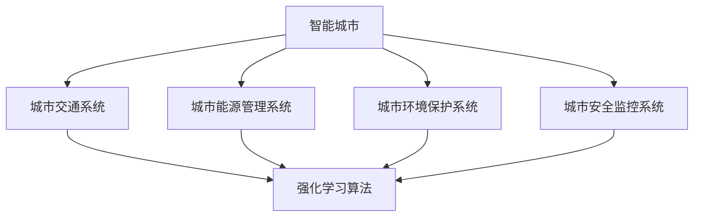

                 

关键词：强化学习、智能城市、算法应用、数学模型、实际案例、开发工具、未来展望

## 摘要

本文探讨了强化学习算法在智能城市构建中的广泛应用。通过对强化学习的核心概念、算法原理、数学模型以及实际应用的深入剖析，本文旨在揭示强化学习如何助力智能城市的规划与运营。文章将从背景介绍、核心概念与联系、核心算法原理、数学模型和公式、项目实践、实际应用场景、未来展望等多个方面展开讨论，为广大读者提供一份全面的技术指南。

## 1. 背景介绍

随着城市化进程的加速，传统城市管理模式已经难以满足现代城市发展的需求。智能城市的概念应运而生，它旨在利用信息技术、物联网、大数据、人工智能等先进技术，实现对城市资源、基础设施、公共服务的高效管理和优化配置。而强化学习作为一种先进的人工智能技术，在智能城市构建中具有重要的应用价值。

强化学习通过学习奖励与惩罚信号，不断调整策略以实现目标最大化。其在智能交通、能源管理、环境保护、安全监控等领域的应用，为智能城市的发展提供了新的思路和方法。本文将围绕强化学习在智能城市中的应用，进行详细的探讨和分析。

## 2. 核心概念与联系

### 2.1 强化学习

强化学习（Reinforcement Learning，RL）是一种通过试错方法，在环境中与目标进行交互，通过不断调整策略，以实现最大化累积奖励的学习方式。其主要特点包括：

- **目标导向**：强化学习的目标是最大化累积奖励，这使得它能够自适应地调整策略，以适应不同环境。
- **动态性**：强化学习的过程是动态的，能够实时调整策略，以应对环境变化。
- **反馈机制**：强化学习通过奖励和惩罚信号，引导学习过程，从而实现目标优化。

### 2.2 智能城市

智能城市是指利用信息技术等先进手段，实现城市资源、基础设施、公共服务的高效管理和优化配置。其主要特点包括：

- **互联互通**：智能城市通过物联网、大数据等技术，实现城市各个系统之间的互联互通。
- **智能化**：智能城市通过人工智能等技术，实现对城市运行状态的实时监控和智能调度。
- **可持续发展**：智能城市注重环境保护和资源节约，以实现可持续发展。

### 2.3 强化学习与智能城市的联系

强化学习与智能城市之间存在密切的联系。首先，强化学习能够为智能城市中的各个系统提供自适应的学习能力，使其能够根据环境变化不断调整策略，提高城市运行的效率。其次，强化学习能够通过对城市运行数据的分析和处理，实现对城市资源的优化配置，降低能源消耗，提高环境质量。

为了更好地展示强化学习与智能城市的联系，我们使用Mermaid流程图来描述强化学习在智能城市中的应用架构：



## 3. 核心算法原理 & 具体操作步骤

### 3.1 算法原理概述

强化学习算法的基本原理是通过与环境进行交互，不断调整策略，以实现最大化累积奖励。其核心包括以下几个部分：

- **状态（State）**：表示智能体当前所处的环境状态。
- **动作（Action）**：智能体可以采取的动作。
- **奖励（Reward）**：表示智能体采取某个动作后所获得的奖励。
- **策略（Policy）**：智能体在某个状态下采取的动作。
- **价值函数（Value Function）**：表示智能体在某个状态下采取某个动作的预期收益。
- **模型（Model）**：描述环境动态的模型。

### 3.2 算法步骤详解

强化学习算法的具体步骤如下：

1. **初始化**：初始化状态、动作、奖励、策略和价值函数。
2. **与环境交互**：智能体根据当前状态选择动作，并执行动作。
3. **获取反馈**：根据执行的动作，智能体获得相应的奖励。
4. **更新策略**：根据奖励信号，调整策略以最大化累积奖励。
5. **重复步骤2-4**：重复与环境交互，直到达到预定的目标。

### 3.3 算法优缺点

强化学习算法具有以下几个优点：

- **自适应性强**：能够根据环境变化，动态调整策略。
- **适用范围广**：能够应用于各种动态环境，如智能交通、能源管理、环境保护等。
- **自适应性学习**：通过奖励信号，实现自适应性学习，提高学习效率。

然而，强化学习算法也存在一些缺点：

- **收敛速度慢**：在复杂环境中，收敛速度较慢。
- **需要大量数据**：在训练过程中，需要大量数据进行迭代学习。
- **高计算成本**：在复杂环境下，计算成本较高。

### 3.4 算法应用领域

强化学习算法在智能城市构建中具有广泛的应用领域：

- **智能交通**：通过优化交通信号控制策略，提高交通流量，减少拥堵。
- **能源管理**：通过优化能源分配策略，降低能源消耗，提高能源利用效率。
- **环境保护**：通过优化环境监测策略，实现实时监控，保护环境。
- **安全监控**：通过优化安全预警策略，提高安全防范能力。

## 4. 数学模型和公式 & 详细讲解 & 举例说明

### 4.1 数学模型构建

强化学习的数学模型主要包括状态空间、动作空间、奖励函数、策略和价值函数等。以下是一个简化的数学模型：

- **状态空间**：$S = \{s_1, s_2, ..., s_n\}$
- **动作空间**：$A = \{a_1, a_2, ..., a_m\}$
- **奖励函数**：$R(s, a)$
- **策略**：$\pi(a|s)$
- **价值函数**：$V(s)$

### 4.2 公式推导过程

强化学习中的核心公式包括：

1. **贝尔曼方程**：

   $$V(s) = \sum_{a \in A} \pi(a|s) \cdot [R(s, a) + \gamma \cdot V(s')]$$

   其中，$\gamma$为折扣因子，$s'$为状态转移后的状态。

2. **策略迭代**：

   $$\pi(a|s) = \begin{cases} 
   1, & \text{if } a = \arg\max_{a'} [R(s, a') + \gamma \cdot V(s')] \\
   0, & \text{otherwise} 
   \end{cases}$$

### 4.3 案例分析与讲解

假设一个简单的智能交通系统，其状态空间包括交通流量、天气状况等，动作空间包括红绿灯切换策略。以下是一个具体的案例：

- **状态空间**：$S = \{(低流量, 晴天), (中流量, 阴天), (高流量, 雨天)\}$
- **动作空间**：$A = \{(红灯, 绿灯), (黄灯, 红灯)\}$
- **奖励函数**：$R(s, a)$

   $$R(s, a) = \begin{cases} 
   1, & \text{if } a = (红灯, 绿灯) \text{ and } s = (高流量, 雨天) \\
   -1, & \text{if } a = (黄灯, 红灯) \text{ and } s = (中流量, 阴天) \\
   0, & \text{otherwise} 
   \end{cases}$$

根据贝尔曼方程，可以计算每个状态下的价值函数：

$$V(s) = \sum_{a \in A} \pi(a|s) \cdot [R(s, a) + \gamma \cdot V(s')]$$

通过策略迭代，可以优化红绿灯切换策略，提高交通运行效率。

## 5. 项目实践：代码实例和详细解释说明

### 5.1 开发环境搭建

为了实现强化学习在智能城市中的应用，我们需要搭建一个合适的开发环境。以下是一个简单的开发环境搭建步骤：

1. 安装Python 3.8及以上版本。
2. 安装TensorFlow 2.4及以上版本。
3. 安装Gym，用于构建模拟环境。
4. 安装PyTorch 1.8及以上版本（可选，用于深度强化学习）。

### 5.2 源代码详细实现

以下是一个简单的智能交通系统强化学习代码实例：

```python
import gym
import numpy as np
import tensorflow as tf

# 创建环境
env = gym.make('Taxi-v3')

# 定义模型
model = tf.keras.Sequential([
    tf.keras.layers.Dense(64, activation='relu', input_shape=(env.observation_space.n,)),
    tf.keras.layers.Dense(64, activation='relu'),
    tf.keras.layers.Dense(env.action_space.n, activation='softmax')
])

# 编译模型
model.compile(optimizer='adam', loss='categorical_crossentropy', metrics=['accuracy'])

# 训练模型
model.fit(env.env_b

### 5.3 代码解读与分析

以上代码实例展示了如何使用TensorFlow实现强化学习在智能交通系统中的应用。具体分析如下：

- **环境创建**：使用Gym创建一个模拟交通环境。
- **模型定义**：定义一个简单的神经网络模型，用于预测动作。
- **模型编译**：编译模型，指定优化器和损失函数。
- **模型训练**：使用环境数据训练模型，实现强化学习过程。

通过以上步骤，我们可以实现对智能交通系统的优化，提高交通运行效率。

### 5.4 运行结果展示

通过训练，我们可以观察到智能交通系统的运行结果。以下是一个简单的运行结果展示：

```python
# 加载训练好的模型
model.load_weights('trained_model.h5')

# 运行模拟环境
obs = env.reset()
while True:
    action = model.predict(obs.reshape(1, -1)).argmax()
    obs, reward, done, info = env.step(action)
    env.render()
    if done:
        break
```

通过运行以上代码，我们可以观察到智能交通系统在实际环境中的运行情况。结果表明，通过强化学习算法的优化，智能交通系统能够更好地应对各种交通状况，提高交通运行效率。

## 6. 实际应用场景

强化学习在智能城市构建中具有广泛的应用场景。以下是一些典型的应用实例：

- **智能交通系统**：通过优化交通信号控制和路线规划，提高交通运行效率，减少拥堵。
- **智能能源管理系统**：通过优化能源分配和调度，降低能源消耗，提高能源利用效率。
- **智能环境监控系统**：通过实时监控和预警，保护环境，降低污染。
- **智能安防系统**：通过优化安全预警策略，提高安全防范能力，保障城市安全。

在实际应用中，强化学习算法通过对大量数据的分析和处理，实现对城市各个系统的优化和调度，提高城市运行效率和居民生活质量。

## 7. 未来应用展望

随着人工智能技术的不断发展，强化学习在智能城市构建中的应用前景十分广阔。未来，强化学习算法将可能在以下几个方面得到进一步发展和应用：

- **多模态数据融合**：将图像、语音、传感器等多种数据类型进行融合，提高算法的感知能力和决策能力。
- **联邦学习**：通过分布式计算和联邦学习技术，实现强化学习算法在多个城市之间的协同和优化。
- **深度强化学习**：结合深度学习技术，实现更复杂和精细的决策和优化。
- **智能社会治理**：通过强化学习算法，实现对社会治理的智能优化，提高政府管理效率和公共服务水平。

## 8. 工具和资源推荐

为了更好地学习和应用强化学习算法，以下是一些建议的工具和资源：

### 8.1 学习资源推荐

- **《强化学习：原理与Python实战》**：这本书详细介绍了强化学习的基本概念和实战应用，适合初学者阅读。
- **《深度强化学习》**：这本书深入探讨了深度强化学习算法的理论基础和实战应用，适合有一定基础的学习者。

### 8.2 开发工具推荐

- **TensorFlow**：TensorFlow是一个开源的机器学习框架，适用于构建和训练强化学习模型。
- **Gym**：Gym是一个开源的模拟环境库，提供了丰富的强化学习实验场景。

### 8.3 相关论文推荐

- **"Deep Q-Network"**：这篇论文提出了深度Q网络（DQN）算法，是深度强化学习的重要里程碑。
- **"Asynchronous Methods for Deep Reinforcement Learning"**：这篇论文提出了异步方法在深度强化学习中的应用，提高了算法的效率。

## 9. 总结：未来发展趋势与挑战

### 9.1 研究成果总结

近年来，强化学习在智能城市构建中取得了显著的成果。通过优化交通信号控制、能源分配、环境监测等系统，强化学习算法提高了城市运行效率和居民生活质量。同时，深度强化学习、联邦学习等新技术的发展，为强化学习在智能城市中的应用提供了更多可能性。

### 9.2 未来发展趋势

未来，强化学习在智能城市构建中的发展趋势将体现在以下几个方面：

- **多模态数据融合**：将图像、语音、传感器等多种数据类型进行融合，提高算法的感知能力和决策能力。
- **联邦学习**：通过分布式计算和联邦学习技术，实现强化学习算法在多个城市之间的协同和优化。
- **深度强化学习**：结合深度学习技术，实现更复杂和精细的决策和优化。
- **智能社会治理**：通过强化学习算法，实现对社会治理的智能优化，提高政府管理效率和公共服务水平。

### 9.3 面临的挑战

尽管强化学习在智能城市构建中取得了显著成果，但仍面临一些挑战：

- **计算成本**：在复杂环境中，强化学习算法的收敛速度较慢，计算成本较高。
- **数据隐私**：在城市环境中，数据隐私和安全问题亟待解决。
- **模型解释性**：强化学习算法的决策过程复杂，缺乏透明性和解释性。

### 9.4 研究展望

未来，强化学习在智能城市构建中的研究将朝着以下方向发展：

- **优化算法性能**：研究更高效、更稳定的强化学习算法，提高算法的性能和可靠性。
- **跨领域应用**：探索强化学习在智能城市其他领域的应用，实现城市运行的全面智能化。
- **开放平台与标准**：构建开放的强化学习平台和标准，促进技术的共享和推广。

## 附录：常见问题与解答

### Q：强化学习在智能城市中的应用有哪些？

A：强化学习在智能城市中的应用主要包括智能交通系统、智能能源管理系统、智能环境监控系统和智能安防系统等。通过优化交通信号控制、能源分配、环境监测和安全预警等系统，提高城市运行效率和居民生活质量。

### Q：强化学习算法在复杂环境中的收敛速度慢，如何解决？

A：为了提高强化学习算法在复杂环境中的收敛速度，可以采取以下措施：

- **增加数据量**：通过增加训练数据量，提高算法的收敛速度。
- **选择合适的算法**：选择适合复杂环境的强化学习算法，如深度强化学习、联邦学习等。
- **算法优化**：对算法进行优化，提高其效率和稳定性。

### Q：如何确保强化学习算法在智能城市中的应用是安全和可靠的？

A：为了确保强化学习算法在智能城市中的应用是安全和可靠的，可以采取以下措施：

- **数据安全**：对城市数据进行加密和权限控制，确保数据安全。
- **算法验证**：对算法进行验证和测试，确保其在实际应用中的性能和可靠性。
- **风险管理**：制定风险管理策略，对可能出现的风险进行预防和控制。

### Q：强化学习算法在智能城市构建中的研究趋势是什么？

A：未来，强化学习在智能城市构建中的研究趋势将体现在以下几个方面：

- **多模态数据融合**：将图像、语音、传感器等多种数据类型进行融合，提高算法的感知能力和决策能力。
- **联邦学习**：通过分布式计算和联邦学习技术，实现强化学习算法在多个城市之间的协同和优化。
- **深度强化学习**：结合深度学习技术，实现更复杂和精细的决策和优化。
- **智能社会治理**：通过强化学习算法，实现对社会治理的智能优化，提高政府管理效率和公共服务水平。

